# GoalJudge GCP Playwright Batch — Injection Plan (G1 via UI)

> **Purpose.** Satisfy gate **G1** (registry-joined batch re-run) against the hosted
> Cloud Run frontend at [https://agent-frontend-w65nrxwkiq-uc.a.run.app/](https://agent-frontend-w65nrxwkiq-uc.a.run.app/)
> instead of the local `scripts/run_goaljudge_synthetic_batch.py` CLI path. Prompts are
> injected through the real chat composer; traces must join Langfuse/eval capture with
> deterministic `trace_id`s from `case_registry.py`.
>
> **Pyramid tier:** L4 behavioral validation — on-demand only, never per-commit CI
> (`research/tdd_agentic_systems_prompt.md`).

---

## 1. Architecture fit

| Layer | Role in this batch |
|---|---|
| **Registry** (`tests/fixtures/goaljudge/case_registry.py`) | Source of truth for prompts + expected axes |
| **Export** (`scripts/export_goaljudge_registry_json.py`) | JSON bridge for TypeScript Playwright fixtures |
| **Playwright T3** (`frontend/e2e/full-stack/goaljudge-batch.spec.ts`) | Browser injection + capture |
| **Middleware / runtime** | Mint `trace_id`, run graph, emit GoalJudge eval rows (G2) |
| **Post-run** (`scripts/export_goaljudge_corpus.py`, `verify_goaljudge_coverage.py`) | Join + divergence mapping |

Dependencies flow **inward** — Playwright never imports Python; it reads exported JSON only.

---

## 2. Preconditions (must clear before first run)

| # | Requirement | Owner | Notes |
|---|---|---|---|
| P1 | WorkOS test user with access to the Cloud Run frontend | Ops | `E2E_USER_EMAIL` + password/OTP |
| P2 | `BASE_URL=https://agent-frontend-w65nrxwkiq-uc.a.run.app` | Runner | No local `webServer` — T3 against remote |
| P3 | Backend `/workspace` sandbox aligned with registry prompts | Eng (G3) | Prefer `/workspace/…` cases (GJ-001B, GJ-003B, GJ-016) |
| P4 | **`user_id=synthetic-saturation-user`** on eval rows | Eng | See §4 — critical for corpus scoping |
| P5 | Langfuse + `eval.goal_judge` export path live (G2/G4) | Telemetry | `healthz` shows file-backed goal_judge config |

---

## 3. Playwright injection design

### 3.1 Fixture pipeline

```mermaid
flowchart LR
  registry["case_registry.py"]
  export["export_goaljudge_registry_json.py"]
  json["goaljudge_registry.json"]
  pw["goaljudge-batch.spec.ts"]
  ui["Cloud Run chat UI"]
  runtime["LangGraph + GoalJudge"]
  lf["Langfuse / evals.log"]

  registry --> export --> json --> pw
  pw -->|"composer fill + send"| ui --> runtime --> lf
```



1. `python scripts/export_goaljudge_registry_json.py` — regenerates JSON after registry edits.
2. `frontend/e2e/fixtures/goaljudge_registry.ts` — loads cases, exposes `traceIdFor(caseId)`.
3. `frontend/e2e/full-stack/goaljudge-batch.spec.ts` — drives the batch.

### 3.2 Auth (existing T3 harness)

Reuse `e2e/global-setup.ts` + `authenticatedPage` fixture:

```bash
cd frontend
export BASE_URL="https://agent-frontend-w65nrxwkiq-uc.a.run.app"
export E2E_AUTHENTICATED=1
export E2E_USER_EMAIL="…"
export E2E_USER_PASSWORD="…"   # or E2E_USER_OTP
pnpm exec playwright test e2e/full-stack/goaljudge-batch.spec.ts --project=chromium-desktop
```

Do **not** set `E2E_FAKE_SESSION=1` against Cloud Run — the sealed cookie must match production
`WORKOS_COOKIE_PASSWORD`.

### 3.3 Per-case injection loop

For each `GoalJudgeCase` row (filter: `GJ-001`…`GJ-022` walkthrough subset, or full `LIVE_CASES`):

| Step | Action | Rationale |
|---|---|---|
| 1 | **New thread** | Isolates checkpoint state; mirrors one-case-per-session in CLI batch |
| 2 | **Optional metadata header** | If BFF supports `X-GoalJudge-Case-Id` / thread metadata, attach `case.id` + expected `trace_id` for join debugging (see §4) |
| 3 | **`sendMessage(page, case.prompt)`** | Uses `e2e/fixtures/helpers.ts` — same composer selectors as smoke |
| 4 | **`waitForResponse` + `waitForComposerReady`** | Run completion gate |
| 5 | **Capture artifact** | Screenshot on failure; scrape final assistant markdown; count `[data-testid='tool-card']` |
| 6 | **Append JSONL** | `cache/goaljudge_eval/ui_batch.jsonl` with `{case_id, trace_id, prompt, response_text, tool_card_count, finished_at}` |

**Failure paths first (TDD):** spec should assert composer rejects empty send and that
`trace-id.spec.ts` invariant holds — no client-generated `trace_id` in request bodies.

### 3.4 Selectors (verified against `Composer.tsx`)

| Element | Selector |
|---|---|
| Composer | `textarea[aria-label='Compose message']` |
| Send | `Meta+Enter` / `Ctrl+Enter` via `sendMessage()` |
| Assistant output | `[data-testid='message-content']`, `article[aria-live='polite']` |
| Tool cards | `[data-testid='tool-card']` |
| New thread | `[data-testid='new-thread']`, `button:has-text('New')` |

Add `data-testid="composer"` to `Composer.tsx` in a follow-up PR if remote DOM drifts.

### 3.5 Rate and cost controls

- `workers: 1`, `fullyParallel: false` (already in `playwright.config.ts`)
- `--grep` / env `GJ_CASE_FILTER=GJ-010` for single-case debugging
- Optional `GOALJUDGE_BATCH_LIMIT=22` for staged rollout
- `test.setTimeout(180_000)` per case (web_search / composite prompts)

---

## 4. Open engineering gap: `user_id` + deterministic `trace_id`

The CLI batch (`run_goaljudge_synthetic_batch.py`) sets:

- `user_id = "synthetic-saturation-user"`
- `trace_id = uuid.uuid5(NAMESPACE_DNS, case.id).hex`

The browser path today uses the **WorkOS `sub`** as `user_id` and lets the **Python runtime**
mint `trace_id`. That breaks G1/G2 join unless we bridge one of:

| Option | Change | Pros | Cons |
|---|---|---|---|
| **A (preferred)** | Map WorkOS test user → `synthetic-saturation-user` in middleware identity adapter for a dedicated test org | No UI change; export script unchanged | Requires middleware config |
| **B** | BFF passes `configurable.user_id` + `configurable.task_id=trace_id` when thread metadata contains `goaljudge_case_id` | Deterministic join from UI | Needs BFF + runtime contract extension |
| **C** | Post-hoc join on `goaljudge_case_id` in thread title/metadata instead of `trace_id` | Quick hack | Diverges from plan's uuid5 contract |

**Recommendation:** implement **A + B**: dedicated saturation test account (A) and thread
metadata carrying `goaljudge_case_id` for audit (B). Playwright sets thread title to
`gj:{case.id}:{trace_id}` until metadata API exists.

---

## 5. Implementation checklist

| ID | Task | Status |
|---|---|---|
| export-json | `scripts/export_goaljudge_registry_json.py` | done |
| ts-fixture | `frontend/e2e/fixtures/goaljudge_registry.ts` | done |
| spec-skeleton | `frontend/e2e/full-stack/goaljudge-batch.spec.ts` | done (skeleton) |
| composer-testid | Add `data-testid="composer"` to `Composer.tsx` | pending |
| user-id-bridge | Middleware/BFF saturation user mapping (§4 Option A) | done |
| trace-bridge | Thread metadata → `task_id`/`trace_id` (§4 Option B) | done |
| jsonl-writer | Append per-case capture file in spec or Node helper | done |
| g1-run | Execute full GJ-001…GJ-022 against Cloud Run | pending |
| g2-verify | Confirm non-zero `eval.goal_judge` rows + run `verify_goaljudge_coverage.py` | pending |
| walkthrough-regen | `generate_goaljudge_manual_walkthrough.py` after registry stable | pending |

---

## 6. Runbook (once §4 bridge lands)

```bash
# 1. Refresh JSON from registry
python scripts/export_goaljudge_registry_json.py

# 2. UI batch (example: single case smoke)
cd frontend
export BASE_URL="https://agent-frontend-w65nrxwkiq-uc.a.run.app"
export E2E_AUTHENTICATED=1
export E2E_USER_EMAIL="$SATURATION_USER_EMAIL"
export E2E_USER_PASSWORD="$SATURATION_USER_PASSWORD"
export GJ_CASE_FILTER="GJ-010"
pnpm exec playwright test e2e/full-stack/goaljudge-batch.spec.ts --project=chromium-desktop

# 3. Full walkthrough set
export GJ_CASE_FILTER=""
export GOALJUDGE_BATCH_LIMIT=22
pnpm exec playwright test e2e/full-stack/goaljudge-batch.spec.ts --project=chromium-desktop

# 4. Export + verify (after G2 path live)
python scripts/export_goaljudge_corpus.py
python scripts/verify_goaljudge_coverage.py --corpus cache/goaljudge_eval/run.jsonl
```

---

## 7. Acceptance (G1 cleared)

- [ ] `set(exported_trace_ids) == set(uuid5(case.id) for case in batch)`
- [ ] No foreign rows under `synthetic-saturation-user` scope
- [ ] `eval.goal_judge` rows present for ≥ GJ-001…GJ-022
- [ ] Divergences recorded, not re-rolled (J2/J3 evidence preserved)
