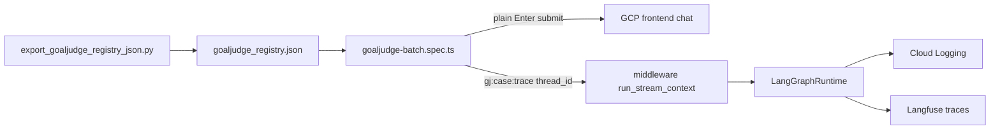

# GoalJudge GCP Playwright — Execution Plan

> **Purpose.** Operational runbook to execute the staged GoalJudge UI batch (G1 gate) against
> the hosted Cloud Run frontend at
> [https://agent-frontend-w65nrxwkiq-uc.a.run.app/](https://agent-frontend-w65nrxwkiq-uc.a.run.app/).
> Builds on the injection design in
> [`goaljudge_gcp_playwright_batch.plan.md`](goaljudge_gcp_playwright_batch.plan.md) and
> incorporates session findings (composer submit bug, locale fix, auth, saturation bridge).
>
> **Date:** 2026-06-07. **Pyramid tier:** L4 behavioral validation — on-demand only, never
> per-commit CI (`research/tdd_agentic_systems_prompt.md`).
>
> **Decisions (confirmed):**
> - Backend saturation bridge is **deployed** on GCP.
> - GoalJudge posture: **shadow only** (`goal_judge_enabled=true`, downgrade OFF).
> - Execution: **GJ-010 smoke first**, then full **GJ-001…GJ-022** (22 cases).
> - Post-run verification: **GCP Cloud Logging + Langfuse** (not local corpus scripts).

---

## Implementation checklist

| ID | Task | Status |
|---|---|---|
| fix-sendmessage | Fix `helpers.ts` `sendMessage`: plain Enter submit + Send-button fallback | done |
| fix-composer-spec | Align `composer.spec.ts` keyboard tests with U_KBD contract | done |
| fix-smoke-spec | Convert 4 direct `Meta+Enter` presses in `smoke.spec.ts` to plain Enter | done |
| optional-testid | Add `data-testid="composer"` to `Composer.tsx` (deferred per owner); fix batch plan §3.4 (done) | partial |
| local-composer-test | Run `composer.spec.ts` locally before GCP | done — 6/6 pass with `E2E_BYPASS_AUTH=1` |
| preflight-export-posture | Export registry JSON (done, 22-case subset verified); set GCS shadow posture; verify `/health` | **BLOCKED** — see §Blocker below |
| smoke-gj010 | Run GJ-010 smoke on GCP; verify JSONL + Cloud Logging + Langfuse | blocked on posture |
| full-batch-22 | Run full 22-case batch; capture `ui_batch.jsonl` | blocked on posture |
| gcp-langfuse-verify | Verify 22 traces under `synthetic-saturation-user`; record divergences | blocked on posture |

### ⛔ Blocker (found 2026-06-08): deployed backend lacks the GCS GoalJudge config reader

Backend `/health` (`https://agent-backend-combined-w65nrxwkiq-uc.a.run.app/health` — note: `/healthz`
404s, only `/health` resolves) reports:

```json
"goal_judge": { "enabled": false, "downgrade_enabled": false, "source": "env", "schema_version": null, "updated_by": null }
```

**Diagnosis (root-caused):**

1. The GCS runtime config **is correctly set**: `gs://agent-prod-gcp-dev-agent-facts/ops/goal_judge_config.json`
   = `{"schema_version":1,"goal_judge_enabled":true,"goal_judge_downgrade_enabled":false,...,"updated_by":"rkhatri"}`
   (written 2026-06-02). **Do not overwrite** — it already says what we want.
2. The running revision `agent-backend-combined-00043-clm` (deployed 2026-06-08 01:43) has
   `GCP_EXECUTION_ENV=cloudrun` + `GCS_FACTS_BUCKET` set, so current code *would* derive the GCS URI
   (`composition.py:572`) and report `source: "gcs:…"`.
3. But runtime reports `source: "env"`, which in the current reader is **only** reachable when the
   reader is built with `uri=None` (`goal_judge_runtime_config.py:197,236`). No code path yields
   `uri!=None` + `source:"env"`.
4. **Cause:** commit `4d61e85` ("Add GCS-backed GoalJudge runtime config…") that introduced the
   URI-derivation + reader exists **only on feature branches, never merged to `main`**
   (`git branch -a --contains 4d61e85` excludes main; `git rev-list --count main..HEAD` for
   `composition.py`+`goal_judge_runtime_config.py` = 1). The prod image is built from `main`, so the
   deployed backend has **no GCS reader** and falls back to the env default (disabled).

**Consequence:** Running the batch now would emit Langfuse traces + bridge logs but **zero
`eval.goal_judge` rows** → fails G2 and Acceptance gates 3 & 7. A config write cannot fix this; only
deploying backend code that contains `4d61e85` will.

**Unblock options:** (a) merge `4d61e85`→`main` and redeploy `agent-backend-combined`; or
(b) redeploy the backend from a branch containing it (e.g. this branch / `feat/goaljudge-runtime-config`).
Both are production-deploy actions outside the Playwright-batch scope — require owner go-ahead.

---

## Context (session findings)

Most scaffolding is **done**; the last smoke run authenticated successfully but **never submitted
the prompt** because [`frontend/e2e/fixtures/helpers.ts`](../../frontend/e2e/fixtures/helpers.ts)
presses `Meta+Enter` / `Ctrl+Enter`, while
[`frontend/components/chat/Composer.tsx`](../../frontend/components/chat/Composer.tsx) submits on
**plain Enter** and treats modifier+Enter as newline. The static contract in
[`frontend/scripts/check_composer_keyboard.ts`](../../frontend/scripts/check_composer_keyboard.ts)
(U_KBD) matches `Composer.tsx`, not the helper.

Other resolved items:

- **Locale:** [`frontend/e2e/fixtures/browser-context.ts`](../../frontend/e2e/fixtures/browser-context.ts)
  forces `en-US` (fixes Afrikaans AuthKit).
- **`.env` loading:** [`frontend/e2e/global-setup.ts`](../../frontend/e2e/global-setup.ts) reads
  repo-root `.env`.
- **Thread bridge:** Playwright rewrites `thread_id` → `gj:{case_id}:{trace_id}`; middleware
  [`goaljudge_saturation_bridge.py`](../../middleware/goaljudge_saturation_bridge.py) maps to
  `synthetic-saturation-user` + uuid5 `trace_id`.
- **`localhost:9323`:** Playwright HTML report viewer only — not an app redirect.



---

## Phase 1 — Fix blocking Playwright issues (small PR)

### 1.1 Fix `sendMessage()` submit path

**File:** [`frontend/e2e/fixtures/helpers.ts`](../../frontend/e2e/fixtures/helpers.ts)

Change submit strategy to match `Composer.tsx`:

- **Primary:** `await c.press("Enter")` after `fill(text)` (plain Enter submits).
- **Fallback:** click `sendButton(page)` if Enter does not trigger `/api/run/stream` within ~2s.

Update the docstring — it currently claims Cmd/Ctrl+Enter submits.

### 1.2 Align `composer.spec.ts` with U_KBD contract

**File:** [`frontend/e2e/composer.spec.ts`](../../frontend/e2e/composer.spec.ts)

Two tests are **inverted** vs production:

- `"Cmd/Ctrl+Enter submits"` → should assert **plain Enter** submits and clears textarea.
- `uses Meta+Enter as submit chord` → should assert **Meta+Enter does NOT submit** (newline only).

### 1.3 Optional hardening (low risk, recommended)

| Item | File | Change | Status |
|------|------|--------|--------|
| Stable composer selector | [`Composer.tsx`](../../frontend/components/chat/Composer.tsx) | Add `data-testid="composer"` on textarea | **deferred** — `helpers.ts` already prefers `[data-testid='composer']` with `textarea[aria-label='Compose message']` fallback, so the selector is safe without it; add in a later PR if remote DOM drifts |
| Plan doc correction | [`goaljudge_gcp_playwright_batch.plan.md`](goaljudge_gcp_playwright_batch.plan.md) §3.4 | Replace "Send via Meta+Enter" with "plain Enter or Send button" | done |

### 1.4 Quick local validation (T1, no GCP)

```bash
cd frontend
pnpm exec playwright test e2e/composer.spec.ts --project=chromium-desktop
```

Expect all composer keyboard tests green before touching GCP.

---

## Phase 2 — Auth + environment setup

### 2.1 Required env (repo-root `.env` or shell export)

| Variable | Value | Notes |
|----------|-------|-------|
| `BASE_URL` | `https://agent-frontend-w65nrxwkiq-uc.a.run.app` | Remote — no local `webServer` |
| `E2E_AUTHENTICATED` | `1` | Enables `global-setup.ts` |
| `E2E_AUTH_PROVIDER` | `password` | WorkOS email/password (not Google) |
| `E2E_USER_EMAIL` | from `.env` | Confirmed working manually |
| `E2E_USER_PASSWORD` | from `.env` | Latest password |
| `E2E_REUSE_STORAGE` | `1` (optional) | Skip re-login when `e2e/.auth/state.json` is fresh |

**Do not** set `E2E_FAKE_SESSION=1` against Cloud Run — sealed cookie won't match prod
`WORKOS_COOKIE_PASSWORD`.

### 2.2 Auth refresh procedure

When session expires or password rotates:

```bash
cd frontend
rm -f e2e/.auth/state.json
export BASE_URL="https://agent-frontend-w65nrxwkiq-uc.a.run.app"
export E2E_AUTHENTICATED=1 E2E_AUTH_PROVIDER=password
pnpm exec playwright test e2e/full-stack/goaljudge-batch.spec.ts \
  --project=chromium-desktop --grep "GJ-010"
```

`global-setup.ts` saves `e2e/.auth/state.json`; `authenticatedPage` fixture loads it with
`E2E_BROWSER_CONTEXT` (en-US).

---

## Phase 3 — Pre-flight (before any batch case)

### 3.1 Refresh registry JSON

```bash
python scripts/export_goaljudge_registry_json.py
```

Confirms 22 walkthrough cases including `GJ-001B`, `GJ-003B`, `GJ-016`; rewrites local
workspace paths → `/workspace`.

### 3.2 Confirm GoalJudge shadow posture on GCP

**Shadow only** (`goal_judge_enabled=true`, `goal_judge_downgrade_enabled=false`).

Use GCS runtime config (no revision restart):

```bash
echo '{"schema_version":1,"goal_judge_enabled":true,"goal_judge_downgrade_enabled":false,"updated_at":"2026-06-07T00:00:00Z","updated_by":"playwright-batch"}' \
  | gsutil cp - "gs://${GCS_FACTS_BUCKET}/ops/goal_judge_config.json"
```

Verify via backend `/healthz` → `goal_judge` block (see
[walkthrough Step 0](../walk-through/02_goaljudge_ui_langfuse_validation_walkthrough.md)).

### 3.3 Bridge smoke assertion (Cloud Logging)

After GJ-010 smoke, expect a log line from
[`middleware/app_prod.py`](../../middleware/app_prod.py):

```
goaljudge_saturation case=GJ-010 trace=<32-hex> thread=gj:GJ-010:<32-hex>
```

Example query:

```bash
gcloud logging read \
  'resource.labels.service_name="agent-backend-combined"
   AND textPayload:"goaljudge_saturation case=GJ-010"' \
  --limit=5 --format=json --freshness=1h
```

---

## Phase 4 — Staged batch execution

### 4.1 Wave 1: Smoke — `GJ-010`

```bash
cd frontend
export BASE_URL="https://agent-frontend-w65nrxwkiq-uc.a.run.app"
export E2E_AUTHENTICATED=1 E2E_AUTH_PROVIDER=password
export GJ_CASE_FILTER=GJ-010
export GOALJUDGE_BATCH_JSONL="../cache/goaljudge_eval/ui_batch_smoke.jsonl"
CI=1 pnpm exec playwright test e2e/full-stack/goaljudge-batch.spec.ts \
  --project=chromium-desktop
```

**Pass criteria (smoke):**

- Test completes without timeout (composer submits, assistant response visible).
- `cache/goaljudge_eval/ui_batch_smoke.jsonl` has one row with `case_id=GJ-010`, correct `trace_id`.
- Cloud Logging shows `goaljudge_saturation` line with matching trace.
- Langfuse: trace for `synthetic-saturation-user` (or search by trace_id from JSONL) has
  `task.completed` observation.

**On failure:** inspect `frontend/playwright-report/` (served via `npx playwright show-report` on
`localhost:9323` — report only).

### 4.2 Wave 2: Full walkthrough — 22 cases

```bash
unset GJ_CASE_FILTER
export GOALJUDGE_BATCH_LIMIT=22
export GOALJUDGE_BATCH_JSONL="../cache/goaljudge_eval/ui_batch.jsonl"
CI=1 pnpm exec playwright test e2e/full-stack/goaljudge-batch.spec.ts \
  --project=chromium-desktop
```

**Runtime budget:** `workers: 1`, `test.setTimeout(180_000)` per case → ~45–90 min wall clock.

**Cases (22):** `GJ-001`, `GJ-001B`, `GJ-002`…`GJ-016`, `GJ-019`…`GJ-022`.

---

## Phase 5 — Post-run verification (GCP logs + Langfuse)

### 5.1 Join-key invariant (G1)

| Check | Surface | How |
|-------|---------|-----|
| Bridge fired | Cloud Logging | `textPayload:"goaljudge_saturation case=GJ-XXX"` |
| Deterministic trace | Langfuse | `trace_id` == uuid5(`case.id`) from registry |
| Saturation user | Langfuse | Filter `User ID = synthetic-saturation-user` |
| No client trace_id | Playwright | Route intercept throws if body contains `trace_id` |

### 5.2 GoalJudge verdict evidence (G2 / shadow)

| Surface | What you get | Caveat |
|---------|--------------|--------|
| **Langfuse** | Trajectory, `task.completed` outcome | Full axis set may need eval join |
| **Cloud Logging** | `goaljudge_saturation` bridge lines | `eval_capture` `target=goal_judge` axes are **not** structured `jsonPayload` on GCP today ([G3 blocker](goaljudge_gcp_compatibility.plan.md)) |

**Practical G2 check for shadow posture:**

1. Langfuse: 22 traces under `synthetic-saturation-user` in run window.
2. Each trace has completed run (not aborted at auth/stream).
3. Cloud Logging: 22 `goaljudge_saturation` lines with distinct `case=` values.

### 5.3 Divergence recording

Mismatches between `target_code` / `target_axes` and observed Langfuse outcome are **qualitative
evidence** (J2/J3) — do not re-roll registry.

---

## Phase 6 — Failure-mode matrix (TDD L4)

| Failure | Symptom | Fix |
|---------|---------|-----|
| Composer not submitting | Prompt stays in textarea, no SSE | Phase 1 `sendMessage` fix |
| AuthKit Afrikaans / wrong flow | Login timeout | `E2E_BROWSER_CONTEXT` en-US (done) |
| Invalid credentials | `debug-auth-fail.png` | Refresh `.env` password; delete `state.json` |
| Stream 500 / timeout | No assistant message in 120s | [LOG_PIPELINE_GUIDE](../recipes/gcp/LOG_PIPELINE_GUIDE.md) |
| Bridge not firing | No `goaljudge_saturation` log | Verify `thread_id` route intercept |
| `/workspace` file_io fail | Tool boundary errors | Re-run `export_goaljudge_registry_json.py` |
| Wrong user in Langfuse | WorkOS `sub` instead of saturation user | Confirm `gj:` prefix in thread_id |

---

## Files touched (implementation summary)

| Priority | File | Action |
|----------|------|--------|
| P0 | `frontend/e2e/fixtures/helpers.ts` | Fix submit: plain Enter + Send fallback |
| P0 | `frontend/e2e/composer.spec.ts` | Invert keyboard tests to match U_KBD |
| P1 | `frontend/components/chat/Composer.tsx` | Add `data-testid="composer"` |
| P1 | `docs/plans/goaljudge_gcp_playwright_batch.plan.md` | Correct §3.4 send shortcut |

**No changes needed** (already done): `goaljudge-batch.spec.ts`, `global-setup.ts`,
`browser-context.ts`, `goaljudge_saturation_bridge.py`, `export_goaljudge_registry_json.py`.

---

## Acceptance (G1 gate via UI)

- [ ] `sendMessage` fix merged; `composer.spec.ts` green locally
- [ ] GJ-010 smoke passes on GCP with response + JSONL capture
- [ ] Cloud Logging shows `goaljudge_saturation case=GJ-010 trace=<expected>`
- [ ] Langfuse trace_id matches uuid5(case.id) under `synthetic-saturation-user`
- [ ] Full 22-case batch completes; `ui_batch.jsonl` has 22 rows
- [ ] 22 distinct `goaljudge_saturation` log lines in run window
- [ ] Shadow posture confirmed (`goal_judge_enabled=true`, downgrade=false)
