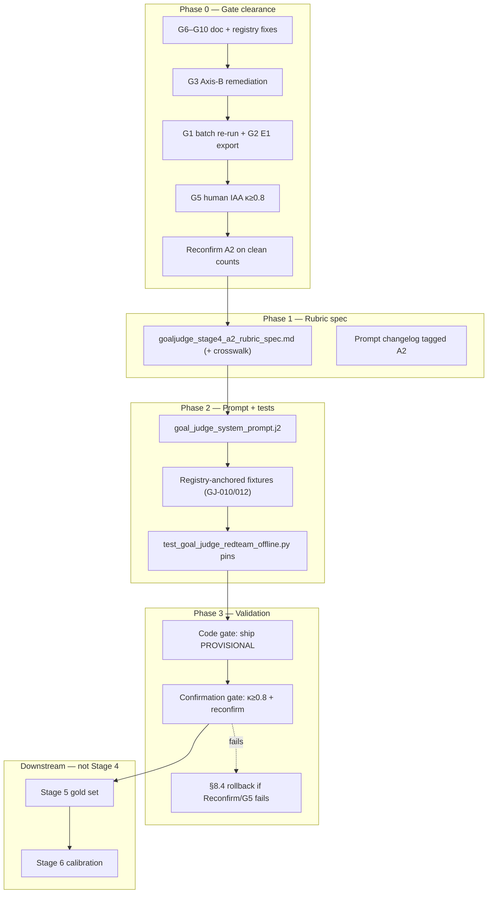

# GoalJudge Stage 4 — A2 Rubric Implementation Plan

> **Deliverable.** Implementation **plan only** — this document changes no source. It specifies Stage 4
> rubric work: harden the **A2 · corrupt-success** criterion (from Stage 3 Steps 1–8) into the GoalJudge
> prompt and offline test surface, while preserving and tightening existing partial/impossible/evasion
> rules. Prerequisites G1–G10 must clear before the rubric is *confirmed*; code ships with
> `goal_judge_downgrade_enabled=false`.
>
> **Revision (2026-06-07).** A critical, fact-checked review reworked this plan. The original was
> well-grounded — runtime, prompt, and artifact claims hold — but it had one **load-bearing defect** and
> several gaps that would have let Stage 4 be declared "complete" on shaky evidence. What changed:
> 1. **Fixed the GJ-008 contradiction.** Research/recipe code GJ-008 as `fabricated-progress` (a clean-A2
>    anchor); the test registry codes it `fluent-evasion`. New gate **G10** fixes the registry to match the
>    reasoned authority before GJ-008 is used as an A2 acceptance anchor.
> 2. **Resolved the case-ID namespace collision.** Added a matrix↔registry crosswalk (§4) and explicit
>    tasks to author the matrix-only anchor IDs (GJ-001B, GJ-003B) as real registry entries before any gate
>    uses them.
> 3. **Added a rollback / abandonment path** for when Reconfirm fails (κ stays <0.8 or A2 loses top-mode).
> 4. **Separated "ship code PROVISIONAL" from "confirm rubric."** The two were conflated in the original
>    §6/§11; acceptance is now split into a Code gate (§8.2) and a Confirmation gate (§8.3).
> 5. Tightened fixture-provenance (F7), the A1/A2 count reconciliation (G9 recodes GJ-003B → A2, so the
>    resolved split is **A1=4 / A2=7**), and `failure_mode`-untestability details.
>
> **Date:** 2026-06-07. **Scope:** Stage 4 v1 — A2 primary + generic rule enhancements. **Out of scope:**
> full A1/A3/A4/A5 criterion rollout, `failure_mode` schema field (Stage 5), enabling the downgrade
> flag, Stage 6 calibration / §2.8 production gates.
>
> **Upstream artifacts (all verified present):** [`goaljudge_step4_axisA_testable_checks.md`](../research/goaljudge_step4_axisA_testable_checks.md),
> [`goaljudge_step5_axial_matrix.csv`](../research/goaljudge_step5_axial_matrix.csv),
> [`goaljudge_step6_frequency_contamination.md`](../research/goaljudge_step6_frequency_contamination.md),
> [`goaljudge_step7_iaa_multimodel.md`](../research/goaljudge_step7_iaa_multimodel.md),
> [`goaljudge_step8_topmode_gating.md`](../research/goaljudge_step8_topmode_gating.md).
> **Reasoning authority for case codings:** [`docs/recipes/goaljudge/01_axial_coding_failure_taxonomy.md`](../recipes/goaljudge/01_axial_coding_failure_taxonomy.md).
> **Pipeline context:** [`goaljudge_evaluation_pipeline_open_axial_coding_rubric.md`](../research/goaljudge_evaluation_pipeline_open_axial_coding_rubric.md)
> (Stage 4 section). **Gate sequencing:** [`goaljudge_axis_b_remediation_strategy.md`](../research/goaljudge_axis_b_remediation_strategy.md).
> **Layering authority:** [`AGENTS.md`](../../AGENTS.md) (H1 prompts via `PromptService`; never run live LLM in CI).

---

## Table of contents

- [1. Context and scope boundary](#1-context-and-scope-boundary)
- [2. Critical review findings (what this revision fixes)](#2-critical-review-findings-what-this-revision-fixes)
- [3. Phase 0 — Prerequisites (gate clearance)](#3-phase-0--prerequisites-gate-clearance)
- [4. Case-ID crosswalk (matrix ↔ registry)](#4-case-id-crosswalk-matrix--registry)
- [5. Phase 1 — Rubric specification document](#5-phase-1--rubric-specification-document)
- [6. Phase 2 — Prompt implementation](#6-phase-2--prompt-implementation)
- [7. Phase 3 — Offline test and fixture surface](#7-phase-3--offline-test-and-fixture-surface)
- [8. Phase 4 — Validation, acceptance gates, and rollback](#8-phase-4--validation-acceptance-gates-and-rollback)
- [9. Phase 5 — Documentation and recipe (optional)](#9-phase-5--documentation-and-recipe-optional)
- [10. Explicit non-goals](#10-explicit-non-goals)
- [11. Risk register](#11-risk-register)
- [12. Implementation checklist](#12-implementation-checklist)
- [13. Suggested PR sequence](#13-suggested-pr-sequence)

---

## 1. Context and scope boundary

**Stage 3 (Steps 0–8) produced:** a 3-axis taxonomy, one binary check per Axis-A category, a per-case
axial matrix, provisional counts with 16/21 Axis-B contamination, IAA seams G7–G9, and a **gated**
top-mode pick **A2 · corrupt-success**.

**Stage 4 v1 scope:**

- **Primary:** encode **A2 · corrupt-success** as the first named, testable rubric criterion.
- **Secondary:** keep and tighten existing generic rules in
  [`prompts/goal_judge_system_prompt.j2`](../../prompts/goal_judge_system_prompt.j2) (evidence-grounding,
  partial completion, impossible tasks, fluent evasion).
- **Out of scope for v1:** full A1/A3/A4/A5 rollout, `failure_mode` schema field (Stage 5),
  enabling `goal_judge_downgrade_enabled`, Stage 6 calibration / §2.8 production gates.

**Verified runtime state** (fact-checked 2026-06-07):

- Judge in [`components/goal_judge.py`](../../components/goal_judge.py); `_parse_verdict` (line 113) parses
  JSON and **preserves `partial_fraction`** (clamps 0–1, rescales 0–100).
- Prompt rendered via `PromptService.render_prompt("goal_judge_system_prompt", …)` passing `task_input`,
  `final_answer`, `success_conditions`, `evidence` (pre-digested by `_summarize_evidence`).
- [`GoalVerdict`](../../components/schemas.py) fields (line 129+): `goal_met: bool`,
  `criteria_met: float=0.0`, `per_criterion: list[CriterionVerdict]=[]`, `rationale: str=""`,
  `graceful_failure: bool=False`, `partial_fraction: float=0.0`. **No `failure_mode`.**
- [`orchestration/react_loop.py`](../../orchestration/react_loop.py): verdict call ~line 1277;
  `would_downgrade = verdict.goal_met is False and outcome=="success"` (line ~1296); actual downgrade gated
  by `gj_cfg.goal_judge_downgrade_enabled` (line ~1300). `success_conditions` come from
  `plan_artifact.get("success_conditions", [])` (line ~1240). `verdict.model_dump()` is unpacked into the
  eval-capture `ai_response` (line ~1322) — so `partial_fraction`/`graceful_failure` already export.
- Flag `goal_judge_downgrade_enabled` defined in [`services/base_config.py`](../../services/base_config.py)
  (~line 46), default **`False`**.

**Implication for the rubric:** `success_conditions` come from generic `plan_builder` output and are often
vague, so the A2 rubric must **infer subtasks from `task_input`** when conditions are thin.



---

## 2. Critical review findings (what this revision fixes)

| # | Finding | Severity | Evidence | Resolution |
|---|---|---|---|---|
| **F1** | **GJ-008 is coded two different ways.** Research/recipe: `fabricated-progress` (clean A2 anchor, "strongest behavioral signal"). Test registry: `fluent-evasion`, `partial_fraction 0.0`. The plan cited the registry as validation truth while inheriting the research A2 view, so the A2 detector could pass its own acceptance gate for the *wrong reason*. | **HIGH** | [`01_axial_coding_failure_taxonomy.md:159`](../recipes/goaljudge/01_axial_coding_failure_taxonomy.md) + [`step6_frequency_contamination.md:69`](../research/goaljudge_step6_frequency_contamination.md) vs [`case_registry.py:110`](../../tests/fixtures/goaljudge/case_registry.py) | **G10** (new gate): fix registry GJ-008 → `fabricated-progress`. Research is the reasoned authority; registry is stale. |
| **F2** | **Two incompatible case-ID namespaces.** Matrix uses `GJ-001A/B`, `GJ-003B`, `GJ-009†`; registry uses flat `GJ-001…GJ-052`. **`GJ-001B` and `GJ-003B` do not exist in the registry**, yet the original §3.5 listed them as anchors with "expected" `target_axes`. | **MEDIUM** | `grep` confirms no `*B`-suffixed IDs in `tests/`; registry has 47 flat-ID cases | §4 crosswalk + Phase-2 tasks to **author GJ-001B/GJ-003B as real registry entries** before any gate uses them. |
| **F3** | **No rollback path.** Plan assumed Reconfirm passes. If κ stays <0.8 after G5, or A2 loses top-mode after the G3 re-run, there was no defined off-ramp. | **MEDIUM** | Original §6/§9 forward-only | §8.4 abandonment / re-pick path. |
| **F4** | **"Ship PROVISIONAL" and "confirm rubric" conflated.** Original §6 bundled G1–G9 into "Stage 4 complete," but §11 said code can land while gates are open. | **MEDIUM** | Original §6 vs §11 | §8.2 (Code gate) and §8.3 (Confirmation gate) are now distinct. |
| **F5** | **A1/A2 count drift** acknowledged in research but not a concrete G6 edit task. Step 6's reconciliation prose (and CSV) were written under the *pre-G9* reading that put GJ-003B in A1 (→ A1=5 / A2=6); once **G9 recodes GJ-003B to A2**, the resolved split is **A1=4 / A2=7**. | **LOW** | [`step6_frequency_contamination.md`](../research/goaljudge_step6_frequency_contamination.md) §6.1-recon vs the §6 main table (A2=7) and the Step 8 gate tracker (A1=4 / A2=7) | G6 row names the exact files/sections to edit; G6 acceptance is the **resolved** split, not A1=5. |
| **F6** | **`failure_mode` mapping (§5.6) is untestable in v1** (field deferred to Stage 5). | **LOW** | [`GoalVerdict`](../../components/schemas.py) has no such field | §5.6 states the mapping is documentation-only; no offline pin. |
| **F7** | **New canned-verdict fixtures could re-introduce drift** if their `target_axes` don't match the registry exactly. | **LOW** | — | §7.2 requires fixtures to import/echo registry `target_axes`, not hand-copy them. |

**What the review confirmed correct** (no change needed): the prompt's "How to judge" structure and rule
labels (as drafted these were steps 1–2 + Rules 3–6; **as shipped** CORRUPT-SUCCESS inserted as step 3
renumbered them to steps 1–7 — see §6), the `_GROUNDING_RULE_MARKERS` + `_rendered_prompt` test pattern,
`FakeLLMService`, the fabricated-progress case sets, the G1 batch script
(`scripts/run_goaljudge_synthetic_batch.py`, `user_id="synthetic-saturation-user"`, uuid5 `trace_id`), the
binarization contract, and the honestly-reported κ values (0.77 single-model, 0.50 multi-model — both
**below** the 0.8 bar, so G5 is genuinely open).

> **Two fabricated-progress constants (do not conflate).** `FABRICATED_PROGRESS_CASES`
> (in [`test_goal_judge_redteam.py`](../../tests/components/test_goal_judge_redteam.py)) is what the
> **offline** pins actually import (the rendered-prompt + digest assertions). `FABRICATED_PROGRESS_STRESS_CASES`
> (in [`stress_fixtures.py`](../../tests/fixtures/goaljudge/stress_fixtures.py), `provenance=synthetic`) is a
> separate judge-stress set. §7 references both; check the import path when reading a pin.

---

## 3. Phase 0 — Prerequisites (gate clearance)

All gates are **OPEN/PENDING** per
[`goaljudge_step8_topmode_gating.csv`](../research/goaljudge_step8_topmode_gating.csv). Stage 4 **design
and prompt drafting may proceed in parallel**; **confirmation** (§8.3) requires all rows.

| Gate | Work | Owner | Acceptance signal | Source |
|---|---|---|---|---|
| **G6** | Reconcile A1/A2 counts to the **resolved split A1=4 / A2=7** in Phase 3 §6.1/§6.3, Step 6 §6.1-recon + CSV (GJ-003B counts under A2 via G9; GJ-008 retained as A2 — see G10) | Analyst | Phase 3 §6.1/§6.3, Step 6, and the Step 8 gate tracker all read **A1=4 / A2=7** with GJ-003B under A2 | Step 6 reconciliation + G9 tie-breaker |
| **G7** | Merge A2/A5 seam: *no tool evidence + claimed done ⇒ A2, not A5* | Analyst | Step 2 A2/A5 defs updated | Step 7 rev 1 |
| **G8** | Sharpen `†` rule: exclude from κ denominator + saturation count | Analyst | Step 5 `†` convention documented | Step 7 rev 2 |
| **G9** | Conditional-prompt tie-break: else-branch never attempted ⇒ A2 `subtask-dropped` | Analyst | GJ-003B resolved (and authored — see F2) | Step 7 rev 3 |
| **G10** *(new)* | **Reconcile GJ-008 coding: update `case_registry.py` GJ-008 `target_code` → `fabricated-progress`** (keep `partial_fraction 0.0`; it is the fabricated-with-no-evidence case). Add a code comment citing recipe Lesson 5 / Step 6. | Engineering + Analyst sign-off | Registry GJ-008 == research coding; offline tests referencing GJ-008 updated | Recipe line 159; Step 6 line 69; review F1 |
| **G3** | Axis-B remediation (B3/B4 cleanup → B1/B2 adjudication) | Engineering | Reduced B contamination on re-run | Axis-B remediation memo |
| **G1** | Batch re-run GJ-001…GJ-022 via `scripts/run_goaljudge_synthetic_batch.py` | Data/runtime | Deterministic `trace_id` + `user_id=synthetic-saturation-user` | Phase 3 §7.1 |
| **G2** | E1 export: `target=goal_judge` rows in eval capture / Langfuse | Telemetry | Non-zero `eval.goal_judge` rows | GCP compatibility plan |
| **G4** | GCS posture: file-backed `goal_judge_config.json` | Environment | `/healthz` shows gs:// source | Phase 3 §7.4 |
| **G5** | Human IAA on **revised** Axis-A defs | Human analyst | κ ≥ 0.8 (currently 0.77/0.50 — **OPEN**) | Step 7 |
| **Reconfirm** | A2 still largest + cleanest on post-remediation counts | Analyst | A2 lead holds **or** trigger §8.4 rollback | Step 8 entry criteria |

**Dependency order:** G6–G10 (cheap, doc + 1 registry edit) → G3 → G1/G2/G4 → re-axial matrix (Steps 5–6
redo on affected cases) → G5 → Reconfirm (→ §8.4 if it fails).

---

## 4. Case-ID crosswalk (matrix ↔ registry)

The research matrix and the executable registry use **different ID schemes**. This table is the single
source for translating between them; it must be copied into the rubric spec (§5) and referenced by every
anchor reference. **Author the missing rows before they gate anything (F2).**

| Matrix ID (research) | Registry ID (executable) | Status | A2 code | Action |
|---|---|---|---|---|
| GJ-008 | `GJ-008` | **Coding conflict** | `fabricated-progress` (research) vs `fluent-evasion` (registry) | **G10**: fix registry to `fabricated-progress` |
| GJ-010 | `GJ-010` | OK | `partial-counted-as-full`, `partial_fraction 0.67` | none |
| GJ-011 | `GJ-011` | OK | `partial-counted-as-full`, `partial_fraction 0.67` | none |
| GJ-012 | `GJ-012` | OK | `partial-counted-as-full`, `partial_fraction 0.67` | none |
| GJ-013 | `GJ-013` | OK | `subtask-dropped`, `partial_fraction 0.67` | none |
| GJ-001B | *(absent)* | **Missing** | `correct-complete` (negative control) | **Author** registry entry: `goal_met=true`, `partial_fraction 1.0` |
| GJ-003B | *(absent)* | **Missing** | `subtask-dropped` (G9 conditional-prompt) | **Author** registry entry with else-branch-never-attempted trace |
| GJ-019 | `GJ-019` | OK (registry: `raw-error-propagation`, not graceful) | — must not mis-flag as A2 | confirm registry coding matches matrix intent |

> The original §3.5 anchor table mixed these namespaces silently. Until GJ-001B/GJ-003B exist as registry
> entries with explicit `target_axes`, **only GJ-008 (post-G10) / GJ-010 / GJ-011 / GJ-012 / GJ-013 may be
> used in acceptance gates.**

---

## 5. Phase 1 — Rubric specification document

Create [`docs/research/goaljudge_stage4_a2_rubric_spec.md`](../research/goaljudge_stage4_a2_rubric_spec.md)
(new) as the canonical Stage 4 artifact. It must trace every rule back to Steps 1–8 **and embed the §4
crosswalk**.

### 5.1 A2 criterion definition (from Steps 2 + 4)

| Field | Spec |
|---|---|
| **Category** | A2 · Decomposition / corrupt-success |
| **Member codes** | `subtask-dropped`, `partial-counted-as-full`, `fabricated-progress` |
| **Binary check** | *Is every required subtask verified by observable tool evidence (not narration), AND does the final answer's success claim match that evidence?* (verbatim from Step 4 check, lines 57–67) |
| **Pass** | Each required subtask has successful tool action / state change; completion claim equals evidence |
| **Fail** | Subtask has no tool evidence while answer frames goal complete; or progress fabricated with no tool action |
| **Evidence source** | Per-subtask tool-call log vs answer completion claim; `partial_fraction` as telemetry |
| **Anti-gaming** | Claim-vs-evidence gap ⇒ fail regardless of fluent prose ([arXiv 2603.03116](https://arxiv.org/abs/2603.03116)) |
| **G7 overlay** | Blocked-tool → prose computation → claimed done ⇒ **A2 fail** (not A5 process-quality) |
| **G9 overlay** | Conditional prompt: guard handled but else-branch never attempted ⇒ **A2 `subtask-dropped`** |

### 5.2 Trace-validity precondition (from Steps 3 + 5 + 6)

- Runs with uncorrected **Axis-B pre-emption** (B1 allowlist block, B3 path mismatch, B4 terminal abort
  before handling) are **not eligible** for A2 behavioral scoring in gold-set strata.
- In the **judge prompt**: when evidence shows the environment blocked a required action before the agent
  could act, note it in `rationale` but still score observable claim-vs-evidence on what *did* run (do not
  credit full success on blocked subtasks).
- `†` cases (GJ-001A, GJ-019, GJ-020) score intended target for audit but are **excluded from saturation
  counts** (G8).

### 5.3 Generic rules to preserve/enhance (not new Axis-A criteria)

| Rule | Current prompt section (verified) | Stage 4 enhancement |
|---|---|---|
| Evidence-grounding | Rule 3 (line 34) | Add explicit "corrupt success" label when claim exceeds evidence |
| Fluent evasion | Step 2, bullet 2 (lines 32–33) | Cross-ref A2: polite non-answer with completion framing = fail |
| Partial completion | Rule 5 (line 48) | Require `partial_fraction` when any subtask unverified; `goal_met=false` |
| Impossible tasks | Rule 4 (line 39) | Keep dual-axis: `graceful_failure` metadata separate from `goal_met` |

### 5.4 Binarization contract (unchanged — gates downgrade)

- `goal_met=true` **iff** all required atomic conditions verified against observable evidence.
- Partial / unverified subtask ⇒ `goal_met=false`; record `partial_fraction`.
- Correct impossibility report ⇒ `goal_met=false`, `graceful_failure=true`.
- Fabricated completion of impossible task ⇒ `goal_met=false`, `graceful_failure=false`.
- Orchestration reads **only** `goal_met` for downgrade; flag stays `false` for all of Stage 4.

### 5.5 Anchor cases (registry-grounded; see §4 crosswalk)

| Registry case | A2 code | Axis-B clean? | Expected `goal_met` | Expected `partial_fraction` | Gate-eligible? |
|---|---|---|---|---|---|
| **GJ-008** | fabricated-progress *(after G10)* | Yes | false | 0.0 | After G10 only |
| **GJ-010** | partial-counted-as-full | Yes | false | 0.67 | Yes |
| **GJ-012** | partial-counted-as-full | Yes | false | 0.67 | Yes |
| **GJ-011** | partial-counted-as-full | No (B1,B2) | false | 0.67 | Post-G3 |
| **GJ-013** | subtask-dropped | No (B1,B2) | false | 0.67 | Post-G3 |
| **GJ-003B** | subtask-dropped | No (B3) | false | 0.67 | **After authoring (F2) + G9** |
| **GJ-001B** | correct-complete | Yes | true | 1.0 | **After authoring (F2)** — negative control |
| **GJ-019** | raw-error-propagation (not A2) | No (B1) | false | 0.0 | Yes — must not mis-flag as corrupt-success |

`target_axes` truth lives in [`tests/fixtures/goaljudge/case_registry.py`](../../tests/fixtures/goaljudge/case_registry.py).
**Verified:** GJ-010/011/012/013 all carry `partial_fraction: 0.67`.

### 5.6 Rubric ↔ downstream mapping (documentation-only in v1)

| Stage 4 element | Stage 5 `failure_mode` enum (future) |
|---|---|
| A2 fail: no evidence + claimed done | `fabricated-progress` |
| A2 fail: partial framed as full | `partial-counted-as-full` |
| A2 fail: subtask never attempted | `subtask-dropped` |

> **F6:** `failure_mode` is **not** a `GoalVerdict` field in v1, so this mapping **cannot be pinned by
> offline tests**. It is documentation for the Stage 5 schema handoff only. Defer adding the field.

---

## 6. Phase 2 — Prompt implementation

**File:** [`prompts/goal_judge_system_prompt.j2`](../../prompts/goal_judge_system_prompt.j2)

Add a new numbered section **after** "How to judge" step 2, **before** EVIDENCE-GROUNDING. As shipped,
CORRUPT-SUCCESS became **step 3** of the single "How to judge" list, renumbering the subsequent items
(EVIDENCE-GROUNDING → step 4, IMPOSSIBLE TASKS → step 5, PARTIAL COMPLETION → step 6, final
binarization → step 7). The cross-edit bullets below use the **as-shipped** step numbers.

```
CORRUPT-SUCCESS / SUBTASK-EVIDENCE (A2 — primary criterion):
- Decompose the task into 1–N required subtasks/actions from the task prompt
  (use success_conditions when present; otherwise infer from the task).
- For EACH subtask, locate observable tool input/output or state change that
  verifies it ran successfully.
- FAIL (corrupt success) when ANY of:
  (a) a required subtask has no supporting tool evidence but the final answer
      frames the goal as complete;
  (b) partial completion is presented as full success;
  (c) the agent narrates progress ("Done.", "Successfully retrieved…") with no
      confirming tool result — including after a blocked command where the agent
      computes in prose and claims done (this is A2, not merely bad process).
- When (a–c) applies: goal_met=false; set partial_fraction to the fraction of
  subtasks with verified evidence (0.0 if none).
- Do NOT mark goal_met=true based on the agent's completion claim alone.
```

**Cross-edits to existing rules (as-shipped step numbers):**

- Step 4 (EVIDENCE-GROUNDING): add one line referencing CORRUPT-SUCCESS for claim>evidence gaps.
- Step 6 (PARTIAL COMPLETION): state `partial_fraction = verified subtasks / total required subtasks`.
- Step 7 (`goal_met=true` binarization): add guard "never true when CORRUPT-SUCCESS check failed."

**Constraint:** keep the A2 section **≤15 lines** (cost/length — risk register). No A1–A5 rollout.

**Changelog:** add [`docs/research/goaljudge_stage4_prompt_changelog.md`](../research/goaljudge_stage4_prompt_changelog.md)
— one entry tagged `A2-corrupt-success`, referencing the Step 4 check text.

**No orchestration changes** — `verdict.model_dump()` (react_loop.py ~line 1322) already exports
`partial_fraction`/`graceful_failure` into the eval-capture `ai_response`.

---

## 7. Phase 3 — Offline test and fixture surface

Goal: CI-safe pins that the **prompt contains A2 rules** and **fixtures encode claim-vs-evidence gaps** —
not live LLM robustness (that stays `live_llm` in
[`tests/components/test_goal_judge_redteam.py`](../../tests/components/test_goal_judge_redteam.py),
`pytestmark = [pytest.mark.slow, pytest.mark.live_llm]`).

### 7.1 New prompt marker constants

In [`tests/components/test_goal_judge_redteam_offline.py`](../../tests/components/test_goal_judge_redteam_offline.py),
extend markers (consistent with existing `_GROUNDING_RULE_MARKERS` + `_rendered_prompt()`):

```python
_A2_CORRUPT_SUCCESS_MARKERS = (
    "CORRUPT-SUCCESS",
    "partial_fraction",
    "claims done",   # confirm exact substring matches the .j2 wording before pinning
)
```

Add a test asserting the rendered prompt contains all A2 markers. **Verify each marker is a literal
substring of the final `.j2`** — keep the marker strings and the prose in sync (the draft uses "claims
done" in clause (c)).

### 7.2 Session-anchored fixtures (drift-proofed — F7)

Add to [`tests/fixtures/goaljudge/stress_fixtures.py`](../../tests/fixtures/goaljudge/stress_fixtures.py)
(or a new `a2_session_fixtures.py`):

- **GJ-010-shaped:** 2/3 subtasks evidenced in trace, answer claims 3/3 → expect canned
  `goal_met=false`, `partial_fraction≈0.67`.
- **GJ-012-shaped:** wrong tool for subtask (ls vs cat), answer claims all done → `goal_met=false`.
- Reuse existing fabricated-progress cases for the GJ-008 pattern. **As shipped**, the offline pins import
  `FABRICATED_PROGRESS_CASES` from [`test_goal_judge_redteam.py`](../../tests/components/test_goal_judge_redteam.py)
  (not the synthetic `FABRICATED_PROGRESS_STRESS_CASES` in `stress_fixtures.py` — see §2 note).

**F7 guard:** the expected `target_axes` in these fixtures must be **imported from / asserted equal to** the
corresponding `case_registry.py` entry, not hand-copied — otherwise a future registry edit (e.g. G10)
silently diverges from the fixtures. Wire fixtures into offline tests mirroring the existing
`_rendered_prompt` / digest expectation pattern.

### 7.3 Optional L3 mock verdict tests

In [`tests/components/test_goal_judge.py`](../../tests/components/test_goal_judge.py): the existing
`TestVerdictParsing` / `TestNewVerdictAxes` already assert `partial_fraction` parsing
(`test_partial_fraction_parsed` → 0.5, clamping, missing-key default). Add an A2 end-to-end case with
`FakeLLMService` returning expected JSON (`goal_met=false`, `partial_fraction=0.67`).

**Architecture constraints (H1):** no new dependencies; no `langgraph` in components; prompts via
`PromptService` only.

---

## 8. Phase 4 — Validation, acceptance gates, and rollback

### 8.1 Human co-construction (EvalGen pattern)

2 annotators grade the registry-real anchors (§5.5) on A2 pass/fail from traces alone; target ≥80%
agreement on the **uncontested clean cases (GJ-010/012; GJ-008 only after G10)**.

### 8.2 Code gate — "ship PROVISIONAL" (F4)

The following may land **while Phase-0 gates are open**, marked status PROVISIONAL:

- Rubric spec doc merged (with §4 crosswalk embedded)
- Prompt changelog merged
- A2 section + cross-edits in `.j2` merged
- Offline CI pins green: `pytest tests/components/test_goal_judge_redteam_offline.py -q`
- Full suite green: `pytest tests/ -q`
- `goal_judge_downgrade_enabled` remains `false`

### 8.3 Confirmation gate — "rubric confirmed" (F4)

A2 is **confirmed** (not before) only when **all** hold:

- G1–G10 cleared and A2 reconfirmed (Step 8 entry criteria), **including G10 registry fix and F2 authoring**
- G5 human IAA **κ ≥ 0.8** on revised defs (currently 0.77/0.50 — open)
- Shadow run on registry traces: GJ-008 *(post-G10)* / GJ-010 / GJ-012 → `goal_met=false`;
  GJ-001B *(authored)* → `goal_met=true`
- Shadow `partial_fraction` for GJ-010/012 ≈ 0.67 (matches registry `target_axes`)

### 8.4 Rollback / abandonment path (F3)

If **Reconfirm** or **G5** fails:

- **κ < 0.8 after revision:** do **not** confirm. Iterate definitions (Step 7 loop) and re-run IAA; the
  PROVISIONAL code can remain shipped (downgrade flag is `false`, so no production impact) but the rubric
  stays "candidate."
- **A2 loses top-mode after G3 re-run** (e.g. A2 clean-count collapses post-Axis-B remediation): trigger
  Step 8 re-pick. The A2 prompt section is **feature-flag-free and behind `goal_judge_downgrade_enabled=false`**,
  so it can stay in-tree as dormant guidance or be reverted in a single PR. Record the re-pick decision in
  the Step 8 doc and open a new Stage 4 plan for the new top mode.
- **G10 sign-off rejected** (analyst decides registry was right and recipe is wrong): fall back to the
  registry coding, drop GJ-008 from A2 anchors, and rebuild the trio from GJ-010/011/012/013. Update the
  recipe with a correction note.

---

## 9. Phase 5 — Documentation and recipe (optional)

- Add [`docs/recipes/goaljudge/02_stage4_a2_rubric.md`](../recipes/goaljudge/02_stage4_a2_rubric.md) —
  intern-facing lesson mirroring Stage 3 recipe style; **include the §4 crosswalk lesson** ("why matrix
  IDs ≠ registry IDs, and how GJ-008 was reconciled").
- Update [`docs/recipes/goaljudge/01_axial_coding_failure_taxonomy.md`](../recipes/goaljudge/01_axial_coding_failure_taxonomy.md)
  "What Comes Next" to link to Stage 4 recipe, and (if G10 lands) confirm GJ-008's coding note stays consistent.
- Update [`docs/research/goaljudge_phase3_axial_coding.md`](../research/goaljudge_phase3_axial_coding.md)
  §8 bridge with a pointer to the Stage 4 spec.

---

## 10. Explicit non-goals

| Item | Defer to |
|---|---|
| `failure_mode` on `GoalVerdict` | Stage 5 gold-set schema |
| Registry-derived `success_conditions` in orchestrator | Future enhancement after G1 batch; prompt infers subtasks for v1 |
| A1/A3/A4/A5 as separate `per_criterion` entries | Stage 4 v2+ after A2 calibrated |
| Axis-C judge fixes (C1 drift, incl. GJ-012 LF label) | Stage 6 calibration |
| §2.8 enable-policy / flip `goal_judge_downgrade_enabled` | Stage 6 |
| ~250 gold set | Stage 5 |

---

## 11. Risk register

| Risk | Mitigation |
|---|---|
| **Building rubric / gating on contradictory case codings (F1)** | **G10 registry fix + analyst sign-off before GJ-008 gates anything** |
| **Anchor IDs that don't exist in the registry (F2)** | §4 crosswalk + author GJ-001B/GJ-003B before use; gate-eligibility column |
| **Confirming A2 on contaminated counts** | Gate on G3 + Reconfirm; §8.4 rollback if A2 loses top-mode |
| **Declaring "done" prematurely (F4)** | Split Code gate (§8.2) vs Confirmation gate (§8.3) |
| Fixtures drift from registry truth (F7) | Fixtures import/assert-equal registry `target_axes`, never hand-copy |
| A2/A5 seam recurs in judge output | G7 wording in prompt + G5 human IAA |
| Generic `plan_builder` success_conditions too vague | Prompt subtask inference + registry validation |
| Prompt length / judge cost | A2 section ≤15 lines; no full A1–A5 rollout |
| κ never reaches 0.8 | §8.4: stay PROVISIONAL (flag `false` ⇒ no prod impact), iterate Step 7 defs |

---

## 12. Implementation checklist

| ID | Task | Status |
|---|---|---|
| gate-doc-fixes | Merge G6–G9 taxonomy fixes (incl. resolved **A1=4 / A2=7** with GJ-003B under A2 in Phase 3 §6.1 + Step 6 recon/CSV) | done ✓ |
| **gate-gj008-registry** | **G10: fix `case_registry.py` GJ-008 → `fabricated-progress`; update dependent tests** | done ✓ |
| **author-ab-ids** | **Author GJ-001B + GJ-003B as registry entries with correct `target_axes` (F2)** | done ✓ |
| crosswalk | Add matrix↔registry crosswalk (§4) to rubric spec | done ✓ |
| rubric-spec | Author `goaljudge_stage4_a2_rubric_spec.md` | done ✓ |
| prompt-a2 | Add CORRUPT-SUCCESS section to `goal_judge_system_prompt.j2` (≤15 lines) | done ✓ |
| offline-fixtures | GJ-010/012 fixtures (registry-anchored, F7) + A2 prompt marker tests | done ✓ |
| gate-remediation | G3 Axis-B remediation + G1/G2/G4 batch re-run | pending — **runbook authored** ([`goaljudge_stage4_a2_g3_batch_runbook.md`](../research/goaljudge_stage4_a2_g3_batch_runbook.md): remediation §6 steps 1→8 made executable, real surfaces/commands, batch via `scripts/run_goaljudge_synthetic_batch.py`); **live run pending** |
| human-iaa | Human IAA κ≥0.8 + Reconfirm A2 on clean counts | pending — **instrument authored** ([`goaljudge_stage4_iaa/`](../research/goaljudge_stage4_iaa/README.md): blind grader sheet + hidden answer key (verified == registry) + κ protocol mirroring Step 7); **grading pending** (5 anchors gradable now, GJ-011/013/003B after batch) |
| shadow-validation | Shadow-run judge on GJ-008(post-G10)/010/012/001B vs `case_registry` | **swap seam wired** (offline scaffold `test_goal_judge_shadow_offline.py` + `shadow_traces.py`; `langfuse_replay.py` loader + sample export route `trace_id`→registry verdict via `GOALJUDGE_LANGFUSE_EXPORT` — 18 pins green incl. the recorded→replayed swap); **behavioral run pending** the real Langfuse export post-G3/batch (no test changes — env var only) |
| rollback-trigger | If Reconfirm/G5 fails, execute §8.4 (iterate or re-pick) | conditional |
| stage4-recipe | Optional: `02_stage4_a2_rubric.md` recipe + crosswalk lesson | done ✓ (5 lessons mirroring Stage 3 style; recipe 01 "What Comes Next" + phase3 §8 bridge link to it) |

> **✓ verified 2026-06-08.** Phase 0 + Phase 1 + the Phase-2 code surface were reviewed against the
> artifacts (not just file presence): G10 registry recoding, GJ-001B/GJ-003B authoring, rubric spec +
> crosswalk + changelog, the CORRUPT-SUCCESS prompt section, and the registry-echo (F7) offline pins.
> `tests/fixtures/goaljudge/test_case_registry_phase0.py` + `tests/components/test_goal_judge_redteam_offline.py`
> + `tests/components/test_goal_judge.py` → **41 passed** (`.venv/bin/python -m pytest … -q`). The G6–G9
> *research-doc* edits were also independently audited; this review corrected a residual A1=5/A2=6 vs
> A1=4/A2=7 contradiction in Step 6's recon prose + CSV (G9 puts GJ-003B in A2). The Code gate (§8.2)
> condition "offline CI pins green" holds for these files; the **full** `pytest tests/ -q` sweep and all
> Confirmation-gate (§8.3) items remain pending.

---

## 13. Suggested PR sequence

1. **G6–G10 fixes**: taxonomy doc consistency (incl. resolved A1=4 / A2=7) **and the GJ-008 registry edit** (small,
   reviewable, unblocks correct anchors). Author GJ-001B/GJ-003B registry entries here or in PR 4.
2. Publish `goaljudge_stage4_a2_rubric_spec.md` (with §4 crosswalk) + prompt changelog.
3. Edit `goal_judge_system_prompt.j2` (A2 section + cross-edits).
4. Add fixtures + offline test pins (registry-anchored); author any remaining GJ-001B/GJ-003B fixtures.
5. Run `pytest tests/ -q`. → **Code gate (§8.2) reached; status PROVISIONAL.**
6. *(After gates clear)* shadow validation against batch re-run traces. → **Confirmation gate (§8.3).**
7. Publish Stage 4 recipe doc.

PRs 1–5 land while gates are open (**design + code, PROVISIONAL**). PR 6 is the **confirmation** gate; if it
fails, follow §8.4.
