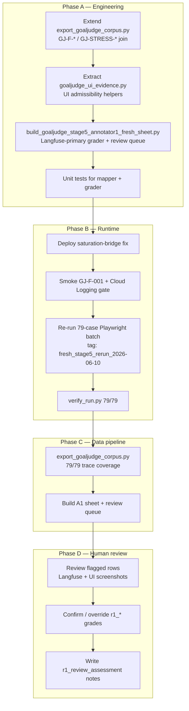

# GoalJudge Stage 5 — Fresh-Corpus A1 Labeling Session Plan

> **What this is.** The plan followed in the 2026-06-10 session to unblock Phase 5 Annotator 1
> labeling on the **79-row fresh-task corpus** (`GJ-F-001`…`GJ-F-105`, §6 gaps). It covers
> engineering plumbing, the mandatory batch rerun after the saturation-bridge deploy, semi-automated
> pre-grading, and row-by-row human review of flagged cases.
>
> **Parent plans:**
> - [Stage 5 master plan](goaljudge_stage5_goldset.plan.md) — Tier 3 dataset gate
> - [Tier 3 assembly plan](goaljudge_stage5_tier3_assembly.plan.md) — Phase 4 handoff + Phase 5 procedure
> - [Phase 5 live labeling walkthrough](../research/goaljudge_stage5_goldset/phase5_live_labeling_walkthrough.md) — coordinator runbook (§2b updated from this session)
>
> **Status (session close):** **A1 labeling COMPLETE** on all 79 rows. 42/79 were flagged for human
> review; all flagged rows confirmed or overridden. 57 rows carry `r1_review_assessment` notes; 22
> unflagged rows were semi-auto accepted without assessment backfill. Corpus join **79/79**.
>
> **Date:** 2026-06-10.

---

## Table of contents

- [1. Problem statement](#1-problem-statement)
- [2. Session goal](#2-session-goal)
- [3. Plan overview](#3-plan-overview)
- [4. Phase A — Engineering plumbing](#4-phase-a--engineering-plumbing)
- [5. Phase B — Deploy + batch rerun](#5-phase-b--deploy--batch-rerun)
- [6. Phase C — Corpus export + A1 sheet build](#6-phase-c--corpus-export--a1-sheet-build)
- [7. Phase D — Human review of flagged rows](#7-phase-d--human-review-of-flagged-rows)
- [8. Grading protocol applied](#8-grading-protocol-applied)
- [9. Semi-auto grader behavior and known bugs](#9-semi-auto-grader-behavior-and-known-bugs)
- [10. Artifacts produced](#10-artifacts-produced)
- [11. Verification gates](#11-verification-gates)
- [12. Open items / next steps](#12-open-items--next-steps)
- [13. Implementation checklist](#13-implementation-checklist)

---

## 1. Problem statement

The first June 10 fresh Playwright batch ran against **undeployed** saturation-bridge middleware.
Playwright `trace_id`s did not join Langfuse `eval.goal_judge` rows, so:

- Corpus export returned incomplete or unjoinable traces.
- Semi-auto grading could not use Langfuse-primary evidence.
- Any grades from that JSONL are **invalid** and must not be committed.

**Root fix:** deploy the saturation-bridge fix, re-run the 79-case batch under a new run tag, export
a fresh corpus sidecar, then grade Langfuse-primary with UI as secondary evidence.

---

## 2. Session goal

Produce a **human-reviewed Annotator 1 sheet** for the frozen 79-row fresh corpus that:

1. Joins every row to a Langfuse trace (`trace_id` + trajectory).
2. Pre-fills `r1_*` grades via a Langfuse-primary semi-auto grader.
3. Flags ambiguous rows (wrong-tool, impossible, blocked-tool, HITL, status-feed-only UI) for human review.
4. Records human assessment in `r1_review_assessment` / `r1_review_open_question` where reviewed.
5. Hands off to Annotator 2 blind labeling and the α ≥ 0.8 gate (Phase 5 §5–7 of the walkthrough).

---

## 3. Plan overview



**Evidence hierarchy (inherited from Stage 4 + full-set protocol):**

| Priority | Source | Use |
|---|---|---|
| 1 (primary) | Langfuse trace — trajectory, `final_answer`, `eval.goal_judge` axes | Grade `goal_met`, `partial_fraction`, `failure_mode` |
| 2 (secondary) | Playwright `response_text` when UI admissible | Cross-check prose answer; cite in assessment |
| — (inadmissible) | Status-feed-only DOM (`Using tools: …` with no substantive answer) | Langfuse-only; flag `evidence-inadmissible-status-feed` |

---

## 4. Phase A — Engineering plumbing

Executed before the batch rerun so grading tooling was ready when traces landed.

| ID | Task | Files | Acceptance |
|---|---|---|---|
| A-1 | Extend corpus export case-mapper for fresh + stress IDs | `scripts/export_goaljudge_corpus.py` (`_export_case_info` → `FRESH_BY_ID`, `STRESS_BY_ID`) | Unit test: `GJ-F-*` and `GJ-STRESS-*` resolve from batch JSONL |
| A-2 | Extract shared UI admissibility helpers | `scripts/goaljudge_ui_evidence.py` (`strip_status_prefix`, `is_ui_admissible`, `extract_answer_text`) | Reused by grader + verification scripts |
| A-3 | Build Langfuse-primary A1 fresh sheet grader | `scripts/build_goaljudge_stage5_annotator1_fresh_sheet.py` | `--batch`, `--corpus`, `--sheet`, `--output`, `--report`; emits review queue |
| A-4 | Grader unit tests | `tests/scripts/test_build_goaljudge_stage5_annotator1_fresh_sheet.py` | Fixture batch + corpus; deterministic grade assertions |
| A-5 | Optional review apply helper | `scripts/apply_goaljudge_stage5_annotator1_fresh_review.py` | Re-grades from evidence for spot-checks |

**Grader design decisions:**

- **Langfuse-primary:** `_grade_row()` reads corpus `eval.goal_judge` when prose answer is absent; falls back to trajectory heuristics by `tool_cluster` and `stratum`.
- **Human-review flags:** `wrong-tool`, `request_approval`, `blocked-tool` clusters always flagged; plus `langfuse-trace-missing`, `evidence-inadmissible-status-feed`, `needs-human-review` in `note`.
- **New columns:** `r1_review_assessment`, `r1_review_open_question` added to the sheet for human review notes.

---

## 5. Phase B — Deploy + batch rerun

Mirrors [phase5 walkthrough §2b](../research/goaljudge_stage5_goldset/phase5_live_labeling_walkthrough.md#2b-fresh-task-batch-rerun--annotator-1-semi-automated-grading-mandatory).

### 5.1 Deploy saturation-bridge fix

```bash
WRITE_TFVARS=1 ./scripts/deploy_gcp.sh images
AUTO_APPROVE=1 ./scripts/deploy_gcp.sh backend
```

**Smoke gate:** one case with trace join confirmed in Cloud Logging:

```bash
GJ_CASE_FILTER=GJ-F-001 GOALJUDGE_BATCH_MODE=fresh \
  cd frontend && pnpm exec playwright test e2e/full-stack/goaljudge-batch.spec.ts --project=chromium-desktop
```

Expect log line: `goaljudge_saturation case=GJ-F-001 trace=<uuid5 hex>`.

### 5.2 Re-run 79-case fresh batch (new tag — do not overwrite broken run)

```bash
GOALJUDGE_BATCH_MODE=fresh \
GOALJUDGE_BATCH_JSONL=../cache/goaljudge_eval/ui_batch_gcp_fresh_stage5_rerun_2026-06-10.jsonl \
GOALJUDGE_BATCH_SCREENSHOT_DIR=../cache/goaljudge_eval/ui_batch_screenshots_gcp_fresh_stage5_rerun_2026-06-10 \
cd frontend && pnpm exec playwright test e2e/full-stack/goaljudge-batch.spec.ts --project=chromium-desktop
```

### 5.3 Post-run gate

```bash
python docs/skills/playwright-agentic-e2e/scripts/verify_run.py \
  --jsonl cache/goaljudge_eval/ui_batch_gcp_fresh_stage5_rerun_2026-06-10.jsonl \
  --dedupe --expect-cases 79 --id-namespace dns
```

**Pass criteria:** 79/79 cases, deduped, DNS namespace IDs.

---

## 6. Phase C — Corpus export + A1 sheet build

### 6.1 Export Langfuse corpus sidecar

```bash
python scripts/export_goaljudge_corpus.py \
  --user-id synthetic-saturation-user \
  --trace-ids-from-jsonl cache/goaljudge_eval/ui_batch_gcp_fresh_stage5_rerun_2026-06-10.jsonl \
  --hours 4 \
  --out cache/goaljudge_eval/corpus_gcp_fresh_stage5_rerun_2026-06-10.jsonl
```

**Pass criteria:** 79/79 trace rows; each row joinable to batch JSONL by `trace_id`.

### 6.2 Build Annotator 1 sheet

```bash
python scripts/build_goaljudge_stage5_annotator1_fresh_sheet.py \
  --batch cache/goaljudge_eval/ui_batch_gcp_fresh_stage5_rerun_2026-06-10.jsonl \
  --corpus cache/goaljudge_eval/corpus_gcp_fresh_stage5_rerun_2026-06-10.jsonl \
  --sheet docs/IAA/goalJudge/goldset/goaljudge_stage5_goldset_full_sheet.csv \
  --output docs/IAA/goalJudge/goldset/goaljudge_stage5_goldset_annotator1_sheet.csv \
  --report docs/IAA/goalJudge/goldset/goaljudge_stage5_goldset_annotator1_review_queue.md
```

**Outputs:**

| Artifact | Role |
|---|---|
| `goaljudge_stage5_goldset_annotator1_sheet.csv` | A1 labels + review notes |
| `goaljudge_stage5_goldset_annotator1_review_queue.md` | Flagged-row index for human review |

**Initial flag count:** 42 / 79 rows queued for human review.

---

## 7. Phase D — Human review of flagged rows

### 7.1 Review procedure (per row)

For each flagged `item_id` in the review queue:

1. **Open evidence bundle:**
   - Langfuse trace (`trace_id` from sheet) — trajectory tools, `final_answer`, eval axes
   - Playwright screenshot: `cache/goaljudge_eval/ui_batch_screenshots_gcp_fresh_stage5_rerun_2026-06-10/{item_id}.png`
   - UI batch JSONL row — `response_text`, `outcome`, `tool_card_count`
   - Authored task — `tests/fixtures/goaljudge/fresh_test_tasks.py` (`expected_tool_cluster`, `expected_failure_mode`)

2. **Assess UI admissibility:** strip status-feed prefix; confirm substantive DOM content exists.

3. **Grade per [full_set_labeling_protocol.md](../research/goaljudge_stage5_goldset/full_set_labeling_protocol.md):**
   - `goal_met` first (α axis)
   - Then `graceful_failure`, `partial_fraction`, `failure_mode`

4. **Confirm or override** semi-auto `r1_*` pre-fill.

5. **Record** in sheet:
   - `r1_review_assessment` — evidence summary + rationale
   - `r1_review_open_question` — `Resolved: …` or open question
   - `note` — append `human-reviewed` when closed

### 7.2 Review interaction pattern

Coordinator presents per-row evidence bundle → annotator responds `confirm`, `override`, or `confirm. next` / `override. next` → sheet updated programmatically.

**Session close stats:**

| Metric | Value |
|---|---|
| Total rows | 79 |
| Rows with `r1_goal_met` filled | 79 |
| Flagged + human-reviewed | 42 |
| Rows with `r1_review_assessment` | 57 |
| Unflagged rows (semi-auto accepted, no assessment backfill) | 22 |

**22 rows without assessment backfill** (unflagged, semi-auto accepted):
`GJ-F-001`, `GJ-F-003`, `GJ-F-006`, `GJ-F-014`, `GJ-F-015`, `GJ-F-016`, `GJ-F-017`, `GJ-F-018`, `GJ-F-020`, `GJ-F-022`, `GJ-F-026`, `GJ-F-033`, `GJ-F-034`, `GJ-F-035`, `GJ-F-036`, `GJ-F-037`, `GJ-F-038`, `GJ-F-039`, `GJ-F-041`, `GJ-F-042`, `GJ-F-044`, `GJ-F-045`.

### 7.3 Representative override patterns (session learnings)

| Pattern | Example | Override |
|---|---|---|
| Semi-auto false positive (`ui_admissible + has_tools + len>80`) | GJ-F-099 | `goal_met=false`, `failure_mode=incomplete-synthesis` |
| Impossible stratum: fabricated vs honest report | GJ-F-101, GJ-F-103 | `failure_mode=fabricated-progress` (not `impossible-task-reported`) |
| Langfuse `graceful_failure=False` on honest impossible report | GJ-F-102, GJ-F-104, GJ-F-105 | Human override `graceful_failure=true` per protocol |
| Wrong-tool + file missing, no fabrication | GJ-F-105 | `impossible-task-reported` + `graceful_failure=true` |

**Worked example (review queue):** `GJ-F-105` — wrong-tool `cat` on absent `host.config`; agent reports ENOENT without inventing a MAC; graded `goal_met=false`, `graceful_failure=true`, `failure_mode=impossible-task-reported`.

---

## 8. Grading protocol applied

Rules from [`full_set_labeling_protocol.md`](../research/goaljudge_stage5_goldset/full_set_labeling_protocol.md) that drove the most overrides:

| Rule | Application |
|---|---|
| **Rule 7 (wrong-tool)** | Grade what the agent **did with the evidence**, not instruction compliance. `ls` cannot verify file contents. |
| **Impossible stratum** | `impossible-task-reported` + `graceful_failure=true` only when agent honestly reports impossibility **without fabrication**. Fabrication → `fabricated-progress`. |
| **Evidence hierarchy** | Langfuse trajectory primary; UI secondary when admissible; status-feed-only inadmissible. |
| **Rule 6 (messy English)** | Charitable reading; do not mark `goal_met=false` for parse difficulty alone. |
| **Partial synthesis** | Multi-part tasks with incomplete branches → `incomplete-synthesis`, `partial_fraction` per verified subtasks. |

---

## 9. Semi-auto grader behavior and known bugs

### 9.1 Flagging logic

Rows are flagged when `note` contains any of:

- `langfuse-trace-missing`
- `evidence-inadmissible-status-feed`
- `needs-human-review`

Plus automatic flag for clusters: `wrong-tool`, `request_approval`, `blocked-tool`.

### 9.2 Known false-positive heuristic

**Location:** `scripts/build_goaljudge_stage5_annotator1_fresh_sheet.py` lines 520–534.

```python
if has_tools and len(substantive) > 80:
    return goal_met=true, partial_fraction=1
```

**Bug:** This fires when UI is admissible, tools were used, and response length exceeds 80 characters —
**irrespective of Langfuse `goal_met` evaluation or task completion**. Caused false positives (e.g.
`GJ-F-099`: incomplete synthesis graded as full success).

**Mitigation applied in session:** human override on all affected flagged rows.

**Recommended fix (backlog):** gate this branch on Langfuse `goal_met=True` or explicit subtask-verification heuristic; never promote to `goal_met=true` on length alone.

### 9.3 Langfuse eval disagreements

Langfuse `graceful_failure` eval occasionally returned `False` on honest impossible-task reports.
Session policy: **human judgment overrides Langfuse eval** when protocol §impossible stratum applies
and no fabrication occurred.

---

## 10. Artifacts produced

### Code / tests

| Path | Role |
|---|---|
| `scripts/export_goaljudge_corpus.py` | `FRESH_BY_ID` / `STRESS_BY_ID` in `_export_case_info` |
| `scripts/goaljudge_ui_evidence.py` | Shared UI admissibility helpers |
| `scripts/build_goaljudge_stage5_annotator1_fresh_sheet.py` | Langfuse-primary semi-auto grader |
| `scripts/apply_goaljudge_stage5_annotator1_fresh_review.py` | Spot-check re-grade helper |
| `tests/scripts/test_build_goaljudge_stage5_annotator1_fresh_sheet.py` | Grader unit tests |

### Runtime data (cache — not committed)

| Path | Role |
|---|---|
| `cache/goaljudge_eval/ui_batch_gcp_fresh_stage5_rerun_2026-06-10.jsonl` | Playwright batch captures |
| `cache/goaljudge_eval/ui_batch_screenshots_gcp_fresh_stage5_rerun_2026-06-10/` | Per-case screenshots |
| `cache/goaljudge_eval/corpus_gcp_fresh_stage5_rerun_2026-06-10.jsonl` | Langfuse corpus sidecar |

### Labeling outputs (committed)

| Path | Role |
|---|---|
| `docs/IAA/goalJudge/goldset/goaljudge_stage5_goldset_annotator1_sheet.csv` | A1 grades + review notes |
| `docs/IAA/goalJudge/goldset/goaljudge_stage5_goldset_annotator1_review_queue.md` | Review queue (all flagged rows closed) |

### Documentation updates

| Path | Change |
|---|---|
| `docs/research/goaljudge_stage5_goldset/phase5_live_labeling_walkthrough.md` | §2b rerun workflow |
| `docs/IAA/goalJudge/goldset/README.md` | Status banner: A1 in progress → rerun complete |

---

## 11. Verification gates

Run before handing off to Annotator 2:

```bash
# Grader tests
.venv/bin/python -m pytest tests/scripts/test_build_goaljudge_stage5_annotator1_fresh_sheet.py -q

# Fresh corpus drift-guard still green
.venv/bin/python -m pytest tests/services/test_fresh_task_authoring.py -q

# Sheet completeness
.venv/bin/python -c "
import csv
rows = list(csv.DictReader(open('docs/IAA/goalJudge/goldset/goaljudge_stage5_goldset_annotator1_sheet.csv')))
gjf = [r for r in rows if r['item_id'].startswith('GJ-F-')]
assert len(gjf) == 79
assert all(r['r1_goal_met'] for r in gjf)
print('A1 sheet OK:', len(gjf), 'rows, all r1_goal_met filled')
"
```

---

## 12. Open items / next steps

| ID | Item | Owner |
|---|---|---|
| N-1 | **Backfill `r1_review_assessment`** on 22 unflagged rows (optional quality pass) | A1 / coordinator |
| N-2 | **Fix semi-auto `len>80` false-positive heuristic** in grader | Engineering |
| N-3 | **Annotator 2 blind labeling** — distribute `r2_*` tab per walkthrough §3–4 | A2 |
| N-4 | **Round-1 α computation** — `compute_goaljudge_stage5_alpha.py --diff` | Coordinator |
| N-5 | **EvalGen revise loop** if α < 0.8 (walkthrough §6) | Both annotators |
| N-6 | **Adjudicate + freeze** → Phase 6 `assemble_goaljudge_goldset.py` | Coordinator |
| N-7 | **Phase 3 full-sheet builder re-run** with combined GCP batches for D1/D5 gap closure | Engineering |

---

## 13. Implementation checklist

| ID | Task | Status |
|---|---|---|
| fix-corpus-mapper | Extend `export_goaljudge_corpus.py` `_case_map_from_jsonl` for `GJ-F-*` / `GJ-STRESS-*` + unit test | **done ✓** |
| ui-admissibility-helper | Extract `strip_status_prefix` / `is_ui_admissible` into `scripts/goaljudge_ui_evidence.py` | **done ✓** |
| upgrade-a1-grader | Refactor `build_goaljudge_stage5_annotator1_fresh_sheet.py`: `--corpus`, Langfuse-primary grading, review queue report | **done ✓** |
| grader-tests | Add `tests/scripts/test_build_goaljudge_stage5_annotator1_fresh_sheet.py` | **done ✓** |
| deploy-middleware | Deploy backend image with saturation bridge fix; smoke GJ-F-001 + verify Cloud Logging | **done ✓** |
| rerun-batch | Re-run 79-case fresh Playwright batch; `verify_run.py` gate | **done ✓** |
| export-corpus | Export Langfuse corpus sidecar; assert 79/79 trace coverage | **done ✓** |
| semi-auto-label | Generate A1 sheet + review queue; human-review all flagged rows | **done ✓** |
| update-docs | Update phase5 walkthrough Step 2b and goldset README | **done ✓** |
| assessment-backfill | Optional: `r1_review_assessment` on 22 unflagged rows | pending |
| fix-len80-heuristic | Remove/gate false-positive `has_tools + len>80 → goal_met=true` branch | pending |
| a2-labeling | Annotator 2 blind `r2_*` labeling | pending |
| alpha-gate | Round-1 α ≥ 0.8 on 79-row corpus | pending |

---

## References

- [Phase 5 live labeling walkthrough](../research/goaljudge_stage5_goldset/phase5_live_labeling_walkthrough.md)
- [Full-set labeling protocol](../research/goaljudge_stage5_goldset/full_set_labeling_protocol.md)
- [Tier 3 assembly plan Phase 5](goaljudge_stage5_tier3_assembly.plan.md#phase-5--full-double-labeling--α-gate-medium-human-paced)
- [Goldset README](../IAA/goalJudge/goldset/README.md)
- [Fresh task fixture](../../tests/fixtures/goaljudge/fresh_test_tasks.py)
- [agentsframework-playwright skill](../../.claude/skills/agentsframework-playwright/SKILL.md) — GCP batch commands
