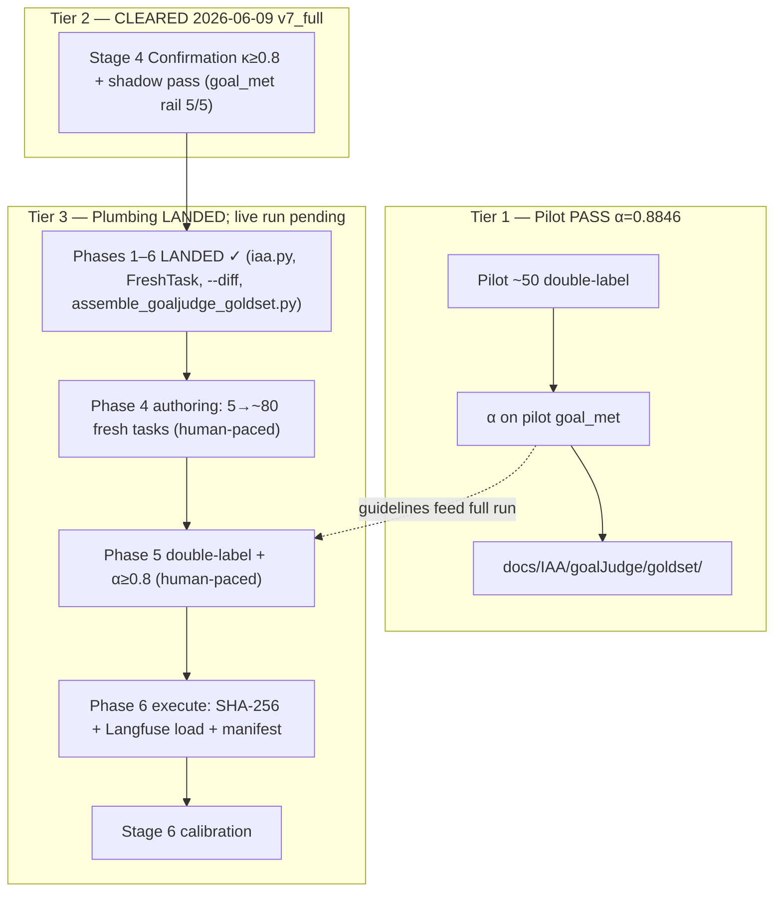

# GoalJudge Stage 5 — Golden Dataset Implementation Plan

> **Deliverable.** Implementation **plan only** — this document changes no source beyond the one
> already-landed `failure_mode` schema seam it documents (§6). It specifies Stage 5 of the
> [GoalJudge evaluation pipeline](../research/goaljudge_evaluation_pipeline_open_axial_coding_rubric.md):
> build the **stratified, double-labeled golden dataset** (`goaljudge_goldset_v1`) that is the trust
> anchor for Stage 6 judge calibration. The gold set is the *foundation doc's* core contribution
> ([`rubricgoldsetreseachforgoaljudge.md`](../research/rubricgoldsetreseachforgoaljudge.md)); this plan
> operationalizes it for **this** repo and wires it to the A2 rubric Stage 4 produced.
>
> **Three-tier gates (revised 2026-06-09 v7_full).** Stage 5 splits work across three tiers — see [§3](#3-what-done-means--the-three-tier-gate-split).
> **Tier 1 (Pilot)** allowed early pilot-50 double-labeling + α against the PROVISIONAL A2 rubric and **PASSED** (α = 0.8846). G5 κ = 1.0 PASS. Shadow behavioral gate **CLEARED 5/5 §10.2 on goal_met rail** (2026-06-09 v7_full re-run; see [shadow log §v7_full](../research/goaljudge_stage4_shadow_execution_log.md#v7_full-re-run-2026-06-09--cleared)) — A2 flips to CONFIRMED. **Tier 2 (Confirmation) CLEARED** — full ~250 assembly unblocked.
> **Tier 3 (Dataset) — plumbing LANDED.** All 7 phases of the [Tier 3 assembly plan](goaljudge_stage5_tier3_assembly.plan.md) closed under TDD discipline (Protocol A/B, 7 anti-patterns guarded against, 8 self-validation checks; 2473 tests passing, 0 failures, zero `langgraph`/`langchain` imports). The live ~250 labeling run remains the human-paced critical path. α ≥ 0.8 on the full set + test-split freeze still makes `goaljudge_goldset_v1` trusted for Stage 6. Building the *full* set on an unconfirmed rubric would inherit κ disagreement as
> noise ([phase 3 §1.2](../research/goaljudge_phase3_axial_coding.md)); the pilot tier accepts that risk
> with `rubric_version=stage4_provisional` and a re-label trigger if G5 fails (§8.4 rollback).
>
> **Date:** 2026-06-08. **Scope:** Stage 5 v1 — the gold-set schema, stratification design, double-
> labeling + α-gate protocol, and contamination firewall. **Out of scope:** Stage 6 calibration (P/R/F1,
> ECE, CoT-gaming flip-rate, §2.8 enable gates — see [Stage 6](#12-handoff-to-stage-6)); enabling
> `goal_judge_downgrade_enabled`; the live labeling run; the full A1/A3/A4/A5 rubric rollout (the gold
> set is *schema-ready* for all five axes, but v1 labels the **A2-confirmed** strata densely and the
> rest as available).
>
> **Upstream artifacts (all verified present):**
> [foundation: gold-set + rubric research](../research/rubricgoldsetreseachforgoaljudge.md) (READ FIRST),
> [pipeline playbook Stage 5](../research/goaljudge_evaluation_pipeline_open_axial_coding_rubric.md),
> [§2.8 enable-policy gates](../research/fix2_goaljudge_rubric_feasibility_pyramid.md),
> [phase 3 axial taxonomy](../research/goaljudge_phase3_axial_coding.md),
> [Stage 4 A2 rubric spec](../research/goaljudge_stage4_a2_rubric_spec.md) (the rubric the gold set
> labels against), [Stage 4 plan](goaljudge_stage4_a2_rubric.plan.md),
> [synthetic saturation corpus plan](goaljudge_synthetic_saturation_corpus.plan.md) (Phase-2b corpus
> generator — the dev-split *augmentation* engine, NOT the gold set).
> **Layering authority:** [`AGENTS.md`](../../AGENTS.md) (H1 prompts via `PromptService`; the gold set is
> an **offline asset**, never run live LLM in CI).

---

## Table of contents

- [1. Context and scope boundary](#1-context-and-scope-boundary)
- [2. The blocking dependency on Stage 4 Confirmation](#2-the-blocking-dependency-on-stage-4-confirmation)
- [3. What "done" means — the three-tier gate split](#3-what-done-means--the-three-tier-gate-split)
- [4. Phase 0 — Prerequisites (Stage 4 confirmed + tooling)](#4-phase-0--prerequisites-stage-4-confirmed--tooling)
- [5. Phase 1 — Gold-set schema and stratification spec](#5-phase-1--gold-set-schema-and-stratification-spec)
- [6. Phase 2 — `failure_mode` schema seam (LANDED)](#6-phase-2--failure_mode-schema-seam-landed)
- [7. Phase 3 — Double-labeling + α-gate protocol](#7-phase-3--double-labeling--α-gate-protocol)
- [8. Phase 4 — Dataset assembly and contamination firewall](#8-phase-4--dataset-assembly-and-contamination-firewall)
- [9. Phase 5 — Documentation and recipe](#9-phase-5--documentation-and-recipe)
- [10. Explicit non-goals](#10-explicit-non-goals)
- [11. Risk register](#11-risk-register)
- [12. Handoff to Stage 6](#12-handoff-to-stage-6)
- [13. Implementation checklist](#13-implementation-checklist)
- [14. Suggested PR sequence](#14-suggested-pr-sequence)

---

## 1. Context and scope boundary

**Stage 4 (A2 rubric) produced:** the first named, testable rubric criterion (A2 · corrupt-success)
encoded in [`goal_judge_system_prompt.j2`](../../prompts/goal_judge_system_prompt.j2), behind
`goal_judge_downgrade_enabled=false`, with a registry-anchored offline test surface and a shadow-
validation seam. It ships **PROVISIONAL** (Code gate §8.2 met) and awaits **Confirmation** (§8.3).

**Stage 5 v1 scope:**

- **Primary:** build `goaljudge_goldset_v1` — ~250 stratified, **double-labeled** items with the
  multi-axis label schema, α ≥ 0.8 on `goal_met`, and a frozen held-out `test` split never tuned on.
- **Secondary:** make the gold set *schema-ready* for the full A1–A5 rollout (the `failure_mode` axis
  carries all five categories' member codes) while v1 **densely labels the A2-confirmed strata** and
  treats A1/A3/A4/A5 as best-available.
- **Out of scope for v1:** Stage 6 calibration metrics + §2.8 gates; the live labeling run; flipping
  the downgrade flag; generating the ~250 items (that is the *live* Phase 4 work — this plan authors the
  spec, schema, protocol, and firewall that make it executable).

**The gold set is the trust anchor, not the rubric.** Stage 4 asked *"is the A2 definition right?"*
(answered by κ on the **category**). Stage 5 asks *"can we measure how well the judge applies it?"*
(answered by a labeled set the judge is scored against). They are different instruments with different
agreement units — see §3 and §7.

```mermaid
flowchart TD
  subgraph s4 [Stage 4 — A2 rubric]
    Conf["Confirmation gate §8.3<br/>κ≥0.8 + verdict swap"]
  end
  subgraph phase0 [Phase 0 — Prereqs]
    Tool["failure_mode seam (LANDED)<br/>+ export carries the axis"]
  end
  subgraph phase1 [Phase 1 — Schema + strata]
    Spec["goldset_spec.md<br/>multi-axis schema + stratification"]
  end
  subgraph phase3 [Phase 3 — Label protocol]
    Proto["double-label + α≥0.8 protocol<br/>(instrument, not results)"]
  end
  subgraph phase4 [Phase 4 — Assemble (LIVE)]
    Build["~250 items · dev/test split<br/>contamination firewall · α-gate"]
  end
  subgraph s6 [Stage 6 — Calibration]
    Cal["P/R/F1 on goal_met=False<br/>§2.8 enable gates"]
  end
  Conf --> Tool --> Spec --> Proto --> Build --> Cal
  Spec -. strata defs .-> Proto
  Build -. "synthetic → dev only" .-> Build
```

---

## 2. The blocking dependency on Stage 4 Confirmation

This is the **load-bearing constraint** of Stage 5 and the reason most of it is *prep, not execution*.

| Stage 4 Confirmation item | Why Stage 5 needs it first | Source |
|---|---|---|
| **G1/G2/G4 batch re-run + E1 export** under `synthetic-saturation-user` | Produces the **registry-joined, `eval.goal_judge`-bearing traces** that become gold-set *items* (with a deterministic `trace_id`↔`task_id` join). Without it there is no clean trace substrate to stratify. | [G3 batch runbook](../research/goaljudge_stage4_a2_g3_batch_runbook.md) |
| **G3 Axis-B remediation** | A case with an un-corrected Axis-B confound is **not eligible** for the behavioral strata (it measures the sandbox, not the agent). G3 is what makes a case admissible. | [phase 3 §8](../research/goaljudge_phase3_axial_coding.md) |
| **Human IAA κ ≥ 0.8** on the A2 category | The gold set **labels against the A2 rubric**. If humans don't agree on the *category* (κ ≥ 0.8), labeling ~250 items against it inherits that disagreement as noise. κ-on-category is the prerequisite to α-on-`goal_met`. | [Stage 4 IAA](../IAA/goalJudge/README.md) |
| **Shadow run flipped to behavioral** (verdict swap) | Confirms the *confirmed* rubric actually fires as specified on real traces before those traces seed the gold set. | [Stage 4 spec §10.2](../research/goaljudge_stage4_a2_rubric_spec.md) |

**Consequence.** Phases 1–3 + 6 (schema, spec, protocol, the landed seam) are **authorable now**.
**Tier 1 pilot labeling** may begin once batch traces are exported (the four rows above are not required
for the pilot). **Tier 3 full assembly** cannot begin until all four rows are green — this plan makes
that work *executable on day one of confirmation*.

> **Two distinct IAA numbers — do not conflate.** Stage 4 G5 computes **Cohen's/Fleiss' κ on the Axis-A
> *category*** (is this trace A2?) — the rubric-validity instrument. Stage 5 computes **Krippendorff's α
> on the binary `goal_met`** over ~250 items — the gold-set-trust instrument. κ≥0.8 (Stage 4) gates
> whether you *may build* the set; α≥0.8 (Stage 5) gates whether the *built set* is trustworthy. See
> [§7](#7-phase-3--double-labeling--α-gate-protocol).

---

## 3. What "done" means — the three-tier gate split

Mirroring Stage 4's Code-vs-Confirmation discipline, Stage 5 separates **authorable scaffolding**,
**early pilot labeling**, and the **full live-validated dataset**.



| Tier | Gate | What may proceed | Risk accepted | Current status |
|---|---|---|---|---|
| **Pilot (Tier 1)** | Instruments ready + GCP batch traces exported | Pilot-50 labeling by same 2 annotators; α on pilot; guideline revision | Labels against **PROVISIONAL** A2 rubric; re-label if G5 fails or rubric iterates (§8.4 rollback) | **PASS** (α = 0.8846) |
| **Confirmation (Tier 2)** | G5 κ≥0.8 + shadow behavioral pass + G1–G10 | Unlock full ~250 assembly | — | **CLEARED** (v7_full 5/5) |
| **Dataset (Tier 3)** | α≥0.8 on full set + test-split freeze | `goaljudge_goldset_v1` trusted for Stage 6 | — | **Plumbing LANDED**; live run pending (Phase 4 authoring + Phase 5 labeling) |

### 3.1 Prep gate — "instruments ready" (authorable now)

All of the following may land while Stage 4 Confirmation is still open:

- `failure_mode` schema seam merged (telemetry-only, default-None — **LANDED**, §6).
- Gold-set schema + stratification spec merged ([§5](#5-phase-1--gold-set-schema-and-stratification-spec)).
- Double-labeling + α-gate protocol in [`docs/IAA/goalJudge/goldset/`](../IAA/goalJudge/goldset/README.md)
  (canonical home for label sheets + α results; research dir cross-links only).
- Contamination-firewall (dev/test split, provenance, hash-freeze) design merged ([§8](#8-phase-4--dataset-assembly-and-contamination-firewall)).
- `scripts/compute_goaljudge_stage5_alpha.py` + pilot sheet scaffold (**LANDED** 2026-06-09).
- Offline pins green: `pytest tests/components/test_goal_judge.py -q` (the `failure_mode` axis + enum
  integrity), full suite still green.
- `goal_judge_downgrade_enabled` remains `false`.

### 3.2 Pilot gate — "pilot guidelines validated" (Tier 1, early OK)

The pilot may proceed **before** Stage 4 Confirmation clears:

- Pilot sheet populated from `gcp_2026-06-09` batch (22 production) + synthetic dev augment
  ([`goaljudge_stage5_goldset_pilot_sheet.csv`](../IAA/goalJudge/goldset/goaljudge_stage5_goldset_pilot_sheet.csv)).
- Same 2 annotators as Stage 4 IAA; `rubric_version=stage4_provisional` on every row.
- **Krippendorff's α ≥ 0.8 on pilot `goal_met`**; disagreement post-mortem documented; guidelines
  updated for the full run.
- **Re-label trigger:** if Stage 4 G5 later fails (κ < 0.8) or §8.4 rollback fires, mark pilot rows
  `superseded` and re-label after rubric revision.

### 3.3 Dataset gate — "gold set trusted" (Tier 3, needs Tier 2 + 2 annotators)

`goaljudge_goldset_v1` is **trusted** (and usable by Stage 6) only when **all** hold:

- Stage 4 A2 rubric **confirmed** (§2 — all four rows green).
- ~250 items assembled, stratified per [§5](#5-phase-1--gold-set-schema-and-stratification-spec), each
  **double-labeled** by ≥2 independent annotators with disagreements adjudicated (guidelines refined from pilot).
- **Krippendorff's α ≥ 0.8 on `goal_met`** over the labeled set (≥0.667 floor → revise guidelines and
  re-label; do not freeze below 0.8).
- `test` split frozen + content-hashed, built **only** from production / fresh human-authored items
  (zero synthetic), and demonstrably never exposed to rubric/prompt iteration.
- Every row carries `split` ∈ {dev, test}, `provenance` ∈ {production, synthetic}, and a `failure_mode`
  label; `set(item_ids)` has no orphans/duplicates.

---

## 4. Phase 0 — Prerequisites (Stage 4 confirmed + tooling)

| Prereq | Work | Owner | Acceptance | Status |
|---|---|---|---|---|
| **S4-CONF** | Stage 4 A2 rubric confirmed (the four §2 rows) | Data/runtime + 2 humans | All four green | **DONE** (2026-06-09 v7_full — see [shadow log §v7_full](../research/goaljudge_stage4_shadow_execution_log.md#v7_full-re-run-2026-06-09--cleared)) |
| **SEAM** | `failure_mode` on `GoalVerdict` (telemetry-only) | Engineering | Field default-None; enum == registry Axis-A codes; export round-trips | **DONE** (§6) |
| **EXPORT** | `eval_capture` / corpus export carries `failure_mode` end-to-end | Engineering | `verdict.model_dump()` already includes it (no orchestration change); confirm [`export_goaljudge_corpus.py`](../../scripts/export_goaljudge_corpus.py) row surfaces it | **DONE** |
| **DATASET-IO** | Langfuse dataset CRUD seam (create `goaljudge_goldset_v1`, add items, tag split/provenance) | Engineering | L2 record/replay over mock Langfuse; offline | **DONE** ([`goaljudge_goldset_dataset.py`](../../services/governance/goaljudge_goldset_dataset.py)) |

**Dependency order:** SEAM (done) → EXPORT → DATASET-IO → *(S4-CONF clears)* → Phase 4 assembly.

> EXPORT and DATASET-IO are the only remaining *authorable code* prereqs; both are offline (L2,
> mock-provider) and small. They are the seams Phase 4 drives — author them before the live run so day-1
> of confirmation is pure labeling, not plumbing.

---

## 5. Phase 1 — Gold-set schema and stratification spec

**File:** [`docs/research/goaljudge_stage5_goldset_spec.md`](../research/goaljudge_stage5_goldset_spec.md)
(new) — the canonical Stage 5 artifact, the analogue of the Stage 4 rubric spec.

### 5.1 Multi-axis label schema (collapsed to binary for the gate)

Per the foundation doc §C.2, each gold-set item records:

| Axis | Type | Role | Repo binding |
|---|---|---|---|
| `goal_met` | bool | **The gate signal + the α unit** | [`GoalVerdict.goal_met`](../../components/schemas.py) |
| `graceful_failure` | bool | impossible-correctly-reported (separate from `goal_met`) | `GoalVerdict.graceful_failure` |
| `partial_fraction` | float 0..1 | verified subtasks ÷ total (telemetry) | `GoalVerdict.partial_fraction` |
| `failure_mode` | enum∣null | **Stage 5 stratum label** (Axis-A member code) | `GoalVerdict.failure_mode` (§6) |
| `evidence_spans` | list[str] | the observable tool-output/state that justifies the call | `CriterionVerdict.evidence` |
| `split` | {dev,test} | held-out discipline | dataset field |
| `provenance` | {production,synthetic} | contamination firewall | dataset field |

The gate uses **only `goal_met`**; the rest support calibration and error analysis. `failure_mode` is the
field that makes "each taxonomy category becomes a stratum" mechanically checkable.

### 5.2 Stratification — the taxonomy *defines* the strata

The Stage-3 Axis-A categories ([phase 3 §3](../research/goaljudge_phase3_axial_coding.md)) become the
sampling strata. Composition target (foundation doc §C.4): **~40 % representative / 30 % boundary / 20 %
edge / 10 % impossible**, **oversampling the `goal_met=False` and impossible strata** (the downgrade
depends on them). The `failure_mode` ↔ Axis-A ↔ stratum crosswalk is authored in full in the spec; the
A2 cluster (`fabricated-progress` / `partial-counted-as-full` / `subtask-dropped`) is **densely
sampled** in v1 because it is the confirmed criterion; A1/A3/A4/A5 are schema-present but
best-available until their rubric rollout.

### 5.3 Item sourcing (where ~250 items come from)

1. **Production / batch traces (the test-split backbone).** The Stage 4 G1/G2 batch under
   `synthetic-saturation-user` — registry-joined, `eval.goal_judge`-bearing — is the real-trace source.
   These are double-labeled and may populate **both** splits.
2. **Synthetic augmentation (dev-split only).** Scarce strata (`fabricated-progress`, impossible,
   partial) are augmented via the [synthetic saturation corpus](goaljudge_synthetic_saturation_corpus.plan.md)
   generator — *generate inputs, ground in real constraints, verify the case triggers the intended
   scenario* (Hamel/Shankar). **Provenance-tagged `synthetic`, dev-split only**, never in the held-out
   test split (the contamination firewall, §8).
3. **Public-benchmark schemas, not items.** Borrow ground-truth *definitions* (τ-bench end-state,
   TheAgentCompany checkpoints, WebArena unachievable tasks, AgentBoard subgoals) but author **fresh
   tasks** for the final calibration set (foundation doc Caveats — dodge contamination/decay).

### 5.4 Size and split discipline

~250 items validates 80 % human–judge agreement at 95 % CI (binomial); dev/test ≈ 60/40; the test split
is frozen, hashed, and never iterated on (the EvalGen criteria-drift mitigation). Allocate extra to the
higher-variance `goal_met=False` class.

---

## 6. Phase 2 — `failure_mode` schema seam (LANDED)

**Status: DONE (2026-06-08).** The one piece of Stage 5 that touches source landed as part of this prep
(it is the schema handoff Stage 4 spec §9 promised, and it is the field the gold set's stratum axis maps
to). Implemented in [`components/schemas.py`](../../components/schemas.py):

- **`GOAL_FAILURE_MODES`** — a `frozenset` of the **16 active Axis-A member codes** (A1–A5), kept in sync
  with the registry's `target_code` values; `correct-complete` (pass baseline) and `tool-stub-limitation`
  (retired → Axis-B B5) excluded by construction.
- **`GoalVerdict.failure_mode: str | None = None`** — telemetry-only, **default-None**, with a
  `field_validator` that coerces absent/blank/`"none"` → `None` and **rejects out-of-vocabulary codes**
  (a labelling bug should surface, not be silently stored). Mirrors the `partial_fraction` docstring
  contract verbatim: **the orchestration downgrade gate reads ONLY `goal_met`; `failure_mode` MUST NOT
  be wired into gating.**

**Why this is safe to land pre-confirmation.** A v1 verdict that omits the key is unchanged (`None`); the
[`_parse_verdict`](../../components/goal_judge.py) path passes unknown-but-tolerated keys straight to
`model_validate` (pydantic `extra="ignore"`), so nothing breaks; `verdict.model_dump()` already exports
the field into the eval-capture `ai_response` (the Stage 5 harvest path) with **no orchestration change**.

**Tests** ([`tests/components/test_goal_judge.py`](../../tests/components/test_goal_judge.py)): in
`TestNewVerdictAxes` — A2 code parses, blank/`"none"` → None, unknown raises, and the back-compat test
asserts absent-key ⇒ None (TAP-4: back-compat before happy path). Plus `TestFailureModeEnumIntegrity`
pins `GOAL_FAILURE_MODES` ⊇ the registry's active Axis-A codes (an F7-style drift guard so the schema
vocabulary can never silently diverge from the taxonomy). **27 passed** in that file; **72 passed**
across the GoalJudge offline surface (judge + redteam-offline + shadow-offline + registry-phase0 + gate).

---

## 7. Phase 3 — Double-labeling + α-gate protocol

**Canonical dir:** [`docs/IAA/goalJudge/goldset/`](../IAA/goalJudge/goldset/) — reports, filled label
sheets, and α results live here (mirrors Stage 4 [`docs/IAA/goalJudge/`](../IAA/goalJudge/README.md)).
**Research cross-links:** [`docs/research/goaljudge_stage5_goldset/`](../research/goaljudge_stage5_goldset/)
(spec, firewall design, blank template — not live-run outputs).

| File (canonical) | Role |
|---|---|
| [`goldset/README.md`](../IAA/goalJudge/goldset/README.md) | α protocol + three-tier gates |
| [`goldset/goaljudge_stage5_goldset_pilot_sheet.csv`](../IAA/goalJudge/goldset/goaljudge_stage5_goldset_pilot_sheet.csv) | Pilot label sheet (Tier 1) |
| [`goldset/goaljudge_stage5_goldset_pilot_results.md`](../IAA/goalJudge/goldset/goaljudge_stage5_goldset_pilot_results.md) | Pilot α results |
| [`goldset/goaljudge_stage5_goldset_results.md`](../IAA/goalJudge/goldset/goaljudge_stage5_goldset_results.md) | Full-run α results (Tier 3) |
| [`scripts/compute_goaljudge_stage5_alpha.py`](../../scripts/compute_goaljudge_stage5_alpha.py) | α helper (mirror Stage 4 κ script) |

**Pilot may run at Tier 1** (before Confirmation). Full ~250 labeling remains Tier 3.

### 7.1 The agreement unit and the coefficient

- **Unit:** the binary **`goal_met`** per item (the class that triggers the downgrade).
- **Coefficient: Krippendorff's α** (not Cohen's κ). Rationale (foundation doc §C.4): α generalizes to
  ≥2 annotators, any measurement scale, and missing data — the realistic gold-set setting. (Stage 4
  used Cohen's κ because it had exactly two raters on a nominal category; the gold set will rotate
  annotators and carry partial labels, so α is correct.)
- **Target: α ≥ 0.8** ("reliable"); **0.667** is the tentative-conclusions floor; below ~0.667 ⇒ revise
  the labeling guidelines and add disambiguating examples, then re-label.

### 7.2 Procedure

1. **Pilot ~50 items first (Tier 1 — may run before Confirmation).** Compute α, refine guidelines on
   the disagreements (the EvalGen co-construction loop) **before** scaling to ~250.
2. **≥2 independent annotators per item** (same annotators as Stage 4 IAA); they do not see each other's labels.
3. **Evidence hierarchy** (inherited from Stage 4 spec §8.3): Langfuse trace (tool trajectory + final
   answer) is primary; Playwright `response_text` only on a full DOM render; status-feed-only UI
   captures are inadmissible.
4. **Adjudicate** disagreements to a gold label; record the adjudication so the test split has a single
   defensible truth.
5. **Score α on `goal_met`**; freeze only at α ≥ 0.8.
6. Optionally record `failure_mode` per item — member-code disagreement *within* an agreed
   `goal_met=False` is **not** a `goal_met` disagreement (same convention as Stage 4: agreement is at
   the gate signal, the finer label is metadata).

### 7.3 What this dir commits vs withholds

Commit: the README protocol, pilot/full label sheets (columns per [spec §9](../research/goaljudge_stage5_goldset_spec.md#9-dataset-field-contract)
+ `rubric_version`), the α helper, and α *results* in `docs/IAA/goalJudge/goldset/` (live-run outputs,
same policy as Stage 4 IAA). **Never commit:** adjudication keys for ~250 production traces (gold truth =
adjudication, not registry).

---

## 8. Phase 4 — Dataset assembly and contamination firewall

**This is the live/human boundary — NOT executed by this plan.** Authored here as the executable runbook
day-1 of confirmation follows.

### 8.1 Assembly steps (executable once Stage 4 confirmed)

1. Pull the Stage 4 G1/G2 batch traces (registry-joined, `eval.goal_judge`-bearing) via
   [`export_goaljudge_corpus.py`](../../scripts/export_goaljudge_corpus.py) (now carrying `failure_mode`).
2. Stratify per [§5.2](#52-stratification--the-taxonomy-defines-the-strata); identify scarce strata.
3. Augment scarce strata with synthetic inputs (corpus generator), **tagged `provenance=synthetic`**.
4. Double-label per [§7](#7-phase-3--double-labeling--α-gate-protocol); adjudicate; compute α.
5. Assign `split`: synthetic → **dev only**; build the **test** split from production/fresh items;
   content-hash and freeze it.
6. Create the Langfuse `goaljudge_goldset_v1` dataset (DATASET-IO seam, §4); load items; assert
   `set(item_ids)` has no orphans/duplicates and `test ∩ synthetic = ∅`.

### 8.3 Full assembly runbook (Tier 3 — after Stage 4 Confirmation)

1. Pull full corpus export (all registry-joined batch traces + fresh human-authored tasks for test backbone)
   via [`export_goaljudge_corpus.py`](../../scripts/export_goaljudge_corpus.py).
2. Stratify per [spec §4](../research/goaljudge_stage5_goldset_spec.md#4-stratification-design): 40/30/20/10
   composition; oversample `goal_met=false` and A2 member codes.
3. Augment scarce strata synthetically → **dev only** (corpus generator).
4. Double-label with same 2 annotators + refined guidelines from pilot.
5. α ≥ 0.8 on full set; adjudicate via `compute_goaljudge_stage5_alpha.py`.
6. Assign splits; assert firewall via [`goaljudge_goldset_dataset.py`](../../services/governance/goaljudge_goldset_dataset.py):
   `provenance=synthetic ⇒ split=dev`; `test ∩ synthetic = ∅`.
7. Content-hash + freeze test split; load `goaljudge_goldset_v1` in Langfuse.
8. Publish results in [`goaljudge_stage5_goldset_results.md`](../IAA/goalJudge/goldset/goaljudge_stage5_goldset_results.md).

### 8.2 The contamination firewall (the EvalGen criteria-drift mitigation)

| Rule | Why | Check |
|---|---|---|
| Synthetic/augmented items → **dev split only** | A red-team authored by the rubric's authors tests only anticipated attacks; the test split must be independent | `provenance=synthetic ⇒ split=dev` (assert) |
| **Test split never tuned on** | Iterating the prompt on the test split overstates calibration | hash-freeze the test split; diff the hash each Stage-6 run |
| Track `provenance` as a label | Report Stage-6 metrics on the **production-only** test subset | per-`provenance` metric breakdown in Stage 6 |
| Fresh tasks for final calibration | Public-benchmark items decay/contaminate (SWE-bench Verified Feb-2026 deprecation) | author own tasks; reuse only *schemas* |

---

## 9. Phase 5 — Documentation and recipe

- Bridge the [pipeline playbook Stage 5](../research/goaljudge_evaluation_pipeline_open_axial_coding_rubric.md)
  to this plan + the gold-set spec.
- Add a Stage 5 recipe (`docs/recipes/goaljudge/03_stage5_goldset.md`, *optional*) mirroring the Stage 3/4
  intern house-style — the detective-metaphor lessons: why the gold set ≠ the rubric, the κ-vs-α
  distinction, the contamination firewall, the synthetic-augments-dev-only discipline.
- Cross-link the Stage 4 spec §9 `failure_mode` mapping → the landed seam (§6) and this plan.

---

## 10. Explicit non-goals

| Item | Defer to |
|---|---|
| P/R/F1 on `goal_met=False`, ECE, CoT-gaming flip-rate | **Stage 6** ([§12](#12-handoff-to-stage-6)) |
| §2.8 enable gates / flipping `goal_judge_downgrade_enabled` | **Stage 6** |
| The live ~250-item labeling run | Phase 4 (post-confirmation) |
| Full A1/A3/A4/A5 rubric rollout | Stage 4 v2+ (gold set is schema-ready, labels best-available) |
| Re-deriving the foundation doc's schema/size/IAA research | It is the foundation — this plan *applies* it |

---

## 11. Risk register

| Risk | Mitigation |
|---|---|
| **Building the full gold set on an unconfirmed rubric** | **Tier 2 hard gate** — full ~250 assembly blocked until κ≥0.8 + verdict swap; pilot Tier 1 uses `stage4_provisional` + re-label trigger |
| **Pilot labels against PROVISIONAL rubric** | Tag `rubric_version=stage4_provisional`; re-label on G5 fail / §8.4 rollback |
| **Batch-variance cases (GJ-011, GJ-003B) pollute strata** | Document observed behavior in sheet `note`; do not force registry-intent labels; exclude unstable rows from test split |
| **Duplicate IAA paths** | Canonicalize on `docs/IAA/goalJudge/`; stub redirects in `docs/research/goaljudge_stage4_iaa/` |
| **Synthetic items leak the generator's blind spots into the test split** | Firewall: synthetic → dev only; test split from independent/fresh items (§8.2) |
| **α never reaches 0.8** | Pilot-50 → revise guidelines → re-label (§7.2); the PROVISIONAL prompt stays shipped (flag false ⇒ no prod impact) |
| **`failure_mode` vocabulary drifts from the taxonomy** | `TestFailureModeEnumIntegrity` pins enum ⊇ registry Axis-A codes (§6) |
| **Test split silently tuned on** | hash-freeze + per-run hash diff (§8.2) |
| **Class imbalance hides judge weakness** | oversample `goal_met=False`/impossible; report class-specific metrics (Stage 6), not accuracy |
| **Confusing Stage-4 κ with Stage-5 α** | §2 callout + §7.1 fix the units explicitly |

---

## 12. Handoff to Stage 6

Stage 6 (judge calibration) consumes the frozen `goaljudge_goldset_v1` and terminates in the §2.8 enable
gates. **It does not start until the Stage 5 Dataset gate (§3.2) is green** — i.e. until the live ~250 labeling run completes and `assemble_goaljudge_goldset.py` produces the frozen manifest. The handoff contract:

| Stage 6 needs | Stage 5 provides |
|---|---|
| A frozen, hashed `test` split | `compute_test_split_hash` (Tier 3 Phase 2) + `assemble_goaljudge_goldset.py` step 4 |
| Per-`failure_mode` strata | the `failure_mode` axis (§6) + stratification (§5.2) + `failure_mode_distribution` in the v1 manifest (Tier 3 Phase 6) |
| `goal_met` truth at α≥0.8 | the α-gate (§7) + `services/governance/iaa.py` (Tier 3 Phase 5) |
| Production-only metric subset | the `provenance` label (§8.2) + the contamination firewall (`assert_assembly_invariants`) |
| CoT-gaming red-team stratum | the densely-sampled `fabricated-progress` stratum (§5.2) + the existing offline red-team pin |
| Calibration baseline diff target | `cache/goaljudge_eval/goldset_v1_manifest.json` (12 required keys + 3 informational distributions) |

Stage 6 then reports **P/R/F1 on `goal_met=False`**, κ vs human labels, ECE (diagnostic-only), and the
CoT-gaming verdict-flip rate, and gates deployment on
[§2.8](../research/fix2_goaljudge_rubric_feasibility_pyramid.md): precision ≥ 0.90, recall ≥ 0.70,
false-downgrade ≤ 2 %, flip ≤ 5 %, κ ≥ 0.6 — **flag default-off until all clear.** A separate Stage 6 plan will own that work; with Tier 3 plumbing LANDED, **Stage 6 calibration is now unblocked at the engineering level** (only the live labeling run separates the two stages).

---

## 13. Implementation checklist

| ID | Task | Status |
|---|---|---|
| **failure-mode-seam** | Add `failure_mode` to `GoalVerdict` (telemetry-only, default-None) + enum-integrity pin | **done ✓** |
| export-carries-mode | Confirm corpus/eval export surfaces `failure_mode` end-to-end | **done ✓** |
| dataset-io | Langfuse dataset CRUD seam (L2, mock) for `goaljudge_goldset_v1` | **done ✓** |
| goldset-spec | Author `goaljudge_stage5_goldset_spec.md` (schema + stratification + crosswalk) | **done ✓** |
| label-protocol | Research-dir protocol + blank template (`goaljudge_stage5_goldset/`) | **done ✓** |
| firewall-design | Contamination firewall (dev/test split, provenance, hash-freeze) documented | **done ✓** |
| **iaa-goldset-dir** | Create `docs/IAA/goalJudge/goldset/` + README + pilot sheet scaffold | **done ✓** (2026-06-09) |
| **alpha-script** | `scripts/compute_goaljudge_stage5_alpha.py` | **done ✓** (2026-06-09) |
| **pilot-corpus-export** | Export + join `gcp_2026-06-09` traces; verify `eval.goal_judge` | **done ✓** — 50-row corpus export (`corpus_gcp_2026-06-09.jsonl`) + batch JSONL join |
| **pilot-50-sheet** | Populate pilot sheet (22 prod + synthetic dev augment) | **done ✓** — `build_goaljudge_stage5_pilot_sheet.py` |
| **annotator2-s4** | Complete Stage 4 `r2_*`; compute κ; update IAA results | **done ✓** (2026-06-09) — κ = 1.0, G5 PASS |
| **pilot-label-alpha** | Pilot double-label + α≥0.8 + guideline revision | **done ✓** (2026-06-09) — α = 0.8846 PASS |
| **dedupe-iaa-paths** | Redirect `docs/research/goaljudge_stage4_iaa/` → `docs/IAA/goalJudge/` | **done ✓** (2026-06-09) |
| **stage4-confirmation** | Stage 4 A2 rubric confirmed (κ≥0.8 + verdict swap + G1–G10) | **done ✓** (2026-06-09 v7_full) — 5/5 §10.2 anchors PASS on goal_met rail; A2 CONFIRMED for Stage 5 α |
| **tier3-plumbing** | Tier 3 assembly pipeline (Phases 1–6 of [`goaljudge_stage5_tier3_assembly.plan.md`](goaljudge_stage5_tier3_assembly.plan.md)) | **done ✓** — Real Langfuse client, `compute_test_split_hash`, D6 cost telemetry, full-sheet builder + `--corpus`, `FreshTask` schema + drift-guards + authoring guide, α/diff/adjudication helpers (`services/governance/iaa.py`) + post-α coverage + labeling protocol, `scripts/assemble_goaljudge_goldset.py` + invariants + manifest builder. Test totals: **2473 passing, 0 failures, zero `langgraph`/`langchain`/`components` imports** in the new L1 modules. |
| assemble-goldset | Full ~250 assemble + split + Langfuse load (live run) | **plumbing done ✓**; live run pending Phase 4-authoring + Phase 5 labeling. Runbook: `python scripts/assemble_goaljudge_goldset.py --sheet … --manifest cache/goaljudge_eval/goldset_v1_manifest.json --frozen-at 2026-MM-DDTHH:MM:SSZ` |
| alpha-gate-full | Full-set α≥0.8 + test freeze (live run) | **plumbing done ✓** (`compute_goaljudge_stage5_alpha.py --diff`); live run pending double-labeling |
| stage5-recipe | Optional intern recipe `03_stage5_goldset.md` | optional |

---

## 14. Suggested PR sequence

1. **`failure_mode` schema seam** + enum-integrity pin. → **LANDED.**
2. Gold-set spec + research-dir protocol (`goaljudge_stage5_goldset/`). → **LANDED.**
3. **IAA goldset scaffold** — `docs/IAA/goalJudge/goldset/` README + `compute_goaljudge_stage5_alpha.py`
   + research-dir cross-links + dedupe stubs. → **LANDED** (2026-06-09).
4. **Pilot corpus** — export verification + populated `goaljudge_stage5_goldset_pilot_sheet.csv`. → **LANDED** (2026-06-09).
5. **Parallel human work** — Annotator 2 Stage 4 grades + pilot-50 double-label → `pilot_results.md`.
6. *(After G5 + shadow — Tier 2)* full assembly PR: ~250 items, α gate, Langfuse dataset freeze.
7. Hand off to Stage 6 (separate plan).

PRs 1–4 may land **before** Stage 4 Confirmation (early-pilot choice). PR 6 remains hard-gated on Tier 2.
