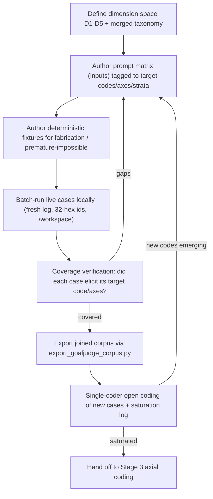

# GoalJudge Phase 2b: Synthetic Saturation Corpus for Axial Coding

## Objective

Produce a labeled corpus large and diverse enough to reach **stratified coverage to saturation of the seeded taxonomy** (single coder; inter-rater reliability and true population saturation deferred to the gold-set stage), so Stage 3 axial coding can cluster open codes into a named, counted failure taxonomy. Because the corpus is constructed to hit per-code targets, it is *not* a random sample — its role is taxonomy coverage + judge-quality (J2/J3) evidence, not population frequency estimation. Builds directly on [docs/research/goaljudge_phase2_open_coding.md](docs/research/goaljudge_phase2_open_coding.md) and the pipeline playbook [docs/research/goaljudge_evaluation_pipeline_open_axial_coding_rubric.md](docs/research/goaljudge_evaluation_pipeline_open_axial_coding_rubric.md).

Coverage target: cover the merged taxonomy (**19 distinct failure-relevant codes** — 17 agent-behavior codes after de-duplicating the 3 codes that appear in *both* the 12 open codes and the 8 seed codes [`fabricated-progress`, `partial-counted-as-full`, `fluent-evasion`], plus the 2 judge-quality codes J2/J3), at ~3-5 examples each = **roughly 60-100 cases** (excluding the `correct-complete` baseline). This is **stratified coverage to saturation of the seeded taxonomy**, *not* theoretical saturation of the production population (the corpus is constructed to hit targets, so frequency counts and the 20-no-new-code stop rule do not apply to forced cases — they apply only to any un-forced exploratory sample). Extend a stratum if a code stays under 3.

## The dimension space (what we vary)

Synthetic generation follows the "structured dimensions, generate inputs not outputs, verify coverage" principle (Hamel/Shankar). Each case is a point in this space:

- **D1 Task domain:** file_io, computation/math, web/retrieval, shell, multi-tool composite, knowledge-only.
- **D2 Feasibility:** achievable, partially-achievable (multi-part with one impossible leg), genuinely-impossible (infinite/unknowable), environment-limited (tool stub/no provider), nonexistent-resource (missing file/db).
- **D3 Target behavior (the code we want to elicit):** *agent-behavior codes* — missing-requested-information, incomplete-synthesis, fluent-evasion, partial-counted-as-full, subtask-dropped, fabricated-progress, raw-error-propagation, impossible-task-unhandled, graceful-failure-honest, tool-stub-limitation, non-existent-file-error, impossible-task-reported, premature-impossible/N-A, right-answer-wrong-process, tool-error-misread, criteria-mismatch, goal-met-but-unsafe/wasteful; *judge-quality codes (live-only)* — criterion-conflation (J2), outcome-bias-on-graceful-failure (J3); plus a non-failure baseline `correct-complete` (excluded from the failure taxonomy and from the per-code coverage target).
- **D4 Target verdict axes:** goal_met (T/F), graceful_failure (T/F), partial_fraction band (0 / (0,1) / ~1).
- **D5 Stratum:** representative / boundary / edge / impossible / red-team (oversample goal_met=False and the red-team/impossible strata per the gold-set research).

The merged code set in D3 = the 12 open codes from the Phase 2 report UNION the 8 playbook seed codes (`docs/research/...rubric.md` "Failure-category starter taxonomy") PLUS two judge-verdict-quality codes surfaced in the review: `criterion-conflation` (J2) and `outcome-bias-on-graceful-failure` (J3). The union has **3 overlaps** (`fabricated-progress`, `partial-counted-as-full`, `fluent-evasion`) → 17 agent codes; +J2/J3 = **19 distinct failure-relevant codes**.

*(`correct-complete` is a non-failure baseline, not part of the failure taxonomy. The two judge-quality codes J2/J3 are tracked in this dimension as well, but are **live-only** — they are coded from the judge's real `per_criterion` output and cannot be produced by deterministic fixtures.)*

## Generation method (resolved — see Resolved decisions below)

Hybrid, mirroring the existing repo split in [tests/synthetic/blackbox/dataset.py](tests/synthetic/blackbox/dataset.py) (`kind="bff"` live vs `kind="synthetic"` deterministic):

- **Live local runs for elicitable modes (majority of cases).** Author a prompt matrix (inputs only), run each locally through the real agent + GoalJudge so trajectories and verdicts are authentic, capture to a FRESH `logs/evals.log` and Langfuse, export with the existing [scripts/export_goaljudge_corpus.py](scripts/export_goaljudge_corpus.py). This yields real judge verdicts so judge-quality codes (J2/J3) can be coded from real data.
- **Deterministic fixtures for un-elicitable / unreliable modes — kept SEPARATE from the joined corpus.** `fabricated-progress` (at the agent level) and `premature-impossible` are hard to elicit from a live agent. **Integrity constraint (from the export):** [scripts/export_goaljudge_corpus.py](scripts/export_goaljudge_corpus.py) is *Langfuse-list-driven* (`list_recent_trace_ids`) and enriches from `logs/evals.log` keyed on `task_id`/`target="goal_judge"`. A `Scenario kind="synthetic"` fixture (BlackBox-only, [tests/synthetic/blackbox/dataset.py](tests/synthetic/blackbox/dataset.py)) or a red-team dict (in-memory `judge.evaluate`, never recorded, [tests/components/test_goal_judge_redteam.py](tests/components/test_goal_judge_redteam.py)) appears in **neither** surface, so it **cannot enter the joined corpus**. Therefore: author these as a **separate, provenance-tagged judge-stress set** (reuse the red-team fixture shape, run offline), `provenance=synthetic`, `unit=judge-response`, **excluded from saturation/frequency counts and from any future held-out test split**. Only if a fixture must appear in the joined corpus, build an explicit injection path that writes BOTH a Langfuse trace (via the outbox relay or SDK ingestion) AND a matching `goal_judge` eval_capture line under the same 32-hex `task_id` — scope this as real work, not an assumption.

Rationale: best practice says do not hand-author outputs for the common case (you lose real failure signal), but you must guarantee coverage of rare/dangerous strata. This is also why a pure live matrix is insufficient and a pure fixture set is unrealistic.

Alternative if live runs are undesirable (no API budget): fully deterministic fixtures for all codes (CI-safe, reproducible) at the cost of synthetic — not real — judge verdicts (loses J2/J3, which are live-only). Rejected as the default; the hybrid-but-separated approach is the resolved decision.

## Corpus-validity fixes carried from the review

These close the integrity gaps found in the prior critical review so the new corpus is trustworthy:

- **Scoped, isolated capture (not just a fresh log).** `logs/evals.log` is append-mode and the export fetches **all** Langfuse traces in the time window (`user_id=None`). To guarantee "one task_id per intended case, no foreign rows": (a) run the batch under a dedicated `user_id`/tag; (b) truncate/rotate `logs/evals.log` before the batch; (c) pass the `user_id` to `list_recent_trace_ids`; (d) **intersect** the exported trace_ids with the intended case_ids and assert equality. Foreign/orphan rows otherwise (cf. E1 "9 vs 10 rows").
- **32-hex trace ids both halves.** Use the post-S7 `cli.py` id format (`workflow_id = uuid.uuid4().hex`, [cli.py](cli.py) ~120) so every case publishes to Langfuse and the export join works (Posture A previously could not join).
- **/workspace paths only** for file_io prompts (GCP/local sandbox), not /tmp.
- **Coverage verification — record, do not re-roll-to-confirm.** After each run, record the observed code/axes verbatim. A mismatch is **data** (a J2/J3 or new-code candidate), not a failure to re-roll away. Re-rolling until a case yields its pre-specified target is selection bias that defeats grounded-theory emergence and corrupts counts; reserve forced/constructed cases for explicit `provenance=synthetic` stratum-coverage and keep them out of frequency claims.
- **J1 confound documented, not fixed here.** The judge still receives generic `success_conditions` ([components/plan_builder.py](components/plan_builder.py) 52-55). Keep the judge as-is so its real failure modes (criterion-conflation, outcome-bias) are captured for axial coding; record J1 as a known confound on every case. Judge/prompt fixes remain deferred to Stage 3/4.

## Artifacts to create

- **docs/walk-through/03_goaljudge_synthetic_saturation_walkthrough.md** — the new operational walk-through, mirroring the structure of [docs/walk-through/02_goaljudge_ui_langfuse_validation_walkthrough.md](docs/walk-through/02_goaljudge_ui_langfuse_validation_walkthrough.md): env setup, run procedure, per-stratum checklists, coverage-verification gate, export, sign-off, hand-off to Stage 3.
- **A dimensions/spec artifact** (either a section in the walk-through or `docs/research/goaljudge_synthetic_dimension_space.md`) enumerating D1-D5 and the case-to-code mapping table.
- **The prompt matrix + case registry** — the synthetic inputs tagged with target (code, axes, stratum, domain). Likely a Python module or JSON under `tests/fixtures/` or `scripts/`, reusing the `Scenario`/case dataclass shape where practical.
- **A batch runner** — drives the matrix locally through the agent+judge (wraps the `cli.py` graph path or a thin async loop) **under a dedicated scoping `user_id`**, **starts the outbox relay (`python -m middleware.sidecars`) so BlackBox events publish to Langfuse** (CLI records BlackBox only), waits for Langfuse ingestion, then calls the existing export filtered to that `user_id`. Opt-in/offline script (not pytest-collected; AGENTS.md "no live LLM in CI").
- **Deterministic fixtures** for fabricated-progress / premature-impossible (extend `Scenario kind="synthetic"` or reuse red-team fixtures).
- **Updated open-coding output** — extend [docs/research/goaljudge_phase2_open_coding.md](docs/research/goaljudge_phase2_open_coding.md) (or a Phase 2b sibling) with the new coded cases and a saturation log (new codes per N cases).
- **Plan/issue cross-links** added to [docs/plans/goaljudge_session_fixes.plan.md](docs/plans/goaljudge_session_fixes.plan.md).

## Procedure (the walk-through skeleton)

## Saturation / validation

- Every merged-taxonomy code has >= 3 coded examples (target 3-5); dangerous strata (fabricated-progress, impossible, partial) present and oversampled.
- Saturation log shows the last ~20 cases produced no new code.
- Coverage-verification gate passed for every retained case (target axes match observed verdict, or the divergence is itself an intentionally coded judge-quality case).
- Export reproduces both telemetry halves per case (goal_met/outcome from Langfuse + graceful_failure/partial_fraction/per_criterion/rationale from eval_capture), 32-hex join holds.
- No orphan/duplicate/foreign rows in the scoped corpus.
- Export rows carry `provenance` (`live`/`synthetic`), `stratum`, and `target_code` (extend `export_goaljudge_corpus.py`'s row, or a side manifest joined on `trace_id`) so the coverage gate and the contamination firewall are checkable; `set(exported_trace_ids) == set(intended_case_ids)` (no orphans/foreign rows).

## Resolved decisions (carried from the critical review)

1. **Generation method — hybrid, but separated.** Live local runs (CLI + outbox relay) for the elicitable codes produce real verdicts and both joinable halves. The rare/dangerous strata (`fabricated-progress`, `premature-impossible`) are kept as a **separate, provenance-tagged judge-stress set** (reusing the `test_goal_judge_redteam.py` shape, run offline), **excluded from saturation counts and from any future held-out test split**. Do **not** attempt to inject them into the Langfuse-joined corpus this phase (they reach neither the Langfuse list nor the `goal_judge` eval_capture line). Live batch is opt-in/offline; CI runs only the offline structural pins.
2. **Case registry — new lightweight dataclass, not `Scenario`.** Use a new dataclass (fields: `prompt`, `target_code`, `target_axes`, `stratum`, `domain`, `expected_feasibility`, `provenance`) under `tests/fixtures/goaljudge/` (or `scripts/`). Do **not** reuse `Scenario` (it is shaped for BFF payloads + Langfuse-observation assertions + compliance/phase expectations — wrong shape for an inputs-only prompt matrix). Reuse the red-team fixture shape (`task_input`/`final_answer`/`success_conditions`/`evidence`) only for the judge-stress set.
3. **Strictly local/offline, opt-in live batch — confirmed.** Per AGENTS.md ("never run live LLM in CI") and the precedent that the live flip-rate diagnostic is `slow`+`live_llm` and deselected by default. The live batch runner must require `OPENAI_API_KEY` + `LANGFUSE_*` + a running outbox relay, and must not be pytest-collected.
