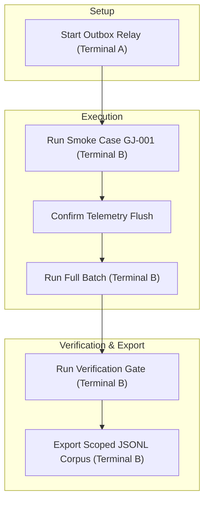

# GoalJudge Synthetic Saturation Run Plan

This document details the end-to-end execution plan for running the GoalJudge synthetic saturation corpus pipeline locally to calibrate and export a clean failure-taxonomy corpus.

---

## 1. Prerequisites & Keys Check

Before starting, ensure that `/Users/rajnishkhatri/Documents/AgentsFramework/agent/.env` contains the required keys. 
All pipeline scripts automatically load this `.env` file upon startup.

*   `OPENAI_API_KEY` (OpenAI model calls)
*   `LANGFUSE_PUBLIC_KEY`, `LANGFUSE_SECRET_KEY`, `LANGFUSE_HOST` (Telemetry publishing and trace fetch)

```bash
# Verify virtual environment is active and dev dependencies are installed
cd /Users/rajnishkhatri/Documents/AgentsFramework/agent
pip install -e ".[dev]"
```

---

## 2. End-to-End Execution Sequence



### Step 1: Start the Outbox Relay (Terminal A)
The Outbox Relay (sidecar) runs as a persistent background loop, polling the local checkpointer every second and pushing traces to Langfuse Cloud.

1. Open a new, dedicated terminal tab (Terminal A) and run:
   ```bash
   python -m middleware.sidecars
   ```
2. Keep this terminal open during the entire run window.

---

### Step 2: Run a Single-Case Smoke Test (Terminal B)
Verify end-to-end API connectivity and outbox relay transport before committing the full 15–20 minute run.

1. In your main terminal (Terminal B), run the first case:
   ```bash
   python scripts/run_goaljudge_synthetic_batch.py --case GJ-001
   ```
2. Confirm in Terminal A that a task completion was detected and successfully exported to Langfuse.

---

### Step 3: Execute the Full Synthetic Batch (Terminal B)
Run the 47 live synthetic cases sequentially. This drives the real agent and the task-adaptive GoalJudge, systematically eliciting the 15 failure-relevant taxonomy codes.

1. In Terminal B, run:
   ```bash
   python scripts/run_goaljudge_synthetic_batch.py
   ```
2. Confirm the prompt by typing `y`. Wait approximately **15 to 20 minutes** for all runs to finish.

---

### Step 4: Run the Coverage & Integrity Verification Gate (Terminal B)
Verify that all 47 cases executed cleanly, that no other local developer runs polluted the scoped batch, and that each code meets the target saturation level of $\ge 3$ cases.

1. Allow about 1–2 minutes for the outbox relay to finish flushing any lingering traces, then run:
   ```bash
   python scripts/verify_goaljudge_coverage.py
   ```
2. Inspect the generated Rich table. Check for:
   * **No foreign rows / No orphan rows** (scoping is perfectly clean)
   * **Saturated status** on all 15 failure codes
   * Any recorded **verdict axis divergences** (valuable judge-quality analysis data)

---

### Step 5: Export the Scoped Telemetry Corpus (Terminal B)
Join the Langfuse traces with the local structured `eval_capture` logs, exporting a unified qualitative corpus.

1. In Terminal B, run:
   ```bash
   python scripts/export_goaljudge_corpus.py --user-id "synthetic-saturation-user"
   ```
2. Verify that the file `cache/goaljudge_eval/run.jsonl` was successfully created and populated:
   ```bash
   head -n 2 cache/goaljudge_eval/run.jsonl
   ```
   Each row should carry the scoping properties: `"provenance": "live"`, `"stratum"`, and `"target_code"`.
