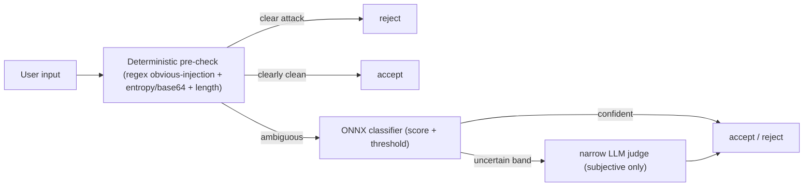

# Guardrails Tuning Refinement (F2 expansion)

Replaces the single prompt-tuning F2 item in the pipeline-hardening S3-S8 plan with a dimension-aware guardrails program. Grounded in NeMo Guardrails (5-rail taxonomy), OWASP LLM Top 10 2025, and InjecGuard/PIGuard over-defense research.

## Problem

[prompts/input_guardrail.j2](../../prompts/input_guardrail.j2) asks one fast LLM to judge "harmful/illegal actions" and "social engineering", overlapping with the deterministic tool-gating and PII layers. This causes trigger-word shortcut bias (the InjecGuard/NotInject failure mode): S3 ("run the shell command"), S5 ("keep retrying 25 times"), and S6 ("repeat it back" + PII) are wrongly rejected before the agent runs.

## Decisions locked

- Tuning target: a dedicated fine-tuned classifier (DeBERTa-v3 / PIGuard-style), ONNX inference.
- Dataset source: import the public NotInject dataset (held-out over-defense set) + augment locally.
- Scope: document the full 5-rail dimension space; implement Input rail now, Retrieval rail optional.

## A. Dimension matrix (document)

New doc `docs/Architectures/GUARDRAILS_DIMENSION_SPACE.md` mapping NeMo rails x OWASP-2025 x code/LLM split:

- Input (LLM01/LLM07): code = obvious-injection regex + entropy/base64 + length; model = fine-tuned classifier -> narrow LLM judge. Today: [services/guardrails.py](../../services/guardrails.py) `InputGuardrail` is LLM-only.
- Retrieval (LLM01 indirect): gap today; web_search/searxng results unguarded.
- Dialog: partial via [components/goal_judge.py](../../components/goal_judge.py).
- Execution (LLM06): EXISTS, deterministic -- shell allowlist + path sandbox in `services/tools/`.
- Output (LLM02): EXISTS -- `output_guardrail_scan` (regex BLOCK/REDACT) + `OutputGuardrail` (nightly judge).

Takeaway: Execution + Output rails are already solid and deterministic. Work concentrates on the Input rail cascade.

## B. Code/LLM enforcement split

The deciding criterion is enforceability, not severity. Objective -> code (FP-free); subjective -> model/LLM (needs intent).

Behind the existing `InputGuardrail.is_acceptable()` interface so [orchestration/react_loop.py](../../orchestration/react_loop.py) `guard_input_node` needs no structural change.

## C. Fine-tuned classifier (new service)

- Placement: `services/governance/injection_classifier.py` (Layer 2). `onnxruntime`/`tokenizers` are not langgraph/langchain, so allowed under invariant #4.
- Inference: ONNX Runtime, frozen weights, argmax. Deterministic -> zero-flake -> can run as a REAL L2 test in CI (not a live API call). This is the key win over the nondeterministic LLM judge.
- Base model + method: fine-tune from `protectai/deberta-v3-base-prompt-injection-v2` using PIGuard's MOF (Mitigating Over-defense for Free) to kill trigger-word shortcut bias.
- Graceful degrade: if the optional extra is absent, fall back to deterministic-only pre-check + existing LLM judge.

ASK-FIRST (AGENTS.md): new optional dependency extra and a new horizontal service. Add to [pyproject.toml](../../pyproject.toml): `guardrails = ["onnxruntime>=1.17", "tokenizers>=0.15"]`. Do not commit the ~184MB model; ship a quantized ONNX artifact (fetch at build / git-LFS) + a tiny smoke model for CI.

## D. Synthetic dataset (NotInject + local augment)

Offline only (`scripts/generate_guardrail_dataset.py`), six-stage SafeGuard pipeline: seed -> preprocess -> dedup -> augment -> teacher-label -> freeze.

Three seed pools:
- Genuine injection (reject): deepset prompt-injections + jailbreak collections.
- Over-defense held-out (accept): import NotInject (339 samples, stratified 1/2/3 trigger words x 4 topics). NEVER train on it -- it is the over-defense test set (SafeGuard documents a contamination incident inflating accuracy to 99.38%). Verify license + record provenance.
- Domain accept (accept): S1-S8 inputs from [tests/synthetic/blackbox/dataset.py](../../tests/synthetic/blackbox/dataset.py) -- the shell (S3), retry (S5), PII (S6) prompts.

Augment: teacher LLM injects trigger words into benign shell/retry/PII frames to grow domain-specific hard negatives.

Sample schema (PIArena-derived): `{id, text, label, rail, owasp, dimension, trigger_words, difficulty, source}`.

## E. Metrics & CI gate (three axes)

Frozen `tests/services/fixtures/guardrail_evalset.jsonl` + `tests/services/test_guardrail_classifier.py` (L2, deterministic ONNX, real inference):
- Malicious recall >= 0.95
- Over-defense accuracy on the NotInject split (headline F2 metric)
- Benign accuracy
- FPR < 2% (Llama-Guard-3's 4% FPR = ~40k wrongly-blocked/day at 1M msgs)

Small smoke subset in CI; full eval + classifier-vs-judge drift in a nightly `@pytest.mark.live_llm` job.

## Sequencing

f2-taxonomy + f2-prompt ship immediate over-block relief (no ML needed) -> dataset-gen -> train -> classifier + metrics -> retrieval rail (optional). Slots into the parent plan after F1 and before F4 golden capture.

## Validation

- `pytest tests/ -q` and `pytest tests/architecture/ -q` pass (classifier service must not violate layering).
- New L2 classifier gate (deterministic, no live LLM) passes the three-axis thresholds.
- Re-drive S3/S5/S6 via [scripts/validate_blackbox_langfuse.py](../../scripts/validate_blackbox_langfuse.py): all accepted at the input rail, reaching their intended event paths.

## References (external research)

- NeMo Guardrails rail types: https://docs.nvidia.com/nemo/guardrails/latest/about/rail-types.html
- OWASP LLM Top 10 2025 (LLM01 injection, LLM02 sensitive disclosure, LLM06 excessive agency, LLM07 system-prompt leakage)
- PIGuard / InjecGuard + NotInject (over-defense, MOF): https://aclanthology.org/2025.acl-long.1468.pdf , https://github.com/leolee99/PIGuard
- SafeGuard dataset construction pipeline (six-stage, contamination post-mortem)
- PIArena unified prompt-injection sample schema / evaluation
- Base model: https://huggingface.co/protectai/deberta-v3-base-prompt-injection-v2
