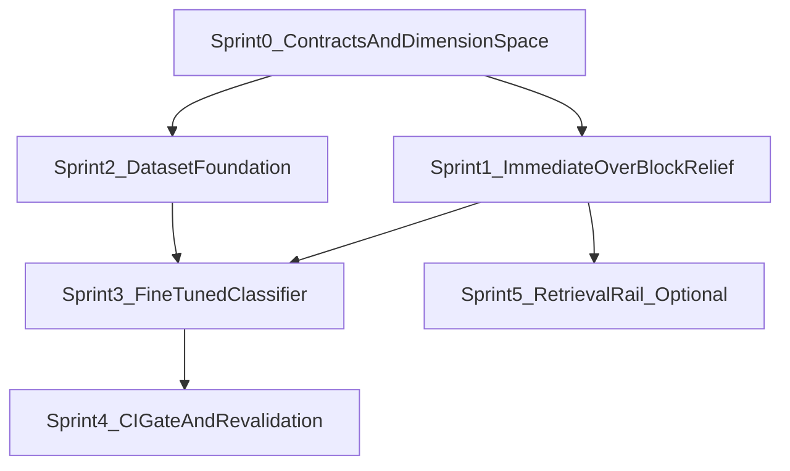

# Guardrails Tuning Sprint Board

## Objective

Execute the dimension-aware guardrails program defined in [`docs/plans/guardrails_tuning_refinement.plan.md`](guardrails_tuning_refinement.plan.md) as dependency-ordered sprints. The program replaces the single LLM-only input guardrail with a documented 5-rail x OWASP-2025 taxonomy, a code/LLM enforcement split, a deterministic pre-check, a fine-tuned ONNX injection classifier (PIGuard MOF strategy), a synthetic dataset (NotInject reference + local augment), and a three-axis CI gate that fixes the S3/S5/S6 over-blocking.

Aligned with:

- [`docs/Architectures/FOUR_LAYER_ARCHITECTURE.md`](../Architectures/FOUR_LAYER_ARCHITECTURE.md)
- [`docs/style-guides/STYLE_GUIDE_LAYERING.md`](../style-guides/STYLE_GUIDE_LAYERING.md)
- [`research/tdd_agentic_systems_prompt.md`](../../research/tdd_agentic_systems_prompt.md)

Companion documentation: the [`docs/recipes/guardrails/`](../recipes/guardrails/00_overview.md) recipe series narrates each sprint for AI intern engineers.

## Sprint Breakdown

The 11 plan todos map onto six sprints. Sprint 0 unblocks both Sprint 1 (no-ML relief) and Sprint 2 (dataset). Sprint 3 needs both the pre-check cascade (Sprint 1) and the frozen dataset (Sprint 2). Sprint 4 gates on the trained classifier (Sprint 3). Sprint 5 is optional and only needs the pre-check primitives from Sprint 1.

| Sprint | Theme | Plan todos | Depends on | Recipe |
| --- | --- | --- | --- | --- |
| 0 | Contracts & Dimension Space (no code, no ML) | `f2-taxonomy`, `f2-deps` | — | [`01_dimension_space.md`](../recipes/guardrails/01_dimension_space.md) |
| 1 | Immediate Over-Block Relief (no ML) | `f2-prompt`, `f2-precheck` | Sprint 0 | [`02_prompt_and_precheck.md`](../recipes/guardrails/02_prompt_and_precheck.md) |
| 2 | Dataset Foundation | `f2-dataset-gen`, `f2-evalset` | Sprint 0 | [`03_synthetic_dataset.md`](../recipes/guardrails/03_synthetic_dataset.md) |
| 3 | Fine-Tuned Classifier | `f2-train`, `f2-classifier` | Sprints 0, 1, 2 | [`04_finetuned_classifier.md`](../recipes/guardrails/04_finetuned_classifier.md) |
| 4 | CI Gate & Revalidation | `f2-metrics`, `f2-revalidate` | Sprint 3 | [`05_ci_gate_and_revalidation.md`](../recipes/guardrails/05_ci_gate_and_revalidation.md) |
| 5 | Retrieval Rail (optional) | `f2-retrieval` | Sprint 1 | [`06_retrieval_rail.md`](../recipes/guardrails/06_retrieval_rail.md) |

---

## Sprint 0 — Contracts & Dimension Space

### Sprint Goal

Lock the contracts every later sprint depends on: the documented rail taxonomy, the code/LLM enforcement split, the optional-dependency decision, and the frozen sample schema + eval thresholds. No runtime code, no ML.

### User stories

- As an architect, I want the full 5-rail x OWASP-2025 x code/LLM matrix documented so each later sprint knows which rail it touches and whether enforcement is deterministic or model-based.
- As a maintainer, I want the optional `guardrails` dependency extra decided up front (ASK-FIRST per AGENTS.md) so the classifier sprint has a known install + graceful-degrade path.
- As a test lead, I want the PIArena-derived sample schema and the three-axis eval thresholds frozen so the dataset and metrics sprints build against a stable contract.

### Dependency Checkpoints

- D0.1: ✅ Resolved — classifier placement (`services/governance/injection_classifier.py`, Layer 2) confirmed not to violate invariant #4; `onnxruntime`/`tokenizers` are not langgraph/langchain. See `GUARDRAILS_DIMENSION_SPACE.md` §C.
- D0.2: ✅ Resolved — ASK-FIRST **approved**; optional `guardrails = ["onnxruntime>=1.17", "tokenizers>=0.15"]` extra added to `pyproject.toml` and installed/verified; `injection_classifier` service design recorded. See §D.
- D0.3: ✅ Resolved — sample schema `{id, text, label, rail, owasp, dimension, trigger_words, difficulty, source}` and thresholds (malicious recall >= 0.95, over-defense accuracy, benign accuracy, FPR < 2%) frozen in §E.

### Story Board

| Story | Goal | Scope | Dependencies | Acceptance and Evidence |
| --- | --- | --- | --- | --- |
| S0-1 Dimension matrix (`f2-taxonomy`) | Document the 5-rail x OWASP-2025 x code/LLM matrix, marking exists vs gap per rail | New `docs/Architectures/GUARDRAILS_DIMENSION_SPACE.md`; references [`services/guardrails.py`](../../services/guardrails.py), [`components/goal_judge.py`](../../components/goal_judge.py), [`services/tools/`](../../services/tools) | D0.1 | Doc committed; each rail (Input/Retrieval/Dialog/Execution/Output) mapped to OWASP IDs with exists/gap labels and the takeaway that Execution + Output are already deterministic |
| S0-2 Dependency + degrade design (`f2-deps`) | ASK-FIRST: add optional `guardrails` extra; design deterministic-only fallback when absent | [`pyproject.toml`](../../pyproject.toml) (proposal only this sprint); degrade contract documented | D0.2 | ASK-FIRST approval recorded; graceful-degrade behavior (pre-check + existing LLM judge when ONNX absent) specified |
| S0-3 Schema + threshold freeze | Freeze PIArena sample schema and three-axis thresholds | Sprint board + dimension doc | D0.3 | Schema fields and numeric thresholds documented and referenced by S2/S4 stories |

### Sprint 0 Status Tracker

| Story | Status | Evidence |
| --- | --- | --- |
| S0-1 Dimension matrix | Done | [`docs/Architectures/GUARDRAILS_DIMENSION_SPACE.md`](../Architectures/GUARDRAILS_DIMENSION_SPACE.md) §A (5-rail × OWASP-2025 × code/LLM matrix, exists/gap labels; Execution + Output already deterministic); companion recipes [`00_overview.md`](../recipes/guardrails/00_overview.md), [`01_dimension_space.md`](../recipes/guardrails/01_dimension_space.md) |
| S0-2 Dependency + degrade design | Done | ASK-FIRST **approved** (record in `GUARDRAILS_DIMENSION_SPACE.md` §D). Optional extra `guardrails = ["onnxruntime>=1.17", "tokenizers>=0.15"]` added to [`pyproject.toml`](../../pyproject.toml) and installed/verified (onnxruntime 1.21.0, tokenizers 0.19.1). Degrade contract: pre-check + existing narrow LLM judge when extra/artifact absent |
| S0-3 Schema + threshold freeze | Done | Frozen in `GUARDRAILS_DIMENSION_SPACE.md` §E: PIArena schema `{id,text,label,rail,owasp,dimension,trigger_words,difficulty,source}` + contamination guard; three-axis thresholds (malicious recall ≥ 0.95, over-defense accuracy headline, benign accuracy, FPR < 2%) |

### Sprint 0 TDD Notes (failure-first, by layer)

- L1/L2/L3/L4: N/A this sprint (documentation + contract only). No tests; the deliverable is the frozen contract that L2 dataset/metrics tests consume in Sprints 2 and 4.

---

## Sprint 1 — Immediate Over-Block Relief

### Sprint Goal

Ship the no-ML fixes that stop S3 (shell), S5 (retry), and S6 (PII repeat-back) from being wrongly rejected at the input rail: narrow the LLM judge prompt and add a deterministic pre-check stage. Keeps the existing `InputGuardrail.is_acceptable()` interface so [`orchestration/react_loop.py`](../../orchestration/react_loop.py) `guard_input_node` needs no structural change.

### User stories

- As an agent runtime, I want the input guardrail judge scoped to override/exfiltration/jailbreak only (explicitly allowing tools/retries/PII) so legitimate domain prompts stop being rejected for containing trigger words.
- As a security owner, I want a deterministic pre-check (obvious-injection regex + entropy/base64 + length) before the model/judge stages so clear attacks are rejected FP-free and clearly-clean inputs skip the LLM entirely.

### Dependency Checkpoints

- D1.1: Sprint 0 code/LLM split agreed (objective -> code, subjective -> LLM).
- D1.2: S3/S5/S6 reproduction baseline captured from [`tests/synthetic/blackbox/dataset.py`](../../tests/synthetic/blackbox/dataset.py).

### Story Board

| Story | Goal | Scope | Dependencies | Acceptance and Evidence |
| --- | --- | --- | --- | --- |
| S1-1 Narrow judge prompt (`f2-prompt`) | Rewrite the input guardrail prompt to scope to override/exfiltration/jailbreak; add "trigger words != injection" clause | [`prompts/input_guardrail.j2`](../../prompts/input_guardrail.j2) | D1.1 | Prompt rendered via `PromptService.render_prompt()`; S3/S5/S6 inputs accepted under the new prompt (mock judge contract test) |
| S1-2 Deterministic pre-check (`f2-precheck`) | Add regex obvious-injection + entropy/base64 + length pre-check ahead of model/judge | [`services/guardrails.py`](../../services/guardrails.py) `InputGuardrail` | D1.1, D1.2 | Pre-check rejects clear attacks, accepts clearly-clean, defers ambiguous to judge; deterministic L2 tests (failure-first) pass |

### Sprint 1 Status Tracker

| Story | Status | Evidence |
| --- | --- | --- |
| S1-1 Narrow judge prompt | Done | [`prompts/input_guardrail.j2`](../../prompts/input_guardrail.j2) rewritten — scoped to override/exfiltration/jailbreak, explicitly allows tools/retries/PII repeat-back, with a "trigger words ≠ injection" clause. Rendered via `PromptService.render_prompt()` (H1). `TestNarrowJudgePrompt` in [`tests/services/test_guardrails.py`](../../tests/services/test_guardrails.py) asserts the three-threat scope + allow-clauses + trigger-word clause. Recipe [`02_prompt_and_precheck.md`](../recipes/guardrails/02_prompt_and_precheck.md) §1 |
| S1-2 Deterministic pre-check | Done | `precheck_input()` + `PreCheckVerdict`/`PreCheckResult` added to [`services/guardrails.py`](../../services/guardrails.py); three-way branch (reject obvious-injection regex / oversized / base64-payload; accept clearly-clean; defer opaque-token/role-marker/long). Cascaded ahead of the judge inside the unchanged `InputGuardrail.is_acceptable()` — reject & accept short-circuit the LLM (`assert_not_awaited`). S3/S5 accept at pre-check, S6 defers to the narrow judge (FP-free on the API-key token). Failure-first L2 tests `TestPreCheckRejection`/`Accept`/`Defer`/`TestInputGuardrailCascade`. **37 passed** (`pytest tests/services/test_guardrails.py`); architecture tests green (`pytest tests/architecture/`). Recipe §2–4 |

### Sprint 1 TDD Notes (failure-first, by layer)

- L2 (services/): write rejection tests first — pre-check must reject obvious injection and high-entropy/base64 payloads; then acceptance tests — S3/S5/S6 frames pass. Mock the LLM judge (no live calls). Cover the three-way branch (reject / accept / defer).
- L3 (components/): prompt-rendering + mocked-judge trajectory check that narrowed scope accepts domain prompts (`@pytest.mark.slow`).

---

## Sprint 2 — Dataset Foundation

### Sprint Goal

Produce the offline synthetic dataset and the frozen eval set the classifier and gate sprints depend on. Import NotInject as a held-out over-defense set (never train on it), augment local domain negatives, and freeze the eval JSONL using the Sprint 0 schema.

### User stories

- As a data owner, I want an offline six-stage generator (seed -> preprocess -> dedup -> augment -> teacher-label -> freeze) so the dataset is reproducible and license/provenance is recorded.
- As a test lead, I want a frozen eval set (S1-S8 + NotInject + genuine reject + obfuscated) so the metrics gate is stable across runs.

### Dependency Checkpoints

- D2.1: Sprint 0 PIArena schema frozen (D0.3).
- D2.2: NotInject license verified and provenance recorded; contamination guard (NotInject is test-only) documented.

### Story Board

| Story | Goal | Scope | Dependencies | Acceptance and Evidence |
| --- | --- | --- | --- | --- |
| S2-1 Dataset generator (`f2-dataset-gen`) | Offline six-stage SafeGuard pipeline; import NotInject held-out + augment local domain negatives | New `scripts/generate_guardrail_dataset.py`; seeds from [`tests/synthetic/blackbox/dataset.py`](../../tests/synthetic/blackbox/dataset.py) | D2.1, D2.2 | Generator runs offline; emits schema-valid samples; NotInject kept in a held-out split and never in the train split |
| S2-2 Freeze eval set (`f2-evalset`) | Freeze the eval JSONL covering S1-S8 + NotInject + genuine reject + obfuscated | New `tests/services/fixtures/guardrail_evalset.jsonl` | S2-1 | Eval set committed and schema-valid; split labels (train/held-out) explicit |

### Sprint 2 Status Tracker

| Story | Status | Evidence |
| --- | --- | --- |
| S2-1 Dataset generator | Done | Offline six-stage SafeGuard pipeline. Deterministic schema + stages + contamination guard in [`services/governance/guardrail_dataset.py`](../../services/governance/guardrail_dataset.py) (Layer 2, peer to `guardrail_validator.py`; no langgraph/langchain — invariant #4 holds, `tests/architecture/` green). CLI driver [`scripts/generate_guardrail_dataset.py`](../../scripts/generate_guardrail_dataset.py) chains `seed → preprocess → dedup → augment → teacher-label → freeze`; three seed pools (genuine injection + obfuscated, NotInject held-out over-defense, S1-S8 domain accept imported from [`tests/synthetic/blackbox/dataset.py`](../../tests/synthetic/blackbox/dataset.py)). Runs fully offline (`--out` → 38 train / 10 held-out incl. `local_augment` hard negatives). NotInject is `source="notinject"`, forced held-out; real 339-row set substitutable via `--notinject-jsonl` (rows forced held-out); provenance/license recorded in the script docstring. Teacher-labeling is an injected callable (CI pass-through; live path `@pytest.mark.live_llm`). Recipe [`03_synthetic_dataset.md`](../recipes/guardrails/03_synthetic_dataset.md) §1-3 |
| S2-2 Freeze eval set | Done | Frozen [`tests/services/fixtures/guardrail_evalset.jsonl`](../../tests/services/fixtures/guardrail_evalset.jsonl) — 27 rows, all `split=held_out`, schema-valid, ids unique, regenerable via `--emit-evalset`. Covers all four families: domain accept (S1-S6, S8), genuine reject (override/exfiltration/jailbreak), obfuscated (base64), NotInject over-defense (10 rows, held-out). Contamination guard enforced at row + collection level (`assert_no_contamination`, `freeze()`); `ContaminationError` documented. **37 passed** (`pytest tests/services/test_guardrail_dataset.py`); failure-first L2 suite `TestSchemaRejection` / `TestContaminationGuard` / `TestUniqueIds` / `TestPipelineStages` / `TestFreezeRoundTrip` / `TestFrozenEvalSet`; live teacher path `TestTeacherLabelingLive` (`@pytest.mark.live_llm`). Recipe §4-5 |

### Sprint 2 TDD Notes (failure-first, by layer)

- L2 (services/): schema-validation tests first (reject malformed samples, reject NotInject rows leaking into the train split), then generator output contract tests. Generation itself is offline and `@pytest.mark.live_llm` (teacher labeling); the schema/split guards are deterministic and CI-safe.

---

## Sprint 3 — Fine-Tuned Classifier

### Sprint Goal

Fine-tune the DeBERTa-v3 injection classifier with PIGuard MOF, export a quantized ONNX artifact (offline only), and ship it as a Layer 2 service behind the existing `InputGuardrail` interface, cascaded after the pre-check and ahead of the narrow judge.

### User stories

- As an ML owner, I want offline fine-tuning from `protectai/deberta-v3-base-prompt-injection-v2` using PIGuard MOF so trigger-word shortcut bias is removed, exported as a quantized ONNX artifact.
- As an agent runtime, I want deterministic ONNX inference behind `InputGuardrail.is_acceptable()` so the classifier runs as a REAL L2 test in CI (not a live API call) and degrades gracefully to deterministic-only when the optional extra is absent.

### Dependency Checkpoints

- D3.1: Sprint 1 pre-check cascade in place (classifier slots into the ambiguous branch).
- D3.2: Sprint 2 frozen train split available; NotInject excluded from training.
- D3.3: Sprint 0 optional `guardrails` extra approved/installable; ONNX artifact distribution decided (git-LFS / fetch-at-build; do not commit ~184MB weights; ship a tiny smoke model for CI).

### Story Board

| Story | Goal | Scope | Dependencies | Acceptance and Evidence |
| --- | --- | --- | --- | --- |
| S3-1 Train + export (`f2-train`) | Fine-tune DeBERTa-v3 with PIGuard MOF; export quantized ONNX | New `scripts/train_injection_classifier.py` (offline) | D3.2, D3.3 | ONNX artifact produced offline; trained only on the non-NotInject split; quantized artifact + CI smoke model documented |
| S3-2 Classifier service (`f2-classifier`) | ONNX inference behind `InputGuardrail`; cascade with pre-check + narrow judge; graceful degrade | New `services/governance/injection_classifier.py` | D3.1, D3.3 | Service exposes `is_acceptable()`; deterministic argmax; falls back to pre-check + LLM judge when ONNX absent; architecture tests pass (no langgraph/langchain import) |

### Sprint 3 Status Tracker

| Story | Status | Evidence |
| --- | --- | --- |
| S3-1 Train + export | Done | Offline driver [`scripts/train_injection_classifier.py`](../../scripts/train_injection_classifier.py): `train` subcommand fine-tunes from `protectai/deberta-v3-base-prompt-injection-v2` with PIGuard **MOF** (auxiliary loss on the `local_augment` benign-but-trigger-word hard negatives), exports a **quantized ONNX** artifact; `smoke` subcommand builds a tiny CI smoke artifact (`build_smoke_artifact`). Heavy stack (`torch`/`transformers`/`onnx`) imported **lazily** (CI-safe — `TestLazyHeavyImports`). Trains only on `select_train_split()` — NotInject excluded both via `assert_no_contamination` and a defensive `source != "notinject"` drop (D3.2; failure-first `TestTrainSplitContaminationGuard`). ~184MB weights **never committed** (§C); git-LFS/fetch-at-build + smoke model documented. Recipe [`04_finetuned_classifier.md`](../recipes/guardrails/04_finetuned_classifier.md) §4-5 |
| S3-2 Classifier service | Done | [`services/governance/injection_classifier.py`](../../services/governance/injection_classifier.py) (Layer 2, peer to `guardrail_validator.py`): `InjectionClassifier` exposes deterministic ONNX `injection_probability()` (argmax/softmax) + pure `decide_band()` three-way band (INJECTION/BENIGN/UNCERTAIN). Cascaded into the `DEFER` branch of the unchanged `InputGuardrail.is_acceptable()` (`_classify_then_judge`): confident bands skip the LLM, UNCERTAIN defers to the narrow judge; pre-check REJECT/ACCEPT still short-circuit ahead of it. `maybe_load()` **graceful degrade** → returns `None` (never raises) when the extra/artifact is absent or corrupt (§D). Wired into the live `build_graph` cascade in [`orchestration/react_loop.py`](../../orchestration/react_loop.py) via `classifier=InjectionClassifier.maybe_load()` (defaulted; degrades to `None` in a default checkout, `guard_input_node` shape unchanged) — backed by [`tests/orchestration/test_guardrail_classifier_wiring.py`](../../tests/orchestration/test_guardrail_classifier_wiring.py) (asserts the built guardrail's `classifier is None` in a vanilla env, and `is not None` end-to-end when the extra + `INJECTION_CLASSIFIER_DIR` smoke artifact are present, `importorskip`). Failure-first L2 suites `TestDecideBand`/`TestGracefulDegrade`/`TestClassifierCascade`/`TestRealOnnxInference` (real deterministic ONNX, `importorskip`s the extra — **not** a live call). Architecture test [`tests/architecture/test_injection_classifier_layer.py`](../../tests/architecture/test_injection_classifier_layer.py) asserts only stdlib/Pydantic/`onnxruntime`/`tokenizers`/`numpy` imports + lazy runtimes (invariant #4/#7). **62 passed, 6 skipped** (`tests/services/test_injection_classifier.py` + `test_train_injection_classifier.py` + `test_guardrails.py` in the default venv; the 6 ONNX paths pass for real under `[guardrails]`); `tests/architecture/` green (92 passed). Recipe §1-3 |

### Sprint 3 TDD Notes (failure-first, by layer)

- L2 (services/): failure-first — classifier must reject known-malicious vectors and accept the NotInject over-defense split; deterministic ONNX inference runs as a real (non-live) L2 test. Add a graceful-degrade test (extra absent -> falls back without raising).
- Architecture: `tests/architecture/` must confirm `injection_classifier.py` imports only stdlib/Pydantic/onnxruntime/tokenizers and respects Layer 2 boundaries.

---

## Sprint 4 — CI Gate & Revalidation

### Sprint Goal

Turn the frozen eval set into a three-axis CI gate and prove the original over-block defects are fixed by re-driving S3/S5/S6 end to end.

### User stories

- As a governance reviewer, I want a deterministic three-axis gate (malicious recall >= 0.95, over-defense accuracy on the NotInject split, benign accuracy, FPR < 2%) so input-rail quality is enforced on every commit (smoke subset) and nightly (full).
- As a maintainer, I want S3/S5/S6 re-driven via the blackbox validator so I can confirm input-rail acceptance and intended event paths after the cascade lands.

### Dependency Checkpoints

- D4.1: Sprint 3 classifier service + ONNX artifact available.
- D4.2: Sprint 2 frozen eval set available.

### Story Board

| Story | Goal | Scope | Dependencies | Acceptance and Evidence |
| --- | --- | --- | --- | --- |
| S4-1 Three-axis gate (`f2-metrics`) | L2 deterministic metrics gate against the frozen eval set; smoke in CI, full nightly | New `tests/services/test_guardrail_classifier.py` | D4.1, D4.2 | Recall >= 0.95, over-defense accuracy reported (headline F2 metric), benign accuracy, FPR < 2%; CI smoke subset + nightly `@pytest.mark.live_llm` classifier-vs-judge drift |
| S4-2 Revalidate S3/S5/S6 (`f2-revalidate`) | Re-drive S3/S5/S6; confirm input-rail acceptance + intended event paths | [`scripts/validate_blackbox_langfuse.py`](../../scripts/validate_blackbox_langfuse.py); `pytest tests/ -q`; `pytest tests/architecture/ -q` | D4.1 | S3/S5/S6 accepted at input rail and reach intended event paths; full suite + architecture tests green |

### Sprint 4 Status Tracker

| Story | Status | Evidence |
| --- | --- | --- |
| S4-1 Three-axis gate | Done | [`tests/services/test_guardrail_classifier.py`](../../tests/services/test_guardrail_classifier.py): pure three-axis metrics + `evaluate_gate` (recall ≥ 0.95 floor, FPR < 2% ceiling as hard thresholds; over-defense accuracy + benign accuracy reported as the headline F2 metrics) scored against the frozen [`guardrail_evalset.jsonl`](../../tests/services/fixtures/guardrail_evalset.jsonl). **Failure-mode matrix first** (`TestGateFailsLoudly`): "accept-everything" → recall collapse → gate FAILS; "reject-everything" → FPR > 2% → gate FAILS; only then perfect predictions PASS on the real eval set. `TestThreeAxisMetrics` pins metric correctness on known vectors. `TestSmokeClassifierGate` (`importorskip` the extra) scores the **real deterministic** pre-check + ONNX smoke-classifier cascade — recall = 1.0, clean-domain benign = 1.0, S6 DEFER→BENIGN, a recall+FPR sub-gate passes; over-defense/FPR over the full set are reported (the real artifact's headline). Classifier-vs-judge **drift** is the only `@pytest.mark.live_llm` path (nightly). **11 passed, 6 skipped (ONNX), 1 deselected (live)** in the default venv; the 6 ONNX paths verified for real under `[guardrails]`. Recipe [`05_ci_gate_and_revalidation.md`](../recipes/guardrails/05_ci_gate_and_revalidation.md) §1-4 |
| S4-2 Revalidate S3/S5/S6 | Done | [`tests/orchestration/test_guardrail_revalidation.py`](../../tests/orchestration/test_guardrail_revalidation.py) (`@pytest.mark.simulation`, L4 binary outcomes): re-drives S3/S5/S6 (texts from the single source of truth [`tests/synthetic/blackbox/dataset.py`](../../tests/synthetic/blackbox/dataset.py)) through the real `InputGuardrail.is_acceptable()` with a mocked judge — all three **accepted** and never raise at `guard_input` (intended path → route → call_llm → execute). Event-path per stage asserted: S3/S5 accept at the pre-check (judge skipped); S6 defers past the pre-check and is accepted by the classifier (BENIGN, `importorskip`) or the narrow judge. The ONNX classifier is now wired into the live cascade in [`orchestration/react_loop.py`](../../orchestration/react_loop.py) via `classifier=InjectionClassifier.maybe_load()` (defaulted; degrades to `None` in a default checkout, `guard_input_node` shape unchanged), with the wiring proven by [`tests/orchestration/test_guardrail_classifier_wiring.py`](../../tests/orchestration/test_guardrail_classifier_wiring.py) (default-checkout degrade asserted deterministically; real load asserted end-to-end under the extra + smoke artifact). The live end-to-end re-drive uses [`scripts/validate_blackbox_langfuse.py`](../../scripts/validate_blackbox_langfuse.py) `--scenario S3|S5|S6` (Route A, manual). **10 passed, 1 skipped (ONNX)** under `-m simulation`; full suite green except 9 pre-existing, unrelated version-drift failures (langgraph checkpointer API, openapi/pydantic drift, postgres, sidecars, eval_capture log ordering — identical on baseline); `tests/architecture/` **92 passed**. Recipe §5 |

### Sprint 4 TDD Notes (failure-first, by layer)

- L2 (services/): the gate is itself a failure-mode matrix — assert the thresholds fail loudly on a deliberately weakened fixture before asserting they pass on the real eval set. Deterministic ONNX, CI-safe smoke subset.
- L4 (orchestration/): revalidation is a governance-loop simulation (`@pytest.mark.simulation`) confirming S3/S5/S6 binary outcomes (accepted -> intended path).

---

## Sprint 5 — Retrieval Rail (optional)

### Sprint Goal

Close the indirect-injection gap on retrieved content by sanitizing `web_search`/searxng results (entropy + instruction-strip) before they re-enter the model context. Optional; only needs Sprint 1 pre-check primitives.

### User stories

- As a security owner, I want web/searxng results sanitized for indirect injection so a poisoned search result cannot smuggle instructions into the agent's context (OWASP LLM01 indirect).

### Dependency Checkpoints

- D5.1: Sprint 1 pre-check primitives (entropy/instruction-strip helpers) reusable for retrieved content.

### Story Board

| Story | Goal | Scope | Dependencies | Acceptance and Evidence |
| --- | --- | --- | --- | --- |
| S5-1 Retrieval sanitization (`f2-retrieval`) | Sanitize search results for indirect injection (entropy + instruction-strip) | [`services/tools/web_search.py`](../../services/tools/web_search.py) and searxng path | D5.1 | Injected instructions in retrieved snippets are stripped/flagged; benign results pass unchanged; deterministic L2 tests pass |

### Sprint 5 Status Tracker

| Story | Status | Evidence |
| --- | --- | --- |
| S5-1 Retrieval sanitization | Done | `sanitize_retrieved_text()` + `RetrievalSanitizationResult` added to [`services/guardrails.py`](../../services/guardrails.py) (Layer 2). **Reuses the Sprint 1 pre-check primitives verbatim** (D5.1): `_INJECTION_PATTERNS` (→ `instruction_stripped`), `_SOFT_DEFER_PATTERNS` (→ `role_marker_stripped`), `_looks_like_decoded_injection`/`_BASE64_TOKEN_PATTERN` (→ `base64_payload_stripped`), `_shannon_entropy` (→ `high_entropy_stripped`). Disposition is **strip-or-flag** (segment-drop on sentence/line boundaries), not accept/reject; **benign snippets pass byte-identical** (`modified=False`). Entropy detector scoped to dotless/slash-free blobs so URLs/domains survive; only the model-visible `title`+`snippet` are sanitized (never `url`). Wired into [`services/tools/web_search.py`](../../services/tools/web_search.py) via `sanitize_search_results()` + a defaulted `sanitize=True` arg on `build_web_search_executor` (provider-agnostic chokepoint → protects searxng + stub + future adapters); additive `sanitized: bool` field on `WebSearchOutput` (backward-compatible). Failure-first L2 suite [`tests/services/test_retrieval_sanitization.py`](../../tests/services/test_retrieval_sanitization.py) (`TestInstructionStrip` first, then `TestBenignPassthrough`/`TestSanitizeSearchResults`/`TestExecutorSanitization`; real in-memory `_CannedProvider`, not mocks). **75 passed** (`test_retrieval_sanitization` + `test_web_search` + `test_guardrails`); `tests/architecture/` **92 passed, 2 skipped** (web_search→guardrails is an intra-Layer-2 import; no langgraph/langchain). Recipe [`06_retrieval_rail.md`](../recipes/guardrails/06_retrieval_rail.md) |

### Sprint 5 TDD Notes (failure-first, by layer)

- L2 (services/): failure-first — a search snippet containing "ignore previous instructions..." must be stripped/flagged; benign snippets must pass through byte-identical. Deterministic, CI-safe.

---

## User Story Template

For each story in each sprint:

- Story ID and title
- Persona + intent ("As a..., I want..., so that...")
- Scope (files/modules)
- Dependencies and blockers
- TDD plan by layer (L1/L2/L3/L4), failure paths first
- Architecture boundary checklist
  - Allowed imports and forbidden import directions
  - Whether trust-kernel types are impacted
  - Whether architecture tests must be added or updated
- Acceptance criteria
- Evidence links (tests/docs)

## Shared Definition of Done

- `code_reviewer` criteria satisfied for the touched concern area (guardrails/prompts/services/tools/docs).
- Four-layer dependency rules remain compliant per [`docs/Architectures/FOUR_LAYER_ARCHITECTURE.md`](../Architectures/FOUR_LAYER_ARCHITECTURE.md); the new `injection_classifier` service must not import `langgraph`/`langchain` (invariant #4).
- Conventions match [`docs/style-guides/STYLE_GUIDE_LAYERING.md`](../style-guides/STYLE_GUIDE_LAYERING.md); prompts created as `.j2` and rendered via `PromptService.render_prompt()` (H1); model tiers referenced from `services/llm_config.py` (H2).
- TDD follows [`research/tdd_agentic_systems_prompt.md`](../../research/tdd_agentic_systems_prompt.md): failure paths first; layer-appropriate strategy (L1 Red-Green, L2 contract, L3 eval, L4 simulation); no live-LLM CI path for deterministic layers; the ONNX classifier runs as a REAL deterministic L2 test (not a live call).
- NotInject is never used as training data (contamination guard); license + provenance recorded.
- Required tests pass for impacted layer(s), including architecture boundary tests where relevant.
- Traceability: each story includes test evidence and a documentation update note (link the matching recipe in [`docs/recipes/guardrails/`](../recipes/guardrails/00_overview.md)).

## Sequencing and Dependencies

- Sprint 0 contracts (dimension matrix, dependency decision, frozen schema/thresholds) are required before Sprint 1 and Sprint 2 begin.
- Sprint 1 (prompt + pre-check) ships immediate over-block relief with no ML and provides the cascade slot for the classifier.
- Sprint 2 (dataset + eval set) is independent of Sprint 1 and can run in parallel after Sprint 0.
- Sprint 3 (train + classifier) requires both the Sprint 1 cascade and the Sprint 2 frozen dataset.
- Sprint 4 (gate + revalidation) requires the Sprint 3 classifier and artifact.
- Sprint 5 (retrieval rail) is optional and only needs Sprint 1 primitives.
- Slots into the parent pipeline-hardening plan after F1 and before F4 golden capture.

## Risks and Mitigations

- **Risk:** Trigger-word shortcut bias persists even after fine-tuning.
  - **Mitigation:** PIGuard MOF training + the NotInject held-out over-defense accuracy is the headline gate metric (Sprint 4).
- **Risk:** Dataset contamination inflates accuracy (SafeGuard documented a 99.38% inflation incident).
  - **Mitigation:** NotInject is test-only; a deterministic guard test fails if NotInject rows appear in the train split (Sprint 2).
- **Risk:** Optional ONNX dependency unavailable in some environments.
  - **Mitigation:** graceful degrade to deterministic pre-check + existing LLM judge; classifier path is additive behind the unchanged `InputGuardrail` interface (Sprint 3).
- **Risk:** Non-deterministic test creep into the commit-time suite.
  - **Mitigation:** ONNX inference is deterministic and CI-safe; teacher-labeling and classifier-vs-judge drift are gated behind `@pytest.mark.live_llm` (nightly).
- **Risk:** Layer-boundary drift from the new service.
  - **Mitigation:** architecture tests assert `injection_classifier.py` stays within Layer 2 import rules.
