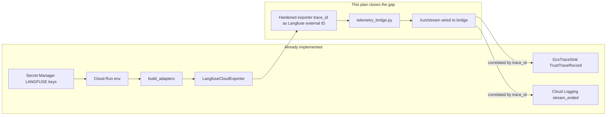

# Langfuse GCP Integration — End-to-End Implementation Plan

## Vision Alignment

This plan completes **Tier 1** of the larger governance triangle roadmap. It closes the runtime export gap for **L5 Observability** in the seven-layer trust framework, creating the data foundation that future L6 (Certification) and L7 (Governance) work will consume.



**Sixth trace plane goal:** Langfuse traces keyed by the same `trace_id` already minted in [`agent_ui_adapter/adapters/runtime/langgraph_runtime.py`](../agent_ui_adapter/adapters/runtime/langgraph_runtime.py) (line 122), visible in SSE events, `stream_ended` logs, GCS trust traces, black box recordings, and phase logs.

**Scope:** Tier 1 only (this document). Trust kernel extensions (`certification_status`, `lifecycle_state`, structured `purpose`) are pre-approved but deferred to a separate Tier 3 plan.

---

## Current State Snapshot

| Layer | File | Status |
|-------|------|--------|
| Secrets + env | [`infra/gcp/cloud-run-backend.tf`](../../infra/gcp/cloud-run-backend.tf), [`infra/gcp/secret-manager.tf`](../../infra/gcp/secret-manager.tf) | Done |
| Port contract | [`middleware/ports/telemetry_exporter.py`](../../middleware/ports/telemetry_exporter.py) | Done |
| Adapter | [`middleware/adapters/observability/langfuse_cloud_exporter.py`](../../middleware/adapters/observability/langfuse_cloud_exporter.py) | Done but uses metadata `trace_id`, not Langfuse external id |
| Composition | [`middleware/composition.py`](../../middleware/composition.py) (lines 152, 185) | Done (requires `LANGFUSE_*` env) |
| Runtime call | [`middleware/app_prod.py`](../../middleware/app_prod.py) `_generate()` | **Missing — never calls `adapters.telemetry_exporter`** |
| Bridge | `middleware/telemetry_bridge.py` | **Does not exist** |
| Kill switch | `LANGFUSE_ENABLED` env var | **Not implemented** |
| L2 tests | `tests/middleware/adapters/observability/`, `tests/middleware/` | **Missing for telemetry path** |
| GCP docs | [`docs/recipes/gcp/LOG_PIPELINE_GUIDE.md`](../recipes/gcp/LOG_PIPELINE_GUIDE.md), [`docs/recipes/gcp/07_observability.md`](../recipes/gcp/07_observability.md) | Partial — missing Langfuse verification section |

---

## Architectural Constraints (must hold)

- **O1 (telemetry never blocks):** Every exporter call in [`langfuse_cloud_exporter.py`](../../middleware/adapters/observability/langfuse_cloud_exporter.py) and bridge swallows exceptions. SSE never breaks because Langfuse misbehaves.
- **C1 / I-10 (SDK isolation):** `langfuse` SDK imports stay inside `middleware/adapters/observability/`. `app_prod.py` and the bridge only use port types.
- **Layer rule:** Bridge may import `agent_ui_adapter.wire.domain_events` (wire ring, framework-neutral) — NOT `agent_ui_adapter.adapters.runtime.*` or `orchestration.*`.
- **F-R7 / O4:** Same `trace_id` from [`LangGraphRuntime`](../../agent_ui_adapter/adapters/runtime/langgraph_runtime.py) must appear in Langfuse as the trace external id.

---

## Phase 1 — Harden LangfuseCloudExporter

**File:** [`middleware/adapters/observability/langfuse_cloud_exporter.py`](../../middleware/adapters/observability/langfuse_cloud_exporter.py)

**Problem:** Current `export_event()` creates an isolated span each call with `trace_id` only in metadata (`span.update(metadata={"trace_id": trace_id})`). Langfuse cannot group child spans under a single trace — operators get fragmented spans.

**Changes:**

1. On first `export_event()` for a given `trace_id`, open a Langfuse **trace** with `id=trace_id` (Langfuse v3 SDK: `client.trace(id=trace_id, ...)` or equivalent context API for `langfuse>=3.0`).
2. Subsequent `export_event()` calls create **child observations/spans** under that trace handle.
3. Maintain an in-memory `dict[str, TraceHandle]` keyed by `trace_id`. Cleared by the bridge on `run.finished` to avoid unbounded growth.
4. Add `LANGFUSE_ENABLED=false` kill switch:
   - Read env in `__init__` (default `true`).
   - When disabled, `export_event()` and `shutdown()` are no-ops; `_client()` returns `None` immediately.
   - Composition still requires `LANGFUSE_*` keys (don't change [`composition.py`](../../middleware/composition.py) `_require()` behavior — production sets `LANGFUSE_ENABLED=true` or unset).
5. Add `release_trace(trace_id)` method so the bridge can drop the in-memory handle on `run.finished`.

**Acceptance:**

- Two `export_event()` calls with the same `trace_id` produce one trace with two children in mock SDK.
- Init failure logs `langfuse client init failed` at WARNING, returns `None`, never raises.
- `LANGFUSE_ENABLED=false` makes every method a silent no-op.

---

## Phase 2 — Domain-Event Telemetry Bridge

**New file:** `middleware/telemetry_bridge.py`

**Purpose:** Map [`DomainEvent`](../../agent_ui_adapter/wire/domain_events.py) types to stable Langfuse event names. Pure mapping module — no SDK imports.

**Public API:**

```python
def emit_domain_event(
    exporter: TelemetryExporter,
    domain_event: DomainEvent,
    *,
    subject: str | None = None,
) -> None: ...

def emit_run_finished(
    exporter: TelemetryExporter,
    *,
    trace_id: str,
    run_id: str | None,
    thread_id: str,
    duration_ms: int,
    errored: bool,
    subject: str | None = None,
) -> None: ...
```

**Event mapping** (9 `DomainEvent` types in [`domain_events.py`](../../agent_ui_adapter/wire/domain_events.py)):

| Domain event | Langfuse `name` | Notes |
|--------------|-----------------|-------|
| `RunStartedDomain` | `run.started` | `run_id`, `thread_id`, `subject` |
| `RunFinishedDomain` | `run.finished` | include `error` if set |
| `ToolCallStarted` | `tool.started` | `tool_name`, `tool_call_id`; truncate `args_json` to 4KB |
| `ToolResultReceived` | `tool.finished` | truncate `result` to 4KB |
| `LLMMessageStarted` | `llm.started` | `message_id` |
| `LLMMessageEnded` | `llm.finished` | `message_id` |
| `LLMTokenEmitted` | **skip** | Hobby quota burn |
| `StateMutated` | **skip** | high volume, low signal for v1 |
| `ToolCallEnded` | **skip** | redundant with `tool.finished` |

Use `isinstance` dispatch. Bridge calls `exporter.release_trace(trace_id)` after emitting `run.finished`.

**Imports allowed:** stdlib + `agent_ui_adapter.wire.domain_events` + `middleware.ports.telemetry_exporter`. Architecture test must enforce this.

**Acceptance:**

- Each domain event type maps to expected name/attributes (table-driven test).
- Skipped events do not produce export calls.
- Truncation enforced at 4KB for `args_json` and `result`.

---

## Phase 3 — Wire Production Hot Path

**File:** [`middleware/app_prod.py`](../../middleware/app_prod.py) `_generate()` (~line 285)

**Current structure:** Tracks `trace_id_seen` and `run_id` in the loop. `adapters` built at line 200 but `adapters.telemetry_exporter` is never used.

**Changes inside `_generate()`:**

1. After each `domain_event`, call `telemetry_bridge.emit_domain_event(adapters.telemetry_exporter, domain_event, subject=claims.subject)`.
2. In `finally` (alongside `stream_ended` log), call `emit_run_finished(...)` **only if** `trace_id_seen` is not None and `run_finished_emitted` is False (stream errored before `RunFinishedDomain`).
3. Track `run_finished_emitted` when `RunFinishedDomain` is handled by the bridge — avoid double `run.finished`.

**Lifespan changes:**

- On shutdown (after `yield`), call `adapters.telemetry_exporter.shutdown()` as safety net.

**Imports:**

```python
from middleware import telemetry_bridge
```

**MUST NOT import** `langfuse` or `LangfuseCloudExporter` in `app_prod.py`.

**Acceptance:**

- Mock exporter receives `run.started` exactly once per request.
- Mock exporter receives `run.finished` exactly once.
- Exporter raising on `export_event()` does not break SSE.

---

## Phase 4 — Dev Parity (Optional)

**File:** [`middleware/__main__.py`](../../middleware/__main__.py)

1. Call `build_adapters()` when `LANGFUSE_ENABLED` is not `false` and keys exist.
2. Otherwise wire `_NoopTelemetryExporter` (port-shaped stub).
3. Reuse `telemetry_bridge` in dev `/run/stream` handler.

**Lower priority — fast follow-up if Phases 1–3 hit deadline.**

---

## Phase 5 — L2 Tests (No Live Langfuse in CI)

| Test file | Assertions |
|-----------|------------|
| `tests/middleware/adapters/observability/test_langfuse_cloud_exporter.py` | Trace `id=trace_id`; child spans; init failure no raise; `shutdown` → `flush`; `LANGFUSE_ENABLED=false` no-op |
| `tests/middleware/test_telemetry_bridge.py` | Table-driven domain event mapping; skipped events zero calls; 4KB truncation |
| `tests/middleware/test_app_prod.py` (extend) | Patch exporter; `run.started` / `run.finished`; O1 SSE survives exporter raise; no double finish |
| `tests/architecture/test_middleware_layer.py` (extend) | Bridge import allowlist; `app_prod` must not import langfuse SDK |

**Run:** `pytest tests/ -q` and `pytest tests/architecture/ -q`

**Do NOT** add `@pytest.mark.live_llm` Langfuse tests to default CI.

---

## Phase 6 — GCP Ops Docs and Verification

**Terraform:** No changes for Tier A Langfuse Cloud.

**Doc updates:**

1. [`docs/recipes/gcp/LOG_PIPELINE_GUIDE.md`](../recipes/gcp/LOG_PIPELINE_GUIDE.md) — Langfuse trace verification step
2. [`docs/recipes/gcp/07_observability.md`](../recipes/gcp/07_observability.md) — pointer + Hobby quota (50K units/mo)
3. [`docs/explainability/END_TO_END_TRACING_GUIDE.md`](../explainability/END_TO_END_TRACING_GUIDE.md) — plane #6; update/remove stale Known Gap (trace_id threading is fixed in runtime)
4. [`docs/Architectures/FRONTEND_PORTS_AND_ADAPTERS_DEEP_DIVE.md`](../Architectures/FRONTEND_PORTS_AND_ADAPTERS_DEEP_DIVE.md) §4.5 — align with `export_event` / `shutdown`
5. [`docs/Architectures/GCP_DEPLOYMENT_ARCHITECTURE.md`](../Architectures/GCP_DEPLOYMENT_ARCHITECTURE.md) — middleware `/run/stream` export note
6. [`infra/RUNBOOK.md`](../../infra/RUNBOOK.md) §4.1 — `LangfuseCloudExporter` naming

**Smoke:** [`scripts/smoke_gcp.sh`](../../scripts/smoke_gcp.sh) — optional warn grep for `langfuse client init failed`

**Human verification checklist:**

1. Secrets non-empty in Secret Manager
2. Chat in UI → `stream_ended trace=<id> errored=False`
3. Langfuse UI shows trace `<id>` with `tool.*` / `llm.*` child spans
4. GCS trust-traces bucket has same `trace_id`

---

## Risk Register

| Risk | Mitigation |
|------|------------|
| Hobby quota exhaustion | Skip token/state events; document in Recipe 7 |
| Silent telemetry failure | WARN on init; DEBUG on swallow; LOG_PIPELINE_GUIDE queries |
| Duplicate `run.finished` | `run_finished_emitted` flag; tests assert exactly-once |
| In-memory trace handle leak | `release_trace()` + lifespan `shutdown()` |
| Layer violation | Bridge wire-only imports; architecture test |
| Doc drift | Phase 6 ships with code PR |

---

## Success Criteria (Definition of Done)

- Langfuse trace id matches `stream_ended trace=` and GCS `trace_id` after a production chat.
- Child spans for tool + LLM when run used them.
- `pytest tests/ -q` and `pytest tests/architecture/ -q` pass.
- LOG_PIPELINE_GUIDE documents Langfuse verification; logs remain primary health signal.
- `LANGFUSE_ENABLED=false` works for local dev.

---

## Out of Scope (Tier 1)

- Self-hosted Langfuse on GCP
- Frontend `TelemetrySink` adapters
- LangGraph `CallbackHandler` / full OTEL (Spike D)
- Trust kernel schema extensions (Tier 3 plan)
- L6 certification, L7 lifecycle, feedback loops
- `governanaceTriangle/` tutorial alignment

---

## Sequencing Notes

- **Phases 1–3 = one PR** (deployable unit)
- **Phase 5 bundled with 1–3** (no merge without tests)
- **Phase 4** optional fast follow-up
- **Phase 6** ships with code PR (no doc drift)

---

## Related Plans

- [gcp_deployment_recipes.plan.md](gcp_deployment_recipes.plan.md) — Tier A GCP stack (Langfuse secrets/env in Recipe 1/4)
- [SPIKE_D](../plan/frontend/spike_reports/SPIKE_D.md) — original Langfuse hypothesis (server-side slice only in this plan)

## Broader Roadmap Context

| Tier | Focus | Status |
|------|-------|--------|
| **Tier 1** | Langfuse GCP runtime export | **This plan** |
| Tier 2 | Correlation health, eval capture audit, explainability Langfuse links | Future |
| Tier 3 | Trust kernel extensions (`certification_status`, `lifecycle_state`, `purpose`) | Pre-approved, separate plan |
| Tier 4 | L6 certification pipeline | Future |
| Tier 5 | L7 lifecycle + L5→L2 feedback loops | Future |
| Tier 6 | Tutorial / production API alignment | Future |
