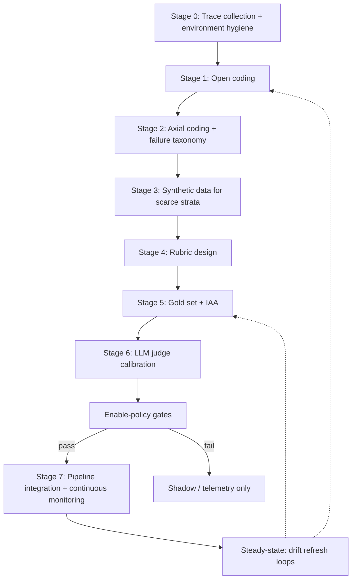

# LLM Eval Grounded-Theory Pipeline Skill — Plan

> **Status:** Implemented (2026-06-09). Documentation-only — no code changes.
>
> **Skill locations:**
> - Cursor install: [`.cursor/skills/llm-eval-grounded-theory/`](../../.cursor/skills/llm-eval-grounded-theory/)
> - Docs mirror (this repo): [`docs/skills/llm-eval-grounded-theory/`](../skills/llm-eval-grounded-theory/)
> - Personal copy: `~/.cursor/skills/llm-eval-grounded-theory/` (`SKILL.md` + `reference.md` only)

---

## Goal

Produce a reusable Cursor Agent Skill that teaches the full evaluation lifecycle from GoalJudge — generalized so it applies to any agent/LLM product, not only this repo:



---

## Storage

| Copy | Path | Contents |
|------|------|----------|
| Personal (portable) | `~/.cursor/skills/llm-eval-grounded-theory/` | Generic `SKILL.md` + `reference.md` only |
| Project Cursor install | [`.cursor/skills/llm-eval-grounded-theory/`](../../.cursor/skills/llm-eval-grounded-theory/) | Generic core + `examples-goaljudge.md` + `paths` globs |
| Docs mirror (versioned) | [`docs/skills/llm-eval-grounded-theory/`](../skills/llm-eval-grounded-theory/) | Same as project install; paths adjusted for `docs/` layout |

Mirror pattern: [`.cursor/skills/deploy-gcp/SKILL.md`](../../.cursor/skills/deploy-gcp/SKILL.md), [`docs/skills/playwright-agentic-e2e/`](../skills/playwright-agentic-e2e/).

---

## Skill metadata

```yaml
name: llm-eval-grounded-theory
description: Runs the qualitative-to-quantitative LLM evaluation pipeline — open coding, axial coding, synthetic strata coverage, analytic rubric design, double-labeled gold sets, LLM-as-judge calibration, and continuous monitoring integration. Use when building eval datasets, failure taxonomies, rubrics, golden sets, judge calibration, shadow mode, or production eval regression loops for agentic/LLM systems.
disable-model-invocation: true
```

Project copy adds `paths:` for `docs/recipes/goaljudge/**`, `docs/research/goaljudge*`, `docs/plans/goaljudge*`, `services/governance/goaljudge*`, `components/goal_judge.py`.

---

## Deliverables (completed)

| Item | Path |
|------|------|
| Main handbook | [`SKILL.md`](../skills/llm-eval-grounded-theory/SKILL.md) |
| Reference (IAA, gates, bibliography) | [`reference.md`](../skills/llm-eval-grounded-theory/reference.md) |
| GoalJudge worked example | [`examples-goaljudge.md`](../skills/llm-eval-grounded-theory/examples-goaljudge.md) |
| This plan | `docs/plans/llm_eval_pipeline_skill.plan.md` |

---

## SKILL.md structure

Progressive disclosure: operational workflow in `SKILL.md`; metrics tables, bibliography, and monitoring stack in [`reference.md`](../skills/llm-eval-grounded-theory/reference.md). Target: under 500 lines (actual: ~369).

### Sections

1. When to use / cardinal rules / anti-patterns
2. Stage 0 — Trace collection
3. Stage 1 — Open coding
4. Stage 2 — Axial coding + failure taxonomy
5. Stage 3 — Synthetic data for scarce strata
6. Stage 4 — Rubric design
7. Stage 5 — Gold set + IAA
8. Stage 6 — LLM judge calibration
9. Stage 7 — Continuous monitoring
10. Master workflow checklist

---

## reference.md contents

- IAA decision table (Cohen κ vs Krippendorff α; thresholds 0.80 / 0.667 / 0.60)
- Enable-policy template (precision-first downgrade profile)
- Judge bias catalog (position, verbosity, CoT-gaming, BITE style attacks)
- Synthetic data anti-patterns
- Gold set sizing and stratification
- Seed failure codes
- Continuous monitoring stack (offline CI + online L1/L2/L3)
- Bibliography R1–R25

---

## examples-goaljudge.md

Worked example index linking to GoalJudge recipes, plans, reports, and code seams. See [`examples-goaljudge.md`](../skills/llm-eval-grounded-theory/examples-goaljudge.md).

| Stage | Canonical repo artifact |
|-------|-------------------------|
| Overview / metaphor | [`docs/recipes/goaljudge/00_overview.md`](../recipes/goaljudge/00_overview.md) |
| Axial coding | [`docs/recipes/goaljudge/01_axial_coding_failure_taxonomy.md`](../recipes/goaljudge/01_axial_coding_failure_taxonomy.md) |
| Rubric (A2) | [`docs/recipes/goaljudge/02_stage4_a2_rubric.md`](../recipes/goaljudge/02_stage4_a2_rubric.md) |
| Full pipeline playbook | [`docs/research/goaljudge_evaluation_pipeline_open_axial_coding_rubric.md`](../research/goaljudge_evaluation_pipeline_open_axial_coding_rubric.md) |
| Synthetic corpus | [`docs/plans/goaljudge_synthetic_saturation_corpus.plan.md`](goaljudge_synthetic_saturation_corpus.plan.md) |
| Gold set | [`docs/plans/goaljudge_stage5_goldset.plan.md`](goaljudge_stage5_goldset.plan.md) |
| Enable gates | [`docs/research/fix2_goaljudge_rubric_feasibility_pyramid.md`](../research/fix2_goaljudge_rubric_feasibility_pyramid.md) §2.8 |
| Current blocker status | [`docs/reports/goaljudge_stage5_goldset_tier_review.md`](../reports/goaljudge_stage5_goldset_tier_review.md) |
| Runtime shadow/downgrade | [`docs/recipes/15_goaljudge_runtime_config_toggle.md`](../recipes/15_goaljudge_runtime_config_toggle.md) |

---

## External research integrated

| Topic | Source | Skill addition |
|-------|--------|----------------|
| Binary over Likert for judge calibration | Galtea 2026, LangChain Align Evals | Stage 4 + 6 default |
| Anchor examples for rubrics | Masood 2026 | Stage 4 template |
| 75–90% judge–human alignment before scale | Arize LLM-as-Judge primer | Stage 6 go/no-go |
| Human corrections → few-shot loop | LangChain Align Evals | Stage 6 iteration |
| LLM-assisted open/axial coding | GATOS, LOGOS, arXiv 2601.15338 | Stage 1–2 optional assist |
| Open-code quality without ground truth | arXiv 2411.12142 | Stage 1 diagnostic metrics |
| Offline golden regression + online sampling | VentureBeat 2026, Coverge | Stage 7 architecture |
| CUSUM for slow drift | Tianpan 2026 | Stage 7 alerting |
| Acceptable fail rates per category | Galtea 2026 | Stage 7 thresholds |
| Dataset version control as production risk | Galtea 2026 | Stage 5 + 7 |

Workspace foundations: [`goaljudge_evaluation_pipeline_open_axial_coding_rubric.md`](../research/goaljudge_evaluation_pipeline_open_axial_coding_rubric.md), [`fix2_goaljudge_rubric_feasibility_pyramid.md`](../research/fix2_goaljudge_rubric_feasibility_pyramid.md).

---

## Verification checklist

- [x] Description: third person, WHAT + WHEN, trigger terms
- [x] SKILL.md under 500 lines; deep content in reference.md
- [x] File references one level deep from SKILL.md
- [x] Consistent terminology (gold set, rubric, judge, shadow)
- [x] Personal and project copies share generic core; project adds examples + paths globs
- [x] Docs mirror in `docs/skills/` with adjusted relative paths
- [x] `disable-model-invocation: true`

---

## Implementation order (completed)

1. Draft `reference.md` (metrics + bibliography)
2. Write generic `SKILL.md` with stage checklists and mermaid pipeline
3. Write project-only `examples-goaljudge.md`
4. Install personal copy at `~/.cursor/skills/llm-eval-grounded-theory/`
5. Install project copy at `.cursor/skills/llm-eval-grounded-theory/`
6. Mirror to `docs/skills/llm-eval-grounded-theory/` + save plan to `docs/plans/`
