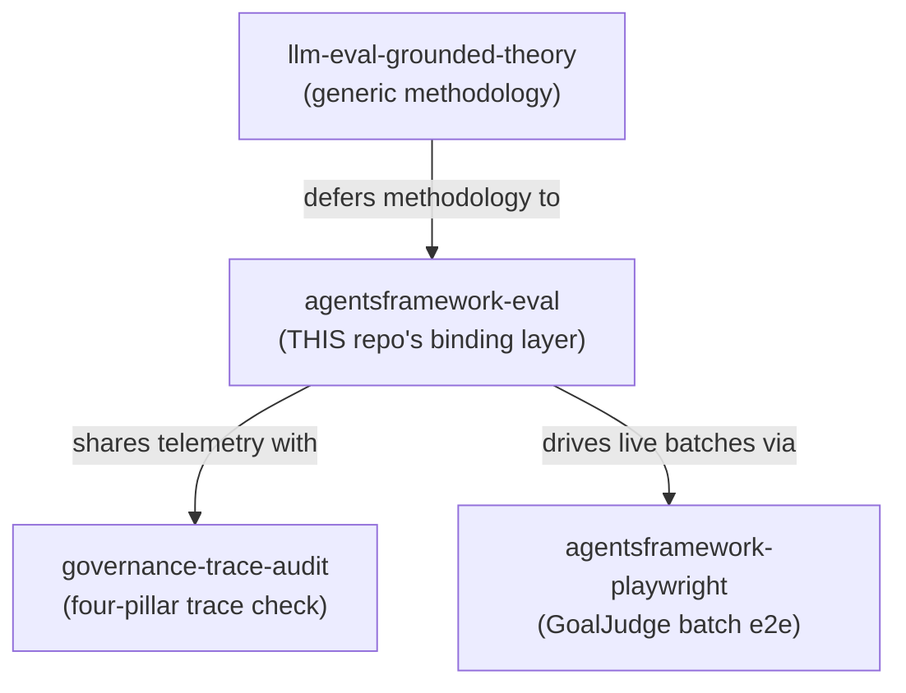

# LLM Eval Pipeline Skill — Plan (workspace-bound)

> **Status:** PLAN (re-scoped 2026-06-13). Supersedes the original "documentation-only,
> implemented 2026-06-09" plan for the **generic** `llm-eval-grounded-theory` skill, which
> shipped and stays as-is. This plan adds a **second, workspace-bound** skill,
> `agentsframework-eval`, that is to the eval pipeline what `governance-trace-audit` is to the
> four pillars and what `agentsframework-playwright` is to E2E: the exact files, layer rules,
> commands, runtime flip paths, and hard-won gotchas of *this* repo's GoalJudge eval pipeline.
>
> **Relationship to the generic skill:** `llm-eval-grounded-theory` teaches the *methodology*
> (open coding → axial → synthetic → rubric → gold set → calibration → monitoring), provider-
> and repo-agnostic. `agentsframework-eval` is the **binding layer** on top of it — same
> two-skill split the repo already uses for Playwright (`playwright-agentic-e2e` ⊕
> `agentsframework-playwright`). The new skill defers methodology questions to the generic one
> and supplies only what is true *here*.

---

## Why a second skill (the gap the deep read found)

The deep end-to-end read of the pipeline surfaced a stack of repo-specific facts that a generic
methodology skill cannot carry and that an agent re-derives painfully every session:

1. **The pipeline is split across four architectural layers**, and the eval code obeys the same
   dependency rules as everything else ([FOUR_LAYER_ARCHITECTURE.md](../Architectures/FOUR_LAYER_ARCHITECTURE.md)).
   The calibration metrics are **L1-pure** (`services/governance/goaljudge_calibration.py` —
   stdlib + pydantic only, zero `components`/`langgraph`/`langchain` imports). The judge is an
   **L3 component** (`components/goal_judge.py` — framework-agnostic, injected services). The
   gate decision is a **pure function** that *evaluates* but never *acts*. An agent that doesn't
   know this writes code in the wrong layer and trips the dependency-leak audit.

2. **The eval substrate IS the four-pillar Recording layer.** Every judged run is captured by
   `services/eval_capture.record()` (H5) and republished to Langfuse via
   `services/eval_telemetry.publish_goal_judge()` on the same `trace_id`, alongside the
   BlackBox/AgentFacts/GuardRails/PhaseLogger pillars that
   [`governance-trace-audit`](../skills/governance-trace-audit/SKILL.md) checks. The eval
   pipeline and the trace audit read the *same* telemetry. This binding is invisible in the
   generic skill.

3. **The terminal objective is a single flag flip with an exact, encoded path.** Everything
   converges on flipping `goal_judge_downgrade_enabled` (and, on the TaskUnderstanding track,
   `success_conditions_source` `shadow → generated`) via `GoalJudgeRuntimeConfigReader` — a
   GCS/`file://` JSON doc with a 30 s TTL, stale-on-error degrade, and env fallback. **No
   redeploy.** The §2.8 evaluator produces the *decision*; the human flips the flag. An agent
   that doesn't know the flip is a runtime-config write (not a code change) proposes the wrong
   mechanism.

4. **The pipeline is fail-closed at a hard gate the generic skill doesn't mention.**
   `gate_goldset_v1_floors(manifest)` raises on `provisional=true`, blank `test_split_sha256`,
   or any non-empty `floor_gap_summary`. The §2.8 evaluator calls it *first* and returns
   `REFUSE_PROVISIONAL` before reading a single metric. Today the gold set is **v0.9 provisional
   (101 rows, hash `ad5eccc0…`)**, so the evaluator *cannot* emit ENABLE — by design. That state
   is a moving target a worked-example link cannot keep current.

5. **The repo has accumulated process rules with teeth** that govern every eval change and live
   only in plans/memory: *(a)* no diagnosis without artifact text (the blind-diagnosis trap that
   produced round 2's wrong root cause); *(b)* every deterministic gate ships a
   must-accept/must-reject L4 meta-benchmark **before** it gates production; *(c)* quote binomial
   power with any verdict; *(d)* one variable per round; *(e)* the frozen 2b α baseline
   (`plan_builder` floor) stays byte-identical so the consume gate measures one variable.

6. **Known live landmines** an agent should be warned about: the `[a-zA-Z]{4,}` tokenizer bug
   class (fixed in `_content_tokens`, still un-benchmarked in `synthesis_validator`, which flips
   `success→failure` *before* the judge at `react_loop.py:1423–1438`); the 200-char publish cap
   that truncated the entire wave-1 judge-input corpus (lifted to 8192 for `eval.*` only); the
   judge self-contradiction pattern (4 traces) that waits on Stage B NLI.

None of (1)–(6) belong in a portable skill. All of them are exactly what a *workspace* skill
exists to encode.

---

## Goal

Produce `agentsframework-eval`: a workspace-bound Claude/Cursor skill that lets an agent operate
this repo's GoalJudge eval pipeline correctly on the first try — knowing which layer each piece
lives in, which commands to run (and which never to run in CI), how the flag flip works, what the
current gold-set state allows, and which process rules and landmines are in force.



---

## Storage (mirror the repo's established pattern)

| Copy | Path | Contents |
|------|------|----------|
| Project Claude install | `.claude/skills/agentsframework-eval/` | `SKILL.md` + `reference.md` + `commands.md` |
| Project Cursor install | `.cursor/skills/agentsframework-eval/` | same core (Cursor + Claude both read it) |
| Docs mirror (versioned) | `docs/skills/agentsframework-eval/` | same, paths adjusted for `docs/` layout; add a row to [`docs/skills/README.md`](../skills/README.md) |

Pattern source: [`docs/skills/governance-trace-audit/`](../skills/governance-trace-audit/SKILL.md)
and [`docs/skills/agentsframework-playwright/`](../skills/agentsframework-playwright). The
generic eval skill stays at [`docs/skills/llm-eval-grounded-theory/`](../skills/llm-eval-grounded-theory/SKILL.md) untouched.

---

## Skill metadata

```yaml
name: agentsframework-eval
description: >-
  Operate THIS repository's GoalJudge LLM-as-judge evaluation pipeline (the AgentsFramework
  `agent` monorepo: four-layer architecture, Python agent backend, GoalJudge runtime config on
  GCS, Stage 5 gold set + Stage 6 calibration). Use whenever the work touches goal_judge.py, the
  calibration metrics, the §2.8 enable gates, the gold set / IAA / α, the success_conditions_source
  or goal_judge_downgrade_enabled flags, eval_capture / eval_telemetry, the TaskUnderstanding
  grounding gate, synthesis_validator benchmarking, or running the calibration replay harness.
  Trigger on "calibrate the judge", "run the gold set", "flip the downgrade gate", "2b consume
  gate", "Stage 6", "α vs gold", "false-downgrade rate", or any task editing
  services/governance/goaljudge_*.py or components/goal_judge.py. For the underlying methodology
  defer to llm-eval-grounded-theory; for trace-pillar audits defer to governance-trace-audit; for
  the live GoalJudge batch defer to agentsframework-playwright.
disable-model-invocation: false
```

`disable-model-invocation: false` (unlike the generic skill's `true`): this one *should*
auto-trigger when an agent touches eval code here, exactly as `agentsframework-playwright` does
for `frontend/e2e/`.

---

## Deliverables

| Item | Path | Lines target |
|------|------|--------------|
| Main handbook | `.claude/skills/agentsframework-eval/SKILL.md` | < 400 |
| Deep reference (layer map, thresholds, gotchas) | `reference.md` | < 350 |
| Command cookbook (exact invocations) | `commands.md` | < 200 |
| This plan | `docs/plans/llm_eval_pipeline_skill.plan.md` | — |

---

## SKILL.md structure

Progressive disclosure: the operational map and decision rules in `SKILL.md`; the layer/threshold
tables and gotcha catalog in `reference.md`; copy-paste invocations in `commands.md`.

### Sections

1. **When to use / when to defer** — defers to the three sibling skills (table above).
2. **The pipeline at a glance** — the data-flow diagram from the Stage 6 plan §3
   (manifest + sheet + corpus → replay → L1 metrics → report + gate decision), annotated with
   the layer each box lives in.
3. **Layer map** — *where every eval piece lives and what it may import* (see table below). This
   is the section that prevents wrong-layer code.
4. **The four cardinal facts** — distilled from gaps (1)–(4): L1-pure metrics; eval = Recording
   pillar; flip is a runtime-config write; fail-closed at the v1 floor gate.
5. **The flag-flip path** — `GoalJudgeRuntimeConfigReader`, GCS vs `file://`, 30 s TTL, the two
   flags (`goal_judge_downgrade_enabled`, `success_conditions_source`), and the hard rule:
   **the skill never flips a flag; it produces the decision and the human deploys.**
6. **Current gold-set state** — a single dated line ("v0.9 provisional, 101 rows, hash
   `ad5eccc0…`, evaluator returns `REFUSE_PROVISIONAL`; v1 waits on wave-2 ~250") that the agent
   re-reads from the manifest rather than trusting, with the exact verification command.
7. **Process rules in force** — the five teeth from gap (5), each one line.
8. **Live landmines** — gap (6), each with file:line and current status.
9. **Verification recipe** — the offline, CI-safe pytest set and the dependency-leak grep.

---

## Layer map (the core of the skill)

This table is the load-bearing artifact. It binds the eval pipeline to
[FOUR_LAYER_ARCHITECTURE.md](../Architectures/FOUR_LAYER_ARCHITECTURE.md) so an agent writes each
change in the right layer with the right import discipline.

| Piece | File | Layer | May import | Must NOT import | Test tier |
|---|---|---|---|---|---|
| Calibration metrics + §2.8 evaluator | `services/governance/goaljudge_calibration.py` | **L1 pure** (Horizontal) | stdlib, pydantic, sibling `iaa`/`goldset_dataset` (H→H, local import) | `components`, `langgraph`, `langchain`, any I/O | L1 `tests/services/test_goaljudge_calibration.py` |
| Gold-set dataset + v1 floor gate | `services/governance/goaljudge_goldset_dataset.py` | L1/L2 (Horizontal) | pydantic, `iaa` | `components`, frameworks | L2 `tests/services/test_goaljudge_goldset_dataset.py` |
| IAA primitives (κ via nominal α) | `services/governance/iaa.py` | L1 pure | stdlib | everything else | `tests/scripts/test_compute_goaljudge_stage5_alpha.py` |
| GoalJudge (the judge under measurement) | `components/goal_judge.py` | **L3** (Vertical) | `components.schemas`; injected `services` types (TYPE_CHECKING) | `langgraph`/`langchain` (AGENTS.md #3) | L3 `tests/components/test_goal_judge*.py` |
| Verdict schema | `components/schemas.py` (`GoalVerdict`) | L3 | pydantic | frameworks | L1 schema tests |
| TaskUnderstanding grounding gate | `components/task_understanding.py::validate_conditions` | L3 | pure | frameworks | L4 benchmark `tests/components/test_task_understanding_gate_benchmark.py` |
| synthesis_validator (pre-judge gate) | `components/synthesis_validator.py` | L3 | pure | frameworks | **benchmark TBD** (Tier-1 item 3) |
| Eval capture (H5 substrate) | `services/eval_capture.py` | L2 (Horizontal) | stdlib | `components` | record/replay L2 |
| Eval telemetry sink (Recording pillar) | `services/eval_telemetry.py` | L2 (Horizontal) | `black_box_publisher` | Langfuse SDK, middleware | L2 |
| Runtime config (the flip point) | `services/goal_judge_runtime_config.py` | L2 (Horizontal) | pydantic, google.cloud.storage (lazy) | `langgraph` | L2 + `tests/architecture/test_goal_judge_runtime_config_layer.py` |
| Replay harness (LIVE judge) | `scripts/run_goaljudge_calibration.py` *(Stage 6 Phase 2 deliverable — not yet present)* | scripts/ (outside grid) | the real `GoalJudge` | — | L2 stub-judge contract, **never live in CI** |
| Orchestration gate (consumes verdict) | `orchestration/react_loop.py` (judge gate ~1400; synthesis flip 1423–1438) | Orchestration (thin) | services + components | — | L4 simulation |

---

## reference.md contents

- **§2.8 enable gates** — the five thresholds verbatim from
  `goaljudge_calibration.SECTION_2_8_THRESHOLDS` (precision ≥ 0.90, recall ≥ 0.70,
  false-downgrade ≤ 0.02, flip ≤ 0.05 / soft 0.10, κ ≥ 0.6; ECE diagnostic-only), each with its
  "why this number" and the golden-number anchor (shadow confusion TP=69 FP=8 FN=8 TN=12 ⇒
  α=0.4987…) pinned in the L1 suite.
- **Confusion convention** — positive class = judge says *not-met* (the downgrade signal); FP is
  the harm case (false downgrade on a clean success). Spell it out because it inverts the usual
  "positive = pass" intuition.
- **Fail-closed semantics** — `None`/NaN ⇒ undecidable ⇒ REFUSE; `provisional=true` ⇒
  REFUSE_PROVISIONAL before any metric; the evaluator never mutates the manifest and never flips a
  flag.
- **Two-flag flip path** — `goal_judge_downgrade_enabled` and `success_conditions_source`
  (`deterministic`/`shadow`/`generated`); precedence (URI → env → defaults); 30 s TTL;
  stale-on-error; `config/goal_judge_config.json` is the local seed (downgrade currently `false`).
- **The Recording-pillar binding** — `eval_capture.record(target=…)` → `eval_telemetry.
  publish_goal_judge()` on the same `trace_id`; the 8192-char `eval.*` exemption vs the 200-char
  BlackBox relay cap; cross-link to [`governance-trace-audit`](../skills/governance-trace-audit/SKILL.md).
- **Gotcha catalog** — the six landmines from gap (6) with file:line and status; the
  blind-diagnosis trap; the κ-vs-α distinction (don't conflate pairwise κ with multi-rater α);
  Playwright T1 "never run full tier locally" cross-link.
- **Pointers, not copies** — link the canonical plans rather than restating them: Stage 6
  calibration plan, Stage 5 gold-set plan, TU-gate Tier-1 plan, the feasibility pyramid §2.8.

---

## commands.md contents

Exact, copy-paste invocations (CI-safe first, live clearly fenced):

```bash
# Offline, CI-safe — the eval regression sweep
.venv/bin/python -m pytest \
  tests/services/test_goaljudge_calibration.py \
  tests/services/test_goaljudge_goldset_dataset.py \
  tests/components/test_goal_judge*.py \
  tests/components/test_task_understanding*.py \
  tests/architecture/test_goal_judge_runtime_config_layer.py -q

# Dependency-leak audit (must be empty)
grep -nE "from components|import langgraph|import langchain" \
  services/governance/goaljudge_calibration.py

# Verify current gold-set state (don't trust the doc — read the manifest)
.venv/bin/python -c "import json; m=json.load(open('cache/goaljudge_eval/goldset_v0_9_manifest.json')); \
  print('provisional=',m.get('provisional'),'sha=',str(m.get('test_split_sha256'))[:12], \
  'gaps=',bool(m.get('floor_gap_summary')))"

# α vs gold (Stage 5 statistic)
.venv/bin/python scripts/compute_goaljudge_stage5_alpha.py   # see --help

# v0.9 → v1 cutover gate check
.venv/bin/python scripts/verify_goldset_v1_cutover.py

# LIVE — Stage 6 calibration replay (script-only, NEVER CI; fast-tier judge)
# .venv/bin/python scripts/run_goaljudge_calibration.py --manifest <v1> ...   # once Phase 2 lands
```

The **flag flip is deliberately NOT a command in this skill** — it is a runtime-config write the
user owns. The skill documents the path and stops.

---

## Workspace facts the skill encodes (verified during the deep read)

| Fact | Source |
|------|--------|
| Calibration is L1-pure; §2.8 thresholds live in code | [`goaljudge_calibration.py`](../../services/governance/goaljudge_calibration.py) |
| Positive class = "judge says not-met"; FP = false downgrade | `ConfusionCounts` docstring |
| Evaluator fail-closes on provisional + undecidable | `evaluate_section_2_8_gates` |
| v1 floor gate raises on provisional / blank sha / floor gaps | `gate_goldset_v1_floors` (line 1195) |
| Flip is runtime-config (GCS/`file://`, 30 s TTL), not code | [`goal_judge_runtime_config.py`](../../services/goal_judge_runtime_config.py) |
| Two flags, three `success_conditions_source` stages | `ConditionsSource` literal |
| Eval = Recording pillar (same `trace_id`, 8192 exemption) | [`eval_telemetry.py`](../../services/eval_telemetry.py) |
| Judge repairs contradictory `criteria_met` from `per_criterion` | `_parse_verdict` (goal_judge.py:131–148) |
| Gold set currently v0.9 / 101 rows / `ad5eccc0…` | `cache/goaljudge_eval/goldset_v0_9_manifest.json` |
| Replay harness not yet built (Stage 6 Phase 2) | absence of `scripts/run_goaljudge_calibration.py` |
| synthesis_validator flips success→failure pre-judge, un-benchmarked | `react_loop.py:1423–1438`, [TU Tier-1 plan](../research/goaljudge_tu_gate_tier1_impl_plan.md) item 3 |

---

## Verification checklist (for the skill build)

- [ ] Description: third person, WHAT + WHEN, trigger terms, explicit defer-to lines
- [ ] `disable-model-invocation: false` (auto-trigger on eval-code edits)
- [ ] SKILL.md < 400 lines; deep tables in reference.md; commands in commands.md
- [ ] Layer map table present and matches FOUR_LAYER_ARCHITECTURE dependency rules
- [ ] Every file:line claim re-verified against HEAD before shipping (they drift)
- [ ] Current-gold-set line dated + paired with the read-the-manifest command (not trusted)
- [ ] Cross-links to all three sibling skills present and correct
- [ ] Flip path documented; **no flag-flip command** in the skill
- [ ] Docs mirror in `docs/skills/agentsframework-eval/` + README row added

---

## Implementation order

1. Draft `reference.md` (§2.8 thresholds, layer map, gotcha catalog) — facts first.
2. Write `SKILL.md` (operational map + cardinal facts + flip path + current state).
3. Write `commands.md` (CI-safe sweep, leak audit, manifest read, live-fenced replay).
4. Install at `.claude/skills/agentsframework-eval/` and `.cursor/skills/agentsframework-eval/`.
5. Mirror to `docs/skills/agentsframework-eval/`; add the README row.
6. Validate: trigger-phrase check; re-verify every file:line; run the CI-safe sweep from
   `commands.md` to confirm the documented tests exist and pass.

---

## Out of scope (handled by the existing generic skill)

Open-coding discipline, axial taxonomy construction, synthetic-strata generation, rubric design
principles, gold-set sizing/stratification math, the bibliography R1–R25, and the cross-product
anti-pattern catalog all stay in [`llm-eval-grounded-theory`](../skills/llm-eval-grounded-theory/SKILL.md).
This skill links to them and never restates them — the two-skill split is the whole point.
