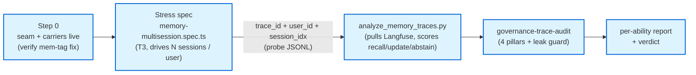
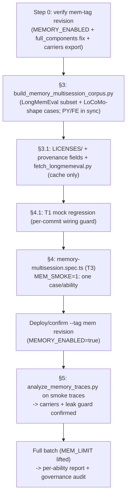

# Memory Layer — Multi-Turn / Multi-Session E2E Stress + Governance Trace Analysis Plan

> **Status.** Planning doc — what to build to *validate the now-wired memory layer end-to-end* across **multiple
> turns and multiple sessions** against the real backend on Cloud Run, and how to score the resulting Langfuse
> traces against the four-pillar governance contract. **It changes no source itself**; it specifies the work.
>
> **Date:** 2026-06-18. **Companion to:** the memory-layer build
> ([`memory_layer_wiring.plan.md`](memory_layer_wiring.plan.md) — recall/store wired, `MEMORY_RECALLED`/
> `MEMORY_STORED` carriers shipped, autocapture shadow). **Reuses the pattern of:**
> [`planning_pipeline_e2e_stress_and_trace_analysis.plan.md`](planning_pipeline_e2e_stress_and_trace_analysis.plan.md)
> (the proven Step-0 → corpus → stress-spec → analyzer → governance-audit spine). **Reads with:** the
> [`playwright-agentic-e2e`](../skills/playwright-agentic-e2e/SKILL.md) skill (T1/T2/T3 cut-points, settle-poll,
> storageState auth) + [`agentsframework-playwright`](../skills/agentsframework-playwright/SKILL.md) (workspace
> binding) + [`governance-trace-audit`](../skills/governance-trace-audit/SKILL.md) (the 4-pillar trace contract).
>
> **Decisions locked (user, 2026-06-18):**
> 1. **Seed dataset = LongMemEval (MIT) + LoCoMo shapes (paraphrased).** LongMemEval is the committable in-repo
>    seed (MIT → a derived subset may live in the tree); LoCoMo's persona / temporal-event-graph *shape* is borrowed
>    for a handful of hand-authored persona-drift cases — **paraphrased, never copied** (LoCoMo is CC BY-NC 4.0 →
>    reference-only, must not be redistributed in the repo).
> 2. **Primary target = all three abilities, phased:** **(A) cross-session recall + governance** (gates the rest) →
>    **(B) knowledge-update / contradiction** → **(C) abstention / no-hallucinated-memory.** Mirrors the
>    planning-stress phased-corpus discipline.
> 3. **Primary tier = T3 full-stack on Cloud Run** (the only tier that exercises real recall/store across real
>    sessions); a thin **T1 multi-session regression** of the *wiring* is the cheap CI guard, not the headline.

---

## 0. TL;DR — the shape of the work

The memory layer is **wired but never validated across sessions.** Every gate to date (3000+ pytest, frontend
vitest, the single mem-tag governance audit) proves recall/store fire *within one run*. The core unproven claim is
the cross-session one: **a fact stored in session N is recalled in session N+1, for the same user, and the trace
tells that truth.** This plan builds the evidence for that, reusing the planning-stress spine almost verbatim.

Five deliverables, in dependency order:

1. **Step 0 (verify, likely small) — the multi-session seam + carriers are live.** Confirm `user_id`
   (`identity.owner`) is stable across two runs in the same Cloud Run revision, that the `mem` revision really runs
   `MEMORY_ENABLED=true`, and that `MEMORY_RECALLED`/`MEMORY_STORED` export to Langfuse. This is the lesson of
   [[mem-tag-run-emitted-no-carriers]]: a prior authed mem-tag run emitted **zero** carriers because `app_prod.py`
   dropped `memory_service`. **That fix must be confirmed deployed before any stress run, or the run is blind.**
2. **The synthetic multi-session corpus** — `scripts/build_memory_multisession_corpus.py` (Python source of truth) →
   `frontend/e2e/fixtures/memory_multisession_corpus.json`. Each *case* is a **conversation = an ordered list of
   sessions**, each session an ordered list of turns; carries the per-phase expectation (recall / update /
   abstention) the analyzer scores. Derived from LongMemEval, dimensioned by a coverage matrix.
3. **The stress spec** — `frontend/e2e/full-stack/memory-multisession.spec.ts`, a T3 batch that drives each
   conversation through the real chat on Cloud Run **as multiple sessions for one persistent user**, appending one
   JSONL row per *probe turn* with the join keys (`trace_id`, `user_id`, `session_idx`, `probe_kind`, response).
4. **The trace-analysis half** — `scripts/analyze_memory_traces.py` that pulls each captured `trace_id` from
   Langfuse (or the BlackBox recordings) and scores cross-session recall / update / abstention, plus a
   **cross-user-leak guard** (no recall ever returns another user's fact).
5. **The governance audit** — run the captured probe traces through the
   [`governance-trace-audit`](../skills/governance-trace-audit/SKILL.md) contract: every `MEMORY_RECALLED` /
   `MEMORY_STORED` fact has a non-empty carrier that actually exports, content never leaks onto the wire, and a
   recall that *should* have hit but shows `count: 0` is a seam defect (the zero-carrier failure class).



---

## 1. The hard constraint nobody can skip — what "multi-session" means at our seams

A "session" in our system is **one `/run/stream` invocation** (one thread / one task). "Multi-session, same user"
therefore means: **several separate runs that share a `user_id` but use distinct thread ids.** The memory layer is
keyed on `user_id` (`identity.owner`), *not* the thread — that is the whole point (cross-session, cross-thread
recall). Two facts verified against the tree drive the corpus design:

- **`user_id` = `identity.owner`**, threaded into the graph at
  [`langgraph_runtime.py:175,214,244`](../../agent_ui_adapter/adapters/runtime/langgraph_runtime.py). The recall
  and store seams read this exact subject; the cross-user-leak guard depends on no memory op using any other
  `user_id`. **So a multi-session case must drive ≥2 runs that resolve to the same `identity.owner`** — the corpus
  cannot just send two messages in one thread (that's multi-*turn*, short-term, already covered by the
  checkpointer). It must span **distinct threads** to prove *long-term* recall.
- **The `gj:{case}:{trace_id}` thread bridge** ([`planning-stress.spec.ts:199`](../../frontend/e2e/full-stack/planning-stress.spec.ts))
  lets the spec pin a deterministic server-side `trace_id` per run without a client trace_id (FE-AP-7). We reuse it
  verbatim, one bridge per *session within a case* (`mem:{case}:s{idx}:{trace_id}`), so the analyzer can join every
  probe turn back to its trace and its case+session position.

> **The Step-0 blocker (from [[mem-tag-run-emitted-no-carriers]]).** A live authed mem-tag run on 2026-06-18
> succeeded but emitted **zero** memory carriers because `app_prod.py build_combined_app` hand-rebuilt a narrow
> `AgentComponents` that **dropped** `memory_service` + `memory_autocapture` → `build_graph(memory_service=None)`
> → recall gate False → the whole recall/store block was skipped. Against a revision with that defect, **every**
> recall probe in this corpus would read empty and the analyzer would (correctly) score 0% — but the failure would
> be a deploy defect, not a memory-logic defect. **Step 0 confirms the `full_components` fix is live first** (pass
> `full_components` at `app_prod.py:189/197`, prod-path wiring guard, redeploy with `--image`), exactly as that
> memory note prescribes. This is the prerequisite, not an optional nicety.

---

## 2. Step 0 — confirm the live seam + carriers (the blocker)

**Goal.** Prove, before spending a T3 batch, that (a) the deployed `mem`-tag revision actually runs the memory loop
and (b) its carriers export. Cheap, no new corpus.

| Check | How | Pass |
|---|---|---|
| `MEMORY_ENABLED=true` on the target revision | `gcloud run revisions describe <mem-rev> --format='value(spec.template.spec.containers[0].env)'` (read names/flags only — **never print secret values**) | flag present + true |
| `full_components` fix is deployed (not the dropped-service defect) | one smoke run via the stress spec's single-case path → pull the trace → assert a `MEMORY_STORED` carrier exists | ≥1 store carrier on a fact-bearing turn |
| recall carrier exports at all | second smoke run, same `user_id`, recall-probe prompt → trace shows `MEMORY_RECALLED` with `count ≥ 1` | non-zero recall on a known-stored fact |
| `user_id` is stable across the two runs | both traces' `task.started.subject` / `user_id` match | identical |

If the second/third check fails with `count: 0`, **stop** — that is the `app_prod` wiring drop or a Mem0 backend
gap, and the corpus run would only re-discover it expensively. Fix per [[mem-tag-run-emitted-no-carriers]] and
re-verify. (No new code in Step 0 if the fix already shipped; this is a deploy-state assertion.)

> **Backend default stays OFF.** Production parity is preserved — `MEMORY_ENABLED` is flipped only on the dedicated
> `--tag mem`/stress revision (shadow-first discipline, per [[deploy-gcp-stress-revision]]). Prod traffic untouched.

---

## 3. The synthetic multi-session corpus — `scripts/build_memory_multisession_corpus.py`

**Source of truth in Python** (mirrors `build_planning_stress_corpus.py` / `export_goaljudge_registry_json.py`) so
the FE JSON and any Python reader stay in sync. Output `frontend/e2e/fixtures/memory_multisession_corpus.json`.

### 3.1 Provenance & licensing (the locked decision)

- **LongMemEval (MIT)** is the seed. A *small derived subset* (≈the cases we actually use) may be committed because
  MIT permits redistribution of derivatives **with attribution**. Add `LICENSES/LongMemEval-MIT.txt` (verbatim
  upstream license + a one-line provenance note) and a `provenance: "longmemeval-derived"` field on each derived row.
- **LoCoMo (CC BY-NC 4.0)** is **reference-only.** We borrow its *shape* — a persona profile + a temporal event
  graph driving multi-session continuity — for a few **hand-authored, paraphrased** persona-drift cases. **No LoCoMo
  text is copied into the repo.** Those rows carry `provenance: "synthetic-locomo-shape"`. (CC-BY-NC forbids
  redistribution + commercial use of the *data*; an independently-authored fixture *inspired by the structure* is
  clean — the structure is not copyrightable, the prose is. When in doubt, author from scratch.)
- A `scripts/fetch_longmemeval.py` downloader (Hugging Face `xiaowu0162/longmemeval`, `huggingface_hub`) is **not
  committed-data**; it pulls the upstream JSON into `cache/` (gitignored) so the build script can derive the subset
  offline. The build script reads the cache and emits the committable, paraphrased-where-needed subset.

### 3.2 Case = a conversation (list of sessions); row schema

LongMemEval gives us exactly the structure we need: `haystack_sessions` (list of sessions, each a list of
`{role, content}` turns), `haystack_dates` (per-session timestamps → temporal reasoning), `answer_session_ids`
(which earlier session holds the evidence → the recall join), `question_type`, `question`, `answer`. We **flatten +
trim** each instance into a compact case our T3 budget can drive.

```jsonc
{
  "case": "MEM-RECALL-pref-units-01",
  "mem_id": "MEM-0001",                  // regex-conforming id for the thread bridge
  "ability": "recall",                   // recall | update | abstention | temporal | leak-control
  "provenance": "longmemeval-derived",   // longmemeval-derived | synthetic-locomo-shape | synthetic
  "lme_question_type": "single-session-preference",  // upstream label, kept for traceability
  "user_id": "mem-eval-user-0001",       // STABLE across this case's sessions; UNIQUE across cases (leak guard)
  "sessions": [                          // ordered; each is one /run/stream (one thread)
    {
      "session_idx": 0,
      "date": "2026-05-01",              // from haystack_dates -> temporal cases
      "kind": "seed",                    // seed (plants a fact) | filler (noise) | probe (asks)
      "turns": ["Remember I prefer metric units for everything."]
    },
    {
      "session_idx": 1,
      "date": "2026-05-08",
      "kind": "probe",
      "turns": ["What units should you use when you summarize my run data?"],
      "want_recall": true,               // probe MUST recall the seeded fact
      "expect_substring": ["metric"],    // normalized substring the answer should contain (structure, not prose)
      "evidence_session_idx": 0          // which earlier session holds the fact (the recall join)
    }
  ],
  "rationale": "single-session-preference seeded then recalled one session later -> cross-session recall floor"
}
```

Notes:
- `user_id` is **unique per case** so the cross-user-leak guard is testable: case A's seed must never surface in
  case B's recall. (All cases share the same authed login — the *login* is the test harness identity; `user_id` is
  set per case via the saturation/thread-bridge path the runtime already reads,
  [`langgraph_runtime.py:186`](../../agent_ui_adapter/adapters/runtime/langgraph_runtime.py) `saturation.user_id`.)
- **Controls written first (precision guards), per failure-paths-first discipline:** the `abstention` and
  `leak-control` cases ARE the precision guards and are authored before the happy recall cases.

### 3.3 Coverage matrix (dimensioned, not a row count — ~30 cases, cap 40)

Phased per the locked decision. Each phase has clean controls first.

| Phase | Ability | LongMemEval source type | What it forces | ~N |
|---|---|---|---|---|
| **A (gates B/C)** | **recall** | `single-session-user` / `-preference` | seed a fact in session 0, probe in session 1 → `MEMORY_RECALLED count≥1`, answer carries the fact | 8 |
| A | **multi-session reasoning** | `multi-session` | fact split across 2 seed sessions; probe needs both → recall returns ≥2 | 4 |
| A | **temporal** | `temporal-reasoning` | seeds dated weeks apart; probe asks "what did I say *most recently*" → recall + recency | 3 |
| A | **leak-control** (precision) | n/a (synthetic) | case B probes a fact only ever seeded under case A's `user_id` → recall MUST return 0 / abstain (no cross-user leak) | 4 |
| **B** | **knowledge-update / contradiction** | `knowledge-update` | session 0 seeds X; session 1 *corrects* to Y; session 2 probes → recall returns **Y, not X** (ADD-only vs UPDATE seam) | 6 |
| **C** | **abstention** (precision) | `*_abs` | probe asks about something **never** seeded → agent abstains, recall `count: 0`, NO fabricated "I remember…" | 5 |
| C | **persona-drift (LoCoMo shape)** | synthetic-locomo-shape | hand-authored persona whose preference *evolves* over 3 sessions; probe must reflect the current persona state | 3 |

**Determinism note (non-determinism is the whole point of T3).** Prompts make a *class* of outcome likely, not
certain. The analyzer scores **aggregate rates per ability** ("≥X% of recall probes recalled", "0 cross-user
leaks", "0 fabricated memories on abstention probes"), never a per-case exact-prose assertion — mirroring the
skill's "assert structure/rates, not exact prose" rule.

---

## 4. The stress spec — `frontend/e2e/full-stack/memory-multisession.spec.ts` (T3)

A near-clone of [`planning-stress.spec.ts`](../../frontend/e2e/full-stack/planning-stress.spec.ts) — which already
solves auth (`auth.fixture`), send (`sendMessage`), settle-wait (`waitForResponse`), the `gj:`/`mem:` thread
bridge, screenshots (success **and** `_FAILED`), and JSONL append. **Reuse its machinery; the corpus shape (a case
= N sessions) and the per-session loop are the only new parts.**

- **Per case → per session (ordered):** start a **fresh thread** (`New chat` button, as the stress spec already
  does at line 150) so each session is a distinct run/thread, encode the bridge
  `mem:{mem_id}:s{session_idx}:{freshTraceId()}` (per-run fresh trace_id — never a static reused one, per
  [[stress-harness-traceid-superposition]]), set the case's `user_id` via the saturation payload the runtime reads,
  send each turn in the session, settle, capture.
- **Only on `kind: "probe"` sessions** append a JSONL row to `cache/memory_multisession/probe_batch.jsonl`:
  `{case, mem_id, ability, user_id, session_idx, probe_trace_id, evidence_session_idx, prompt, response_text,
  response_chars, recalled_count_dom?, want_recall, expect_substring, screenshot_path, outcome, base_url,
  finished_at}`. `recalled_count_dom` is read from the **RecallIndicator** if surfaced (the UI already renders
  `recalledCount`, task #38) — a cheap DOM cross-check of the trace's `MEMORY_RECALLED count`.
- **The ONLY hard DOM assertion is "a non-empty answer rendered."** Recall correctness is the trace-analysis half's
  job (§5). The spec is a *driver + capture*, not the judge — per the skill's tier discipline.
- **Ordering matters:** sessions within a case run **in order** (seed before probe); `test.describe.serial` per case,
  cases independent. The seed→probe ordering is the experiment; a parallel/out-of-order run would invalidate it.
- **`package.json`:** add `"test:e2e:mem": "playwright test e2e/full-stack/memory-multisession.spec.ts
  --global-timeout=900000"` (on-demand only, never per-commit — costs model calls, non-deterministic). Env knobs
  `MEM_ABILITY`, `MEM_CASE_FILTER`, `MEM_LIMIT`, `MEM_SMOKE=1` (one case per ability). Add a `mem` profile to
  [`testing.profiles.yml`](../../frontend/e2e/testing.profiles.yml) (per [[live-testing-profiles-config]]) that fills
  the `BASE_URL` of the `mem`-tag revision + `E2E_AUTHENTICATED=1`; creds stay in `.env`, never inline.
- **Cost guard:** `MEM_LIMIT` default small; run `MEM_SMOKE=1` (one case/ability ≈5 runs) before the full batch.

> **Target the loops-on / memory-on revision.** Point `BASE_URL` at the `--tag mem` Cloud Run revision
> (`MEMORY_ENABLED=true`), not default prod. Against prod every recall probe shows `count: 0` — useful as a
> *negative control*, not the stress run.

### 4.1 The thin T1 regression (cheap CI guard — not the headline)

A `frontend/e2e/integration/memory-multisession.mock.spec.ts` (T1, `page.route`) that mocks two SSE runs sharing a
`user_id`: the first emits a `MEMORY_STORED`-style event, the second a `memory_recalled` wire event with `count: 1`,
and asserts the RecallIndicator lights up and the resumed turn renders. This guards the **wiring** (the
`memory_recalled` wire event → `ag_ui` translator → reducer → RecallIndicator chain, tasks #36–#38) per-commit
without a live model. It does **not** prove real recall — that's T3's job — but it stops a UI/transport regression
cheaply. Confirm the stream transport is `fetch`-stream (not `EventSource`) so `page.route` intercepts it (the
skill's single most consequential field; the repo already reads BFF SSE over `connectFetchSSE`, per
[[goaljudge-ui-fetch-transport-decision]]).

---

## 5. Trace analysis — `scripts/analyze_memory_traces.py`

Reuses the `analyze_planning_traces.py` spine (pluggable `--source blackbox|langfuse`, calibration-first `--gate`
opt-in, the tested Langfuse/​BlackBox readers — **no new API surface**). Reads `probe_batch.jsonl`; for each probe
row pulls its `probe_trace_id` and the seed sessions' traces for the same `user_id`.

### 5.1 Per-ability scoring (the report)

| Ability | Metric | Pass bar (calibrate on first batch) |
|---|---|---|
| **recall** | recall-hit rate = probe trace has `MEMORY_RECALLED count≥1` **and** answer contains an `expect_substring` | ≥ bar; report hit/miss per case |
| **multi-session** | both-evidence rate = recall `count ≥ 2` on the split-fact probes | every multi-session probe recalls ≥2 |
| **temporal** | recency-correct = answer reflects the *most recent* seeded value | report rate; flag stale recalls |
| **knowledge-update** | **update-correct** = recall returns the corrected value **Y**, not the stale **X** (the ADD-vs-UPDATE seam) | every update probe returns Y; **0** stale-X returns |
| **abstention** (precision) | abstain-correct = recall `count: 0` **and** no fabricated "I remember…" | **0** fabricated memories (corrupt-success guard for recall) |
| **leak-control** (precision) | **0 cross-user leaks** = no probe under user_B ever recalls a fact only seeded under user_A | **hard 0** — any leak blocks the run |

Output mirrors `measure_escalation_precision.py` (precision = fabrication/leak risk, recall = misses-a-fact risk,
reported **separately**), plus per-ability confusion counts and a mismatch list. `--gate` exits non-zero on any
hard-0 violation (leak / stale-X / fabrication) regardless of calibration.

### 5.2 The cross-user-leak guard is the headline precision check

This is the one metric that can never be "calibrated up": a memory system that leaks user A's facts into user B's
recall is a privacy defect, not a quality miss. The corpus's per-case-unique `user_id` makes it directly testable;
the analyzer asserts **hard 0** and the governance audit cross-checks that no recall carrier names a foreign
`user_id`. (Architecture constraint: payload/memory content never appears in logs/carriers — only `user_id` + `key`
— so the leak check reads `user_id` join keys, never content.)

### 5.3 Governance audit (the 4 pillars, cross-check)

After scoring, run the captured probe traces through the
[`governance-trace-audit`](../skills/governance-trace-audit/SKILL.md) contract. For this corpus specifically:

- **Recording:** every recall/store event has a non-empty carrier that **actually exports** — a probe that should
  have recalled but shows `MEMORY_RECALLED count: 0` with no carrier is the **zero-carrier seam defect** (the worst
  class; this is exactly the [[mem-tag-run-emitted-no-carriers]] failure caught live, not after).
- **Reasoning / corrupt-success:** an answer that *claims* to remember a fact the trace shows was never recalled
  (`count: 0`) is a **corrupt success** — the headline check, run first. Lead the report with it.
- **Privacy invariant:** assert no memory **content** appears on any carrier or log line (reuse the magic-string
  assertion idiom from `tests/services/test_long_term_memory.py`). Only `user_id` + `key` may appear.
- **Do NOT consult historical baselines** as ground truth (memory: baselines need a do-not-consult guard) —
  re-derive from the live multi-session traces. One contradictory governance trace blocks the run (GTP-5).

### 5.4 Langfuse quota reality

The Langfuse monthly trace quota has been exhausted before (429s). **Run `MEM_SMOKE=1` first** to confirm carriers
land before spending the budget; check/raise quota or use `--source blackbox` against the BlackBox recordings if
the live revision's tmpfs recordings are still readable for the run.

---

## 6. Build order & gates



**Gates (every step), TDD per [`research/tdd_agentic_systems_prompt.md`](../../research/tdd_agentic_systems_prompt.md):**
- **Failure-paths-first** — the abstention + leak-control controls are authored into the corpus *before* the happy
  recall cases; the analyzer's hard-0 violations (leak / stale-X / fabrication) get tests before the rate metrics.
- **No live LLM in CI** — the corpus builder + analyzer are pure/mocked unit-tested (`tests/scripts/`), the T1 mock
  is deterministic; **only the T3 spec hits a live model and it is on-demand, never per-commit** (AP5 / skill golden
  rule).
- **Determinism audit** — repeat the analyzer's L1/L2 unit runs (Check 7) to confirm zero flake.
- **Secrets from env, never inline; never print secret values; memory content never on the wire/logs/carriers.**
- **Architecture** — the corpus builder + analyzer are scripts (no layer crossing); the T1 mock obeys the frontend
  tier rules; no SDK import escapes its adapter.

---

## 7. Files to change

**New (source):**
- `scripts/build_memory_multisession_corpus.py` — Python source of truth (mirrors `build_planning_stress_corpus.py`).
- `scripts/fetch_longmemeval.py` — Hugging Face downloader into gitignored `cache/` (not committed data).
- `scripts/analyze_memory_traces.py` — trace scorer (mirrors `analyze_planning_traces.py`; pluggable `--source`).
- `frontend/e2e/fixtures/memory_multisession_corpus.json` — the derived, committable subset (MIT-clean).
- `frontend/e2e/fixtures/memory_multisession_corpus.ts` — TS loader (`filterCases({ability, caseFilter, limit})`,
  `smokeCases()`), mirrors `planning_stress_corpus.ts`.
- `frontend/e2e/full-stack/memory-multisession.spec.ts` — the T3 stress spec (case = N sessions).
- `frontend/e2e/integration/memory-multisession.mock.spec.ts` — the T1 wiring guard.
- `LICENSES/LongMemEval-MIT.txt` — upstream license + provenance note (attribution requirement).

**New (tests):**
- `tests/scripts/test_build_memory_multisession_corpus.py` — schema, unique `user_id` per case, controls-first,
  idempotent regen, provenance field present, no LoCoMo verbatim text.
- `tests/scripts/test_analyze_memory_traces.py` — failure-first: cross-user-leak detected, stale-X on update probe
  detected, fabricated-memory on abstention probe detected, recall-miss counted; then the rate metrics.

**Modified:**
- `frontend/package.json` — add `test:e2e:mem` script.
- `frontend/e2e/testing.profiles.yml` — add the `mem` profile (BASE_URL of `--tag mem` revision + auth flag).
- `.gitignore` — ensure `cache/memory_multisession/` and the LongMemEval download cache are ignored.

**Reused as-is (do not reinvent):** the `auth.fixture` / `sendMessage` / `waitForResponse` / `freshTraceId` /
thread-bridge / screenshot / JSONL machinery from `planning-stress.spec.ts`; the `--source blackbox|langfuse` reader
+ `--gate` calibration discipline from `analyze_planning_traces.py`; the `MEMORY_RECALLED`/`MEMORY_STORED` carriers
+ RecallIndicator + `memory_recalled` wire event (already shipped); the governance-trace-audit skill.

---

## 8. What is explicitly NOT in scope

- **No new memory engine / backend / extractor work.** This validates what's wired; it does not change recall/store
  logic. (The `memory-extract-gold-v1` set — `docs/recipes/memory_extractor/` — is the *extractor* axis,
  window→should-store; this corpus is the *end-to-end recall-across-sessions* axis. Complementary, not overlapping.)
- **No LoCoMo data redistribution.** Persona-drift cases are hand-authored/paraphrased only (CC-BY-NC).
- **No production default flip.** `MEMORY_ENABLED` stays OFF in prod; the stress revision is tagged/throwaway.
  Promotion is a separate evidence-gated decision.
- **No new Langfuse API surface.** Reuse the tested readers.
- **Short-term (within-thread multi-turn) is already covered** by the checkpointer + summarizer; this corpus
  deliberately spans **distinct threads** to test the long-term, cross-session claim that is unproven.

---

## 9. Open questions for the reviewer

1. **User-id injection path — RESOLVED 2026-06-18 (Step 0 investigation), needs a small backend seam.** The runtime
   *does* read a per-run `user_id` override (`langgraph_runtime.py:186`, `saturation.get("user_id", identity.owner)`)
   — but the request path that feeds it **does not currently carry one.** `build_run_stream_context`
   (`middleware/run_stream_context.py:54-55`) parses the `gj:{case}:{trace}` thread id then calls
   `resolve_eval_user_id(identity.owner, saturation, subject)`, which returns the **single constant**
   `SATURATION_USER_ID = "synthetic-saturation-user"` (`goaljudge_saturation_bridge.py:23`) for *every* saturation
   run. `GoalJudgeSaturationContext` has **no `user_id` field.** So today every batch run collapses to one
   `user_id` — which would make the cross-user-leak guard (§5.2, the headline precision check) **structurally
   impossible to test** (one user → no leak is even possible). **Fix (added to build, §7):** a new `mem:` thread
   bridge form `mem:{mem_id}:s{session_idx}:{user_id8}:{trace_id}` that carries a per-case `user_id` into
   `GoalJudgeSaturationContext.user_id`; `resolve_eval_user_id` returns it; the runtime line 186 already consumes it.
   The existing `gj:` form is left untouched (regex alternation). This is a small, TDD'd, middleware-only seam (one
   new context field + one regex branch + the resolver branch) — `trust/` is unaffected. **One login, N synthetic
   user_ids** stays the model; the seam is what makes it real. The corpus's per-case-unique `user_id` field now has
   a live carrier.
2. **Pass bars (§5.1).** Treat the first full batch as *calibration* (record rates, set bars), with only the three
   hard-0 violations (leak / stale-X / fabrication) gated from day one? **Recommend yes** (calibration-first, per the
   planning-stress precedent).
3. **Corpus size.** ~30 cases (cap 40) across the three phases now, or smoke (one/ability ≈5 cases) first and grow
   once carriers are confirmed? **Recommend smoke → ~30 once Step 0 + carriers are green.**
