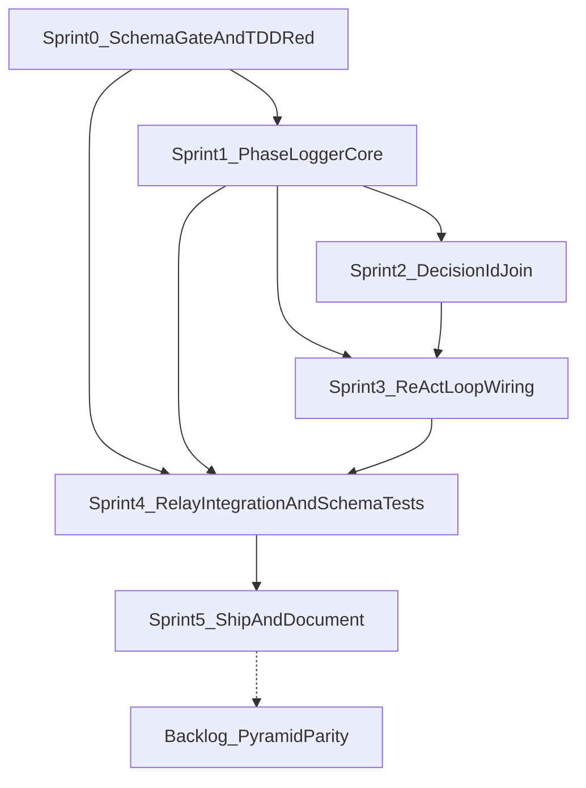

# Phase 3 PhaseLogger Wiring — Sprint Board

## Objective

Execute the PhaseLogger wiring program defined in [`docs/plans/phase_3_phaselogger_wiring.plan.md`](phase_3_phaselogger_wiring.plan.md) as dependency-ordered sprints. Wire the Reasoning pillar into the ReAct loop with persisted phase boundaries, cross-pillar `decision_id` joins, compliance-bundle `phase_events[]`, and Langfuse relay redaction — without breaking `DecisionRecord` / `phase_decisions[]` consumers.

Aligned with:

- [`docs/Architectures/FOUR_LAYER_ARCHITECTURE.md`](../Architectures/FOUR_LAYER_ARCHITECTURE.md)
- [`docs/style-guides/STYLE_GUIDE_LAYERING.md`](../style-guides/STYLE_GUIDE_LAYERING.md)
- [`research/tdd_agentic_systems_prompt.md`](../../research/tdd_agentic_systems_prompt.md)

**Master plan:** this board implements `phase3a-persist-phases` (P2), `phase3b-wire-phases` (P1), and `phase3c-decision-id` (P4) from [`.cursor/plans/governance_pipeline_enhancements_3c04ef92.plan.md`](../../.cursor/plans/governance_pipeline_enhancements_3c04ef92.plan.md).

## Capacity Assumptions

- Sprint length: 5 working days.
- Team allocation: 1 primary implementer + rotating reviewer.
- Planned allocation per sprint: 70% implementation, 20% tests, 10% review/evidence.

## Sprint Breakdown

The 15 plan todos map onto six implementation sprints plus one backlog item. Sprint 0 unblocks Sprint 1. Sprints 2 and 3 both depend on Sprint 1; Sprint 3 also needs Sprint 2 (`decision_id` in `route_node`). Sprint 4 integration stories need Sprints 0, 1, and 3. Sprint 5 gates on Sprint 4.

**Parallelization note:** After Sprint 1, Sprint 2 (`decision_id`) and the relay half of Sprint 4 (`b3-relay` — only needs B0 + B1) can run in parallel with Sprint 3 if capacity allows. Integration stories (C2, C4) must wait until Sprint 3 completes.

| Sprint | Theme | Plan todos | Depends on |
| --- | --- | --- | --- |
| 0 | Schema gate + TDD red | `b0-schema-gate`, `c0-failure-tests` | — |
| 1 | PhaseLogger persistence + PhaseTracker | `b1-impl`, `c1-impl-tests` | Sprint 0 |
| 2 | Cross-pillar `decision_id` | `b2-decision-id`, `c3-property` | Sprint 1 |
| 3 | ReAct loop wiring | `b3-wire` | Sprints 1, 2 |
| 4 | Relay, redaction, integration | `b3-relay`, `c2-integration`, `c4-schema-version` | Sprints 0, 1, 3 |
| 5 | Regression + governance docs | `c5-regression`, `d1-blackbox-doc`, `d2-phaselogger-doc`, `d3-recording-doc` | Sprint 4 |
| Backlog | Pyramid loop parity (Phase 3b) | `e1-pyramid-followup` | Phase 3 complete |

---

## Sprint 0 — Schema Gate & TDD Red

### Sprint Goal

Lock the split-file contract (`phases.jsonl` vs `decisions.jsonl`) and write failing failure-path tests before any persistence implementation.

### User Stories

- As a compliance consumer, I want phase boundaries in a separate `phase_events[]` bundle field so `DecisionRecord` validation on `phase_decisions[]` is never broken.
- As a test engineer, I want red-phase failure tests for unbalanced phases, per-step key collisions, and JSONL IO errors so B1 ships with failure-first coverage.

### Dependency Checkpoints

- D0.1: Split-file layout agreed — NEW `phases.jsonl`; `decisions.jsonl` untouched.
- D0.2: `BUNDLE_SCHEMA_VERSION` stays `"2"`; `phase_log_schema_version` is a separate field.

### Story Board

| Story | Goal | Scope | Plan ID | Acceptance and Evidence |
| --- | --- | --- | --- | --- |
| S0-1 Schema gate | Split-file layout + bundle fields | [`services/governance/black_box.py`](../../services/governance/black_box.py) `export_for_compliance`: add `bundle["phase_events"]`, `bundle["phase_log_schema_version"]="1"`; keep `export_workflow_log()` decisions-only | `b0-schema-gate` | `BUNDLE_SCHEMA_VERSION` stays `"2"`; `phase_decisions[]` shape unchanged; `export_phase_events()` stub or contract documented |
| S0-2 Failure-path tests (red) | TDD red for PhaseLogger gaps | Extend [`tests/services/test_governance.py`](../../tests/services/test_governance.py) `TestPhaseLogger`: end without start (warn/no crash), per-step key isolation, JSONL IO error, COMPLETION without start, mixed export ordering; use `freezegun` for duration | `c0-failure-tests` | Tests committed and **failing** against current log-only implementation |

### Sprint 0 Status Tracker

| Story | Status | Evidence |
| --- | --- | --- |
| S0-1 Schema gate | Done | `black_box.py`: `phase_log_schema_version`, `phase_events[]`; `phase_logger.py`: `export_phase_events()`, split-file docstring; `test_black_box_export.py::TestBundleSchemaVersion` |
| S0-2 Failure-path tests (red) | Done | `test_governance.py::TestPhaseLoggerFailurePaths` (6 tests, `xfail strict` until Sprint 1 B1) |

### Sprint 0 TDD Notes (failure-first, by layer)

- L2 (services/): write rejection tests first — unbalanced phases, key collisions, IO errors. No live LLM. Extend existing module — do not create `tests/services/governance/test_phase_logger.py`.

---

## Sprint 1 — PhaseLogger Core

### Sprint Goal

Implement persistence, per-step keying, duration tracking, injectable `decision_id_factory`, and the `PhaseTracker` async context manager; turn C0 red tests green.

### User Stories

- As an operator, I want phase start/end events persisted to `cache/phase_logs/{workflow_id}/phases.jsonl` with `step_count` and `duration_ms` so I can audit loop boundaries per step.
- As an orchestration author, I want `async with phase_logger.phase(...)` so every early-return and exception path auto-balances with `outcome="error"`.

### Dependency Checkpoints

- D1.1: S0-1 bundle contract merged before `export_phase_events()` is wired in black_box.
- D1.2: S0-2 red tests exist and fail before S1-1 starts.

### Story Board

| Story | Goal | Scope | Plan ID | Acceptance and Evidence |
| --- | --- | --- | --- | --- |
| S1-1 PhaseLogger persistence | Core API + JSONL writes | [`services/governance/phase_logger.py`](../../services/governance/phase_logger.py): `_phase_starts` keyed `f"{workflow_id}:{step_count}:{phase.value}"`; `start_phase`/`end_phase` gain `step_count`; optional `details`; `export_phase_events()`; stdlib+Pydantic only | `b1-impl` | `phases.jsonl` rows match schema; C0 tests green |
| S1-2 PhaseTracker CM | Exception-safe phase wrapper | Same file: `phase()` async context manager | `b1-impl` | Exception → `outcome="error"`, re-raises; start key popped |
| S1-3 Green implementation tests | Verify B1 behavior | [`tests/services/test_governance.py`](../../tests/services/test_governance.py) | `c1-impl-tests` | `duration_ms>=0`; step 0 vs step 1 independence; injected factory yields deterministic ids |

### Sprint 1 Status Tracker

| Story | Status | Evidence |
| --- | --- | --- |
| S1-1 PhaseLogger persistence | Done | `phase_logger.py`: `_phase_starts`, JSONL writes, `export_phase_events()`, `decision_id_factory` |
| S1-2 PhaseTracker CM | Done | `phase_logger.py`: `async with phase_logger.phase(...)` — error path + key pop |
| S1-3 Green implementation tests | Done | `test_governance.py::TestPhaseLoggerImplementation` (4 tests); C0 xfail removed — 10/10 green |

### Sprint 1 TDD Notes (failure-first, by layer)

- L2 (services/): C0 red tests turn green. Acceptance tests for `phases.jsonl` shape, duration, step isolation, PhaseTracker exception path. Use `freezegun`, not `time.sleep`.

---

## Sprint 2 — Cross-Pillar `decision_id`

### Sprint Goal

Add `decision_id` to the `Decision` model and thread it into `MODEL_SELECTED` for BlackBox ↔ PhaseLogger joins.

### User Stories

- As a compliance analyst, I want a shared `decision_id` on both the `decisions.jsonl` row and the `MODEL_SELECTED` BlackBox event so I can join routing decisions to trace events.
- As a replay engineer, I want an injectable `decision_id_factory` so goldens and property tests are deterministic.

### Dependency Checkpoints

- D2.1: ASK-FIRST change to `Decision` model — **signed off** in master plan.
- D2.2: Sprint 1 `decision_id_factory` ctor param available.

### Story Board

| Story | Goal | Scope | Plan ID | Acceptance and Evidence |
| --- | --- | --- | --- | --- |
| S2-1 `decision_id` on Decision | Model + factory wiring | [`services/governance/phase_logger.py`](../../services/governance/phase_logger.py) `Decision.decision_id: str \| None = None` (lazy) + `ensure_decision_id()` assigns from injectable `decision_id_factory` (NOT a Pydantic `default_factory` — the factory is instance-scoped) | `b2-decision-id` | Unique per decision; factory injectable in tests |
| S2-2 MODEL_SELECTED threading | Cross-pillar join at route | [`orchestration/react_loop.py`](../../orchestration/react_loop.py) ~716–721: `decision.decision_id` in `TraceEvent.details` | `b2-decision-id` | Same id in `decisions.jsonl` row and BlackBox event; **MODEL_SELECTED only** (ROUTING/EVALUATION cross-ref deferred) |
| S2-3 Property test | Uniqueness at scale | [`tests/services/test_governance.py`](../../tests/services/test_governance.py) Hypothesis | `c3-property` | No duplicate `decision_id` across N decisions in one workflow |

### Sprint 2 Status Tracker

| Story | Status | Evidence |
| --- | --- | --- |
| S2-1 `decision_id` on Decision | Done | `phase_logger.py`: `Decision.decision_id` (optional) + `ensure_decision_id()` lazy-assigns from injectable `decision_id_factory`; `test_governance.py::TestDecisionIdJoin` |
| S2-2 MODEL_SELECTED threading | Done | `react_loop.py:763`: `decision.decision_id` in `MODEL_SELECTED` `TraceEvent.details`; same id in `decisions.jsonl` row (`test_phase_wiring.py::test_decision_id_matches_model_selected`) |
| S2-3 Property test | Done | `test_governance.py::TestDecisionIdUniqueness` (Hypothesis, `@pytest.mark.property`, N=2..50, no duplicates) |

### Sprint 2 TDD Notes (failure-first, by layer)

- L1/L2: property-based uniqueness test (`@pytest.mark.property`). Inject factory for determinism in unit tests.
- L4: deferred to Sprint 4 integration (decision_id match across pillars).

---

## Sprint 3 — ReAct Loop Wiring

### Sprint Goal

Wrap every ReAct node boundary with `PhaseTracker`; emit `COMPLETION` exactly once from all three terminal paths.

### User Stories

- As a trace reviewer, I want every graph node (`guard_input`, `route`, `call_llm`, `execute_tool`, `verify_authorize_log`, `evaluate`) to emit phase boundaries at the correct `step_count`.
- As a governance owner, I want `COMPLETION` to fire once — whether the task ends via guardrail reject, budget exceeded, or normal done.

### Dependency Checkpoints

- D3.1: Sprint 1 PhaseTracker API available.
- D3.2: Sprint 2 `decision_id` merged in `route_node` before or with phase wiring there.

### Story Board

| Story | Goal | Scope | Plan ID | Acceptance and Evidence |
| --- | --- | --- | --- | --- |
| S3-1 Input + routing phases | `guard_input_node`, `route_node` | [`orchestration/react_loop.py`](../../orchestration/react_loop.py): sequential INITIALIZATION → INPUT_VALIDATION; ROUTING with `budget_exceeded`; COMPLETION on reject/budget | `b3-wire` | One-line `async with phase_logger.phase(...)` per boundary; AP-5 holds |
| S3-2 LLM + tool phases | `call_llm_node`, `execute_tool_node`, `verify_authorize_log_node` | MODEL_INVOCATION → OUTPUT_VALIDATION; TOOL_EXECUTION (pass logger into `_execute_tools_impl`); denied path `outcome="denied"` | `b3-wire` | Tool denial emits TOOL_EXECUTION without tool runs |
| S3-3 Evaluation + COMPLETION guard | `evaluate_node` + single-flight | EVALUATION phase; COMPLETION guard per `workflow_id` from all 3 terminal sites | `b3-wire` | CLI smoke: `phases.jsonl` contains expected phases for happy path |

### Node → Phase Reference

| Node | Phase(s) | Terminal outcome |
| --- | --- | --- |
| `guard_input_node` | INITIALIZATION, INPUT_VALIDATION | `rejected` → COMPLETION |
| `route_node` | ROUTING | `budget_exceeded` → COMPLETION |
| `call_llm_node` | MODEL_INVOCATION, OUTPUT_VALIDATION | MODEL_INVOCATION: manual `start_phase`/`end_phase` (LLM error captured + recorded, **not** re-raised, so `outcome="error"` without aborting the node); OUTPUT_VALIDATION: CM |
| `execute_tool_node` | TOOL_EXECUTION | — |
| `verify_authorize_log_node` | TOOL_EXECUTION | `denied` |
| `evaluate_node` | EVALUATION | `done` → COMPLETION |

### Sprint 3 Status Tracker

| Story | Status | Evidence |
| --- | --- | --- |
| S3-1 Input + routing phases | Done | `react_loop.py`: `guard_input_node` INITIALIZATION→INPUT_VALIDATION; `route_node` ROUTING + budget COMPLETION |
| S3-2 LLM + tool phases | Done | `call_llm_node` MODEL_INVOCATION/OUTPUT_VALIDATION; `execute_tool_node` TOOL_EXECUTION; `verify_authorize_log_node` denied |
| S3-3 Evaluation + COMPLETION guard | Done | `evaluate_node` EVALUATION; `_emit_completion_once` single-flight; `test_phase_wiring.py` (3 tests) |

### Sprint 3 TDD Notes (failure-first, by layer)

- L4 (orchestration/): mocked multi-step loop deferred to Sprint 4 C2; this sprint validates via CLI smoke and node-level wiring review.
- AP-5: orchestration nodes use ONLY `async with phase_logger.phase(...)` — no domain logic.

---

## Sprint 4 — Relay, Integration & Schema Tests

### Sprint Goal

Fix the Langfuse relay gap, extend redaction to `phase_events[]`, and prove end-to-end compliance bundle shape with integration tests.

### User Stories

- As a Langfuse consumer, I want published compliance datasets to include redacted `phase_events[]` — not just BlackBox events.
- As a schema gatekeeper, I want `phase_log_schema_version="1"` present without bumping `BUNDLE_SCHEMA_VERSION`.

### Dependency Checkpoints

- D4.1: S4-1 relay fix and S4-2 redaction extension ship in the same PR (R4.1).
- D4.2: Sprint 3 wiring complete before C2 integration assertions.

### Story Board

| Story | Goal | Scope | Plan ID | Acceptance and Evidence |
| --- | --- | --- | --- | --- |
| S4-1 Relay fix | Pass PhaseLogger to export | [`middleware/sidecars/black_box_to_telemetry.py`](../../middleware/sidecars/black_box_to_telemetry.py) ~284: build `PhaseLogger`, pass `phase_logger=...` to `export_for_compliance()` | `b3-relay` | Published bundle includes `phase_events[]` |
| S4-2 Redaction extension | Walk phase_events | [`services/governance/black_box_publisher.py`](../../services/governance/black_box_publisher.py) `redact_compliance_bundle`: redact `bundle["phase_events"]` free-text same as `events[].details` | `b3-relay` | [`tests/middleware/sidecars/test_compliance_dataset.py`](../../tests/middleware/sidecars/test_compliance_dataset.py) asserts no PII leak in phase records |
| S4-3 Integration tests | Multi-step mocked ReAct loop | Extend [`tests/services/test_explainability_service.py`](../../tests/services/test_explainability_service.py) or new [`tests/orchestration/test_phase_wiring.py`](../../tests/orchestration/test_phase_wiring.py) | `c2-integration` | All phases at expected step_counts; COMPLETION once on reject/budget/done; `decision_id` match; `phase_decisions[]` unchanged |
| S4-4 Bundle schema version | Recipe 13 extension | [`tests/services/governance/test_black_box_export.py`](../../tests/services/governance/test_black_box_export.py) `TestBundleSchemaVersion` | `c4-schema-version` | `phase_log_schema_version="1"` stable; `BUNDLE_SCHEMA_VERSION` still `"2"` |

### Risk Flags (Sprint 4-Specific)

- **R4.1:** Shipping S4-1 without S4-2 leaks PII via `phase_events[]`. Mitigation: merge relay + redaction in the same PR/story pair.

### Sprint 4 Status Tracker

| Story | Status | Evidence |
| --- | --- | --- |
| S4-1 Relay fix | Done | `black_box_to_telemetry.py`: `PhaseLogger` from `storage_dir.parent / "phase_logs"` passed to `export_for_compliance()` |
| S4-2 Redaction extension | Done | `black_box_publisher.py`: `_redact_phase_events()`; `test_black_box_publisher.py` + `test_compliance_dataset.py::TestRelayPhaseEvents` |
| S4-3 Integration tests | Done | `test_phase_wiring.py::TestPhaseWiringIntegration` (decision_id join, bundle shape, step keying) |
| S4-4 Bundle schema version | Done | `test_black_box_export.py::TestBundleSchemaVersion::test_phase_log_schema_version_is_stable` |

### Sprint 4 TDD Notes (failure-first, by layer)

- L2 (middleware/): redaction rejection tests before relay publish acceptance.
- L4 (orchestration/): failure mode matrix — COMPLETION once on reject/budget/done paths; mocked loop, no live LLM.

---

## Sprint 5 — Ship & Document

### Sprint Goal

Full regression green; governance triangle docs reflect production reality.

### Story Board

| Story | Goal | Scope | Plan ID | Acceptance and Evidence |
| --- | --- | --- | --- | --- |
| S5-1 Full regression | Architecture + full suite | AGENTS.md mandate | `c5-regression` | `pytest tests/architecture/ -q` AND `pytest tests/ -q` pass |
| S5-2 Black box doc | Phase events in bundle | [`governanaceTriangle/05_black_box_explanation.md`](../../governanaceTriangle/05_black_box_explanation.md) | `d1-blackbox-doc` | `phase_events[]` documented; G/I/R/P legend added |
| S5-3 PhaseLogger deep dive | Implementation status matrix | [`governanaceTriangle/06_phase_logger_deep_dive.md`](../../governanaceTriangle/06_phase_logger_deep_dive.md) | `d2-phaselogger-doc` | Implemented vs deferred matrix; fictional line refs replaced |
| S5-4 Recording doc | Relay + phase recording | [`governanaceTriangle/02_black_box_recording_debugging.md`](../../governanaceTriangle/02_black_box_recording_debugging.md) | `d3-recording-doc` | Phase recording landed; R1/R3 linked to master plan todos |

### Sprint 5 Status Tracker

| Story | Status | Evidence |
| --- | --- | --- |
| S5-1 Full regression | Done | All test directories green: trust 198, services 571, components 103, orchestration 84, middleware 332, meta 178, architecture 93, explainability_app 49, agent_ui_adapter 276 (0 failures). Fixed en route: relay forward-only startup-from-beginning reconciliation (`test_e2e_blackbox_pipeline.py`), `PostgresCheckpointer.__aexit__` direct-saver cleanup, regenerated `openapi.yaml` + `frontend/lib/wire-types.ts`. NOTE: a single `pytest tests/ -q` process aborts locally on a stray `pyarrow` native import reached via keras' lazy TF backend (`keras→pandas→pyarrow`); keras/tensorflow are NOT project deps — env-only, run per-directory or in clean CI |
| S5-2 Black box doc | Done | `governanaceTriangle/05_black_box_explanation.md`: `phase_events[]` bundle table + G/I/R/P legend + plan links |
| S5-3 PhaseLogger deep dive | Done | `governanaceTriangle/06_phase_logger_deep_dive.md`: Production Implementation Status matrix; production line refs |
| S5-4 Recording doc | Done | `governanaceTriangle/02_black_box_recording_debugging.md`: phase recording + relay redaction; R1/R3 → `phase2a-tool-called-enrich` / `phase2b-error-enrich` |

### Validation Sequence

1. `pytest tests/services/test_governance.py -q`
2. `pytest tests/services/ tests/orchestration/ -q`
3. `pytest tests/middleware/ -q`
4. `pytest tests/architecture/ -q`
5. `pytest tests/ -q`
6. CLI positive: `python -m agent.cli "What is 2+2?"`; inspect `cache/phase_logs/{workflow_id}/phases.jsonl`
7. CLI negative (Recipe 13 scenarios): guardrail reject, agent-facts fail, tool error — COMPLETION fires once
8. Verify `export_for_compliance()` bundle has `phase_events[]` + `phase_log_schema_version="1"`
9. Verify Langfuse-published dataset item contains redacted `phase_events[]`

---

## Backlog — Pyramid Loop Parity (Phase 3b)

| Story | Goal | Scope | Plan ID | Status |
| --- | --- | --- | --- | --- |
| BL-1 Pyramid PhaseTracker | Parity with ReAct | [`StructuredReasoning/orchestration/pyramid_loop.py`](../../StructuredReasoning/orchestration/pyramid_loop.py) | `e1-pyramid-followup` | Deferred |

**Out of scope** for Phase 3 sprints 0–5. Track so it is not lost after ReAct ships.

---

## Architecture Constraints (all sprints)

- Orchestration: one-line `async with phase_logger.phase(...)` only — AP-5, no domain logic in nodes.
- `PhaseLogger`: stdlib + Pydantic + typing only.
- Never mix phase events into `export_workflow_log()` — preserves `DecisionRecord` / ExplainabilityService validation.
- `decision_id` on `Decision`: signed off (ASK-FIRST satisfied).
