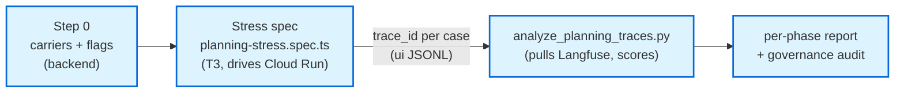
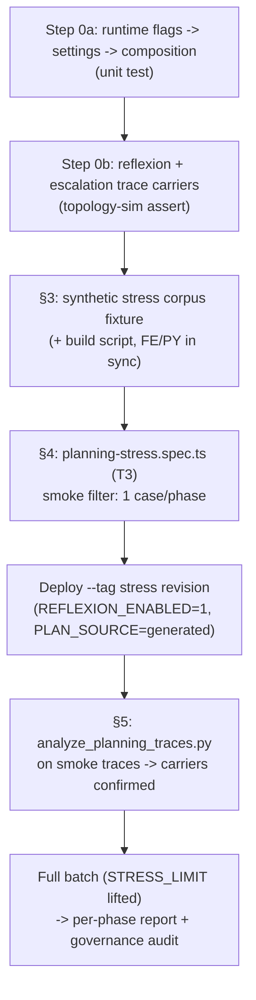

# Planning Pipeline — E2E Stress Test + Langfuse Trace Analysis Plan

> **Status.** Planning doc — what to build to *stress-test* the four-phase tiered-reasoning ladder
> (Phase 0 depth fix → Phase 1 T1 plan-and-execute → Phase 2 T2 reflexion → Phase 3 hybrid escalation) end-to-end
> against the real backend on Cloud Run, and how to analyze the resulting Langfuse traces. **It changes no source
> itself**; it specifies the work.
>
> **Date:** 2026-06-14. **Companion to:** the build trilogy
> [`planning_pipeline_tiered_loops.{plan,design,impl}.md`](planning_pipeline_tiered_loops.impl.md) (all 4 phases
> shipped, uncommitted in the working tree). **Reads with:** the
> [`playwright-agentic-e2e`](../skills/playwright-agentic-e2e/SKILL.md) skill (methodology) +
> [`agentsframework-playwright`](../skills/agentsframework-playwright/SKILL.md) (workspace binding) +
> [`PLAYWRIGHT_TESTING_ARCHITECTURE.md`](../Architectures/PLAYWRIGHT_TESTING_ARCHITECTURE.md) (tier taxonomy) +
> [`governance-trace-audit`](../skills/governance-trace-audit/SKILL.md) (the 4-pillar trace contract).
>
> **Decisions locked (user, 2026-06-14):** primary tier = **T3 full-stack on Cloud Run**; stress all four failure
> modes (depth / replan / reflexion / escalation); **Step 0 = close the trace-carrier gap** before the stress run.

---

## 0. TL;DR — the shape of the work

Three deliverables, in dependency order:

1. **Step 0 (blocker) — Trace carriers + runtime flags.** Phase 2/3 facts (reflexion attempts, escalation reason,
   termination cause) **do not export to any trace today**, and the deployed backend runs with
   `reflexion_enabled=False` / `plan_source="deterministic"`. Both must be fixed or the stress run is blind to
   exactly the loops it is meant to stress. Small, surgical backend edits.
2. **The stress spec** — `frontend/e2e/full-stack/planning-stress.spec.ts`, a T3 batch (sibling to
   `goaljudge-batch.spec.ts`) that drives a synthetic corpus through the real chat on Cloud Run and appends one
   JSONL row per case with the join keys (`trace_id`, depth, response, tool-card count, latency).
3. **The trace-analysis half** — `scripts/analyze_planning_traces.py` that pulls each captured `trace_id` from
   Langfuse and scores the run on the per-phase contracts, reporting **entry-router accuracy and escalation
   precision separately** (the hybrid's eval payoff). Reuses the tested Langfuse helpers, not a new API surface.



---

## 1. The hard constraint nobody can skip — current deployment runs the loops OFF

Verified against the tree:

- [`middleware/composition.py:512`](../../middleware/composition.py) builds `AgentConfig(...)` **without**
  `reflexion_enabled` or `plan_source`. So the live Cloud Run backend uses the shadow-first defaults
  ([`services/base_config.py:62,69`](../../services/base_config.py)): `plan_source="deterministic"`,
  `reflexion_enabled=False`.
- **Consequence:** a T3 run against the deployment *as it stands today* exercises **Phase 0 (depth) only.** The
  Phase 1 replan gate never consumes an LLM plan, and the Phase 2/3 reflexion + escalation branches are
  unreachable (`react_loop.py:1974` returns `done` when `reflexion_enabled` is false).
- **Therefore Step 0 must wire these flags to settings** (env / `Settings`) so the stress deployment can turn the
  loops on. Keep the production default OFF; the stress run sets the env flag on a dedicated revision (shadow-first
  discipline preserved — the flag flip is the *evidence-gathering* step the build plan always pointed at).

This is also why the build's governance gate for Phase 2/3 was deferred: there was no live path and no carrier.
Step 0 closes both. **It is the prerequisite, not an optional nicety.**

---

## 2. Step 0 — Trace carriers + runtime flags (backend, the blocker) — ✅ DONE (2026-06-14)

> **Built.** Step 0a + 0b landed. Gates green: `tests/middleware/test_agent_runtime_composition.py` (9 passed,
> incl. defaults-OFF prod parity + env-flip propagation + invalid-`plan_source` rejection) and
> `tests/orchestration/test_tier_topology_sim.py` (9 passed, incl. 3 new carrier gates: escalation carrier on
> TASK_COMPLETED, per-reentry reflexion-step carrier, `escalation_reason=disabled` negative control). Full
> regression: 246 passed / 10 skipped across orchestration + components + composition + architecture.
>
> **As-built notes / deviations from the spec above:**
> - **0a:** the `Settings` object is `AgentRuntimeSettings` *inside* `composition.py` (not a separate module).
>   Added `planning_plan_source` (typed `Literal["deterministic","shadow","generated"]`, not plain `str`, so an
>   invalid `PLANNING_PLAN_SOURCE` fails loudly at startup), `reflexion_enabled`, `max_reflexion_attempts`; wired
>   the bool/int coercion into `from_mapping`; passed all three into `AgentConfig(...)` at the former line 512.
> - **0b:** chose option (a) — the escalation carrier is recorded from `evaluate_node` (it owns the verdict),
>   folded into the existing `TASK_COMPLETED` event via a new pure `_escalation_carrier` helper that re-derives the
>   SAME scalars `_should_continue_or_escalate` feeds `decide_escalation` (idempotent; routing fn stays pure, LP-2).
>   The reflexion-step carrier is a `STEP_PLANNED` event recorded at the head of `reflect_node`'s return (reusing
>   the existing EventType — there is no dedicated reflexion EventType, and the analysis filters on the presence of
>   `reflexion_attempt`). `escalation_reason` enum: `disabled | budget_exhausted | verdict | prose_repeat | clean`.
>
> Remaining work below (§3 corpus, §4 spec, §5 analysis) is unchanged and still gated on the §8 reviewer answers.

**Goal.** Make Phase 1/2/3 facts (a) reachable live and (b) visible in Langfuse, using the *same Recording-pillar
discipline Phase 1 already used* (join keys on `step.planned`, not content — see
[`react_loop.py:1054-1089`](../../orchestration/react_loop.py)).

### 2.1 Runtime flags → settings (reach the live path)

| File | Change |
|---|---|
| [`services/base_config.py`](../../services/base_config.py) | already has `reflexion_enabled` / `max_reflexion_attempts` / `plan_source` — no change. |
| `middleware/settings` (the `Settings` object `composition.py` reads) | add `planning_plan_source: str = "deterministic"`, `reflexion_enabled: bool = False`, `max_reflexion_attempts: int = 2`, sourced from env (`PLANNING_PLAN_SOURCE`, `REFLEXION_ENABLED`, `MAX_REFLEXION_ATTEMPTS`). Default OFF — prod parity. |
| [`middleware/composition.py:512`](../../middleware/composition.py) | pass the three settings into `AgentConfig(...)`. |

Gate: a unit test that `composition` propagates the env flags into `AgentConfig` (mock env → assert the built
config). No live LLM (AP5).

### 2.2 Trace carriers (make Phase 2/3 visible)

**The gap (verified):** `step.planned` carries `planning_depth`, `plan_source`, `plan_generated`, `replanned`,
`plan_fingerprint`, `plan_changed` (Phase 0/1 facts). Reflexion exports **nothing structured** — the critique is
folded into the system prompt ([`react_loop.py:1231-1242`](../../orchestration/react_loop.py)) and there is no
`reflexion_attempt` / `escalation_reason` / `reflexion_terminated` field on any event. The escalation *decision*
(`decide_escalation`) leaves no trace at all.

Add a **reflexion-step carrier** on the `reflect_node` re-entry and an **escalation-reason carrier** at the fork,
both join-keys (counts/enums, never the critique text — that stays in the prompt/payload per §4.7 Recording):

| Where | New `step.planned` (or sibling event) details |
|---|---|
| `reflect_node` ([react_loop.py:1910](../../orchestration/react_loop.py)) | `{"reflexion_attempt": attempt, "reflexion_unmet_count": len(unmet), "reflexion_critique_chars": len(critique)}` — proves the loop re-entered and the gradient carried, without leaking content. |
| `_should_continue_or_escalate` fork | `{"escalation_decision": "reflect"|"done", "escalation_reason": <verdict|prose_repeat|budget_exhausted|disabled>, "reflexion_attempt": attempt, "max_reflexion_attempts": N}` — the join key the trace-analysis half reads to score escalation precision. |

> Routing fns must stay pure (LP-2). The *node* records the event (it has `black_box`); the routing fn returns the
> branch string only. Either (a) record the escalation carrier from `evaluate_node` (it already computed the
> verdict carriers `last_task_outcome`/`last_unmet_conditions`) by calling `decide_escalation` there for the
> *record* (the fork re-calls it for the *route* — pure, idempotent), or (b) record it at the head of `reflect_node`
> / a tiny terminal-tap node. **(a) is preferred** — one place, evaluate already owns the verdict.

Gate: extend the topology-sim (`test_tier_topology_sim.py`) to assert the BlackBox recording carries
`reflexion_attempt` and `escalation_reason` on a reflexion run (it already drives the failed-verdict loop). Pure,
mocked LLM, CI-safe.

### 2.3 Why Step 0 is worth it

Without the carriers, `analyze_planning_traces.py` can only verify depth + replan (Phase 0/1). With them, it
verifies the **full ladder** — and the carriers are permanent governance value (the
[`governance-trace-audit`](../skills/governance-trace-audit/SKILL.md) Reasoning + Recording pillars now cover the
reflexion loop). This is the "zero-carrier / token-seam" failure class the memory flags
([[trace-explainability-tokenfix-and-ui-plan]]) — caught *before* a blind stress run, not after.

---

## 3. The synthetic stress corpus — ✅ DONE (2026-06-14)

> **Built.** `scripts/build_planning_stress_corpus.py` (Python source of truth) →
> `frontend/e2e/fixtures/planning_stress_corpus.json` (42 cases: 12 depth reused verbatim from the committed
> depth-strata fixture + 10 replan + 10 reflexion + 10 escalation). Idempotent regen, unique case ids, every row
> carries its phase's `want_*` key. TS loader `frontend/e2e/fixtures/planning_stress_corpus.ts` (`filterCases({caseFilter,phase,limit})`
> + `smokeCases()` one-per-phase). Each phase has clean **controls written first** (precision guards): stable
> no-replan rows, trivial no-reflexion rows, clean no-escalate rows. Deterministic `trace_id` via
> `uuid.uuid5(NAMESPACE_DNS, case)` — same idiom as `export_goaljudge_registry_json.py`, so the analysis can
> pre-compute the join key. **User decision (2026-06-14): full ~10/phase now (~40), not smoke-first.**

## 3.0 (original spec)

A single JSON fixture, `frontend/e2e/fixtures/planning_stress_corpus.json`, with one row per case carrying the
prompt + the **per-phase expectation** the trace-analysis half scores against. Built by extending the existing
depth-strata fixture (`goaljudge_depth_strata.json`, the `GJ-DEPTH-*` rows) — reuse, don't reinvent.

Row schema:

```jsonc
{
  "case": "STRESS-DEPTH-L2-incident-01",
  "prompt": "Our checkout sometimes double-charges; trace how the retry path propagates and identify every call site.",
  "phase": "depth",                 // depth | replan | reflexion | escalation
  "want_depth": "L2",               // depth cases
  "want_replan": true,              // replan cases: a surprising tool result should rebuild
  "want_reflexion": true,           // reflexion cases: first answer likely partial -> re-enter
  "want_terminates_at_budget": true,// reflexion cases: must stop at the ceiling (no thrash)
  "want_escalation": "reflect",     // escalation cases: reflect | done
  "rationale": "long incident narrative -> L2 (was collapsing to L0 pre-Phase-0)"
}
```

Coverage (≈30–40 cases, all four modes — user-selected):

| Phase | Stratum | What the prompt forces | Source |
|---|---|---|---|
| **0 depth** | L0 single-action / L1 strong-verb / L1 long-task / L2 incident-narrative / L2 multi-part | the exact rows Phase 0 fixed — short strong-verb ("Plan the Postgres migration."), long incident narrative, "(1)…(2)…" enumeration | extend `depth_strata_rich.json` / `GJ-DEPTH-*` |
| **1 replan** | brittle-plan | a task whose first tool call plausibly fails or returns surprising output (e.g. "Read /workspace/config.yaml and apply the migration it describes" against a missing/garbage file) so `plan_is_stale` fires → `replan_count ≥ 1` | new |
| **2 reflexion** | under-specified / partial-prone | hard tasks where a single pass is likely `partial`/`failed` against derived success conditions, so reflexion re-enters and must hit the ceiling (`want_terminates_at_budget`) | new |
| **3 escalation** | confidently-wrong + clean control + prose-thrash | a confidently-wrong-prone task (→ failed verdict → escalate), a trivial task (→ success → no escalate, the false-positive guard), and a no-tool prose-thrash inducer (→ D3 escalate) | new |

**Determinism note (non-determinism is the whole point of T3).** The prompts are chosen to make a *class* of
outcome likely, not certain. The analysis scores **aggregate rates per phase** (e.g. "≥X% of L2-intended prompts
fired L2", "0 false escalations on the clean controls"), never a per-case exact assertion — mirroring the skill's
"assert structure/rates, not exact prose" rule and the build's escalation-precision oracle.

The fixture is generated/maintained by a small `scripts/build_planning_stress_corpus.py` (mirrors
`export_goaljudge_registry_json.py`) so the FE JSON and a Python-side copy stay in sync.

---

## 4. The stress spec — `frontend/e2e/full-stack/planning-stress.spec.ts` (T3) — ✅ DONE (2026-06-14)

> **Built.** Clones `goaljudge-batch.spec.ts` machinery + the `reasoning-recap-live` `captureEvidence` (force-open
> tool cards + reasoning expander, CSP-safe CSSOM wrapping). Reuses the `gj:{case}:{trace_id}` thread bridge so the
> middleware derives a deterministic server-side trace_id (FE-AP-7: no client trace_id). One test per case; the
> ONLY DOM assertion is "a non-empty answer rendered" — per-phase correctness is the trace-analysis half's job.
> **Screenshot per case reflecting its outcome — both success AND error paths captured: `{case}.png` on pass,
> `{case}_FAILED.png` on fail** (user requirement). Appends one JSONL row per case to `cache/planning_stress/ui_batch.jsonl`
> with `trace_id` + the row's `want_*` echoed for the analysis join. `package.json` → `test:e2e:stress` (on-demand,
> `--global-timeout=600000`, never per-commit). Env knobs: `STRESS_PHASE`, `STRESS_CASE_FILTER`, `STRESS_LIMIT`,
> `STRESS_SMOKE=1`. Frontend `tsc --noEmit` clean. **Not yet RUN** — needs the loops-on `--tag stress` revision
> (§4 note below) + WorkOS creds; the run is the deploy-and-execute step still pending.

## 4.0 (original spec)

A near-clone of [`goaljudge-batch.spec.ts`](../../frontend/e2e/full-stack/goaljudge-batch.spec.ts) — that spec
already solves auth (`auth.fixture`), send (`sendMessage`), settle-wait (`waitForResponse`),
`trace_id`/`response_text`/`tool_card_count` capture, screenshots, and JSONL append. **Reuse its machinery
verbatim; only the corpus + the captured fields change.**

- **Imports / fixtures:** `test, expect` from `../fixtures/auth.fixture`; `sendMessage`, `waitForResponse`,
  `waitForComposerReady` from `../fixtures/helpers`; the corpus loader from a new
  `../fixtures/planning_stress_corpus.ts` (`filterCases({caseFilter, limit})`, same shape as
  `goaljudge_registry.ts`).
- **Per case:** send prompt → settle → capture `{case, phase, trace_id, session_id, prompt, response_text,
  response_chars, tool_card_count, planning_depth?, latency_ms, screenshot_path, outcome, base_url, finished_at}`
  → append to `cache/planning_stress/ui_batch.jsonl`. The DOM `outcome` is only "did a non-empty answer render";
  the **real** scoring is the trace-analysis half (§5) — the spec is a *driver + capture*, not the judge.
  (`planning_depth` is read from the DOM only if the eval-mode UI surfaces it; otherwise it comes from the trace.)
- **Env / run** (from the workspace skill): `BASE_URL=https://agent-frontend-w65nrxwkiq-uc.a.run.app`,
  `E2E_AUTHENTICATED=1`, `E2E_USER_EMAIL`/`E2E_USER_PASSWORD` from repo-root `.env` (never inline — the classifier
  blocks the literal). Filters: `STRESS_CASE_FILTER=...`, `STRESS_LIMIT=5`, `STRESS_PHASE=reflexion`.
- **package.json:** add `"test:e2e:stress": "playwright test e2e/full-stack/planning-stress.spec.ts"` (T3-tagged,
  on-demand only — never per-commit; it costs model calls and is non-deterministic, per the skill's golden rule).
- **Cost guard:** `STRESS_LIMIT` default small; `max_cost_usd` per run is bounded by the backend config. Run the
  smoke filter (one case per phase) before the full batch.

> **Important — the deployment must run the loops-on revision.** Point `BASE_URL` at a Cloud Run revision deployed
> with `REFLEXION_ENABLED=1 PLANNING_PLAN_SOURCE=generated` (Step 0). Against the default prod revision the
> reflexion/escalation cases will all show `escalation_reason=disabled` — useful as a *negative control* but not
> the stress run. The plan recommends deploying a dedicated `--tag stress` revision so prod traffic is untouched.

---

## 5. Trace analysis — `scripts/analyze_planning_traces.py` — ✅ DONE (2026-06-14)

> **Built.** Reads `ui_batch.jsonl`, pulls each trace, scores per phase. CI gate
> `tests/scripts/test_analyze_planning_traces.py` (6 passed — failure-first: false-escalate fp, missed-escalate fn,
> L0-collapse miss, budget-overrun unbounded). **End-to-end dry-run validated on REAL carrier data**: ran the
> reflexion topology-sim, read its BlackBox `trace.jsonl` (19 events), correctly counted 2 reflexion attempts +
> `escalation_reason=budget_exhausted`, scored the reflexion phase as a bounded hit.
>
> **Two corrections to §5.1 (the named helper did not exist):**
> - The plan said reuse `fetch_trace_observations` from `scripts/export_goaljudge_corpus.py` and the
>   `diagnose_planning_depth.py` helper. **Neither exists in this repo** — there is no Langfuse READ client anywhere
>   (the prod path is write-only via the BlackBox→Langfuse relay `middleware/sidecars/black_box_to_telemetry.py`).
>   So the script is self-contained, with a **pluggable `--source`**: `blackbox` (default — read the canonical
>   `trace.jsonl` recordings the relay itself tails; right for a local run, no quota) or `langfuse` (a small
>   public-API reader using the `LANGFUSE_*` env creds; right for the live Cloud Run run since backend tmpfs
>   recordings are ephemeral). The Langfuse read path is built but **untested against the live API** (quota).
> - **Calibration-first** (user decision): `--gate` is opt-in; default mode RECORDS rates and always exits 0, so the
>   first non-deterministic batch sets the bars instead of flaking a gate. The §5.2 bars live in `gate_failures()`
>   for when bars are calibrated.
>
> Carrier-curation gotcha confirmed safe: the relay suppresses `STEP_PLANNED` export only when
> `plan_changed is False`; the reflexion-step carrier omits that key → exports. Escalation carrier rides
> `TASK_COMPLETED` (never suppressed).

## 5.0 (original spec)

The other half of the hybrid eval (build plan §8: entry accuracy and escalation precision **measured
separately**). Read-only; pulls each captured `trace_id` from Langfuse and scores it.

### 5.1 Mechanics (reuse, don't reinvent)

- Read the `ui_batch.jsonl` the spec produced; for each row pull observations via the **tested helper**
  `fetch_trace_observations(trace_id)` from [`scripts/export_goaljudge_corpus.py`](../../scripts/export_goaljudge_corpus.py)
  (same helper `diagnose_planning_depth.py` uses). No hand-rolled Langfuse API.
- From each trace read the `step.planned` carriers (Step 0 guarantees they exist): `planning_depth`,
  `routing_reason`, `plan_source`, `plan_generated`, `replanned`, plus the new `reflexion_attempt`,
  `escalation_reason`, `reflexion_terminated`/budget fields; and the `eval.goal_judge` verdict
  (`outcome`/`unmet_conditions`/`goal_met`).

### 5.2 Per-phase scoring (the report)

| Phase | Metric | Pass bar (tune on first run) |
|---|---|---|
| **0 depth** | **entry-router accuracy** = fired `planning_depth` == `want_depth`, per stratum | ≥ the offline oracle's 11/11 floor; **0 L0-collapses** on L1/L2-intended rows (the headline regression) |
| **1 replan** | replan recall = `replanned:true` on the brittle-plan rows | every `want_replan` row shows ≥1 replan; **0 replans** on stable controls (precision) |
| **2 reflexion** | re-entry + **bounded** = `reflexion_attempt` present and `≤ max_reflexion_attempts`; final verdict not masked | every `want_reflexion` row re-entered and **terminated at the ceiling** (no thrash, P10); **0** `failed→success` masking (corrupt-success guard) |
| **3 escalation** | **escalation precision/recall**, scored **separately** from entry accuracy | confidently-wrong → escalate (recall); clean controls → 0 false escalations (precision); prose-thrash → escalate; budget-exhausted → hold |

Output: a table mirroring `measure_escalation_precision.py` (precision = thrash/false-escalate risk, recall =
ships-wrong-answer risk, reported separately), plus per-phase confusion counts and a list of mismatched cases for
inspection. Exit non-zero on any phase below bar.

### 5.3 Governance audit (cross-check, the 4 pillars)

After scoring, run the captured traces through the
[`governance-trace-audit`](../skills/governance-trace-audit/SKILL.md) contract (or its in-repo evals) to confirm
each new fact has a **non-empty carrier that actually exports** — the Recording-pillar check that one contradictory
trace blocks the phase (GTP-5). This is where the Step 0 carriers earn their keep: the audit can now *see*
reflexion + escalation. **Do not consult the historical baselines** as ground truth (memory: baselines need a
do-not-consult guard) — re-derive from the live stress traces.

### 5.4 Langfuse quota reality

The Langfuse monthly trace quota is currently exhausted (429s observed during the build). The stress run + ingest
needs headroom — **check/raise the quota or wait for the monthly reset before the full batch**, and run the
one-case-per-phase smoke first to confirm carriers land before spending the budget on 40 cases.

---

## 6. Build order & gates



**Gates (every step):** failure-paths-first (the clean-control / no-escalation rows are the precision guards,
written into the corpus first); no live LLM in CI — the stress spec is **T3 on-demand only**, never per-commit
(AP5 / skill golden rule); secrets from env, never inline; the carrier edits keep routing fns pure (LP-2) and
record from nodes only. **One contradictory governance trace blocks the run** (GTP-5).

---

## 7. What is explicitly NOT in scope

- **No T1/T2 stress spec.** User chose T3 as the primary deliverable (the only tier that exercises the real
  planner/reflexion/escalation loop). A T1 mocked regression of the loop *wiring* is already covered by
  `test_tier_topology_sim.py`; a FE T1 stress mock would re-assert mocked behavior, not stress the live loop.
- **No production default flip.** `reflexion_enabled`/`plan_source` stay OFF in prod; the stress revision is a
  tagged, throwaway Cloud Run revision. Promotion to prod is a separate evidence-gated decision (the build plan's
  shadow→consume discipline).
- **No fan-out stress phase here (tier T3 of the *ladder*, not the test tier).** This plan stresses only the four
  shipped phases (depth / replan / reflexion / escalation). The ladder's T3 supervisor was **un-deferred
  2026-06-15** (build plan §3.5a) and its validation lives in a **separate** synthetic fan-out corpus
  ([`t3_fanout_corpus.plan.md`](t3_fanout_corpus.plan.md); `phase="fanout"`, 29 rows built) — *not* folded into
  this four-phase stress run. Adding a `STRESS_PHASE=fanout` batch here waits on the Phase 4 nodes + the analyzer
  `fanout` branch.
- **No new Langfuse API surface.** Reuse `fetch_trace_observations` / the tested helpers.

---

## 8. Open questions for the reviewer

1. **Stress deployment:** deploy a dedicated `--tag stress` Cloud Run revision with the loops on (recommended, prod
   untouched), or temporarily flip the flags on the existing dev revision? (Affects §4 `BASE_URL` + §6 Step E.)
2. **Pass bars (§5.2):** treat the first full batch as *calibration* (record the rates, set bars from them) or
   assert hard bars from the start (risk: a non-deterministic T3 run flakes the gate)? Recommend calibration-first.
3. **Corpus size:** ~30–40 cases (≈10/phase) for the first batch, or start at the 1-case-per-phase smoke and grow?
   Recommend smoke → ~10/phase once carriers are confirmed.
