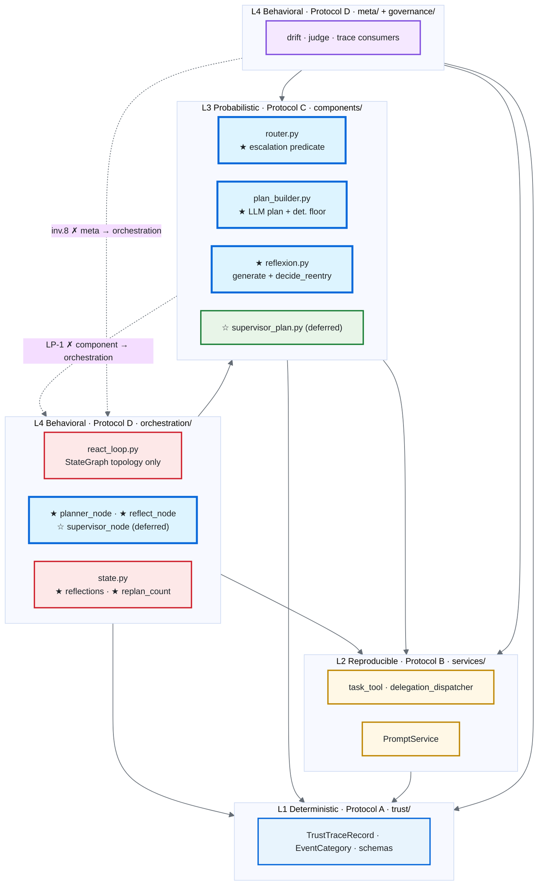
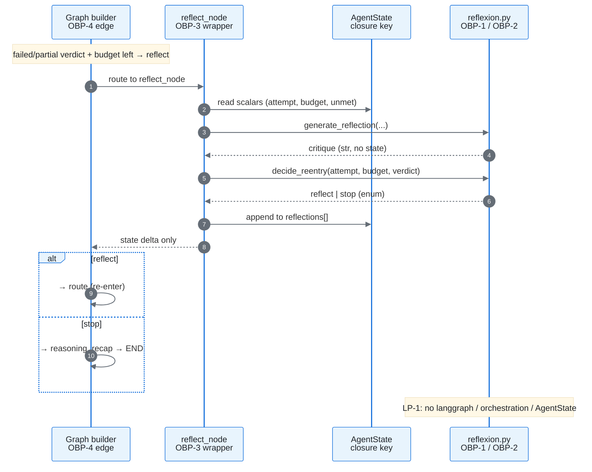
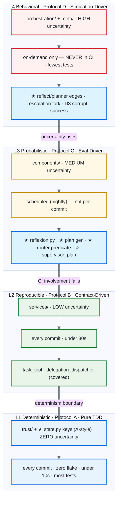
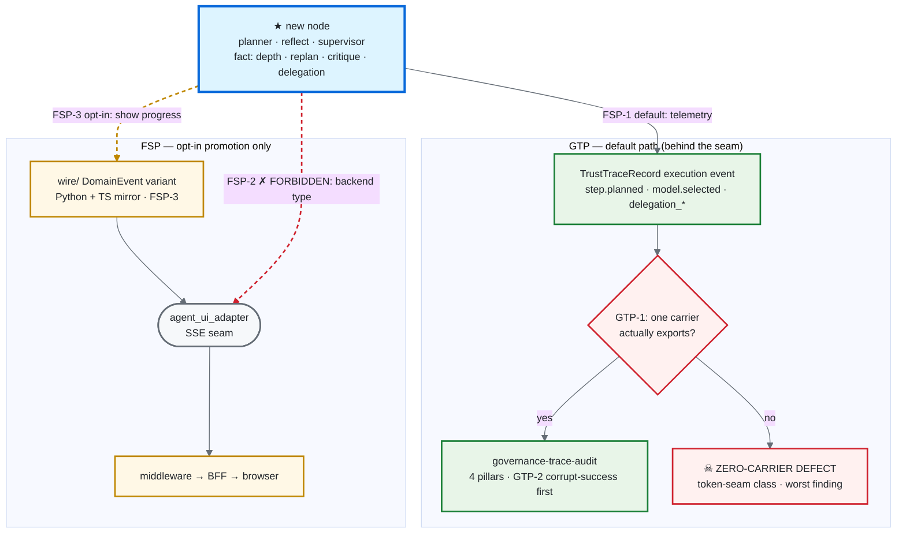
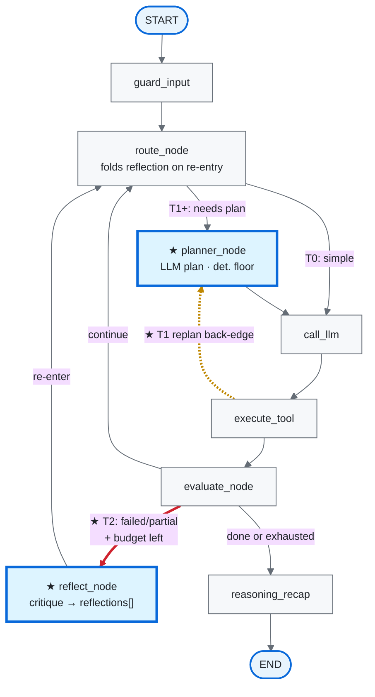

# Planning Pipeline — Tiered Reasoning Loops: Detailed Design

> **Status.** Design document — companion to
> [`planning_pipeline_tiered_loops.plan.md`](planning_pipeline_tiered_loops.plan.md) (*what and why*) and
> [`planning_pipeline_tiered_loops.impl.md`](planning_pipeline_tiered_loops.impl.md) (*what file / function /
> line / test*). The plan answers *what and why*; this doc answers *how*, and — its primary purpose —
> **identifies and pins every protocol the plan invokes** so that "build it under Protocol C" or "this obeys the
> onion protocol" has one normative definition to point at; the impl doc turns it into file-level edits. This
> document changes no source.
>
> **Date:** 2026-06-14. **Reads with:** the plan (tier ladder, §-numbers below refer to it),
> [`research/tdd_agentic_systems_prompt.md`](../../research/tdd_agentic_systems_prompt.md) (testing protocols),
> [`FOUR_LAYER_ARCHITECTURE.md`](../Architectures/FOUR_LAYER_ARCHITECTURE.md) (layer protocol),
> [`AGENTS.md`](../../AGENTS.md) (invariants), the
> [`governance-trace-audit`](../skills/governance-trace-audit/SKILL.md) skill (trace protocol), and
> [`FRONTEND_ARCHITECTURE.md`](../Architectures/FRONTEND_ARCHITECTURE.md) (seam protocol).
>
> **How to read it.** §A is the **Protocol Registry** — the normative core; everything else cites it. §B applies
> the registry to each component the plan introduces. §C is the per-phase build sequence. If you only read one
> section, read §A.
>
> **Diagrams (Mermaid, render in GitHub).** Five: the four-layer onion + artifact placement (§A.1), the OBP
> component↔orchestration sequence (§A.2), the agentic testing pyramid (§A.3), the GTP-carrier / FSP-promotion
> fact-flow (§A.6), and the StateGraph tier-ladder topology (§B). New artifacts are starred (★) and forbidden
> paths are dashed-red across all of them.

---

## Table of contents

- [A. Protocol Registry (normative)](#a-protocol-registry-normative)
  - [A.0 What "protocol" means here — three families](#a0-what-protocol-means-here--three-families)
  - [A.1 Layer Protocol (LP) — the onion / four-layer dependency rule](#a1-layer-protocol-lp--the-onion--four-layer-dependency-rule)
  - [A.2 Onion-Boundary Protocol (OBP) — component vs. orchestration split](#a2-onion-boundary-protocol-obp--component-vs-orchestration-split)
  - [A.3 Testing Protocols A/B/C/D — the agentic pyramid](#a3-testing-protocols-abcd--the-agentic-pyramid)
  - [A.4 Pattern catalog P1–P11 and Anti-Patterns AP1–AP7](#a4-pattern-catalog-p1p11-and-anti-patterns-ap1ap7)
  - [A.5 Governance Trace Protocol (GTP) — four pillars + curate-volume](#a5-governance-trace-protocol-gtp--four-pillars--curate-volume)
  - [A.6 Frontend Seam Protocol (FSP) — two-tier events + promotion](#a6-frontend-seam-protocol-fsp--two-tier-events--promotion)
  - [A.7 Protocol crosswalk — which protocol governs which artifact](#a7-protocol-crosswalk--which-protocol-governs-which-artifact)
- [B. Component design under the protocols](#b-component-design-under-the-protocols)
  - [B.1 State extensions (`orchestration/state.py`)](#b1-state-extensions-orchestrationstatepy)
  - [B.2 `planner_node` + plan generation (T1)](#b2-planner_node--plan-generation-t1)
  - [B.3 `components/reflexion.py` + `reflect_node` (T2)](#b3-componentsreflexionpy--reflect_node-t2)
  - [B.4 Escalation routing (`components/router.py`)](#b4-escalation-routing-componentsrouterpy)
  - [B.5 Supervisor pre-binding (`components/supervisor_plan.py`, T3 deferred)](#b5-supervisor-pre-binding-componentssupervisor_planpy-t3-deferred)
- [C. Per-phase build sequence](#c-per-phase-build-sequence)
- [D. Open questions inherited from the plan](#d-open-questions-inherited-from-the-plan)

---

## A. Protocol Registry (normative)

### A.0 What "protocol" means here — three families

The plan uses the word "protocol" for three distinct things; the design doc must keep them in separate
namespaces or every cross-reference is ambiguous (this is the same disambiguation discipline the plan applies to
`D1` vs `Protocol-D1`).

| Family | Members | Source of truth | Answers |
|---|---|---|---|
| **Structural protocols** | LP (Layer), OBP (Onion-Boundary) | [`FOUR_LAYER_ARCHITECTURE.md`](../Architectures/FOUR_LAYER_ARCHITECTURE.md), [`AGENTS.md`](../../AGENTS.md) | *Where does code live and what may it import?* |
| **Testing protocols** | A, B, C, D (+ test types A1–D3) | [`tdd_agentic_systems_prompt.md`](../../research/tdd_agentic_systems_prompt.md) | *How is a module at this layer tested?* |
| **Runtime contracts** | GTP (Governance Trace), FSP (Frontend Seam) | [`governance-trace-audit`](../skills/governance-trace-audit/SKILL.md), [`FRONTEND_ARCHITECTURE.md`](../Architectures/FRONTEND_ARCHITECTURE.md) | *What must the running system emit / never cross?* |

**Naming rule for this doc and all downstream work:**

- A bare letter `A`/`B`/`C`/`D` = a **Testing Protocol**.
- `Protocol-D1`, `C1`, `A4` = a **test type** within a testing protocol.
- `LP`, `OBP`, `GTP`, `FSP` = the three- or two-letter structural/runtime protocols defined here.
- Bare `D1`/`D2`/`D3` (no "Protocol-" prefix) remain the **§6 Open Decisions** — never reused for a test type.
- `P1`–`P11` = **patterns**; `AP1`–`AP7` = **anti-patterns**.

---

### A.1 Layer Protocol (LP) — the onion / four-layer dependency rule

**Definition.** The backend is a layered onion: four concentric layers plus a meta-layer, with **dependencies
pointing inward only**. A module may import from its own layer and any layer *below* it; never above.

| # | Layer | Directory (this repo) | May import | Pyramid (A.3) |
|---|---|---|---|---|
| 0 | Trust Foundation | `trust/` | nothing outward (pure) | L1 Deterministic |
| 1 | Horizontal Services | `services/` | `trust/` | L2 Reproducible |
| 2 | Vertical Components | `components/` | `trust/`, `services/` | L3 Probabilistic |
| 3 | Orchestration | `orchestration/` | `trust/`, `services/`, `components/` | L4 Behavioral |
| 4 | Meta / Governance | `meta/`, `governance/` | inward layers; **never `orchestration/`** ([AGENTS.md inv. 8](../../AGENTS.md)) | L4 Behavioral |

> **Naming note.** The TDD doc and `FOUR_LAYER_ARCHITECTURE.md` use illustrative folder names `utils/`/`agents/`;
> this repo's real directories are `services/`/`components/`. Same layers — the plan and this doc use the real
> names. (Verified against the tree.)

**Diagram — the onion, with new-tier artifacts placed and dependencies pointing inward only.** Solid arrows are
allowed imports (outer → inner); the dashed arrows are the two upward dependencies the new tiers must *never*
create (LP-1, LP-4). New artifacts are starred (★).

> Reading it: every new artifact lands in `components/` (pure logic) or `orchestration/` (topology + the state
> closure). Nothing new lands in `trust/` or `services/`. The two dashed arrows are exactly the violations P7
> asserts against in CI (A.4).

**Hard rules (the ones the new tiers can break):**

- **LP-1 — No upward import.** `components/*` must not import `orchestration/*` or `langgraph`.
- **LP-2 — No peer-component import (no V→V).** A `components/` module must not import another `components/`
  module ([AGENTS.md invariant 5](../../AGENTS.md)). Cross-component data flows through the *node*, as scalars.
- **LP-3 — No horizontal→horizontal coupling** beyond the allowed shape ([AGENTS.md AP-2](../../AGENTS.md)).
- **LP-4 — No backend→frontend import.** Nothing in `trust/`/`services/`/`components/`/`orchestration/` imports
  `middleware/` or `frontend/` ([AGENTS.md inv. 8 / AP-4](../../AGENTS.md)). (Crosses into FSP, A.6.)

**Enforcement.** LP is not prose — it is a CI test (P7, A.4) in `tests/architecture/`, run against the **test**
tree too (AP7).

---

### A.2 Onion-Boundary Protocol (OBP) — component vs. orchestration split

**Definition.** LP says *which layer*; OBP says *how a control loop is split across the orchestration↔component
boundary*. It is the architecture doc's **PEP/PDP rule** ([FOUR_LAYER lines 654-675](../Architectures/FOUR_LAYER_ARCHITECTURE.md))
applied to a loop: **the orchestrator composes and decides topology; the component returns a decision as data and
never reaches outward.** Stated as the canonical sentence the plan uses for Reflexion (§3.4) and pre-binds for
the Supervisor (§3.5):

> *A vertical component produces a value; the orchestration loop is topology that consumes it. The two never
> reach into each other.*

**The four OBP rules (every new loop tier obeys all four):**

| Rule | Concern | Lands in | Must NOT |
|---|---|---|---|
| **OBP-1** | Generation / computation (the actual logic) | `components/<x>.py` | import `langgraph`/`orchestration`/`AgentState`; decide whether to loop; mutate state |
| **OBP-2** | The *decision* (loop again? stop? which branch?) | a **pure predicate** in the same component, taking **scalars** as args (attempt count, budget, last verdict) | read `AgentState` directly |
| **OBP-3** | The node wrapper (adapt state ↔ component, call it) | `orchestration/react_loop.py` | contain any *logic*; it unpacks state → calls component → returns a state delta, nothing more |
| **OBP-4** | The edge (wire the predicate's enum to a target) | `add_conditional_edges` in the graph builder | live anywhere but the topology section |

**Why a pure generator + pure predicate, never a self-driving `Loop` class** (the load-bearing rationale, from
plan §3.4): if the component owns the loop it owns the graph, and you lose (a) unit-testing without a LangGraph
runtime, (b) swapping topology without editing component code, (c) reuse from the `StructuredReasoning/` pyramid
loop. OBP preserves all three.

**The closure is through shared state, not the call stack.** A loop tier's output lands on an `AgentState` key
via the existing reducer convention (A.2 → B.1); the consumer node reads it on re-entry. The component never
calls back into the loop.

**Diagram — the four OBP rules as a sequence (Reflexion, T2).** The node (orchestration) is the only thing that
touches both state and the component; the component takes scalars and returns data; the loop closes through the
`reflections` state key, never a call-back.

**Multi-agent extension (T3 only, from plan §3.5).** When the loop fans out to workers, OBP gains four
invariants — these are LP/OBP specialized for delegation:

- **OBP-M1** — No worker imports `AgentState`; it receives a `DelegationDispatchRequest`, returns a handoff
  payload. (LP-1 across a worker boundary.)
- **OBP-M2** — The decomposition planner is a component → no peer-component import (LP-2); a verdict it needs is
  passed in by the node as a scalar.
- **OBP-M3** — Handoff rides filesystem/state, never a call-back channel — this keeps the MAST inter-agent
  misalignment surface *observable* through the same pillars (GTP, A.5).
- **OBP-M4** — Delegation reuses the reserved `delegation_*` `TrustTraceRecord` event names — but "reuses a name"
  ≠ "has a carrier" (see GTP curate-volume, A.5).

---

### A.3 Testing Protocols A/B/C/D — the agentic pyramid

**Definition** (verbatim structure from
[`tdd_agentic_systems_prompt.md`](../../research/tdd_agentic_systems_prompt.md)). Each architecture layer has
**one** testing protocol, keyed to its *uncertainty tolerance*. The protocol fixes entry criteria, workflow,
test categories, and CI policy. Picking the wrong protocol for a layer is itself a defect (TDD principle 2).

**Diagram — the agentic testing pyramid: uncertainty rises, CI involvement falls, volume shrinks.** Each band is
one architecture layer ↔ one protocol; the new-tier artifacts are placed in the band whose protocol governs them.

> The thick arrow at the L2→L1 boundary marks the determinism line (TDD principle 1): below it, exact assertions;
> above it, aggregate rates and binary outcomes. The CI rule is the takeaway — **CI validates L1/L2 only**; L3/L4
> run scheduled or on-demand (AP5: never live LLM in CI). Note `state.py`'s new keys sit *physically* in
> `orchestration/` but are tested with **L1 A-style purity** because they are pure data + a pure reducer (B.1) —
> the one place the layer and the test-protocol diverge, by design.

| Protocol | Layer | Pyramid | Uncertainty | Workflow | CI |
|---|---|---|---|---|---|
| **A** — Pure TDD (Red-Green-Refactor) | `trust/` | L1 | **Zero** | failing test → min code → refactor | every commit, **zero flake**, <10s |
| **B** — Contract-Driven | `services/` | L2 | Low | define contract → test against it → implement; mock I/O | every commit, <30s |
| **C** — Eval-Driven | `components/` | L3 | Medium | behavioral expectations as eval criteria; mocked LLM for unit, trajectory for integration, aggregate rates for quality | scheduled (nightly/weekly), **not per-commit** |
| **D** — Simulation-Driven | `orchestration/` + `meta/` | L4 | High | binary-outcome scenarios; simulate trigger conditions; enumerate failure combinations | **on-demand only, never in CI** |

**Test types inside each protocol** (the granular vocabulary the plan cites as `C1`, `Protocol-D1`, etc.):

| Protocol | Test types | What each asserts |
|---|---|---|
| **A** | A1 schema-valid/invalid · A2 pure-function correctness · A3 enum MECE completeness · A4 state-machine invariants (Hypothesis) · A5 backward-compat | exact / property-based |
| **B** | B1 registry-through-public-API · B2 dependency-injected service · B3 TTL/time-mocked (`freezegun`) · B4 parameterized contract suite · B5 record/replay | contract / mock-I/O |
| **C** | **C1** deterministic scaffolding w/ mocked LLM (`TestModel`/`FunctionModel`) · **C2** trajectory eval (sequence, not text) · **C3** rubric LLM-as-judge, median of N | aggregate success rate / rubric |
| **D** | **D1** failure-mode matrix (parametrized over input dimensions) · **D2** feedback-loop simulation (injected triggers) · **D3** binary-outcome scenario (stakeholder-legible name) | binary outcome / simulation |

**Cross-cutting rules (apply to every protocol):**

- **Failure paths first** (TDD principle 4): for every gate/guard/decision, write the rejection test **before**
  the acceptance test. A gate that accepts everything is worse than one that rejects everything.
- **Behavior over implementation** (principle 3): assert *what*, never *how* — a test must survive a full
  reimplementation.
- **Test at the uncertainty boundary** (principle 1): identify which side of the determinism line a module sits
  on before writing a single assertion.
- **Self-validation** before a plan is final: the eight checks (coverage, layer-alignment, dependency-rule,
  failure-path, anti-pattern scan, contract, determinism, CI-policy).

---

### A.4 Pattern catalog P1–P11 and Anti-Patterns AP1–AP7

**Patterns** (reusable test skeletons; each prevents a named anti-pattern):

| ID | Pattern | Layer | Prevents |
|---|---|---|---|
| P1 | Property-based schema test (Hypothesis) | Trust | AP6 |
| P2 | State-machine invariant test | Trust | AP6 |
| P3 | Signature roundtrip test | Trust | AP1 |
| P4 | Consumer-driven contract test | Horizontal | AP2 |
| P5 | Record/replay fixture | Horizontal | AP5 |
| P6 | Mock provider | Horizontal | AP3 |
| **P7** | **Dependency-rule enforcement test** | **All** | **AP7** |
| P8 | Trajectory eval | Vertical | AP4 |
| P9 | Rubric-based eval | Vertical | AP3 |
| P10 | Governance loop simulation | Meta | AP6 |
| P11 | Failure-mode matrix | Orchestration | AP6 |

**Anti-Patterns** (stop and fix when detected):

| ID | Anti-pattern | One-line detector |
|---|---|---|
| AP1 | Tautological test | re-implements the algorithm it tests |
| AP2 | Mock addiction | >3 mocks in one test; never caught a real bug |
| AP3 | Determinism theater | exact-match assert against LLM output / `temperature=0` as a test strategy |
| AP4 | Eval dataset overfitting | asserts one model's tool sequence; 100% pass rate |
| AP5 | Live LLM in CI | real API key in a CI test |
| AP6 | Gap blindness | success:failure test ratio > 2:1 |
| AP7 | Cross-layer dependency leak | a test imports from a layer above the code under test |

**The two patterns that do structural work for this plan:** **P7** turns LP/OBP (A.1/A.2) into executable CI
assertions, and **P11** turns the escalation fork into an enumerated matrix. The two anti-patterns most likely to
bite this plan are **AP6** (the new gates are all about failure routing — happy-path-only tests would prove
nothing) and **AP3** (the LLM-touching nodes invite exact-string asserts).

---

### A.5 Governance Trace Protocol (GTP) — four pillars + curate-volume

**Definition** (from the [`governance-trace-audit`](../skills/governance-trace-audit/SKILL.md) contract). A
trace must let a reader answer four questions **from the trace alone**. The protocol validates *instrumentation*,
not task success — a failed task can produce a fully compliant trace, and the most important thing GTP checks is
whether the trace *admits* the failure.

| Pillar | Question | Primary carrier |
|---|---|---|
| **Recording** (BlackBox) | What happened? | `step.N`, `llm.call`, `tool.{name}`, **`step.executed`** (the only reliable token carrier) |
| **Identity** (AgentFacts) | Who did it? | `task.started` (`agent_name`/`version`/`facts_id`) |
| **Validation** (GuardRails) | What was checked? | `guardrail.checked`, `error.occurred` |
| **Reasoning** (PhaseLogger) | Why? | `model.selected.rationale`, `step.planned`, `eval.*` |

**The governing rule — GTP-1, _curate volume, never truth_:** the curated view may suppress *duplicate* carriers
of a fact, but every fact must retain **exactly one reliable carrier that actually exports**. A fact with **zero
carriers** is the worst class of finding, and it is almost always created by suppressing a carrier "because
another observation has it" **without verifying the substitute**. This is the token-seam incident
([trace-checks §3d](../skills/governance-trace-audit/references/trace-checks.md)): `STEP_EXECUTED` was suppressed
on the assumption `llm.call` carried tokens; it didn't; tokens had zero carriers; **CI was green throughout.**

**Other GTP rules the new tiers touch:**

- **GTP-2 — Corrupt-success is the headline check.** `outcome:"success"` with `goal_met:false` is a corrupt
  success. Run it first; lead the report with it.
- **GTP-3 — Honest time / no backdating (D-0a).** Re-entrant loops produce *more* observations on one
  `trace_id`; each stamps `event_time` at relay; near-zero relay durations are correct, not a defect.
- **GTP-4 — Dedup ≠ drop.** `step.planned` dedups on `plan_fingerprint`; a genuinely new plan (a replan) is a
  new fingerprint and **must** export; unchanged re-emissions suppress.
- **GTP-5 — Evidence over memory.** Every scorecard cell needs verbatim trace evidence; "CI is green" is not
  evidence. One contradictory trace outweighs a clean suite.

---

### A.6 Frontend Seam Protocol (FSP) — two-tier events + promotion

**Definition** (from [`FRONTEND_ARCHITECTURE.md`](../Architectures/FRONTEND_ARCHITECTURE.md)). The frontend is an
**additive outer ring** consuming the backend through exactly one seam — the `agent_ui_adapter` SSE surface —
and removable without changing any backend file. Two event tiers exist; new facts go in the right one.

| Tier | Carrier | Crosses the SSE seam? | Default home for new tier events |
|---|---|---|---|
| **Backend-internal telemetry** | `TrustTraceRecord` `execution`-category | **No** | **yes — default** |
| **UI-facing domain events** | curated `DomainEvent` union (`wire/`) | **Yes** | only by deliberate promotion |

**FSP rules:**

- **FSP-1 — Telemetry is the default.** New-tier events are `TrustTraceRecord` and reach governance/eval without
  touching the frontend. Recommended posture for initial T1/T2: **telemetry-only, zero frontend surface area.**
- **FSP-2 — No backend type crosses the seam.** No SDK type, backend Python type, or raw `AgentState` shape
  crosses — only `wire/` shapes carrying `trace_id` (F-R7/F-R8).
- **FSP-3 — Promotion is a four-step ring-internal change**, never a backend one: (1) add a `wire/`
  `DomainEvent` variant in Python *and* its TS mirror in lock-step; (2) runtime adapter emits it, `trace_id`
  verbatim from the runtime; (3) translate AG-UI→UIRuntime in `frontend/lib/translators/`; (4) render in a
  pure prop-driven component. Treat any "show reflection in the UI" work as a separate frontend-ring-scoped
  follow-up.
- **FSP-4 — No new `middleware/`/`frontend/` import in the backend** (= LP-4).

**Diagram — where a new-tier fact goes: the GTP carrier path (default) vs. the FSP promotion path (opt-in).** A
fact a new node produces flows *down* into a `TrustTraceRecord` carrier and reaches governance/eval without ever
touching the frontend (GTP, solid). It crosses the SSE seam *only* if deliberately promoted to a `wire/`
`DomainEvent` (FSP-3, dashed/opt-in). The forbidden path is emitting a backend type across the seam (FSP-2).

> The two decisions this diagram forces on every new fact: (1) **does it have one carrier that actually exports?**
> — if not, it's the zero-carrier defect, the worst GTP finding and the one CI cannot catch (GTP-1/GTP-5);
> (2) **does it need to be *shown*?** — if not (the recommended initial posture), it stays telemetry-only and the
> frontend never changes (FSP-1). Promotion is a separate, frontend-ring-scoped follow-up.

---

### A.7 Protocol crosswalk — which protocol governs which artifact

The single lookup table: for every artifact the plan introduces, the protocols that bind it.

| New artifact | LP layer | OBP role | Testing protocol | Patterns | Runtime contract |
|---|---|---|---|---|---|
| `reflections` / replan keys (`state.py`) | Orchestration (state) | carries the loop value (OBP closure) | A-style purity for schema/reducer | P1, P2 | GTP-4 (fingerprint) |
| `planner_node` plan logic (`plan_builder.py`) | Vertical component | OBP-1 generation | **C** | P6, P9 | GTP Reasoning (`step.planned`) |
| replan back-edge | Orchestration | OBP-4 edge | **D** (Protocol-D1) | P11 | GTP-4 (new fingerprint exports) |
| `components/reflexion.py` generator | Vertical component | OBP-1 | **C** | P6, P8, P5 | GTP Reasoning (critique carrier) |
| reflexion re-entry predicate | Vertical component | OBP-2 decision | **C** (C1, mocked) | P6 | — |
| `reflect_node` | Orchestration | OBP-3 wrapper | **D** | P11, P10 | GTP-2/3 |
| escalation routing (`router.py`) | Vertical component | OBP-2 at the edge | **C** + Protocol-D1 | P6, P11 | GTP Reasoning (`decision_id`) |
| `supervisor_plan.py` (T3, deferred) | Vertical component | OBP-1 + OBP-M2 | **C** | P6, P8 | GTP Recording/Validation (`delegation_*`) |
| `supervisor_node` (T3, deferred) | Orchestration | OBP-3 + OBP-M3 | **D** | P11, P10 | GTP-2 |
| any UI promotion (deferred) | frontend ring | — | (frontend tests) | — | **FSP-3** |
| all of the above | All | — | — | **P7 (in `tests/architecture/`)** | LP-1..LP-4 |

---

## B. Component design under the protocols

Each subsection: the change, the protocol bindings from A.7, and the test shape. All source line references are
a snapshot of today's tree (navigation aids, not contracts) and were verified at authoring time.

**Diagram — the StateGraph topology: today's flat ReAct loop with the additive T1/T2 nodes and edges.** Existing
nodes/edges are plain; new nodes are starred (★) and new edges are bold/labeled. The two new control structures
are the **T1 replan back-edge** (surprising tool output → re-plan) and the **T2 escalation fork** on the
formerly-terminal `done` branch. Every node is a thin OBP-3 wrapper; every fork is one OBP-4
`add_conditional_edges`. Nothing existing is modified — both tiers are purely additive (independently
revertible).

> The mapping to the tiers: **T0** is the unchanged `route → call_llm → execute_tool → evaluate → route` spine.
> **T1** adds `planner_node` on the entry path plus the replan back-edge from `execute_tool`. **T2** adds the
> escalation fork at `evaluate` — today's `evaluate → reasoning_recap → END`
> ([react_loop.py:1828-1833](../../orchestration/react_loop.py)) becomes a conditional: reflect-and-re-enter when
> the GoalJudge verdict is failed/partial and budget remains, else the unchanged recap→END. **T3** (deferred)
> would add a `supervisor_node` with `Send` fan-out; not drawn here (see B.5). The escalation predicate
> (`decide_reentry`) and the §5 triggers are the *intelligence*; the edges are just topology (A.2).

### B.1 State extensions (`orchestration/state.py`)

**Change.** Add two `AgentState` keys, following the existing reducer + memoization conventions:

- `reflections: Annotated[list[dict], _append_list]` — append-only, dedup by `step_id`, mirroring
  `step_results`/`error_history` ([state.py:75, 65](../../orchestration/state.py)). Each entry is one critique
  (`unmet_conditions` → verbal critique + the attempt index). Append-only is what makes prior critiques survive a
  checkpoint reload and accumulate as the Reflexion "semantic gradient".
- replan provenance — reuse the existing `last_plan_fingerprint` ([state.py:86](../../orchestration/state.py))
  plus a `replan_count` (`Annotated[int, operator.add]`, like `rollback_count` at
  [state.py:121](../../orchestration/state.py)). No new fingerprint machinery — `compute_plan_fingerprint`
  already exists.

**Protocols.** LP: orchestration-state (only file that may import `langgraph` — [state.py:3](../../orchestration/state.py)).
OBP: this is the **shared-state closure** — the channel through which the component's value reaches the consumer
node, never a call-back. GTP-4: `replan_count`/fingerprint must distinguish a real replan (exports) from an
unchanged re-emission (suppresses).

**Test shape (A-style purity, L1 discipline even though the file is in `orchestration/`).** The keys are pure
data + a pure reducer, so they test like Trust types: P1 property-based (any list of critiques round-trips
append-only), P2 invariant (dedup by `step_id` holds; `operator.add` on `replan_count` is monotonic).
Deterministic, <10s, zero flake. **Failure-first:** the dedup test (feeding a duplicate `step_id` must *not*
grow the list) is written before the append test.

### B.2 `planner_node` + plan generation (T1)

**Change.** Replace the regex split with an LLM planner producing the `PlanArtifact`, keeping
`derive_success_conditions` ([plan_builder.py:206](../../components/plan_builder.py)) as the **deterministic
floor** when generation fails — the exact shadow/generated/deterministic pattern already proven for
`TaskUnderstanding` ([react_loop.py ~801](../../orchestration/react_loop.py)). Add the `replan` back-edge: after
K steps or a surprising tool result, re-enter the planner.

**Protocols.** OBP-1: plan generation is component logic (`plan_builder.py`), takes task + context, returns a
`PlanArtifact` as data. OBP-4: the replan back-edge is one `add_conditional_edges`. GTP Reasoning: the plan lands
on `step.planned` (`plan_summary`/`plan_fingerprint`); GTP-4: a replan is a **new fingerprint → must export**.

**Test shape.** **Protocol C** for the generator: C1 with `FunctionModel`/mocked LLM asserting plan *structure*
(steps present, each has an action) — never the exact step text (AP3). **The headline test is the failure path
(AP6 / failure-first):** generation-fails → deterministic floor is used → run still has a valid plan; written
*before* the success test. **Protocol-D1 matrix** for the replan edge: `{surprising tool output → replan,
stable output → no replan}` (P11). C3 rubric for plan quality runs scheduled/off-CI (P9). The brittle-plan risk
(plan §9) is a dedicated D-level failure test: a surprising result must trigger replan, not silently continue.

### B.3 `components/reflexion.py` + `reflect_node` (T2)

**Change.** New component with two pure functions:

- `generate_reflection(unmet_conditions, last_answer, ...) -> str` — the verbal critique (Reflexion's semantic
  gradient, [arxiv 2303.11366](https://arxiv.org/abs/2303.11366)). **OBP-1.**
- a re-entry predicate `decide_reentry(attempt, budget, last_verdict) -> "reflect" | "stop"` — takes **scalars**,
  returns an enum. **OBP-2.**

The `reflect_node` wrapper (`react_loop.py`) unpacks state → calls the generator → appends to `reflections` →
returns the delta. **OBP-3.** Topology delta: the `done` branch today is
`evaluate → reasoning_recap → END` ([react_loop.py:1828-1833](../../orchestration/react_loop.py)); T2 inserts
`evaluate →[failed/partial & budget left]→ reflect → route`, else unchanged. **OBP-4**, one
`add_conditional_edges`, purely additive (independently revertible).

**Protocols.** OBP all four. GTP Reasoning: the critique needs its **own carrier** — do **not** assume
`reasoning_recap` carries it (that's the cosmetic post-hoc summary, plan §1). GTP-2: the GoalJudge must run on
the **final, post-reflexion** answer so corrupt-success sees the real outcome. GTP-3: re-entry produces more
stamped observations on one `trace_id` — do not reconstruct a single linear timeline.

**Test shape.** **Protocol C** for the component: C1 mocked-LLM for the predicate, **failure-first** — the
ceiling test (`at-budget → "stop"`) is written **before** the under-budget (`→ "reflect"`) test. C2 trajectory:
a failed-verdict → critique → re-entry actually fires (P8). **Protocol D** simulation for the loop: the thrash
risk (plan §9) is a D-sim — N reflexions must hit the **D1 budget ceiling (§6 Open Decision)** and terminate
(P10). The corrupt-success guard (GTP-2) is a **Protocol-D3** binary scenario, in stakeholder-legible form:
*"a reflexion loop never masks `goal_met:false` into success — YES/NO."*

### B.4 Escalation routing (`components/router.py`)

**Change.** Promote the hybrid cascade (plan §4): heuristic floor (the **fixed** `select_planning_depth`,
[router.py:72](../../components/router.py)) + a narrow LLM nudge at *entry*, and the real intelligence on the
*escalation* edge keyed to the §5 signals (GoalJudge `unmet_conditions` primary; tool-call no-progress
secondary; **prose-duplicate / no-tool thrash tertiary — see D3**, an orthogonal signal the first two
structurally cannot see).

**Protocols.** LP-2: the router is a component → must **not** import `goal_judge`/`evaluator` directly; the
*node* reads the verdict and passes it in as a scalar. OBP-2: the escalation decision is a pure predicate over
those scalars. GTP Reasoning: the escalation trigger (which §5 signal fired) lives in `model.selected.rationale`,
joinable by `decision_id`.

**Test shape.** **Protocol C** for the heuristic floor — **failure-first matrix**: each §5 trigger, *fired and
not-fired*, maps to the right transition (the not-fired cases are the failure paths, AP6). LLM nudge mocked
(P6). **Protocol-D1** at the edge for escalation precision. **Phase 0 prerequisite:** the depth-collapse fix is
a Protocol-C regression test written *first* — assert the 14/17 corpus rows reach intended depth →
[`diagnose_planning_depth.py`](../../scripts/diagnose_planning_depth.py) is the fixture oracle → fix → green.
No LLM, so L1-discipline (zero flake) applies.

### B.5 Supervisor pre-binding (`components/supervisor_plan.py`, T3 deferred)

**Change.** None now — T3 is deferred on workload grounds (plan §2.3). This subsection records the **binding**,
so the deferral is a scheduling decision, not an architectural hole. The foundation already exists and is already
layer-clean: `services/tools/task_tool.py` (budget/policy/approval gates + filesystem handoff) and
`services/tools/delegation_dispatcher.py` (`LocalLLMDelegationDispatcher`) import nothing from
`langgraph`/`orchestration`/`components` (verified). When un-deferred, T3 is a thin orchestration topology over
them, not a new subsystem.

**Protocols.** OBP-1 (`supervisor_plan.py` decides fan-out/fan-in, returns a plan of delegations as **data**) +
OBP-M1..M4 (workers take `DelegationDispatchRequest` not `AgentState`; planner is LP-2-clean; handoff is
filesystem/state; `delegation_*` events reused but carrier-verified per GTP-1). FSP: deferred-tier events are
telemetry-only (FSP-1).

**Test shape.** **Protocol C** for `supervisor_plan.py` (mocked-LLM decompose/merge, P6/P8). **Protocol D** for
`supervisor_node` (P11 failure matrix over fan-in completion, P10 governance-loop sim). **P7** must gain
assertions that `supervisor_plan.py` obeys LP-1/LP-2 *before any code is written* (the binding is the test).

---

## C. Per-phase build sequence

Mirrors plan §7/§7.5; each phase is independently shippable, eval-able, and revertible. **The TDD ordering rule
across all phases: the rejection/regression test lands before the acceptance test** (Protocol cross-cutting
rule, A.3).

| Phase | Deliverable | Lead test (failure-first) | Protocols | Gate |
|---|---|---|---|---|
| **0** | Fix depth collapse (`task_tool_results_count→L0` + flattener) | regression test: 14/17 corpus rows reach intended depth | **C** (deterministic, L1-discipline) | collapse clears; re-run `diagnose_planning_depth.py` |
| **1** | T1 planner + replan edge | deterministic-floor **fallback** test (before success); surprising-output→replan | **C** + Protocol-D1; P6/P9/P11 | T1 ≥ ReAct baseline, no brittle-plan regression |
| **2** | T2 `reflect_node` + budget ceiling (D1, §6) | predicate ceiling `at-budget→stop` (before `→reflect`); corrupt-success **Protocol-D3** | **C** + **D**; P5/P6/P8/P10/P11 | recovers a measurable fraction of partials without thrash |
| **3** | Hybrid escalation routing | each §5 signal fired/not-fired matrix | **C** + Protocol-D1; P6/P11 | entry-router accuracy + escalation precision (measured separately) |

**Determinism & CI policy (every phase, A.3 + AP5/AP3):** unit tests mock the LLM (`TestModel`/`FunctionModel`
or record/replay, P5/P6) — **never live LLM in CI**. L3/L4 quality and trajectory evals run on **aggregate pass
rates**, tagged `@pytest.mark.slow` / `@pytest.mark.simulation`, off the CI hot path. Assert
structure/trajectory/properties, never exact LLM strings.

**Governance gate, every phase (GTP, A.5):** run a from-step-0 trace through the
[`governance-trace-audit`](../skills/governance-trace-audit/SKILL.md) contract; the phase's new fact must have a
**non-empty carrier that actually exports** (Phase 0: fixed depth on `step.planned`; Phase 1: replan exports a
new fingerprint; Phase 2: critique carrier non-empty + post-reflexion `goal_judge` present). **One contradictory
trace blocks the phase — green CI is not sufficient (GTP-5).**

**Layer-boundary gate, every phase (P7, A.4):** `tests/architecture/` gains assertions that
`components/reflexion.py` / `supervisor_plan.py` do not import `langgraph`/`orchestration`/`AgentState`, and that
no new V→V import appears (LP-2). Run P7 against the **test** tree too (AP7).

---

## D. Open questions inherited from the plan

These are the plan's §6 Open Decisions, restated as design questions to settle before the relevant phase. They
are **not** pre-decided here.

- **D1 — Reflexion budget ceiling** (gates Phase 2 / B.3). Reuse `no_progress` threshold (cheapest, couples
  budget to a structural signal) vs. fixed `max_reflexion_attempts` config (most tunable, new knob) vs.
  budget-fraction gate (ties retries to spend, but starves cheap tasks). Whatever is chosen becomes the ceiling
  the Protocol-D thrash sim asserts (B.3).
- **D2 — Entry LLM-nudge scope** (gates Phase 3 / B.4). What the narrow classifier asks (multi-part? needs-plan?)
  and whether one fast-tier call per task is worth it vs. heuristic-only entry with all intelligence on the
  escalation edge.
- **D3 — Prose-duplicate (no-tool thrash) as a T2 entry trigger** (gates Phase 2/3 / B.3+B.4; prior art:
  [OpenManus `is_stuck`](../research/openmanus_comparison.md#idea-a--is_stuck--handle_stuck_state-pre-llm-stuck-breaker)).
  Today's no-progress predicate (`count_trailing_repeats`, [evaluator.py:62](../../components/evaluator.py))
  inspects only `tool_results`, so a loop that re-emits identical *assistant prose* with **zero** tool calls
  leaves the trailing run empty (`repeats == 0`) and escapes every backstop until `max_steps`/budget — the
  bluntest possible stop. OpenManus's `is_stuck` catches exactly that via assistant-content equality.
  **Proposal (accepted in principle; settle thresholds here):** extend the predicate to return a no-progress
  *kind* (`tool_repeat` | `prose_repeat` | `none`) rather than an int, then **route** on it — `prose_repeat`
  escalates to `reflect_node` (recover) when the D1 reflexion budget remains, else falls through to the existing
  terminal wrap-up (degrade). Do **not** port `is_stuck` as a method: it would duplicate a stronger backstop and
  mutate `next_step_prompt` in-place (an OBP call-stack reach-in). Layering: detection is **OBP-2** (the pure
  predicate stays in `components/evaluator.py`); routing is **OBP-4** (the `prose_repeat → reflect_node` edge
  lives in the graph builder, §B.4); the recovery action writes to `reflections[]` through shared state (OBP-1/3),
  never a call-back. **Gated on D1** (no escalation path without a budget ceiling). **Open sub-questions:** the
  prose-duplicate `threshold` and a `min-content-length` guard (mirror `count_trailing_repeats`'s `bool(last_output)`
  check so short legitimate confirmations like "Done." don't trip it); and a one-shot-per-cause guard (à la
  `no_progress_directive_sent`) so a *new* duplicate run is required after each reflection to re-escalate, avoiding
  reflexion thrash. Test shape: **Protocol-C** failure-first matrix over `{tool_repeat, prose_repeat, none} ×
  {budget left, exhausted}` (the budget-exhausted `prose_repeat → wrap-up` row is the AP6 failure path); the
  thrash bound itself is the **Protocol-D** sim already named in B.3.

> Reminder: bare `D1`/`D2`/`D3` here are the **§6 Open Decisions**, not testing-protocol test types. The test
> types are always written `Protocol-D1`, `C1`, etc. (A.0 naming rule).
