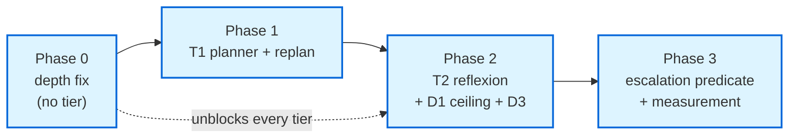

# Planning Pipeline — Tiered Reasoning Loops: Implementation Plan

> **Status.** Implementation document — the third companion to
> [`planning_pipeline_tiered_loops.plan.md`](planning_pipeline_tiered_loops.plan.md) (*what & why*) and
> [`planning_pipeline_tiered_loops.design.md`](planning_pipeline_tiered_loops.design.md) (*how & which protocol*).
> This doc answers **"what file, what function, what line, what test"** — it is the doc an engineer codes from
> directly. **It changes no source itself**; it specifies the changes.
>
> **Date:** 2026-06-14. **Reads with:** the design doc's Protocol Registry (§A) — every test/layer claim below
> cites it rather than re-deriving it.
>
> **Resolved open decisions** (settled before authoring, see [§0](#0-decisions-resolved-for-this-build)):
> **D1 = `max_reflexion_attempts: int = 2`** (new config knob); **D2 = heuristic-only entry** (no per-task entry
> LLM call; all adaptivity on the escalation edge); **D3 = accepted** (extend no-progress predicate to a `kind`,
> route `prose_repeat → reflect_node`).
>
> **Source line references are a snapshot of today's tree** (verified at authoring time against
> `react_loop.py`, `router.py`, `plan_builder.py`, `evaluator.py`, `state.py`, `base_config.py`). They are
> navigation aids; the *contract* is the function name + behaviour, not the line number.

---

## Table of contents

- [0. Decisions resolved for this build](#0-decisions-resolved-for-this-build)
- [1. Source ground-truth map (verified)](#1-source-ground-truth-map-verified)
- [2. New files & touched files at a glance](#2-new-files--touched-files-at-a-glance)
- [3. Phase 0 — Fix the depth collapse](#3-phase-0--fix-the-depth-collapse)
- [4. Phase 1 — T1 Plan-and-Execute + replan gate](#4-phase-1--t1-plan-and-execute--replan-gate)
- [5. Phase 2 — T2 Reflexion + D1 ceiling + D3 prose-thrash route](#5-phase-2--t2-reflexion--d1-ceiling--d3-prose-thrash-route)
- [6. Phase 3 — Hybrid escalation routing](#6-phase-3--hybrid-escalation-routing)
- [7. Cross-phase gates (run every phase)](#7-cross-phase-gates-run-every-phase)
- [8. Build order & dependency graph](#8-build-order--dependency-graph)

---

## 0. Decisions resolved for this build

The plan's §6 / design's §D left three decisions open. They are now fixed so the spec below is concrete. If a
decision is revisited, only the cited section changes.

| ID | Decision | Resolution | Where it lands |
|---|---|---|---|
| **D1** | Reflexion budget ceiling | **`max_reflexion_attempts: int = 2`** — new explicit config knob | `services/base_config.py` (next to `no_progress_*`) |
| **D2** | Entry LLM-nudge scope | **Heuristic-only entry.** No per-task entry LLM call. All adaptive intelligence on the evidence-grounded escalation edge (matches plan §4 overconfidence rationale). | Phase 3 router stays deterministic; no new LLM call site |
| **D3** | Prose-duplicate as T2 trigger | **Accepted.** Add `classify_no_progress(...) -> NoProgressKind` (`tool_repeat`\|`prose_repeat`\|`none`); route `prose_repeat → reflect_node` when reflexion budget remains, else terminal wrap-up. | `components/evaluator.py` (predicate) + graph edge (Phase 2) |

> D2 = heuristic-only means **Phase 3 introduces no new LLM call**. The "hybrid cascade" reduces, for this build,
> to: keep the fixed deterministic entry heuristic (`select_planning_depth`, repaired in Phase 0) and put *all*
> adaptivity on the escalation edge built in Phase 2. Phase 3 is therefore mostly **wiring the §5 trigger matrix
> into one predicate + measuring it**, not a new model call.

---

## 1. Source ground-truth map (verified)

Every anchor the phases below edit, confirmed against the current tree:

| What | File:line (verified) | Shape today |
|---|---|---|
| Entry depth heuristic | [`components/router.py:72`](../../components/router.py) | `select_planning_depth(*, task_input, task_tool_results_count) -> (Literal[L0,L1,L2], str)`. **Returns `L0,"post-tool-synthesis"` whenever `task_tool_results_count > 0`** (router.py:91) — the collapse. |
| Deterministic plan build | [`components/plan_builder.py:171`](../../components/plan_builder.py) | `build_plan_artifact(planning_depth, *, task_input) -> PlanArtifact`; regex `_extract_branches` + step cap `{L0:1,L1:3,L2:5}`. **Never LLM-generated.** |
| Plan models | [`plan_builder.py:15-29`](../../components/plan_builder.py) | `PlanStep{step_id,title,goal}`, `PlanArtifact{ordered_steps,constraints,success_conditions}`, `PlanValidationResult`. |
| Deterministic floor | [`plan_builder.py:206`](../../components/plan_builder.py) | `derive_success_conditions(branches) -> list[str]` — the fallback that must never be empty. |
| Plan fingerprint | [`plan_builder.py:144`](../../components/plan_builder.py) | `compute_plan_fingerprint(planning_depth, artifact) -> str` — **already exists, reuse for replan dedup.** |
| No-progress count | [`components/evaluator.py:62`](../../components/evaluator.py) | `count_trailing_repeats(tool_results) -> int`. **Inspects only `tool_results`** (blind to no-tool prose thrash — the D3 gap). |
| Continuation backstop | [`evaluator.py:177`](../../components/evaluator.py) | `check_continuation(...)` — graduated no-progress stop via `no_progress_repeat_threshold`/`_hard_limit` + `no_progress_directive_sent`. |
| Task outcome | [`evaluator.py:224`](../../components/evaluator.py) | `evaluate_task_outcome(...) -> TaskOutcome` — emits `unmet_conditions`, `goal_met`, `outcome`. The T2 escalation reads these. |
| Graph builder — node adds | [`react_loop.py:1780-1795`](../../orchestration/react_loop.py) | `add_node` for `call_llm`/`execute_tool`/`evaluate`/`reasoning_recap`. |
| Graph builder — T1 attach point | [`react_loop.py:1827`](../../orchestration/react_loop.py) | `builder.add_edge("execute_tool", "evaluate")` — the replan back-edge converts this. |
| Graph builder — T2 attach point | [`react_loop.py:1828-1832`](../../orchestration/react_loop.py) | `add_conditional_edges("evaluate", _should_continue, {"continue":"route","done":"reasoning_recap"})` — the escalation fork extends this map. |
| No-progress wrap-up site | [`react_loop.py:1135-1156`](../../orchestration/react_loop.py) | injects `no_progress_wrapup`, strips tool schemas, records `STEP_PLANNED{no_progress:true}`, uses `_count_trailing_repeats`. |
| TaskUnderstanding shadow pattern | [`react_loop.py:~801`](../../orchestration/react_loop.py) | the **generated→deterministic-floor** pattern the LLM planner copies. |
| State keys | [`orchestration/state.py:50-123`](../../orchestration/state.py) | `AgentState`; reducers `_append_list` (dedup by `step_id`), `operator.add`; `no_progress_directive_sent:bool` (114), `last_plan_fingerprint` (86). |
| Config knobs | [`services/base_config.py:40-41`](../../services/base_config.py) | `no_progress_repeat_threshold=3`, `no_progress_hard_limit=5` — `max_reflexion_attempts` lands here. |
| Architecture tests | [`tests/architecture/test_dependency_rules.py`](../../tests/architecture/test_dependency_rules.py) | where P7 (LP-1/LP-2) assertions for new components are added. |
| Depth probes | [`scripts/diagnose_planning_depth.py`](../../scripts/diagnose_planning_depth.py), [`diagnose_planning_strata.py`](../../scripts/diagnose_planning_strata.py) | Phase 0 fixture oracle. |

---

## 2. New files & touched files at a glance

**New files (3 source + their tests):**

| File | Layer | Purpose | Created in |
|---|---|---|---|
| `components/reflexion.py` | Vertical (L3) | `generate_reflection(...)` (OBP-1) + `decide_reentry(...)` (OBP-2) | Phase 2 |
| `tests/components/test_reflexion.py` | — | Protocol C unit tests (mocked LLM, failure-first) | Phase 2 |
| `tests/orchestration/test_tier_topology_sim.py` | — | Protocol D simulation matrix for the new edges | Phase 1→2 |

**Touched source files (all edits additive / independently revertible):**

| File | Phase(s) | Change summary |
|---|---|---|
| `components/router.py` | 0, 3 | Phase 0: remove/repair the `task_tool_results_count > 0 → L0` collapse + fix upstream flattener call. Phase 3: add `decide_escalation(...)` predicate over §5 scalars. |
| `components/plan_builder.py` | 1 | Add `build_plan_artifact_llm(...)` (or extend `build_plan_artifact` with an injected generator) → `PlanArtifact`; keep `derive_success_conditions` floor. |
| `components/evaluator.py` | 2 | Add `NoProgressKind` + `classify_no_progress(...)`; leave `count_trailing_repeats` intact. |
| `orchestration/state.py` | 2 | Add `reflections: Annotated[list[dict], _append_list]` + `replan_count: Annotated[int, operator.add]`. |
| `orchestration/react_loop.py` | 1, 2 | Add `planner_node` + `reflect_node` (thin OBP-3 wrappers); add the T1 replan back-edge and the T2 escalation fork in the graph builder. |
| `services/base_config.py` | 2 | Add `max_reflexion_attempts: int = 2`. |
| `tests/architecture/test_dependency_rules.py` | 2 | P7 assertions: `reflexion.py` imports no `langgraph`/`orchestration`/`AgentState`. |

> **Nothing new lands in `trust/` or `services/tools/`.** T3 supervisor files are **not** created (deferred,
> plan §2.3 / design §B.5).

---

## 3. Phase 0 — Fix the depth collapse ✅ DONE (2026-06-14)

**Goal.** The prerequisite bug (plan §2.1). Pure deterministic fix, no LLM, no new tier. **Highest leverage** —
every later tier inherits the collapse if skipped.

> **Status: implemented and verified.** The investigation **overturned the memory's root-cause theory.** The
> documented "thread-scoped count + upstream flattener" defects do **not** exist in the live tree — the call site
> ([react_loop.py:771-776](../../orchestration/react_loop.py)) *already* scopes the count to `current_task_id`,
> and `tool_results` rows already carry `task_id`. The real collapse has **two genuine causes**, both now fixed.

### 3.1 What the investigation found (the real root cause)

Re-scoring the corpus fresh (`task_tool_results_count=0`) still mismatched **9 of 12** rows — proof the post-
tool-synthesis rule was *not* the primary cause. Also: the committed corpus file
`depth_strata_corpus.jsonl` clips `task` at **50 chars**, so it cannot re-score the long L2 rows — the correct
oracle is **`cache/goaljudge_eval/depth_strata_rich.jsonl`** (untruncated `prompt` + `want_depth`), 11 unique rows.

**Cause 1 — the lexical heuristic under-scores** ([router.py `select_planning_depth`](../../components/router.py)).
The additive scorer rewards *breadth* (length, conjunctions, enumeration) and requires ≥2 signals for L1. Short
tasks whose complexity is in the *verb* (`"Plan the Postgres migration."`, `"Refactor the auth module."`) score
0–1 → L0; long diagnostic narratives (`"…sometimes double-charges… figure out where…"`) top out at L1 when they
are L2.

**Cause 2 — depth re-collapses mid-loop.** `route_node` recomputes depth every iteration; once the task runs one
tool, `task_tool_results_count > 0 → L0` flips a correct L1/L2 to L0 on the *next* pass (the genuine, but
*secondary*, role of the post-tool rule). Confirmed by the synthetic e2e fixtures, which asserted
`final_depth: "L0"` — i.e. they had **encoded the collapse as expected behavior**.

### 3.2 The fix (as implemented)

1. **Heuristic floors** ([components/router.py](../../components/router.py)) — three additive recognition rules
   layered after the existing scorer, each emitting a distinct `reason` so telemetry shows which fired:
   - **L2 promotion — `incident-narrative`:** `word_count ≥ 25` + an incident marker (`trace how`, `figure out`,
     `propagat`, `times out`, `sometimes`, …) → L2. Runs *before* the `score≥2 → L1` return so it can promote.
   - **Floor 1 — `strong-intent-verb`:** a *leading* verb in `_STRONG_INTENT_VERBS` (plan/design/refactor/audit/
     …) → L1.
   - **Floor 2 — `long-task-floor`:** `word_count ≥ 25` → L1. **Measured in words, not chars** — a char-length
     gate misclassified a single file-create with a long absolute path (caught by the fresh-task drift guard).
   - **Floor 3 — `sequenced-multistep`:** explicit `and then` / `, then` / `, and` → L1.
2. **Persist depth per task** (D-from-Q2). Added `planning_depth_task_id: str` to
   [`AgentState`](../../orchestration/state.py) and memoized the step-0 depth in
   [`route_node`](../../orchestration/react_loop.py) (reuse stored depth while `planning_depth_task_id ==
   task_id`), exactly mirroring the `task_understanding_task_id` discipline. This stops Cause 2 without weakening
   the post-tool-synthesis rule for genuine synthesis turns.
3. **Fixture correction.** The synthetic e2e cases
   ([`deep_agent_synthetic_e2e_cases.json`](../../tests/fixtures/deep_agent_synthetic_e2e_cases.json) +
   [`deep_agent_benchmark_adapted_cases.json`](../../tests/fixtures/deep_agent_benchmark_adapted_cases.json)) had
   `final_depth: "L0"` encoding the bug; updated to the correct (memoized) depth — 2 + 9 cases.

### 3.3 Tests (failure-first, all green)

- **Headline regression** ([`tests/components/test_router.py`](../../tests/components/test_router.py)
  `TestDepthCollapseRegression`): every **rich**-corpus row reaches its `want_depth` when scored fresh — written
  to fail red first, now **11/11**. Plus an over-correction guard: a genuine post-tool-synthesis turn
  (`task_tool_results_count=1`) still returns `L0`.
- **No regression:** the existing `TestPlanningDepth` matrix (incl. the TAP-4 over-flag guards) and the
  fresh-task drift guard (`validate_fresh_task_set`) stay green. Full sweep: **641 passed, 0 failed** across
  `tests/orchestration/ tests/components/ tests/architecture/ tests/services/ tests/middleware/`.

### 3.4 Gate (met, incl. live governance trace)

- Phase-0 oracle (offline): `depth_strata_rich.jsonl` → **11/11 reach intended depth, collapse cleared.**
- **Governance gate (design §C) — PASSED live (2026-06-14).** Ran the agent on `"Plan the Postgres
  migration."` (a task that previously collapsed to L0) with `goal_judge_enabled`, relayed the BlackBox
  recording to Langfuse, and audited the cloud trace `a78656aeeff04fa48cb8724e8d90073c`: the `step.planned`
  observation carries **`planning_depth: "L1"`** (reason `strong-intent-verb`) — the fixed depth exports, no L0
  collapse, and the GoalJudge ran on the final answer (corrupt-success check honest). Local BlackBox `step_planned`
  event confirmed the same before relay.
- `scripts/diagnose_planning_depth.py` / `diagnose_planning_strata.py` consume historical Langfuse traces — those
  predate the fix, so the from-step-0 run above (not the historical diagnose) is the authoritative live check.

---

## 4. Phase 1 — T1 Plan-and-Execute + replan gate ✅ DONE (2026-06-14)

**Goal.** Replace the regex plan with an LLM plan (deterministic floor on failure) and add the replan gate
so a surprising tool result re-plans instead of executing an already-wrong plan (plan §2.2 brittle-plan fix).

> **Status: implemented and verified (1834 passed, 0 failed).** Two scoping decisions settled before authoring
> diverged from the §4.2 sketch below and are now the as-built reality:
>
> 1. **Planner sited in-place in `route_node`, not a separate `planner_node`.** The plan was *already* built
>    inside `route_node` (the `build_plan_artifact` call, with fingerprint + `STEP_PLANNED` + the memoize gate all
>    living there). Adding a parallel node would duplicate that machinery and rewire the entry topology. Instead
>    the in-place `build_plan_artifact` call was upgraded to the shadow-first generated/floor logic, keeping
>    orchestration thin (the node unpacks state → calls the component → returns a delta; no planning logic) and
>    the diff small + revertible. Four-layer + AGENTS.md compliance held: `plan_builder.py` stays pure, the new
>    `PlanGenerator` is framework-agnostic (no `langgraph`/orchestration import — verified by the directory-wide
>    `test_components_no_framework_imports` scan).
> 2. **Shadow-first rollout.** New `AgentConfig.plan_source: "deterministic"|"shadow"|"generated" = "deterministic"`.
>    Default is deterministic so CI stays L2-pure (no live LLM) and steady state is unchanged; `shadow` generates +
>    captures the LLM plan but consumes the floor; `generated` consumes the LLM plan with the floor as the failure
>    backstop. Same shadow→consume discipline as GoalJudge.
> 3. **No new graph edge for replan.** The §4.2 "convert `execute_tool → evaluate` to a conditional back-edge"
>    proved harmful — it would skip `evaluate` (cost tracking, continuation, GoalJudge continuity). The replan gate
>    instead lives in `route_node`'s stale check: the existing loop `route → call_llm → execute_tool → evaluate →
>    [continue] → route` already returns to `route`, which reuses the memoized plan and rebuilds only when
>    `plan_is_stale` fires on the latest tool result. Topology is unchanged — strictly more revertible.

### 4.0 As-built file map

| File | Change |
|---|---|
| [`components/plan_builder.py`](../../components/plan_builder.py) | `build_plan_artifact_llm(planning_depth, *, task_input, generate)` (parse/validate/floor), `_parse_plan` (tolerant: object-steps or bare-string steps, re-numbers `step_id`), `plan_is_stale(plan, last_tool_result)` (pure predicate over the live `ok`/`error` schema + `outcome`/`surprising`/`replan` flags). |
| [`components/plan_generator.py`](../../components/plan_generator.py) | **NEW.** `PlanGenerator` — the LLM boundary: renders `plan_builder_prompt.j2`, invokes fast-tier, returns the decoded raw dict (or raises). Mirrors `TaskUnderstandingGenerator`. Floor/validate is the caller's job. |
| [`prompts/plan_builder_prompt.j2`](../../prompts/plan_builder_prompt.j2) | **NEW.** Ordered-steps + constraints + success_conditions, depth-gated. |
| [`services/base_config.py`](../../services/base_config.py) | `plan_source` flag (above). |
| [`orchestration/state.py`](../../orchestration/state.py) | `plan_artifact: dict` + `plan_artifact_task_id: str` (memoize the chosen plan per task; stable fingerprint across re-entry) + `replan_count: Annotated[int, operator.add]`. |
| [`orchestration/react_loop.py`](../../orchestration/react_loop.py) | Construct `PlanGenerator`; in `route_node` reuse/replan/build the plan; carry `plan_source`/`plan_generated`/`replanned` on `STEP_PLANNED`; persist the new state keys. |

### 4.0a Tests (failure-first, all green)

- **Protocol C** ([`tests/components/test_plan_builder.py`](../../tests/components/test_plan_builder.py)): the four floor-fallback rows (raise / empty-steps / garbage-shape / MECE-fail) land **before** the consume-success row; `plan_is_stale` matrix incl. the live `ok`/`error` schema and the not-stale default.
- **Protocol C** ([`tests/components/test_plan_generator.py`](../../tests/components/test_plan_generator.py)): mocked LLM, failure paths (transport raise / malformed JSON / array response) first, then the decoded-dict + fenced-JSON happy paths. Never asserts exact prompt text (AP3).
- **Protocol D** ([`tests/orchestration/test_tier_topology_sim.py`](../../tests/orchestration/test_tier_topology_sim.py)): the brittle-plan row — a failed tool result drives `replan_count ≥ 1` (and depth holds L1, no collapse); the stable control never replans; `plan_source="generated"` consumes the 3-step LLM plan end-to-end.
- **No regression:** 1834 passed across `orchestration/ components/ architecture/ services/ middleware/`.

### 4.x Original sketch (superseded by the as-built notes above)

### 4.1 Component change — `components/plan_builder.py` (OBP-1)

Add an LLM-backed generator that returns a `PlanArtifact`, keeping `derive_success_conditions` as the floor.
**Keep generation framework-agnostic** — the component receives an injected callable/LLM service, never imports
`langgraph`/`orchestration`.

```python
# components/plan_builder.py  (new function — sketch)
def build_plan_artifact_llm(
    planning_depth: PlanningDepth,
    *,
    task_input: str,
    generate: Callable[[str], dict],   # injected by the node; returns raw plan dict
) -> PlanArtifact:
    """LLM plan with deterministic floor fallback.

    Mirrors the TaskUnderstanding shadow/generated/deterministic pattern
    (react_loop.py ~801). On any generation/parse/validation failure, fall back
    to build_plan_artifact(planning_depth, task_input=task_input) — the floor
    that already exists — so the run ALWAYS has a valid, non-empty plan.
    """
    try:
        raw = generate(task_input)
        artifact = _parse_plan(raw, planning_depth)          # new: dict -> PlanArtifact
        if validate_plan_mece(artifact).is_valid:            # reuse existing validator (plan_builder.py:235)
            return artifact
    except Exception:
        pass
    return build_plan_artifact(planning_depth, task_input=task_input)   # deterministic floor
```

- Reuse `validate_plan_mece` (plan_builder.py:235) — the structural gate. Reuse `compute_plan_fingerprint`
  (plan_builder.py:144) for replan dedup; **no new fingerprint machinery**.

### 4.2 Orchestration change — `react_loop.py`

**`planner_node` (thin OBP-3 wrapper).** Add alongside the other node defs (near react_loop.py:1787). It:
unpacks state → calls `build_plan_artifact_llm(...)` with the LLM service bound as `generate` → returns a state
delta (the artifact + its fingerprint + a `STEP_PLANNED` record). **No planning logic in the node.**

**Topology (OBP-4), two edits in the graph builder:**

1. **Entry path:** route to `planner_node` for T1+ depth before `call_llm`. Today `route → call_llm`
   (react_loop.py:1806). Make it conditional on depth: `route →[L1/L2]→ planner → call_llm`; `route →[L0]→
   call_llm` (unchanged). Add `builder.add_node("planner", planner_node)`.
2. **Replan back-edge:** today `execute_tool → evaluate` is an unconditional edge (react_loop.py:1827). Convert
   to a conditional: `execute_tool →[surprising output]→ planner` (re-plan), else `→ evaluate` (unchanged). The
   "surprising output" predicate is a **pure component predicate** (OBP-2) — add `plan_is_stale(plan, last_tool_result)
   -> bool` to `plan_builder.py`, called by a thin routing fn in react_loop.py.

> Both edits are additive and gated on depth/surprise — an L0 task takes the exact path it takes today, so Phase 1
> is independently revertible.

### 4.3 State change

`replan_count: Annotated[int, operator.add]` is added in Phase 2's state edit (5.1) — or pull it forward to
Phase 1 if the replan telemetry is wanted in Phase 1's gate. Reuse `last_plan_fingerprint` (state.py:86) now.

### 4.4 Tests

- **Protocol C** — `tests/components/test_plan_builder.py` (extend):
  - **Failure path first (headline):** `generate` raises / returns garbage → `build_plan_artifact_llm` returns
    the **deterministic floor** and the run has a valid plan. Written **before** the success test (AP6/failure-first).
  - Success: mocked `generate` returns a well-formed plan → structure asserted (steps present, each has a goal) —
    **never the exact step text** (AP3).
- **Protocol D** — `tests/orchestration/test_tier_topology_sim.py`:
  - `Protocol-D1` matrix: `{surprising tool output → replan fires, stable output → no replan}` (P11). The
    brittle-plan risk (plan §9) is the named failure row: a surprising result must trigger replan, not silently
    continue.
- **Governance gate:** a replan exports a **new** `plan_fingerprint` with `plan_changed:true` (GTP-4); unchanged
  re-emissions still suppress (design §A.5).

### 4.5 Gate

T1 ≥ ReAct baseline on the depth-strata corpus, **no brittle-plan regression** (the D1-matrix replan test green).

---

## 5. Phase 2 — T2 Reflexion + D1 ceiling + D3 prose-thrash route

**Goal.** Reflexion re-entry on GoalJudge failed/partial, capped by `max_reflexion_attempts=2` (D1), plus the
D3 prose-duplicate → reflect route. Largest phase; depends on Phase 1's planner being in place.

### 5.1 State change — `orchestration/state.py`

Two keys, following existing reducer conventions (design §B.1):

```python
# orchestration/state.py  (add inside AgentState, near the rollback keys ~121)
reflections: Annotated[list[dict], _append_list]   # append-only, dedup by step_id; the semantic gradient
replan_count: Annotated[int, operator.add]         # like rollback_count (state.py:121)
```

Each `reflections` entry: `{step_id, attempt, critique, unmet_conditions}`. Append-only is what makes prior
critiques survive a checkpoint reload and accumulate (Reflexion's semantic gradient, arxiv 2303.11366).

### 5.2 Config change — `services/base_config.py` (D1)

```python
# services/base_config.py  (add next to no_progress_hard_limit, line ~41)
max_reflexion_attempts: int = 2   # D1: reflexion budget ceiling (design §D D1)
```

### 5.3 New component — `components/reflexion.py` (OBP-1 + OBP-2)

```python
# components/reflexion.py  (NEW — NO langgraph/orchestration/AgentState imports)
from __future__ import annotations
from typing import Callable, Literal

ReentryDecision = Literal["reflect", "stop"]

def generate_reflection(
    *,
    unmet_conditions: list[str],
    last_answer: str,
    generate: Callable[[str], str],   # injected critique LLM call
) -> str:
    """unmet_conditions + last answer -> a verbal critique (the semantic gradient). OBP-1."""
    ...

def decide_reentry(
    *,
    attempt: int,
    max_attempts: int,
    last_verdict: str,         # "success" | "partial" | "failed"
) -> ReentryDecision:
    """Pure predicate over SCALARS. OBP-2 — reads no AgentState.

    Failure-first contract: at or above the ceiling -> 'stop' ALWAYS, even on a
    failed verdict. Below ceiling AND verdict in {failed, partial} -> 'reflect'.
    Otherwise -> 'stop'.
    """
    if attempt >= max_attempts:
        return "stop"
    if last_verdict in ("failed", "partial"):
        return "reflect"
    return "stop"
```

### 5.4 Predicate extension — `components/evaluator.py` (D3)

Add a **new** function; leave `count_trailing_repeats` (evaluator.py:62) intact for backward compat.

```python
# components/evaluator.py  (NEW — sibling to count_trailing_repeats)
from typing import Literal
NoProgressKind = Literal["tool_repeat", "prose_repeat", "none"]

def classify_no_progress(
    tool_results: list[dict],
    recent_assistant_messages: list[str],   # the no-tool prose the loop emitted
    *,
    tool_threshold: int,                     # = no_progress_repeat_threshold
    prose_threshold: int,                    # D3 sub-question — start = no_progress_repeat_threshold
    min_content_len: int = 1,                # D3 guard: mirror bool(last_output); short "Done." won't trip
) -> NoProgressKind:
    """Classify the *kind* of no-progress. OBP-2 pure predicate over scalars/lists.

    - tool_repeat: count_trailing_repeats(tool_results) >= tool_threshold
    - prose_repeat: the trailing assistant messages (zero tool calls) repeat
      identical content >= prose_threshold AND last content length >= min_content_len
    - none: otherwise
    tool_repeat takes precedence (it's the stronger, existing signal).
    """
    ...
```

> **Why a new function, not a changed return type:** `count_trailing_repeats` is consumed at react_loop.py:1136
> (`_count_trailing_repeats`) and inside `check_continuation` as an int. Changing its signature would ripple
> through the existing backstop. `classify_no_progress` is purely additive; the wrap-up site keeps its int call,
> and the new edge consumes the kind. (Design §D D3: "extend the predicate to return a kind" — realized as a
> sibling so the existing int contract is untouched.)

### 5.5 Orchestration — `react_loop.py`

**`reflect_node` (OBP-3 wrapper).** Add near react_loop.py:1787. Unpacks state (attempt = `len(reflections)`,
`max_attempts` from config, `unmet_conditions`/`last_answer` from the outcome) → calls `generate_reflection(...)`
→ appends `{step_id, attempt, critique, unmet_conditions}` to `reflections` → returns the delta. **No logic.**
`route_node` already folds `reflections` into the system prompt on re-entry via `PromptService` (design §3.4 —
same memoize discipline as `task_understanding`).

**Topology (OBP-4) — extend the existing fork at react_loop.py:1828-1832:**

```python
# react_loop.py  graph builder — extend the evaluate fork
builder.add_node("reflect", reflect_node)
builder.add_conditional_edges(
    "evaluate",
    _should_continue_or_escalate,   # extends _should_continue with the reflect branch
    {
        "continue": "route",
        "reflect": "reflect",       # NEW: failed/partial + budget left, OR D3 prose_repeat + budget
        "done": "reasoning_recap",  # unchanged (incl. budget-exhausted prose_repeat → wrap-up)
    },
)
builder.add_edge("reflect", "route")   # re-enter the loop through shared state
```

`_should_continue_or_escalate` is the thin routing fn that calls `decide_reentry(...)` and (for D3)
`classify_no_progress(...)`, both pure predicates. Mapping:
- GoalJudge `failed`/`partial` + `decide_reentry == "reflect"` → `reflect`.
- D3: `classify_no_progress == "prose_repeat"` + budget left → `reflect`; budget exhausted → `done` (terminal
  wrap-up, the existing AP6 path). One-shot-per-cause guard (mirror `no_progress_directive_sent`): a *new*
  duplicate run is required after each reflection to re-escalate, so reflexion doesn't thrash.
- Else → unchanged (`continue`/`done`).

### 5.6 Tests

- **Protocol C** — `tests/components/test_reflexion.py` (NEW):
  - **Ceiling first (headline):** `decide_reentry(attempt=2, max_attempts=2, last_verdict="failed") == "stop"` —
    written **before** the under-budget `→ "reflect"` test (failure-first, AP6).
  - `generate_reflection` with mocked `generate`: critique is non-empty and references `unmet_conditions` —
    structure not exact text (AP3).
- **Protocol C** — `tests/components/test_evaluator.py` (extend) for D3:
  - **Failure-first matrix:** `{tool_repeat, prose_repeat, none} × {budget left, exhausted}`. The
    **budget-exhausted `prose_repeat → wrap-up`** row is the AP6 failure path, written first. The
    `min_content_len` guard: a trailing run of `"Done."` does **not** classify as `prose_repeat`.
- **Protocol D** — `tests/orchestration/test_tier_topology_sim.py` (extend):
  - **Thrash bound (the D1 sim):** N reflexions hit `max_reflexion_attempts=2` and terminate (P10).
  - **Corrupt-success guard (Protocol-D3, stakeholder-legible):** *"a reflexion loop never masks
    `goal_met:false` into success — YES/NO."* The judge runs on the **final, post-reflexion** answer (GTP-2).
- **P7** — `tests/architecture/test_dependency_rules.py` (extend): `components/reflexion.py` imports no
  `langgraph`/`orchestration`/`AgentState`; no new V→V import. Run against the test tree too (AP7).

### 5.7 Gate

T2 recovers a measurable fraction of partials **without thrash** (thrash sim green). Governance: critique has a
non-empty carrier that actually exports (do **not** assume `reasoning_recap` carries it — design §A.5); post-
reflexion `goal_judge` present; corrupt-success check honest.

---

## 6. Phase 3 — Hybrid escalation routing

**Goal.** Promote the §5 escalation signals into one predicate and **measure** entry-router accuracy and
escalation precision separately. **Given D2 = heuristic-only, this phase adds no new LLM call.**

### 6.1 Component change — `components/router.py` (OBP-2)

Add a pure predicate over the §5 scalars (LP-2: the router must **not** import `goal_judge`/`evaluator`; the
*node* reads the verdict and passes it in):

```python
# components/router.py  (NEW predicate — scalars only)
def decide_escalation(
    *,
    goal_verdict: str,            # "success"|"partial"|"failed"  (primary, §5)
    unmet_conditions: list[str],
    tool_no_progress: int,        # secondary, §5 (count_trailing_repeats)
    prose_kind: str,              # tertiary, §5 / D3 (classify_no_progress)
    attempt: int,
    max_attempts: int,
) -> Literal["escalate", "hold"]:
    """Which §5 signal (if any) escalates the tier. OBP-2."""
    ...
```

This consolidates the routing logic Phase 2 wired inline (`_should_continue_or_escalate`) into a single named,
testable predicate. Phase 2 may call it directly once it exists — Phase 3 is partly *refactor-to-predicate +
measurement*, not net-new control flow.

### 6.2 Tests

- **Protocol C — failure-first matrix:** each §5 trigger, **fired and not-fired**, maps to the right transition
  (the not-fired cases are the failure paths, AP6). No LLM (D2), so L1-discipline (zero flake).
- **Protocol-D1** at the edge for escalation precision.

### 6.3 Gate

Entry-router accuracy (via `diagnose_planning_depth.py`) + escalation precision, **measured separately** (the
hybrid's eval payoff, plan §8).

---

## 7. Cross-phase gates (run every phase)

From design §C — non-negotiable, every phase:

1. **Failure-paths-first.** The rejection/regression test lands **before** the acceptance test for every gate
   (router decision, replan trigger, reflexion ceiling, D3 prose route, delegation budget). Enforced by AP6
   (success:failure ratio > 2:1 is a defect).
2. **Determinism & CI.** Unit tests mock the LLM (`TestModel`/`FunctionModel` or record/replay, P5/P6) — **never
   live LLM in CI** (AP5). L3/L4 quality/trajectory evals run on aggregate pass rates, tagged
   `@pytest.mark.slow`/`.simulation`, off the CI hot path. Never assert exact LLM strings (AP3).
3. **Governance trace.** Run a from-step-0 trace through the
   [`governance-trace-audit`](../skills/governance-trace-audit/SKILL.md) contract; the phase's new fact must have
   a **non-empty carrier that actually exports** (the zero-carrier / token-seam class). **One contradictory trace
   blocks the phase — green CI is not sufficient (GTP-5).**
4. **Layer boundary (P7).** `tests/architecture/test_dependency_rules.py` gains assertions that new components
   import no `langgraph`/`orchestration`/`AgentState` and create no new V→V import; run against the test tree too
   (AP7).
5. **Frontend seam.** New-tier events default to `TrustTraceRecord` telemetry only (FSP-1) — **zero frontend
   surface area** for this build. Any "show replanning/reflecting in the UI" is a separate frontend-ring follow-up
   (FSP-3), explicitly out of scope.

---

## 8. Build order & dependency graph



- **Phase 0 is the hard prerequisite** — every later tier inherits the L0 collapse if skipped (plan §9).
- **Phase 2 depends on Phase 1** (reflexion re-enters through `route → planner`; the planner must exist).
- **Phase 3 partly refactors Phase 2** (lifts the inline escalation logic into `decide_escalation`) and adds
  measurement; it adds no new control flow given D2.
- Each phase ships behind a flag tier (steady-state parity first), promoted on evidence — mirroring the GoalJudge
  shadow→consume discipline (plan §8).

> **What is explicitly NOT built here:** T3 supervisor (`components/supervisor_plan.py`, `supervisor_node`,
> `Send` fan-out) — deferred on corpus grounds (plan §2.3), pre-bound in design §B.5. No `middleware/`/`frontend/`
> changes (FSP-1). No new entry LLM call (D2).
