# Architecture Design: Replacing mem0 with pgvector

This document provides a detailed architectural design and visual diagrams for the planned replacement of the `mem0` memory backend with a first-party `pgvector` implementation, as defined in `docs/plans/replace_mem0_pgvector.plan.md`.

### Diagram index

| # | Diagram | Section |
| :--- | :--- | :--- |
| 1 | System context (who talks to what) | §1 |
| 2 | Before / after swap-point comparison | §2 |
| 3 | Four-layer placement + dependency arrows | §3 |
| 4 | Component class relationships | §3.1–3.2 |
| 5 | Shared DB consumers + pool ownership | §3.3 |
| 6 | Entity-relationship (data model) | §4 |
| 7 | Composition wiring sequence | §5 |
| 8 | Recall + store runtime sequences | §5.1–5.2 |
| 9 | Phase 3 async-seam decision tree | §5.3 |
| 10 | GCP deployment topology | §6 |
| 11 | Rollout timeline + state machine | §6 |
| 12 | Governance telemetry pipeline | §7 |
| 13 | Test pyramid placement | §8 |

---

## 1. Context & Motivation

Currently, the agent uses `mem0` as its durable long-term memory store. However, an audit revealed that we only use a tiny fraction of its capabilities (specifically, per-user kNN search over embeddings), while explicitly disabling its core feature (LLM-driven extraction via `infer=False`).

**Why replace mem0:**
- **Cost & Vendor Risk:** mem0 introduces rate limits, paid tiers, and API churn (e.g., breaking changes in v2).
- **Simplicity:** We already run Cloud SQL Postgres for BFF threads. Adding `pgvector` gives us the exact capabilities we need with zero marginal infrastructure cost.
- **Honesty:** The actual "agent memory" logic (deduplication, salience budgeting, safety floors) already lives in our `LongTermMemoryService`. mem0 is just acting as a vector store.

**Diagram — system context.** Solid boxes are in-repo; dashed boxes are external. The swap is confined to the backend adapter ring — orchestration and LTM policy are unchanged.

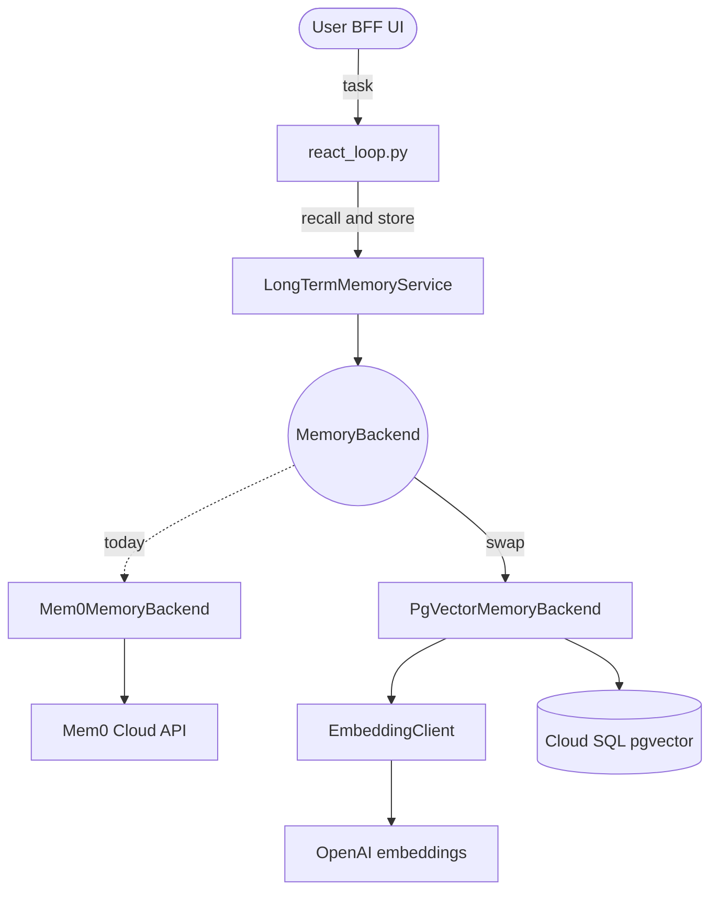

---

## 2. High-Level Architecture Comparison

The replacement happens entirely behind the existing `MemoryBackend` Protocol. The LangGraph orchestration layer (`react_loop.py`) and the `LongTermMemoryService` remain completely unchanged.

**Diagram — before / after at the swap point.** Green = unchanged; red = removed; blue = new.

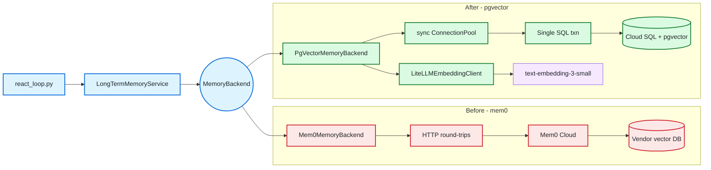

### Non-goals (hard scope guards)

- No edits to `orchestration/react_loop.py` for this backend swap.
- No new symbols under `trust/`.
- No `services/` import from `middleware/` (M1 remains enforced).
- No markdown/RAG/doc-ingestion behavior in runtime long-term memory paths.

---

## 3. Component Design & Layering

The new components must strictly adhere to the Four-Layer Architecture (`docs/Architectures/FOUR_LAYER_ARCHITECTURE.md`).

### 3.0. Layering decision matrix (authoritative)

| New/Changed Module | Layer | Allowed Dependencies | Forbidden Dependencies |
| :--- | :--- | :--- | :--- |
| `services/embedding/port.py` | Services (L2) | stdlib, typing | `middleware/*`, `orchestration/*` |
| `services/embedding/litellm_embedding_client.py` | Services (L2) | `litellm`, services-local modules | `middleware/*`, `langgraph`, `langchain` |
| `services/memory_backends/pgvector.py` | Services (L2) | `psycopg`, `psycopg_pool`, `services.embedding.*`, `services.long_term_memory` | `middleware/*`, `components/*`, `orchestration/*`, `agent_ui_adapter/*` |
| `middleware/composition.py` | Middleware ring | imports downward into `services/*` | upward imports to orchestration internals |

This matrix enforces the C1 correction from the plan: the embedding port lives in `services/`, not `middleware/ports/`.

**Diagram — four-layer placement.** Solid arrows = allowed imports (downward). Red dashed = forbidden (M1).

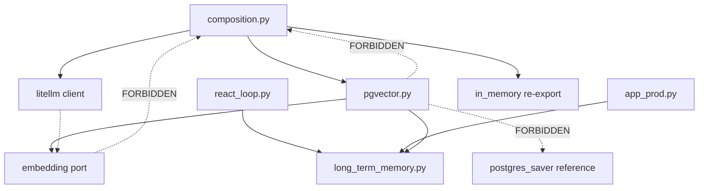

### 3.1. Embedding Client (services/embedding/)

We introduce a new horizontal service for embeddings. This avoids coupling the memory backend directly to an SDK.

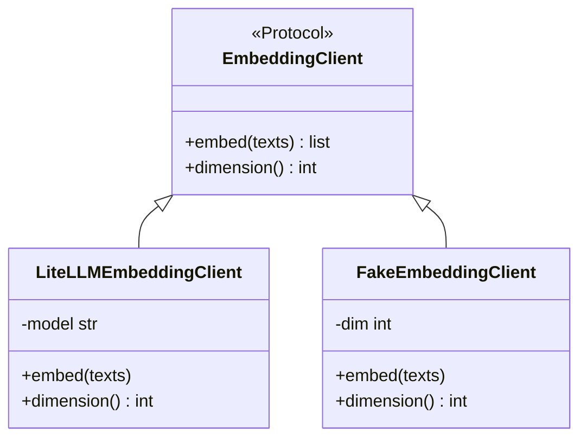

- **Placement:** `services/embedding/port.py` (NOT `middleware/ports/` to avoid M1 layering violations).
- **Implementation:** Uses `litellm.aembedding` (sanctioned exception in AGENTS.md rule 4).
- **Telemetry:** Emits a lightweight synchronous telemetry event (`target="embedding"`) for Phase 6 drift detection.

### 3.2. PgVector Memory Backend (services/memory_backends/)

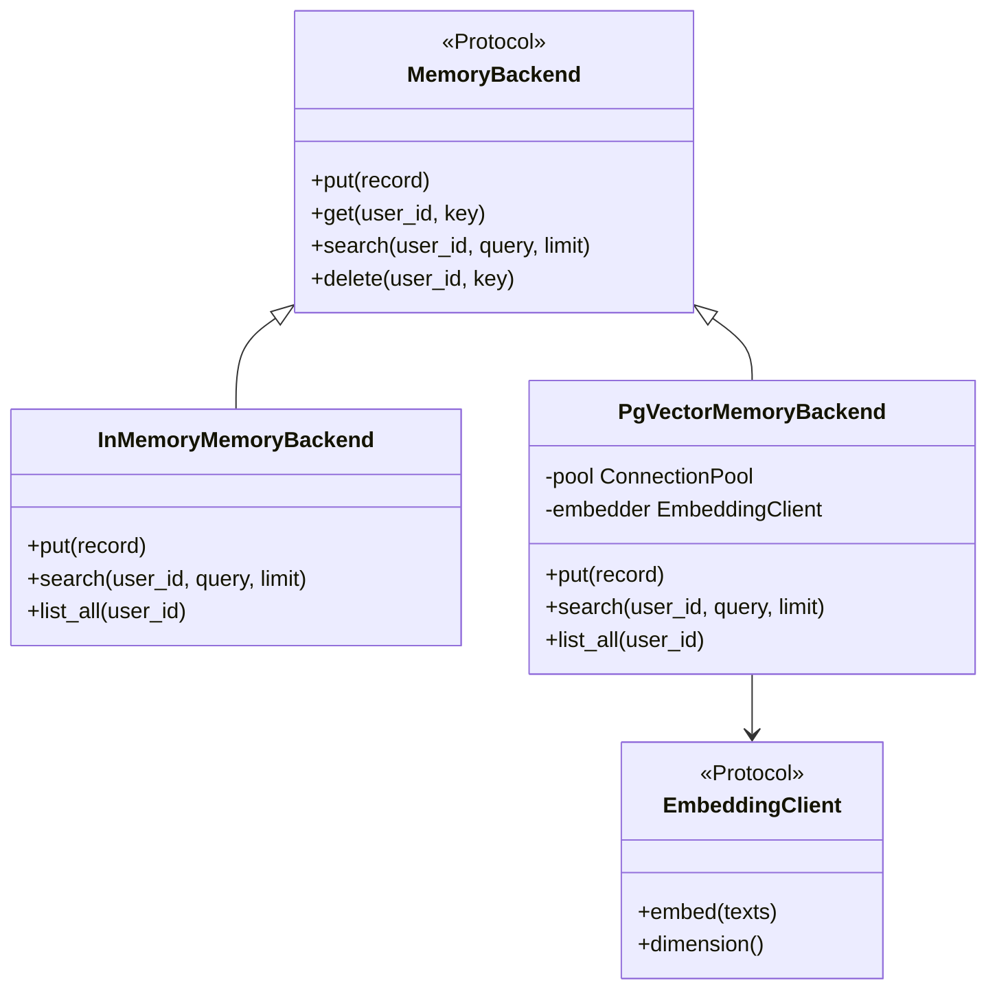

- **Protocol contract (verified `services/long_term_memory.py:76-80`):** the `MemoryBackend` Protocol declares exactly `put → None`, `get → MemoryRecord | None`, `search(..., limit=10) → list[MemoryRecord]`, `delete → bool`. `list_all(user_id)` is **NOT a Protocol method** — it is an optional capability (commented out at `:81-88`) that `LongTermMemoryService._list_all` detects via `hasattr` and otherwise emulates with an over-fetched empty-query `search`. `PgVectorMemoryBackend` SHOULD still implement `list_all` (both `InMemoryMemoryBackend` and `Mem0MemoryBackend` do) so consolidation/budgeting stays cheap and reliable, but conformance does not require it.
- **Connection:** Owns a small, dedicated synchronous `psycopg_pool.ConnectionPool` (`min_size=1, max_size=4`).
- **Dependency Injection:** The `EmbeddingClient` and `DATABASE_URL` are injected at the composition root (`middleware/composition.py`).
- **Existing backend landscape (`services/memory_backends/`):** `in_memory.py` (re-export), `mem0.py` (to be deleted Phase 5 S6), and `sqlite.py` (a dev/test durable backend using stdlib `sqlite3`). `PgVectorMemoryBackend` is added alongside; `sqlite.py` stays and is **not** in scope for deletion. Only `pgvector.py` introduces a `psycopg` import in this package — the architecture-test allowlist (`test_middleware_layer.py`) must permit `psycopg` there plus the existing checkpointer path, and `sqlite.py`'s stdlib import needs no allowance.

### 3.3. Shared DB consumer map and pool ownership

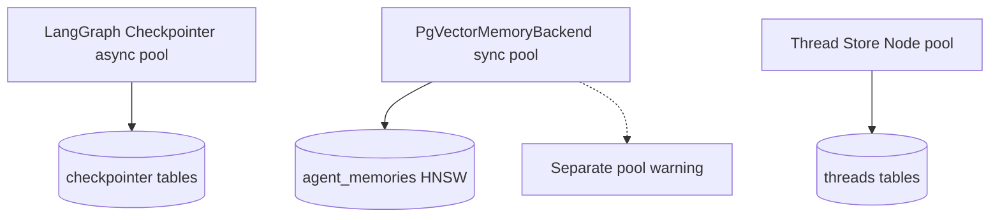

| Consumer | Driver | Pool Type | DSN Source | Ownership Decision |
| :--- | :--- | :--- | :--- | :--- |
| LangGraph checkpointer | `psycopg` | async | Python `DATABASE_URL` | existing |
| `PgVectorMemoryBackend` | `psycopg` | sync (`ConnectionPool`) | Python `DATABASE_URL` (or explicit memory DSN) | new, dedicated small pool |
| BFF thread store | Node `pg`/Drizzle | Node pool | BFF `DATABASE_URL` | existing |

We intentionally do not share the async checkpointer pool with the sync memory backend.

---

## 4. Data Model

The database schema is designed to perfectly round-trip the sync `MemoryRecord` type defined in `services/long_term_memory.py`.

### SQL Schema (`agent_memories`)

```sql
CREATE EXTENSION IF NOT EXISTS vector;

CREATE TABLE agent_memories (
  id            UUID PRIMARY KEY DEFAULT gen_random_uuid(),
  user_id       TEXT NOT NULL,
  key           TEXT NOT NULL,
  embedding     VECTOR(1536),
  payload       JSONB NOT NULL DEFAULT '{}'::jsonb,
  metadata      JSONB NOT NULL DEFAULT '{}'::jsonb,
  created_at    TIMESTAMPTZ NOT NULL DEFAULT now(),
  UNIQUE (user_id, key)
);

CREATE INDEX agent_memories_user_idx ON agent_memories (user_id);
CREATE INDEX agent_memories_embedding_idx 
  ON agent_memories USING hnsw (embedding vector_cosine_ops);
```

> **Forward-compatible superset (recommended for the S1 migration).** This schema
> is the faithful-swap minimum. The companion improvement design
> [`typed_memory_searchability.design.md`](typed_memory_searchability.design.md)
> §5 defines a **type-aware superset** of this table — adds a first-class
> `mem_type` column, `created_at`, a generated `tsvector`, and a
> `(user_id, mem_type)` index — that costs ~5 extra lines of DDL, keeps day-one
> runtime behavior byte-identical, and avoids a second live Cloud SQL migration
> when per-type retrieval lands. **Decision: fold §5's superset into the Phase 5
> S1 migration (one migration, not two).** The runtime in §5/§6 of this document
> is unchanged either way.

### Mapping to `MemoryRecord`

| SQL Column | `MemoryRecord` Field | Notes |
| :--- | :--- | :--- |
| `user_id` | `user_id` | Partition key |
| `key` | `key` | Unique identifier per user |
| `payload` | `payload` | Opaque dict. Contains `text` used for embedding. |
| `metadata` | `metadata` | Opaque dict. Contains `score`, `salience`, `suppressed`, etc. |
| `embedding` | *(computed)* | Generated via `EmbeddingClient` from `payload['text']` |

*Note: There is no standalone `content` column. The salient text rides inside the `payload` JSONB, matching the exact shape of the sync `MemoryRecord`.*

**Diagram — entity relationship and embedding source.**

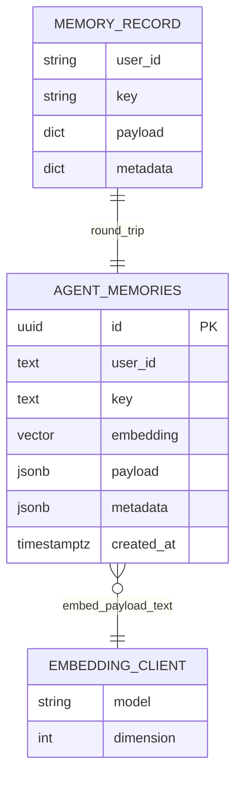

> **Mapping caveat.** `MemoryRecord` (`long_term_memory.py:49-53`) carries only `user_id`, `key`, `payload`, `metadata`. The `id`, `embedding`, and `created_at` columns are **DB-side only** — generated by Postgres / the backend, never present on the Pydantic record. `get`/`search` reconstruct a `MemoryRecord` from the row and drop those columns (search additionally writes the cosine score into `metadata`). So the relationship is a faithful round-trip of the four record fields, not a column-for-column identity.

**Diagram — row lifecycle (put → search round-trip).**


### Data invariants

- `payload` and `metadata` are stored and returned verbatim (no flattening, no coercion).
- User isolation is hard-enforced in every query predicate (`WHERE user_id = $...`).
- `search()` returns at most `limit`, ordered by nearest-neighbor cosine distance.
- The same `MemoryBackend` contract tests used for mem0 must pass unchanged against pgvector.

**Diagram — kNN search (per-user scoped).**

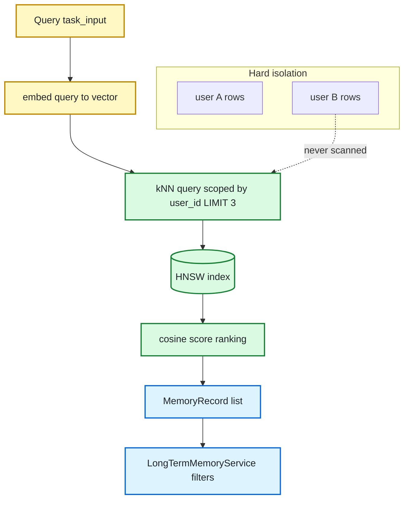

---

## 5. Composition & Wiring

The `middleware/composition.py` root is responsible for wiring the correct backend based on environment variables.

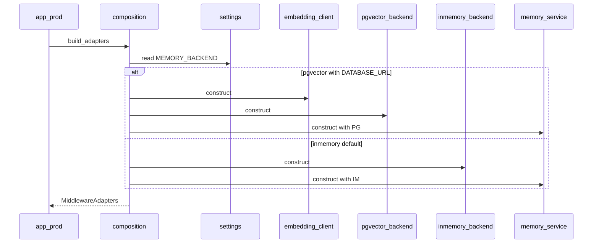

> **Ground-truth reconciliation (target vs current — verified `composition.py:829-839`).** The diagram above is the **target** wiring. Today `build_components` selects the backend by **presence of `settings.mem0_api_key`** (`Mem0MemoryBackend` if set, else `InMemoryMemoryBackend`) — there is no `MEMORY_BACKEND` setting yet. Phase 4 introduces `MEMORY_BACKEND` and must **replace** the `mem0_api_key` branch, not sit beside it. During the Phase 4→5 transition the selector is effectively three-way — `inmemory` (dev/test) · `mem0` (transitional rollback target, still present until Phase 5 S6) · `pgvector` (new default) — collapsing back to two once mem0 is deleted. The composition root remains the only place a concrete backend is named (rule C1), and `LongTermMemoryService` is always constructed so the graph shape is stable regardless of the flag.

### 5.1. Runtime read path (recall)

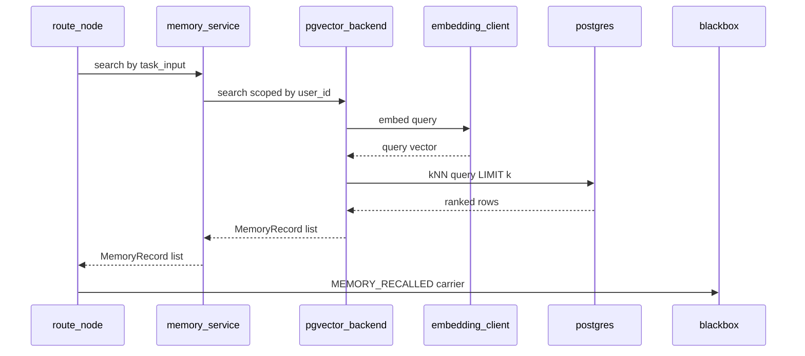

> **Note on method names (verified `react_loop.py:1093-1096`).** The graph performs top-K recall via `memory_service.search(user_id, task_input, limit)` wrapped in `asyncio.to_thread` inside `route_node` — the universal seam every tier passes through. The service's `recall(user_id, key)` is a **different** method (a single-record get by key) and is NOT the top-K path. Relevance flooring and rendering (`filter_recall_records`, `render_recall_block`) happen in the orchestration helper, not in the backend.

### 5.2. Runtime write path (store)

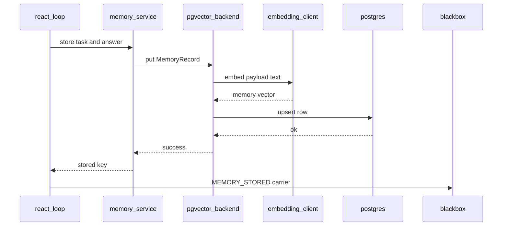

**Diagram — recall vs store on the hot path (one task).**

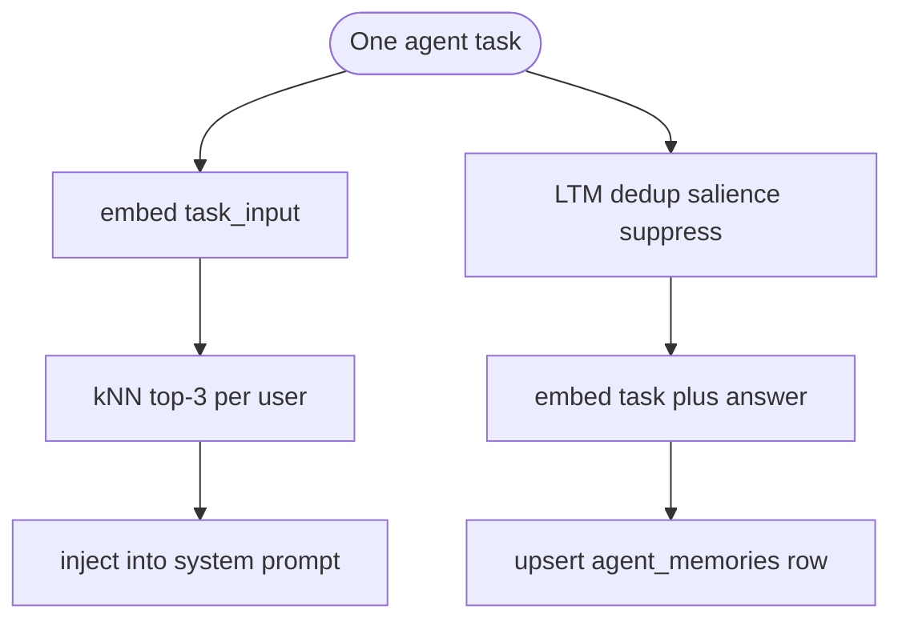

### 5.3. Async seam resolution (Phase 3 branching)

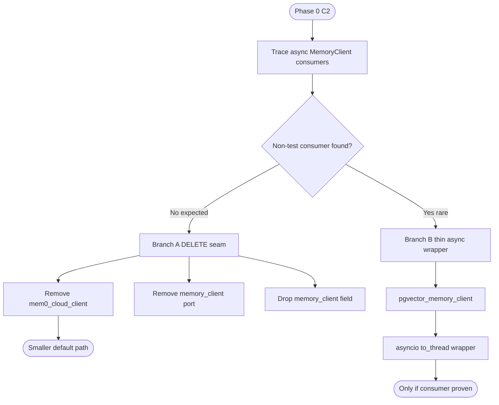

---

## 6. Phased Rollout Strategy

The implementation follows a strict, reversible sequence to ensure zero downtime and safe rollback capabilities.

**Diagram — GCP deployment topology at cutover.**

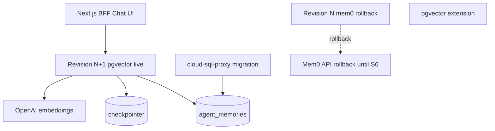

**Diagram — implementation phase timeline.**

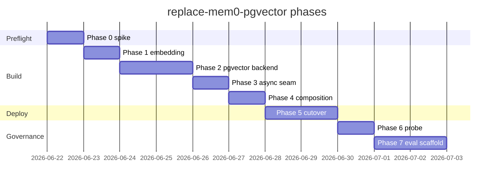

### Phase 5 Locked Rollback Sequence

1. **S1:** Apply SQL migration to Cloud SQL via `cloud-sql-proxy`. Apply the §4 *forward-compatible superset* (the `mem_type` / `created_at` / `tsvector` columns + `(user_id, mem_type)` index from [`typed_memory_searchability.design.md`](typed_memory_searchability.design.md) §5), not the bare table — one migration covers both the swap and future per-type retrieval.
2. **S2:** Deploy no-traffic Cloud Run revision (`MEMORY_BACKEND=pgvector`, `MEM0_API_KEY` still set).
3. **S3:** Smoke-test the no-traffic tag.
4. **S4:** Shift traffic to the pgvector revision. *(Instant rollback possible)*
5. **S5:** 24h soak period.
6. **S6:** Point of no return. Delete mem0 code -> Remove env vars -> Revoke API key.

### Rollout state model

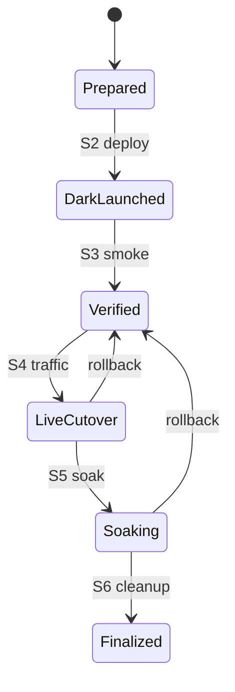

**Diagram — Phase 5 step sequence (S1–S6).**

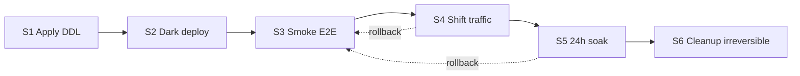

---

## 7. Telemetry & Governance (Phase 6 & 7)

The new architecture integrates deeply with our governance framework:

1. **Embedding Telemetry:** `LiteLLMEmbeddingClient` emits a lightweight sync event (`target="embedding"`) containing model, dimension, tokens, latency, and user_id.
2. **Recall/Store Carriers:** `react_loop.py` continues to emit `EventType.MEMORY_RECALLED` and `MEMORY_STORED` unchanged.
3. **L3 Drift Probe:** Consumes the embedding telemetry and recall carriers to detect degradation in index quality or embedding drift.
4. **Tier-A Eval Scaffold:** Generates `recall_traces.jsonl` by joining recall carriers, `eval_capture` task inputs, and read-only DB queries for human-led open coding and rubric generation.

### Governance telemetry dataflow

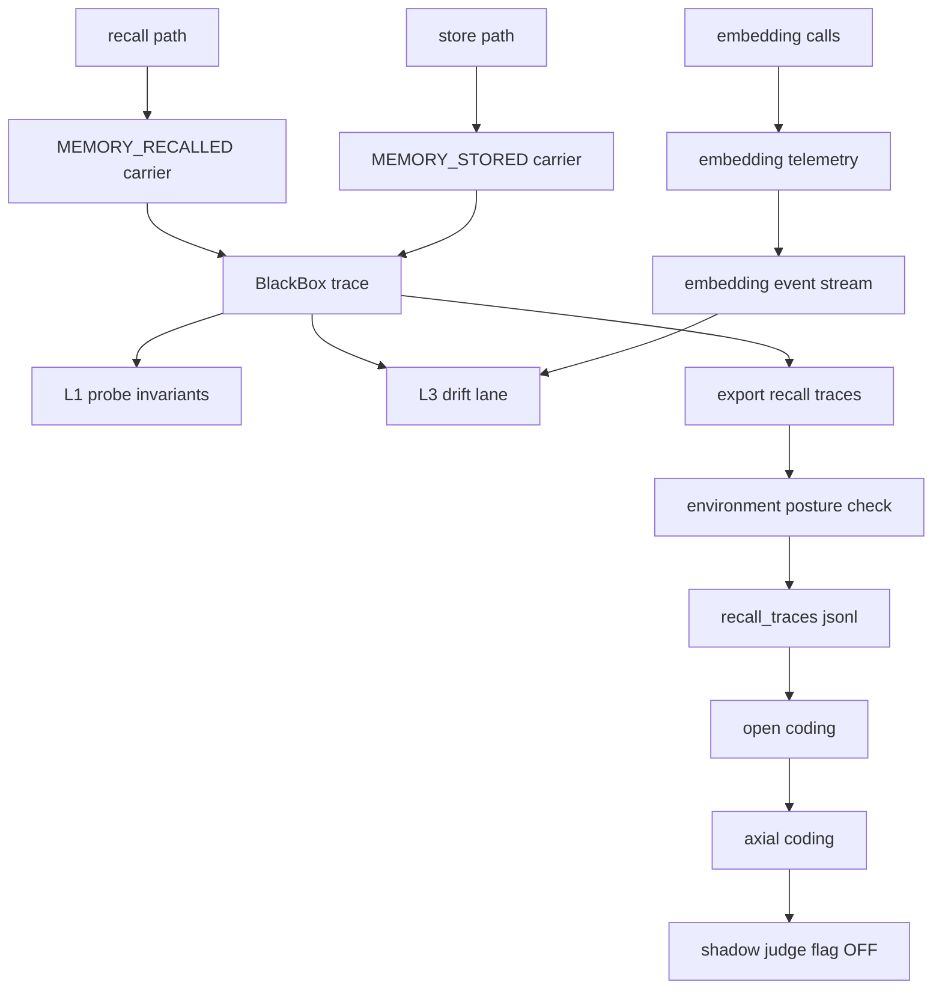

### Privacy and handling constraints

- Export artifacts containing recalled text are not log lines and must never flow through runtime logging sinks.
- Export scripts enforce user scoping (`memory_subject()` semantics) during joins.
- Sensitive eval exports should live in research paths with explicit handling discipline before any commit.

---

## 8. Failure Modes & Mitigations

**Diagram — test pyramid placement for this change.**

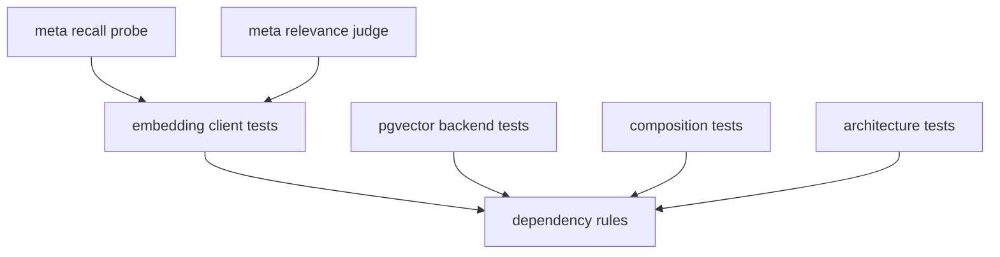

| Failure Mode | Detection Signal | Immediate Behavior | Mitigation |
| :--- | :--- | :--- | :--- |
| Missing `pgvector` extension | Phase 0 C3 SQL probe fails | Block Phase 1+ | Infra task (enable extension), then re-run gate |
| `MEMORY_BACKEND=pgvector` but no DSN | Composition-time check | Raise startup error (no silent fallback) | Fix env and redeploy |
| Embedding dimension mismatch | Backend contract tests + runtime assertion | Reject write/search with typed error | Keep `EMBEDDING_DIMENSION` aligned with model |
| Cross-user leakage regression | L2 failure-mode tests + probe invariants | Block release | Fix SQL predicates and re-run contract suite |
| Recall quality drift | L3 drift probe anomaly | Alert + investigate | Compare telemetry trends, rollback traffic if needed |
| Post-cutover instability | Soak window checks | Traffic rollback to previous revision | Use S4/S5 reversible window before S6 |

**Diagram — failure detection and response paths.**

```mermaid
flowchart LR
    D1[extension probe] --> A1[block phase 1]
    D2[DSN guard] --> A2[fail fast at boot]
    D3[contract tests] --> A3[reject release]
    D4[drift probe] --> A4[alert team]
    D5[soak monitors] --> A5[traffic rollback]
```

## 9. Implementation Readiness Checklist

- [ ] Phase 0 C1-C6 evidence recorded in `docs/plans/log.md`.
- [ ] Layering checks green with new services modules.
- [ ] Contract tests green for `PgVectorMemoryBackend`.
- [ ] Composition rejection path implemented (`pgvector` without DSN fails fast).
- [ ] No-traffic and soak rollout playbook validated.
- [ ] mem0 deletion and key revocation deferred until post-soak S6.
