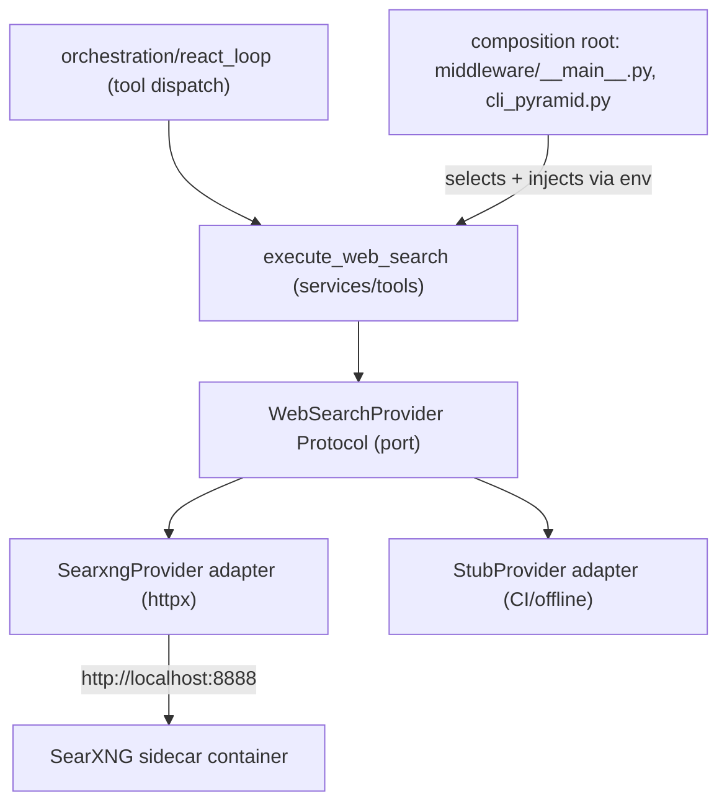

# Real SearXNG web_search (sidecar on GCP) + no-progress detection

Two coupled changes: (A) swap the stub for a real, provider-agnostic web search backed by SearXNG, deployed as a Cloud Run sidecar; (B) add no-progress detection so the agent no longer loops on a non-advancing tool (issue I1). Both partially reinforce each other: a real backend returns `ok=False` on failure, and the no-progress guard caps repeats regardless of backend.

## Architecture (four-layer / hexagonal alignment)

Port is a `typing.Protocol` (like `IdentityProvider`); adapters plug into it (like `utils/cloud_providers/`); the composition root injects the chosen adapter. The tool lives in the horizontal `services/` layer, which owns I/O (httpx) and stays framework-agnostic (no langgraph/langchain).

## Part A: Provider-agnostic web search

- New package `services/tools/search/`:
  - `port.py`: `class WebSearchProvider(Protocol)` with `search(query: str, *, max_results: int) -> list[SearchResult]`, plus a `SearchResult` Pydantic model (`title`, `url`, `snippet`).
  - `searxng.py`: `SearxngProvider(base_url, timeout, ...)` doing `GET {base_url}/search?q=...&format=json&categories=general`, mapping JSON `results[]` to `SearchResult`. Raises a typed error on HTTP/timeout/empty.
  - `stub.py`: existing canned behavior from [services/tools/web_search.py](services/tools/web_search.py) (CI/offline default).
- Refactor [services/tools/web_search.py](services/tools/web_search.py): replace the module-level `execute_web_search` with `build_web_search_executor(provider: WebSearchProvider)` returning the `(args) -> ToolExecutionResult` callable (mirrors `build_task_tool_executor`). It returns `ToolExecutionResult(ok=False, error=...)` on provider failure or zero results, so the loop treats a dead backend as terminal rather than retryable. Keep `WebSearchInput`; extend `WebSearchOutput` to carry real results.
- Composition roots select + inject the provider from env, defaulting to stub when unset (keeps CI network-free per `AGENTS.md`):
  - [middleware/__main__.py](middleware/__main__.py):316 and [StructuredReasoning/cli_pyramid.py](StructuredReasoning/cli_pyramid.py):52.
  - Selection: `WEB_SEARCH_PROVIDER` (`stub`|`searxng`, default `stub`) + `SEARXNG_URL`. Register `web_search` with `cacheable=True` (idempotent read; also fixes issue I3 duplicate dispatch).
- Reuses existing `httpx>=0.27` dependency ([pyproject.toml](pyproject.toml):20) - no new dependency, no `AGENTS.md` "ask first".
- Tests (L2 contract style): mocked `httpx` fixtures for SearxngProvider (success, empty, HTTP error, timeout), provider-selection test, stub-fallback test, and `cacheable=True` dedupe. Update [tests/services/test_tools.py](tests/services/test_tools.py) which currently imports `execute_web_search` directly.

## Part B: No-progress detection (issue I1)

- Add `no_progress_repeat_threshold: int = 3` to `AgentConfig` ([services/base_config.py](services/base_config.py):24).
- In [orchestration/react_loop.py](orchestration/react_loop.py) `_should_continue` (~:1131): compute a repeat signal from `state["tool_results"]` - count trailing entries with identical `(tool_name, normalized tool_input)` or identical `tool_output`. When it reaches the threshold:
  - Inject a one-time guidance `ToolMessage`/state flag instructing the model to stop calling tools and answer with what it has (so the next `call_llm` emits a FINAL ANSWER and the normal `done` path produces a synthesis instead of ending mid-tool).
  - Record a `TraceEvent` (e.g. STEP_PLANNED/details `no_progress=True`) for observability.
- In `check_continuation` ([components/evaluator.py](components/evaluator.py):103): add a `repeated_tool_calls: int = 0` param; return `"done"` when `repeated_tool_calls >= agent_config.no_progress_repeat_threshold` as a hard backstop (prevents infinite loops even if the model ignores the directive). This keeps the function pure and unit-testable.
- Tests: evaluator unit tests (repeat count >= threshold -> `done`; below -> `continue`), failure-path first per `AGENTS.md`; react_loop integration test where a repeating stub terminates within threshold and still yields a final answer.

## Part C: GCP sidecar deployment

- [infra/gcp/cloud-run-backend.tf](infra/gcp/cloud-run-backend.tf): add a second `containers {}` block to `backend_combined` for SearXNG:
  - Image mirrored into Artifact Registry (e.g. `${region}-docker.pkg.dev/${project}/.../searxng:pinned`), listening on `8888`, no `ports{}` (only the backend container holds ingress on 8080).
  - Add to the backend container: `env { WEB_SEARCH_PROVIDER = "searxng" }` and `env { SEARXNG_URL = "http://localhost:8888" }`.
  - Shares the service's enforced scale-to-zero (Tier A, [infra/gcp/variables.tf](infra/gcp/variables.tf):197) -> ~$0 idle; backend is 1 vCPU/2Gi so the added footprint fits.
- SearXNG config: `settings.yml` with `formats: [json]` enabled and the bot `limiter` disabled (private internal instance -> no Redis/Valkey, no extra cost). Bake into the mirrored image or mount via env.
- Mirror the image and wire it in the deploy flow ([scripts/deploy_gcp.sh](scripts/deploy_gcp.sh)).
- Local dev: a `docker-compose` snippet for a local SearXNG (port 8888) so `WEB_SEARCH_PROVIDER=searxng SEARXNG_URL=http://localhost:8888` works end-to-end; default stays stub.

## Validation
- `pytest tests/ -q` and `pytest tests/architecture/ -q` (confirm `services/tools/search/` keeps layer boundaries: no langgraph/langchain, no upward imports).
- Manual: run the Austin-weather task against a local SearXNG; confirm real results, `cached=True` on a repeat query, and that a forced-empty backend triggers no-progress termination within 3 repeats with a graceful final answer.

## Risks / notes
- Cloud Run multi-container cold start now includes SearXNG boot; acceptable under scale-to-zero, and Part B caps wasted calls.
- SearXNG depends on upstream engines that can rate-limit; `ok=False` + no-progress detection keep failures bounded.
- Out of scope (tracked separately in the issues register): I2 outcome semantics, I4 redaction, I5/I6 generation usage and span nesting.
