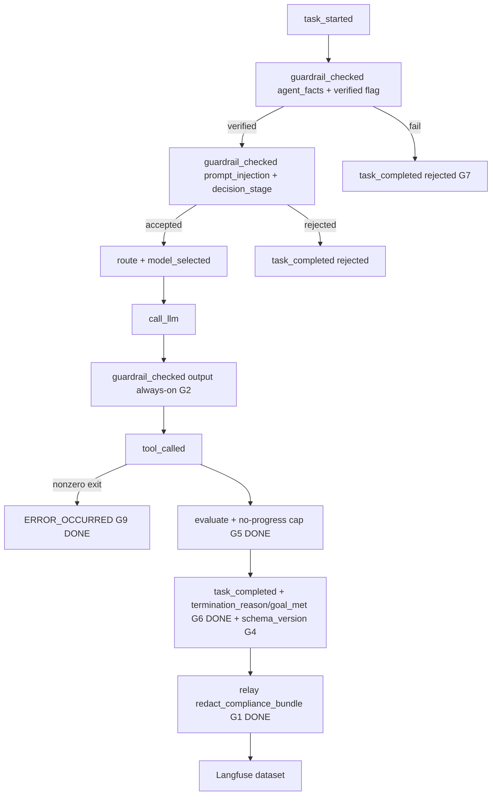

# Trace Dataset Gap Closure (G1-G9)

Scope confirmed: all code-fixable gaps G1-G9 (skip G10 docs), with negative-path test traces for G7/G8/G9 and an operational checklist for G1.

## Update 2026-06-01 - what the I9-I12 PR already landed

The PR `feat/telemetry-redaction-validation` (commit `2bf8bb4`) shipped the code for two of the G-items. Verified in the working tree:

- **G1-redact code: LANDED.** [middleware/sidecars/black_box_to_telemetry.py](../../middleware/sidecars/black_box_to_telemetry.py):224 applies `redact_details()` to `__output`; lines 309/322 apply `redact_compliance_bundle()` to both `create_dataset_item` calls. The cleartext-leak regression lives in [tests/middleware/test_telemetry_redaction.py](../../tests/middleware/test_telemetry_redaction.py) (plus e2e pipeline + publisher redaction tests).
- **G9-shell-error code: LANDED.** [services/tools/shell.py](../../services/tools/shell.py):71-89 returns `ok=False` on non-zero exit / timeout / exception; [orchestration/react_loop.py](../../orchestration/react_loop.py):273 emits `ERROR_OCCURRED` on `not execution_result.ok`.
- Out-of-band but landed (feed the validation step, not the G-items): I10 (CLI polls for `task.completed` instead of fixed 5s sleep) and I12 (`ni-4` probe expectation -> accept). See [Recipe 8](../recipes/guardrails/08_telemetry_redaction_validation_walkthrough.md).

Two original G1 code sub-asks did **not** land and are carried forward:

- The defense-in-depth guard inside [middleware/adapters/observability/langfuse_cloud_exporter.py](../../middleware/adapters/observability/langfuse_cloud_exporter.py) (no `redact` reference there today) -> tracked as **g1-residual**, low priority since the relay already redacts.
- The regression landed in `test_telemetry_redaction.py`, not the plan's originally-named `tests/middleware/sidecars/test_compliance_dataset.py`. No further action; coverage is equivalent.

## Update 2026-06-01 - what Recipes 10/11/12 + SearXNG already landed

Two more G-items shipped via the no-progress / outcome-correctness recipe family and the SearXNG real-backend work. Verified in the working tree:

- **G5 (loop / no-progress termination): LANDED.** Recipe 10's three-layer termination stack + Recipe 11 moved the heuristic into [components/evaluator.py](../../components/evaluator.py):62 (`count_trailing_repeats`); `check_continuation` (line ~194-208) takes `repeated_tool_calls` + `no_progress_directive_sent` and backstops at `agent_config.no_progress_repeat_threshold`. The SearXNG executor returns `ok=False` on provider failure/empty, so a dead backend terminates instead of being retried. The original #33 thrash (I1) is fixed.
- **G6 (corrupt-success / surface goal_met): root concern LANDED.** Recipe 11 added `termination_reason` + `goal_met` to `TaskOutcome`, treats `no_progress` as unclean (`success` -> `partial`), and emits both in `TASK_COMPLETED` details. Recipe 12 replaced the keyword-overlap `goal_met` with a real LLM `GoalJudge` overlay (flag-gated via `goal_judge_enabled`, off in CI; **never** gates `outcome`). Only the optional top-level `export_for_compliance` summary block remains.

Adjacent session-register issues also closed by Recipes 11/12 (not G-items, recorded for completeness): **I2** outcome correctness, **I6** real Langfuse span nesting + deterministic span ordering, **I8** at-least-once dedup, and the **I4/I5/I7** TDD backfill. See [Recipe 11](../recipes/11_outcome_correctness_tdd_hardening.md) and [Recipe 12](../recipes/12_eval_judge_span_order_and_dedup.md).

## Phase 0 - G1: residual + operational (the active leak)

Code wiring is done. What remains:

- **g1-residual (optional code):** have `LangfuseCloudExporter.create_dataset_item` in [middleware/adapters/observability/langfuse_cloud_exporter.py](../../middleware/adapters/observability/langfuse_cloud_exporter.py) call `redact_compliance_bundle` as an idempotent last-line guard. Belt-and-suspenders; the relay already redacts before this point.
- **g1-ops (operational, still outstanding):** the deployed relay shipped the raw `export_for_compliance()` bundle before the fix, so 4 items (#1/#4/#11/#17) leaked cleartext.
  - Purge the 4 leaked dataset items (PII workflow_ids `04a0091d7f8d4b8cae878ea67d6a1ef2`, `eea2e1f5d6a14d77a34d6324a15a59c7`, and the two other `My email...` items) from the `agent-compliance-audit` Langfuse dataset.
  - Rotate the exposed `sk-proj-...` key (treat as compromised even though it is a sample - format is valid).
  - Re-run the export and confirm `[REDACTED]` present, raw email/key absent (per [Recipe 8 Part 3/4](../recipes/guardrails/08_telemetry_redaction_validation_walkthrough.md)).

## Phase 1 - G2 + G3: Make guardrail rails observable and deterministic

G2 - output rail is invisible on pass. In [orchestration/react_loop.py](../../orchestration/react_loop.py) `call_llm_node` (currently emits `guardrail_checked` only on block/redact at lines 862-897), always emit an output `guardrail_checked` event with `{stage: "output", checked: true, blocked: bool, redacted: bool, failed_rules: [...]}` so a clean scan is provable.

G2/G3 - input decision rationale. [services/guardrails.py](../../services/guardrails.py) `InputGuardrail.is_acceptable` returns only `bool`; the `decision_stage` (`precheck:* / classifier:* / judge`) is logged but dropped.
- Add `InputGuardrail.decide(prompt) -> (accepted: bool, stage: str)`; keep `is_acceptable` as a thin wrapper.
- In `guard_input_node` ([orchestration/react_loop.py](../../orchestration/react_loop.py):504-516), call `decide()` and include `decision_stage` in the `prompt_injection` `guardrail_checked` event.

G3 - non-deterministic verdicts on identical benign prompts (S3/S5 accepted vs rejected; S6 flip-flops). Root cause: DEFER -> LLM judge with default temperature.
- Set the guardrail judge profile to `temperature=0` where the guard is constructed ([orchestration/react_loop.py](../../orchestration/react_loop.py):412-419, `default_fast_profile()`), and prefer the ONNX classifier when loaded (already wired via `InjectionClassifier.maybe_load()`).
- Add an L2 test asserting `precheck_input` deterministically ACCEPTs the frozen S3/S5 prompts from [scripts/probe_guardrail.py](../../scripts/probe_guardrail.py) and that S6 is DEFER (documented as classifier/judge-owned). This locks the "over-block fix" so regressions are caught.

## Phase 2 - G4: Version the bundle schema

Three `task_completed` shapes exist in one dataset (rich I2 / minimal / rejected) with no version stamp.
- Add `bundle_schema_version` (e.g. `"2"`) to the dict returned by `export()` / `export_for_compliance()` in [services/governance/black_box.py](../../services/governance/black_box.py):118-185.
- Add the same constant to the `task_completed` details in both the rich path ([orchestration/react_loop.py](../../orchestration/react_loop.py):1231-1243) and the rejected paths (guardrail/agent-facts/budget) so every terminal event self-identifies.
- Test in [tests/services/governance/test_black_box_export.py](../../tests/services/governance/test_black_box_export.py) asserting the field is present and stable.

## Phase 3 - G5: Harden loop / no-progress termination (LANDED)

DONE via Recipe 10/11 + SearXNG. #33 ran 84 events / 20 steps of near-duplicate `web_search` and only stopped on `max_steps`.
- `count_trailing_repeats` now lives in [components/evaluator.py](../../components/evaluator.py):62 (moved out of orchestration per AP-5); `check_continuation` consumes `repeated_tool_calls` + `no_progress_directive_sent` and backstops at `agent_config.no_progress_repeat_threshold` (line ~194-208).
- The SearXNG executor returns `ok=False` on provider failure/empty, so a non-progressing backend terminates instead of looping. Coverage: `tests/orchestration/test_no_progress.py`, evaluator tests.
- **Optional residual (low priority, largely moot with a real backend):** a cached-true-regardless-of-wording signal and a hard `max_tool_calls_per_task` cap. Only pursue if a future stub/cached path reintroduces wording-varied thrash that `count_trailing_repeats` misses.

## Phase 4 - G6: Surface goal_met as a first-class signal (LANDED)

DONE via Recipe 11/12 (root concern) + this phase (residual). The misleading `outcome=success` with `goal_met=False` reading is resolved at the data level:
- Recipe 11 added `termination_reason` + `goal_met` to `TaskOutcome`, downgrades `no_progress` to `partial`, and emits both in `TASK_COMPLETED` details.
- Recipe 12 overlays a real LLM `GoalJudge` verdict onto `goal_met`/`criteria_met`/`unmet_conditions` (flag-gated, never gates `outcome`).
- **Residual: LANDED.** `BlackBoxRecorder._summarize_outcome` ([services/governance/black_box.py](../../services/governance/black_box.py)) lifts `{outcome, goal_met, criteria_met, termination_reason, reason}` plus a `task_completed_present` flag from the (chronologically last) `task_completed` event into a flat top-level `bundle["summary"]`, added in `export_for_compliance()` only (the base `export()` wire shape is unchanged). The summary is **shape-stable**: fields a given terminal shape lacks (e.g. `goal_met` on a rejected/budget path) surface as `None` rather than being omitted, so consumers branch safely without knowing which of the rich / rejected / budget shapes applies. Coverage: `TestComplianceSummaryBlock` in [tests/services/governance/test_black_box_export.py](../../tests/services/governance/test_black_box_export.py) — failure paths first (no terminal event, rejected, budget) before the rich-lift, last-terminal-wins, and the base-export boundary assertion.

## Phase 5 - G7/G8: Exercise the gate-failure modes (LANDED)

Dataset had zero `ERROR_OCCURRED`, zero broken chains, zero failed verifications - the dangerous "gate that only ever accepts" pattern (TAP-4). G9 runtime was already done (shell `ok=False` -> `ERROR_OCCURRED`); this phase adds the synthetic-trace coverage so the gate-failure modes are exercised in CI.

These cannot be produced by a user prompt (you cannot prompt the agent to fail its own `AgentFacts` verification or corrupt its own hash chain), so they are modelled as **`kind="synthetic"` scenarios** recorded directly via `BlackBoxRecorder` and driven through the real relay. They are kept **out of** `ALL_SCENARIOS` / `SCENARIO_ORDER` (a new `NEGATIVE_SCENARIOS` / `NEGATIVE_SCENARIO_ORDER` registry) so the live BFF harness never tries to drive an undrivable trace.

- **G8 broken hash chain (S9): LANDED.** Records a valid 4-event chain, zeroes the integrity hash of the `step.executed` event, runs the relay -> routes to `agent-incident-replay`, `hash_chain_valid` score `0.0`, `broken_at_event_id` populated (== the corrupted event id). A "clean success" sitting on a broken chain is exactly the corrupt-success the gate must catch.
- **G7 failed AgentFacts verification (S7): LANDED.** Records `task_started` -> `guardrail_checked{guardrail:agent_facts, verified:false}` -> `task_completed{outcome:rejected, reason:agent_facts_verification_failed}` (the [orchestration/react_loop.py](../../orchestration/react_loop.py):484-502 shape). Chain is intact (score `1.0`, routes to audit), but the top-level `summary` block surfaces `outcome=rejected` so the gate's firing is provable.
- **G9 `retryable` (429, S10) + `tool_error` (S11) trace coverage: LANDED.** `ERROR_OCCURRED` present in the bundle + terminal `error_type` non-null (`retryable` / `tool_error`); the relay also exports `error.occurred` at `__bb_level=ERROR`.

Assertions added as **pure-bundle** helpers (zero live-Langfuse dependency, CI-safe) in [tests/synthetic/blackbox/langfuse_assertions.py](../../tests/synthetic/blackbox/langfuse_assertions.py): `assert_broken_chain_bundle`, `assert_rejected_outcome`, `assert_error_trace_present`, `assert_bundle_event_types`, `assert_dataset_routing`. Driven by section F (12 new tests, failure-paths-first, Pattern 11 failure-mode matrix) in [tests/middleware/sidecars/test_compliance_dataset.py](../../tests/middleware/sidecars/test_compliance_dataset.py).

## Phase 6 - Author the gap-closure recipes (intern-facing)

Once the remaining code gaps land, each gets a teaching recipe in the **same house style** as [`docs/recipes/guardrails/`](../recipes/guardrails/) and Recipes [11](../recipes/11_outcome_correctness_tdd_hardening.md)/[12](../recipes/12_eval_judge_span_order_and_dedup.md). These are written for AI engineer interns, so every recipe MUST keep the established 7-part shape (see [guardrails/00_overview.md](../recipes/guardrails/00_overview.md) "How to Read These Recipes"):

1. **"Before We Start: A Story"** - a concrete, slightly-uncomfortable narrative that motivates the fix (e.g. "the guard did their job perfectly and left no record that they were ever there").
2. **Numbered Lessons** - each tied to a real file/line, with before/after snippets.
3. **"Checkpoint question"** after each lesson - a small puzzle the intern answers, with the answer in italics.
4. **"Why not X?" sidebars** - name the rejected alternative and the anti-pattern it would create (cite the AGENTS.md TAP-/AP- codes).
5. **Mermaid diagrams** for the data/decision flow.
6. **"Run it yourself" / Verify** - copy-pasteable pytest + one-liner spot-checks.
7. **Status banner + "For a General Audience"** - test count, and 4-6 reusable, transferable patterns.

Authoring is the *last step of each implementation phase*, not a big-bang at the end - write the recipe while the code is fresh.

### Recipe A (after G2 + G3) - `docs/recipes/guardrails/09_rail_observability_and_determinism.md`

Continues the guardrails series (00-08). Working title: **"Proving the Guard Showed Up: Observable, Deterministic Rails."**

- Story hook: two failure shapes - the guard who passes everything cleanly but leaves no log entry (G2 clean-pass invisibility), and the guard who gives a different verdict each morning on the same visitor (G3 non-determinism).
- Lesson 1 (G2 output): always emit the output-stage `guardrail_checked` (clean/blocked/redacted), citing the before state at [orchestration/react_loop.py](../../orchestration/react_loop.py):862-897.
- Lesson 2 (G2 input rationale): `InputGuardrail.decide() -> (accepted, stage)` and threading `decision_stage` into the `prompt_injection` event; why a logged-but-dropped signal is invisible.
- Lesson 3 (G3 determinism): judge `temperature=0` + ONNX-classifier preference; the determinism test for S3/S5/S6. "Why not assert exact judge strings?" sidebar -> TAP-3 (determinism theater).
- Verify: the new determinism test + `probe_guardrail.py --example domain-s6` x3.

### Recipe B (after G4 + G7 + G8) - `docs/recipes/13_negative_path_traces_and_schema_versioning.md`

Continues the root telemetry/outcome series (11, 12). Working title: **"The Gate That Only Ever Says Yes."**

- Story hook: a compliance dataset that looks pristine - zero `ERROR_OCCURRED`, zero broken chains, zero rejected verifications - is not proof the gates work; it is proof they were never tested (TAP-4 gap blindness). A gate that only ever accepts is more dangerous than one that only ever rejects.
- Lesson 1 (G8): broken hash chain -> `agent-incident-replay`, `hash_chain_valid=0`, `broken_at_event_id` populated.
- Lesson 2 (G7): failed AgentFacts verification -> `task_completed.outcome="rejected"`, exercising [orchestration/react_loop.py](../../orchestration/react_loop.py):484-502.
- Lesson 3 (G9 trace coverage): `retryable` (429) + `tool_error` synthetic traces; `ERROR_OCCURRED` present, `error_type` non-null (runtime already landed, this proves it in the dataset).
- Lesson 4 (G4): `bundle_schema_version` so the three coexisting `task_completed` shapes self-identify; tie it to the Recipe 11 field additions that made versioning necessary.
- "Failure path before acceptance path" framing throughout (AP/TAP-4). Verify: the extended `tests/synthetic/blackbox/` suite + assertions.

### Index + numbering hygiene

- DONE: Cross-linked Recipe A from [guardrails/00_overview.md](../recipes/guardrails/00_overview.md) "What Comes Next" and Recipe B from the [session issues register](session_issues_register.plan.md) Notes.
- **DONE - resolved the root `12_` collision (suffix scheme).** The two files that shared the `12` prefix were a pair: [`12_eval_judge_span_order_and_dedup.md`](../recipes/12_eval_judge_span_order_and_dedup.md) (the implementation recipe) and its human-validation companion, now renamed [`12b_localhost_validation_walkthrough.md`](../recipes/12b_localhost_validation_walkthrough.md) (title bumped to "Recipe 12b").

  **Applied (suffix scheme - 1 `git mv`, keeps the pairing explicit, frees `13` for Recipe B):**

  | Current | New | Role |
  | --- | --- | --- |
  | `11_outcome_correctness_tdd_hardening.md` | unchanged | impl |
  | `12_eval_judge_span_order_and_dedup.md` | unchanged | impl (canonical Recipe 12) |
  | `12_localhost_validation_walkthrough.md` | `12b_localhost_validation_walkthrough.md` | validation companion of 12 |
  | (Recipe B) | `13_negative_path_traces_and_schema_versioning.md` | impl (authored) |

  `12b_` sorts lexicographically between `12_` and `13_` (`_` < `b` < `3`'s slot), so file ordering stays correct. The only inbound reference was this plan (now updated); the walkthrough's internal link points at the impl recipe, which was unaffected by the rename.

## Items requiring your sign-off (AGENTS.md "Ask first")

- `bundle_schema_version` constant placement (services/governance) - G4.
- Only if pursuing the G5 residual: `max_tool_calls_per_task` / cached-repeat threshold on `AgentConfig` (the primary `no_progress_repeat_threshold` already landed via Recipe 10/11).

## Validation (after each phase)

- `pytest tests/services/ tests/middleware/ tests/orchestration/ -q`
- `pytest tests/architecture/ -q` (layer boundaries must stay green)
- Manual: `python scripts/probe_guardrail.py --example domain-s6 --live-judge` x3 to confirm S6 stability post temp=0.
- G1-ops: re-run the deployed CLI per [Recipe 8 Part 3](../recipes/guardrails/08_telemetry_redaction_validation_walkthrough.md) and Ctrl+F the trace for the canonical secrets (`alice.smith@example.com`, `sk-proj-abc123...`) -> must be 0 matches.
- Regression guard for the already-landed G5/G6 (Recipe 11/12): `pytest -p no:logfire tests/components/test_evaluator.py tests/components/test_goal_judge.py tests/orchestration/test_no_progress.py tests/middleware/adapters/observability/test_langfuse_cloud_exporter.py -q` should stay green while editing the remaining G-items.

## Flow after fixes

