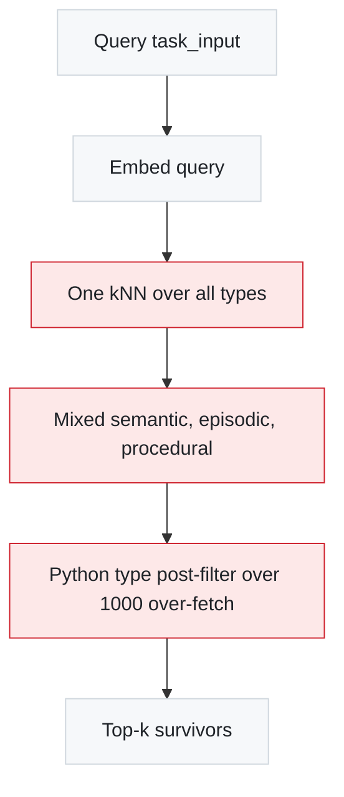
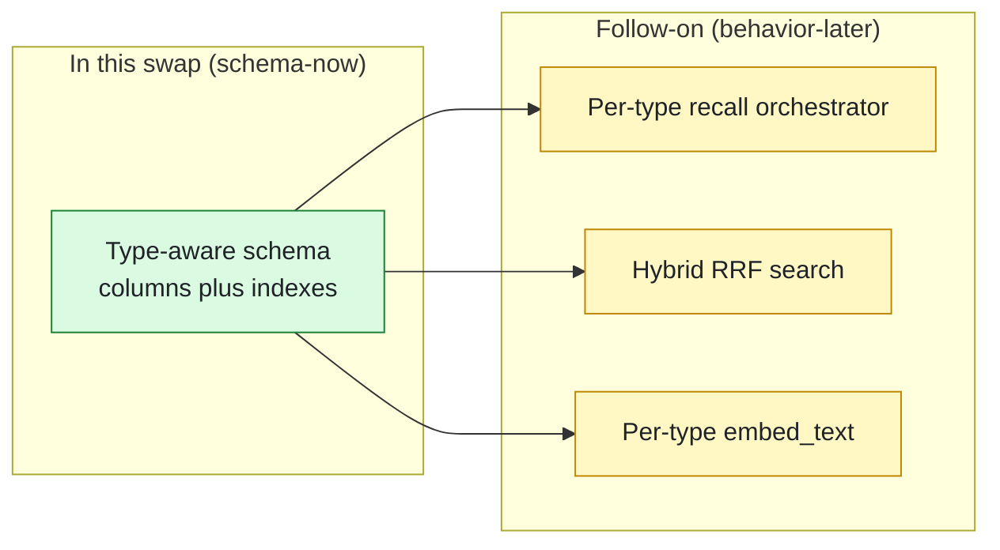
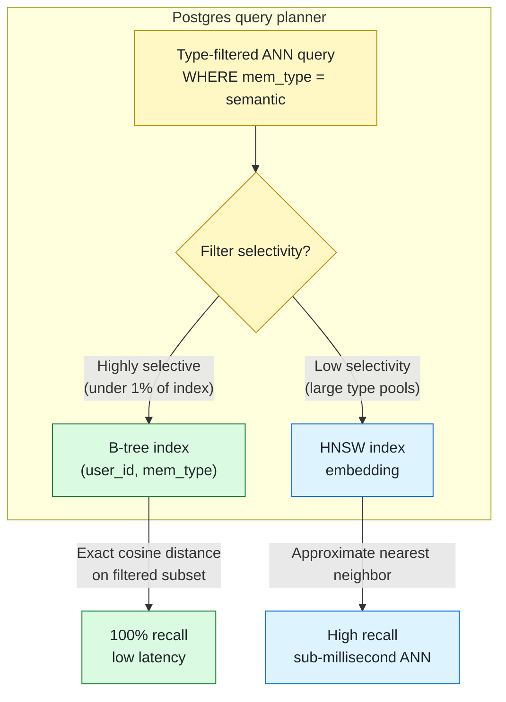
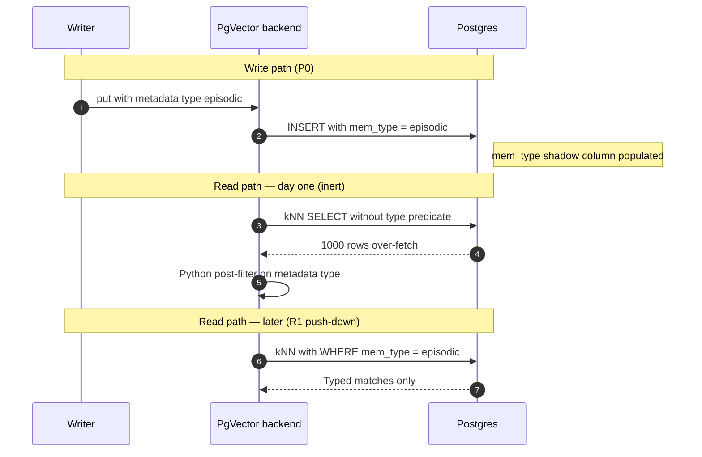
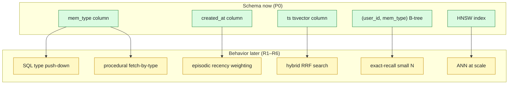
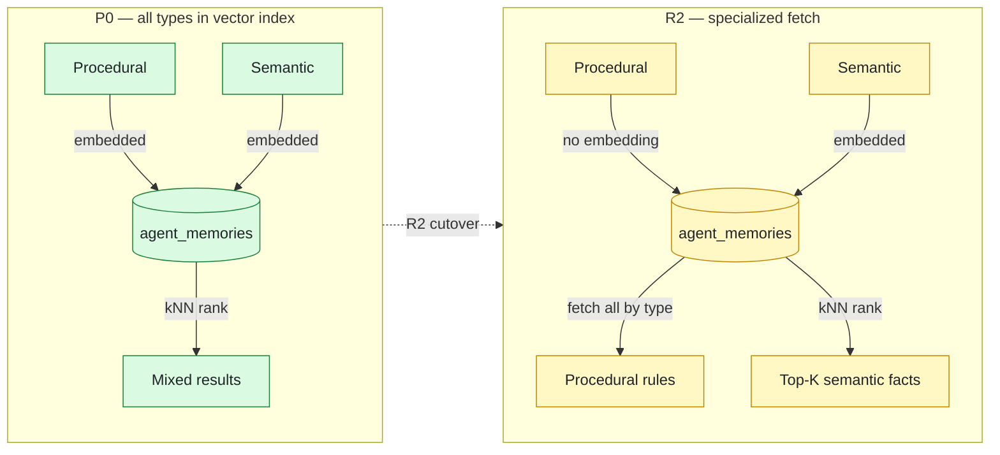
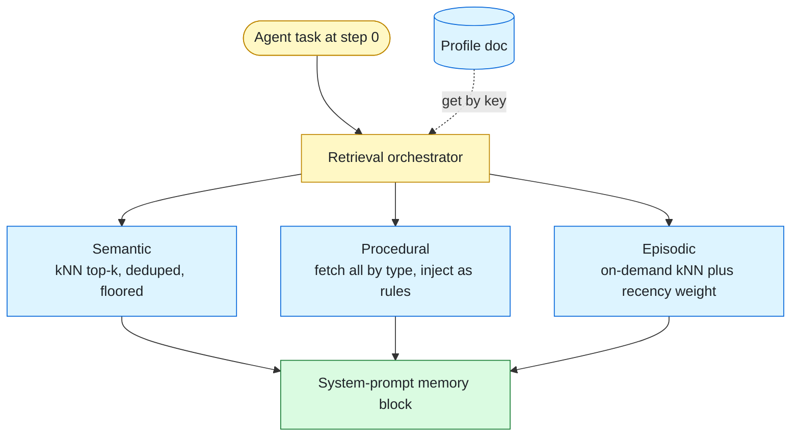
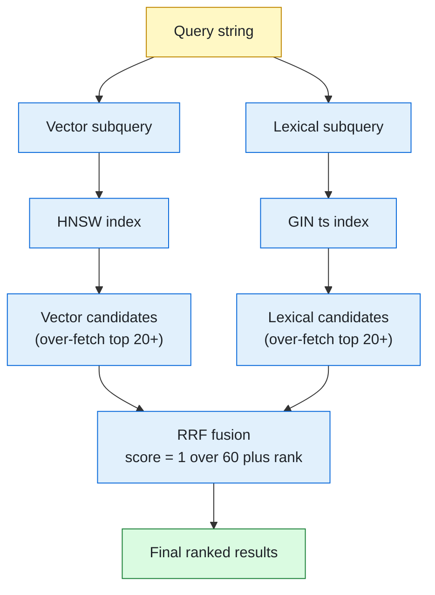

# Typed-Memory Searchability — Per-Type Retrieval Design

This document is an **improvement design layered on top of**
[`replace_mem0_pgvector.design.md`](replace_mem0_pgvector.design.md). That design
swaps mem0 for a first-party pgvector backend *faithfully* — one
`agent_memories` table, one embedding, one kNN per query. This document answers a
different question the team raised in design review:

> **How do we improve the searchability of the three memory types — semantic,
> episodic, procedural — instead of treating them as one undifferentiated vector
> bucket?**

It is grounded in
[`memory_and_chat_history_best_practices_2026.md`](../research/memory_and_chat_history_best_practices_2026.md)
plus a focused 2026 external-research pass (sources in §9).

### Section index

| # | Section |
| :--- | :--- |
| 1 | Problem statement (the searchability weakness) |
| 2 | What the 2026 research converges on |
| 3 | Governing principle: schema-now / behavior-later |
| 4 | Decision analysis (trade-offs per dimension) |
| 5 | Forward-compatible schema (the in-scope change) |
| 5.1 | Schema robustness & operational notes |
| 6 | Deferred per-type retrieval roadmap (the behavioral half) |
| 6.1 | Open design issues (surfaced in review) |
| 7 | Layering & non-goals |
| 8 | Phasing & readiness |
| 9 | Sources |
| 10 | Review validation log |

---

## 1. Problem statement

The pgvector design is deliberately a faithful, dumb swap: every record embeds
`payload['text']` the same way, lands in one HNSW cosine index, and is retrieved
by one kNN ranked solely on cosine distance. Three searchability weaknesses
follow directly from that shape.

**W1 — type is invisible to the index.** The memory `type`
(`semantic`/`episodic`/`procedural`) lives only inside `metadata` JSONB
(`services/memory_autocapture.py` writes `metadata={"type": ...}`). There is no
SQL predicate and no per-type index, so the database cannot do type-scoped ANN.

**W2 — typed search is a Python post-filter over a 1000-row over-fetch.** This is
the load-bearing detail. `LongTermMemoryService.search(..., mem_type=...)`
over-fetches `_OVERFETCH_LIMIT = 1000` then filters in Python:

```236:285:services/long_term_memory.py
    def search(
        self,
        user_id: str,
        query: str,
        limit: int = 10,
        *,
        mem_type: str | None = None,
    ) -> list[MemoryRecord]:
```

Over an in-memory dict that is harmless. Over an HNSW kNN it is pathological: you
ask the index for the 1000 nearest rows *regardless of type*, then discard the
off-type ones. A user with 950 episodic and 50 semantic rows can get almost
nothing useful back from a semantic query.

**W3 — one embedding recipe for three different retrieval intents.** Every record
embeds the same blob:

```226:238:components/memory_context.py
def build_store_payload(task_input: str, answer: str) -> dict[str, Any]:
    return {
        "task_input": task_input,
        "answer": answer,
        _TEXT_KEY: f"Task: {task_input}\nAnswer: {answer}",
    }
```

But the three types want to match on different things (§2): semantic on the
*fact*, episodic on the *situation*, procedural on *applicability* (and arguably
not via vectors at all).

**Diagram — the single-bucket weakness.**



---

## 2. What the 2026 research converges on

Five independent 2026 sources (§9) agree on a small, consistent set of findings.

**F1 — per-type stores, not one embedding bucket; and the named anti-pattern is
ours.** SurePrompts lists the #1 production mistake as *"collapsing episodic and
semantic into one big embedding store — recall stops being precise; facts get
buried under more numerous events."* The Agent Patterns Catalog
("Memory-Type Storage Specialization") and metacto both warn single-store
designs "over-fit one query pattern." W1–W3 above are exactly this shape.

**F2 — each type has a distinct retrieval pattern:**

| Type | Retrieval pattern (2026 consensus) | Storage emphasis |
| :--- | :--- | :--- |
| **Semantic** | similarity search, **deduplicated, high-signal**; a typed fact table "covers 50% of 'the agent should already know'" (metacto) — often does not even need vectors | profile doc + fact collection |
| **Episodic** | **append-only**, vector **+ recency/temporal weighting**, retrieved **on-demand** (not every turn) | `{observation, thoughts, action, result}` + timestamp |
| **Procedural** | retrieved **by task category, NOT semantic similarity**; versioned prompt rules / self-editing instructions (LangMem `create_prompt_optimizer`) | prompt scaffold |

**F3 — retrieval order:** *semantic-first, procedural-second, episodic-on-demand*
— "searching the event log every turn is expensive and noisy" (SurePrompts).

**F4 — hybrid storage is the production default, and pgvector is endorsed for it**
(metacto: "Postgres for semantic + procedural rules, a vector store — pgvector
counts — for episodic, plus a retrieval orchestrator that routes per type").

**F5 — temporal is the single biggest accuracy lever, but it is expensive.**
Zep/Graphiti's bi-temporal model (`valid_at`/`invalid_at`) buys +22 LongMemEval
points over Mem0 by marking superseded facts invalid instead of deleting — at the
cost of many LLM calls per write + contradiction resolution. This is the inverse
of our ADD-only v1 choice and is **deliberately deferred** (§4 decision D).

**F6 — pgvector filtered-search mechanics** (current is 0.8.2, Feb 2026): filtered
ANN **over-filters** ("asked for 10, got 3" — exactly the failure W2's over-fetch
fights). Mitigations: `hnsw.iterative_scan = relaxed_order` (95–99% quality,
`max_scan_tuples=20000` default), `strict_order` when ranking precision matters,
**partial HNSW indexes** for selective (<1%) filters, or **let the planner pick a
B-tree → 100% recall** when ANN is unnecessary. Hybrid = **RRF** (`1/(60+rank)`),
filter applied in *both* subqueries, `tsvector` generated column + GIN.

---

## 3. Governing principle: schema-now / behavior-later

The choice that organizes this entire design:

> **Schema is expensive to change later** — a live Cloud SQL DDL migration on a
> production table. **Runtime behavior is cheap to change later** — a code deploy.
> Therefore: invest in a type-aware *schema* during the swap, and defer every
> *behavioral* change (per-type recall composition, hybrid, temporal reasoning)
> until there is data to justify it.

This also keeps the swap's non-goals intact (no `react_loop` edits, no Protocol
change, no RAG — see §7): columns and indexes are not runtime behavior.



---

## 4. Decision analysis

Each decision states the options, the trade-off, and the chosen forward-compatible
position. Choices A–F are settled; D is explicitly the conservative one.

### Decision A — physical layout

| Option | Trade-off |
| :--- | :--- |
| **One table + `mem_type` column** ✅ | Logical per-type separation with one pool, uniform CRUD/governance/consolidation, and the unchanged `(user_id, key)` Protocol. Postgres partition-by-`mem_type` remains available later with no logical change. |
| Per-type tables | Physical separation but multiplies migrations and breaks the single-table round-trip in `replace_mem0_pgvector.design.md` §4. |
| Per-type backends behind the Protocol | Multiple pools + composition-root complexity; over-engineered for current scale. |

**Chosen: A.** Research wants *logical* per-type separation, not necessarily
separate tables.

### Decision B — filtered-ANN recall cliff

| Option | Trade-off |
| :--- | :--- |
| **Composite B-tree `(user_id, mem_type)` + `iterative_scan=relaxed_order`** ✅ | At expected sizes (tens–low-hundreds of rows/user/type) the filter is highly selective, so the planner can satisfy a type query by exact distance over the B-tree set — **100% recall, no ANN needed**. |
| Native table partitioning by `user_id` | The 2026 standard for multi-tenant vector scale. Prunes the search space to just one user's rows, bypassing the global HNSW filter penalty entirely. Overkill for v1, but the correct architectural scale-out path. |
| Partial per-type HNSW indexes | Cleanest for global type filters, but premature; add only if a specific type grows massive across all users. |
| Keep the 1000-row over-fetch only | Works but wastes index work and is the W2 weakness. |

**Chosen: B**, with native `user_id` partitioning held in reserve as the true scale-out path.

**Diagram — Filtered-ANN vs B-Tree fallback (pgvector 0.8+).**



### Decision C — procedural memory

| Option | Trade-off |
| :--- | :--- |
| **Keep rows for CRUD uniformity, retrieve `WHERE mem_type='procedural'` (all, small N), never kNN** ✅ | Matches unanimous research (by-category/always-on, not similarity). One-line query enabled by the `mem_type` column. Removes procedural rows from polluting the semantic/episodic cosine ranking. **Bonus (only once this lands, i.e. R2):** because procedural is then never vector-searched, the write path can skip the LLM embedding call entirely (saving tokens/latency). Not a P0 change — until R2, procedural is still kNN-ranked and must keep its embedding (see §5.1). |
| Vector rows ranked by cosine (today) | Wrong: a rule like "always show code first" should be always-on for that user, not retrieved only when semantically near the query. Wastes embedding tokens. |
| Graduate to a `create_prompt_optimizer` seam (`meta/` + reflexion critiques) | The right long-term home; not foreclosed by C, but out of scope now. |

**Chosen: C.**

### Decision D — temporal richness (the conservative one)

| Option | Trade-off |
| :--- | :--- |
| **`created_at` only** ✅ | Captures the cheap episodic recency-weighting win; consistent with ADD-only + periodic consolidation v1. |
| Reserve nullable `valid_at`/`invalid_at`/`superseded_by` now (unused) | Saves a future DDL, but adds dead columns and tempts premature use. |
| Full bi-temporal now | +22pts accuracy (F5) but LLM-heavy writes + contradiction resolution; conflicts with v1 and the swap scope. |

**Chosen: D = `created_at` only.** A future bi-temporal flip is a conscious,
data-justified decision that owns its own migration.

### Decision E — embedded text per type

| Option | Trade-off |
| :--- | :--- |
| **Backend embeds `payload.get('embed_text') or payload.get('text')`** ✅ | One fallback line future-proofs situation-vs-fact embedding (the cheap high-impact lever) without committing the extractor change now. |
| Keep the `Task:\nAnswer:` blob only | Actively wrong for episodic recall (the answer dilutes situation matching). |

**Chosen: E** (a backend fallback only; extractor change deferred to §6).

### Decision F — hybrid lexical + vector

| Option | Trade-off |
| :--- | :--- |
| **Add the generated `tsvector` column + GIN now; runtime stays vector-only** ✅ | Generated column is auto-maintained and free; flipping on RRF later needs zero migration. |
| Build RRF hybrid now | More query complexity + a text-relevance concept on the seam; defer until ANN-only recall is measured. |

**Chosen: F** (schema only).

---

## 5. Forward-compatible schema (the in-scope change)

This is the **only** change this design asks the pgvector swap to absorb: a
superset of `replace_mem0_pgvector.design.md` §4's DDL.

**Scope of "no behavior change" (precise claim).** Runtime behavior is identical
*at the `MemoryBackend` contract* on day one — `get`/`search` reconstruct the same
four-field `MemoryRecord`, and the same shared contract tests pass unchanged. Two
write-side additions are deliberately *inert* on day one and do not change any
observable result:

- `put` derives `mem_type` from `metadata['type']` and writes it to the new
  column. This column is **not read at runtime** (the Python type filter still
  reads `metadata['type']` — see the mapping note), so it changes nothing
  observable; it only pre-populates the data the future SQL push-down (R1) needs.
- `put` embeds `payload.get('embed_text') or payload.get('text')` instead of
  `payload['text']`. Because **no writer emits `embed_text` until R3**, the
  fallback always resolves to `text` on day one — embedding input is unchanged.

This is the one place the "schema-only" framing is slightly imprecise: there are
two *write-side* lines of new code in the backend, but both are observably inert
until a later lever activates them.

```sql
CREATE EXTENSION IF NOT EXISTS vector;  -- require pgvector >= 0.8.2 (CVE-2026-3172 fix)

CREATE TABLE agent_memories (
  id          UUID PRIMARY KEY DEFAULT gen_random_uuid(),
  user_id     TEXT NOT NULL,
  key         TEXT NOT NULL,
  mem_type    TEXT NOT NULL DEFAULT 'semantic',   -- D: promoted from metadata->>'type'
  embedding   VECTOR(1536),
  payload     JSONB NOT NULL DEFAULT '{}'::jsonb,
  metadata    JSONB NOT NULL DEFAULT '{}'::jsonb,
  created_at  TIMESTAMPTZ NOT NULL DEFAULT now(),  -- carried over from base design §4
  ts          tsvector GENERATED ALWAYS AS         -- hybrid lexical side (future), auto-maintained
              (to_tsvector('english', COALESCE(payload->>'text', ''))) STORED,  -- NULL-safe (H7)
  UNIQUE (user_id, key)
);

CREATE INDEX agent_memories_user_type_idx ON agent_memories (user_id, mem_type);
CREATE INDEX agent_memories_embedding_idx ON agent_memories USING hnsw (embedding vector_cosine_ops);
CREATE INDEX agent_memories_ts_idx        ON agent_memories USING gin (ts);
-- Add ONLY if profiling shows the filtered-ANN over-filter cliff for a high-volume type:
-- CREATE INDEX agent_memories_epi_hnsw ON agent_memories
--   USING hnsw (embedding vector_cosine_ops) WHERE mem_type = 'episodic';
```

**Column rationale.** Net-new in this design are **`mem_type`** and **`ts`**;
`created_at` is *carried over* from the base design §4 (listed for completeness,
not introduced here).

| Column | Net-new here? | Unlocks (deferred lever) | Day-one runtime cost |
| :--- | :--- | :--- | :--- |
| `mem_type TEXT` (first-class) | Yes | SQL-side type push-down (R1); per-type partial indexes; procedural fetch-by-type | None — write-derived, unread at runtime; recall still filters on `metadata['type']` |
| `ts tsvector` (generated) | Yes | Hybrid lexical+vector RRF (R4) without a future migration | None — generated, never read at runtime yet |
| `created_at TIMESTAMPTZ` | No (base §4) | Episodic recency/temporal weighting (R6) | None |

**Mapping note (source of truth — addresses review H2/H8).** `metadata['type']`
(written by `services/memory_autocapture.py`) is the **single source of truth**
for a record's type and round-trips verbatim inside the `metadata` JSONB column,
exactly as it already does for `mem0.py` and `sqlite.py`. The new `mem_type`
column is a **write-derived shadow** of `metadata['type']`, populated by `put`
solely so the *future* SQL push-down (R1) has an indexed predicate. Consequences:

- The existing Python type filter (`LongTermMemoryService.search(mem_type=...)`,
  `list_all(mem_type=...)`) keeps reading `metadata['type']` and is **unaffected**
  — it does not depend on the new column. The "faithful filter" claim holds.
- The four `MemoryRecord` fields still round-trip verbatim; `mem_type`,
  `created_at`, `ts`, `id` remain DB-side-only and are dropped on reconstruction.
- **Drift guard:** because `mem_type` is derived on every `put` from the same
  record's `metadata['type']` (defaulting to `'semantic'` when absent), the two
  values cannot diverge through the normal write path. The only divergence risk
  is a *direct SQL mutation* bypassing the backend; R1 must therefore treat
  `metadata['type']` as authoritative and may re-derive/repair `mem_type` rather
  than trust it blindly. No trigger/check-constraint is added in this swap (it
  would be dead weight while the column is unread), but R1 owns adding one if it
  begins to rely on the column.

**Diagram — Schema-now write path vs deferred read path.**



**Index & filtered-ANN strategy (Decision B).** At expected per-user/per-type
volumes the `(user_id, mem_type)` filter is highly selective, so the planner can
satisfy a type query by exact distance over the B-tree-selected set — 100%
recall, no ANN needed (pgvector 0.8 planner improvement). HNSW is scale
insurance. When a type grows large enough that filtered HNSW over-filters, the
mitigation order is: (1) `SET LOCAL hnsw.iterative_scan = 'relaxed_order'` **with
a strict `hnsw.max_scan_tuples` budget** (to prevent runaway latency on highly
selective filters), (2) `strict_order` if ranking precision matters, (3) native
table partitioning by `user_id` (the 2026 multi-tenant standard). None require a
migration except partitioning.

**Diagram — columns vs the levers they unlock (all deferred).**



### 5.1 Schema robustness & operational notes

Surfaced during design review; folded in so the P0 migration is correct the first
time (a live Cloud SQL DDL is the expensive thing to redo).

- **Embedding dimension is now a schema contract (H6).** `VECTOR(1536)` is bound
  to `text-embedding-3-small` (base design §3.1). Changing the embedding model
  later is a *second* migration (re-typing the column + a full re-embed
  backfill), not a config flip. This design does **not** widen scope to solve
  model-agnosticism, but flags it explicitly: the model choice and the column
  dimension must be changed together, and the dimension SHOULD be asserted at
  backend construction against `EmbeddingClient.dimension()` (base design already
  lists "embedding dimension mismatch" as a failure mode).
- **`tsvector` is NULL-safe (H7).** The generated expression wraps the payload
  text in `COALESCE(payload->>'text', '')` so a record whose payload lacks a
  `text` key (a CRUD-panel insert, a future non-`text` producer) yields an empty
  `tsvector` rather than NULL — harmless for the GIN index and for a future RRF
  query, and never raises on insert.
- **Refresh planner statistics after the migration (H9).** `mem_type` is a
  low-cardinality column (3 values); run `ANALYZE agent_memories` as the final
  migration step so the planner has distribution stats before the first
  type-scoped query (and so it can correctly choose the `(user_id, mem_type)`
  B-tree over HNSW for selective filters — Decision B). Added to the §8
  checklist.
- **Index build safety (pgvector ≥ 0.8.2).** Per the CVE-2026-3172 note, set
  `max_parallel_maintenance_workers = 0` for the `CREATE INDEX ... hnsw` build in
  the migration unless the deployed pgvector is patched, to avoid the parallel
  HNSW build issue.
- **Procedural embedding bypass (schema-now, behavior-LATER — gated on R2).**
  The `embedding` column is deliberately **nullable** (schema-now) so the
  optimization is *possible*. The optimization itself — having `put` skip the
  LLM embedding call when `mem_type == 'procedural'` — **must NOT ship at P0.**
  Validated against the live code: `PgVectorMemoryBackend.search` ranks `ORDER BY
  embedding <=> query` over *all* of a user's rows (the type filter is a Python
  post-step in `LongTermMemoryService.search`), so until R2 makes procedural a
  fetch-by-category path, a NULL-embedding procedural row sorts last and silently
  drops out of recall — a behavior change that would also fail the shared
  contract tests. **Bind the bypass to R2 (Decision C), which is exactly when
  procedural stops being kNN-ranked.**

**Diagram — Procedural embedding cutover (R2).**



- **Iterative scan runaway latency.** If `hnsw.iterative_scan` is enabled later,
  it MUST be paired with a sane `hnsw.max_scan_tuples` (e.g., 20000). Without a
  budget, a highly selective filter on a massive global HNSW index can cause the
  scan to traverse the entire graph, spiking latency.

---

## 6. Deferred per-type retrieval roadmap (the behavioral half)

These are **out of scope for the pgvector swap** (they touch the recall
composition and/or the Protocol — see §7) but are the payoff the §5 schema
enables. Captured here so the follow-on plan inherits a clear target.

**Diagram — target per-type retrieval (F2 + F3).**



**R1 — SQL type push-down (Protocol extension).** Add an optional `mem_type` (and
later recency/hybrid) parameter to `MemoryBackend.search`, replacing the W2
over-fetch with `WHERE user_id=$1 AND mem_type=$2 ORDER BY embedding <=> $3`.
*Additive only* so the base design's "contract tests pass unchanged" invariant
holds. **Gate: "Ask first"** per AGENTS.md (a service-contract change).

**R2 — per-type retrieval budget (recall composition).** Replace the single
`search(task_input, limit=3)` with an orchestrator that allocates per type:
profile via deterministic `get(user_id, "profile")`; semantic top-2 with the A2
floor; episodic top-1 recency-weighted; procedural all-by-type as rules
(Decision C). Implements F3's semantic-first / procedural-second /
episodic-on-demand order. Touches `components/memory_context.py` + `route_node`.

**R3 — per-type embedding.** The extractor/autocapture write path sets
`payload['embed_text']` to the *situation* for episodic items (not Task+Answer);
the backend already prefers it (Decision E). High quality-per-effort.

**R4 — hybrid RRF.** Two subqueries (HNSW + `tsvector @@`), filter in both, fuse
with RRF (`1/(60+rank)`). *Crucial 2026 detail:* each subquery MUST over-fetch
candidates **before** fusion — start at 20/side (F6) and tune up toward 50–60/side
if recall measurement shows the right answer landing just outside the per-side
window; fusing only the top-`k` of each side collapses recall. Flip on once
ANN-only recall is measured.

**Diagram — target hybrid RRF architecture (R4).**



**R5 — semantic dedup/merge at consolidation.** Today `consolidate` dedups on
exact normalized text only:

```415:425:services/long_term_memory.py
    def consolidate(
        self, user_id: str, mem_type: str, *, budget: int
    ) -> ConsolidationOutcome:
```

With embeddings in Postgres, consolidation can do *semantic* dedup/merge (the
research's make-or-break detail: ~0.9 dedup / ~0.85 LLM-merge) — the v1.5 seam
already foreshadowed in that method's docstring. Improves searchability
indirectly by cutting near-duplicate/contradictory noise.

**R6 — temporal headroom.** Recency-weight episodic ranking via `created_at`
(no new schema). Bi-temporal (`valid_at`/`invalid_at`) remains a conscious future
decision (Decision D, F5).

| Lever | Touches | Gate |
| :--- | :--- | :--- |
| R1 push-down | `MemoryBackend` Protocol, pgvector backend | Ask-first (contract change) |
| R2 budget orchestrator | `components/memory_context.py`, `route_node` | Follow-on plan (non-goal of swap) |
| R3 embed_text | extractor/autocapture write path | Follow-on plan |
| R4 hybrid RRF | pgvector backend query | Follow-on (schema ready in §5) |
| R5 semantic consolidation | `LongTermMemoryService.consolidate` | Follow-on (v1.5) |
| R6 recency / bi-temporal | ranking expression / future DDL | Recency follow-on; bi-temporal a separate decision |

### 6.1 Open design issues (surfaced in review)

These are genuine gaps the follow-on plans must resolve. They are **not** blockers
for the P0 schema (none require a different §5 migration), but each per-type lever
in §6 inherits the obligation noted here.

- **O1 — Per-type key stability / namespacing (review H5).** `UNIQUE(user_id,
  key)` makes `put` an upsert. The extractor proposes `key="profile"` for semantic
  (so semantic *intentionally* overwrites — that is the evolving-profile design)
  and a "short task-derived key" for episodic. Episodic is **append-only by
  intent** (research F2), so a reused/derived key (e.g. a retried `task_id`)
  would silently overwrite a prior episode — wrong for an event log. **Resolution
  for R2/R3:** episodic keys must be globally unique per event (e.g.
  `episodic:{task_id}:{uuid}` or include `created_at`), and the extractor prompt
  must be tightened to guarantee episodic-key uniqueness. The `key` namespace is
  not constrained by the §5 schema, so this is purely a write-path decision.
- **O2 — "Profile" today is a single record, not a profile *doc* (nuance behind
  review H4/H12).** The `"profile"` key exists and has a writer (the extractor,
  per `prompts/memory_extractor.j2`), but it stores one distilled sentence that
  each run overwrites — not the research's consolidated multi-fact latest-state
  document. The §6 "profile doc" target is therefore itself a deferred lever: R5
  (semantic consolidation) is what would grow `"profile"` into a real doc, or the
  semantic *collection* (open-ended facts under per-item keys) carries the rest.
  No schema change needed; flagged so the R2 diagram is not read as "already
  built".
- **O3 — Procedural rules vs the consolidation budget (review H10).** Decision C
  injects *all* procedural rows as rules, but `LongTermMemoryService.store`
  enforces a per-type budget for **every** writer via `_consolidate_on_overflow`.
  If a positive `procedural` budget is configured, consolidation can **evict an
  always-on rule** — a correctness conflict. **Resolution:** procedural must
  either be exempt from budget eviction, or rely on the §6 safety-floor pinning
  (P2 #8) with procedural salience kept at/above the floor. The follow-on plan
  must pick one explicitly; until then, leave `procedural` budget unset (0 = no
  cap, today's behavior).
- **O4 — Safety floor is global, not per-type (review H11).** `safety_floor` is a
  single scalar across all types, so a medical/safety semantic fact and a
  procedural rule share one pinning threshold. A per-type floor (or O3's
  procedural exemption) is the cleaner model. Out of scope for the swap (it is
  existing `LongTermMemoryService` behavior); noted for the R2/R5 plan.
- **O5 — Suppressed records and non-kNN retrieval (review H18).** The recall path
  excludes soft-suppressed records via `exclude_suppressed`
  (`components/memory_context.py`). The new non-kNN paths in §6 — procedural
  fetch-all-by-type (Decision C) and the deterministic `get(user_id, "profile")`
  — must apply the **same** suppression filter, or a rejected rule/profile fact
  would re-enter the prompt through a path that bypasses `exclude_suppressed`.
  R2 owns wiring suppression into every per-type retrieval branch, not just the
  semantic kNN one.

---

## 7. Layering & non-goals

The §5 change lives entirely in `services/memory_backends/pgvector.py` + its
migration — Services layer (L2), per the base design's layering matrix. It adds
no new symbols to `trust/`, no `services/`→`middleware/` import, and no
component/orchestration edits.

**Non-goals (inherited from `replace_mem0_pgvector.design.md` §2, reaffirmed):**

- No edits to `orchestration/react_loop.py` in this swap (R2 is a follow-on).
- No `MemoryBackend` Protocol change in this swap (R1 is Ask-first follow-on).
- No markdown/RAG/doc-ingestion behavior in runtime memory paths.
- No bi-temporal columns reserved (Decision D).

---

## 8. Phasing & readiness

| Phase | Scope | In this swap? |
| :--- | :--- | :--- |
| **P0 — schema** | §5 columns + indexes — implemented in **Phase 4.5** of `replace_mem0_pgvector.plan.md` (edits the `DDL` constant + two inert `put` lines), applied by the Phase 5 S1 migration | **Yes — scheduled (Phase 4.5)** |
| **P1 — push-down** | R1 (optional `mem_type` in `search`) | Ask-first; can ride the same swap if approved |
| **P2 — typed recall** | R2 + R3 (orchestrator + embed_text) | No — follow-on plan |
| **P3 — quality** | R4 hybrid, R5 semantic consolidation, R6 recency | No — v1.5/v2 |

**Readiness checklist (P0, the only in-scope phase):**

- [ ] §5 DDL merged into the base design's Phase 5 S1 migration (one migration, not two).
- [ ] Migration ends with `ANALYZE agent_memories` so the planner has `mem_type` stats (§5.1, H9).
- [ ] `CREATE INDEX ... hnsw` build guarded for pgvector < patched (`max_parallel_maintenance_workers = 0`) per CVE-2026-3172 (§5.1).
- [ ] pgvector backend `put` writes `mem_type` from `metadata['type']` (default `'semantic'`); column is write-derived and unread (mapping note).
- [ ] pgvector backend embeds `payload.get('embed_text') or payload.get('text')` (Decision E) — verified **inert** day one (no producer emits `embed_text` until R3).
- [ ] pgvector backend **still embeds every type, including procedural**, at P0 — the procedural embedding bypass is deferred to R2 (see §5.1 / Decision C), because today's runtime kNN-ranks across all types and a NULL-embedding procedural row would silently drop out of recall.
- [ ] Backend asserts `EmbeddingClient.dimension()` matches `VECTOR(1536)` at construction (§5.1, H6).
- [ ] Contract tests (shared with mem0/in-memory) pass unchanged — schema additions are transparent to the `MemoryRecord` round-trip.
- [ ] Architecture tests still green (no new forbidden imports; migration adds no upward import).

---

## 9. Sources

External research pass (2026):

- SurePrompts — *Episodic vs Semantic Memory for AI Agents (2026)* (the named one-bucket anti-pattern; semantic-first/procedural-second/episodic-on-demand).
- metacto — *AI Agent Memory: Production Architecture Guide* (hybrid storage default; pgvector for episodic; typed fact table covers 50%).
- Agent Patterns Catalog — *Memory-Type Storage Specialization* (per-type access patterns).
- jobsbyculture — *AI Agent Memory Systems: A 2026 Engineering Guide* (per-type TTL/forgetting; recency-weighted episodic).
- Agents' Codex — *Hybrid Episodic-Semantic Systems for Production* (decay/consolidation as first-class).
- pgvector 0.8.0 release notes + AWS Aurora pgvector 0.8.0 guide + dbi-services / thebuild (iterative scans, filtered-ANN cliff, 0.8.2/CVE-2026-3172).
- rivestack / thebuild — *Hybrid Search with pgvector and Postgres FTS* (RRF, tsvector generated column, both-subquery filtering).
- Zep/Graphiti — arXiv:2501.13956 (bi-temporal model; +22pt temporal lever — deferred per Decision D).
- LangMem — Conceptual Guide + SDK launch (procedural = `create_prompt_optimizer`; semantic/episodic background managers).

Internal companion:
[`memory_and_chat_history_best_practices_2026.md`](../research/memory_and_chat_history_best_practices_2026.md).

---

## 10. Review validation log

A critical review (2026-06-22) proposed 18 candidate holes (H1–H18). Each was
validated against the live code (`services/long_term_memory.py`,
`services/memory_backends/{mem0,sqlite}.py`, `components/memory_context.py`,
`components/memory_extractor.py`, `services/memory_autocapture.py`,
`prompts/memory_extractor.j2`, `orchestration/react_loop.py`). Verdicts:

| ID | Claim | Verdict | Disposition |
| :--- | :--- | :--- | :--- |
| H1/H17 | `put` has new write-side behavior vs "byte-identical" claim | **Valid (precision)** | §5 reframed: contract-identical; both write-side additions inert day one |
| H2 | Read-side reconstruction breaks the typed filter | **Invalid** | `type` round-trips in `metadata` JSONB (like mem0/sqlite); filter unaffected. Clarified in mapping note |
| H3 | Missing Protocol method for fetch-all-by-type | **Invalid** | `LongTermMemoryService.list_all(mem_type=...)` already exists |
| H4 | Magic `"profile"` key invented | **Invalid** | Defined in `prompts/memory_extractor.j2`; nuance captured as O2 |
| H5 | Episodic key reuse overwrites events | **Valid** | Resolution O1 (episodic key uniqueness) |
| H6 | Hardcoded `VECTOR(1536)`, no model-migration path | **Valid** | §5.1 dimension-contract note + construction-time assertion |
| H7 | Generated `tsvector` not NULL-safe | **Valid** | DDL wrapped in `COALESCE(...,'')` |
| H8 | No consistency guard on `mem_type` denormalization | **Valid (as clarification)** | Mapping note: `metadata['type']` authoritative, derived-on-write, R1 owns any constraint |
| H9 | No `ANALYZE` / planner stats after migration | **Valid** | Added to §5.1 + checklist |
| H10 | Procedural rules can be evicted by the budget | **Valid** | Resolution O3 (exempt or pin) |
| H11 | Safety floor is global, not per-type | **Valid** | Noted O4 (follow-on) |
| H12 | Profile doc has no writer | **Invalid** | Writer is the extractor; doc-vs-record nuance is O2 |
| H13 | R2 contradicts the no-`react_loop` non-goal | **Invalid** | §7 scopes non-goal to "in this swap"; R2 is an explicit follow-on |
| H14 | Dual-backend transition breaks typed search | **Invalid** | Cutover uses one backend; filter works on both via `metadata['type']` |
| H15 | Architecture-test allowlist for migration missing | **Folded** | Covered by base design's `psycopg` allowlist + existing checklist item |
| H16 | `created_at` mislabeled as a new addition | **Valid** | Column table now marks it "carried over (base §4)" |
| H18 | Suppressed flag ignored by non-kNN retrieval | **Valid** | Resolution O5 (apply `exclude_suppressed` to every branch) |

Net: 9 valid (fixed in §5/§5.1/§6.1/§8), 1 precision fix (H1/H17), 1 folded
(H15), 6 invalid (documented above so they are not re-raised).

### 10.1 Second round — external-research gaps (G1–G4)

A second pass (2026-06-22) added four gaps from a fresh external-research review
(pgvector 0.8/0.9 filtered-ANN mechanics, multi-tenant scale-out, hybrid-RRF
sizing, agentic memory architectures — §9 sources). Each was then **re-validated
against the live `services/memory_backends/pgvector.py` + `long_term_memory.py`**
to confirm it is real *and correctly scoped* (not just plausible from the
literature):

| ID | Claim | Verdict | Disposition |
| :--- | :--- | :--- | :--- |
| G1 | Procedural rows waste an embedding call (retrieved by category, not kNN) | **Valid concept, originally MIS-SCOPED** | Confirmed `put` always embeds and `search` kNN-ranks across *all* types (type filter is a Python post-step). Bypassing at P0 would NULL-embed procedural rows → they sort last and drop out of recall, breaking day-one-inert + contract tests. **Corrected:** bypass moved out of the P0 checklist and bound to R2 (Decision C / §5.1); only the column being nullable is schema-now. |
| G2 | `iterative_scan` needs a `max_scan_tuples` budget or latency runs away | **Valid, correctly deferred** | Confirmed by pgvector docs (default 20000). Already a *conditional* mitigation under Decision B (only if the filtered-ANN cliff appears); no P0 change. |
| G3 | Native `user_id` partitioning is the 2026 multi-tenant scale-out path, above partial per-type HNSW | **Valid, correctly reserved** | Held in reserve in Decision B; flagged as the one mitigation that *does* need a migration (partition key must join the unique constraint), so not a zero-cost flip. |
| G4 | Hybrid RRF must over-fetch per side before fusion | **Valid; fixed an internal inconsistency** | Principle confirmed (rivestack/wolf-tech/Tiger). Initial edit hard-coded `LIMIT 60`, contradicting F6's "start at 20/side"; reconciled to "20/side, tune to 50–60". Deferred (R4). |

Net second round: 4 valid; G1 required a real correction (P0 → R2 re-scope), G4
a consistency fix, G2/G3 confirmed already-correct deferral/reserve scoping.
