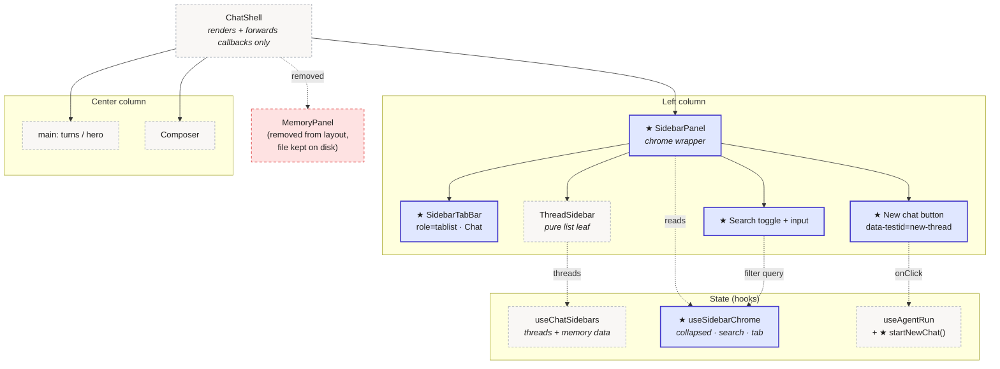
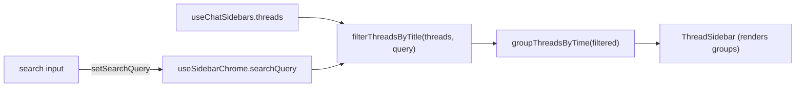
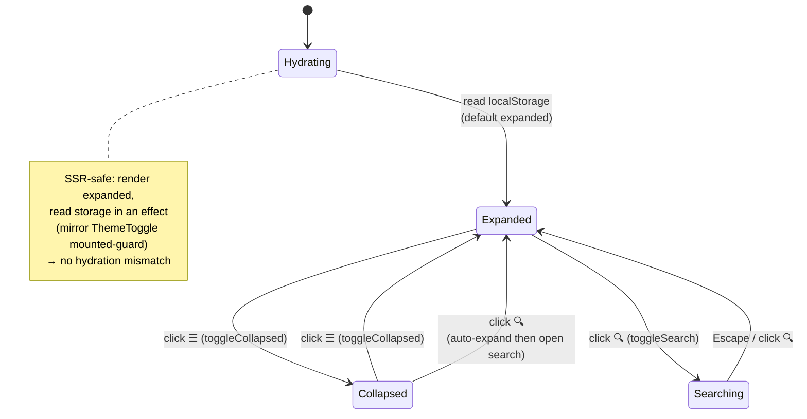
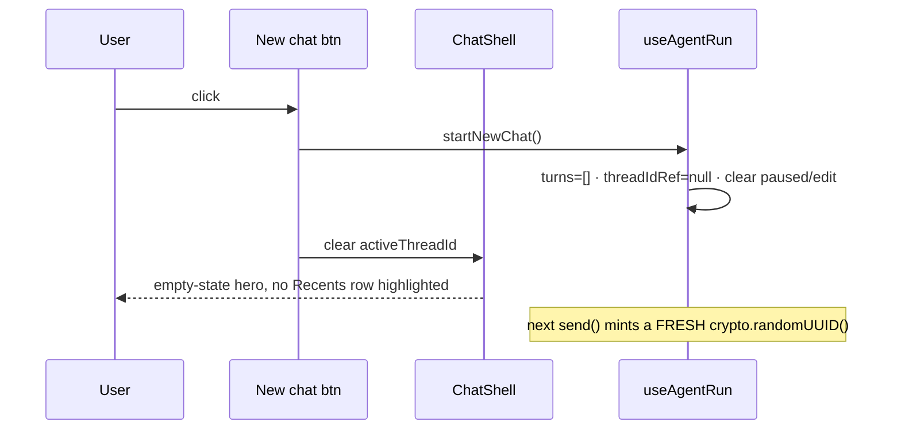
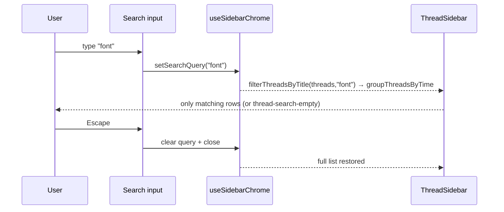

# UI — Left Panel Refresh & Right Panel Removal: Visual Design

> **Status.** Design document — companion to
> [`ui_left_panel_refresh.plan.md`](ui_left_panel_refresh.plan.md) (*what and why*).
> The plan answers *what and why*; this doc answers *how it looks and behaves* —
> visual layouts, component tree, state machines, the collapse animation spec,
> and the deterministic `data-testid` surface the Playwright suite asserts on.
> This document changes no source.
>
> **Date:** 2026-06-19. **Reads with:** the plan (phase/§-numbers refer to it),
> the live shell ([`frontend/app/chat-shell.tsx`](../../frontend/app/chat-shell.tsx)),
> [`STYLE_GUIDE_FRONTEND.md`](../STYLE_GUIDE_FRONTEND.md) (tokens/typography), and
> [`STYLE_GUIDE_LAYERING.md`](../STYLE_GUIDE_LAYERING.md) (the F-R1 dumb-leaf rule
> the new components obey).
>
> **Constraint echoed from the plan.** Colors come only from the `globals.css`
> `@theme` tokens (`--color-bg/-fg/-muted/-accent/-border…`). No new dependency,
> no icon library — inline SVG / unicode glyphs as today (`✎ ✕ ✓ ☰ +`).

---

## Table of contents

- [1. Before → After (whole-screen)](#1-before--after-whole-screen)
- [2. Left panel anatomy (expanded)](#2-left-panel-anatomy-expanded)
- [3. Three panel states (expanded / collapsed / searching)](#3-three-panel-states-expanded--collapsed--searching)
- [4. Component tree & ownership](#4-component-tree--ownership)
- [5. Collapse state machine + animation spec](#5-collapse-state-machine--animation-spec)
- [6. Interaction sequences](#6-interaction-sequences)
- [7. Responsive behavior](#7-responsive-behavior)
- [8. Design tokens used](#8-design-tokens-used)
- [9. `data-testid` map (the test contract)](#9-data-testid-map-the-test-contract)
- [10. Accessibility annotations](#10-accessibility-annotations)

---

## 1. Before → After (whole-screen)

**BEFORE** — three columns, right "What I remember" panel present.

```
┌────────────────────────────────────────────────────────────────────────────┐
│  ReAct Agent                         rajnish.khatri@gmail.com  [Dark] Sign out│  header
├──────────────────┬───────────────────────────────────┬───────────────────────┤
│ No conversations │                                   │ What I remember  ☐ off │
│ yet.             │      What can I help you with?     │                       │
│                  │   Send a message to start a convo │ Nothing remembered yet.│
│   (left rail —   │                                   │                       │
│    list only,    │                                   │ ┌───────────────────┐ │
│    no chrome)    │                                   │ │ Add something…    │ │
│                  │                                   │ └───────────────────┘ │
│                  │   ┌─────────────────────┐ [Send]  │ [Facts about you ▾]   │
│                  │   │ Send a message…     │         │            Remember   │
└──────────────────┴───────────────────────────────────┴───────────────────────┘
   grid-cols:  [auto         1fr                          auto                 ]
```

**AFTER** — two columns, left rail becomes a navigation panel, chat widens.

```
┌────────────────────────────────────────────────────────────────────────────┐
│  ReAct Agent                         rajnish.khatri@gmail.com  [Dark] Sign out│  header
├──────────────────────┬─────────────────────────────────────────────────────┤
│ ☰  ┌──────┐          │                                                      │
│    │ Chat │  ◂ tab   │                                                      │
│    └──────┘          │                                                      │
│ ┌──────────────────┐ │           What can I help you with?                  │
│ │ +  New chat      │ │      Send a message to start a conversation.         │
│ └──────────────────┘ │                                                      │
│ 🔍 Search            │              (chat column now wider —                │
│                      │               right panel removed)                   │
│ RECENTS              │                                                      │
│  Today               │                                                      │
│   • Devi Laal's …    │                                                      │
│   • Claude Pro Max … │   ┌────────────────────────────────────┐  [ Send ]   │
│  Yesterday           │   │ Send a message… (⌘↵ for newline)   │             │
│   • Font identifica… │   └────────────────────────────────────┘             │
└──────────────────────┴─────────────────────────────────────────────────────┘
   grid-cols:  [auto                    1fr                                   ]
```

Net visual deltas: right column gone; left column gains a `☰` collapse toggle,
a tab bar (Chat), a **+ New chat** button, a **🔍 Search** affordance, and a
**RECENTS** heading above the existing time-grouped list.

---

## 2. Left panel anatomy (expanded)

```
 SidebarPanel  (w-64, the chrome wrapper — owns the new affordances)
 ┌────────────────────────────────────┐
 │ ☰   role=tablist                    │  ← row 1: collapse toggle + TabBar
 │     ┌──────┐                        │     sidebar-toggle · SidebarTabBar
 │     │ Chat │ aria-selected=true     │
 │     └──────┘                        │
 ├────────────────────────────────────┤
 │ ┌────────────────────────────────┐ │  ← row 2: New chat (full-width button)
 │ │  +  New chat                   │ │     data-testid="new-thread"
 │ └────────────────────────────────┘ │
 ├────────────────────────────────────┤
 │ 🔍 Search          (toggle)         │  ← row 3: search toggle…
 │ ┌────────────────────────────────┐ │     …reveals input when open
 │ │ Search conversations…          │ │     sidebar-search-input
 │ └────────────────────────────────┘ │
 ├────────────────────────────────────┤
 │ RECENTS                             │  ← row 4: ThreadSidebar (UNCHANGED leaf)
 │  Today                              │     grouped by groupThreadsByTime
 │   • Thread title…        ✎  ✕       │     per-row rename/delete on hover
 │  Yesterday                          │
 │   • Thread title…                   │
 │  Previous 7 days                    │
 │   • …                               │
 └────────────────────────────────────┘
```

`ThreadSidebar` is reused **as-is** for the list (the pure leaf); rows 1–3 are
the new chrome added by `SidebarPanel`. "RECENTS" is the existing group
container — the only change there is the optional `thread-search-empty` variant.

---

## 3. Three panel states (expanded / collapsed / searching)

```
   EXPANDED (default, w-64)        COLLAPSED (w-12)         SEARCHING (w-64)
 ┌────────────────────┐         ┌────┐                  ┌────────────────────┐
 │ ☰  [Chat]          │         │ ☰  │  ← toggle only   │ ☰  [Chat]          │
 │ + New chat         │         │ +  │  ← mini new-chat │ + New chat         │
 │ 🔍 Search          │         │ 🔍 │  (icons only,    │ 🔍 ┌──────────────┐│
 │ RECENTS            │         │    │   labels hidden, │    │ "font"       ││ ← query
 │  • Thread one      │         │    │   aria-hidden    │    └──────────────┘│
 │  • Thread two      │         │    │   content)       │ RECENTS            │
 │  • Thread three    │         │    │                  │  • Font identifica…│ ← filtered
 └────────────────────┘         └────┘                  └────────────────────┘
   aria-expanded=true            aria-expanded=false       (filter is client-side
                                                            over loaded threads)
```

State transitions are driven by `useSidebarChrome` (plan §D6). `collapsed`
persists to `localStorage["sidebar:collapsed"]`; `searchOpen` + `searchQuery`
are session-local; `Escape` in the input closes + clears search.

A no-match query shows a distinct empty state (separate from the cold
"No conversations yet."):

```
 RECENTS
  ┌──────────────────────────────┐
  │ No conversations match.      │   data-testid="thread-search-empty"
  └──────────────────────────────┘
```

---

## 4. Component tree & ownership

Solid = new in this plan (★). Dashed = existing, reused unchanged.
Ownership of state is annotated — the F-R1 rule (plan §D6, STYLE_GUIDE_LAYERING):
hooks own lifecycle, leaves are dumb.



Data flow for search (client-side, no new BFF route):



---

## 5. Collapse state machine + animation spec



**Animation (plan §Phase 1).** Animate the panel's own **width**, not the grid
template (cross-browser-unreliable). The collapsed column is a thin rail.

```
 Property        Expanded     Collapsed    Transition
 ───────────     ─────────    ─────────    ─────────────────────────────────
 panel width     w-64 (16rem) w-12 (3rem)  transition-[width] 200ms ease-out
 label opacity   1            0            transition-opacity 150ms ease-out
 toggle glyph    ☰            ☰            (rotates 0°↔90° optional, decorative)
 content         visible      aria-hidden  pointer-events-none when collapsed
```

Reduced-motion: every transitioning element carries
`motion-reduce:transition-none` so the panel snaps instead of sliding when
`prefers-reduced-motion: reduce` is set. The width values map to Tailwind
`w-64` / `w-12`; the wrapper is `overflow-hidden` so labels clip cleanly as the
rail narrows.

---

## 6. Interaction sequences

**New chat** (client reset — no BFF POST, plan §D3):



**Search filter** (client-side over already-loaded threads, plan §D2):



---

## 7. Responsive behavior

The shell already collapses side panels under `lg` (`hidden lg:grid`). That
stays: below the `lg` breakpoint the left panel is hidden and the chat column is
full-width. The collapse toggle is an **`lg`-and-up** affordance — small screens
get the chat directly. (A future mobile drawer is out of scope, plan §8.)

```
  ≥ lg (desktop)                      < lg (mobile/tablet)
 ┌──────────┬───────────────┐        ┌───────────────────────┐
 │ panel ☰  │   chat 1fr     │        │      chat (full)      │
 │ (auto)   │                │        │  (left panel hidden)  │
 └──────────┴───────────────┘        └───────────────────────┘
```

---

## 8. Design tokens used

All from `globals.css` `@theme` — no new values introduced.

| Element | Token(s) |
|---------|----------|
| Panel background | `--color-bg` |
| Panel right border | `--color-border-light` |
| New-chat / search buttons | text `--color-fg`, hover `--color-accent`, border `--color-border` |
| Active tab underline / New-chat accent | `--color-accent`, `--color-accent-light` |
| RECENTS heading, search placeholder | `--color-muted`, `--text-xs` uppercase tracking-wide (matches existing group headers) |
| Active thread row | `bg-accent-light` (already used) |
| Radii | `--radius-sm` (buttons/rows), `--radius-md` (search input) |

Dark mode inherits automatically via the existing `[data-theme="dark"]` token
overrides — no per-component dark styling needed.

---

## 9. `data-testid` map (the test contract)

The deterministic hooks the Playwright suite (plan §7) asserts on. Bold = new.

| testid | Element | Used by |
|--------|---------|---------|
| `thread-sidebar` | the list `<nav>` (existing) | thread-sidebar.spec |
| **`sidebar-panel`** | chrome wrapper root | SidebarPanel.test, collapse spec |
| **`sidebar-toggle`** | ☰ collapse button (`aria-expanded`) | collapse spec |
| **`sidebar-tab-chat`** | Chat tab (`role=tab`, `aria-selected`) | SidebarTabBar.test |
| `new-thread` | + New chat button (**matches existing spec selector**) | thread-sidebar.spec, new-chat spec |
| **`sidebar-search-toggle`** | 🔍 Search button | search spec |
| **`sidebar-search-input`** | search text input | search spec |
| `thread-empty` | "No conversations yet." (existing) | — |
| **`thread-search-empty`** | "No conversations match." | search spec |
| `thread-row-{id}` | a thread row (existing) | search/new-chat specs |
| `terminal-marker` / hero | run/empty state (existing) | new-chat spec (assert hero after reset) |

Choosing `new-thread` (not `new-chat`) is deliberate: `e2e/thread-sidebar.spec.ts`
already queries `[data-testid='new-thread']` and currently skips — reusing the id
makes that test go live without editing its selector.

---

## 10. Accessibility annotations

```
 ☰ toggle      → <button aria-expanded={!collapsed} aria-controls="sidebar-body"
                          aria-label="Toggle sidebar">
 Tab bar       → <div role="tablist"> <button role="tab" aria-selected> Chat </button>
 New chat      → <button> + New chat </button>   (focusable, Enter/Space)
 Search toggle → <button aria-expanded={searchOpen} aria-controls="sidebar-search">
 Search input  → <input aria-label="Search conversations"> · Escape closes+clears
 Collapsed body→ aria-hidden="true" + pointer-events:none (not just visually hidden)
```

Verification: `@axe-core/playwright` (already a devDep) runs against the shell in
the §5 a11y sweep; the tablist/tab roles and the `aria-expanded` toggles must add
**zero** new violations. Keyboard order: toggle → tab → New chat → search → first
thread row.
