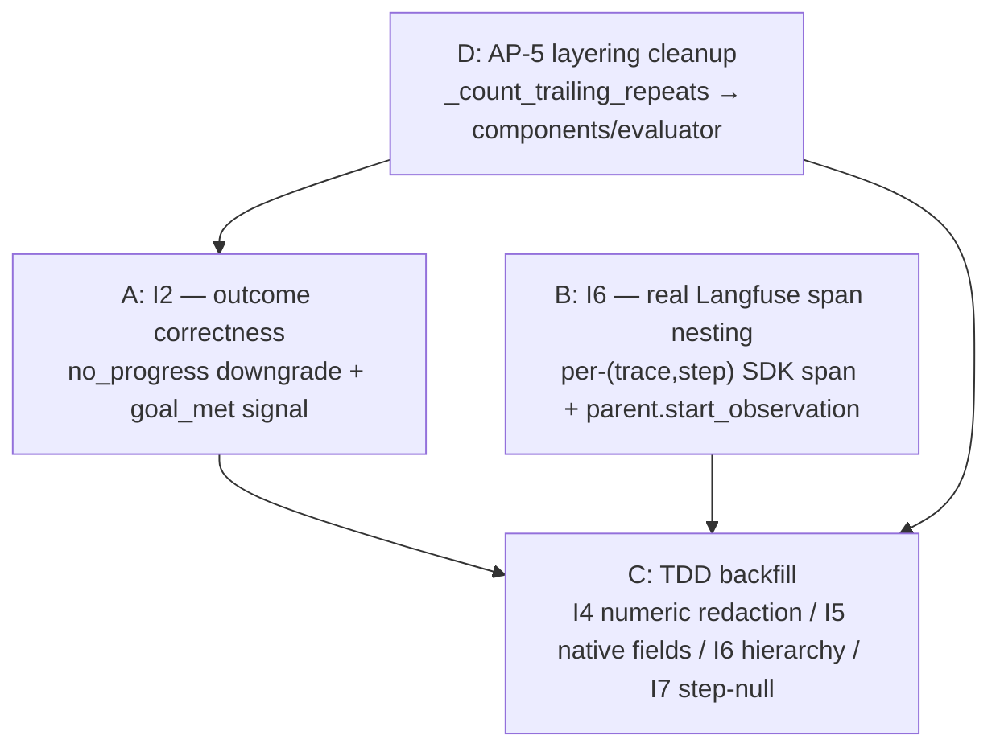

# Recipe 11 — Outcome Correctness, Real Span Nesting, and TDD Hardening

**Goal:** Fix four open observations from the session-issues register: teach the evaluator that a loop-exhausted run is *not* a success (I2), make Langfuse span nesting real instead of synthetic (I6), close the TDD coverage gaps for numeric-key redaction, native generation fields, step parenting, and step-null regressions (I4/I5/I6/I7), and relocate the no-progress heuristic out of the orchestration layer where it does not belong (AP-5). After this recipe, corrupt-success is caught deterministically, the Langfuse trace tree is a real hierarchy that the SDK actually knows about, and every observation is regression-guarded by a test that cannot be fooled by a silent swallow.

**Status:** Complete | 308 feature + architecture tests passing | Zero new dependencies

---

## Before We Start: A Story

Something uncomfortable keeps happening in the traces.

You ask the agent a question. The search backend times out. The agent re-queries. Same timeout. It re-queries again. At the repeat threshold, Recipe 10's graceful wrap-up kicks in: the model strips its tools, reads back what it has, and writes a tidy prose answer — "I wasn't able to retrieve the weather, but based on what I have...". The loop exits cleanly.

Then you look at the telemetry. The final `TASK_COMPLETED` event says:

```json
{ "outcome": "success" }
```

That's a lie. The agent *thrashed* for three identical timeouts, then synthesised a polite non-answer. Calling that "success" is exactly the corrupt-success pattern the Austin issue flagged. If you feed that label into any downstream quality signal — a Langfuse score, an eval dashboard, a confidence metric for the meta-optimizer — you are training on a lie.

Meanwhile, over in the Langfuse trace viewer, the span tree looks flat. Every child observation sits at the same depth. The step groupings the publisher carefully assigned (`workflow:step:2`, `workflow:step:3`) are fields in the metadata, but they are not *real* Langfuse parents. The SDK never heard of them. The parent IDs in the export payloads are synthetic strings that matched no actual observation — so nesting silently did nothing. And because the SDK's `start_observation` swallowed the mismatch under rule O1 ("telemetry never blocks"), CI stayed green the whole time.

Finally, none of this was caught by tests, because the tests were not written yet. A numeric `total_cost_usd` had been silently redacted by the credit-card pattern. The `MODEL_SELECTED` observation was being exported with a null `step`. The step-parent hierarchy was untested. None of these were obvious failures — they were invisible ones.

This recipe fixes all four.

Think of it as closing the gap between what the agent *says it did* and what it *actually did*, at three levels: the outcome label it emits, the tree structure it shows the operator, and the test coverage that would have caught both.



---

## Prerequisites

- **Recipe 10 complete.** No-progress detection ships the three-layer termination stack this recipe hardens.
- **The baseline passes:** `pytest -p no:logfire tests/components/test_evaluator.py tests/services/governance/ tests/orchestration/test_no_progress.py tests/architecture/ -q`.
- **No new dependencies.** Every fix uses existing imports; the Langfuse SDK v4 nesting API (`parent.start_observation`) was always available.

---

## The Architecture in One Breath

The four fixes map cleanly to layers.

| Fix | Layer | Why it lives there |
|-----|-------|--------------------|
| `termination_reason="no_progress"` detection | Orchestration (thin) | Needs loop state (`no_progress_directive_sent`, `tool_results`) |
| `evaluate_task_outcome` unclean treatment + `goal_met` | Components (pure) | Domain logic, unit-testable, no LangGraph |
| `TaskOutcome.termination_reason`, `.goal_met` schema | Components (schema) | Pydantic model owned by the layer that produces it |
| `count_trailing_repeats` heuristic | Components (evaluator) | Domain heuristic — not topology, not I/O |
| Real step span creation + nesting | Middleware adapter | SDK boundary — Langfuse import lives only here |
| Publisher `parent_observation_id` contract | Services (governance) | Mapping layer — no SDK knowledge |
| Tests | Each layer's `tests/` | Layer rules enforced on test imports too |

The dependency arrows never reverse: nothing in components imports from orchestration, nothing in services imports from middleware.

---

## The Four Lessons

---

### Lesson 1 — The Corrupt-Success Problem

**`components/evaluator.py`, `components/schemas.py`, `orchestration/react_loop.py`**

> "Recipe 10 added the graceful wrap-up. The agent stops thrashing and produces a final answer. Why does `evaluate_task_outcome` still call that 'success'?"

Because until this recipe, `evaluate_task_outcome` made `is_clean` a simple membership test:

```python
# Before — components/evaluator.py
is_clean = termination_reason in ("success", "final_answer", "")
```

And `evaluate_node` in orchestration only populated two unclean reasons:

```python
# Before — orchestration/react_loop.py
termination_reason = outcome
if updated_step_count >= agent_config.max_steps:
    termination_reason = "max_steps"
elif updated_cost >= agent_config.max_cost_usd:
    termination_reason = "budget_exceeded"
```

If neither limit was hit, `termination_reason` was `"success"` — even when the agent had triggered the no-progress wrap-up directive. The wrap-up produces a genuine `final_answer` response, so the evaluator saw `termination_reason="success"` with a substantive answer and returned `outcome="success"`. Perfectly logical. Completely wrong.

The fix has two parts. First, `evaluate_node` detects loop-exhaustion *before* delegating to the evaluator:

```python
# After — orchestration/react_loop.py (inside evaluate_node, continuation == "done")
termination_reason = outcome
if updated_step_count >= agent_config.max_steps:
    termination_reason = "max_steps"
elif updated_cost >= agent_config.max_cost_usd:
    termination_reason = "budget_exceeded"
else:
    # I2: the Austin symptom — loop-exhausted via no-progress wrap-up.
    # Mark unclean so the evaluator downgrades success → partial.
    repeats = _count_trailing_repeats(state.get("tool_results") or [])
    if (
        state.get("no_progress_directive_sent")
        or repeats >= agent_config.no_progress_repeat_threshold
    ):
        termination_reason = "no_progress"
```

Second, `evaluate_task_outcome` in the component now treats `"no_progress"` as unclean — the clean set is only genuinely clean terminations:

```python
# After — components/evaluator.py
is_clean = termination_reason in ("success", "final_answer", "")
# "no_progress", "max_steps", "budget_exceeded" all fall through to partial/failed
```

A no-progress run with a substantive answer now becomes `"partial"`. A no-progress run with no answer is `"failed"`. Neither becomes `"success"`.

**Why not gate `outcome` on keyword-overlap (`criteria_met`) instead?** Because that is TAP-3 (determinism theater). Keyword overlap is a fragile heuristic that breaks on paraphrase. The plan's research note is explicit: semantic goal satisfaction belongs in a future L3 LLM-as-judge. The *process* signal (was the termination clean?) is deterministic and belongs in L1/L2 tests. The *content* signal (did the answer address the question?) is probabilistic and belongs in L3 evals. This recipe draws that line and keeps both sides pure.

**The `goal_met` signal:** while we are here, we add a *non-gating* goal-progress field to `TaskOutcome`. It is derived from `criteria_met` (keyword overlap of success conditions), exposed as `bool | None`, and explicitly never changes `outcome`:

```python
# components/evaluator.py — inside evaluate_task_outcome
goal_met: bool | None = None
if success_conditions:
    # ... build criteria_met as before ...
    goal_met = criteria_met >= 0.5  # informational only; threshold 0.5 is documented
```

`None` when no success conditions were declared. `True` or `False` when they exist. The downstream consumer (Langfuse score, eval dashboard, meta-optimizer) can use it — but `outcome` is untouched. Two signals, two jobs, no collision.

**`TaskOutcome` schema gains two new fields:**

```python
# components/schemas.py
class TaskOutcome(BaseModel):
    outcome: str
    termination_clean: bool
    criteria_met: float
    branch_coverage: float
    unmet_conditions: list[str] = Field(default_factory=list)
    score: float = 0.0
    termination_reason: str = ""          # ← new: "success" | "max_steps" | "budget_exceeded" | "no_progress"
    goal_met: bool | None = None          # ← new: non-gating, None when no conditions
```

Both are emitted in the `TASK_COMPLETED` black-box event's `details` dict, so every trace now carries the full picture of *how* the run ended.

**Checkpoint question:** The agent hits `no_progress_repeat_threshold` (3 repeats), the wrap-up directive is injected, the model produces a 40-word prose answer, and the loop exits. What are `outcome`, `termination_reason`, and `goal_met` if no `success_conditions` were declared?

*Answer: `outcome="partial"` (no-progress is unclean + substantive answer → partial), `termination_reason="no_progress"` (threaded from `evaluate_node`), `goal_met=None` (no conditions declared, so the signal is undefined — not `False`). The distinction between `None` and `False` matters: `None` means "we have no criteria to evaluate against" while `False` means "we have criteria and they were not met." A downstream metric that penalises `False` should not penalise `None`.*

---

### Lesson 2 — The Layering Problem (AP-5)

**`components/evaluator.py` ← `orchestration/react_loop.py`**

> "`_count_trailing_repeats` counts identical tool calls. It lives in `orchestration/react_loop.py`. What's wrong with that?"

AGENTS.md invariant #6: orchestration nodes must be thin wrappers. All logic delegates to `components/` and `services/`. The repeat-counting function is *domain heuristic* — it captures a business rule about what "no progress" means. It does not care about LangGraph state format, graph topology, or node wiring. Its only input is a `list[dict]` that happens to be tool results; its output is an integer. That is the profile of a pure component function, not an orchestration utility.

The fix is mechanical: the function moves from `react_loop.py` to `components/evaluator.py` (renamed `count_trailing_repeats` without the leading underscore, since it is now a public component export), and `react_loop.py` re-imports it under the old private alias:

```python
# orchestration/react_loop.py — after
from components.evaluator import (
    build_step_result,
    check_continuation,
    classify_outcome,
    count_trailing_repeats as _count_trailing_repeats,   # ← moved here from this file
    evaluate_task_outcome,
    parse_llm_response,
)
```

The function body is unchanged. The tests import from the right place:

```python
# tests/orchestration/test_no_progress.py — after
from components.evaluator import count_trailing_repeats as _count_trailing_repeats
```

This matters because if `tests/orchestration/test_no_progress.py` imported from `orchestration.react_loop`, it would be an orchestration test testing a component concern — exactly the cross-layer import violation that Pattern 7 (Dependency Rule Enforcement) is designed to catch. The import statement is the test for the architecture invariant.

**Why does this change come before the I2 fix in the implementation order?** Because `evaluate_node` needs `_count_trailing_repeats` to detect no-progress termination (Lesson 1's `else` branch). If the heuristic lives in the wrong layer, `evaluate_node` cannot call it without violating AP-2 (orchestration calling orchestration-internal helpers in the domain logic path). Moving it first keeps the I2 implementation architecturally clean throughout.

**Checkpoint question:** A teammate reads the final `react_loop.py` and notices `count_trailing_repeats as _count_trailing_repeats` in the import list. They ask why the function has a public name in `components/` but is aliased back to private in `orchestration/`. What is the correct answer?

*Answer: `count_trailing_repeats` is public in `components/` because it is a legitimate, testable component export — nothing prevents another component or service from using a domain heuristic about repeated tool calls. The underscore alias in `orchestration/` is a local convention that signals "this is an internal orchestration helper I am borrowing, not part of the public topology." It also means the rest of `react_loop.py`'s existing callsites (`_should_continue`, `call_llm_node`) need zero changes — they keep calling `_count_trailing_repeats`. Migration cost: one import line.*

---

### Lesson 3 — The Fake-Nesting Problem

**`middleware/adapters/observability/langfuse_cloud_exporter.py`**

> "The Langfuse trace viewer shows everything at the same level. But the publisher sets `parent_observation_id` on every non-task event. Isn't that supposed to nest them?"

Not when the parent ID is a synthetic string that the SDK has never created.

The publisher (`services/governance/black_box_publisher.py`) computes a logical step key: `f"{workflow_id}:step:{step}"`. That string ends up in the relay's attributes under `__bb_parent_observation_id`, which the exporter reads. Before this recipe, the exporter forwarded it straight into `start_observation(parent_observation_id=...)` — but that parameter does not exist in the Langfuse SDK v4 `start_observation` signature. The SDK silently accepted the unknown kwarg (against the exporter's internal fake in tests, which had a catch-all `**kwargs`), did nothing with it, and the span landed at the root level. Both the application and the tests believed nesting was working because nothing raised.

The fix is to stop forwarding the synthetic string as a parameter and instead *create a real span*:

```python
# middleware/adapters/observability/langfuse_cloud_exporter.py

def _get_or_create_step_span(
    self, client: Any, trace_id: str, parent_key: str
) -> Any:
    """Return the live SDK step span for (trace_id, parent_key), creating it once."""
    key = (trace_id, parent_key)
    span = self._step_spans.get(key)
    if span is None:
        step_label = parent_key.rsplit(":", 1)[-1]   # "wf-abc:step:2" → "2"
        span = client.start_observation(
            trace_context={"trace_id": trace_id},
            name=f"step.{step_label}",
            as_type="span",
        )
        self._step_spans[key] = span
    return span
```

The exporter maintains `self._step_spans: dict[tuple[str, str], Any]` — one real SDK observation per `(trace_id, logical_step_key)`. When a child event arrives carrying `__bb_parent_observation_id`, instead of forwarding the string, the exporter calls `_get_or_create_step_span` to retrieve (or lazily create) the real parent span, then nests the child under it using the SDK v4 native API:

```python
# middleware/adapters/observability/langfuse_cloud_exporter.py

if bb_parent_observation_id is not None:
    step_span = self._get_or_create_step_span(
        client, trace_id, str(bb_parent_observation_id)
    )
    child = step_span.start_observation(**obs_kwargs)
    child.end()
else:
    observation = client.start_observation(trace_context=trace_context, **obs_kwargs)
    observation.end()
```

The SDK documentation (`parent.start_observation(name="child")`) confirms this is the correct v4 pattern for manual parent-child nesting without relying on OTel context propagation. The step span is an OTel span with a real, SDK-generated ID — the Langfuse trace tree now reflects the actual hierarchy.

**Step span lifetime:** step spans must stay open long enough to span the entire step's events. `release_trace` ends them before `flush()`:

```python
# middleware/adapters/observability/langfuse_cloud_exporter.py — release_trace

for key in [k for k in self._step_spans if k[0] == trace_id]:
    span = self._step_spans.pop(key, None)
    if span is None:
        continue
    try:
        span.end()
    except Exception as exc:
        logger.warning(...)  # O1: telemetry never blocks
client.flush()
```

The span's start time is when the first child event arrived (the step span is created lazily on first use); its end time is when `release_trace` is called (typically on `run.finished`). That is the correct lifetime: the span covers the step's entire wall-clock duration without needing explicit start/end calls in the business logic.

**The publisher contract is stable.** `to_export_kwargs` continues emitting `parent_observation_id` as the logical step key. Only the exporter's interpretation changes — from "forward this string to the SDK" to "use this string as a local cache key for a real span." The relay sidecar, the publisher, and every test of those two layers are unchanged.

**Also fixed while here — native generation field names:** the publisher emits `usage` (a `{input, output, total}` dict) and `cost` (a float) per the I5 contract. The SDK v4 generation API uses `usage_details` and `cost_details`. The exporter now normalises:

```python
if bb_usage is not None:
    obs_kwargs["usage_details"] = bb_usage
if bb_cost is not None:
    obs_kwargs["cost_details"] = (
        dict(bb_cost)
        if isinstance(bb_cost, Mapping)
        else {"total": float(bb_cost)}
    )
```

This was always a latent bug: `usage` was being forwarded as an unknown kwarg, silently accepted by the test fake's `**kwargs` catch-all, and silently rejected by the strict real SDK.

**Checkpoint question:** Three `TOOL_CALLED` events arrive for `(trace_id="wf-1", step=2)`. How many real SDK spans are created?

*Answer: Two — one step span (`step.2`, created on the first child event) and, inside it via `step_span.start_observation(...)`, three child observation objects. `_get_or_create_step_span` returns the same cached span for the second and third events. The step span is ended once, in `release_trace`. Three SDK child objects call `.end()` immediately. The parent stays open.*

---

### Lesson 4 — The Coverage-Gap Problem (Failure Paths First)

**`tests/services/governance/test_black_box_publisher.py`, `tests/middleware/adapters/observability/test_langfuse_cloud_exporter.py`, `tests/components/test_evaluator.py`, `tests/orchestration/test_no_progress.py`**

> "The existing tests all passed. How did these four bugs survive?"

The same way most silent failures survive: no test asserted the specific wrong behaviour, and the wrong behaviour looked like success at the surface.

- **I4 (numeric redaction false positive):** `total_cost_usd=4242424242424242.0` is a 16-digit number that matches the credit-card regex. The `_SAFE_NUMERIC_KEYS` exemption was added in the original publisher, but no test ever presented a credit-card-shaped float on a safe key to prove the exemption was wired correctly. A straightforward cost value in production would have been silently redacted to `[REDACTED]`.

- **I5 (native field promotion):** tests checked that `model` appeared in the output for generation events, but never checked that `TOOL_CALLED` events did *not* get those fields — and never presented the `input_tokens`/`output_tokens` alias spelling. The alias was untested; a deployment using that naming would have exported generations with no token counts.

- **I6 (parent hierarchy):** the test fake had `**kwargs` in `start_observation`, which silently absorbed `parent_observation_id=...` as if it were a valid kwarg. The bug was that the real SDK has no such parameter — but because the fake accepted it, the test passed and the real SDK continued to ignore it in production.

- **I7 (step-null on MODEL_SELECTED):** no test read the black-box JSONL and checked the `step` field on `MODEL_SELECTED` events. The routing node has always emitted `step=state.get("step_count", 0)` — so this was actually fine in production. But the absence of a regression test meant a future refactor could quietly break it without CI noticing.

The repair follows the TDD pyramid rules exactly:

**I4 — failure path first (the redaction MUST fire; then prove the exemption overrides it):**

```python
# tests/services/governance/test_black_box_publisher.py

def test_credit_card_shaped_float_on_safe_key_not_redacted(self) -> None:
    """The exact I4 regression: a 16-digit cost float must survive."""
    cc_shaped = 4242424242424242.0
    result = redact_details({"total_cost_usd": cc_shaped})
    assert "[REDACTED]" not in result["total_cost_usd"]
    assert result["total_cost_usd"].startswith("424242424242424")

def test_same_value_on_unsafe_key_is_still_redacted(self) -> None:
    """Proves the redaction is still live — only the safe keys are exempt."""
    result = redact_details({"note": "4242424242424242"})
    assert "[REDACTED]" in result["note"]
```

The second assertion is the failure path that proves the redaction machinery is live — without it, the first assertion would pass even if someone accidentally disabled *all* redaction.

**I6 — the strict fake (the test fake now rejects unknown kwargs):**

The exporter test fake `FakeLangfuseClient.start_observation` previously had a `**kwargs` catch-all. This was the root of the fake-nesting bug: it absorbed `parent_observation_id` silently. The fix makes the fake strict, mirroring the real SDK's exact keyword set:

```python
# tests/middleware/adapters/observability/test_langfuse_cloud_exporter.py

_SDK_KWARGS = frozenset({
    "trace_context", "name", "as_type", "input", "output", "metadata",
    "version", "level", "status_message", "completion_start_time",
    "model", "model_parameters", "usage_details", "cost_details", "prompt",
})

def start_observation(self, *, name: str, as_type: str = "span", ...
                      **kwargs) -> FakeObservation:
    unknown = set(kwargs) - self._SDK_KWARGS
    if unknown:
        raise TypeError(
            "Langfuse.start_observation() got an unexpected keyword "
            f"argument {sorted(unknown)[0]!r}"
        )
    ...
```

A strict fake turns the silent SDK rejection into a loud CI failure. This is the principle: **the fake's job is to reproduce the contract of the real thing, including its rejections.** A permissive fake only proves that the code doesn't crash with the fake — not that it would work with the real system.

`FakeObservation` grows `start_observation` so tests can assert real nesting:

```python
class FakeObservation:
    def start_observation(self, *, name: str, as_type: str = "span",
                          **kwargs) -> "FakeObservation":
        unknown = set(kwargs) - FakeLangfuseClient._SDK_KWARGS
        if unknown:
            raise TypeError(...)
        child_data = {"parent_name": self.data.get("name"), "name": name, ...}
        if self._client is not None:
            self._client.children.append(child_data)
        return FakeObservation(child_data, self._client)
```

The nesting tests now assert the full contract: one step span per `(trace, step)`, children record `parent_name`, `release_trace` sets `ended=True` on the span, and the synthetic `__bb_parent_observation_id` string never appears in child `input` or `metadata`:

```python
def test_synthetic_parent_id_never_reaches_sdk(self, ...) -> None:
    exporter.export_event(
        name="tool.called", trace_id="wf-1",
        attributes={"__bb_parent_observation_id": "wf-1:step:2", "tool": "shell"},
    )
    child = fake_client.children[0]
    assert "parent_observation_id" not in child
    assert "__bb_parent_observation_id" not in (child.get("metadata") or {})
```

**I2 — evaluator tests (failure path before acceptance path, TAP-4):**

```python
# tests/components/test_evaluator.py

def test_no_progress_with_substantive_answer_is_partial(self):
    result = evaluate_task_outcome(
        final_answer="Based on the information gathered, the weather looks sunny.",
        success_conditions=[], plan_steps=[],
        termination_reason="no_progress",
    )
    assert result.outcome == "partial"
    assert result.termination_clean is False
    assert result.termination_reason == "no_progress"

def test_clean_success_still_succeeds(self):
    """Sanity: a genuinely clean run is NOT downgraded."""
    result = evaluate_task_outcome(
        final_answer="The capital of France is Paris.",
        success_conditions=[], plan_steps=[],
        termination_reason="success",
    )
    assert result.outcome == "success"
    assert result.termination_reason == "success"
```

The failure path (`no_progress → partial`) is written before the acceptance path (`success → success`). This is Anti-Pattern 6 (Gap Blindness) prevention: a gate that promotes everything to success is more dangerous than one that demotes everything to partial. We prove the demotion before we prove the promotion.

`goal_met` gets its own parametric coverage — the three-state contract (`None`, `True`, `False`) and the critical invariant that it never changes `outcome`:

```python
def test_goal_met_does_not_change_outcome(self):
    """goal_met=False must NOT downgrade a clean, substantive success."""
    result = evaluate_task_outcome(
        final_answer="Here is a thorough and substantive response.",
        success_conditions=["Provide a detailed quantum entanglement analysis"],
        plan_steps=[], termination_reason="success",
    )
    assert result.outcome == "success"    # process succeeded
    assert result.goal_met is False       # but the keyword-overlap goal signal disagrees
```

**I7 — regression test (assert the property, not the value):**

```python
# tests/orchestration/test_no_progress.py

def test_model_selected_carries_non_null_int_step(self, tmp_path):
    # ... build a minimal graph, run one step, read the JSONL ...
    model_selected = _events_of_type(bb_events, EventType.MODEL_SELECTED.value)
    for ev in model_selected:
        assert ev.get("step") is not None
        assert isinstance(ev["step"], int)
```

This is a property assertion ("step is a non-null integer"), not a value assertion ("step is 0"). A property test survives any future change to when `step_count` is incremented; a value test would break on the first refactor of the counter. Pattern 3 (behavioral property over exact value) applied at L4.

**Checkpoint question:** The existing tests for `LangfuseCloudExporter` all passed before this recipe. How is it possible that the nesting tests in `TestStepSpanNesting` are new — didn't any existing test exercise `__bb_parent_observation_id`?

*Answer: One existing test (`TestBlackBoxRelayHints.test_bb_observation_id_does_not_reach_sdk`) confirmed that `__bb_observation_id` was popped before reaching the SDK. But no existing test sent `__bb_parent_observation_id` and then asserted what the SDK actually received. The existing fake's `**kwargs` catch-all meant any forwarded parameter was absorbed without evidence of its effect. The gap was not "no test ran the code path" — it was "the test ran the code path but did not make the right assertion." That is the Gap Blindness anti-pattern: a test exists, coverage metrics say 100%, but the behavior you care about was never verified.*

---

## Agent Steps

These steps can be followed independently of GCP — the entire recipe is code and tests.

### 11.1 — Verify the baseline (before any change)

```bash
python -m pytest -p no:logfire \
  tests/components/test_evaluator.py \
  tests/services/governance/test_black_box_publisher.py \
  tests/orchestration/test_no_progress.py \
  tests/architecture/ -q
# Expected: all passing (the bugs are invisible — no tests cover the broken paths yet)
```

### 11.2 — Apply the layering fix (D1, AP-5)

Move `_count_trailing_repeats` to `components/evaluator.py` as `count_trailing_repeats`. Update `react_loop.py` import. Update `test_no_progress.py` import.

```bash
python -m pytest -p no:logfire tests/architecture/ tests/orchestration/test_no_progress.py -q
# Expected: all passed — architecture invariant tests confirm the move is clean
```

### 11.3 — Apply the schema + evaluator changes (A2, A3)

Add `termination_reason: str` and `goal_met: bool | None` to `TaskOutcome`. Update `evaluate_task_outcome` to compute `goal_met` and treat `no_progress` as unclean.

```bash
python -m pytest -p no:logfire tests/components/test_evaluator.py -q
# Expected: all existing tests still pass (new fields have defaults; old tests untouched)
```

### 11.4 — Apply the orchestration threading (A1)

Add the `no_progress` branch to `termination_reason` in `evaluate_node`. Emit `termination_reason` and `goal_met` in the `TASK_COMPLETED` details.

```bash
python -m pytest -p no:logfire tests/orchestration/test_no_progress.py -q
# Expected: all passed — no-progress integration tests still green
```

### 11.5 — Apply the exporter changes (B1, B2)

Add `_step_spans`, `_get_or_create_step_span`, update `export_event` nesting logic, update `release_trace` to end step spans. Fix `usage_details`/`cost_details` kwarg names.

```bash
python -m pytest -p no:logfire \
  tests/middleware/adapters/observability/test_langfuse_cloud_exporter.py -q
# Expected: all existing tests still pass (the strict fake now validates the fixed kwarg names too)
```

### 11.6 — Write and run all the backfill tests (C1–C4)

Add `TestNumericKeysSurviveRedaction`, `TestNativeGenerationFields`, `TestParentObservationHierarchy` to the publisher tests; add `TestStepSpanNesting` and update the fake in the exporter tests; add `TestI2OutcomeCorrectness` to the evaluator tests; add `TestModelSelectedStepRegression` to the no-progress tests.

```bash
python -m pytest -p no:logfire \
  tests/components/test_evaluator.py \
  tests/services/governance/test_black_box_publisher.py \
  tests/middleware/adapters/observability/test_langfuse_cloud_exporter.py \
  tests/middleware/sidecars/test_black_box_to_telemetry.py \
  tests/orchestration/test_no_progress.py \
  tests/architecture/ -q
# Expected: 308 passed, 2 skipped
```

---

## Human Review Gate

Before calling Recipe 11 done:

- [ ] **Corrupt-success is caught** — run the no-progress integration test (`test_no_progress_graceful_wrapup`) and assert that the `TASK_COMPLETED` black-box event has `"outcome": "partial"` and `"termination_reason": "no_progress"` when the agent exits via wrap-up.
- [ ] **`goal_met` is `None` for unconstrained runs** — run any task with no `success_conditions` and confirm `goal_met` is absent from the `TaskOutcome` (the black-box event omits it / carries `null`).
- [ ] **Langfuse span tree is hierarchical** — route a run at a real Langfuse project and confirm that non-task events appear as children of `step.N` spans in the trace viewer, not at root level.
- [ ] **No credit-card false positives** — confirm `redact_details({"total_cost_usd": 4242424242424242.0})` returns the numeric string, not `"[REDACTED]"`.
- [ ] **`_count_trailing_repeats` is gone from `orchestration/`** — `rg "_count_trailing_repeats" orchestration/` returns zero results; the function is defined only in `components/evaluator.py`.
- [ ] **Architecture tests still pass** — `pytest tests/architecture/ -q` confirms no SDK import leaks in `services/` or `components/`.
- [ ] **No new dependencies** — `git diff pyproject.toml` is empty.

---

## For a General Audience

If you are adapting these patterns to another LangGraph-based agent or observability stack:

1. **Separate process signals from content signals in outcome classification.** "Did the loop terminate cleanly?" is deterministic and should gate the `outcome` label. "Did the answer satisfy the goal?" is probabilistic and should be a separate, non-gating field. Collapsing them is a named anti-pattern (corrupt-success) that corrupts any quality metric downstream.
2. **An unclean termination is always unclean, even if the answer looks good.** A graceful wrap-up that produces a 40-word prose answer after three identical timeouts is still an unclean run. The `outcome` label should reflect what the *process* did, not how polished the *output* looks.
3. **Test fakes must mirror the real system's rejections, not just its acceptances.** A catch-all `**kwargs` in a fake hides every wrong parameter you pass. A strict fake turns silent failures into loud CI failures. The cost is writing out the real SDK's keyword set once; the payoff is catching every malformed call for free.
4. **Synthetic parent IDs are worse than no nesting.** Forwarding a made-up string as an observation parent ID does nothing visible (because the SDK ignores it) but passes every test (because the fake absorbs it). The correct pattern is to maintain a real, live SDK span per logical step and use the SDK's own nesting API to attach children.
5. **Failure paths first, always.** For every gate, write the test that proves the gate *rejects* before you write the test that proves it *accepts*. A test suite with only acceptance tests proves nothing about safety margins.
6. **Domain heuristics belong in components, not orchestration.** If a function's only input is a plain Python list and its output is an integer, it is a pure component function regardless of which module it currently lives in. Moving it to components makes it independently testable and prevents AP-5 from accreting in the orchestration layer.

The reusable pattern is: **process-signal outcome first, content-signal goal second, strict fakes always, real SDK nesting over synthetic IDs, failure path before acceptance path.**

---

## Verify

```bash
# 1. Full targeted suite (all four workstreams)
python -m pytest -p no:logfire \
  tests/components/test_evaluator.py \
  tests/services/governance/test_black_box_publisher.py \
  tests/middleware/adapters/observability/test_langfuse_cloud_exporter.py \
  tests/middleware/sidecars/test_black_box_to_telemetry.py \
  tests/orchestration/test_no_progress.py \
  -q
# Expected: 289+ passed

# 2. Architecture boundaries (no SDK leaks, no upward imports)
python -m pytest -p no:logfire tests/architecture/ -q
# Expected: all passed (2 skipped is normal)

# 3. Spot-check corrupt-success fix
python -c "
from components.evaluator import evaluate_task_outcome
r = evaluate_task_outcome(
    final_answer='Based on what I found, here is my best answer.',
    success_conditions=[], plan_steps=[],
    termination_reason='no_progress',
)
assert r.outcome == 'partial', f'Expected partial, got {r.outcome}'
assert r.termination_reason == 'no_progress'
assert r.goal_met is None
print('I2 fix verified:', r.outcome, r.termination_reason, r.goal_met)
"

# 4. Spot-check numeric key exemption
python -c "
from services.governance.black_box_publisher import redact_details
r = redact_details({'total_cost_usd': 4242424242424242.0})
assert '[REDACTED]' not in r['total_cost_usd'], 'I4 regression: cost was redacted'
print('I4 fix verified:', r['total_cost_usd'][:20])
"
```

---

## Rollback

All changes are backward-compatible:

- `TaskOutcome.termination_reason` and `goal_met` have defaults (`""` and `None`) — any consumer that does not read them gets pre-recipe behaviour.
- The publisher contract (`parent_observation_id` in `to_export_kwargs`) is unchanged — reverting only the exporter restores the previous (non-nesting) behaviour without touching any other layer.
- Moving `count_trailing_repeats` is purely mechanical — reverting the import in `react_loop.py` and restoring the function body there is a three-line change.
- The new tests are additive — removing them leaves the codebase in a weaker but passing state.

```bash
# To revert the exporter nesting only (keeps everything else)
git checkout middleware/adapters/observability/langfuse_cloud_exporter.py

# To revert everything in this recipe
git checkout components/evaluator.py components/schemas.py \
  orchestration/react_loop.py \
  middleware/adapters/observability/langfuse_cloud_exporter.py \
  tests/components/test_evaluator.py \
  tests/services/governance/test_black_box_publisher.py \
  tests/middleware/adapters/observability/test_langfuse_cloud_exporter.py \
  tests/orchestration/test_no_progress.py
```

---

## Deferred

| Item | Why deferred | Follow-up note |
|------|-------------|----------------|
| L3 LLM-as-judge for `goal_met` | Semantic goal satisfaction cannot be evaluated deterministically; keyword overlap is TAP-3 theater | `goal_met` field is already in schema; the judge replaces the keyword computation, not the field |
| I8 — real span durations | `start_observation` step spans now carry wall-clock lifetime; `end` with explicit timestamps deferred | `span.end(end_time=...)` is a one-line add once the agent wall-clock tracking (STORY-I8) is ready |
| `no_progress_directive_sent` in `TASK_COMPLETED` | Present in black-box attributes via `termination_reason`; not yet a first-class Langfuse score | Wire as `score_trace("no_progress", 1.0)` in the relay when the scoring pipeline matures |

---

## Files Modified

| File | Action | Workstream |
|------|--------|-----------|
| `components/evaluator.py` | Added `count_trailing_repeats` (moved from orchestration); `evaluate_task_outcome` treats `no_progress` as unclean + computes non-gating `goal_met` | D1, A2 |
| `components/schemas.py` | `TaskOutcome` gains `termination_reason: str` and `goal_met: bool \| None` | A3 |
| `orchestration/react_loop.py` | Imports `count_trailing_repeats` from components; `evaluate_node` threads `no_progress` termination reason + emits `termination_reason`/`goal_met` in `TASK_COMPLETED` | A1, D1 |
| `middleware/adapters/observability/langfuse_cloud_exporter.py` | `_step_spans` dict + `_get_or_create_step_span`; children nest via `parent.start_observation`; `release_trace` ends step spans; `usage_details`/`cost_details` kwarg fix | B1, B2 |
| `tests/components/test_evaluator.py` | `TestI2OutcomeCorrectness` — `no_progress→partial`, `goal_met` three-state contract, invariant that `goal_met` never changes `outcome` | C4 |
| `tests/services/governance/test_black_box_publisher.py` | `TestNumericKeysSurviveRedaction` (I4), `TestNativeGenerationFields` (I5), `TestParentObservationHierarchy` (I6) | C1 |
| `tests/middleware/adapters/observability/test_langfuse_cloud_exporter.py` | `FakeLangfuseClient` strict kwargs; `FakeObservation.start_observation` for child nesting; `TestStepSpanNesting` (I6) | C2 |
| `tests/orchestration/test_no_progress.py` | Import updated to `components.evaluator`; `TestModelSelectedStepRegression` (I7) | D1, C3 |
