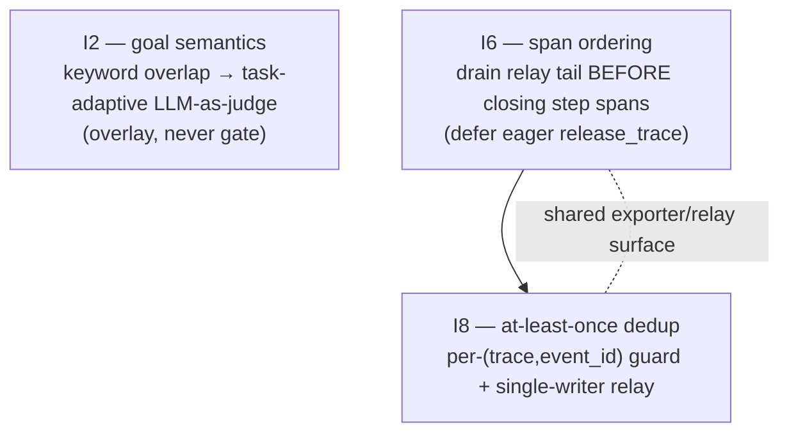

# Recipe 12 — Goal-Judge Semantics, Deterministic Span Ordering, and At-Least-Once Dedup

**Goal:** Close the three defects that survived the SearXNG trace review (`a69f0c77`): I2 (the evaluator reports `outcome=success` while `criteria_met=0.0` / `goal_met=false`), I6 (the Langfuse span tree comes out flat / nested / partial depending on the run), and I8 (duplicate `task.completed` / `step.executed` observations with the same `event_id`). After this recipe, goal satisfaction is judged by a task-adaptive LLM-as-judge instead of keyword overlap, the relay tail is always drained before step spans close (so the tree shape is stable), and a per-trace idempotency guard makes the at-least-once relay export each event exactly once.

**Status:** Complete | I6/I8 deterministic (L2) + I2 mock-provider (L3) tests passing | Zero new dependencies

---

## Before We Start: A Story

Recipe 11 drew a clean line: the *process* signal (`outcome` / `termination_reason`) is deterministic and gates the verdict; the *content* signal (`goal_met`) is probabilistic and is informational only. It then computed `goal_met` from keyword overlap — a placeholder it explicitly flagged as TAP-3 theater, deferred to "a future L3 LLM-as-judge."

The SearXNG trace shows why the placeholder had to go. The weather run succeeded — SearXNG returned real results, the agent synthesised a correct, sourced answer — and the `TASK_COMPLETED` event said:

```json
{ "outcome": "success", "goal_met": false, "criteria_met": 0.0, "unmet_conditions": ["All planned branches are addressed in the final synthesis.", "Final answer is concise, actionable, and internally consistent."] }
```

`goal_met=false` on a genuinely good run. The reason is structural: `evaluate_task_outcome` scores `criteria_met` by keyword overlap against the two fixed generic strings the plan builder always emits. Those strings ("All planned branches…", "Final answer is concise…") share almost no vocabulary with any real answer, so `criteria_met` is ~always `0.0` and `unmet_conditions` is *byte-for-byte identical on good and bad runs*. The signal carries no information. Feed it to a Langfuse score or the meta-optimizer and you are training on noise.

Meanwhile the operator opened the same trace twice and saw two different trees. Once flat, once with `step.2` nesting its children, once partial. And the terminal `task.completed` appeared twice with the same `event_id`.

Three defects, two root causes, one recipe.



---

## Prerequisites

- **Recipe 10 + 11 complete.** This recipe replaces Recipe 11's keyword `goal_met` computation with the judge it deferred, and hardens the span/relay surface Recipe 11 introduced.
- **The baseline passes:** `pytest -p no:logfire tests/components/ tests/middleware/ tests/architecture/ -q`.
- **No new dependencies.** The judge reuses the existing `LLMService` / `PromptService`; the dedup guard and single-writer lock are stdlib only.

---

## The Architecture in One Breath

| Fix | Layer | Why it lives there |
|-----|-------|--------------------|
| `GoalJudge` (LLM-as-judge) | Components (pure) | Domain logic; injectable `LLMService`/`PromptService`/`ModelProfile`; no LangGraph |
| `GoalVerdict`, `CriterionVerdict` schema | Components (schema) | Pydantic models owned by the producing layer |
| `goal_judge_system_prompt.j2` | Prompts (H1) | Human-authored rubric, never a hardcoded string |
| Judge wiring + overlay | Orchestration (thin) | `evaluate_node` overlays the verdict; flag-gated; records via `eval_capture` |
| `goal_judge_enabled` flag | Services (config) | Off by default so CI stays L2-pure (no live LLM) |
| Drain→release→flush ordering | Middleware (`app_prod`) | Owns SSE teardown lifecycle |
| `release_on_finish` / `release` deferral | Middleware (bridge) | Mapping layer; lets the caller own ordering |
| Per-trace `event_id` dedup | Middleware adapter | SDK boundary; the only place that knows SDK v4 can't upsert |
| Single-writer lock + atomic offset | Middleware (relay sidecar) | Outbox bookkeeping; defense in depth |

The dependency arrows never reverse: `components/goal_judge.py` imports only `components.schemas` (same layer) and, under `TYPE_CHECKING`, the injected `services` types — never `langgraph`/`langchain`. The architecture suite enforces this.

---

## The Three Lessons

---

### Lesson 1 — The Keyword-Overlap Lie (I2)

**`components/goal_judge.py`, `components/schemas.py`, `prompts/goal_judge_system_prompt.j2`, `orchestration/react_loop.py`**

> "Recipe 11 said `goal_met` is non-gating and derived from keyword overlap. Why change it?"

Because a non-gating signal still has to be *true*. Keyword overlap against fixed generic strings is not a weak goal signal — it is a constant. It returns `0.0` for every answer, correct or not, so a downstream consumer that penalises `goal_met=false` penalises *every* run equally. That is worse than no signal: it looks like data.

The fix keeps Recipe 11's process/content split exactly — `outcome` is still the deterministic floor and is **never** gated on the judge — but replaces the *content* computation with a reference-free, task-adaptive LLM-as-judge.

`GoalJudge` deliberately mirrors `InputGuardrail` (the established H3 pattern): injected `LLMService` + `PromptService` + fast-tier `ModelProfile`, render a `.j2`, call `invoke`, parse a structured verdict.

```python
# components/goal_judge.py
class GoalJudge:
    async def evaluate(self, *, task_input, final_answer, success_conditions, evidence=None) -> GoalVerdict:
        rendered = self._prompt_service.render_prompt(
            self.PROMPT_NAME,
            task_input=task_input,
            final_answer=final_answer,
            success_conditions=success_conditions,
            evidence=_summarize_evidence(evidence),
        )
        response = await self._llm_service.invoke(
            self._judge_profile, [{"role": "user", "content": rendered}]
        )
        return self._parse_verdict(str(getattr(response, "content", response)))
```

The prompt is a narrow rubric with explicit chain-of-thought and a JSON-only verdict. Crucially, it is **task-adaptive**: when `success_conditions` is empty it instructs the judge to *infer* the 1–3 conditions a correct answer must satisfy, and it is told to be skeptical of fluent non-answers ("I was unable to retrieve X, but based on what I have…") — the exact corrupt-success shape Recipe 10's wrap-up can produce.

The verdict is a Pydantic model; `unmet_conditions` is derived, not trusted from the wire:

```python
# components/schemas.py
class GoalVerdict(BaseModel):
    goal_met: bool
    criteria_met: float = 0.0
    per_criterion: list[CriterionVerdict] = Field(default_factory=list)
    rationale: str = ""

    @property
    def unmet_conditions(self) -> list[str]:
        return [c.criterion for c in self.per_criterion if not c.met]
```

The wiring in `evaluate_node` overlays **only** the goal signals onto the `TaskOutcome` — `outcome` is untouched — and falls back to the heuristic on any error, so the judge is best-effort, never load-bearing:

```python
# orchestration/react_loop.py — inside the `continuation == "done"` block
task_outcome = evaluate_task_outcome(...)        # deterministic floor (unchanged)
if goal_judge is not None and content:
    try:
        verdict = await goal_judge.evaluate(
            task_input=state.get("task_input", ""),
            final_answer=content,
            success_conditions=success_conditions,
            evidence=state.get("tool_results") or [],
        )
        task_outcome = task_outcome.model_copy(update={
            "goal_met": verdict.goal_met,
            "criteria_met": round(verdict.criteria_met, 3),
            "unmet_conditions": verdict.unmet_conditions,
        })
        await eval_capture.record(target="goal_judge", ..., model=goal_judge.model_name)  # H5
    except Exception as exc:
        logger.warning("goal_judge failed; falling back to heuristic: %s", exc)
effective_outcome = task_outcome.outcome           # judge NEVER changes this
```

The judge is instantiated once in `build_graph`, gated by `agent_config.goal_judge_enabled` (default `False`), using a fast-tier profile (H2). Off in CI means no live LLM call ever runs in the deterministic suites; the keyword heuristic remains the CI fallback.

**Why overlay instead of gate?** Recipe 11's rule still holds: an unclean termination is unclean no matter how good the answer reads. The judge answers "did it solve the task?", which is orthogonal to "did the loop terminate cleanly?". Collapsing them reintroduces corrupt-success from the other direction (a clean run with a bad answer would be mislabeled, or a partial run with a great answer would be promoted).

**Checkpoint question:** `goal_judge_enabled=True`, the judge returns `{goal_met: true, criteria_met: 0.66, per_criterion: [{met:true},{met:false}]}`, but the run terminated via the no-progress wrap-up. What are `outcome`, `termination_reason`, `goal_met`, and `unmet_conditions`?

*Answer: `outcome="partial"` (no-progress is unclean + substantive answer → partial — the judge did NOT touch it), `termination_reason="no_progress"`, `goal_met=True` (overlaid from the judge), `unmet_conditions=[the one criterion the judge marked met=false]`. The process said "didn't run cleanly"; the content said "mostly solved it." Both true, both reported, neither overriding the other.*

---

### Lesson 2 — The Span-Ordering Race (I6)

**`middleware/app_prod.py`, `middleware/telemetry_bridge.py`, `middleware/adapters/observability/langfuse_cloud_exporter.py`**

> "Recipe 11 made step nesting real. Why is the tree still different every run?"

Because *creating* real step spans is necessary but not sufficient — they also have to close in a deterministic order relative to the relay tail. Three export paths share one exporter and raced on the end of the trace:

1. the background `run_forever(interval_s=1.0)` poll,
2. the eager `release_trace` on `RunFinishedDomain` in the bridge (which **ends + flushes every `step.N` span**),
3. the `drain_workflow` in the SSE `finally`.

If a tail event relayed *after* `release_trace` had already ended the step spans, `_get_or_create_step_span` recreated fresh `step.N` spans for it — a different tree shape every run.

The fix is to make teardown a fixed sequence and give one owner control of it. The bridge no longer releases eagerly when the caller opts out:

```python
# middleware/telemetry_bridge.py
def emit_domain_event(exporter, domain_event, *, subject=None, release_on_finish=True):
    ...
    if isinstance(domain_event, RunFinishedDomain) and release_on_finish:
        exporter.release_trace(domain_event.trace_id)
```

`emit_run_finished` grows the same `release=True` escape hatch. The SSE `finally` then owns the order — **drain the tail, *then* close spans, *then* flush**:

```python
# middleware/app_prod.py — SSE finally
relay = adapters.black_box_relay
if relay is not None and trace_id_seen is not None:
    relay.drain_workflow(trace_id_seen)            # 1. drain tail (creates/uses spans)
if trace_id_seen is not None and not run_finished_emitted:
    telemetry_bridge.emit_run_finished(..., release=False)
if trace_id_seen is not None:
    adapters.telemetry_exporter.release_trace(trace_id_seen)  # 2. close spans (idempotent)
adapters.telemetry_exporter.flush()                # 3. flush
```

`release_trace` was already idempotent (it `discard`s the trace, `pop`s its step spans, and flushes), so the double call — once here, once via the safety-net `emit_run_finished` if the stream never produced `RunFinishedDomain` — is harmless. A regression test pins that.

**The publisher and the nesting API are untouched.** This is purely a *lifecycle ordering* fix on top of Recipe 11's real-nesting fix. Recipe 11 made the spans real; Recipe 12 makes their close time deterministic.

**Checkpoint question:** The stream emits `RunFinishedDomain` normally (so `run_finished_emitted=True`) and the relay has one undrained `tool.called` for `step:3`. With the new ordering, which span is `tool.called` nested under, and when does `step.3` end?

*Answer: `drain_workflow` runs first and `_get_or_create_step_span` finds (or lazily creates) the live `step.3` span, nesting `tool.called` under it. Only then does `release_trace` end `step.3`. Because the bridge was called with `release_on_finish=False`, it did **not** end `step.3` early during the stream, so the child could not have recreated a second `step.3`.*

---

### Lesson 3 — The At-Least-Once Duplicate (I8)

**`middleware/adapters/observability/langfuse_cloud_exporter.py`, `middleware/sidecars/black_box_to_telemetry.py`**

> "If the relay tracks byte offsets, how do the same `event_id`s export twice?"

Because the relay is at-least-once by design and the offset only advances after a full batch. `run_forever` and `drain_workflow` can both read the same window under a worker race or an export-then-crash, and Langfuse SDK v4 cannot upsert on a caller-supplied id (`__bb_observation_id` is dropped in the exporter) — so the duplicate surfaces with an identical metadata `event_id`. The fix is defense in depth at two layers.

**Layer 1 — exporter idempotency (the robust fix).** A per-trace set of seen `event_id`s, populated only *after* a successful export so a genuine failure stays retryable, and cleared on `release_trace`:

```python
# langfuse_cloud_exporter.py — export_event
dedup_id = attrs.get("event_id") or bb_observation_id
if dedup_id is not None and str(dedup_id) in self._seen_events.get(trace_id, set()):
    return True                                    # already exported → no-op success
...
if dedup_id is not None:                           # mark seen ONLY after the SDK accepted it
    self._seen_events.setdefault(trace_id, set()).add(str(dedup_id))
return True
```

Returning `True` (not `False`) on a skip matters: a dedup hit is not a failure to dead-letter. And marking seen *after* the SDK call (not before) means a swallowed SDK error still returns `False` and the relay retries it — a test asserts exactly this (`test_failed_export_is_not_marked_seen`). Events without an `event_id` (direct domain-bridge events like `run.started`) are never deduped.

**Layer 2 — single-writer relay.** A per-workflow `threading.Lock` serializes `_process_workflow` so a concurrent poll + drain can't consume the same offset window, and the offset is persisted atomically (temp file + `os.replace`) so a torn write can't cause a re-read:

```python
# black_box_to_telemetry.py
def _process_workflow(self, wf_dir, trace_file):
    with self._workflow_lock(wf_dir.name):
        ...
        self._write_offset_atomic(offset_file, offset + bytes_consumed)  # os.replace = atomic
```

**In-process vs external relay** is already guarded by `BLACKBOX_RELAY_MODE` (`in_process` default, `off`, `external`) in `middleware/composition.py`, so the in-process relay and an external sidecar never tail the same `trace.jsonl`.

**Checkpoint question:** A crash leaves the offset at 0 after a full window was already exported. On restart the relay re-reads the whole window and hands every line to the exporter again. How many `task.completed` observations does Langfuse receive?

*Answer: One. The exporter's per-trace `event_id` set was cleared by the crash, but `release_trace` is the only thing that clears it in a healthy run — on a fresh process the set rebuilds as it re-exports, and within that single process the second read of the same `event_id` is skipped. Across the crash boundary the guarantee degrades to "at least once," which is why the offset is also written atomically: the durable offset, once advanced, prevents the re-read in the first place. The two layers cover each other's gap.*

---

## Agent Steps

### 12.1 — Verify the baseline

```bash
python -m pytest -p no:logfire \
  tests/components/test_evaluator.py \
  tests/middleware/test_telemetry_bridge.py \
  tests/middleware/adapters/observability/test_langfuse_cloud_exporter.py \
  tests/middleware/sidecars/test_black_box_to_telemetry.py \
  tests/architecture/ -q
```

### 12.2 — I6: defer release + reorder teardown

Add `release_on_finish` to `emit_domain_event` and `release` to `emit_run_finished`; in the SSE `finally` of `app_prod.py` do drain → `release_trace` → `flush`.

```bash
python -m pytest -p no:logfire tests/middleware/test_telemetry_bridge.py tests/middleware/test_app_prod.py -q
```

### 12.3 — I8: exporter dedup + single-writer relay

Add `_seen_events` to the exporter (mark on success, clear in `release_trace`); add a per-workflow lock and atomic offset write to the relay.

```bash
python -m pytest -p no:logfire \
  tests/middleware/adapters/observability/test_langfuse_cloud_exporter.py \
  tests/middleware/sidecars/test_black_box_to_telemetry.py -q
```

### 12.4 — I2: schema + judge + prompt

Add `GoalVerdict`/`CriterionVerdict` to `components/schemas.py`; create `components/goal_judge.py` and `prompts/goal_judge_system_prompt.j2`; add `goal_judge_enabled` to `AgentConfig`.

```bash
python -m pytest -p no:logfire tests/components/test_goal_judge.py tests/architecture/ -q
```

### 12.5 — I2: wire into evaluate_node

Instantiate `GoalJudge` in `build_graph` (flag-gated, fast tier); overlay the verdict onto `TaskOutcome` before `TASK_COMPLETED`; record via `eval_capture` (H5); keep the heuristic fallback.

```bash
python -m pytest -p no:logfire tests/components/ tests/orchestration/test_no_progress.py tests/architecture/ -q
```

---

## Human Review Gate

- [ ] **Judge overlays, never gates** — with `goal_judge_enabled=True`, a `no_progress` run with a judge `goal_met=true` still reports `outcome="partial"`.
- [ ] **Judge is off in CI** — `AgentConfig().goal_judge_enabled is False`; no live LLM call in any deterministic suite.
- [ ] **Heuristic fallback intact** — an unparseable judge verdict falls back to `evaluate_task_outcome` without raising.
- [ ] **Span tree is stable** — route a real run at a Langfuse project twice; the nesting under `step.N` is identical across runs.
- [ ] **No duplicate terminal events** — confirm exactly one `task.completed` per trace in the viewer.
- [ ] **Architecture tests pass** — `components/goal_judge.py` imports only `services`/`trust`/`components.schemas`, no `langchain`/`langgraph`.
- [ ] **No new dependencies** — `git diff pyproject.toml` is empty.

---

## For a General Audience

1. **A non-gating signal still has to be correct.** A placeholder metric that returns a constant is worse than no metric — it looks like data and silently corrupts anything downstream that consumes it. Replace it with a real measurement or remove it.
2. **Separate "ran cleanly" from "solved it," and let each own its question.** The deterministic process floor gates `outcome`; the probabilistic judge overlays `goal_met`. Neither overrides the other.
3. **Make the LLM-as-judge injectable, flag-gated, and mockable.** Off by default keeps CI deterministic; the keyword heuristic is the fallback; a mock provider drives the tests with record/replay, never a live model.
4. **Teardown order is a contract.** When multiple paths share one exporter, give exactly one owner control of the sequence (drain → close → flush) and make every step idempotent so a double call is harmless.
5. **At-least-once needs idempotency at the consumer.** When the transport can't upsert and the producer can re-deliver, dedup at the boundary on a stable id — and mark "seen" only *after* a confirmed success so failures stay retryable.

The reusable pattern is: **real content signal over constant placeholder, overlay over gate, owned teardown order with idempotent steps, and consumer-side dedup with success-gated marking.**

---

## Verify

```bash
# 1. Targeted suites (all three workstreams)
python -m pytest -p no:logfire \
  tests/components/test_goal_judge.py \
  tests/components/test_evaluator.py \
  tests/middleware/test_telemetry_bridge.py \
  tests/middleware/adapters/observability/test_langfuse_cloud_exporter.py \
  tests/middleware/sidecars/test_black_box_to_telemetry.py \
  tests/orchestration/test_no_progress.py \
  tests/architecture/ -q

# 2. Spot-check the heuristic fallback (judge disabled is the default)
python -c "
from services.base_config import AgentConfig
assert AgentConfig().goal_judge_enabled is False
print('I2 default: goal_judge_enabled =', AgentConfig().goal_judge_enabled)
"

# 3. Spot-check the verdict overlay contract
python -c "
from components.schemas import GoalVerdict, CriterionVerdict
v = GoalVerdict(goal_met=False, criteria_met=0.5, per_criterion=[
    CriterionVerdict(criterion='cites source', met=True),
    CriterionVerdict(criterion='gives number', met=False),
])
assert v.unmet_conditions == ['gives number']
print('I2 verdict overlay:', v.goal_met, v.unmet_conditions)
"
```

---

## Rollback

All changes are backward-compatible:

- `goal_judge_enabled` defaults `False` — the judge never runs unless explicitly enabled; the keyword heuristic behaviour is unchanged.
- `release_on_finish` / `release` default `True` — any caller that does not opt out gets the pre-recipe eager-release behaviour.
- The exporter dedup keys on `event_id`; events without one are never deduped, so non-relay paths are unaffected.
- The relay lock and atomic offset are transparent to callers.

```bash
# Revert the judge only (keeps I6/I8)
git checkout components/goal_judge.py components/schemas.py prompts/goal_judge_system_prompt.j2 services/base_config.py
git checkout orchestration/react_loop.py

# Revert the span-ordering / dedup only (keeps I2)
git checkout middleware/app_prod.py middleware/telemetry_bridge.py \
  middleware/adapters/observability/langfuse_cloud_exporter.py \
  middleware/sidecars/black_box_to_telemetry.py
```

---

## Files Modified

| File | Action | Workstream |
|------|--------|-----------|
| `components/goal_judge.py` | **New** — `GoalJudge` LLM-as-judge (mirrors `InputGuardrail`); JSON-verdict parser tolerant of fenced blocks + percentage clamping | I2 |
| `components/schemas.py` | `GoalVerdict` + `CriterionVerdict`; derived `unmet_conditions` | I2 |
| `prompts/goal_judge_system_prompt.j2` | **New** — task-adaptive rubric, chain-of-thought, JSON-only verdict (H1) | I2 |
| `services/base_config.py` | `AgentConfig.goal_judge_enabled` (default `False`) | I2 |
| `orchestration/react_loop.py` | Instantiate flag-gated judge in `build_graph`; overlay verdict onto `TaskOutcome` (never `outcome`); record via `eval_capture`; heuristic fallback | I2 |
| `middleware/telemetry_bridge.py` | `release_on_finish` / `release` deferral flags | I6 |
| `middleware/app_prod.py` | SSE `finally` teardown order: drain → `release_trace` → `flush`; loop defers release | I6 |
| `middleware/adapters/observability/langfuse_cloud_exporter.py` | Per-trace `event_id` dedup (mark on success, clear in `release_trace`) | I8 |
| `middleware/sidecars/black_box_to_telemetry.py` | Per-workflow single-writer lock; atomic offset write | I8 |
| `tests/components/test_goal_judge.py` | **New** — mock-provider parsing/overlay/failure-path tests | I2 |
| `tests/middleware/adapters/observability/test_langfuse_cloud_exporter.py` | `TestEventIdIdempotency` + idempotent `release_trace` | I8 |
| `tests/middleware/sidecars/test_black_box_to_telemetry.py` | `TestSingleWriterIdempotency` (drain-after-poll, atomic offset, at-least-once dedup) | I8 |

---

## Deferred

| Item | Why deferred | Follow-up note |
|------|-------------|----------------|
| I4 (numeric-key PII redaction) | Out of scope per defect selection | Register item; `_SAFE_NUMERIC_KEYS` already exists |
| I5 (native generation cost/usage on more event types) | Out of scope | `usage_details`/`cost_details` wired in Recipe 11 |
| I7 (`model.selected` step=null) | Out of scope | Regression-guarded in Recipe 11 |
| Cross-process exporter dedup | The seen-set is per-process; durable offset covers the gap | Persist a dedup ledger if multi-worker exact-once is required |
