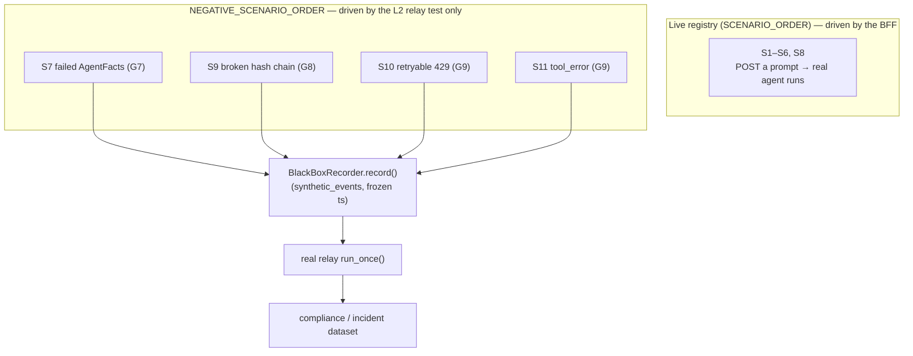

# Recipe 13 — The Gate That Only Ever Says Yes

**Goal:** Close G4, G7, and G8 from the trace-gap review (and prove the already-landed G9 runtime in the *dataset*). Make the compliance dataset contain the failure shapes a healthy run never produces — a broken hash chain, a rejected verification, a retryable/tool error — so the gates are *demonstrably* exercised instead of merely assumed to work. Then stamp every bundle and terminal event with a `bundle_schema_version` so the coexisting `task_completed` shapes self-identify.

**Status:** Trace Gap Closure — Phase 5 (G7/G8) + Phase 2 (G4) | 12 negative-path tests in [`tests/middleware/sidecars/test_compliance_dataset.py`](../../tests/middleware/sidecars/test_compliance_dataset.py) §F + `TestBundleSchemaVersion` / `TestComplianceSummaryBlock` in [`tests/services/governance/test_black_box_export.py`](../../tests/services/governance/test_black_box_export.py) | Follows Recipe 11 (outcome correctness) and Recipe 12 (judge / span order / dedup)

**Prerequisite:** [`11_outcome_correctness_tdd_hardening.md`](11_outcome_correctness_tdd_hardening.md) (where `termination_reason` / `goal_met` were added — the additions that *made versioning necessary*) and [`guardrails/09_rail_observability_and_determinism.md`](guardrails/09_rail_observability_and_determinism.md) (the companion gap: rails invisible on a clean pass)

---

## Before We Start: A Story

A compliance auditor walks into the room holding a printout of the agent's last 10,000 traces. Every single one is green. Zero `ERROR_OCCURRED`. Zero broken hash chains. Zero rejected identity verifications. The on-call engineer beams: *"See? The gates work."*

The auditor does not smile back. She asks one question: *"Show me a trace where a gate said no."*

There isn't one. Not because the agent is perfect — but because **nothing in the test suite ever made a gate fire.** A dataset with zero failures is not evidence the gates work. It is evidence they were never tested. A smoke detector that has never once beeped could be a well-built detector in a safe house — or it could have a dead battery. From the outside, the two are *byte-identical*. This is [TAP-4 Gap Blindness](../../AGENTS.md): when your success tests outnumber your failure tests, the most dangerous gate in the system — the one that silently accepts everything — looks exactly like the one that works.

There is a second, quieter problem hiding in that pristine printout. Recipe 11 enriched the `task_completed` event with `termination_reason` and `goal_met`. But the *rejected* paths (a failed AgentFacts check, a budget abort) emit a **leaner** `task_completed` — no `goal_met`, no `criteria_met`. And the older minimal shape predates both. So three different `task_completed` shapes now coexist in one dataset, and a consumer reading `event["details"]["goal_met"]` cannot tell whether a missing key means "the task didn't meet its goal" or "this shape never had that key." The data lies by omission.

This recipe fixes both. We **manufacture the failures** the gates are supposed to catch — as `kind="synthetic"` traces, because you cannot *prompt* an agent into corrupting its own hash chain — and drive them through the real relay so the dataset finally contains red. And we stamp a `bundle_schema_version` on every bundle and terminal event so the three shapes announce which they are.

---

## Lesson 1 — Why these failures must be synthetic (the TAP-4 fix, structurally)

The live scenarios S1–S6/S8 are driven by POSTing a prompt to the BFF and letting the real agent run. That works for the happy path and even for *some* failures (S5 exhausts retries; S3's shell command errors and recovers). But three gate-failure modes are **undrivable from a prompt**:

- You cannot ask the agent to **fail its own `AgentFacts` verification** — that gate fires *before* any model call, on identity it controls.
- You cannot ask it to **corrupt its own hash chain** — the chain is computed by the recorder, post-hoc, over bytes the agent never sees.
- You can provoke a 429, but not *deterministically* in CI without a live, flaky model.

So they are modelled as `kind="synthetic"` scenarios: a frozen list of `SyntheticEvent`s recorded **directly** through `BlackBoxRecorder`, then driven through the real relay. Critically, they are kept **out of** the live registry so the BFF harness never tries to drive a trace it cannot produce:

```577:589:tests/synthetic/blackbox/dataset.py
NEGATIVE_SCENARIOS: dict[ScenarioID, Scenario] = {
    ScenarioID.S7: S7,
    ScenarioID.S9: S9,
    ScenarioID.S10: S10,
    ScenarioID.S11: S11,
}

NEGATIVE_SCENARIO_ORDER: list[ScenarioID] = [
    ScenarioID.S7,
    ScenarioID.S9,
    ScenarioID.S10,
    ScenarioID.S11,
]
```

The synthetic events are *faithful stand-ins* — each `details` payload mirrors the exact shape `react_loop` emits at runtime — so the trace the relay processes is indistinguishable from a real one. The only difference is provenance: recorded directly instead of produced by a live run.



> **Why not just lower a flag to make the live agent fail its own verification?** Because a backdoor that forces a gate to fail is a backdoor that can force a gate to *pass* — and now the test suite ships an attack surface. Worse, it tests the backdoor, not the gate. Recording a faithful synthetic trace exercises the *exact same* relay/export/routing code the runtime uses, with zero new production code path. The failure is real; only its origin is staged.

> **Checkpoint question:** Why are the negative scenarios excluded from `ALL_SCENARIOS` / `SCENARIO_ORDER` rather than just skipped with a marker inside the live harness?
>
> *Answer:* Because the live harness's contract is "every scenario in the order is POSTable to the BFF." A synthetic trace has no `bff_payload` that would produce it, so including-then-skipping would either crash the driver or normalize a class of "expected skips" that hides real regressions. Keeping them in a separate registry makes the boundary structural: the live driver literally cannot reach an undrivable trace, and the L2 test owns them exclusively.

---

## Lesson 2 — The broken hash chain (G8)

A "clean success" sitting on a **tampered** chain is the most insidious corrupt-success there is: the outcome says `success`, `goal_met` is `True`, and the evidence underneath it has been altered. S9 records a valid 4-event chain and then zeroes the integrity hash of the middle `step_executed` event:

```415:433:tests/synthetic/blackbox/dataset.py
    kind="synthetic",
    synthetic_events=(
        SyntheticEvent("task_started", {"task": "tampered-evidence task"}, step=0),
        SyntheticEvent("model_selected", {"model": "fast-tier"}, step=0),
        SyntheticEvent("step_executed", {"action": "answer", "tampered_target": True}, step=1),
        SyntheticEvent(
            "task_completed",
            {
                "bundle_schema_version": "2",
                "outcome": "success",
                "goal_met": True,
                "step_count": 1,
                "total_cost_usd": 0.0,
            },
            step=2,
        ),
    ),
    corrupt_event_index=2,
    expected_broken_chain=True,
```

`export()` already verifies the chain on read and reports the **first** break location so an auditor can jump straight to the tamper point — it does not just return a boolean:

```132:142:services/governance/black_box.py
        return {
            "bundle_schema_version": BUNDLE_SCHEMA_VERSION,
            "workflow_id": workflow_id,
            "event_count": len(events),
            "events": events,
            "hash_chain_valid": chain_valid,
            "broken_at_event_id": broken_at_event_id,
            "broken_expected_hash": broken_expected_hash,
            "broken_actual_hash": broken_actual_hash,
            "exported_at": datetime.now(UTC).isoformat() if events else None,
        }
```

The relay routes a broken-chain bundle to `agent-incident-replay` (not the audit dataset) and attaches a `hash_chain_valid` score of `0.0`. The pure-bundle assertion proves both the boolean *and* the jump-to-tamper id:

```577:597:tests/synthetic/blackbox/langfuse_assertions.py
def assert_broken_chain_bundle(bundle: dict[str, Any]) -> list[AssertionResult]:
    """G8: a tampered chain must report ``hash_chain_valid=False`` and name the
    first broken event so an auditor can jump straight to the tamper point."""
    results: list[AssertionResult] = []

    chain_valid = bundle.get("hash_chain_valid")
    results.append(AssertionResult(
        passed=chain_valid is False,
        description=f"hash_chain_valid is False (got {chain_valid!r})",
    ))

    broken_at = bundle.get("broken_at_event_id")
    results.append(AssertionResult(
        passed=bool(broken_at),
        description=(
            f"broken_at_event_id populated ({broken_at!r})"
            if broken_at
            else "broken_at_event_id MISSING on a broken chain"
        ),
    ))
    return results
```

And the test pins that the named break location is *exactly* the event the harness corrupted — not just "some event":

```576:592:tests/middleware/sidecars/test_compliance_dataset.py
    def test_broken_chain_routes_to_incident_with_break_location(
        self, storage: Path, exporter: FakeExporter, compliance_publisher: FakeCompliancePublisher
    ) -> None:
        scenario = NEGATIVE_SCENARIOS[ScenarioID.S9]
        wf_id, broken_event_id = _materialize_scenario(storage, scenario)

        relay = _build_relay(storage, exporter, compliance_publisher)
        relay.run_once()

        item = _published_item(compliance_publisher, wf_id)
        routing = assert_dataset_routing(item["dataset_name"], scenario.compliance)
        assert routing.passed, routing.description

        bundle = item["input_data"]
        failures = [r for r in assert_broken_chain_bundle(bundle) if not r.passed]
        assert not failures, "\n".join(f.description for f in failures)
        assert bundle["broken_at_event_id"] == broken_event_id
```

> **Why not let the broken-chain bundle go to the normal audit dataset with a low score and call it a day?** Because integrity failure is categorically different from task failure. A failed *task* with an intact chain (S5) is still trustworthy evidence — the audit dataset is the right home. A *broken chain* means the evidence itself is suspect; routing it to `agent-incident-replay` keeps the audit dataset's invariant ("every item here is verifiable") true. Collapsing the two would let one tampered trace quietly poison the trustworthy corpus.

> **Checkpoint question:** S9's `task_completed` says `outcome: "success"`. Why does it still route to `agent-incident-replay` instead of `agent-compliance-audit`?
>
> *Answer:* Integrity routing overrides outcome routing. `hash_chain_valid` is computed from the bytes, independent of what the terminal event *claims*. A success outcome on a broken chain is precisely the corrupt-success the gate exists to catch, so the broken chain wins and the bundle goes to the incident dataset with score `0.0`.

---

## Lesson 3 — The rejected verification (G7)

When `AgentFacts` verification fails, `guard_input_node` emits a rejected `task_completed` *before any model call* and returns early. This is the shape S7 faithfully reproduces:

```489:502:orchestration/react_loop.py
                if not agent_facts_verified:
                    black_box.record(TraceEvent(
                        event_id=str(uuid.uuid4()),
                        workflow_id=workflow_id,
                        event_type=EventType.TASK_COMPLETED,
                        timestamp=datetime.now(UTC),
                        details={
                            "bundle_schema_version": BUNDLE_SCHEMA_VERSION,
                            "outcome": "rejected",
                            "reason": "agent_facts_verification_failed",
                            "step_count": 0,
                            "total_cost_usd": 0.0,
                        },
                    ))
```

Here the chain is **intact** — the *task* was rejected, not the *recording* — so the bundle routes to the audit dataset with score `1.0`. The proof that the gate fired lives in the top-level `summary` block (the G6-residual lift from Recipe 11/this plan's Phase 4), so a reviewer sees `outcome=rejected` without walking `events[]`:

```600:621:tests/synthetic/blackbox/langfuse_assertions.py
def assert_rejected_outcome(
    bundle: dict[str, Any],
    expected_reason: str | None = None,
) -> list[AssertionResult]:
    """G7: a rejected terminal outcome must surface in the summary block so a
    reviewer sees the gate fired without walking ``events[]``."""
    results: list[AssertionResult] = []
    summary = bundle.get("summary") or {}

    outcome = summary.get("outcome")
    results.append(AssertionResult(
        passed=outcome == "rejected",
        description=f"summary.outcome == 'rejected' (got {outcome!r})",
    ))

    if expected_reason is not None:
        reason = summary.get("reason")
        results.append(AssertionResult(
            passed=reason == expected_reason,
            description=f"summary.reason == {expected_reason!r} (got {reason!r})",
        ))
    return results
```

The test asserts the *failure path first* — that the rejection surfaces (`TestG7FailedAgentFactsTrace.test_rejected_outcome_surfaced_in_summary`) — and only then the boundary condition that the rejected trace's chain is still `1.0` (`test_rejected_trace_chain_is_intact`). That ordering is deliberate: the dangerous regression is a rejection that *doesn't* show up, so it is tested before the "and the chain stayed intact" corollary.

> **Why not just look for the `guardrail_checked{verified: false}` event in `events[]` and skip the summary?** Because that forces every consumer — every dashboard, every auditor's eyeball — to re-implement the walk-and-find logic, and to know the *exact* event shape. The summary block is the shape-stable contract: `outcome` is always present (it's `None` for a trace that never completed), so a consumer branches on one flat field instead of pattern-matching the events array. Burying the signal in `events[]` is the same [G2-style invisibility](guardrails/09_rail_observability_and_determinism.md) this program keeps killing.

> **Checkpoint question:** S7 and S9 both represent a "bad" run. Why does S7 route to `agent-compliance-audit` (score 1.0) while S9 routes to `agent-incident-replay` (score 0.0)?
>
> *Answer:* They fail at different layers. S7 is a *task* rejection on an *intact* recording — the evidence is trustworthy, it just records a "no," so it belongs in the audit corpus. S9 is a *recording* tampering — the evidence is suspect regardless of outcome, so it is quarantined in the incident dataset. Outcome ≠ integrity; the routing keeps them separate.

---

## Lesson 4 — Proving G9 in the dataset (retryable + tool_error)

G9's *runtime* already landed (Recipe 8 / the redaction PR): shell returns `ok=False` on non-zero exit, and `react_loop` emits `ERROR_OCCURRED` when `not execution_result.ok`. But the trace review found the *dataset* had zero `ERROR_OCCURRED` items — the runtime worked, yet nothing proved it where the auditor looks. S10 (a 429 `retryable`) and S11 (a `tool_error`) close that observability gap by landing the error shapes in the dataset:

```476:491:tests/synthetic/blackbox/dataset.py
        SyntheticEvent(
            "task_completed",
            {
                "bundle_schema_version": "2",
                "outcome": "failure",
                "error_type": "retryable",
                "step_count": 1,
                "total_cost_usd": 0.0,
            },
            step=1,
        ),
    ),
    expected_outcome="failure",
    expected_error_types=("retryable",),
    notes="ERROR_OCCURRED present + terminal error_type non-null proves the 429 "
    "path is observable in the dataset, not just in the running process.",
```

The assertion requires both halves — the `error.occurred` event *and* a non-null terminal `error_type` (optionally one of the expected values) — because either alone is a half-truth:

```624:655:tests/synthetic/blackbox/langfuse_assertions.py
def assert_error_trace_present(
    bundle: dict[str, Any],
    expected_error_types: list[str] | tuple[str, ...] = (),
) -> list[AssertionResult]:
    """G9: an ``error.occurred`` event must exist and the terminal event must
    carry a non-null ``error_type`` (optionally one of *expected_error_types*)."""
    results: list[AssertionResult] = []

    error_events = [
        ev for ev in _bundle_events(bundle)
        if ev.get("event_type") == "error_occurred"
    ]
    results.append(AssertionResult(
        passed=len(error_events) >= 1,
        description=f"error.occurred present ({len(error_events)} event(s))",
    ))

    error_type = _last_terminal_details(bundle).get("error_type")
    results.append(AssertionResult(
        passed=error_type is not None,
        description=f"terminal error_type non-null (got {error_type!r})",
    ))

    if expected_error_types:
        results.append(AssertionResult(
            passed=error_type in expected_error_types,
            description=(
                f"terminal error_type in {list(expected_error_types)} "
                f"(got {error_type!r})"
            ),
        ))
    return results
```

A single parametrized test drives both S10 and S11 through the real relay, and a sibling asserts the relay still ships `error.occurred` to telemetry at `__bb_level == "ERROR"` — so the error is visible on *both* the dataset and the trace.

> **Why model S11 (`tool_error`) separately from S3 (the live "tool error + recovery")?** Because they are different *terminal* states. In S3 the tool errors and the agent recovers, so the run ends `success` and `error_type` never survives onto `task_completed`. S11 is a *terminal* tool failure: the `error_type` rides all the way to the terminal event. Testing only S3 would prove the recovery path while leaving the "tool error is fatal" path — the one that should set `error_type` on completion — entirely unexercised. Same TAP-4 trap, one level down.

> **Checkpoint question:** Why does the assertion check the terminal `error_type` *in addition to* the presence of an `error.occurred` event, rather than trusting one to imply the other?
>
> *Answer:* They cover different failures. An `error.occurred` with no terminal `error_type` means the error fired but the classifier never tagged the outcome (a lost signal at completion). A terminal `error_type` with no `error.occurred` means the outcome claims an error that left no evidence event. Requiring both makes the two ends of the error path consistent — neither can drift without the test catching it.

---

## Lesson 5 — Versioning the bundle so the shapes self-identify (G4)

Recipe 11 is what *created* this problem: by enriching the rich `task_completed` with `goal_met` / `criteria_met` / `termination_reason`, it left the rejected and budget paths emitting a leaner shape and the legacy minimal shape unchanged. Three shapes, one dataset, no way to tell them apart from the keys alone. The fix is a single constant, stamped everywhere a terminal event or bundle is produced:

```21:25:services/governance/black_box.py
# G4: every export bundle and terminal ``task_completed`` event self-identifies
# with this version so the (currently three) coexisting ``task_completed`` shapes
# in a single dataset are no longer ambiguous. Bump when the bundle/terminal-event
# shape changes; consumers branch on it instead of guessing from present keys.
BUNDLE_SCHEMA_VERSION = "2"
```

It rides on the export bundle (Lesson 2's snippet, top field) *and* on every terminal `task_completed` details — the rich path, and each rejected path (agent-facts in Lesson 3, plus guardrail and budget). The synthetic scenarios stamp it too (`"bundle_schema_version": "2"` in every S7/S9/S10/S11 terminal event), so the fixtures can never drift from the runtime.

`TestBundleSchemaVersion` locks that the field is **present, stable, and inherited** by `export_for_compliance()`; `TestComplianceSummaryBlock` locks the companion summary lift (failure paths first: no-terminal, rejected, budget — *then* the rich lift and the base-export boundary).

> **Why a bare string `"2"` and not a semver like `"2.0.0"` or a richer object?** Because the consumer's only question is "which of the known shapes is this?", a monotonically-bumped opaque token answers it with zero parsing. Semver implies a compatibility contract (major/minor/patch) the bundle doesn't actually offer, and an object invites consumers to branch on sub-fields and re-introduce the guessing the version was meant to end. Per AGENTS.md "Ask first," the constant's *placement* (in `services/governance/black_box.py`, the bundle's producing layer) was the sign-off item — it lives with the shape it versions, not in a shared kernel it doesn't belong to.

> **Checkpoint question:** Why stamp the version on *both* the export bundle and each individual `task_completed` event, rather than just on the bundle wrapper?
>
> *Answer:* The two are read in different places. The bundle field answers "what shape is this export?" for a compliance reader. The per-event field answers "what shape is this terminal event?" for anyone reading a *raw* `trace.jsonl` line outside an export (the relay, a replay, a forensic grep). A terminal event that travels without its version is ambiguous again the moment it leaves the bundle — so each event self-identifies independently.

---

## Lesson 6 — Pure-bundle assertions and the failure-mode matrix

Every assertion in this recipe operates on a **compliance bundle dict** — the thing published as a dataset item's `input_data` — not on a live Langfuse query. That is what makes them CI-safe and zero-flake: no network, no SDK, no eventual-consistency polling. The §F test materializes each synthetic scenario, runs the **real** relay once, and asserts on the published bundle:

```527:559:tests/middleware/sidecars/test_compliance_dataset.py
def _materialize_scenario(storage: Path, scenario: Scenario) -> tuple[str, str | None]:
    """Record a synthetic scenario's trace, optionally tampering the chain.

    Returns ``(workflow_id, broken_event_id)`` where ``broken_event_id`` is the
    event whose stored integrity hash was zeroed (None when no corruption).
    The byte offset is reset to 0 so the relay reads the whole trace.
    """
    wf_id = scenario.id.value
    recorder = BlackBoxRecorder(storage_dir=storage)
    base_ts = datetime(2026, 5, 28, 12, 0, 0, tzinfo=UTC)
    for i, ev in enumerate(scenario.synthetic_events):
        recorder.record(TraceEvent(
            event_id=str(uuid.uuid4()),
            workflow_id=wf_id,
            event_type=EventType(ev.event_type),
            timestamp=base_ts,
            step=ev.step,
            details=dict(ev.details),
        ))

    broken_event_id: str | None = None
    if scenario.corrupt_event_index is not None:
        trace_file = storage / wf_id / "trace.jsonl"
        lines = trace_file.read_text().strip().split("\n")
        idx = scenario.corrupt_event_index
        event_data = json.loads(lines[idx])
        broken_event_id = event_data.get("event_id")
        event_data["integrity_hash"] = "0" * 64
        lines[idx] = json.dumps(event_data, default=str)
        trace_file.write_text("\n".join(lines) + "\n")

    (storage / wf_id / ".langfuse_offset").write_text("0")
    return wf_id, broken_event_id
```

This is [Pattern 11 — the failure-mode matrix](../../research/tdd_agentic_systems_prompt.md) from the agentic testing pyramid: rather than one happy-path test per feature, you enumerate the failure shapes (broken chain, rejected, retryable, tool_error) and assert each lands correctly. `TestNegativeScenarioEventCoverage` then closes the loop — every event a scenario *declares* must actually appear in the published bundle, so the dataset definition and the materialized trace can never silently drift apart.

The whole §F block is ordered failure-paths-first (broken chain → rejected → errors → coverage), the inverse of the dangerous default where success tests pile up and the gate-failure modes go untested.

> **Checkpoint question:** `_materialize_scenario` resets `.langfuse_offset` to `"0"` before running the relay. What would happen to the negative-path coverage if it didn't?
>
> *Answer:* The relay tracks how far it has read with a byte offset. If the offset weren't reset to the start, a re-run (or a leftover offset from a prior materialization in the same dir) would skip the freshly-recorded events, the relay would publish nothing, and `_published_item` would assert "No dataset item published" — or worse, silently pass against a stale bundle. Resetting to `0` guarantees the relay reads the *whole* synthetic trace exactly as a first-time tail would.

---

## Run It Yourself

```bash
# The 12 negative-path gate-failure tests (§F) — broken chain, rejected,
# retryable/tool errors, event coverage. -p no:logfire avoids the local
# logfire/opentelemetry import clash in this environment.
python -m pytest -p no:logfire tests/middleware/sidecars/test_compliance_dataset.py -q

# G4 schema version + the G6-residual summary lift
python -m pytest -p no:logfire tests/services/governance/test_black_box_export.py -q

# Architecture boundaries hold (synthetic dataset adds no forbidden imports)
python -m pytest -p no:logfire tests/architecture/ -q

# Inspect a broken-chain bundle directly — note hash_chain_valid=False and the
# named break location, even though the terminal outcome claims success.
python -c "
import json, tempfile, uuid
from datetime import UTC, datetime
from pathlib import Path
from services.governance.black_box import BlackBoxRecorder, EventType, TraceEvent
d = Path(tempfile.mkdtemp())
rec = BlackBoxRecorder(storage_dir=d)
for et, det in [('task_started', {'task':'x'}), ('step_executed', {'action':'answer'}),
                ('task_completed', {'outcome':'success','goal_met':True})]:
    rec.record(TraceEvent(event_id=str(uuid.uuid4()), workflow_id='wf', event_type=EventType(et),
                          timestamp=datetime.now(UTC), details=det))
f = d/'wf'/'trace.jsonl'; lines = f.read_text().strip().split(chr(10))
ev = json.loads(lines[1]); ev['integrity_hash'] = '0'*64; lines[1] = json.dumps(ev)
f.write_text(chr(10).join(lines)+chr(10))
b = rec.export_for_compliance('wf')
print('hash_chain_valid:', b['hash_chain_valid'])
print('broken_at_event_id:', b['broken_at_event_id'])
print('summary.outcome:', b['summary']['outcome'], '| schema:', b['bundle_schema_version'])
"
# -> hash_chain_valid: False
# -> broken_at_event_id: <uuid of the tampered step_executed event>
# -> summary.outcome: success | schema: 2

# Confirm every terminal/bundle shape self-identifies with the same version
python -c "from services.governance.black_box import BUNDLE_SCHEMA_VERSION; print('schema:', BUNDLE_SCHEMA_VERSION)"
```

---

## Status Banner

**Phase 5 (G7/G8) + Phase 2 (G4) — landed.** The compliance dataset now contains the failure shapes a healthy run never produces: a broken hash chain (S9 → `agent-incident-replay`, `hash_chain_valid=0`, `broken_at_event_id` populated), a rejected AgentFacts verification (S7 → audit dataset, `summary.outcome=rejected`), and retryable/tool errors (S10/S11 → `ERROR_OCCURRED` + non-null terminal `error_type`). G9's runtime was already live; these prove it in the dataset. Every bundle and terminal event carries `bundle_schema_version="2"`. 12 negative-path tests in `tests/middleware/sidecars/test_compliance_dataset.py` §F + `TestBundleSchemaVersion` / `TestComplianceSummaryBlock`, all green; architecture suite green.

---

## For a General Audience

Six transferable patterns, useful well beyond this codebase:

1. **A dataset with zero failures is not proof the gates work — it is proof they were never tested.** A smoke detector that has never beeped and a dead one look identical from the outside. Manufacture the failures your gates are supposed to catch.
2. **When a failure can't be triggered honestly, stage it faithfully — never via a backdoor.** A flag that *forces* a gate to fail is an attack surface and tests the flag, not the gate. Record a faithful synthetic trace and drive it through the *real* pipeline instead.
3. **Keep undrivable test cases in their own registry.** If a fixture can't be produced by the normal entrypoint, don't smuggle it into the live path with a skip — make the boundary structural so the driver literally cannot reach it.
4. **Route on the failure's *layer*, not its label.** A failed task with trustworthy evidence and a tampered recording are both "bad," but they belong in different places. Integrity failure quarantines; task failure audits. Don't let one poison the other.
5. **Assert both ends of a failure path.** An error event without a tagged outcome, or a tagged outcome without an error event, are each half-truths. Require both so neither end can drift silently.
6. **Version a shape the moment a second shape appears.** A missing key is ambiguous — "absent value" or "this shape never had it?" A monotonic version token on every record (not just the wrapper) lets consumers branch instead of guess.

---

## What Comes Next

With the rails observable (Recipe 9) and the gate-failure modes finally exercised (this recipe), the trace-gap program's code-fixable items are closed. The remaining work is operational, not code: purge the leaked dataset items and rotate the exposed key (G1-ops), then re-run the deployed export and confirm `[REDACTED]` is present and the raw secrets are absent per [`guardrails/08_telemetry_redaction_validation_walkthrough.md`](guardrails/08_telemetry_redaction_validation_walkthrough.md). See the [trace gap closure plan](../plans/trace_gap_closure.plan.md) for the operational checklist.
