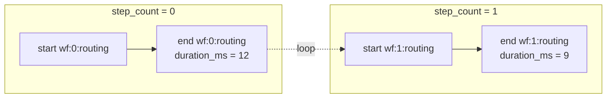
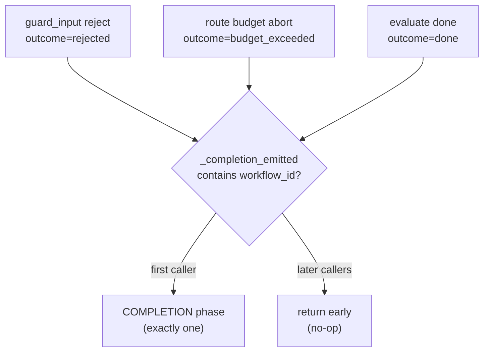

# Recipe 14 — The Recording With No Chapters

**Goal:** Give the black box a *timeline of reasoning phases*. The flight recorder from [Recipe 0](governance/00_overview.md) already captures **what** happened — every model selected, every tool called, every error. This recipe wires in the **PhaseLogger**: a second, parallel recording that marks **when** each reasoning phase began and ended, how long it took, and stitches the two recordings together with a shared `decision_id`. The compliance bundle that [Recipe 13](13_negative_path_traces_and_schema_versioning.md) learned to version now carries a `phase_events[]` track — the Reasoning pillar of the governance triangle, finally persisted.

**Status:** Phase 3 (PhaseLogger Wiring) — landed | 155 green across [`tests/services/test_governance.py`](../../tests/services/test_governance.py), [`tests/orchestration/test_phase_wiring.py`](../../tests/orchestration/test_phase_wiring.py), [`tests/services/governance/test_black_box_export.py`](../../tests/services/governance/test_black_box_export.py), [`tests/services/governance/test_black_box_publisher.py`](../../tests/services/governance/test_black_box_publisher.py), [`tests/middleware/sidecars/test_compliance_dataset.py`](../../tests/middleware/sidecars/test_compliance_dataset.py) | Implements the sprint board [`docs/plans/phase_3_phaselogger_sprint_board.md`](../plans/phase_3_phaselogger_sprint_board.md)

**Prerequisite:** [`13_negative_path_traces_and_schema_versioning.md`](13_negative_path_traces_and_schema_versioning.md) (where `bundle_schema_version` was born — the same versioning discipline this recipe reuses for `phase_log_schema_version`) and the BlackBox tutorial [`governanaceTriangle/02_black_box_recording_debugging.md`](../../governanaceTriangle/02_black_box_recording_debugging.md).

---

## Before We Start: A Story

When investigators pull a black box from a crash site, the raw flight data recorder is not what they read first. It is a single, undifferentiated stream of thousands of parameter samples — altitude, airspeed, control surface positions — all timestamped, all true, and almost unreadable. The first thing an investigator does is **segment the recording into phases of flight**: taxi, takeoff roll, climb, cruise, descent, approach, landing. Only once the stream has *chapters* can anyone ask the questions that matter: *How long was the climb? Did the anomaly start in cruise or on descent? Which phase was the aircraft in when the warning fired?*

Now look at your agent's black box. The `BlackBoxRecorder` writes a beautiful, SHA-256-chained `trace.jsonl` — 47 events, tamper-evident, audit-grade. But it is one long stream with no chapters. You can see a `MODEL_SELECTED` event and an `ERROR_OCCURRED` event, but you cannot ask "how long did routing take on step 3?" or "was the agent in the *evaluation* phase or the *tool-execution* phase when it stalled?" The recording captures **what**. It has no idea **when** — not in clock time (the timestamps are there) but in *phase* time.

There was a `PhaseLogger` class in the codebase that *looked* like it solved this. It had a `WorkflowPhase` enum with nine values and `start_phase`/`end_phase` methods. But it was a beautiful façade: those methods only wrote to the Python `logging` module. Nothing was persisted. Nothing was wired into the ReAct loop. The orchestrator instantiated a `PhaseLogger` and then never called `start_phase` even once. The chapters existed as an *idea* and as log lines that scrolled past and vanished.

This recipe makes the chapters real — persisted to disk, joined to the black box, redacted, and shipped to Langfuse — without breaking the one consumer that was already reading the PhaseLogger's *other* output (routing decisions). That last constraint is the whole reason the design looks the way it does.

---

## Lesson 1 — Why phases get their own file (the breakage that shaped everything)

The naïve move is to append phase boundaries into the file the PhaseLogger already writes: `decisions.jsonl`. Don't. That file has a live consumer with a strict contract.

`ExplainabilityService.get_compliance_bundle` constructs a `PhaseLogger`, calls `export_workflow_log()`, and validates **every row** as a Pydantic `DecisionRecord`. Rows that don't validate are logged and **silently dropped**. So if you mix a `{"event": "phase_start", ...}` record into `decisions.jsonl`, it fails `DecisionRecord` validation and *disappears* — your phase boundary is swallowed by the very pipeline meant to surface it.

The fix is a **split-file contract**: phase boundaries get a brand-new `phases.jsonl`; `decisions.jsonl` is never touched.

```5:12:services/governance/phase_logger.py
Storage layout (split-file contract — Phase 3 schema gate):
  - ``decisions.jsonl``: routing/evaluation decisions only (``export_workflow_log``).
  - ``phases.jsonl``: phase boundary events only (``export_phase_events``).

``phases.jsonl`` row shape (``phase_log_schema_version`` ``"1"``):
  ``{ "event": "phase_start"|"phase_end", "workflow_id", "step_count",
  "phase", "outcome"?, "duration_ms"?, "timestamp" }``
```

Two export methods, two files, zero overlap:

```207:227:services/governance/phase_logger.py
    def export_workflow_log(self, workflow_id: str) -> list[dict]:
        """Return decision records from ``decisions.jsonl`` only (never phase events)."""
        log_file = self._storage_dir / workflow_id / "decisions.jsonl"
        if not log_file.exists():
            return []
        entries = []
        for line in log_file.read_text().strip().split("\n"):
            if line:
                entries.append(json.loads(line))
        return entries

    def export_phase_events(self, workflow_id: str) -> list[dict]:
        """Return phase boundary records from ``phases.jsonl``."""
        log_file = self._storage_dir / workflow_id / "phases.jsonl"
        if not log_file.exists():
            return []
        entries: list[dict] = []
        for line in log_file.read_text().strip().split("\n"):
            if line:
                entries.append(json.loads(line))
        return entries
```

> **Why not a single file with a discriminated union (`type` field) and one export method that filters?** Because it forces a code change in a place that already has a passing consumer contract. A union means `export_workflow_log()` must learn to *exclude* phase rows, and any consumer that ever did a raw `json.loads` over the file (the relay, a forensic grep) now has to know the discriminator. The split keeps the old file byte-for-byte identical — the safest possible change to a contract someone else depends on. The cost is one extra file and one extra method; the benefit is that `DecisionRecord`/Zod baseline never moves.

> **Checkpoint question:** If a phase boundary were accidentally written into `decisions.jsonl`, would the test suite catch it loudly, or would it fail silently in production?
>
> *Answer:* Silently in production. `ExplainabilityService` validates each row as a `DecisionRecord` and **drops** invalid rows with a log line — no exception, no test failure unless a test specifically asserts the phase row *survives*. That silent-drop behavior is precisely why the split is structural rather than a runtime filter: the safest contract is the one you cannot violate by accident.

---

## Lesson 2 — Per-step keying, or why "ROUTING" is not one phase

A ReAct loop is a loop. The graph cycles `evaluate → route → call_llm → ...`, so `ROUTING`, `MODEL_INVOCATION`, and `EVALUATION` each fire *once per step*. If you key an open phase by name alone (`"routing"`), step 1's `start_phase("routing")` overwrites step 0's still-open start, and the duration math is garbage — you'd measure from step 1's start to step 0's end, or lose the boundary entirely.

The key includes the step:

```69:71:services/governance/phase_logger.py
    @staticmethod
    def _phase_key(workflow_id: str, step_count: int, phase: WorkflowPhase) -> str:
        return f"{workflow_id}:{step_count}:{phase.value}"
```

Now `wf-7:0:routing` and `wf-7:1:routing` are independent entries in the `_phase_starts` dict, each with its own start timestamp, each producing an honest `duration_ms`.



> **Why not just disallow re-entering a phase, or stack them?** A stack would conflate two *semantically distinct* routing decisions (step 0 chose the fast tier; step 1 re-evaluated and chose the same) into one nested span, hiding the per-step cost. Disallowing re-entry would mean the loop simply can't be measured. Per-step keying treats each loop iteration's phase as the first-class thing it actually is: a separate, individually-timed unit of work.

> **Checkpoint question:** The test `test_routing_phase_step_count_on_second_loop` asserts `0 in step_counts` for ROUTING ends. Why assert on the *set* of step counts rather than a fixed count of routing phases?
>
> *Answer:* Because the number of loop iterations depends on the mocked LLM's behavior and isn't deterministic across environments — but the *independence* of step keys is. Asserting that step 0 is present (and that ends exist) proves the keying works without coupling the test to an exact iteration count, which would be [determinism theater](../../AGENTS.md) (TAP-3).

---

## Lesson 3 — The `PhaseTracker` context manager (balancing the books on every early return)

A node has many exits: a clean return, an early return on rejection, an exception. If you hand-write `start_phase(...)` at the top and `end_phase(...)` at the bottom, every early `return` in between leaks an unbalanced start — a chapter that opens and never closes. The fix is an async context manager that guarantees the close:

```188:205:services/governance/phase_logger.py
    @asynccontextmanager
    async def phase(
        self,
        workflow_id: str,
        phase: WorkflowPhase,
        step_count: int = 0,
        *,
        outcome: str = "ok",
    ) -> AsyncIterator[None]:
        """Async context manager that balances start/end even on exceptions."""
        self.start_phase(workflow_id, phase, step_count)
        try:
            yield
        except Exception:
            self.end_phase(workflow_id, phase, "error", step_count)
            raise
        else:
            self.end_phase(workflow_id, phase, outcome, step_count)
```

In the orchestrator, every node boundary becomes a single line — satisfying [AP-5](../../AGENTS.md) (orchestration nodes hold no domain logic):

```473:473:orchestration/react_loop.py
        async with phase_logger.phase(workflow_id, WorkflowPhase.INITIALIZATION, step_count):
```

The exception branch re-raises after recording `outcome="error"`. That matters: the context manager is *observability*, not *error handling*. It records the failure and gets out of the way so the real error propagates unchanged.

> **Why not a `try/finally` that always ends with the same outcome?** Because `finally` can't distinguish a clean exit from an exceptional one — it would stamp every phase `"ok"` even when the body raised. The `except/else` split lets the chapter record *why* it closed: `"ok"` on the happy path, `"error"` when the body blew up, and a caller-supplied `outcome` (like `"rejected"` or `"budget_exceeded"`) for domain terminal states.

> **Checkpoint question:** The CM re-raises in the `except` branch. What would break if it swallowed the exception instead?
>
> *Answer:* The entire downstream error pipeline. The node's caller relies on the exception (or the recorded error outcome) to route retries, classify the failure, and emit `ERROR_OCCURRED`. A CM that swallowed would turn every crashed phase into a silent `"error"` chapter while the agent blithely continued on corrupt state — observability masking a bug instead of revealing it.

---

## Lesson 4 — The cross-pillar join: one `decision_id`, two pillars

The black box (Recording pillar) and the PhaseLogger (Reasoning pillar) are separate files. To answer "which routing *decision* produced this `MODEL_SELECTED` event?" you need a shared key. That key is `decision_id`.

Here is the part that deviated from the plan — and why the deviation is correct. The plan called for `decision_id: str = Field(default_factory=...)`. But the factory must be **injectable per `PhaseLogger` instance** (so replay and goldens can pin it deterministically), and a Pydantic class-level `default_factory` cannot reach instance state. So `decision_id` is *lazy* and assigned by a method:

```45:54:services/governance/phase_logger.py
class Decision(BaseModel):
    phase: WorkflowPhase
    description: str
    alternatives: list[str]
    rationale: str
    confidence: float
    decision_id: str | None = Field(
        default=None,
        description="Cross-pillar join key; assigned by PhaseLogger.ensure_decision_id().",
    )
```

```116:120:services/governance/phase_logger.py
    def ensure_decision_id(self, decision: Decision) -> Decision:
        """Assign ``decision_id`` from the injectable factory when not already set."""
        if decision.decision_id is not None:
            return decision
        return decision.model_copy(update={"decision_id": self.decision_id_factory()})
```

`log_decision()` calls `ensure_decision_id()`, so a persisted `decisions.jsonl` row always carries an id. The orchestrator then threads that *same* id into the black box's `MODEL_SELECTED` event:

```752:765:orchestration/react_loop.py
            black_box.record(TraceEvent(
                event_id=str(uuid.uuid4()),
                workflow_id=workflow_id,
                event_type=EventType.MODEL_SELECTED,
                timestamp=datetime.now(UTC),
                step=state.get("step_count", 0),
                details={
                    "model": profile.name,
                    "reason": reason,
                    "plan_depth": planning_depth,
                    "plan_valid": plan_validation.is_valid,
                    "decision_id": decision.decision_id,
                },
            ))
```

Now a join is trivial: find the `MODEL_SELECTED` event, read `details.decision_id`, and look it up in `decisions.jsonl`. Two pillars, one key.

> **Why not `Field(default_factory=lambda: str(uuid.uuid4()))` as the plan said?** Because a class-level default factory is frozen at class-definition time — it can never be the *instance's* `decision_id_factory`, which is the whole point of injectability. With a default factory you'd get a uuid, but you could not swap in `lambda: "decision-1"` for a deterministic test or a replay golden. The lazy `ensure_decision_id()` keeps the id nullable until a `PhaseLogger` (with its chosen factory) assigns it. **Trade-off:** a `Decision` constructed but never passed through `log_decision()`/`ensure_decision_id()` has `decision_id = None` — callers must go through the logger, which they all do.

> **Why MODEL_SELECTED only, and not ROUTING/EVALUATION too?** Because EVALUATION has no paired black-box event today; minting one purely to carry a join key is scope creep. The join is built where a real cross-pillar pair already exists (a routing `Decision` and its `MODEL_SELECTED` event) and deferred everywhere it would require inventing a new event.

> **Checkpoint question:** `decision_id` is a `uuid4`. What does that cost a replay/golden test, and how is it paid?
>
> *Answer:* `uuid4` is non-deterministic, so a golden recorded today won't byte-match a replay tomorrow. It's paid by the injectable `decision_id_factory`: tests construct the `PhaseLogger` with `decision_id_factory=lambda: "stable-id"` (or a counter), making the ids deterministic exactly where determinism is required, while production keeps random uniqueness.

---

## Lesson 5 — COMPLETION fires from three doors, exactly once

A workflow can *end* in three different places: the input guardrail rejects it, the router aborts on budget, or evaluation declares it done. Each is a legitimate `TASK_COMPLETED` site. But the COMPLETION *phase* must close exactly once — three closes would be three chapters titled "The End."

A single-flight guard, closure-scoped to the graph build, solves it:

```419:434:orchestration/react_loop.py
    async def _emit_completion_once(
        workflow_id: str,
        step_count: int,
        outcome: str,
    ) -> None:
        """Record COMPLETION exactly once per workflow (three terminal TASK_COMPLETED sites)."""
        if not workflow_id or workflow_id in _completion_emitted:
            return
        _completion_emitted.add(workflow_id)
        async with phase_logger.phase(
            workflow_id,
            WorkflowPhase.COMPLETION,
            step_count,
            outcome=outcome,
        ):
            pass
```

The three sites each call it with their own outcome — `"rejected"`, `"budget_exceeded"`, `"done"` — and only the first wins. The tests pin this hard: `test_guardrail_reject_emits_completion_once` and `test_budget_exceeded_emits_completion_once` both assert `len(_completion_ends(events)) == 1` *and* that the single completion carries the right outcome.



> **Known limitation (warts-and-all):** `_completion_emitted` is an in-memory `set[str]` that grows one entry per `workflow_id` for the lifetime of the graph object. For the CLI (one workflow per process) this is nothing. For a long-lived server reusing a single compiled graph across thousands of workflows, it is a slow unbounded leak. It is flagged in the [wiring plan's Open Risks](../plans/phase_3_phaselogger_wiring.plan.md); the fix is to evict on COMPLETION or bound it with a TTL/LRU when the graph is shared. Today it's correct and cheap; at server scale it needs a bound.

> **Checkpoint question:** Why guard on `workflow_id` membership rather than, say, a boolean flag on the graph?
>
> *Answer:* Because one graph build serves many workflows. A single boolean would fire COMPLETION for the *first* workflow ever and then suppress it for every subsequent one. The per-`workflow_id` set scopes "exactly once" to each workflow independently — which is also exactly what makes it grow unbounded (the trade-off in the limitation above).

---

## Lesson 6 — The Reasoning pillar reaches Langfuse (relay + redaction, shipped together)

A phase recording that never leaves the cache folder is the same invisibility problem [Recipe 0](governance/00_overview.md) opened with. So the compliance bundle gains a `phase_events[]` track, stamped with its own schema version:

```225:235:services/governance/black_box.py
        bundle["phase_log_schema_version"] = PHASE_LOG_SCHEMA_VERSION

        if phase_logger is not None:
            try:
                bundle["phase_decisions"] = phase_logger.export_workflow_log(workflow_id)
            except Exception as exc:
                logger.warning("Failed to include phase decisions in compliance bundle: %s", exc)
            try:
                bundle["phase_events"] = phase_logger.export_phase_events(workflow_id)
            except Exception as exc:
                logger.warning("Failed to include phase events in compliance bundle: %s", exc)
```

Note the discipline borrowed straight from Recipe 13: `phase_log_schema_version="1"` is **separate** from `BUNDLE_SCHEMA_VERSION="2"`. Phase-event evolution can bump its own version without forcing an unrelated bump on every `task_completed` consumer.

But there was a verified gap: the Langfuse relay called `export_for_compliance(workflow_id)` with no `phase_logger`, so published datasets contained *no* phase records. The relay fix builds a `PhaseLogger` from the sibling `phase_logs` dir and passes it through:

```284:288:middleware/sidecars/black_box_to_telemetry.py
            recorder = BlackBoxRecorder(storage_dir=self._storage_dir)
            phase_logger = PhaseLogger(storage_dir=self._storage_dir.parent / "phase_logs")
            bundle = recorder.export_for_compliance(
                workflow_id, phase_logger=phase_logger
            )
```

**This is where it gets dangerous.** The moment the relay publishes `phase_events[]`, any free-text in a phase record's `details` becomes a fresh PII leak — unless redaction is extended to walk the new track *in the same change*. It was:

```112:138:services/governance/black_box_publisher.py
def _redact_phase_events(phase_events: list[Any]) -> list[Any]:
    """Redact free-text ``details`` on phase boundary records (same rules as events)."""
    redacted: list[Any] = []
    for record in phase_events:
        if isinstance(record, dict) and isinstance(record.get("details"), dict):
            record = {**record, "details": redact_details(record["details"])}
        redacted.append(record)
    return redacted


def redact_compliance_bundle(bundle: dict[str, Any]) -> dict[str, Any]:
    """Redact event and phase-event detail payloads before publishing a compliance bundle."""
    redacted = dict(bundle)
    events = redacted.get("events")
    if isinstance(events, list):
        new_events: list[Any] = []
        for ev in events:
            if isinstance(ev, dict) and isinstance(ev.get("details"), dict):
                ev = {**ev, "details": redact_details(ev["details"])}
            new_events.append(ev)
        redacted["events"] = new_events

    phase_events = redacted.get("phase_events")
    if isinstance(phase_events, list):
        redacted["phase_events"] = _redact_phase_events(phase_events)

    return redacted
```

And the relay publishes through `redact_compliance_bundle(bundle)`, not the raw bundle — both the audit and incident dataset items are scrubbed before they leave the process. The integration test `test_compliance_bundle_exposes_phase_events` asserts the positive shape (`phase_events` present, `phase_log_schema_version == "1"`, `bundle_schema_version == "2"`) *and* the negative (no decision `description` field leaks into a phase record).

> **Why ship the relay fix and the redaction extension in the same PR (risk R4.1)?** Because either one alone is a bug. Redaction without the relay fix scrubs a track nobody publishes — dead code. The relay fix without redaction publishes raw phase `details` straight to Langfuse — a live leak. They are two halves of one safe change; splitting them across PRs creates a window where `main` either does nothing or leaks. Coupling them makes the safe state the only state.

> **Checkpoint question:** `export_for_compliance` wraps each phase-logger call in its own `try/except` that logs and continues. Why not let a phase-export failure abort the whole bundle?
>
> *Answer:* Because the phase track is *additive* — a bundle without `phase_events[]` is still a valid, useful compliance bundle (the Recording pillar is intact). Aborting would let a transient `phases.jsonl` read error take down the entire export, sacrificing the trustworthy black-box evidence to protect an optional enrichment. Degrade gracefully: log the gap, ship what's verifiable.

---

## Lesson 7 — Two honest deviations from the plan

This program shipped clean, but two mechanics differ from what the plan text described. Documenting them is the point of a warts-and-all recipe.

**1. `MODEL_INVOCATION` does *not* use the context manager.** The plan's node table said "LLM exception → `outcome="error"` via context manager." It isn't — and shouldn't be. `call_llm_node` *catches* the LLM exception itself, records `ERROR_OCCURRED`, builds a placeholder error response, and **continues** (it does not re-raise). A context manager would re-raise on exception and abort the node, killing the recovery path. So MODEL_INVOCATION is wired with manual `start_phase`/`end_phase`:

```920:927:orchestration/react_loop.py
        phase_logger.end_phase(
            workflow_id,
            WorkflowPhase.MODEL_INVOCATION,
            "error" if error is not None else "ok",
            step_count,
        )

        async with phase_logger.phase(workflow_id, WorkflowPhase.OUTPUT_VALIDATION, step_count):
```

Notice the contrast on adjacent lines: MODEL_INVOCATION ends manually (because the node owns the error), then OUTPUT_VALIDATION immediately uses the CM (because it has no such recover-and-continue requirement). The deviation is *correct*; the plan's prose was simply stale, and the sprint board's Node→Phase table has been corrected to match.

**2. The sprint board's Sprint 2 status was wrong.** Until this recipe's accompanying doc fix, the board listed S2-1 / S2-2 / S2-3 (`decision_id` model, MODEL_SELECTED threading, the uniqueness property test) as **"Pending"** — even though all three were implemented, tested, and green, and Sprints 3–4 (marked Done) *depend* on them. A status board that says "Pending" for finished work is worse than no board: it makes every other "Done" suspect. It's now corrected with evidence pointers.

> **The transferable lesson:** a plan is a hypothesis, not a contract. When the code diverges for a good reason (the CM would break recovery), update the plan to match the code — don't let the doc quietly describe a system that doesn't exist. Stale "Done/Pending" bookkeeping erodes trust faster than an honest "we changed our minds, here's why."

---

## Run It Yourself

```bash
# The full Phase 3 surface — phase logger unit + failure tests, ReAct wiring,
# schema version, redaction, relay. -p no:logfire avoids a local
# logfire/opentelemetry import clash in this environment.
python -m pytest -p no:logfire -q \
  tests/services/test_governance.py \
  tests/orchestration/test_phase_wiring.py \
  tests/services/governance/test_black_box_export.py \
  tests/services/governance/test_black_box_publisher.py \
  tests/middleware/sidecars/test_compliance_dataset.py
# -> 155 passed

# Drive the real loop once and read the chapters it wrote.
python -m agent.cli "What is 2+2?"
# Then inspect the phase track (replace <wf> with the printed workflow_id):
#   cache/phase_logs/<wf>/phases.jsonl   <- the new Reasoning-pillar recording
#   cache/phase_logs/<wf>/decisions.jsonl <- unchanged; DecisionRecord-shaped

# Prove the cross-pillar join + the bundle's new track in one shot.
python -c "
import tempfile, asyncio
from pathlib import Path
from services.base_config import AgentConfig, ModelProfile
from services.governance.black_box import BlackBoxRecorder, EventType
from services.governance.phase_logger import PhaseLogger, WorkflowPhase

cache = Path(tempfile.mkdtemp())
# (In a real run the loop populates these; here we show the join shape.)
pl = PhaseLogger(storage_dir=cache / 'phase_logs', decision_id_factory=lambda: 'route-42')
from services.governance.phase_logger import Decision
d = pl.log_decision('wf', Decision(phase=WorkflowPhase.ROUTING, description='chose fast',
                                   alternatives=['mid'], rationale='cheap', confidence=0.9))
print('decision_id in decisions.jsonl:', pl.export_workflow_log('wf')[0]['decision_id'])
print('same id would ride MODEL_SELECTED.details.decision_id ->', d.decision_id)
"
# -> decision_id in decisions.jsonl: route-42
# -> same id would ride MODEL_SELECTED.details.decision_id -> route-42

# Confirm the two schema versions are independent.
python -c "
from services.governance.phase_logger import PHASE_LOG_SCHEMA_VERSION
from services.governance.black_box import BUNDLE_SCHEMA_VERSION
print('phase_log_schema_version:', PHASE_LOG_SCHEMA_VERSION, '| bundle_schema_version:', BUNDLE_SCHEMA_VERSION)
"
# -> phase_log_schema_version: 1 | bundle_schema_version: 2
```

---

## Status Banner

**Phase 3 (PhaseLogger Wiring) — landed.** The Reasoning pillar is now persisted, joined, redacted, and shipped. Phase boundaries write to a new `cache/phase_logs/{workflow_id}/phases.jsonl` (`decisions.jsonl` untouched, so `DecisionRecord` consumers are unaffected); per-step keying keeps looped phases independent; a `PhaseTracker` async CM auto-balances every early-return and exception path; a shared `decision_id` joins routing `Decision` rows to `MODEL_SELECTED` black-box events; COMPLETION fires exactly once from all three terminal sites; and the Langfuse relay now publishes a **redacted** `phase_events[]` track stamped `phase_log_schema_version="1"` (with `BUNDLE_SCHEMA_VERSION` held at `"2"`). 155 tests green across governance, orchestration, and middleware. Two honest deviations documented: MODEL_INVOCATION is intentionally wired manually (not via the CM) so LLM-error recovery survives, and the sprint board's Sprint 2 status has been corrected from a stale "Pending." Deferred: Pyramid-loop parity (`StructuredReasoning/orchestration/pyramid_loop.py`) and bounding the in-memory completion-guard set for long-lived servers.

---

## For a General Audience

Six transferable patterns, useful well beyond this codebase:

1. **A raw recording is not an investigation — segment it into phases first.** Thousands of true, timestamped samples are nearly useless until you mark where one logical phase ends and the next begins. Capture *when* (in phase-time), not just *what*.
2. **When a file has a strict consumer, add a new file instead of widening the old one.** The safest change to a contract someone depends on is the change that leaves their bytes untouched. A second file beats a discriminated union you have to teach every reader.
3. **Key looped work by iteration, not by name.** If the same phase repeats, a name-only key overwrites itself and your durations lie. Include the step so each iteration is independently timed.
4. **Make balanced cleanup structural, not manual.** A context manager that guarantees the "end" on every exit — clean, early-return, or exception — beats hand-written start/end pairs that leak on the path you forgot.
5. **Ship the capability and its safety control in the same change.** Publishing a new data track and redacting it are two halves of one safe change. Splitting them across releases creates a window that either does nothing or leaks.
6. **A plan is a hypothesis; reconcile it with the code.** When the implementation diverges for a good reason, update the doc. Stale "Done/Pending" bookkeeping erodes trust faster than an honest record of what changed and why.

---

## What Comes Next

The ReAct loop now records its reasoning phases end to end. The remaining parity item is the **Pyramid loop** (`StructuredReasoning/orchestration/pyramid_loop.py`), which deserves the same `PhaseTracker` wiring so structured-reasoning workflows produce the same chapter markers — tracked as backlog item `e1-pyramid-followup` so it isn't lost. For the governance-triangle narrative behind these pillars, see [`governanaceTriangle/06_phase_logger_deep_dive.md`](../../governanaceTriangle/06_phase_logger_deep_dive.md) (Production Implementation Status matrix) and [`governanaceTriangle/05_black_box_explanation.md`](../../governanaceTriangle/05_black_box_explanation.md) (the `phase_events[]` bundle table).
