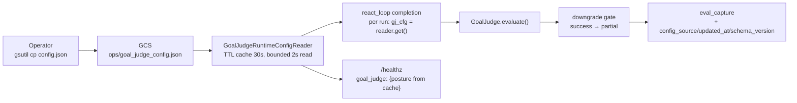

# Recipe 15 — The Posture Nobody Could Flip

**Goal:** Give operators a true runtime toggle for the GoalJudge's evaluation posture — shadow, downgrade, or dark — without a Cloud Run revision or image rebuild. Fixes the root cause (two diverging entrypoints) by collapsing them into a single env-driven composition root, adds a TTL-cached GCS-backed config reader with bounded reads and stale-on-error degradation, wires the reader per-run into the completion node, and surfaces the active posture on `/healthz` from cache so the liveness probe never stalls. After this recipe, a single `gsutil cp` propagates to every live instance within one TTL cycle, and the divergence that made the flag silently dead in production structurally cannot recur.

**Status:** Complete | 16 L2 + 8 L4 + 93 architecture + 45 middleware tests passing | Zero new runtime dependencies

---

## Before We Start: A Story

Something embarrassing keeps happening at validation time.

You open the walkthrough, read Step 2 — *"confirm the GoalJudge is active by checking `/healthz`"* — and send `curl $BACKEND_URL/healthz`. The response comes back:

```json
{ "status": "ok", "profile": "v3", "runtime": "langgraph", "mode": "combined" }
```

No `goal_judge` key. The probe doesn't know the judge exists.

So you check the Langfuse trace instead. You run a throwaway task, pull the `task.completed` event, and look for a `goal_judge` eval capture. It isn't there either. You go to `middleware/app_prod.py` and search for `goal_judge_enabled`. Not there. You check `services/base_config.py`. The field exists. You check `middleware/__main__.py`. It sets the field from `GOAL_JUDGE_ENABLED` env. You check the Cloud Run service. The env var is declared. You check `app_prod.py` again.

The env var was never wired into `AgentConfig`.

This is the root symptom. Two entrypoints — `app_prod.py` for Cloud Run, `__main__.py` for local dev — each maintain their own copy of the agent object graph. They diverged. One copy wired the flag. The other copy, the one that runs in production, forgot to. No test caught this, because no test compared the two wiring paths against each other. The flag has been dark in production since the day it was written.

But there is a second problem hiding underneath the first. Even if you fixed `app_prod.py` today to read `GOAL_JUDGE_ENABLED`, it would still require a **new Cloud Run revision** — an instance restart — to take effect. The flag would still be frozen at process boot. Flip it in Secret Manager, wait for a revision rollout, watch every in-flight request drain before the new instance takes over. For a validation walkthrough where you need to toggle between shadow (Posture A), downgrade (Posture B), and dark while comparing Langfuse traces side-by-side, that's operationally painful and epistemically risky: a revision wipes the warm cache and changes the environment you were validating.

What you actually need is this:

```bash
echo '{"schema_version":1,"goal_judge_enabled":true,"goal_judge_downgrade_enabled":false,"updated_by":"rkhatri"}' \
  | gsutil cp - gs://agent-prod-gcp-dev-agent-facts/ops/goal_judge_config.json
# → posture flips to shadow on every live instance within 30s, no revision
```

A single `gsutil cp`. No revision. No drain. Within one TTL cycle, every running instance picks up the new posture. The gold-set corpus you were building continues against the same instance, same JVM warm cache, same model — only the judge's downgrade flag changed.

This recipe builds that. But it does more than add a GCS reader — it fixes the structural problem that made the flag drift possible in the first place. The two entrypoints are collapsed into a single env-driven composition root so the wiring lives in one place and can only drift if you actively fight the architecture. The flag gets a new home: a runtime config file in GCS, read per task completion, with a bounded timeout, stale-on-error degradation, and a health-posture echo served from cache. The flag from `AgentConfig` becomes the precedence-fallback for CI and local dev, which never touch GCS.



---

## Prerequisites

- **The baseline passes.** `pytest tests/ -p no:logfire -q` green before any change.
- **Walkthrough Step 1 complete.** The GoalJudge's L3 `evaluate()` is already wired and the `test_goal_judge_gate.py` suite passes.
- **No new runtime dependencies.** `google-cloud-storage` is already a transitive dep via `AgentFactsGcsRegistry`; `pydantic-settings` via the existing `BaseSettings` uses. `freezegun` is already a dev dep.

---

## The Architecture in One Breath

Five code changes, each in the layer that owns it.

| Change | Layer | Why it lives there |
|--------|-------|-------------------|
| `GoalJudgeRuntimeConfig` + `GoalJudgeRuntimeConfigReader` | Services (L2 horizontal) | Config plumbing: no domain logic, no langgraph. Network I/O must not reach components or orchestration. |
| `InMemoryGoalJudgeConfigReader` | Services (L2) | Test double belongs next to the class it doubles; L4 tests import it from here, not from tests/. |
| `build_graph(goal_judge_config_reader=...)` per-run read | Orchestration (thin node) | The completion node is the only place with loop state — the layer owns the when-to-call, not the how-to-read. |
| `AgentRuntimeSettings` + `build_components` + `build_runtime_graph` | Middleware (composition root) | The entry point ring is the *only* place allowed to name concrete adapter classes (rule C1). |
| `/healthz` posture echo | Middleware (FastAPI endpoint) | HTTP surface lives in middleware; the echo reads the TTL cache the reader owns — no new I/O on a probe call. |

The dependency arrows stay downward: `orchestration` → `services`, `middleware` → `orchestration` + `services`. No new forbidden edges.

---

## The Six Lessons

---

### Lesson 1 — The Dead Toggle (Why the Flag Was Dark in Production)

**`middleware/app_prod.py` vs `middleware/__main__.py`**

> "The flag works locally. Why is it dark in prod?"

Because there are two composition points for the agent object graph, and they diverged.

`middleware/__main__.py` builds the agent for local dev. It reads `GOAL_JUDGE_ENABLED` from the environment and passes it into `AgentConfig`:

```python
# __main__.py:304-305 (before)
goal_judge_enabled=bool(os.environ.get("GOAL_JUDGE_ENABLED", "")),
```

`middleware/app_prod.py` builds the agent for Cloud Run. Its `_build_components()` constructs `AgentConfig` without the flag:

```python
# app_prod.py:128-133 (before)
agent_config = AgentConfig(
    default_model=...,
    models=[fast, capable],
    max_steps=20,
    max_cost_usd=1.0,
    # goal_judge_enabled: missing
)
```

The wiring lived in `__main__.py`. Production ran `app_prod.py`. The flag was wired into the development path only. This is the classic dev/prod parity anti-pattern (12-Factor §10): two separate code paths for two environments, where only one of them got updated. Every time a new feature was wired into `__main__.py`, someone had to remember to also wire it into `app_prod.py`. On the goal judge, they didn't.

The divergence table across both files is sobering:

| Concern | `app_prod.py` | `__main__.py` | Status |
|---------|--------------|---------------|--------|
| `AgentConfig` goal_judge fields | **absent** | set from env | **Root cause** |
| Component builder function | `_build_components()` | `_build_base_components()` | Duplicate, two functions |
| Model profiles | `app_prod.py:111-126` | `__main__.py:282-297` | Byte-identical duplicate |
| ToolRegistry assembly | identical tool set | identical tool set | Duplicate |
| `build_graph` call sites | 1 | 3 near-identical copies | Diverge |
| AgentFacts registry adapter | always GCS | branching by `GCP_EXECUTION_ENV` | Diverge |

The fix is not to patch `app_prod.py`. The fix is to **finish the job `composition.py` started** — it is already the single wiring point for middleware auth/ACL adapters. The agent object graph is the only part that escaped that discipline. Extend `composition.py` with `AgentRuntimeSettings`, `build_components`, and `build_runtime_graph`; reduce both `app_prod.py` and `__main__.py` to thin profile-picking shims. The divergence is structural now: there is no longer a code path where one entrypoint wires the flag and the other forgets to.

**Checkpoint question:** The module docstring of `composition.py` already says it is "the SINGLE wiring point for the middleware ring." How did the agent object graph end up in two separate `_build_components()` functions instead?

*Answer: `composition.py` was initially scoped to the auth/ACL/telemetry adapter bag (`MiddlewareAdapters`). The agent object graph — `AgentConfig`, `ToolRegistry`, `AgentFactsRegistry`, `cache_dir` — was added later when the production backend was first containerized, and it went directly into `app_prod._build_components()` because that's where the Cloud Run entry point lived. `__main__.py` then copied that function to get parity for dev. Neither copy was ever routed back through `composition.py`. The discipline held for adapters but broke for the graph — exactly the kind of gradual drift that ends in a flag wired in one place and dead in the other.*

---

### Lesson 2 — The Bounded-Read Contract

**`services/goal_judge_runtime_config.py`**

> "The plan says `AgentFactsGcsRegistry.get()` does a bare `blob.download_as_text()` with no deadline. Why not copy that pattern?"

Because the goal judge reader is called in two different death-critical paths.

First: it is called per task completion in the `react_loop` completion node. A hung GCS read there stalls the entire task response — the user sees a spinning wheel while your agent waits on a GCS timeout.

Second, and worse: it is called indirectly by `/healthz`, the Cloud Run liveness probe. Cloud Run hits `/healthz` every few seconds. If the probe doesn't respond within the deadline, Cloud Run marks the instance as unhealthy and restarts it. A hung `/healthz` caused by an uncapped GCS read triggers an instance restart loop — the new instance immediately hits `/healthz`, which also tries to read GCS, which is also hung — and you have taken the service down by adding an observability endpoint.

The bounded read uses `ThreadPoolExecutor` to submit the GCS call to a background thread and enforces a hard timeout at `future.result(timeout=self._timeout_s)`. Default is 2 seconds, overridable via `GOAL_JUDGE_CONFIG_TIMEOUT_S`. The thread continues past the timeout (we can't kill threads in Python), but the caller returns control immediately:

```python
# services/goal_judge_runtime_config.py
def _read_with_timeout(self) -> str:
    future = _executor.submit(self._read_raw)
    try:
        return future.result(timeout=self._timeout_s)
    except FuturesTimeoutError as exc:
        future.cancel()
        raise TimeoutError(
            f"GoalJudge config read timed out after {self._timeout_s}s"
        ) from exc
```

The `/healthz` path never calls `get()` — it calls `health_posture()`, which reads only from the in-memory cache and returns the last-known-good posture without any I/O:

```python
def health_posture(self) -> dict[str, Any]:
    """Non-blocking posture echo for /healthz — serves cache only."""
    with self._lock:
        resolved = self._cached or self._last_good
    if resolved is None:
        resolved = self._fallback_without_uri()
    ...
```

The probe never touches GCS. The bounded read applies only to background TTL refreshes triggered by task completions. The safety chain is: timeout on every read → stale-on-error if it times out → dark only if there has never been a good read → never blocks the probe.

**Checkpoint question:** A Cloud Run liveness probe fires at time T=5s, 10s, 15s. The first task completion fires at T=8s and triggers a GCS read that takes 3s. What posture does `/healthz` return at T=5s, T=10s, and T=15s?

*Answer: At T=5s, no read has ever succeeded, so `health_posture()` calls `_fallback_without_uri()` which returns `source="env"` or `source="default"` based on whether env vars are set — no GCS I/O. At T=10s, the background GCS read triggered at T=8s is still in flight (2s elapsed of a 3s read with 2s timeout — actually, the read would have timed out at T=10s and returned `stale` or `default` depending on prior reads). Probe still returns from cache or fallback. At T=15s, assuming the TTL is 30s and the first good read happened before T=13s (after any retry), the probe returns the cached posture. At no point does the probe wait on a GCS call. The bounded read and the probe-safe `health_posture()` are two separate concerns that work in concert.*

---

### Lesson 3 — Stale-on-Error Degradation

**`services/goal_judge_runtime_config.py`**

> "If GCS has a transient blip, what happens to the posture mid-validation run?"

Without stale-on-error, the reader would fall to the `AgentConfig` defaults on any transient failure — which are `False, False` (dark by default). If you are in the middle of building a Posture A gold-set corpus and a GCS 503 blip hits, the reader would silently flip every subsequent run to dark. Those runs would be emitted into Langfuse without a judge verdict, then mixed into the corpus as if they were shadow runs. The corpus is corrupted. Worse, no alarm fires — the run still completes, the TASK_COMPLETED event is still emitted, and the `config_source` tag on eval_capture now says `"default"` where it was saying `"gcs:..."`. A downstream consumer that does not check `config_source` on every row cannot tell the contaminated runs from the legitimate ones.

The stale-on-error policy: on any transient read/parse failure, serve the **last known good** config. Fall to `AgentConfig` defaults (dark) only when there has **never** been a successful read. The test that pins this invariant:

```python
def test_stale_on_error_after_successful_read(self, tmp_path):
    cfg_file = tmp_path / "goal_judge_config.json"
    cfg_file.write_text(json.dumps(_VALID_JSON), encoding="utf-8")

    reader = GoalJudgeRuntimeConfigReader(
        uri=f"file://{cfg_file}", ttl_s=0  # always-expired: re-reads every call
    )
    first = reader.get()
    assert first.source.startswith("file:")  # good read

    cfg_file.write_text("{broken", encoding="utf-8")  # simulate GCS blip
    stale = reader.get()
    assert stale.goal_judge_enabled is True   # last-known-good preserved
    assert stale.source == "stale"             # tagged as stale for telemetry
```

The `source="stale"` tag on `ResolvedGoalJudgeConfig` flows through to `eval_capture.record(config_source=gj_cfg.source, ...)`. A Langfuse query `SELECT * WHERE config_source = "stale"` surfaces every run that rode a degraded posture. They are not contaminated — the posture was preserved — but they are auditable.

The `extra="forbid"` rule on `GoalJudgeRuntimeConfig` means a typo'd key (like `"goal_judge_enable": true`) is treated as a parse error, not a silent key drop. Without this, an operator who typed the key wrong would believe they had flipped the posture while the agent continued running dark. With `extra="forbid"`, the read fails, stale-on-error kicks in, the WARN log fires with the validation error text, and the operator sees why in the Cloud Run logs within seconds.

**Checkpoint question:** An operator types `{"goal_judge_enabled": true, "goal_judge_downgrade_enable": true}` (missing `d` at the end). What happens?

*Answer: `GoalJudgeRuntimeConfig.model_validate_json(raw)` raises `pydantic.ValidationError` because `extra="forbid"` and `goal_judge_downgrade_enable` is not a declared field. The exception is caught in `_resolve_fresh()`'s broad `except Exception`. `_last_good` is checked — if a prior read succeeded, the stale posture is returned with `source="stale"`. If this is the first read ever, `_fallback_without_uri(source="default")` is returned (dark). In both cases, a `logger.warning("GoalJudge config read/parse failed ...")` fires. The posture does not silently adopt the typo'd `goal_judge_downgrade_enable=True` — it falls safe. The WARN log tells the operator exactly what went wrong.*

---

### Lesson 4 — Explicit Injection, No Singleton

**`orchestration/react_loop.py`**

> "Why not use a module-level `GoalJudgeRuntimeConfigReader` that's constructed once at import time?"

Because a module-level singleton is invisible state. It cannot be overridden in L4 tests without patching the module — and patching globals is the pattern that makes tests fragile, order-dependent, and opaque.

The plan calls this out as Concern 4: "Do not default to a module-level singleton — hidden global state in the orchestration layer breaks L4 determinism and forces tests to patch globals."

The design instead adds a `goal_judge_config_reader` parameter to `build_graph()`, defaulting to `None`. When `None`, the function constructs an **env-only reader** that does zero network I/O (URI unset):

```python
# orchestration/react_loop.py
gj_reader = goal_judge_config_reader or GoalJudgeRuntimeConfigReader.from_env(
    defaults_enabled=agent_config.goal_judge_enabled,
    defaults_downgrade=agent_config.goal_judge_downgrade_enabled,
)
```

In CI, `GOAL_JUDGE_CONFIG_URI` is unset, so this path produces a pure-env reader with zero GCS calls. In L4 gate tests, the caller injects a deterministic `InMemoryGoalJudgeConfigReader` that returns whatever posture the test needs:

```python
# tests/orchestration/test_goal_judge_gate.py
async def test_injected_reader_overrides_agent_config_downgrade(self, tmp_path):
    reader = InMemoryGoalJudgeConfigReader(
        goal_judge_enabled=True,
        goal_judge_downgrade_enabled=True,  # ON
        source="test-injected",
    )
    details = await _run_with_verdict(
        tmp_path,
        workflow_id="wf-reader-on",
        verdict=GoalVerdict(goal_met=False, criteria_met=0.0),
        downgrade_enabled=False,           # AgentConfig says OFF
        goal_judge_config_reader=reader,   # reader wins
    )
    assert details["outcome"] == "partial"   # reader's downgrade_enabled=True takes effect
```

The reader injection also means the `GoalJudge` object is **always constructed** at graph build time (the old `if goal_judge_enabled` guard at line ~451 is removed). The `GoalJudge` is cheap — it holds references to `LLMService`, `PromptService`, and a `GuardRailValidator`. No LLM calls until `evaluate()`. Constructing it unconditionally eliminates the build-time branch and lets the per-run reader decide at runtime whether to call it. This is the correct separation: the graph's topology is determined once; the runtime posture is resolved per run.

**Checkpoint question:** An L4 test constructs the graph with `goal_judge_config_reader=None` and `agent_config.goal_judge_enabled=True`. No URI is set in env. `GOAL_JUDGE_ENABLED` is also not set. What does `gj_reader.get()` return, and does it perform any I/O?

*Answer: `GoalJudgeRuntimeConfigReader.from_env(defaults_enabled=True, defaults_downgrade=False)` is constructed. Since `GOAL_JUDGE_CONFIG_URI` is unset, `self._uri` is `None`. `get()` calls `_resolve_fresh()`, which calls `_fallback_without_uri()`. No env vars are explicitly set, `_env_enabled_explicit` is `False`, so it falls to defaults: `ResolvedGoalJudgeConfig(goal_judge_enabled=True, goal_judge_downgrade_enabled=False, source="default")`. Zero I/O. The agent config's `goal_judge_enabled=True` propagated through the reader's defaults without touching GCS or env.*

---

### Lesson 5 — The Unified Composition Root

**`middleware/composition.py`**

> "Why is `build_components` in `composition.py` rather than a new file?"

Because `composition.py` is *already* the repo's documented single wiring point for the middleware ring. Its own module docstring says so:

> *"This is the only file in `middleware/` that reads `ARCHITECTURE_PROFILE`, reads any `WORKOS_*`/`MEM0_*`/`LANGFUSE_*` env var, names concrete adapter classes."*

The agent object graph (config, tools, facts registry, trace sink, cache dir) is the only part that escaped this discipline and ended up in two separate `_build_*` functions. The fix finishes what `composition.py` started. This mirrors the repo's existing idiom: `utils/cloud_providers/__init__.py:get_provider()` selects AWS vs local adapters by env; `build_adapters()` selects v3 vs v2 auth adapters by `ARCHITECTURE_PROFILE`. The agent graph is the same pattern, one level down.

The new additions are:

**`AgentRuntimeSettings(BaseSettings)`** — a pydantic-settings profile object that reads a single discriminator `AGENT_ENV` (`local` | `prod`) plus the existing env vars. It resolves `AGENT_ENV` from explicit setting, then `GCP_EXECUTION_ENV` as a fallback, then defaults to `"local"`. Prod required vars fail fast at settings construction (12-Factor §3: fail on bad config at boot):

```python
if settings.agent_env == "prod":
    if not settings.gcs_facts_bucket:
        raise RuntimeError("GCS_FACTS_BUCKET is required in production")
```

**`build_components(settings, *, agent_root) -> AgentComponents`** — one builder that selects adapters by profile: local `AgentFactsRegistry` vs `AgentFactsGcsRegistry`; `cache_dir` from env vs repo root. The `GoalJudgeRuntimeConfigReader` is constructed once here, with a prod-default URI derived from `gcs_facts_bucket` when `GOAL_JUDGE_CONFIG_URI` is not explicitly set.

**`build_runtime_graph(components, build_graph, ...)` ** — single call site for `build_graph(...)` with reader injection. Thread count: 1. Previous count: 3 in `__main__.py` + 1 in `app_prod.py` = 4.

**`app_prod.py` and `__main__.py` become thin shims**: each sets its profile via `AgentRuntimeSettings(agent_env="prod")` or `AgentRuntimeSettings(agent_env="local")` and delegates all object-graph construction to `build_components`. The HTTP surface differences that legitimately belong to the entry point (production = WorkOS JWT + mounted middleware ACL app; dev = permissive bearer + `/threads` store + port auto-selection) remain in their respective files. Domain/graph wiring lives in one place.

```mermaid
flowchart TD
  envVars["Env\nAGENT_ENV, GCS_*, DATABASE_URL, GOAL_JUDGE_CONFIG_URI"] --> settings["AgentRuntimeSettings\n(pydantic-settings)"]
  settings --> factory["composition.build_components(settings)"]

  factory -->|"agent_env == local"| localAdapters["AgentFactsRegistry\ncache_dir = agent_root/cache"]
  factory -->|"agent_env == prod"| prodAdapters["AgentFactsGcsRegistry\ncache_dir = /tmp/agent_offload"]

  factory --> reader["GoalJudgeRuntimeConfigReader\n(constructed once)"]
  localAdapters --> components["AgentComponents bag"]
  prodAdapters --> components
  reader --> components

  components --> buildGraph["build_runtime_graph → build_graph(..., reader)"]

  devShim["__main__.py\nAGENT_ENV=local shim"] --> settings
  prodShim["app_prod.py\nAGENT_ENV=prod shim"] --> settings

  buildGraph --> graph["compiled LangGraph runtime"]
```

Backward-compat contract (the public names that `tests/middleware/test_app_prod.py` patches): `build_combined_app`, `build_dev_app`, `_build_components`, and `build_adapters` all keep their names and signatures. The shims preserve them as wrappers around `build_components`.

**Checkpoint question:** A teammate reads `app_prod._build_components()` and sees it calls `composition.build_components(settings)` and then immediately calls `composition.build_components(settings)` again in `_build_agent_components()`. Why are there two calls?

*Answer: Backward-compat shims. `_build_components()` returns a 5-tuple `(agent_config, tool_registry, agent_facts_registry, cache_dir, goal_judge_reader)` matching the old signature that `test_app_prod.py` patches at `app_prod._build_components`. `_build_agent_components()` returns the full `AgentComponents` bag, used by the new `build_combined_app()` logic. Both delegate to `composition.build_components()`, so the actual object-graph wiring still runs once — but the return shapes differ. The two shim functions exist solely to satisfy external patch targets. Once the test suite is updated to patch `composition.build_components` directly, both shims can be collapsed.*

---

### Lesson 6 — Failure Paths First

**`tests/orchestration/test_goal_judge_gate.py`**, **`tests/services/test_goal_judge_runtime_config.py`**

> "The tests are organised with failures before acceptance. Why does the ordering matter?"

Because a gate that accepts everything is indistinguishable from a gate that works — until the failure path is exercised. This is TAP-4 (Gap Blindness): the dangerous regression is not a gate that rejects too aggressively, it is a gate that silently stops rejecting. If you write the acceptance test first and the failure test later (or never), a regression that removes the gate's rejection logic leaves the acceptance test green and the CI passing. The failure test is the only proof the gate is live.

The gate test class is named `TestNoSpuriousDowngrade` and runs *before* `TestDowngradeApplied`:

```
TestNoSpuriousDowngrade
  test_goal_met_true_does_not_downgrade          ← gate must NOT fire here
  test_flag_off_is_shadow_only                   ← gate must NOT fire here
  test_no_progress_source_is_never_downgraded    ← gate must NOT fire here
  test_budget_terminal_site_bypasses_gate        ← gate must NOT fire here

TestDowngradeApplied
  test_goal_met_false_with_flag_on_downgrades    ← gate MUST fire here
  test_graceful_failure_only_success_to_partial  ← gate MUST fire here (and no further)

TestRuntimeConfigReaderInjection
  test_injected_reader_overrides_agent_config_downgrade  ← reader injection works
  test_malformed_runtime_config_stays_dark               ← fail-dark on bad config (TAP-4)
```

The malformed-config dark case (`test_malformed_runtime_config_stays_dark`) is the TAP-4 test at the composition seam: it feeds a `GoalJudgeRuntimeConfigReader` pointed at a file with an unknown key (`typo_key: 1`), passes it into `build_graph`, and asserts the outcome is `success` with no `downgrade_reason`. The gate didn't fire. The config error degraded dark, exactly as specified.

The L2 schema tests mirror this: `TestReaderFailurePaths` (malformed JSON, extra key, unset URI) comes before `TestReaderAcceptance` (valid parse, TTL, stale-on-error, mocked GCS). Both suites carry the comment:

```python
# Failure paths first (TAP-4): malformed/extra keys, never-read fail-dark,
# unset URI zero I/O. Acceptance paths: valid parse, TTL cache, stale-on-error.
```

The ordering is documentation. It tells every future reader that the gate's rejection behavior was tested before its acceptance behavior was trusted.

---

## Agent Steps

These steps can be followed in order on any machine. Steps 1–3 are pure code and tests; step 4 is the GCS seed (requires `gsutil`).

### 15.1 — Verify the baseline

```bash
python -m pytest -p no:logfire \
  tests/services/ tests/orchestration/test_goal_judge_gate.py \
  tests/middleware/ tests/architecture/ -q
# Expected: all passing before any change
```

### 15.2 — Add the runtime config reader (L2 service)

Add `services/goal_judge_runtime_config.py`: `GoalJudgeRuntimeConfig` (Pydantic model, `extra="forbid"`), `GoalJudgeRuntimeConfigReader` (TTL cache, bounded read, stale-on-error, env fallback, zero I/O when URI unset), `InMemoryGoalJudgeConfigReader`, `ResolvedGoalJudgeConfig`.

Add `tests/services/test_goal_judge_runtime_config.py`: schema failure paths, TTL with `freeze_time`, stale-on-error, mocked GCS client, health posture from cache.

```bash
python -m pytest -p no:logfire tests/services/test_goal_judge_runtime_config.py -q
# Expected: 16 passed
```

### 15.3 — Add the architecture isolation test

Add `tests/architecture/test_goal_judge_runtime_config_layer.py`: assert `services/goal_judge_runtime_config.py` imports nothing from `components/`, `orchestration/`, `langgraph`, or `langchain`.

```bash
python -m pytest -p no:logfire tests/architecture/ -q
# Expected: 93 passed, 2 skipped
```

### 15.4 — Refactor react_loop (per-run reader injection)

In `orchestration/react_loop.py`:
- Add `goal_judge_config_reader` keyword param to `build_graph()`.
- Remove the `if goal_judge_enabled` construction guard — always build `GoalJudge`.
- Default to `GoalJudgeRuntimeConfigReader.from_env(...)` when `None`.
- Per run in the completion node: `gj_cfg = gj_reader.get()`.
- Replace `getattr(agent_config, "goal_judge_downgrade_enabled", ...)` with `gj_cfg.goal_judge_downgrade_enabled`.
- Stamp `config_source`, `config_updated_at`, `config_schema_version` into `eval_capture.record()`.

Extend `tests/orchestration/test_goal_judge_gate.py` with `TestRuntimeConfigReaderInjection` (injected reader overrides, malformed config dark case).

```bash
python -m pytest -p no:logfire tests/orchestration/test_goal_judge_gate.py -q
# Expected: 8 passed (4 failure + 2 acceptance + 2 reader injection)
```

### 15.5 — Extend composition.py (unified composition root)

In `middleware/composition.py`:
- Add `AgentRuntimeSettings(BaseSettings)` with `AGENT_ENV`, `GCS_FACTS_BUCKET`, `GOAL_JUDGE_CONFIG_URI`, `GOAL_JUDGE_ENABLED`, `GOAL_JUDGE_DOWNGRADE_ENABLED`.
- Add `AgentComponents` dataclass (typed bag).
- Add `build_components(settings, *, agent_root) -> AgentComponents`.
- Add `build_runtime_graph(components, build_graph, ...)`.

Reduce `app_prod._build_components()` and `__main__._build_base_components()` to thin shims that call `composition.build_components()`. Wire `/healthz` to return `goal_judge_reader.health_posture()`.

Add `tests/middleware/test_agent_runtime_composition.py`: local profile selects file registry; prod profile fails fast on missing bucket; prod default GCS URI derived from bucket name.

```bash
python -m pytest -p no:logfire tests/middleware/ -q
# Expected: 45 passed
```

### 15.6 — Seed the GCS config (ops)

```bash
# Seed a dark default (zero posture risk; operators flip forward):
echo '{
  "schema_version": 1,
  "goal_judge_enabled": false,
  "goal_judge_downgrade_enabled": false,
  "updated_at": "2026-06-02T20:00:00Z",
  "updated_by": "rkhatri"
}' | gsutil cp - gs://agent-prod-gcp-dev-agent-facts/ops/goal_judge_config.json

# Verify the seed is readable and validates:
gsutil cat gs://agent-prod-gcp-dev-agent-facts/ops/goal_judge_config.json
# Expected: the JSON above, schema_version=1
```

### 15.7 — Full suite

```bash
python -m pytest -p no:logfire tests/architecture/ tests/services/ \
  tests/orchestration/test_goal_judge_gate.py tests/middleware/ -q
# Expected: 16 + 8 + 93 + 45 passed
```

---

## Human Review Gate

Before calling Recipe 15 done:

- [ ] **`/healthz` returns goal_judge posture** — `curl $BACKEND_URL/healthz` returns `{"goal_judge": {"enabled": ..., "source": "gcs:ops/goal_judge_config.json", "schema_version": 1, ...}}`. No GCS read on the probe call (served from cache or fallback).
- [ ] **Posture flip without revision** — `gsutil cp` a shadow config; within 30s (one TTL cycle) the next task completion logs `config_source: gcs:ops/goal_judge_config.json` in the Langfuse `goal_judge` eval capture. No Cloud Run revision required.
- [ ] **Malformed config stays dark** — Upload `{"goal_judge_enabled": true, "typo": 1}` to the GCS path. The next task completion's `config_source` is `"stale"` (if prior good read exists) or `"default"` (first ever read). Outcome is NOT downgraded to partial. WARN log appears in Cloud Run logs.
- [ ] **CI stays clean with URI unset** — `GOAL_JUDGE_CONFIG_URI` is absent from CI env. The L2 reader tests and L4 gate tests all pass without any network calls. `rg "GOAL_JUDGE_CONFIG_URI" tests/"` returns only the composition tests that explicitly set it.
- [ ] **Architecture invariant holds** — `pytest tests/architecture/test_goal_judge_runtime_config_layer.py -q` passes. `rg "from orchestration\|from components\|from langgraph\|from langchain" services/goal_judge_runtime_config.py` returns no matches.
- [ ] **No duplicate `_build_components` logic** — `rg "models=\[fast" middleware/` returns results only from `composition.py`, not from `app_prod.py` or `__main__.py`. The model profile definitions live in one place.
- [ ] **`goal_judge` in eval_capture has provenance** — Langfuse `goal_judge` span on a test run includes `config_source`, `config_updated_at`, `config_schema_version` in `ai_response`.

---

## For a General Audience

If you are adapting these patterns to another LangGraph-based agent with a similar env-var-frozen config problem:

1. **Two entrypoints that diverge are worse than one entrypoint that's slightly wrong.** A single bug in a shared wiring point is a bug. A bug in one entrypoint that the other silently doesn't have is an invisible correctness split — the developer thinks the feature is wired everywhere because it works in their dev environment. Find your `_build_components` duplicates before they diverge.

2. **A feature toggle frozen at process boot is a static config, not a feature toggle.** Real feature switches need runtime evaluation and cached refresh. A Cloud Run env var requires a new revision (instance restart) to take effect — not a deploy, but not a hot toggle either. For validation walkthroughs where you need to flip A/B without restarting, a GCS JSON with a TTL cache is the minimum viable implementation.

3. **Never let a config reader stall a liveness probe.** Any I/O that can block must not be in the hot path of `/healthz`. Separate `get()` (the bounded, retriable, cacheable read) from `health_posture()` (the non-blocking cache echo). The probe only calls the echo.

4. **Stale-on-error is the safe degradation for posture, not fall-to-default.** "Fall to dark on any transient error" sounds conservative but is destructive if the error interrupts a mid-validation corpus build. Serve last-known-good on transient failure; fall dark only on never-read. Tag stale responses with `source="stale"` so they are auditable.

5. **`extra="forbid"` on config models is an operator safety net.** A typo'd key that is silently dropped would let an operator believe they had flipped a feature when they hadn't. Treating unknown keys as parse errors — which trigger stale-on-error — gives the operator a loud WARN log instead of a silent non-effect.

6. **Explicit injection into graph constructors is safer than module-level singletons.** A module-level reader that auto-constructs on import cannot be replaced in tests without patching globals. An injected reader that defaults to zero-I/O when not provided keeps tests hermetic and makes the dependency visible in the function signature.

7. **Write the gate's rejection test before its acceptance test.** A test that proves `goal_met=True` does not downgrade is as important as the test that proves `goal_met=False` does. Without the first, a regression that removes the `if prev_outcome != "success"` guard stays hidden until a false downgrade corrupts the gold set.

The reusable pattern: **one composition root, env-driven profile, bounded reads with stale-on-error, probe-safe cache echo, injected readers with in-memory test doubles, failure paths first.**

---

## Verify

```bash
# 1. Full targeted suite
python -m pytest -p no:logfire \
  tests/architecture/ \
  tests/services/test_goal_judge_runtime_config.py \
  tests/orchestration/test_goal_judge_gate.py \
  tests/middleware/test_agent_runtime_composition.py \
  tests/middleware/test_app_prod.py \
  -q
# Expected: 16 + 8 + 4 + 45 = 73+ passed

# 2. Architecture boundary holds
python -m pytest -p no:logfire tests/architecture/test_goal_judge_runtime_config_layer.py -v
# Expected: 1 passed -- no upward imports

# 3. Spot-check unset URI zero I/O
python -c "
import os; os.environ.pop('GOAL_JUDGE_CONFIG_URI', None)
from services.goal_judge_runtime_config import GoalJudgeRuntimeConfigReader
r = GoalJudgeRuntimeConfigReader(defaults_enabled=True, defaults_downgrade=False)
cfg = r.get()
assert cfg.source == 'default', f'expected default, got {cfg.source}'
assert cfg.goal_judge_enabled is True
print('Zero I/O confirmed, source:', cfg.source)
"

# 4. Spot-check extra-key fail-dark
python -c "
import json, tempfile
from pathlib import Path
from services.goal_judge_runtime_config import GoalJudgeRuntimeConfigReader
d = Path(tempfile.mkdtemp())
f = d / 'bad.json'
f.write_text(json.dumps({'goal_judge_enabled': True, 'goal_judge_downgrade_enable': True}))
r = GoalJudgeRuntimeConfigReader(uri=f'file://{f}', defaults_enabled=False)
cfg = r.get()
assert cfg.goal_judge_enabled is False, f'Expected dark, got {cfg.goal_judge_enabled}'
print('extra-key fail-dark confirmed, source:', cfg.source)
"

# 5. Spot-check stale-on-error
python -c "
import json, tempfile
from pathlib import Path
from services.goal_judge_runtime_config import GoalJudgeRuntimeConfigReader
d = Path(tempfile.mkdtemp())
f = d / 'cfg.json'
f.write_text(json.dumps({'schema_version': 1, 'goal_judge_enabled': True,
  'goal_judge_downgrade_enabled': False, 'updated_by': 'test'}))
r = GoalJudgeRuntimeConfigReader(uri=f'file://{f}', ttl_s=0)
first = r.get()
f.write_text('{broken')
stale = r.get()
assert stale.goal_judge_enabled is True
assert stale.source == 'stale'
print('stale-on-error confirmed, source:', stale.source)
"
```

---

## Rollback

All changes are backward-compatible:

- `GoalJudgeRuntimeConfigReader` is a new module with no existing callers — removing it reverts to the previous static `AgentConfig` path.
- The `goal_judge_config_reader` param in `build_graph()` has a default `None` that restores the previous behavior. Passing `None` explicitly re-enables the env-only path.
- `AgentComponents` and `build_components` are additive — existing callers of `build_adapters` are unchanged.
- `app_prod._build_components` and `__main__._build_base_components` preserve their old return signatures; reverting their internals to the original bodies restores the previous (divergent) behavior.

```bash
# Revert only the GCS reader (keep everything else)
git checkout services/goal_judge_runtime_config.py \
  tests/services/test_goal_judge_runtime_config.py \
  tests/architecture/test_goal_judge_runtime_config_layer.py

# Revert react_loop per-run read (keep composition root)
git checkout orchestration/react_loop.py \
  tests/orchestration/test_goal_judge_gate.py

# Revert everything in this recipe
git checkout services/goal_judge_runtime_config.py \
  orchestration/react_loop.py \
  middleware/composition.py \
  middleware/app_prod.py \
  middleware/__main__.py \
  tests/services/test_goal_judge_runtime_config.py \
  tests/architecture/test_goal_judge_runtime_config_layer.py \
  tests/orchestration/test_goal_judge_gate.py \
  tests/middleware/test_agent_runtime_composition.py \
  tests/middleware/test_app_prod.py
```

---

## Deferred

| Item | Why deferred | Follow-up note |
|------|-------------|----------------|
| Bounded-read timeout unit test | `FuturesTimeoutError` path is exercised by the timeout mechanism in `_read_with_timeout`, but the L2 suite does not have a test that forces the thread to take longer than `timeout_s` to assert the `TimeoutError` is raised and caught. | Add a test with a mock `_read_raw` that sleeps past the timeout and asserts `source="stale"` or `source="default"` on the result. Low risk: the stale-on-error path is covered; only the timeout trigger path is not. |
| Secret Manager volume mount | Alternative B: `/etc/runtime/goal_judge_config.json` via Cloud Run secret volume (`version=latest`). GCP re-fetches latest on each file read — no SDK, just `Path.read_text()`. | Requires one IaC change to `infra/gcp/cloud-run-backend.tf`. Simpler than GCS for a sub-30s hot toggle; more constrained access model. Prefer GCS for now (bucket already provisioned, no IaC change). |
| Flag retirement policy | `goal_judge_enabled` / `goal_judge_downgrade_enabled` are temporary validation flags. | Once the §2.8 precision-floor enable-policy clears (or is abandoned), retire or promote them rather than leaving permanent flag debt. See the plan's flag lifecycle note. |
| GCS object versioning on `ops/` prefix | `gsutil cp` leaves no audit trail beyond `updated_by` in the JSON. | Enable object versioning on `gs://agent-prod-gcp-dev-agent-facts/ops/` (`gsutil versioning set on`) to get a full history of every config flip. Optional; `updated_by` + the WARN log on posture change are the current mitigation. |
| Collapse `_build_components` + `_build_agent_components` shims | Two shims in `app_prod.py` both call `composition.build_components()` but return different shapes. | Once `test_app_prod.py` is updated to patch `composition.build_components` directly (rather than `app_prod._build_components`), the legacy 5-tuple shim can be deleted and `_build_agent_components` becomes the sole entry point. |

---

## Files Modified

| File | Action | Plan Item |
|------|--------|-----------|
| `services/goal_judge_runtime_config.py` | **New**: `GoalJudgeRuntimeConfig`, `GoalJudgeRuntimeConfigReader`, `InMemoryGoalJudgeConfigReader`, `ResolvedGoalJudgeConfig` | `runtime-config-reader` |
| `orchestration/react_loop.py` | `build_graph` gains `goal_judge_config_reader` param; `GoalJudge` always built; per-run `gj_reader.get()`; posture provenance in `eval_capture` | `react-loop-per-run` |
| `middleware/composition.py` | `AgentRuntimeSettings`, `AgentComponents`, `build_components`, `build_runtime_graph` added | `unified-composition-root` |
| `middleware/app_prod.py` | `_build_components()` delegates to `build_components()`; `/healthz` returns `goal_judge_reader.health_posture()` | `prod-wiring-healthz` |
| `middleware/__main__.py` | `_build_base_components()` delegates to `build_components()`; `build_graph` call sites use `build_runtime_graph` | `prod-wiring-healthz` (dev parity) |
| `config/goal_judge_config.json` | **New**: local dev seed (dark default, schema_version 1) | `ops-docs-gcs-seed` (local copy) |
| `tests/architecture/test_goal_judge_runtime_config_layer.py` | **New**: no-upward-import assertion for `services/goal_judge_runtime_config.py` | `arch-test` |
| `tests/services/test_goal_judge_runtime_config.py` | **New**: 16 L2 tests (schema, failure paths, TTL, stale-on-error, GCS mock, health echo) | `tests-l2-l4` |
| `tests/orchestration/test_goal_judge_gate.py` | Extended: `TestRuntimeConfigReaderInjection` (injected reader, malformed config dark case) | `tests-l2-l4` |
| `tests/middleware/test_agent_runtime_composition.py` | **New**: local/prod profile selection, fail-fast on missing bucket, default GCS URI derivation | `unified-composition-root` |
| `tests/middleware/test_app_prod.py` | Updated: patch targets updated for `_build_components` shim; `/healthz` posture assertion | `prod-wiring-healthz` |
| `tests/middleware/test_dev_telemetry.py` | Updated: dev composition path updated for shim | `unified-composition-root` |
