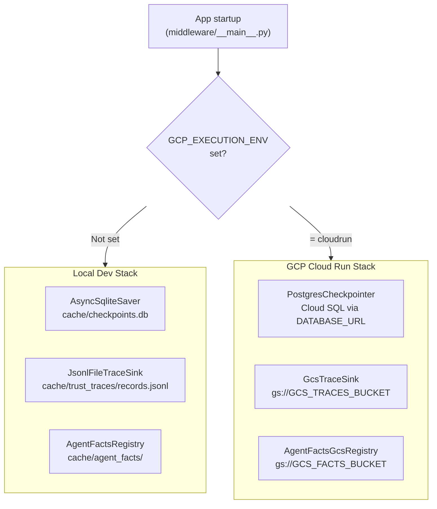

# Recipe 0 — GCP Runtime Adapters

**Goal:** Build the five Python adapter files that let this agent framework run on Google Cloud Platform — with zero cloud resources created. This is pure code work. When Recipe 0 is done, the framework knows *how* to talk to GCP; Recipes 1–5 actually provision the infrastructure it will talk to.

**Status:** Complete (2026-05-22) | 36 tests passing | No GCP resources created

---

## Before We Start: A Story

Picture this. It is a Monday morning. You have been building an AI agent on your laptop for the past two months. It works beautifully. You type a question in your browser, the agent thinks, uses tools, writes trust traces to a local file, and streams the answer back. Everything lives in `cache/` — SQLite for checkpoints, JSONL for traces, JSON files for the agent's identity card.

Now your manager says: "Ship it to GCP by Friday."

You open the code and you start to worry. *What happens to that SQLite file when Cloud Run spins up a fresh container?* *Who reads the agent identity card when there is no `cache/` folder?* *Where do the trust traces go when `/tmp` gets wiped on every cold start?*

These are the right questions. And they each have a clean answer. This recipe documents the five adapter files that bridge the gap between "works on my laptop" and "runs on GCP." We will walk through them one by one — not just *what* they do, but *why* they need to exist and what would break without them.

---

## Prerequisites

- Recipe 0 has no cloud prerequisites. No GCP account needed yet.
- Python 3.10+ with the repo installed: `pip install -e ".[dev]"`
- Familiarity with the four-layer architecture: `trust/` → `services/` → `components/` → `orchestration/`
- Optional but helpful: read [`docs/Architectures/GCP_DEPLOYMENT_ARCHITECTURE.md`](../../../docs/Architectures/GCP_DEPLOYMENT_ARCHITECTURE.md) §6 before this doc

---

## The Five Lessons

---

### Lesson 1 — The Checkpointer Problem

**`agent_ui_adapter/adapters/runtime/postgres_saver.py`**

> "Your agent remembers where it left off in a conversation. Where does that memory live?"

On your laptop, LangGraph stores the conversation checkpoint in a SQLite file at `cache/checkpoints.db`. That file sits on your hard drive and survives restarts. Perfect for local development.

Now deploy to Cloud Run. Cloud Run is a *serverless* platform — think of it as a vending machine that spins up a container when a request arrives and shuts it down when things go quiet. Each container gets a fresh, empty filesystem. Your `cache/checkpoints.db` never existed in this new container. The agent has amnesia. Every conversation starts from scratch.

**GCP's answer: Cloud SQL.** Think of it as a managed Postgres database that lives *outside* the container, in a durable service that Cloud Run can reach over a private connection. No matter how many container instances spin up or down, they all connect to the same database. The conversation checkpoint is always there.

The `AsyncPostgresSaver` class from `langgraph-checkpoint-postgres` speaks to that database. But it needs lifecycle management — connecting, running the one-time schema migration (`setup()`), and closing the connection gracefully when the app shuts down. That is exactly what our wrapper does:

```python
# agent_ui_adapter/adapters/runtime/postgres_saver.py

class PostgresCheckpointer:
    """Manages an AsyncPostgresSaver lifecycle for Cloud Run."""

    @classmethod
    def from_env(cls) -> PostgresCheckpointer:
        """Build from DATABASE_URL environment variable."""
        url = os.environ.get("DATABASE_URL")
        if not url:
            raise RuntimeError("DATABASE_URL environment variable is required")
        return cls(url)

    async def __aenter__(self) -> PostgresCheckpointer:
        from langgraph.checkpoint.postgres.aio import AsyncPostgresSaver
        self._saver = AsyncPostgresSaver.from_conn_string(self._connection_string)
        await self._saver.setup()   # runs migrations once on first connect
        return self
```

The key design decision is the async context manager pattern. The `setup()` call needs to run exactly once per process startup — not once per request. By wrapping it in `__aenter__`, we guarantee it runs during the FastAPI `lifespan` event, before the first request arrives.

> **Why not just use SQLite on a mounted volume?** Cloud Run does not support persistent mounted volumes at Tier A without Filestore, which costs ~$200/mo minimum. Cloud SQL at the smallest shared-core tier costs ~$12/mo. The math is easy.

**Checkpoint question:** After `PostgresCheckpointer.__aenter__` returns, what guarantees that the Postgres schema is ready for LangGraph to write checkpoints into?

*Answer: the `await self._saver.setup()` call inside `__aenter__` runs the `langgraph-checkpoint-postgres` migrations synchronously before any request is served.*

---

### Lesson 2 — The Vanishing Traces Problem

**`services/trace_sinks/gcs_sink.py`**

> "Every time your agent makes a decision, it emits a trust trace record. Where does it go?"

On your laptop, the `JsonlTraceSink` appends each `TrustTraceRecord` to `cache/trust_traces/records.jsonl`. Simple, auditable, works offline. In the cloud, that file vanishes with the container.

We need somewhere outside the container. Somewhere cheap, durable, and requiring zero maintenance. This is the exact problem object storage was invented to solve.

**GCP's answer: Google Cloud Storage (GCS).** Think of GCS as an infinite filing cabinet in the sky. You give each document a name (a *key*), upload it, and it stays there forever — or until you delete it. You pay only for what you store (pennies per gigabyte per month at dev-tier volume). It needs no server, no maintenance, no capacity planning.

Our `GcsTraceSink` implements the same `TraceSink` protocol as `JsonlTraceSink`, so the rest of the codebase never knows which sink is active:

```python
# services/trace_sinks/gcs_sink.py

def emit(self, record: TrustTraceRecord) -> None:
    client = self._get_client()
    bucket = client.bucket(self._bucket_name)

    date_str = record.timestamp.strftime("%Y-%m-%d")
    key = f"{self._prefix}/{date_str}/{record.trace_id}/{record.event_id}.json"

    blob = bucket.blob(key)
    blob.upload_from_string(
        record.model_dump_json(),
        content_type="application/json",
    )
```

Notice the key structure: `traces/2026-05-22/trace-abc123/event-xyz.json`. This is *date partitioning*. It means that when you want to audit all traces from last Tuesday, you list blobs under `traces/2026-05-19/` instead of scanning a 10-GB file. It also means GCS lifecycle rules can automatically move old traces to cheaper storage tiers (more on that in Recipe 2).

The client is lazily initialized — the first time `emit()` is called, the `google-cloud-storage` library creates an authenticated client using the service account credentials that Cloud Run provides automatically. You do not write any authentication code. Cloud Run handles it.

> **Why one file per event rather than batching?** At Tier A (dev traffic, <1 GB/mo), the API call overhead is negligible and the simplicity is worth it. Each event is immediately durable — no buffering, no flush() to forget. Tier B graduates to Pub/Sub (Lesson 3) when write volume justifies it.

**Checkpoint question:** Two trace records arrive in the same second, with the same `trace_id` but different `event_id` values. Do they overwrite each other in GCS?

*Answer: No. The key includes `event_id`, so they become two separate objects in GCS.*

---

### Lesson 3 — The Future Bottleneck (Wire Now, Activate Later)

**`services/trace_sinks/pubsub_sink.py`**

> "What happens six months from now, when your agent is handling 1000 requests per hour?"

At that volume, a direct GCS write per event means thousands of HTTP calls per minute. GCS handles this fine technically, but the cost grows, the latency accumulates in the hot path, and you eventually want a fanout — send the same trace to GCS *and* BigQuery *and* a real-time dashboard without changing the agent code.

**GCP's answer: Cloud Pub/Sub.** Think of Pub/Sub as a message queue with a megaphone. Your code *publishes* a message to a *topic* (the megaphone). Any number of *subscribers* (GCS, BigQuery, your monitoring system) listen to that topic and each receive a copy. The publisher does not know or care how many consumers exist.

We build `PubSubTraceSink` now — even though we do not activate it at Tier A — because the cost of writing it while the code is fresh is near zero, and retrofitting it later requires careful coordination:

```python
# services/trace_sinks/pubsub_sink.py

def emit(self, record: TrustTraceRecord) -> None:
    publisher = self._get_publisher()
    data = record.model_dump_json().encode("utf-8")
    future = publisher.publish(
        self._topic_path,
        data,
        trace_id=record.trace_id,       # Pub/Sub message attributes
        event_type=record.event_type,   # queryable without parsing body
        agent_id=record.agent_id,
    )
    future.result()  # wait for acknowledgement
```

The attributes (`trace_id`, `event_type`, `agent_id`) attached to each Pub/Sub message let subscribers filter by these fields without deserializing the full JSON body. A compliance subscriber might only care about `event_type=policy_decision`. A billing subscriber might only want `agent_id=premium-agent`.

The composition root at Tier A selects `GcsTraceSink`. Graduating to `PubSubTraceSink` is a one-line swap in `middleware/__main__.py` — nothing else changes.

> **Why not just use Pub/Sub from day one?** Pub/Sub requires a topic and a subscription to be provisioned, adds ~50ms per publish for the acknowledgement round-trip, and costs more than direct GCS at low volume. At Tier A, the simplicity of "one PUT per event" wins. See [`docs/Architectures/CLOUD_PROVIDER_COMPARISON.md`](../../../docs/Architectures/CLOUD_PROVIDER_COMPARISON.md) §7.2 for the cost crossover analysis.

**Checkpoint question:** If you switch from `GcsTraceSink` to `PubSubTraceSink` in the composition root, what code changes are required in `LangGraphRuntime`, `TraceService`, or any other consumer of the sink?

*Answer: None. Both sinks implement the `TraceSink` protocol (`emit(record: TrustTraceRecord) -> None`). The composition root is the only file that names the concrete class.*

---

### Lesson 4 — The Identity Problem

**`services/governance/agent_facts_gcs_registry.py`**

> "Your agent has an identity card. On your laptop it lives in `cache/agent_facts/`. In the cloud, where is the filing cabinet?"

Every agent in this framework has an `AgentFacts` record — a signed JSON document that declares who the agent is, who owns it, what it is allowed to do, and whether it is active or suspended. On your laptop, the `AgentFactsRegistry` stores and reads these as JSON files in `cache/agent_facts/`. The signature is an HMAC computed from the file contents and a secret, so you can detect tampering.

Deploy to Cloud Run and the `cache/` directory does not exist. The agent has no identity. Authorization fails before the first request.

The solution is the same as for trust traces: move the filing cabinet to GCS. The `AgentFactsGcsRegistry` mirrors the local registry's entire API — `register()`, `get()`, `verify()`, `suspend()`, `restore()` — but every read and write goes to a GCS bucket instead of the local filesystem:

```python
# services/governance/agent_facts_gcs_registry.py

def get(self, agent_id: str) -> AgentFacts:
    client = self._get_client()
    bucket = client.bucket(self._bucket_name)
    blob = bucket.blob(self._blob_path(agent_id))  # "agent_facts/dev-agent.json"

    if not blob.exists():
        raise KeyError(f"Agent '{agent_id}' not found in gs://{self._bucket_name}")

    data = blob.download_as_text()
    return AgentFacts.model_validate_json(data)

def verify(self, agent_id: str) -> bool:
    facts = self.get(agent_id)
    # Same HMAC verification as the local registry
    facts_dict = facts.model_dump(mode="json")
    return verify_signature(
        self._signable_dict(facts_dict), self._secret, facts_dict["signature_hash"]
    )
```

The HMAC signature logic is identical to the local registry — the `trust.signature` module is used in both. This means an identity card registered locally can be uploaded to GCS and verified in the cloud using the same secret. No re-signing needed when you promote from local dev to production.

The path layout in GCS mirrors the local filesystem: `agent_facts/{agent_id}.json` for the identity card and `agent_facts/{agent_id}_audit.jsonl` for the audit trail. If you ever need to debug a GCS-backed registry, you can `gsutil cp` the blobs locally and inspect them with the exact same tools you use for local development.

> **Why store identity cards in GCS rather than Secret Manager?** Secret Manager is optimized for *short, frequently rotated secrets* (API keys, passwords). An `AgentFacts` JSON blob is 1–5 KB and changes infrequently. GCS is cheaper for blobs, supports versioning natively, and keeps all agent-related state (traces and identity) in the same service.

**Checkpoint question:** A bad actor modifies the `capabilities` field in an `AgentFacts` blob stored in GCS. What prevents this from granting the agent new permissions?

*Answer: `verify()` recomputes the HMAC over all signed fields and compares it to the stored `signature_hash`. If any field changed, the signature will not match and `verify()` returns `False`, blocking authorization.*

---

### Lesson 5 — The Bootstrap Problem

**`services/cloud_providers/gcp_identity.py`**

> "The registry is in GCS. The agent needs to load its identity to bootstrap. But the agent does not know its own `agent_id` — how does it find out?"

On your laptop this is easy: the composition root hardcodes `DEV_AGENT_ID = "dev-agent"`. But in the cloud you want multiple deployments (staging, production, a canary) each with a different identity. You do not want to hardcode different IDs into different Docker images.

GCP solves this elegantly with **Workload Identity**. Every Cloud Run service runs as a *service account* (think of it as the service's GCP passport). That service account has an email address like `agent-backend-runtime@my-project.iam.gserviceaccount.com`. The `GcpIdentityResolver` maps that email address to an `agent_id`:

```python
# services/cloud_providers/gcp_identity.py

def resolve(self) -> AgentFacts:
    # Option 1: explicit override (useful in tests and staging)
    agent_id = os.environ.get("GCP_AGENT_ID")
    if agent_id:
        return self._registry.get(agent_id)

    # Option 2: Cloud Run sets GCP_SERVICE_ACCOUNT automatically
    sa_email = os.environ.get("GCP_SERVICE_ACCOUNT")

    # Option 3: query the GCE metadata server (works inside any GCP VM/container)
    if not sa_email:
        sa_email = self._query_metadata_server()

    agent_id = self._map_sa_to_agent_id(sa_email)
    return self._registry.get(agent_id)
```

The default mapping convention is: take the local part of the SA email before `@`. So `agent-backend-runtime@my-project.iam.gserviceaccount.com` maps to `agent_id = "agent-backend-runtime"`. You pre-register an `AgentFacts` card with that `agent_id` in GCS (Recipe 1 bootstrap step), and the running service finds it automatically on startup.

For testing and staging overrides, you just set `GCP_AGENT_ID=staging-agent`. The three-option resolution order means you can always override at any layer without touching the container image.

The metadata server query (`http://metadata.google.internal/...`) uses a 2-second timeout. If the code runs outside GCP (local dev, CI), the request times out and returns `None`. The resolver never crashes on this — it simply falls through to a `RuntimeError` if no identity can be established, which is the correct behavior.

> **Why not hardcode the agent ID in the Docker image?** A hardcoded ID means a new image build every time you want to promote from staging to production, or run a parallel canary. The SA-to-agent-id convention means you can deploy the same image to any environment and control identity purely through IAM and the GCS registry.

**Checkpoint question:** You have a staging Cloud Run service with SA `agent-staging@project.iam.gserviceaccount.com` and a production service with SA `agent-backend-runtime@project.iam.gserviceaccount.com`. Both use the same Docker image. How does each service load the correct `AgentFacts` without any code changes?

*Answer: By naming convention, the staging service resolves `agent_id = "agent-staging"` and the production service resolves `agent_id = "agent-backend-runtime"`. Each loads its own pre-registered identity card from GCS.*

---

## The Composition Switch — Infrastructure as a Feature Flag

Now that we have five adapters, how does the application decide which to use? It reads a single environment variable: `GCP_EXECUTION_ENV`.

Think of it as a feature flag for your infrastructure backend. When the flag is absent, you get the local dev stack — zero cost, zero setup. When the flag is set to `cloudrun`, you get the cloud-native stack.



The relevant section of [`middleware/__main__.py`](../../../middleware/__main__.py):

```python
_GCP_EXECUTION_ENV = os.environ.get("GCP_EXECUTION_ENV")

# In build_dev_app() → lifespan():
if _GCP_EXECUTION_ENV:
    from agent_ui_adapter.adapters.runtime.postgres_saver import PostgresCheckpointer
    async with PostgresCheckpointer.from_env() as pg_cp:
        graph = build_graph(checkpointer=pg_cp.saver, ...)
        yield
else:
    async with AsyncSqliteSaver.from_conn_string(...) as cp:
        graph = build_graph(checkpointer=cp, ...)
        yield

# Trace sink selection:
if _GCP_EXECUTION_ENV:
    trace_service = TraceService(sinks=[GcsTraceSink(gcs_traces_bucket)])
else:
    trace_service = TraceService(sinks=[JsonlFileTraceSink(...)])

# Agent facts registry selection:
if _GCP_EXECUTION_ENV:
    agent_facts_registry = AgentFactsGcsRegistry(bucket_name=gcs_facts_bucket, ...)
else:
    agent_facts_registry = AgentFactsRegistry(storage_dir=agent_facts_dir, ...)
```

This is the *only* place in the codebase where the environment variable is read. Every component below this point receives its dependency injected and never checks `GCP_EXECUTION_ENV` itself. This is why the architecture tests enforce that services and components are framework-agnostic — they only ever see a `TraceSink` protocol or an `AgentFactsRegistry`-shaped object, never the concrete GCP class.

---

## Installing the GCP Dependencies

The five adapters need three GCP libraries. They are gated behind an optional install extra so the base install stays lightweight:

```toml
# pyproject.toml
[project.optional-dependencies]
gcp = [
    "google-cloud-storage>=2.14.0",
    "google-cloud-pubsub>=2.19.0",
    "langgraph-checkpoint-postgres>=2.0.0",
    "psycopg[binary]>=3.1.0",
]
```

For local development and testing (all tests mock the GCP SDK, so no credentials needed):

```bash
pip install -e ".[dev]"          # base install — no GCP libs needed for tests
```

For building the production Docker image (Recipe 3):

```bash
pip install -e ".[gcp]"          # installs all four GCP libraries
```

The GCP imports in each adapter use `TYPE_CHECKING` guards so that importing the adapter class itself never fails even when `google-cloud-storage` is not installed:

```python
from typing import TYPE_CHECKING
if TYPE_CHECKING:
    from google.cloud.storage import Client as StorageClient
```

The actual `import google.cloud.storage` only happens inside `_get_client()`, which is only called at runtime when a GCS operation is needed.

---

## Agent Steps (What Was Done)

The following files were created as part of this recipe. No cloud resources were created or modified.

| File created | Purpose |
|---|---|
| [`agent_ui_adapter/adapters/runtime/postgres_saver.py`](../../../agent_ui_adapter/adapters/runtime/postgres_saver.py) | Async Postgres checkpointer lifecycle wrapper |
| [`services/trace_sinks/gcs_sink.py`](../../../services/trace_sinks/gcs_sink.py) | Direct GCS write sink (Tier A active) |
| [`services/trace_sinks/pubsub_sink.py`](../../../services/trace_sinks/pubsub_sink.py) | Pub/Sub sink (Tier B, wired but inactive) |
| [`services/governance/agent_facts_gcs_registry.py`](../../../services/governance/agent_facts_gcs_registry.py) | GCS-backed signed identity registry |
| [`services/cloud_providers/__init__.py`](../../../services/cloud_providers/__init__.py) | Package init for cloud provider adapters |
| [`services/cloud_providers/gcp_identity.py`](../../../services/cloud_providers/gcp_identity.py) | Workload Identity → AgentFacts resolver |

| File modified | Change |
|---|---|
| [`pyproject.toml`](../../../pyproject.toml) | Added `[gcp]` optional extra |
| [`middleware/__main__.py`](../../../middleware/__main__.py) | Added `GCP_EXECUTION_ENV` composition branch |

| Test file created | Coverage |
|---|---|
| [`tests/services/trace_sinks/test_gcs_sink.py`](../../../tests/services/trace_sinks/test_gcs_sink.py) | 7 tests — failure paths + happy path + protocol compliance |
| [`tests/services/trace_sinks/test_pubsub_sink.py`](../../../tests/services/trace_sinks/test_pubsub_sink.py) | 6 tests — failure paths + happy path + protocol compliance |
| [`tests/services/governance/test_agent_facts_gcs_registry.py`](../../../tests/services/governance/test_agent_facts_gcs_registry.py) | 10 tests — full CRUD + signature verification |
| [`tests/services/cloud_providers/test_gcp_identity.py`](../../../tests/services/cloud_providers/test_gcp_identity.py) | 7 tests — resolution priority + fallback paths |
| [`tests/agent_ui_adapter/adapters/runtime/test_postgres_saver.py`](../../../tests/agent_ui_adapter/adapters/runtime/test_postgres_saver.py) | 6 tests — lifecycle + env reading |

---

## Verify

Run the Recipe 0 test suite. All 36 tests use mocked GCP SDK clients — no GCP credentials or real cloud resources needed:

```bash
pytest tests/services/trace_sinks/test_gcs_sink.py \
       tests/services/trace_sinks/test_pubsub_sink.py \
       tests/services/governance/test_agent_facts_gcs_registry.py \
       tests/services/cloud_providers/test_gcp_identity.py \
       tests/agent_ui_adapter/adapters/runtime/test_postgres_saver.py \
       -v
# Expected: 36 passed
```

Verify architecture layer boundaries are intact:

```bash
pytest tests/architecture/ -q -k "not swap_radius"
# Expected: 77 passed, 1 skipped
```

---

## Human Review Gate

None for Recipe 0. This recipe is pure code with no cloud resources, no credentials, and no infrastructure changes. The only thing a reviewer should check is:

1. The five adapter files are in their layer-correct locations (services layer and adapter layer — no imports from `orchestration/` or `langgraph` in the service files).
2. The `GCP_EXECUTION_ENV` branch in `middleware/__main__.py` only activates when the env var is explicitly set — local dev behavior is unchanged.
3. The `[gcp]` extra in `pyproject.toml` is additive — `pip install -e ".[dev]"` still works without any GCP libraries installed.

---

## For a General Audience

If you are adapting this for a different Next.js + LangGraph stack, the pattern generalizes cleanly:

| This framework does | You probably need |
|---|---|
| `GCP_EXECUTION_ENV` env var gates the cloud stack | Any boolean/string env var that your CI sets but local dev does not |
| `TraceSink` Protocol with `emit()` | Any single-method interface around your telemetry backend |
| `AgentFactsRegistry` swapped for `AgentFactsGcsRegistry` | A registry interface backed by your cloud object store (S3, Azure Blob, GCS) |
| `AsyncSqliteSaver` swapped for `AsyncPostgresSaver` | Any `langgraph-checkpoint-*` compatible saver for your managed database |
| `TYPE_CHECKING` guards on GCP imports | Same pattern for AWS `boto3` or Azure SDK — keeps the import graph clean |

The key insight: every cloud adapter implements an *existing interface* rather than introducing a new one. The rest of the codebase remains framework-agnostic. You can always swap back to the local stack by unsetting the env var.

---

## Rollback

Recipe 0 is pure code. To roll back:

```bash
git revert <commit-sha>   # removes all five adapter files and composition changes
```

The local dev stack (`AsyncSqliteSaver` + `JsonlFileTraceSink` + `AgentFactsRegistry`) is unmodified by this recipe. Unsetting `GCP_EXECUTION_ENV` or simply not setting it restores original behavior with no other changes.

---

## Cost Note

Recipe 0 costs **$0.00**. No cloud resources are created. The GCP libraries are not installed in the base dev environment. The composition switch is dormant until `GCP_EXECUTION_ENV` is set.

The first cloud costs appear in Recipe 2 (Cloud SQL ~$12/mo).

---

## What Comes Next

With the five adapters in place, the code knows *how* to talk to GCP. Recipe 1 creates the GCP project infrastructure that the adapters will connect to: Artifact Registry for Docker images, Secret Manager for API keys, and IAM service accounts with least-privilege access.

Continue to [`docs/recipes/gcp/01_foundations.md`](01_foundations.md) when you are ready to create real cloud resources.
