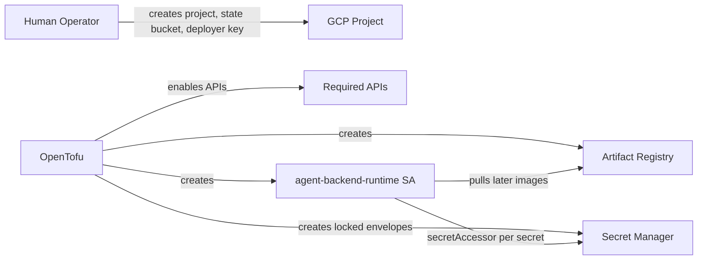

# Recipe 1 — GCP Account Foundations

**Goal:** Bootstrap the `infra/gcp/` OpenTofu stack: enable the GCP APIs, create the Artifact Registry Docker repository, provision the backend runtime service account with least-privilege IAM, and seed all 8 Secret Manager secrets. No Cloud Run service, Cloud SQL database, or data bucket exists yet.

**Status:** Complete (2026-05-22) | 33 tests passing, 1 skipped (`tofu validate` when `tofu` is absent) | No compute or database resources created

---

## Before We Start: A Story

Recipe 0 taught the code how to speak GCP. The app now knows what Cloud SQL, GCS, Pub/Sub, and Workload Identity look like from Python. But the cloud project itself is still an empty lot.

Imagine walking into a new workshop. You have a blueprint and a toolbox, but the doors are locked, the shelves are missing, nobody has a badge, and the safe for credentials has not been installed. That is what a brand-new GCP project looks like before Recipe 1.

This recipe builds the workshop foundations. We do not deploy the backend yet. We do not create the database yet. We create the project-level pieces that every later recipe needs: unlocked APIs, remote state, an image shelf, a runtime identity, and locked envelopes for secrets.



---

## Prerequisites

- Recipe 0 complete (all adapter tests passing).
- Human setup complete per [`HUMAN_SETUP.md`](HUMAN_SETUP.md):
  - GCP project created with billing enabled.
  - GCS state bucket created and versioned.
  - `tofu-deployer` SA created with JSON key at `GOOGLE_APPLICATION_CREDENTIALS`.
  - `infra/gcp/terraform.tfvars` populated (gitignored).
- `tofu` >= 1.6 installed (`brew install opentofu`).
- `python-hcl2` available (`pip install -e ".[dev]"`).

---

## The Five Foundation Lessons

---

### Lesson 1 — The Locked Doors Problem

**`infra/gcp/foundations.tf`**

> "If the project exists, why can't we create Cloud Run, Cloud SQL, or Secret Manager resources yet?"

In GCP, creating a project does not automatically enable every product API. A fresh project is intentionally quiet. Before OpenTofu can create Cloud Run services, Cloud SQL instances, secrets, buckets, or monitoring alerts, those APIs must be enabled.

Think of APIs as doors into each wing of the workshop. Recipe 1 unlocks the doors now so later recipes do not fail halfway through an apply with a cryptic "API has not been used" error.

```hcl
# infra/gcp/foundations.tf

locals {
  required_apis = toset([
    "cloudresourcemanager.googleapis.com",
    "iam.googleapis.com",
    "artifactregistry.googleapis.com",
    "run.googleapis.com",
    "sqladmin.googleapis.com",
    "secretmanager.googleapis.com",
    "storage.googleapis.com",
    "monitoring.googleapis.com",
    "cloudbilling.googleapis.com",
  ])
}

resource "google_project_service" "required" {
  for_each = local.required_apis

  project            = var.gcp_project_id
  service            = each.key
  disable_on_destroy = false
}
```

The important line is `disable_on_destroy = false`. Destroying the stack should not turn off shared project APIs. API disablement is slow, disruptive, and can break anything else using the same project.

> **Why not enable APIs manually in the console?** You can, but then the project is no longer reproducible. OpenTofu should be able to look at `infra/gcp/` and know exactly which platform features this stack depends on.

**Checkpoint question:** Which API makes it possible for Recipe 2 to create Cloud SQL?

*Answer: `sqladmin.googleapis.com`. Recipe 1 enables it now so Recipe 2 can provision the database without an API-enablement detour.*

---

### Lesson 2 — The Deployment Ledger Problem

**`infra/gcp/backend.tf`**

> "Where does OpenTofu remember what it created?"

OpenTofu keeps a state file. That state is the deployment ledger: it records that the Artifact Registry repo exists, which service account email was created, which secret resources are managed, and which outputs later recipes can read.

For local toy projects, that ledger might live on your laptop as `terraform.tfstate`. This stack cannot do that. Recipe 1 writes Secret Manager versions, and secret values appear in state. A local state file would put credentials on developer machines. So the state must live in a restricted, versioned GCS bucket.

```hcl
# infra/gcp/backend.tf

terraform {
  backend "gcs" {
    # bucket = "${PROJECT}-tofu-state"  ← injected via -backend-config at init
    prefix = "infra/gcp"
  }
}
```

The bucket is created by a human in [`HUMAN_SETUP.md`](HUMAN_SETUP.md) before OpenTofu runs. That sounds like a small inconvenience, but it avoids a chicken-and-egg problem: OpenTofu cannot store its own first state inside a bucket it has not created yet.

> **Why not create the state bucket in this same stack?** Because the backend must exist before OpenTofu can initialize. The state bucket is one of the few intentionally manual foundations.

**Checkpoint question:** Why does this backend use the prefix `infra/gcp` instead of sharing `infra/dev-tier`?

*Answer: the new GCP-native stack must coexist with the existing dev-tier stack. Separate prefixes keep their state ledgers isolated even if they share the same GCS bucket.*

---

### Lesson 3 — The Image Shelf Problem

**`infra/gcp/foundations.tf`**

> "Where will Cloud Run pull the backend container from once Recipe 3 builds it?"

Cloud Run does not run source code directly. It runs container images. Before we build those images in Recipe 3 or deploy them in Recipe 4, we need a place to store them.

That place is Artifact Registry. Think of it as a warehouse shelf labeled `agent-backend`. Recipe 1 creates the shelf empty; later recipes place Docker images on it.

```hcl
# infra/gcp/foundations.tf

resource "google_artifact_registry_repository" "backend" {
  project       = var.gcp_project_id
  location      = var.artifact_registry_location
  repository_id = var.artifact_registry_repo_id
  format        = "DOCKER"
  description   = "AgentsFramework combined backend images (Cloud Run Tier A)."

  depends_on = [google_project_service.required]
}
```

The `format = "DOCKER"` line matters. Artifact Registry can store several package types, but Cloud Run needs Docker images. A Maven or npm repository would be a real resource that is useless for this deployment.

> **Why create the repository before we have an image?** It gives Recipe 3 a stable push target and lets IAM be reviewed before a deploy is attempted.

**Checkpoint question:** Which output tells Recipe 3 where to push the backend image?

*Answer: `artifact_registry_url` from `infra/gcp/outputs.tf`. It resolves to a Docker base URL like `us-central1-docker.pkg.dev/<project>/agent-backend`.*

---

### Lesson 4 — The Robot Badge Problem

**`infra/gcp/foundations.tf`**

> "When the backend wakes up in Cloud Run, who is it?"

Every cloud workload needs an identity. If we do nothing, Cloud Run can end up using a broad default identity. That is convenient in demos and dangerous in production. The backend should have a purpose-built badge: enough access to pull its image, write logs and metrics, and read only the secrets it needs.

Recipe 1 creates that badge as `agent-backend-runtime`:

```hcl
# infra/gcp/foundations.tf

resource "google_service_account" "backend_runtime" {
  project      = var.gcp_project_id
  account_id   = "agent-backend-runtime"
  display_name = "Agent Backend (Cloud Run runtime)"
  description  = "Runtime identity for Cloud Run containers..."
}

resource "google_artifact_registry_repository_iam_member" "backend_runtime_ar_reader" {
  role   = "roles/artifactregistry.reader"
  member = "serviceAccount:${google_service_account.backend_runtime.email}"
}
```

It also grants two narrow project-level roles:

- `roles/logging.logWriter` so structured logs reach Cloud Logging.
- `roles/monitoring.metricWriter` so Recipe 7 can emit custom metrics.

Secret access is not granted project-wide. Each secret gets its own `roles/secretmanager.secretAccessor` binding in `secret-manager.tf`.

> **Why not grant `roles/editor` and move faster?** Because this service account will become the identity of the running backend. If the app is compromised, broad roles become broad blast radius. Recipe 1 deliberately keeps the badge small.

**Checkpoint question:** Where is the runtime service account allowed to read secrets from?

*Answer: only from individual Secret Manager resources that bind `roles/secretmanager.secretAccessor` to `local.backend_runtime_member`. There is no project-wide Secret Manager accessor grant.*

---

### Lesson 5 — The Locked Envelopes Problem

**`infra/gcp/secret-manager.tf` and `infra/gcp/variables.tf`**

> "The backend needs API keys and signing material. Where do those live before a container exists?"

Secrets should not live in Docker images, Git history, or command-line flags. Recipe 1 creates Secret Manager shells and first versions for the credentials the backend will need once Cloud Run starts.

There are 8 locked envelopes:

| Secret | Why it exists |
|--------|---------------|
| `workos-api-key` | WorkOS auth middleware |
| `openai-api-key` | LiteLLM primary model |
| `anthropic-api-key` | LiteLLM fallback model |
| `langfuse-public-key` | Observability and eval capture |
| `langfuse-secret-key` | Observability and eval capture |
| `mem0-api-key` | Long-term memory service |
| `database-url` | Cloud SQL connection string; placeholder until Recipe 2 |
| `agent-facts-secret` | HMAC signing key for AgentFacts trust records |

The pattern repeats for each secret: shell, version, accessor binding.

```hcl
# infra/gcp/secret-manager.tf

resource "google_secret_manager_secret" "workos_api_key" {
  project   = var.gcp_project_id
  secret_id = "workos-api-key"
  replication {
    auto {}
  }
}

resource "google_secret_manager_secret_version" "workos_api_key" {
  secret          = google_secret_manager_secret.workos_api_key.id
  secret_data     = var.workos_api_key
  deletion_policy = "ABANDON"
}

resource "google_secret_manager_secret_iam_member" "workos_api_key_accessor" {
  secret_id = google_secret_manager_secret.workos_api_key.secret_id
  role      = "roles/secretmanager.secretAccessor"
  member    = local.backend_runtime_member
}
```

Notice that `secret_data` is not a literal. It comes from a sensitive variable. That keeps secrets in the gitignored `terraform.tfvars` file locally or in `TF_VAR_*` values in CI, never in committed HCL.

The `database-url` secret is created with a placeholder now:

```hcl
# infra/gcp/variables.tf

variable "database_url" {
  type        = string
  sensitive   = true
  default     = "placeholder-set-in-recipe-2"
}
```

Recipe 2 replaces it after Cloud SQL exists. Creating the shell now means Recipe 4 can wire Cloud Run secrets consistently without special cases.

> **Why create secret versions with OpenTofu at all?** Because the stack becomes self-contained: one plan creates the shells and first values. The tradeoff is that state contains secret material, which is why Lesson 2 uses a restricted GCS backend instead of local state.

**Checkpoint question:** If a reviewer sees `secret_data = "sk-live-..."` in HCL, what should happen?

*Answer: reject the change. `secret_data` must reference `var.<name>` or another Tofu expression, never a plaintext literal.*

---

## Agent Steps

These steps prove the workshop is ready before later recipes put anything inside it.

### 1. Verify prerequisite environment

```bash
# Confirm credentials are set
echo $GOOGLE_APPLICATION_CREDENTIALS
gcloud auth print-access-token > /dev/null && echo "credentials OK"

# Confirm project is accessible
export PROJECT=$(grep gcp_project_id infra/gcp/terraform.tfvars | awk -F'"' '{print $2}')
gcloud projects describe $PROJECT
```

### 2. Run HCL/pytest gates (no cloud credentials needed)

```bash
pytest tests/infra/gcp/ -q -m infra_gcp
```

All tests must pass before applying. The suite validates:

- All 9 required APIs declared.
- AR repo is DOCKER format.
- Runtime SA named `agent-backend-runtime`.
- All 8 secrets declared with replication, versions, and IAM accessor.
- No plaintext `secret_data`.
- No forbidden IAM principals.
- Cross-cutting: snake_case names, leading file docstrings, no trace_id manipulation.

Think of these tests as the building inspector. They do not call GCP. They inspect the blueprint before anyone pours concrete.

### 3. OpenTofu init

```bash
cd infra/gcp

tofu init \
  -backend-config="bucket=${PROJECT}-tofu-state" \
  -backend-config="prefix=infra/gcp"
```

### 4. Plan and review

```bash
tofu plan -out=tfplan 2>&1 | tee /tmp/recipe1-plan.txt
```

Expected plan: **~20–25 resources to add**, 0 to change, 0 to destroy.

Resources expected:

- `google_project_service` x 9 (one per API via for_each)
- `google_artifact_registry_repository` x 1
- `google_service_account` x 1 (backend_runtime)
- `google_artifact_registry_repository_iam_member` x 1
- `google_project_iam_member` x 2 (log writer, metric writer)
- `google_secret_manager_secret` x 8
- `google_secret_manager_secret_version` x 8
- `google_secret_manager_secret_iam_member` x 8

### 5. Apply

```bash
tofu apply tfplan
```

Apply takes approximately 60-90 seconds (API enablement is the slow step).

### 6. Capture outputs

```bash
tofu output -json > /tmp/recipe1-outputs.json
cat /tmp/recipe1-outputs.json
```

Save the `artifact_registry_url` and `backend_runtime_service_account_email` outputs. Recipe 3 needs the registry URL for `docker push`; Recipe 4 needs the service account when Cloud Run is deployed.

---

## Human Review Gate

After `tofu apply`, the operator verifies:

- [ ] **APIs enabled:** `gcloud services list --project=$PROJECT --filter="state:ENABLED"` shows all 9 APIs.
- [ ] **AR repo exists:** `gcloud artifacts repositories describe agent-backend --location=us-central1 --project=$PROJECT`
- [ ] **Runtime SA exists:** `gcloud iam service-accounts describe agent-backend-runtime@${PROJECT}.iam.gserviceaccount.com`
- [ ] **Secrets provisioned:** `gcloud secrets list --project=$PROJECT` shows 8 secrets.
- [ ] **No broad IAM bindings:** `gcloud projects get-iam-policy $PROJECT` shows `agent-backend-runtime` only under `roles/logging.logWriter` and `roles/monitoring.metricWriter` at the project level.
- [ ] **Budget (optional):** Recipe 7 adds the billing budget; skip for now.

---

## For A General Audience

If you are adapting this recipe for another Next.js + LangGraph stack:

- Replace `agent-backend` with your Artifact Registry repo name.
- Replace `agent-backend-runtime` with your Cloud Run runtime SA name.
- Adjust `required_apis` in `foundations.tf`: remove `sqladmin.googleapis.com` if you are not using Cloud SQL; add `pubsub.googleapis.com` when you introduce Pub/Sub.
- Keep the remote-state pattern if OpenTofu creates secret versions. Secret values land in state, so local state is the wrong default.
- Treat `database-url` as your durable checkpoint database connection string. If you use Neon, AlloyDB, or another Postgres provider, populate it from that provider instead of Cloud SQL.
- Replace `agent-facts-secret` with your own trust-kernel signing secret if your system uses signed identity or policy documents.

The reusable pattern is: foundations first, runtime identity second, per-secret access third, compute later.

---

## Verify

```bash
# 1. APIs
gcloud services list --project=$PROJECT --filter="state:ENABLED" \
  | grep -E "artifactregistry|run.googleapis|sqladmin|secretmanager|storage|monitoring"

# 2. AR repo
gcloud artifacts repositories describe \
  $(tofu output -raw artifact_registry_repository_id) \
  --location=$(tofu output -raw gcp_region) \
  --project=$PROJECT \
  --format="value(format)"
# Expected: DOCKER

# 3. Secret list
gcloud secrets list --project=$PROJECT --format="value(name)" | sort
# Expected: 8 secrets

# 4. Runtime SA IAM
gcloud projects get-iam-policy $PROJECT \
  --flatten="bindings[].members" \
  --filter="bindings.members:agent-backend-runtime" \
  --format="table(bindings.role)"
# Expected: roles/logging.logWriter, roles/monitoring.metricWriter
# (secretAccessor bindings are per-secret, not project-level)

# 5. HCL test suite (re-run to confirm no drift)
pytest tests/infra/gcp/ -q -m infra_gcp
```

---

## Rollback

Recipe 1 provisions no stateful data (no Cloud SQL, no GCS data buckets). Destroy is safe and fast:

```bash
cd infra/gcp
tofu destroy -auto-approve
```

Secrets in Secret Manager incur a small monthly charge while retained. If you destroy foundations but keep the state bucket for later, remember that state bucket is outside this stack and must be cleaned up manually only when you are certain no future recipe state is needed.

---

## Cost Note (Tier A)

| Resource | Monthly cost |
|----------|-------------|
| Secret Manager (8 secrets, no versions after first) | ~$0.50 |
| Artifact Registry (0 images until Recipe 3) | $0.00 |
| IAM, project services | $0.00 |
| **Recipe 1 subtotal** | **~$0.50/mo** |

Recipe 1 is essentially free until Docker images are pushed in Recipe 3.
