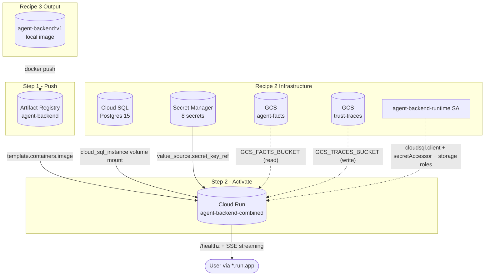

# Recipe 4 — Deploy Combined Backend on Cloud Run

**Goal:** Push the Recipe 3 backend image to Artifact Registry and deploy it as a single public Cloud Run v2 service with SSE-safe settings, the Cloud SQL connector, Secret Manager injection, and `/healthz` probes. After this recipe, the combined middleware + agent backend is reachable at a `*.run.app` URL.

**Status:** Complete | 17 contract tests passing | Tier A compute: ~$0/mo at dev traffic (always-free tier)

---

## Before We Start: A Story

Recipe 0 taught the code how to speak GCP. Recipe 1 built the workshop: unlocked doors (APIs), an image shelf (Artifact Registry), a robot badge (runtime SA), and locked envelopes (Secret Manager). Recipe 2 added the workbench (Cloud SQL) and the filing cabinet (two GCS buckets). Recipe 3 built the shipping crate (a multi-stage Docker image with `middleware/app_prod.py` as the entry point).

But the crate is still on the loading dock. The shelf is empty. The workshop lights are off. The machinery sits idle. Cloud Run does not know your image exists, and even if it did, it would not know which workbench drawer to plug into or which envelope to open.

This recipe does three things:

1. **Push** the backend image from your laptop to Artifact Registry — place the crate on the shelf.
2. **Declare** the Cloud Run service in `infra/gcp/cloud-run-backend.tf` — wire it to the workbench, the filing cabinet, and the locked envelopes.
3. **Apply** so Cloud Run pulls the image, mounts the Cloud SQL socket, injects 8 secrets from Secret Manager, and starts probing `/healthz`.



The dashed IAM edge from `agent-backend-runtime SA` matters: the Cloud SQL volume mount alone does not authenticate. The runtime service account needs `roles/cloudsql.client` (granted in Recipe 2) and `roles/secretmanager.secretAccessor` on each secret (granted in Recipe 1). Recipe 4's `depends_on` block makes that ordering explicit so the first deploy doesn't crash with `PERMISSION_DENIED`.

---

## Prerequisites

- **Recipes 0–3 complete.** Adapters wired, foundations applied, data tier provisioned, Docker image builds locally.
- **`DATABASE_URL` secret value populated with the Cloud SQL connector format** (Recipe 2). The shell exists from Recipe 1, but the value must be the connector form:
  ```text
  postgresql+asyncpg://USER:PASSWORD@/DB?host=/cloudsql/PROJECT:REGION:INSTANCE
  ```
  Not TCP. The runtime fails fast if `DATABASE_URL` lacks the `host=/cloudsql/...` query parameter.
- **At least one signed AgentFacts JSON uploaded to the agent-facts bucket.** Without this, the runtime fails identity lookup on the first authenticated request and `/run/stream` returns 500 instead of streaming.
- **`gcloud` authenticated** and **`tofu init`** run per [`HUMAN_SETUP.md`](HUMAN_SETUP.md).

---

## The Five Activation Lessons

---

### Lesson 1 — The Tag Mutability Problem

**`var.backend_image` and `docker push`**

> "I built `agent-backend:v1` locally and pushed it. I just pushed a fix with the same tag. Why doesn't Cloud Run pick it up?"

A Docker tag like `:v1` looks like a name, but Cloud Run does not pull by tag at runtime — it pins the running revision to the **image digest** that was current at deploy time. Pushing a new image to the same tag does not redeploy. The shelf now holds a different crate, but the service is still running the one it loaded when you applied.

To roll out a new build you must:

1. Push the new image (same or new tag).
2. Run `tofu apply` again. OpenTofu re-resolves `var.backend_image` to the current digest and creates a new Cloud Run revision. Cloud Run shifts traffic to the new revision (100% by default; we use `TRAFFIC_TARGET_ALLOCATION_TYPE_LATEST`).

```hcl
variable "backend_image" {
  type        = string
  description = "Container image URI for the combined backend Cloud Run service."
  default     = "us-docker.pkg.dev/cloudrun/container/hello"
}
```

The variable defaults to GCP's hello container so a fresh `tofu apply` doesn't fail before you've pushed anything. The first apply with the placeholder boots a Cloud Run service that fails `/healthz` (no `/healthz` endpoint in the hello image) — that is intentional and forces you to push the real backend before promoting any traffic in production.

Key decisions:

- **Tag with a meaningful version (`:v1`, `:2026-05-23-abc1234`)** — never `:latest`. `:latest` makes rollbacks ambiguous and breaks reproducibility.
- **Tofu pins the digest at apply time.** If you later need to roll back to a known-good image, set `backend_image` to the digest form (`...@sha256:...`) instead of a tag.
- **Artifact Registry retains old digests.** Even if you re-push `:v1`, the previous digest is still addressable until garbage-collected. The cost is ~$0.10/GB/mo for stored layers — cheap enough to keep multiple builds.

**Checkpoint question:** If I run `docker push agent-backend:v1` after fixing a bug, will the running Cloud Run revision pick up the fix on the next request?

*Answer: No. The running revision is pinned to the image digest from the last `tofu apply`. You must run `tofu apply` again so OpenTofu records the new digest and Cloud Run creates a new revision. Tags are mutable on the registry side; revisions on Cloud Run are immutable.*

---

### Lesson 2 — The Socket-Not-the-String Problem

**`infra/gcp/cloud-run-backend.tf` — Cloud SQL volume + secret injection**

> "Recipe 2 gave me a `DATABASE_URL`. Why does Cloud Run mount a Unix socket at `/cloudsql/...` instead of just letting the app open a TCP connection?"

Cloud SQL accepts two connection paths:

- **Public IP + TCP** — requires either a public IP (security risk and quota cost) or a VPC connector (extra ~$10/mo for a serverless VPC access connector).
- **Cloud SQL connector via Unix socket** — Cloud Run injects a sidecar process that opens an authenticated tunnel and exposes a Unix socket inside the container at `/cloudsql/<connection-name>`. No public IP, no VPC connector, no extra cost.

The connector path is wired through the `volumes` block:

```hcl
volumes {
  name = "cloudsql"
  cloud_sql_instance {
    instances = [google_sql_database_instance.main.connection_name]
  }
}

volume_mounts {
  name       = "cloudsql"
  mount_path = "/cloudsql"
}
```

The `DATABASE_URL` value (set in Recipe 2) uses the socket path, not a TCP host:

```text
postgresql+asyncpg://USER:PASSWORD@/DB?host=/cloudsql/PROJECT:REGION:INSTANCE
```

The `host=/cloudsql/...` query parameter tells `asyncpg` to dial the Unix socket instead of opening a TCP connection. The Cloud SQL connector terminates the IAM-authenticated tunnel on the other side.

**Public identifier vs private credential — the env-var rule.** The same TF file teaches a security pattern worth memorizing. WorkOS hands you two values: a `client_id` that is public (it appears in JWT claims and OAuth redirect URLs anyway) and an `api_key` that must never be logged. The pattern is the same for any provider:

```hcl
# Plain env — WorkOS client ID is a public identifier (safe in plain text)
env {
  name  = "WORKOS_CLIENT_ID"
  value = var.workos_client_id
}

# Secret — WorkOS API key is a credential (must use secret_key_ref)
env {
  name = "WORKOS_API_KEY"
  value_source {
    secret_key_ref {
      secret  = google_secret_manager_secret.workos_api_key.secret_id
      version = "latest"
    }
  }
}
```

Same product, two patterns, one rule: **identifiers go in plain env; credentials go through `secret_key_ref`**. The same logic puts `LANGFUSE_HOST` in plain env (it's the public Langfuse Cloud URL) and `LANGFUSE_SECRET_KEY` behind `secret_key_ref`.

The full plain-env list in Recipe 4: `GCP_EXECUTION_ENV`, `ARCHITECTURE_PROFILE`, `AGENT_OFFLOAD_DIR`, `GCS_FACTS_BUCKET`, `GCS_TRACES_BUCKET`, `WORKOS_CLIENT_ID`, `LANGFUSE_HOST`, `MEM0_BASE_URL`. The full secret list (8 values via `secret_key_ref`): `WORKOS_API_KEY`, `OPENAI_API_KEY`, `ANTHROPIC_API_KEY`, `LANGFUSE_PUBLIC_KEY`, `LANGFUSE_SECRET_KEY`, `MEM0_API_KEY`, `DATABASE_URL`, `AGENT_FACTS_SECRET`.

> **Why is `LANGFUSE_PUBLIC_KEY` a secret if "public" is in the name?** Langfuse's "public key" is public to its **server**, not to the world — it's still a credential that pairs with the secret key for SDK authentication. A leaked public key plus secret key gives an attacker write access to your Langfuse project. When in doubt, treat it as a credential.

Key decisions:

- **`/cloudsql` mount path** — convention used by every Google Cloud SQL example. Don't change it; the connector hardcodes this path.
- **Connector instead of Auth Proxy sidecar** — Cloud Run v2 has the connector built in. No need to bundle `cloud-sql-proxy` in the image (which is what AWS RDS users often do for Lambda).
- **Secrets reference `google_secret_manager_secret.<name>.secret_id`, not literal strings** — keeps the dependency graph explicit so OpenTofu knows the secret must exist before the service.

**Checkpoint question:** Why is `WORKOS_CLIENT_ID` a plain env var while `WORKOS_API_KEY` uses `secret_key_ref`?

*Answer: The client ID is a public identifier — it appears in OAuth redirect URLs and JWT claims and is meant to be visible. The API key is a credential that authenticates the backend to WorkOS; logging it or putting it in plain env would leak it to anyone with read access to the Cloud Run service description. The rule is identifiers in plain env, credentials through `secret_key_ref`.*

---

### Lesson 3 — The Two-Timeout Problem

**`var.backend_request_timeout_seconds = 3600` and Recipe 3's `--timeout-keep-alive 620`**

> "Recipe 3 set `--timeout-keep-alive 620` so SSE sockets don't drop. Why does Recipe 4 also set `timeout = '3600s'` on the Cloud Run service? Aren't those the same thing?"

They are not. Cloud Run enforces **two independent timeouts**, and a long SSE stream needs both knobs set. Recipe 3 handled one; Recipe 4 handles the other.

| Timeout | Default | Cap | Where set | Purpose |
|---------|---------|-----|-----------|---------|
| Per-request **wall clock** | 300s (5 min) | 3600s (60 min) | `template.timeout` in Cloud Run service | Maximum total duration of a single HTTP request |
| **Idle connection** | 600s (10 min) | (uvicorn-side) | `--timeout-keep-alive` in `Dockerfile.backend` CMD | How long the TCP socket stays open between bytes |

Recipe 4 sets the wall clock:

```hcl
timeout = "${var.backend_request_timeout_seconds}s"  # validated == 3600 in variables.tf
```

```hcl
variable "backend_request_timeout_seconds" {
  default = 3600
  validation {
    condition     = var.backend_request_timeout_seconds == 3600
    error_message = "Tier A SSE constraint: backend_request_timeout_seconds must be 3600."
  }
}
```

Recipe 3 set the keep-alive:

```dockerfile
# Dockerfile.backend (Recipe 3)
CMD ["uvicorn", "middleware.app_prod:build_combined_app", "--factory",
     "--host", "0.0.0.0", "--port", "8080", "--timeout-keep-alive", "620"]
```

**What happens if you set only one knob.** A long ReAct run streaming SSE chunks every few seconds:

- **Only keep-alive=620, default 300s wall clock:** the stream drops at minute 5 mid-response. The user sees a truncated answer.
- **Only timeout=3600s, default 600s idle:** if the model pauses for >10 minutes between tokens (rare but possible during long tool calls), Cloud Run's idle timer fires before uvicorn's. The user sees a dropped connection.
- **Both set:** the stream survives up to one hour total, with idle gaps up to 620 seconds between bytes.

Why 620 and not 600? Cloud Run's idle timer fires at exactly 600 seconds. If uvicorn closes the socket at the same instant, there's a race; the client may see an `ERR_INCOMPLETE_CHUNKED_ENCODING` rather than a clean termination. 620 keeps uvicorn's side open ~20 seconds longer than Cloud Run's, so Cloud Run's timer always fires first and uvicorn observes a graceful close.

Key decisions:

- **3600s is the GCP cap** for HTTP/1.1 requests on Cloud Run v2. You cannot go higher without re-architecting (e.g., split the long task into a background job; see Recipe 6 meta ring).
- **The validation block in `variables.tf` rejects any other value** — this is policy-as-code: an operator who sets `backend_request_timeout_seconds = 1800` to "save costs" gets a `tofu plan` error explaining the SSE constraint.
- **Don't combine with `cpu_idle = false`.** `cpu_idle = true` means Cloud Run can throttle CPU between active requests; for SSE streaming you still want this on (the stream is active, so CPU stays allocated). Setting `cpu_idle = false` keeps a full CPU billed even when idle — burns money for no benefit at Tier A.

**Checkpoint question:** A user starts a long agent run. The model takes 4 minutes to respond, streaming a token every 50ms. Which of the two timeouts matters most?

*Answer: The wall-clock timeout (`template.timeout = 3600s`). Tokens arrive every 50ms so the idle timer never fires — the connection is never idle long enough. But the total request duration approaches the per-request cap, which is why we set it to 60 minutes instead of the 5-minute default. If the same model paused 11 minutes mid-response (e.g., a slow tool call), the idle timer would matter; that's why `--timeout-keep-alive 620` is the second knob.*

---

### Lesson 4 — The Boot-Order Problem

**`depends_on`, startup vs liveness probes, and the Postgres migration**

> "Why does the Cloud Run resource declare an explicit `depends_on` for every secret accessor and the Cloud SQL IAM grant? Doesn't OpenTofu figure that out from the references?"

It does for the resource bodies — `secret_key_ref` references the secret, so the secret must exist first. But IAM bindings are **separate resources** that grant the runtime SA permission to **read** those secrets. OpenTofu cannot infer the dependency: the Cloud Run resource body never mentions the IAM bindings.

Without explicit deps, OpenTofu's parallel apply can create the Cloud Run service before the IAM bindings exist. The first revision boots, tries to read its 8 secrets, gets `PERMISSION_DENIED` from Secret Manager, and crashes. Cloud Run marks the revision unhealthy and the deploy fails.

The fix lives at the bottom of `cloud-run-backend.tf`:

```hcl
depends_on = [
  google_secret_manager_secret_iam_member.workos_api_key_accessor,
  google_secret_manager_secret_iam_member.openai_api_key_accessor,
  google_secret_manager_secret_iam_member.anthropic_api_key_accessor,
  google_secret_manager_secret_iam_member.langfuse_public_key_accessor,
  google_secret_manager_secret_iam_member.langfuse_secret_key_accessor,
  google_secret_manager_secret_iam_member.mem0_api_key_accessor,
  google_secret_manager_secret_iam_member.database_url_accessor,
  google_secret_manager_secret_iam_member.agent_facts_secret_accessor,
  google_project_iam_member.backend_runtime_cloudsql_client,
]
```

Eight secret accessors plus one project-level grant for `roles/cloudsql.client`. All must exist before the service tries to start its first revision.

**Startup probe vs liveness probe.** Once the service exists with the right IAM, Cloud Run runs two distinct probes against `/healthz`:

```hcl
startup_probe {
  http_get { path = "/healthz"; port = 8080 }
  initial_delay_seconds = 0
  timeout_seconds       = 5
  period_seconds        = 5
  failure_threshold     = 3
}

liveness_probe {
  http_get { path = "/healthz"; port = 8080 }
  timeout_seconds   = 5
  period_seconds    = 30
  failure_threshold = 3
}
```

| Probe | Period | Failure window | When it runs |
|-------|--------|----------------|--------------|
| Startup | 5s | 15s (5s × 3) | Cold start, before traffic routes. Failure here means revision never becomes healthy. |
| Liveness | 30s | 90s (30s × 3) | Steady state, after startup succeeded. Failure here causes the container to be killed and restarted. |

The 15-second startup window is tight. For an `min_instance_count = 0` service (Tier A scale-to-zero), every cold start re-runs the startup probe. The combined backend boots fast — uvicorn import + FastAPI factory + lifespan hooks ≈ 3 seconds — but the Postgres checkpointer must connect to Cloud SQL during the lifespan hook. If the database is unreachable, the lifespan hook hangs and `/healthz` never returns 200, blowing past the 15-second window.

**The first-deploy gotcha — Postgres schema migration.** LangGraph's `AsyncPostgresSaver` does not auto-migrate. The schema (`checkpoints`, `checkpoint_writes`, `checkpoint_blobs` tables) must be created **before** the service tries to use it. If you `tofu apply` Recipe 4 without running `setup()` first, every `/run/stream` request 500s with `relation "checkpoints" does not exist`, even though `/healthz` itself stays green (the lifespan hook only opens the connection pool; it doesn't query tables).

This is why the agent steps below run the migration as a one-shot **before** the Terraform apply — the workbench needs its drawers organized before the machinery tries to use it.

Key decisions:

- **`execution_environment = "EXECUTION_ENVIRONMENT_GEN2"`** — Gen2 supports the Cloud SQL volume mount (Gen1 does not) and has lower cold-start latency.
- **`startup_cpu_boost = true`** — gives the cold start a temporary extra CPU allocation so the lifespan hook completes inside the 15-second probe window.
- **`cpu_idle = true`** — pairs with scale-to-zero to keep cost on the always-free tier.
- **No retries on `setup()`.** The migration is idempotent; if it fails, fix the cause (usually a wrong `DATABASE_URL` format) and re-run, don't paper over with retry logic.

**Checkpoint question:** OpenTofu created the Cloud Run service. The first request 500s with `relation "checkpoints" does not exist`. `/healthz` is green. What did I forget?

*Answer: The Postgres schema migration. `AsyncPostgresSaver.setup()` creates the LangGraph checkpoint tables. It must be run once before the service handles real traffic. `/healthz` stays green because the lifespan hook only opens a connection pool; it doesn't query tables. The 500 only surfaces when an actual graph run tries to checkpoint.*

---

### Lesson 5 — The Unlocked-Door Problem

**`google_cloud_run_v2_service_iam_binding.backend_public_invoker` and the `-combined` suffix**

> "The IAM binding grants `roles/run.invoker` to `allUsers`. Anyone on the internet can hit my service URL. Where did authentication go?"

At Tier A, the door is unlocked. Every room inside has a guard. That is the design, not an oversight.

The Cloud Run IAM binding makes the service publicly invokable:

```hcl
resource "google_cloud_run_v2_service_iam_binding" "backend_public_invoker" {
  project  = var.gcp_project_id
  location = google_cloud_run_v2_service.backend_combined.location
  name     = google_cloud_run_v2_service.backend_combined.name
  role     = "roles/run.invoker"
  members  = ["allUsers"]
}
```

Authentication moves up one layer — into the application. `middleware/server.py` enforces a WorkOS JWT check on every request except `/healthz`. Without a valid Bearer token, `/run/stream` returns 401. The "rooms" inside the service (the protected routes) each verify identity; the "door" (the IAM invoker check) is open so the JWT layer can run at all.

**Why not lock the door instead?** Tier A is single-service, no internal load balancer. To use IAM-based invoker auth you need either:

- Service-to-service auth via OIDC tokens (works for backend-to-backend; doesn't work for browser users), or
- An internal load balancer with IAP (Identity-Aware Proxy) — adds ~$25/mo for the LB plus IAP licensing, and breaks public sign-in flows that don't go through a corporate identity provider.

For Tier A dev traffic, the WorkOS-in-app pattern keeps cost on the free tier and keeps the sign-in UX clean. The trade-off is that **every request reaches the container** before being rejected — including unauthenticated probes. WorkOS's JWT verification is fast (no remote call; verifies a JWKS-cached signature), so this is acceptable at Tier A volume.

**The `-combined` suffix encodes Tier A Option A.** The service name is `agent-backend-combined`, not `agent-backend`. The suffix is meaningful: it marks this as the **combined** middleware + agent runtime in a single Cloud Run service (Tier A Option A, documented in [`docs/plans/gcp_deployment_recipes.plan.md`](../../plans/gcp_deployment_recipes.plan.md) §"Tier A topology"). When you grep Cloud Run logs in production, the suffix tells you immediately which architecture you're looking at.

> **Tier B future.** When traffic grows or teams need independent deploy cycles for the BFF and the agent runtime, Option B splits them: `agent-bff` (auth/ACL) on one Cloud Run service behind an internal LB with IAM-bound invoker SAs, `agent-runtime` (SSE streaming) on a second service called only by the BFF. Both run inside a perimeter where `roles/run.invoker = allUsers` is replaced by service-to-service OIDC. See [`docs/recipes/gcp/TIER_B_FUTURE.md`](TIER_B_FUTURE.md) for the full decision guide and B1–B5 upgrade path.

Key decisions:

- **`ingress = "INGRESS_TRAFFIC_ALL"`** — accepts traffic from the public internet. Tier B switches to `INGRESS_TRAFFIC_INTERNAL_LOAD_BALANCER` when the internal LB lands.
- **WorkOS JWT verification happens in the application, not in a sidecar or middleware proxy.** This keeps the security model auditable in one place (`middleware/server.py`) and avoids the cost and operational complexity of a service mesh.
- **`/healthz` is intentionally pre-auth.** Cloud Run's probe loop doesn't carry a Bearer token. If `/healthz` required auth, every probe would 401 and the revision would never become ready (Recipe 3 Lesson 4 covered this).

**Checkpoint question:** I want a stricter security posture: only my frontend Cloud Run service should be allowed to invoke the backend. What changes?

*Answer: Replace `members = ["allUsers"]` with `members = ["serviceAccount:<frontend-runtime-sa>@<project>.iam.gserviceaccount.com"]` and have the frontend obtain an OIDC ID token before calling the backend (Cloud Run injects this automatically when both services use IAM auth). Browsers cannot mint OIDC tokens, so all browser traffic must go through the frontend BFF — which is exactly the Tier B Option B topology.*

---

## Agent Steps

These steps activate the machinery: place the crate on the shelf, prepare the workbench, then flip the switch.

### 4.1 — Place the crate on the shelf (build and push)

```bash
cd /path/to/agent

PROJECT=$(tofu -chdir=infra/gcp output -raw gcp_project_id)
AR_URL=$(tofu -chdir=infra/gcp output -raw artifact_registry_url)
IMAGE="${AR_URL}/agent-backend:v1"

# Authenticate Docker to Artifact Registry
gcloud auth configure-docker "${AR_URL%%/*}" --quiet

# Build (Recipe 3 Dockerfile)
docker build -f Dockerfile.backend -t agent-backend:v1 .
docker tag agent-backend:v1 "$IMAGE"
docker push "$IMAGE"
```

The crate is now on the shelf. Verify with `gcloud artifacts docker images list "${AR_URL}"`.

### 4.2 — Label the crate location (set `backend_image` in tfvars)

```hcl
backend_image = "us-central1-docker.pkg.dev/your-project/agent-backend/agent-backend:v1"
```

OpenTofu now knows which crate to load.

### 4.3 — Prepare the workbench (one-shot Postgres migration)

> **First-deploy gotcha:** Run this **before** `tofu apply`. LangGraph's `AsyncPostgresSaver.setup()` is not idempotent in the sense that it must be invoked once before the schema exists; without it, every `/run/stream` request 500s with `relation "checkpoints" does not exist`, and `/healthz` will not catch the problem because the lifespan hook only opens the connection pool — it doesn't query tables.

```bash
# Open a tunnel to the Cloud SQL instance from your laptop
cloud-sql-proxy "$(tofu -chdir=infra/gcp output -raw cloud_sql_connection_name)" &

# Pull the populated DATABASE_URL secret (Cloud SQL connector format from Recipe 2)
export DATABASE_URL="$(gcloud secrets versions access latest --secret=database-url --project=$PROJECT)"

# Run the migration
python -c "
import asyncio
from langgraph.checkpoint.postgres.aio import AsyncPostgresSaver
async def main():
    async with AsyncPostgresSaver.from_conn_string('$DATABASE_URL') as saver:
        await saver.setup()
asyncio.run(main())
print('Postgres checkpointer schema ready')
"

# Tear down the tunnel
kill %1 2>/dev/null || true
```

### 4.4 — Flip the switch (apply Cloud Run Terraform)

```bash
cd infra/gcp
tofu plan -out=tfplan -var-file=terraform.tfvars
tofu apply tfplan
```

Resources created by Recipe 4:

| Resource | Purpose |
|----------|---------|
| `google_cloud_run_v2_service.backend_combined` | Combined middleware + agent backend on port 8080 |
| `google_cloud_run_v2_service_iam_binding.backend_public_invoker` | `allUsers` → `roles/run.invoker` (Tier A dev) |

Key service settings (from `cloud-run-backend.tf`):

| Setting | Value | Why |
|---------|-------|-----|
| `template.timeout` | `3600s` | SSE + long ReAct runs (Lesson 3 wall clock) |
| `scaling.min_instance_count` | `0` | Scale-to-zero (Tier A cost) |
| `scaling.max_instance_count` | `10` | Cost cap |
| `resources.cpu_idle` | `true` | Free-tier billing on min=0 |
| `resources.startup_cpu_boost` | `true` | Cold-start within 15s startup-probe window |
| `execution_environment` | `EXECUTION_ENVIRONMENT_GEN2` | Required for Cloud SQL volume mount |
| `volumes.cloud_sql_instance` | `/cloudsql` mount | Built-in connector, no Auth Proxy sidecar |
| `startup_probe` | `GET /healthz`, 5s × 3 | Cold-start liveness gate |
| `liveness_probe` | `GET /healthz`, 30s × 3 | Steady-state liveness |

Plain env vars (8 values, set via `env { name = ...; value = ... }`):

| Variable | Source |
|----------|--------|
| `GCP_EXECUTION_ENV` | `cloudrun` (literal) |
| `ARCHITECTURE_PROFILE` | `v3` (literal) |
| `AGENT_OFFLOAD_DIR` | `/tmp/agent_offload` (literal) |
| `GCS_FACTS_BUCKET` | Recipe 2 bucket name |
| `GCS_TRACES_BUCKET` | Recipe 2 bucket name |
| `WORKOS_CLIENT_ID` | `var.workos_client_id` (public identifier) |
| `LANGFUSE_HOST` | `https://cloud.langfuse.com` (literal) |
| `MEM0_BASE_URL` | `https://api.mem0.ai` (literal) |

Secrets (8 values, via `value_source.secret_key_ref`): `WORKOS_API_KEY`, `OPENAI_API_KEY`, `ANTHROPIC_API_KEY`, `LANGFUSE_PUBLIC_KEY`, `LANGFUSE_SECRET_KEY`, `MEM0_API_KEY`, `DATABASE_URL`, `AGENT_FACTS_SECRET`.

---

## Human Review Gate

Before proceeding to Recipe 5, the operator verifies:

- [ ] **Image pushed** — `gcloud artifacts docker images list ${AR_URL}` shows `agent-backend:v1`.
- [ ] **Service healthy** — `curl -s "$(tofu output -raw backend_url)/healthz"` returns `{"status":"ok","profile":"v3","runtime":"langgraph","mode":"combined"}`.
- [ ] **No secrets in env literals** — `gcloud run services describe agent-backend-combined --region=$REGION --format=json` shows secrets as `valueSource.secretKeyRef`, never plain `value`.
- [ ] **Cloud SQL connected** — tail the revision logs and confirm Postgres checkpointer init without connection errors:
  ```bash
  gcloud logging read \
    'resource.type=cloud_run_revision AND resource.labels.service_name=agent-backend-combined' \
    --limit=50 --project=$PROJECT --format='value(textPayload)'
  ```
  Look for `Postgres checkpointer ready` or equivalent lifespan-hook log lines. Common failures: `connection refused` (DATABASE_URL TCP form instead of socket), `PERMISSION_DENIED` (missing `roles/cloudsql.client` — would only happen if `depends_on` was bypassed), `relation "checkpoints" does not exist` (skipped step 4.3).
- [ ] **IAM review** — `allUsers` invoker is acceptable for Tier A dev; tighten before production (Lesson 5 sketches the Tier B path).
- [ ] **DATABASE_URL format** — `gcloud secrets versions access latest --secret=database-url` returns the connector form `postgresql+asyncpg://...?host=/cloudsql/PROJECT:REGION:INSTANCE`, not a TCP host.

---

## Smoke Test

```bash
BACKEND=$(tofu -chdir=infra/gcp output -raw backend_url)

# Health (no auth required)
curl -s "${BACKEND}/healthz" | jq .
# Expected: {"status":"ok","profile":"v3","runtime":"langgraph","mode":"combined"}

# SSE stream (requires WorkOS Bearer token from a signed-in session;
# Recipe 5 adds the frontend that produces these tokens)
curl -N -H "Authorization: Bearer $TOKEN" \
  -H "Content-Type: application/json" \
  -d '{"thread_id":"smoke-test","input":{"messages":[{"role":"user","content":"Say hello in one word."}]}}' \
  "${BACKEND}/run/stream"
# Expected: text/event-stream chunks within ~5s, then sentinel line
```

If you don't have a `$TOKEN` yet, the `/healthz` check is enough to confirm Recipe 4 succeeded; the SSE smoke test repeats after Recipe 5 lands the frontend.

---

## For a General Audience

If adapting for another FastAPI + LangGraph stack:

1. Replace `agent-backend-combined` with your service name. Pick a suffix that encodes the topology decision (`-combined`, `-bff`, `-runtime`) so logs are self-documenting.
2. Keep `timeout = "3600s"` if you use SSE streaming. Pair it with a uvicorn `--timeout-keep-alive` value above your platform's idle timeout (Cloud Run: 600s default → 620 in uvicorn).
3. Wire Cloud SQL via the `volumes.cloud_sql_instance` block — not the legacy v1 annotation alone. Use the Unix-socket form of `DATABASE_URL` (`host=/cloudsql/...`).
4. Inject secrets via Secret Manager `secret_key_ref`, never plain env values. Apply the public-ID-vs-credential rule consistently: identifiers in plain env, credentials behind `secret_key_ref`.
5. Expose a pre-auth `/healthz` probe endpoint. The probe loop does not carry your auth token; if `/healthz` requires auth, no revision ever becomes ready.

The reusable pattern is: push image first, wire Cloud SQL volume second, inject secrets third, declare explicit `depends_on` for IAM bindings, run schema migrations before apply, probe `/healthz` last.

---

## Verify

```bash
# Infra contract tests (no cloud credentials required)
pytest tests/infra/gcp/test_cloud_run_backend.py -q

# Full GCP infra suite
pytest tests/infra/gcp/ -q -m infra_gcp

# Conftest policy gate (Rego rules in policies/cloud_run.rego)
cd infra/gcp && conftest test --policy policies/ --parser hcl2 --all-namespaces *.tf
```

The contract tests verify: service name `agent-backend-combined`, `timeout = 3600s`, `min_instance_count = 0`, `cpu_idle = true`, `startup_cpu_boost = true`, `/healthz` on both probes, dedicated runtime SA (not default Compute SA), all 8 secrets via `secret_key_ref`, Cloud SQL volume present, `allUsers` public invoker, `backend_url` output exists.

---

## Rollback

```bash
cd infra/gcp

# Remove Cloud Run service AND its IAM binding (the binding references the
# service, so it must come down first or together)
tofu destroy \
  -target=google_cloud_run_v2_service_iam_binding.backend_public_invoker \
  -target=google_cloud_run_v2_service.backend_combined \
  -auto-approve
```

The Recipe 2 data tier (Cloud SQL + GCS buckets), Recipe 1 Secret Manager shells, and the Artifact Registry image all remain. Re-applying Recipe 4 picks up where it left off — cheap to retain between iterations.

---

## Cost Note

| Resource | Monthly cost (dev traffic) |
|----------|---------------------------|
| Cloud Run compute (min=0, within free tier) | ~$0.00 |
| Cloud Run requests (< 2M/mo free tier) | ~$0.00 |
| Artifact Registry storage (~400MB image) | ~$0.04 |
| **Recipe 4 incremental** | **~$0.04/mo** |
| **Cumulative (Recipes 1–4)** | **~$9.25/mo** |

Cumulative breakdown: Recipe 1 ~$0.50 (8 secrets) + Recipe 2 ~$8.70 (Cloud SQL dominates) + Recipe 3 $0 (local images only) + Recipe 4 ~$0.04 (Artifact Registry storage) ≈ $9.24/mo, rounded to $9.25. Cloud SQL still dominates the bill; Cloud Run compute stays within the always-free tier at Tier A dev traffic.

---

## Files Created/Modified

| File | Action |
|------|--------|
| `infra/gcp/cloud-run-backend.tf` | Created — combined backend Cloud Run service + IAM binding |
| `infra/gcp/variables.tf` | Modified — `backend_image`, sizing vars, `backend_request_timeout_seconds` validation |
| `infra/gcp/outputs.tf` | Modified — `backend_url`, `backend_service_name` |
| `infra/gcp/policies/cloud_run.rego` | Modified — Cloud SQL volume gate, timeout=3600s, min=0, /healthz, dedicated SA |
| `infra/gcp/features/cloud_run_backend.feature` | Created — terraform-compliance BDD scenarios |
| `infra/gcp/terraform.tfvars.example` | Modified — `backend_image` comment block |
| `tests/infra/gcp/test_cloud_run_backend.py` | Created — 17 Recipe 4 contract tests |
