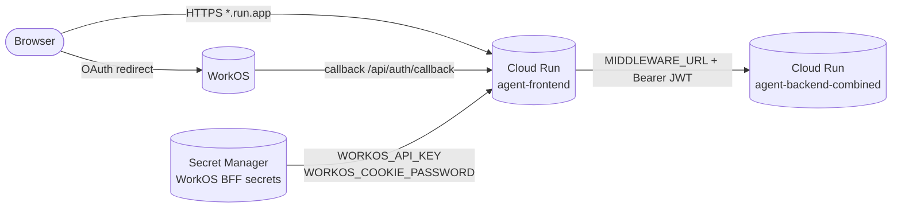

# Recipe 5 — Deploy Frontend on Cloud Run

**Goal:** Push the Recipe 3 frontend image to Artifact Registry and deploy it as a second public Cloud Run v2 service. The Next.js BFF proxies authenticated requests to the combined backend via `MIDDLEWARE_URL`, exposes WorkOS sign-in at `/api/auth/*`, and sets `NEXT_PUBLIC_WORKOS_REDIRECT_URI` to match the deployed `*.run.app` callback URL.

**Status:** Complete | 18 contract tests passing | Tier A compute: ~$0/mo at dev traffic (always-free tier)

---

## Before We Start: A Story

Recipe 4 put the combined backend on the loading dock and turned the lights on — `/healthz` returns 200, SSE streams work, Postgres and GCS are wired. But users still cannot sign in. The backend expects a WorkOS Bearer token on every `/run/stream` call, and nothing in the browser produces one yet.

Recipe 5 adds the storefront:

1. **Push** the frontend image from Recipe 3 to the same Artifact Registry repo (`agent-frontend:v1`).
2. **Declare** `infra/gcp/cloud-run-frontend.tf` — wire `MIDDLEWARE_URL` to the backend URI, inject WorkOS BFF secrets, compute the OAuth redirect URI.
3. **Apply** so Cloud Run starts the Next.js standalone server on port 3000 and probes `/`.
4. **Human gate** — add the redirect URI to the WorkOS dashboard before testing sign-in.



The dashed edge from Secret Manager is deliberately narrow: the frontend SA receives `secretAccessor` on **WorkOS BFF secrets only** — never `DATABASE_URL`, LLM keys, or `agent-facts-secret`. That is FE-AP-18 in practice: no backend credentials on the BFF container, and no secrets in `NEXT_PUBLIC_*` env vars.

---

## Prerequisites

- **Recipes 0–4 complete.** Backend healthy at `tofu output -raw backend_url`.
- **Recipe 3 frontend image builds locally:**
  ```bash
  docker build -f Dockerfile.frontend -t agent-frontend:dev ./frontend
  docker run -p 3000:3000 \
    -e MIDDLEWARE_URL=http://host.docker.internal:8080 \
    -e WORKOS_CLIENT_ID=client_... \
    -e WORKOS_API_KEY=sk_test_... \
    -e WORKOS_COOKIE_PASSWORD="$(python -c 'import secrets; print(secrets.token_urlsafe(32))')" \
    -e NEXT_PUBLIC_WORKOS_REDIRECT_URI=http://localhost:3000/api/auth/callback \
    agent-frontend:dev
  curl -s http://localhost:3000/ | head
  ```
- **`workos_cookie_password` populated in `terraform.tfvars`.** New in Recipe 5 (>= 32 chars). Generate with:
  ```bash
  python -c "import secrets; print(secrets.token_urlsafe(32))"
  ```
- **`gcloud` authenticated** and **`tofu init`** run per [`HUMAN_SETUP.md`](HUMAN_SETUP.md).

---

## The Four Frontend Lessons

### Lesson 1 — The BFF Secret Boundary

**`cloud-run-frontend.tf` — WorkOS secrets only**

> "The frontend needs WorkOS for sign-in. Does that mean it gets the same Secret Manager grants as the backend?"

No. The Next.js BFF needs exactly two server-side secrets:

| Env var | Source | Why |
|---------|--------|-----|
| `WORKOS_API_KEY` | `workos-api-key` secret (shared with backend) | AuthKit server routes call WorkOS API |
| `WORKOS_COOKIE_PASSWORD` | `workos-cookie-password` secret (frontend-only) | iron-session cookie encryption |

Everything else stays on the backend: `DATABASE_URL`, LLM keys, Langfuse, Mem0, `agent-facts-secret`. The contract test `test_frontend_has_no_backend_secret_refs` rejects any wiring mistake at CI time.

Public env vars on the frontend:

| Env var | Value |
|---------|-------|
| `MIDDLEWARE_URL` | `google_cloud_run_v2_service.backend_combined.uri` |
| `WORKOS_CLIENT_ID` | `var.workos_client_id` |
| `NEXT_PUBLIC_WORKOS_REDIRECT_URI` | `${frontend.uri}/api/auth/callback` |
| `ARCHITECTURE_PROFILE` | `v3` |

**Checkpoint question:** Can I put `OPENAI_API_KEY` on the frontend to "simplify" CopilotKit wiring?

*Answer: No. FE-AP-18 AUTO-REJECT. LLM calls flow through the backend; the BFF holds no model credentials.*

---

### Lesson 2 — The Redirect URI Chicken-and-Egg

**`NEXT_PUBLIC_WORKOS_REDIRECT_URI`**

> "WorkOS needs the callback URL before sign-in works. Cloud Run assigns the URL at deploy time. How do we wire both?"

The frontend service sets:

```hcl
env {
  name  = "NEXT_PUBLIC_WORKOS_REDIRECT_URI"
  value = "${google_cloud_run_v2_service.frontend.uri}/api/auth/callback"
}
```

OpenTofu resolves `frontend.uri` after the service is created. On first apply, Cloud Run may roll a second revision once the URI is known — that is expected. The operator copies the stable value from:

```bash
tofu output -raw frontend_workos_redirect_uri
```

into the WorkOS dashboard (HUMAN_SETUP.md §6). The path is **`/api/auth/callback`**, matching `frontend/app/api/auth/[...workos]/route.ts` — not `/auth/callback`.

---

### Lesson 3 — The SSE Proxy Timeout

**`timeout = 3600s` on the frontend**

> "SSE streaming happens on the backend. Why does the frontend also need a 1-hour timeout?"

BFF route handlers proxy `/run/stream` byte-for-byte to `MIDDLEWARE_URL`. The browser's SSE connection terminates at the frontend Cloud Run service, not the backend. If the frontend timeout were 300s (Cloud Run default), long agent runs would be cut off mid-stream even though the backend allows 3600s.

Recipe 5 sets `frontend_request_timeout_seconds = 3600` with the same validation as the backend.

---

### Lesson 4 — The Root Probe

**`startup_probe` → `/` on port 3000**

> "The backend probes `/healthz`. What does the frontend probe?"

Next.js standalone does not expose `/healthz`. The Dockerfile HEALTHCHECK and Cloud Run probes both target `/` on port 3000 — the root page returns 200 when the server is ready. Rego policy `cloud_run.rego` enforces path `/` for `agent-frontend` and `/healthz` for `agent-backend-combined`.

---

## Agent Steps

### 5.1 — Push the frontend image

```bash
cd infra/gcp
PROJECT=$(tofu output -raw gcp_project_id)
AR_URL=$(tofu output -raw artifact_registry_url)

docker build -f Dockerfile.frontend -t agent-frontend:v1 ../frontend
docker tag agent-frontend:v1 "${AR_URL}/agent-frontend:v1"
docker push "${AR_URL}/agent-frontend:v1"
```

Add to `terraform.tfvars`:

```hcl
frontend_image = "<artifact_registry_url>/agent-frontend:v1"
workos_cookie_password = "<32+ char secret>"
```

### 5.2 — Apply Recipe 5

```bash
cd infra/gcp
tofu plan -out=tfplan -var-file=terraform.tfvars
tofu apply tfplan
```

### 5.3 — Verify outputs

```bash
tofu output -raw frontend_url
tofu output -raw frontend_workos_redirect_uri
tofu output -raw backend_url
```

---

## Human Review Gate

Before testing sign-in, the operator verifies:

- [ ] **Image pushed** — `gcloud artifacts docker images list ${AR_URL}` shows `agent-frontend:v1`.
- [ ] **Frontend healthy** — `curl -sI "$(tofu output -raw frontend_url)/"` returns HTTP 200.
- [ ] **WorkOS redirect URI added** — WorkOS Dashboard → Authentication → Redirects includes:
  ```text
  $(tofu output -raw frontend_workos_redirect_uri)
  ```
  Example: `https://agent-frontend-xxxxxxxx-uc.a.run.app/api/auth/callback`
- [ ] **No backend secrets on frontend** — `gcloud run services describe agent-frontend --region=$REGION --format=json` shows only `WORKOS_API_KEY` and `WORKOS_COOKIE_PASSWORD` as `valueSource.secretKeyRef`.
- [ ] **MIDDLEWARE_URL points at backend** — env dump shows the Recipe 4 `backend_url`.
- [ ] **Browser sign-in + SSE** — sign in via the frontend URL, send a chat message, confirm SSE chunks arrive within ~5s.

---

## Smoke Test

```bash
FRONTEND=$(tofu -chdir=infra/gcp output -raw frontend_url)
BACKEND=$(tofu -chdir=infra/gcp output -raw backend_url)

# Frontend root (no auth)
curl -sI "${FRONTEND}/" | head -1
# Expected: HTTP/2 200

# Backend still healthy
curl -s "${BACKEND}/healthz" | jq .
# Expected: {"status":"ok",...}

# After WorkOS sign-in in browser — SSE via BFF proxy (requires session cookie)
# Use Playwright T3 suite or manual browser test:
#   BASE_URL=$FRONTEND MIDDLEWARE_URL=$BACKEND E2E_AUTHENTICATED=1 pnpm test:e2e
```

---

## For a General Audience

If adapting for another Next.js + FastAPI BFF stack:

1. Keep backend credentials off the frontend container — proxy all authenticated API calls through `MIDDLEWARE_URL`.
2. Set Cloud Run timeout to match your longest SSE stream on **both** services if the BFF proxies streaming.
3. Wire `NEXT_PUBLIC_*` vars as plain env (they are public by design); inject server secrets via Secret Manager `secret_key_ref`.
4. Match the WorkOS redirect path to your AuthKit route handler exactly — dashboard typos are the #1 sign-in failure in staging.
5. Use a dedicated runtime SA per service with least-privilege secret grants.

---

## Verify

```bash
# Infra contract tests (no cloud credentials required)
pytest tests/infra/gcp/test_cloud_run_frontend.py -q

# Full GCP infra suite
pytest tests/infra/gcp/ -q -m infra_gcp

# Conftest policy gate
cd infra/gcp && conftest test --policy policies/ --parser hcl2 --all-namespaces *.tf
```

---

## Rollback

```bash
cd infra/gcp

tofu destroy \
  -target=google_cloud_run_v2_service_iam_binding.frontend_public_invoker \
  -target=google_cloud_run_v2_service.frontend \
  -auto-approve
```

The backend service, data tier, and Artifact Registry images remain. Re-applying Recipe 5 picks up where it left off.

---

## Cost Note

| Resource | Monthly cost (dev traffic) |
|----------|---------------------------|
| Cloud Run compute (min=0, within free tier) | ~$0.00 |
| Cloud Run requests (< 2M/mo free tier) | ~$0.00 |
| Secret Manager (+1 secret: workos-cookie-password) | ~$0.06 |
| Artifact Registry storage (~200MB frontend image) | ~$0.02 |
| **Recipe 5 incremental** | **~$0.08/mo** |
| **Cumulative (Recipes 1–5)** | **~$9.33/mo** |

Cloud SQL (~$8.70/mo) still dominates. Both Cloud Run services stay within the always-free tier at Tier A dev traffic.

---

## Files Created/Modified

| File | Action |
|------|--------|
| `infra/gcp/cloud-run-frontend.tf` | Created — Next.js frontend Cloud Run service + IAM binding |
| `infra/gcp/foundations.tf` | Modified — `frontend_runtime` SA + AR reader + log writer |
| `infra/gcp/secret-manager.tf` | Modified — `workos-cookie-password` secret + frontend IAM on WorkOS secrets |
| `infra/gcp/variables.tf` | Modified — `frontend_image`, sizing vars, `workos_cookie_password` |
| `infra/gcp/outputs.tf` | Modified — `frontend_url`, `frontend_workos_redirect_uri`, frontend SA email |
| `infra/gcp/policies/cloud_run.rego` | Modified — service-aware probe paths; Cloud SQL gate backend-only |
| `infra/gcp/features/cloud_run_frontend.feature` | Created — terraform-compliance BDD scenarios |
| `infra/gcp/terraform.tfvars.example` | Modified — frontend image + cookie password |
| `tests/infra/gcp/test_cloud_run_frontend.py` | Created — 18 Recipe 5 contract tests |
| `tests/infra/gcp/test_secret_manager.py` | Modified — 9 secrets; frontend-only secret exclusions |
| `infra/gcp/features/secret_manager.feature` | Modified — `workos-cookie-password` scenario |
| `docs/recipes/gcp/HUMAN_SETUP.md` | Modified — redirect URI path fix + cookie password variable |
