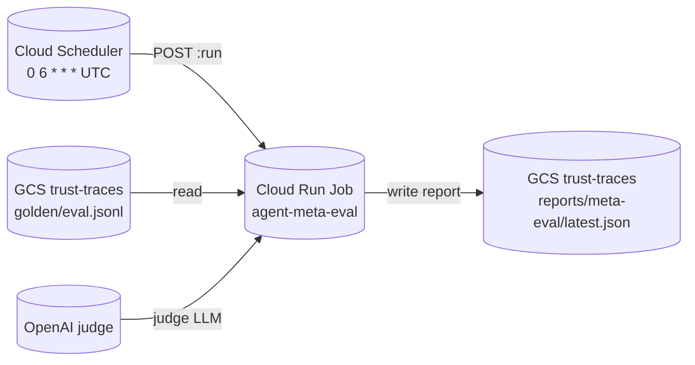

# Recipe 6 — Meta Ring (Optional)

**Goal:** Optionally schedule nightly offline evaluation via Cloud Scheduler → Cloud Run Job running `python -m meta.run_eval` against a golden-set JSONL in the trust-traces GCS bucket. **Disabled by default** at Tier A — enable only when the team wants automated judge scoring without a laptop cron.

**Status:** Complete | 16 contract tests passing | Tier A incremental: ~$0.10/mo when enabled (Scheduler + occasional Job CPU)

---

## Before We Start: A Story

Recipes 0–5 gave you a live agent stack: traces land in GCS, Postgres holds checkpoints, users sign in through the frontend. But nobody is *reading* those traces overnight to answer: "Is the agent getting worse?"

Recipe 6 adds the **meta ring** — the offline governance loop from the four-layer architecture:

1. **Upload** a golden-set JSONL to the trust-traces bucket (`golden/eval.jsonl`).
2. **Opt in** with `enable_meta_ring = true` in `terraform.tfvars`.
3. **Apply** so Cloud Scheduler fires at 06:00 UTC and Cloud Run Job runs the judge pipeline.
4. **Read** the report at `gs://<project>-trust-traces/reports/meta-eval/latest.json`.



The meta job reuses the **same backend Docker image** from Recipe 3 — no third Dockerfile. It gets `OPENAI_API_KEY` only (for the LLM judge), plus read/write on the trust-traces bucket. It never sees `DATABASE_URL`, WorkOS keys, or `agent-facts-secret`.

---

## Prerequisites

- **Recipes 0–5 complete.** Backend image pushed; trust-traces bucket exists.
- **Golden set uploaded to GCS:**
  ```bash
  BUCKET=$(tofu -chdir=infra/gcp output -raw trust_traces_bucket)
  gsutil cp meta/CodeReviewerAgentTest/fixtures/golden.jsonl "gs://${BUCKET}/golden/eval.jsonl"
  ```
  Replace the source path with your project's canonical golden set.
- **Local CLI smoke (no cloud):**
  ```bash
  pytest tests/meta/test_run_eval.py -q
  python -m meta.run_eval \
    --golden-set /path/to/golden.jsonl \
    --output /tmp/eval-report.json
  ```

---

## The Three Meta Lessons

### Lesson 1 — Skip by Default at Tier A

**`enable_meta_ring = false`**

> "Should every dev deploy run nightly LLM judge calls?"

No. Tier A optimizes for ~$12–15/mo. Nightly judge runs add OpenAI spend and Scheduler Job invocations. Recipe 6 ships **disabled**; operators opt in explicitly when eval automation is worth the cost.

---

### Lesson 2 — Reuse the Backend Image

**`image = var.backend_image`**

> "Does the meta ring need its own container?"

No. `meta/run_eval.py` lives in the same Python package tree as the backend. The Cloud Run Job overrides the container command to `python -m meta.run_eval` instead of uvicorn. One build pipeline, one Artifact Registry tag.

---

### Lesson 3 — Narrow IAM Boundary

**`agent-meta-runtime` SA**

> "The judge needs an API key. Does the meta job get the same secrets as the backend?"

No. The meta runtime SA receives:

| Grant | Scope | Why |
|-------|-------|-----|
| `roles/storage.objectViewer` | trust-traces bucket | Read golden set |
| `roles/storage.objectCreator` | trust-traces bucket | Write eval report |
| `secretAccessor` | `openai-api-key` only | LLM judge |
| `roles/artifactregistry.reader` | backend repo | Pull image |

It does **not** get Cloud SQL client, agent-facts read, or any other Secret Manager key. Contract tests reject `DATABASE_URL` on the job at CI time.

---

## Agent Steps

### 6.1 — Upload golden set

```bash
cd infra/gcp
BUCKET=$(tofu output -raw trust_traces_bucket)
gsutil cp /path/to/your/golden.jsonl "gs://${BUCKET}/golden/eval.jsonl"
```

### 6.2 — Enable meta ring in terraform.tfvars

```hcl
enable_meta_ring = true
# Optional overrides:
# meta_cron_schedule = "0 6 * * *"
# meta_golden_set_gcs_uri = "gs://your-project-trust-traces/golden/eval.jsonl"
```

### 6.3 — Apply Recipe 6

```bash
cd infra/gcp
tofu plan -out=tfplan -var-file=terraform.tfvars
tofu apply tfplan
```

### 6.4 — Manual job run (smoke)

```bash
gcloud run jobs execute agent-meta-eval \
  --region=$(tofu output -raw gcp_region) \
  --wait

REPORT=$(tofu output -raw meta_report_uri)
gsutil cat "${REPORT#gs://}" | jq '.mean_score, .scored_records'
```

---

## Human Review Gate

Before relying on nightly evals, the operator verifies:

- [ ] **Golden set exists** — `gsutil ls gs://$(tofu output -raw trust_traces_bucket)/golden/`
- [ ] **Job execution succeeds** — `gcloud run jobs executions list --job=agent-meta-eval --region=$REGION` shows Succeeded
- [ ] **Report written** — `gsutil cat $(tofu output -raw meta_report_uri | sed 's|gs://||')` returns valid JSON with `mean_score`
- [ ] **No backend secrets on job** — `gcloud run jobs describe agent-meta-eval --region=$REGION --format=json` shows only `OPENAI_API_KEY` as secret ref
- [ ] **Scheduler active** — Cloud Console → Cloud Scheduler → `agent-meta-eval-nightly` → Enabled

---

## Local Alternative (Tier A default)

Skip Recipe 6 entirely and run eval locally against a GCS snapshot:

```bash
BUCKET=$(tofu -chdir=infra/gcp output -raw trust_traces_bucket)
mkdir -p /tmp/meta-snapshot
gsutil cp "gs://${BUCKET}/golden/eval.jsonl" /tmp/meta-snapshot/
OPENAI_API_KEY=sk-... python -m meta.run_eval \
  --golden-set /tmp/meta-snapshot/eval.jsonl \
  --output /tmp/eval-report.json
```

This costs $0 in GCP Scheduler/Job compute and is the recommended path until nightly automation is required.

---

## For a General Audience

If adapting for another LangGraph + observability stack:

1. Keep offline eval jobs off the live SSE service — use Cloud Run Jobs / ECS tasks / CronJobs.
2. Scope the job SA to read-only on trace storage plus write on a reports prefix.
3. Inject only the LLM key the judge needs; never copy production DB credentials to batch jobs.
4. Default the feature off in cost-sensitive tiers; document a local `gsutil cp` + CLI fallback.

---

## Verify

```bash
# Infra contract tests (no cloud credentials required)
pytest tests/infra/gcp/test_meta.py -q

# Full GCP infra suite
pytest tests/infra/gcp/ -q -m infra_gcp

# Meta pipeline unit tests
pytest tests/meta/test_run_eval.py -q

# Conftest policy gate
cd infra/gcp && conftest test --policy policies/ --parser hcl2 --all-namespaces *.tf
```

---

## Rollback

```bash
cd infra/gcp

# Disable without destroying other recipes
# Set enable_meta_ring = false in terraform.tfvars, then:
tofu apply -var-file=terraform.tfvars

# Or targeted destroy:
tofu destroy \
  -target=google_cloud_scheduler_job.meta_eval \
  -target=google_cloud_run_v2_job.meta_eval \
  -auto-approve
```

Cloud Run services, data tier, and backend image remain untouched.

---

## Cost Note

| Resource | Monthly cost (when enabled) |
|----------|----------------------------|
| Cloud Scheduler (1 job) | ~$0.10 |
| Cloud Run Job (1×/day, ~5 min) | ~$0.00–0.05 (within free tier at dev volume) |
| OpenAI judge LLM calls | Variable (depends on golden set size) |
| **Recipe 6 incremental (infra only)** | **~$0.10/mo** |
| **When disabled (`enable_meta_ring=false`)** | **$0.00** |

---

## Files Created/Modified

| File | Action |
|------|--------|
| `infra/gcp/meta.tf` | Created — Cloud Run Job + Scheduler + IAM |
| `infra/gcp/variables.tf` | Modified — `enable_meta_ring`, cron, GCS URIs, job sizing |
| `infra/gcp/outputs.tf` | Modified — meta ring outputs |
| `infra/gcp/foundations.tf` | Modified — `cloudscheduler.googleapis.com` API |
| `infra/gcp/policies/meta.rego` | Created — Conftest policy for meta job shape |
| `infra/gcp/features/meta.feature` | Created — terraform-compliance BDD scenarios |
| `infra/gcp/terraform.tfvars.example` | Modified — meta ring opt-in block |
| `meta/run_eval.py` | Modified — CLI + GCS path support (`python -m meta.run_eval`) |
| `tests/infra/gcp/test_meta.py` | Created — 16 Recipe 6 contract tests |
| `tests/infra/gcp/test_foundations.py` | Modified — cloudscheduler API in required set |
