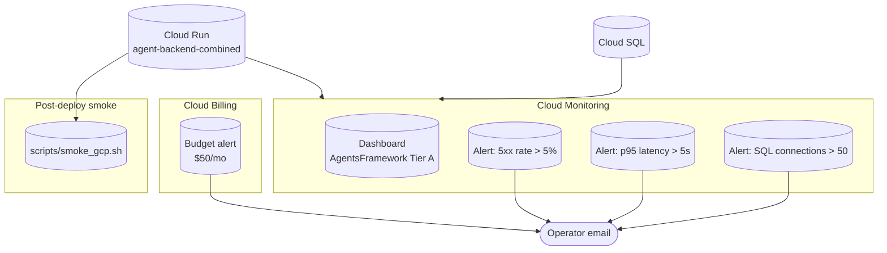

# Recipe 7 — Observability + Smoke Tests + Budget

**Goal:** Add minimal Tier A observability so operators can see health at a glance, get alerted before users notice, and catch cost creep early. Wire an end-to-end smoke script that validates `/healthz` and (optionally) authenticated SSE streaming after deploy.

**Status:** Complete | 14 contract tests passing | Tier A incremental: ~$0.00/mo (Monitoring dashboards + alert policies are free; budget alerts are free)

---

## Before We Start: A Story

Recipes 0–6 gave you a working agent stack on GCP: combined backend, frontend with WorkOS sign-in, Postgres checkpoints, GCS traces, and an optional meta ring. But when something breaks at 2 AM, you need three questions answered fast:

1. **Is the backend returning errors?** (5xx rate)
2. **Are requests slow?** (p95 latency — cold starts, LLM stalls, Postgres pool saturation)
3. **Are we about to blow the budget?** (billing alert at $50/mo)

Recipe 7 adds the **observability ring** — the minimum viable ops layer for Tier A:



The dashboard and alert policies are **always provisioned**. The billing budget and email notification channel are **opt-in via terraform.tfvars** — CI `tofu validate` works without a billing account ID.

---

## Prerequisites

- **Recipes 0–5 complete.** Backend and frontend Cloud Run services deployed and healthy.
- **`billing_account_id` in terraform.tfvars** (for budget alerts):
  ```bash
  gcloud billing accounts list --format='value(name)'
  # Returns: XXXXXX-XXXXXX-XXXXXX
  ```
- **Optional `alert_notification_email`** — alerts appear in Cloud Console even without email; email makes them actionable off-hours.
- **Deployer SA needs billing budget permission** (add to HUMAN_SETUP if not already granted):
  ```bash
  gcloud billing accounts add-iam-policy-binding $BILLING_ACCOUNT \
    --member="serviceAccount:tofu-deployer@${PROJECT}.iam.gserviceaccount.com" \
    --role="roles/billing.admin"
  ```

---

## The Three Observability Lessons

### Lesson 1 — Alert on Ratios, Not Raw Counts

**`backend_5xx_rate` uses `denominator_filter`**

> "Why ratio alerting for 5xx?"

At Tier A dev traffic, a single 500 error might look like a spike in raw counts. Ratio alerting (5xx / total requests) fires only when error *rate* exceeds 5% over 5 minutes — fewer false positives at low volume.

---

### Lesson 2 — Budget Before Scale

**`monthly_budget_usd = 50`**

> "Why $50 when Tier A is ~$12–15/mo?"

Headroom. Cloud SQL autoresize (disabled at Tier A), forgotten `min_instances`, or a runaway LLM loop can 10× costs silently. A $50 budget alert at 50%/90%/100% thresholds catches creep before it becomes a surprise invoice.

---

### Lesson 3 — Smoke Tests Match Production Paths

**`scripts/smoke_gcp.sh` hits `/run/stream`, not `/agent/runs/stream`**

> "Why a separate smoke script?"

The combined backend (`middleware/app_prod.py`) exposes BFF-compatible routes: `/healthz` (pre-auth) and `/run/stream` (Bearer JWT). The smoke script mirrors what the frontend actually calls — not the Agent Protocol paths on the standalone adapter server.

---

## Agent Steps

### 7.1 — Review observability.tf

File: `infra/gcp/observability.tf`

Resources:
- `google_monitoring_dashboard.agent_tier_a` — 5 tiles: backend request rate, p95 latency, 5xx rate, Cloud SQL connections, frontend request rate
- `google_monitoring_alert_policy.backend_5xx_rate` — ratio alert, 5% over 5 min
- `google_monitoring_alert_policy.backend_latency_p95` — p95 > 5000 ms over 5 min
- `google_monitoring_alert_policy.cloud_sql_connections` — connections > 50 over 5 min
- `google_billing_budget.tier_a` — $50/mo (count-gated on `billing_account_id`)
- `google_monitoring_notification_channel.email` — optional (count-gated on `alert_notification_email`)

### 7.2 — Populate terraform.tfvars

Add to `infra/gcp/terraform.tfvars`:

```hcl
billing_account_id     = "XXXXXX-XXXXXX-XXXXXX"
alert_notification_email = "ops@example.com"
monthly_budget_usd     = 50
```

### 7.3 — Apply

```bash
cd infra/gcp
tofu plan -out=tfplan
tofu apply tfplan
```

### 7.4 — Run smoke test

```bash
export BACKEND_URL="$(tofu -chdir=infra/gcp output -raw backend_url)"
export FRONTEND_URL="$(tofu -chdir=infra/gcp output -raw frontend_url)"

# Health-only (no auth token needed)
./scripts/smoke_gcp.sh

# Full SSE check (after WorkOS sign-in — copy JWT from browser devtools)
export BEARER_TOKEN="<WorkOS access token>"
./scripts/smoke_gcp.sh
```

Expected output:
```
PASS: /healthz returned ok
PASS: frontend root returned HTTP 200
PASS: /run/stream emitted SSE events within 5s
Smoke complete (all checks passed).
```

---

## Log pipeline analysis

After deploy or when chat/auth fails, use **[LOG_PIPELINE_GUIDE.md](LOG_PIPELINE_GUIDE.md)** for step-by-step `gcloud logging read` queries across `agent-frontend` and `agent-backend-combined` (auth, auto-provision, SSE stream, trace correlation).

---

## Human Review Gate

Before signing off on Tier A deploy:

- [ ] **Dashboard visible** — Cloud Console → Monitoring → Dashboards → "AgentsFramework Tier A" shows Cloud Run + SQL tiles with data (may take 2–3 min after first traffic).
- [ ] **Alert policies listed** — `gcloud monitoring policies list --project=$PROJECT` shows three Recipe 7 policies.
- [ ] **Budget active** — `gcloud billing budgets list --billing-account=$BILLING_ACCOUNT` shows the Tier A budget when `billing_account_id` is set.
- [ ] **Smoke script green** — `./scripts/smoke_gcp.sh` passes at minimum `/healthz`; full SSE pass requires `BEARER_TOKEN`.
- [ ] **Email channel verified** — if `alert_notification_email` is set, confirm the address in Monitoring → Alerting → Notification channels.

---

## For a General Audience

If adapting for another Next.js + FastAPI + Postgres stack on GCP:

1. **Start with three alerts:** 5xx rate (ratio), p95 latency, database connections. These cover 80% of Tier A incidents.
2. **Set a budget alert before scaling** — even at dev tier. Cost creep from Cloud SQL disk growth or forgotten always-on instances is the most common surprise.
3. **Smoke test the paths your frontend actually calls** — not internal admin routes.
4. **Keep `/healthz` pre-auth** — Cloud Run probes cannot carry Bearer tokens.
5. **Use `count` gates for billing resources** — lets CI validate HCL without billing credentials.

---

## Verify

```bash
# Infra contract tests (no cloud credentials required)
pytest tests/infra/gcp/test_observability.py -q

# Full GCP infra suite
pytest tests/infra/gcp/ -q -m infra_gcp

# Conftest policy gate
cd infra/gcp && conftest test --policy policies/ --parser hcl2 --all-namespaces *.tf
```

---

## Rollback

```bash
cd infra/gcp

tofu destroy \
  -target=google_monitoring_alert_policy.backend_5xx_rate \
  -target=google_monitoring_alert_policy.backend_latency_p95 \
  -target=google_monitoring_alert_policy.cloud_sql_connections \
  -target=google_monitoring_dashboard.agent_tier_a \
  -target=google_billing_budget.tier_a \
  -target=google_monitoring_notification_channel.email \
  -auto-approve
```

Cloud Run services, data tier, and secrets remain untouched.

---

## Cost Note

| Resource | Monthly cost (dev traffic) |
|----------|---------------------------|
| Cloud Monitoring dashboard | $0.00 |
| Alert policies (3) | $0.00 |
| Billing budget alert | $0.00 |
| Email notification channel | $0.00 |
| **Recipe 7 incremental** | **$0.00** |
| **Cumulative (Recipes 1–7)** | **~$9.33/mo** (unchanged — observability is free at this scale) |

Cloud SQL (~$8.70/mo) still dominates. Recipe 7 adds operational visibility without adding line-item cost.

---

## Files Created/Modified

| File | Action |
|------|--------|
| `infra/gcp/observability.tf` | Created — dashboard, alerts, budget |
| `infra/gcp/variables.tf` | Modified — billing, alert thresholds, notification email |
| `infra/gcp/outputs.tf` | Modified — dashboard ID, budget enabled flag |
| `infra/gcp/policies/observability.rego` | Created — Conftest policy |
| `infra/gcp/features/observability.feature` | Created — terraform-compliance BDD |
| `infra/gcp/terraform.tfvars.example` | Modified — Recipe 7 block |
| `scripts/smoke_gcp.sh` | Created — post-deploy smoke test |
| `tests/infra/gcp/test_observability.py` | Created — 14 Recipe 7 contract tests |
| `docs/recipes/gcp/HUMAN_SETUP.md` | Modified — billing admin role + tfvars row |
