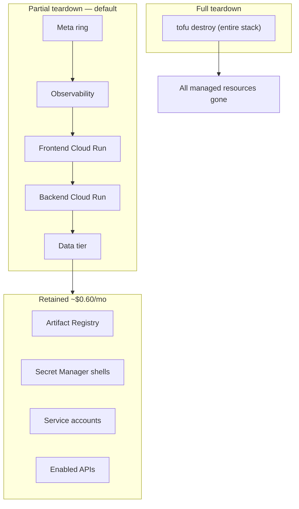

# Recipe 8 — Cleanup + Teardown Order

**Goal:** Document and automate safe teardown of the GCP Tier A stack. Operators can choose **partial destroy** (keep Artifact Registry + Secret Manager for fast re-deploy) or **full destroy** (remove all managed resources). Dev-only safety rails (`force_destroy`, `deletion_protection=false`, `deletion_policy=ABANDON`) are already wired in Recipes 1–2 and validated here.

**Status:** Complete | 8 contract tests passing | Tier A incremental: ~$0.00/mo (teardown is free; retained shells ~$0.60/mo if partial)

---

## Before We Start: A Story

Recipes 0–7 built a working workshop: Cloud Run services, Postgres checkpoints, GCS traces, observability, and optional meta ring. Eventually you need to **take it apart** — end-of-sprint cleanup, cost pause, or a fresh deploy iteration.

Recipe 8 is the **demolition plan**. Two mistakes dominate bad teardowns:

1. **Destroying in the wrong order** — Cloud Run still references Cloud SQL; GCS buckets still hold objects; Scheduler still fires jobs against deleted services.
2. **Destroying too much** — wiping Secret Manager versions and Artifact Registry means re-entering every API key and rebuilding every image on the next sprint.

Recipe 8 gives you a phased script and explicit retain-vs-delete guidance.



The **remote state bucket** (`${PROJECT}-tofu-state`) is never destroyed by OpenTofu — it was created manually in HUMAN_SETUP.md Step 2 and lives outside this stack.

---

## Prerequisites

- **Recipes 1–7 applied** (or whatever subset you deployed).
- **`GOOGLE_APPLICATION_CREDENTIALS`** set to the `tofu-deployer` SA key.
- **`tofu init`** already run in `infra/gcp/` with backend config.
- **Optional:** run `./scripts/smoke_gcp.sh` one last time to confirm the stack is healthy before teardown.

---

## The Three Teardown Lessons

### Lesson 1 — Partial by Default

**`MODE=partial` retains AR + secrets**

> "Why not `tofu destroy` everything every time?"

Re-deploying Recipes 2–7 after a full destroy means re-pushing Docker images, re-populating Secret Manager versions from `terraform.tfvars`, and re-running WorkOS redirect setup. Partial teardown removes the **expensive** resources (Cloud SQL ~$8.70/mo, Cloud Run compute) while keeping cheap foundations (~$0.60/mo) for the next iteration.

---

### Lesson 2 — Empty Buckets Before Destroy

**`force_destroy = true` on data-tier buckets**

> "Why does destroy fail on GCS buckets?"

GCS refuses deletion when a bucket contains objects unless `force_destroy = true`. Both `agent-facts` and `trust-traces` buckets declare this in `data.tf` (dev-only). Production Tier B should set `force_destroy = false` and require explicit `gsutil -m rm -r` before destroy.

---

### Lesson 3 — Abandon Secrets, Don't Delete Them

**`deletion_policy = "ABANDON"` on secret versions**

> "Why do my API keys vanish after partial destroy?"

Secret Manager **shells** (the secret resource) cost ~$0.06/secret/mo. **Versions** hold the actual key material. With `deletion_policy = "ABANDON"`, OpenTofu removes the version from state on destroy but leaves it in GCP — so the next `tofu apply` can reference existing versions or create new ones without re-entering every key.

---

## Agent Steps

### 8.1 — Review dev-only safety rails

These are already set in earlier recipes; Recipe 8 validates them:

| Setting | Location | Purpose |
|---------|----------|---------|
| `force_destroy = true` | `data.tf` — agent_facts, trust_traces | Empty buckets on destroy |
| `deletion_protection = false` | `data.tf` — Cloud SQL | Allow instance deletion |
| `disable_on_destroy = false` | `foundations.tf` — project APIs | Don't disable shared APIs |
| `deletion_policy = "ABANDON"` | `secret-manager.tf` — all versions | Retain secret material on destroy |

### 8.2 — Choose teardown mode

**Partial (default)** — removes compute, observability, and data; keeps foundations:

```bash
CONFIRM=1 ./scripts/teardown_gcp.sh
# or explicitly:
CONFIRM=1 MODE=partial ./scripts/teardown_gcp.sh
```

**Full** — destroys everything managed by `infra/gcp/`:

```bash
CONFIRM=1 MODE=full ./scripts/teardown_gcp.sh
```

**Dry run** — print commands without executing:

```bash
DRY_RUN=1 ./scripts/teardown_gcp.sh
```

### 8.3 — Partial destroy order (what the script runs)

| Phase | Resources | Recipe |
|-------|-----------|--------|
| 1 | Cloud Scheduler + Cloud Run Job + meta SAs/IAM | 6 (no-op if disabled) |
| 2 | Monitoring dashboard, alert policies, billing budget | 7 |
| 3 | Frontend Cloud Run + public invoker | 5 |
| 4 | Backend Cloud Run + public invoker | 4 |
| 5 | GCS buckets, Cloud SQL instance/database/user, data IAM | 2 |

### 8.4 — Manual post-teardown (operator)

After partial or full destroy:

```bash
# Verify Cloud Run services are gone
gcloud run services list --project=$PROJECT --region=us-central1

# Verify Cloud SQL is gone (partial/full both remove data tier)
gcloud sql instances list --project=$PROJECT

# Optional: remove WorkOS redirect URI for deleted frontend URL
# WorkOS Dashboard → Authentication → Redirects

# Optional: delete remote state bucket (ONLY when abandoning project entirely)
# gsutil -m rm -r gs://${PROJECT}-tofu-state

# Optional: revoke tofu-deployer key
# gcloud iam service-accounts keys list --iam-account=tofu-deployer@${PROJECT}.iam.gserviceaccount.com
```

---

## Human Review Gate

Before teardown:

- [ ] **Export anything worth keeping** — `gsutil -m cp -r gs://${PROJECT}-trust-traces/reports/ ./backup/` if meta eval reports matter.
- [ ] **Confirm project ID** — `echo $PROJECT` matches `gcp_project_id` in `terraform.tfvars`.
- [ ] **Understand retain cost** — partial mode keeps ~$0.60/mo (9 secrets + minimal AR storage).

After teardown:

- [ ] **Cloud Run services deleted** — `gcloud run services list` returns empty (or only unrelated services).
- [ ] **Cloud SQL gone** (if data tier destroyed) — `gcloud sql instances list` empty.
- [ ] **Billing trend** — costs should drop to ~$0.60/mo (partial) or ~$0 (full, excluding state bucket) within 24–48 hours.
- [ ] **State bucket intact** — `gsutil ls gs://${PROJECT}-tofu-state/` still lists state files (unless you intentionally deleted it).

---

## For a General Audience

If adapting for another GCP + OpenTofu stack:

1. **Default to partial teardown** — keep registry and secrets between iterations; destroy compute and databases.
2. **Set `force_destroy = true` only in dev** — production buckets should require explicit emptying.
3. **Never destroy the state bucket in the same apply as resources** — it lives outside the stack by design.
4. **Use `disable_on_destroy = false` on APIs** — disabling APIs breaks the Console and other projects sharing the billing account.
5. **Document two modes** — partial (fast re-deploy) vs full (abandon project).

---

## Verify

```bash
# Infra contract tests (no cloud credentials required)
pytest tests/infra/gcp/test_cleanup.py -q

# Full GCP infra suite
pytest tests/infra/gcp/ -q -m infra_gcp

# Conftest policy gate
cd infra/gcp && conftest test --policy policies/ --parser hcl2 --all-namespaces *.tf
```

---

## Rollback

Teardown is destructive — there is no rollback. To **re-deploy** after partial teardown:

```bash
cd infra/gcp
tofu plan -out=tfplan    # Recipes 2–7 resources will be recreated
tofu apply tfplan

# Re-push images and update backend_image / frontend_image in terraform.tfvars
# Re-run Recipes 3–5 deploy steps
./scripts/smoke_gcp.sh
```

After full teardown, start from Recipe 1 apply (foundations still in state if partial; after full, entire stack recreates).

---

## Cost Note

| Scenario | Monthly cost after teardown |
|----------|----------------------------|
| **Partial retain** | ~$0.60/mo (9 Secret Manager shells @ $0.06 + minimal AR storage) |
| **Full destroy** | ~$0/mo (state bucket ~$0.02/mo if retained) |
| **Pre-teardown (Recipes 1–7)** | ~$9.33/mo list-price at dev traffic |

| Retained resource | Why keep it | Cost |
|-------------------|-------------|------|
| Artifact Registry | Skip rebuild/push on next sprint | ~$0.10/GB/mo |
| Secret Manager shells | Skip re-entering API keys | ~$0.06/secret/mo |
| Service accounts | IAM bindings stable across iterations | $0 |
| Enabled APIs | Avoid disruptive API disable | $0 |

Cloud SQL (~$8.70/mo) is the main cost removed by partial teardown.

---

## Files Created/Modified

| File | Action |
|------|--------|
| `scripts/teardown_gcp.sh` | Created — phased partial + full destroy |
| `infra/gcp/policies/cleanup.rego` | Created — Conftest teardown safety policies |
| `infra/gcp/features/cleanup.feature` | Created — terraform-compliance BDD |
| `tests/infra/gcp/test_cleanup.py` | Created — 8 Recipe 8 contract tests |
| `docs/recipes/gcp/08_cleanup.md` | Created — this document |
| `docs/recipes/gcp/HUMAN_SETUP.md` | Already references Recipe 8 in maintenance table |
