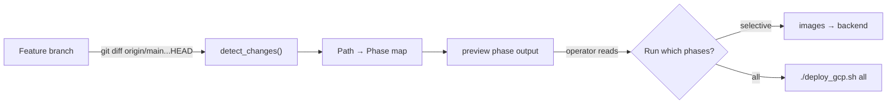

# Recipe 9 — Change Detection + Deploy Identity

**Goal:** Add branch-vs-main change detection (advisory/preview only) and a hybrid CalVer+SHA deploy naming scheme to the orchestrator, so operators know *what this branch touches* before they run anything — and every image push carries a human-readable, commit-traceable, runtime-immutable identity.

**Status:** Complete | Advisory only — `preview` never auto-skips phases | Tier A incremental: $0.00/mo (local logic only)

---

## Before We Start: A Story

By Recipe 8 you had a full deployment pipeline: ten phases, two human gates, policy checks before every apply, and digest-pinned images. The autopilot flew every leg in order, refused to skip the checklist, and stopped when a human needed to make a judgment call.

But there was still one moment where the pilot had to guess: *"What does this branch actually change?"*

You would open a terminal, squint at `git diff --stat`, mentally map file paths to deployment phases, and decide which legs to fly. Most of the time you got it right. Sometimes you rebuilt both images when only a README changed. Sometimes you skipped `foundations` when a shared variable file shifted underfoot.

Recipe 9 adds the co-pilot's **pre-flight briefing**. Before you commit to any phase, the `preview` command reads the merge-base diff, maps every changed file to the phases it affects, flags which images need rebuilding, and prints a clean advisory summary. You still choose what to fly — the diff never auto-skips a phase — but now you choose with information instead of intuition.

And while we were at it, we gave every deploy a proper name. Not `v1` (which `v1` — last Tuesday's or this morning's?), but a hybrid identity that answers three questions at once: *when* (CalVer), *what commit* (short SHA), and *exactly which bytes* (digest pin). Three layers for three audiences.



---

## Lesson 1 — The Blind Rebuild Problem

Before change detection, the `images` phase always rebuilt both containers. Backend code change? Build backend *and* frontend. Frontend typo fix? Same thing. A shared `variables.tf` tweak? Both again.

This is the **blind rebuild**: the orchestrator has no model of what changed, so it does the safe-but-slow thing and rebuilds everything. For a project where each image build takes 2–5 minutes, that is 4–10 minutes of wasted time on every deploy that only touches one side.

The fix is a **merge-base three-dot diff**:

```bash
git diff --name-only origin/main...HEAD
```

The three-dot syntax (`...`) computes the diff from the *merge base* of `origin/main` and `HEAD` — the point where your branch diverged. This gives you exactly the files your branch changed, regardless of how many commits `main` has received since.

The `detect_changes()` function in `deploy_gcp.sh`:
1. Resolves `BASE_REF` (default `origin/main`); if missing, fetches once; if still unavailable, **fails safe to all-phases-affected**.
2. Runs the three-dot diff to produce a file list.
3. Maps each file to affected phases and image rebuild flags using the path→phase table (Lesson 2).

The fail-safe default is deliberate: if the script cannot determine what changed (shallow clone, detached HEAD, missing remote), it assumes *everything* changed. A false positive (rebuilding unnecessarily) costs time. A false negative (skipping a needed phase) costs correctness.

---

## Lesson 2 — The Path-to-Phase Map

Every changed file maps to one or more deployment phases. The mapping is deterministic — no LLM, no heuristics, just pattern matching:

| Changed path | Affected phases | Image rebuild |
|---|---|---|
| `infra/gcp/foundations.tf`, `secret-manager.tf` | foundations, secrets + all downstream infra | — |
| `infra/gcp/data.tf` | data | — |
| `infra/gcp/cloud-run-backend.tf` | backend | — |
| `infra/gcp/cloud-run-frontend.tf` | frontend | — |
| `infra/gcp/observability.tf`, `meta.tf` | observability | — |
| `infra/gcp/{variables,outputs,versions,backend}.tf`, `terraform.tfvars` | all infra phases (shared) | — |
| `Dockerfile.backend` + backend app code (`agent/`, `services/`, `middleware/`, etc.) | images, backend | backend |
| `Dockerfile.frontend` + `frontend/**` | images, frontend | frontend |

### Forward-dependency expansion

If `foundations` is affected (e.g., a change to `foundations.tf`), the downstream infra phases — `data`, `backend`, `frontend`, `observability` — are also marked affected. This is because the single-root-module topology means a change in foundations can shift outputs that other resources reference.

### The single-root-module caveat

All `.tf` files in `infra/gcp/` share one OpenTofu state. The path→phase map is an orchestration-level *labeling aid* — it tells you which phases are *likely* relevant. But `tofu plan` remains the source of truth for what actually changes at the infrastructure layer. The preview output is advisory; it does not bypass or replace the policy gate.

---

## Lesson 3 — The Deploy ID

Before this recipe, images were tagged `:v1` or `:v2`. This created three problems:

1. **"Which v1?"** — Multiple deploys reuse the same tag. The tag is mutable; the image behind it changes.
2. **"What commit is running?"** — A tag like `v1` tells you nothing about the source.
3. **"Is this the image I actually pushed?"** — Without a digest, you are trusting the registry's tag pointer.

The hybrid deploy identity solves all three with a three-layer naming convention:

| Layer | Value | Audience | Example |
|---|---|---|---|
| `DEPLOY_VERSION` | CalVer `YYYY.0M.0` | Humans, changelogs | `2026.05.0` |
| `SHORT_SHA` | `git rev-parse --short HEAD` | Engineers, git bisect | `abc1234` |
| `@sha256:...` digest | Registry content hash | Runtime, supply chain | `sha256:e3b0c44...` |

These combine into the `DEPLOY_ID`:

```
tierA-prod-2026.05.0-abc1234
```

### Multi-tag build

The `images` phase now pushes two tags per image:

1. `:${DEPLOY_VERSION}` — the CalVer tag for human readability
2. `:sha-${SHORT_SHA}` — the commit-traceable tag for debugging

After push, the phase resolves the `@sha256` digest and pins it into `terraform.tfvars`. Cloud Run always runs from the immutable digest, never from a mutable tag.

**Three layers, three audiences:**
- The CalVer tag tells the product team *when* this version shipped.
- The SHA tag tells an engineer *which commit* to check out for debugging.
- The digest pin tells the runtime *exactly which bytes* to execute.

---

## Usage Walkthrough

### 1. Preview what your branch touches

```bash
./scripts/deploy_gcp.sh preview
```

Output (example):

```
INFO: === Deploy Preview ===
  Base ref:        origin/main
  HEAD:            abc1234
  DEPLOY_VERSION:  2026.05.0
  SHORT_SHA:       abc1234
  DEPLOY_ID:       tierA-prod-2026.05.0-abc1234

INFO: Changed files (3):
    agent/components/router.py
    Dockerfile.backend
    infra/gcp/cloud-run-backend.tf

INFO: Affected phases: images backend
  Rebuild backend image:  1
  Rebuild frontend image: no

INFO: This is advisory only. No mutations performed.
```

### 2. Build and push with the new naming

```bash
VERSION=2026.05.0 WRITE_TFVARS=1 ./scripts/deploy_gcp.sh images
```

This builds both images with `:2026.05.0` and `:sha-abc1234` tags, pushes both, resolves the `@sha256` digests, and writes them into `terraform.tfvars`.

### 3. Deploy only the affected phase

```bash
./scripts/deploy_gcp.sh backend
```

The preview told you only `backend` was affected — so you fly that one leg instead of the full route.

### Custom base ref

Compare against a release branch instead of main:

```bash
BASE_REF=origin/release/2026.05 ./scripts/deploy_gcp.sh preview
```

---

## For a General Audience

Adapting change detection + deploy naming to another stack:

1. **Keep the three-dot diff** (`origin/main...HEAD`). It is the only reliable way to compute "what did this branch change" without false positives from concurrent main-branch activity.

2. **Build your own path→phase map.** The mapping is project-specific — swap the file patterns, keep the structure. If your infra is split into per-module workspaces, the map becomes simpler (each module is its own phase).

3. **Keep the three-layer naming convention.** CalVer (or SemVer) for humans, short SHA for engineers, digest (or checksum) for runtime. The specific format matters less than having all three layers.

4. **Keep preview advisory-only.** The temptation to auto-skip phases is strong, but the cost of a false negative (skipping a needed phase) is always higher than the cost of a false positive (running an unnecessary one). Let the human decide.

---

## Cross-References

- [SKILL_DEPLOY_GUIDE.md](SKILL_DEPLOY_GUIDE.md) — full flight manual including the new Change Detection and Deploy Naming section
- [03_containerize.md](03_containerize.md) — the original image build recipe that this recipe extends
- [.cursor/skills/deploy-gcp/SKILL.md](../../../.cursor/skills/deploy-gcp/SKILL.md) — skill definition with `preview` phase and new env vars
