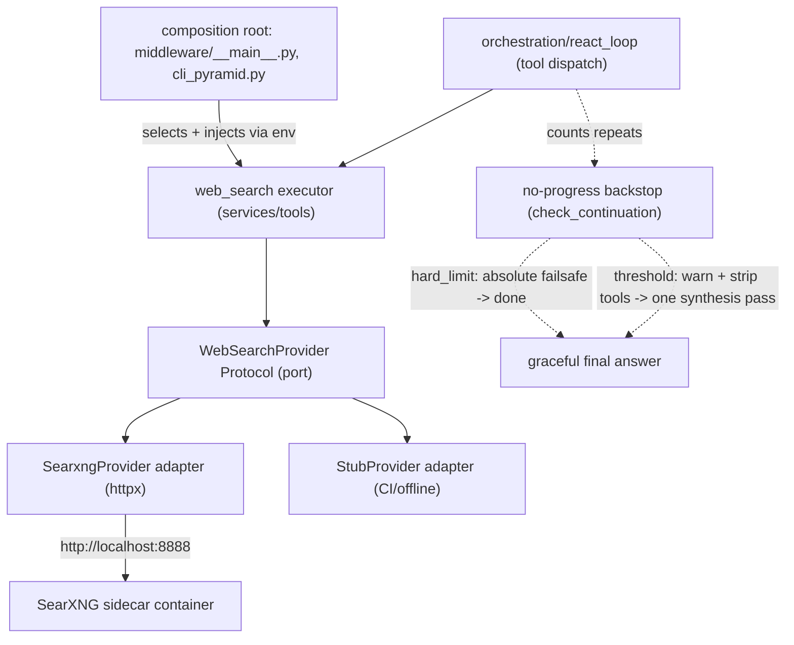

# Recipe 10 — Real Web Search (SearXNG sidecar) + No-Progress Detection

**Goal:** Replace the canned `web_search` stub with a provider-agnostic search port (hexagonal), plug in a SearXNG adapter deployed as a scale-to-zero Cloud Run sidecar, and add no-progress detection so the agent stops re-querying a dead or non-advancing tool. After this recipe, "What's the weather in Austin?" returns *real* results — and a broken backend no longer sends the agent into an infinite retry loop.

**Status:** Complete | 60 feature tests + 88 architecture tests passing | Tier A incremental: ~$0/mo (sidecar shares scale-to-zero)

---

## Before We Start: A Story

It is your first week. You pull the agent locally, type the obvious smoke test —

> "What's the weather in Austin?"

— and the agent confidently answers:

> *"This is a stub response. Real web search is available via SearXNG."*

It didn't search anything. The old `web_search` tool returned a hardcoded sentence no matter what you asked. Worse: when you point it at a flaky backend later, you watch the agent call `web_search` with the same query, get the same garbage, and call it *again*. And again. Twelve times. Burning tokens, going nowhere, until the step budget finally kills it.

Two problems, one recipe:

1. **The tool lies.** It pretends to search but returns a constant. We need a *real* search backend — but without nailing the agent to one vendor's API.
2. **The loop is blind.** When a tool stops making progress, nothing notices. We need the loop to recognize "I keep doing the same thing and getting the same answer" and stop gracefully.

Think of the agent as a new research assistant. Recipe 10 gives them a real library card (SearXNG) instead of a single laminated index card (the stub) — *and* teaches them the most important research skill of all: knowing when to stop looking and write up what they have.



Why does this recipe live in the `gcp/` series? Because the *real* backend is a Cloud Run sidecar (Part C). The code (Parts A & B) is cloud-agnostic and runs identically on your laptop, but the production wiring is GCP-shaped — so the deployment lessons belong next to Recipes 1–9.

---

## Prerequisites

- **Recipes 0–4 complete.** Foundations applied, Artifact Registry exists, the combined backend deploys on Cloud Run.
- **`httpx >= 0.27`** already in `pyproject.toml` — no new dependency, so no `AGENTS.md` "ask first" gate.
- **Docker** for the local SearXNG (`docker compose`) and for mirroring the image to Artifact Registry.
- A passing baseline: `pytest -p no:logfire tests/services/test_tools.py -q`.

---

## The Architecture in One Breath

The tool lives in the horizontal `services/` layer, which owns I/O (`httpx`) and must stay framework-agnostic (no `langgraph`/`langchain`). The shape is textbook hexagonal:

- **Port** — a `typing.Protocol` (`WebSearchProvider`), exactly like `IdentityProvider`.
- **Adapters** — `SearxngProvider` (real) and `StubProvider` (offline/CI), like the entries under `utils/cloud_providers/`.
- **Composition root** — `middleware/__main__.py` and `cli_pyramid.py` pick the adapter from env and inject it.

This is the same dependency rule the whole codebase obeys: orchestration depends on services, services depend on the port, and nothing depends *upward*.

---

## The Five Lessons

---

### Lesson 1 — The Hardcoded Answer Problem

**`services/tools/search/port.py`**

> "The tool already 'works' — it returns a string. Why rip it apart into a port and adapters instead of just calling an HTTP API inside `execute_web_search`?"

Because the moment you hardcode `httpx.get("https://some-search-api...")` inside the tool, you have welded the agent to one vendor. CI now needs network access (violating `AGENTS.md`: *never run live calls in CI*). Swapping SearXNG for Brave or Tavily later means surgery on the tool itself. And tests must mock a concrete dependency buried inside business logic.

The fix is to invert the dependency. The tool depends on a **contract**, not a backend:

```python
# services/tools/search/port.py

@runtime_checkable
class WebSearchProvider(Protocol):
    """Port: any web search backend must implement this contract."""

    def search(self, query: str, *, max_results: int = 5) -> list[SearchResult]:
        """Execute a web search and return results.

        Raises:
            WebSearchError: on HTTP/network/timeout failures.
            WebSearchEmpty: when the backend returns zero results.
        """
        ...
```

Three things make this a *good* port:

- **`Protocol`, not a base class.** Adapters don't inherit anything; they just match the shape. `runtime_checkable` lets a test assert `isinstance(StubProvider(), WebSearchProvider)` without coupling.
- **A typed result model.** `SearchResult(title, url, snippet)` is a Pydantic model — the agent never sees a raw vendor JSON blob (pattern V6: Pydantic for all non-trivial outputs).
- **Typed failures.** `WebSearchError` (the backend broke) and `WebSearchEmpty` (the backend worked but found nothing) are *different* exceptions. Lesson 3 shows why that distinction is the whole game.

> **Why not put `SearchResult` in `trust/`?** Because it fails the trust-kernel test: it is not consumed by 2+ layers and it is not stable signing material. It is an operational data type owned by one service. It stays in `services/`.

**Checkpoint question:** A teammate wants to add a Brave Search backend. Which files do they touch, and which must they *not* touch?

*Answer: They add one file — `services/tools/search/brave.py` with a class whose `search(...)` matches the Protocol — and one branch in the composition root. They must NOT touch `port.py`, `web_search.py`, or the orchestration loop. That blast-radius-of-one is the entire point of the port.*

---

### Lesson 2 — The Two-Backends-One-Tool Problem

**`services/tools/search/searxng.py`, `stub.py`, and the composition root**

> "If the tool only knows the Protocol, how does it ever get a *real* SearXNG at runtime — and how does CI stay offline?"

Two adapters implement the same port. The real one talks HTTP:

```python
# services/tools/search/searxng.py

class SearxngProvider:
    def search(self, query: str, *, max_results: int = 5) -> list[SearchResult]:
        params = {"q": query, "format": "json", "categories": self._categories}
        try:
            response = httpx.get(f"{self._base_url}/search", params=params, timeout=self._timeout)
            response.raise_for_status()
        except httpx.TimeoutException as exc:
            raise WebSearchError(f"SearXNG timeout after {self._timeout}s ...", provider="searxng") from exc
        except httpx.HTTPStatusError as exc:
            raise WebSearchError(..., provider="searxng", status_code=exc.response.status_code) from exc
        ...
        if not raw_results:
            raise WebSearchEmpty(query, provider="searxng")
```

The stub returns a deterministic canned result and **never raises** — perfect for CI:

```python
# services/tools/search/stub.py

class StubProvider:
    def search(self, query: str, *, max_results: int = 5) -> list[SearchResult]:
        return [SearchResult(
            title=f"Search result for: {query}",
            url="https://example.com",
            snippet="This is a stub response. Real web search is available via SearXNG.",
        )]
```

The **composition root** decides which one the agent actually gets, reading the choice from the environment and defaulting to stub:

```python
# middleware/__main__.py
def _resolve_search_provider() -> WebSearchProvider:
    """Select web search provider from env (WEB_SEARCH_PROVIDER / SEARXNG_URL)."""
    provider_name = os.environ.get("WEB_SEARCH_PROVIDER", "stub").lower()
    if provider_name == "searxng":
        from services.tools.search.searxng import SearxngProvider
        base_url = os.environ.get("SEARXNG_URL", "http://localhost:8888")
        return SearxngProvider(base_url=base_url)
    return StubProvider()
```

`default = "stub"` is the load-bearing word. Forget to set `WEB_SEARCH_PROVIDER` in CI? You get the stub — no network, no flake, no `AGENTS.md` violation. Production sets `WEB_SEARCH_PROVIDER=searxng` explicitly (Lesson 5 wires it in Terraform).

> **Why select via env instead of a config file or a CLI flag?** Because the composition root must work identically for the FastAPI middleware (`middleware/__main__.py`) and the CLI (`cli_pyramid.py`). An env var is the lowest common denominator both already read, and it's what Cloud Run injects natively (Lesson 5). One mechanism, two entry points.

**Checkpoint question:** You run the test suite on a machine with no internet. Which provider runs, and why doesn't a single test hit the network?

*Answer: `StubProvider`, because `WEB_SEARCH_PROVIDER` is unset so the composition root defaults to `stub`. The SearXNG contract tests don't need real network either — they `patch("httpx.get")` with canned `httpx.Response` objects (record/replay style, Pattern 5). The only thing that ever touches the wire is a human running the manual end-to-end check in the Verify section.*

---

### Lesson 3 — The Dead-Backend-Looks-Like-Success Problem

**`services/tools/web_search.py` — `build_web_search_executor`**

> "The provider raises `WebSearchError` when SearXNG is down. The old tool just returned a string. How does the *loop* learn the difference between 'here are results' and 'the backend is dead'?"

This is the subtle one. The ReAct loop routes on a single signal: `ToolExecutionResult.ok`. If a failed search returns `ok=True` with an error *string* inside, the loop thinks the step succeeded, feeds the "result" to the model, and the model — seeing junk — tries again. Forever.

So the executor factory maps every provider outcome to the right `ok` flag:

```python
# services/tools/web_search.py

def build_web_search_executor(provider: WebSearchProvider) -> Callable[[dict], ToolExecutionResult]:
    def _execute(args: dict[str, Any]) -> ToolExecutionResult:
        try:
            validated = WebSearchInput(**args)
        except Exception as e:
            return ToolExecutionResult(output=f"Error: Invalid input: {e}", ok=False, error=f"validation_error: {e}")

        try:
            results = provider.search(validated.query, max_results=5)
        except WebSearchEmpty as exc:
            output = WebSearchOutput(query=validated.query, results=[], provider=exc.provider)
            return ToolExecutionResult(output=output.model_dump_json(), ok=False, error=f"empty_results: {exc}")
        except WebSearchError as exc:
            return ToolExecutionResult(output=f"Error: {exc}", ok=False, error=f"provider_error: {exc}")
        except Exception as exc:
            logger.exception("Unexpected error in web_search provider")
            return ToolExecutionResult(output=f"Error: unexpected failure: {exc}", ok=False, error=f"unexpected: {exc}")

        output = WebSearchOutput(query=validated.query, results=results, provider=...)
        return ToolExecutionResult(output=output.model_dump_json(), ok=True)
    return _execute
```

The mapping is the contract:

| Provider outcome | `ok` | `error` tag | Loop interpretation |
|------------------|------|-------------|---------------------|
| Results returned | `True` | — | Success; feed to model |
| Empty results (`WebSearchEmpty`) | `False` | `empty_results:` | Don't retry — there's genuinely nothing |
| Backend failure (`WebSearchError`) | `False` | `provider_error:` | Treat as terminal, not retryable |
| Bad input | `False` | `validation_error:` | Caller error |

Notice the function is a **factory** — `build_web_search_executor(provider)` — mirroring `build_task_tool_executor`. It closes over the injected provider and returns the `(args) -> ToolExecutionResult` callable the registry expects. The provider is injected at composition time; the executor never reaches out to pick one.

> **Why mark empty results as `ok=False`?** Counter-intuitive, but a search that finds nothing is not a *successful* step toward answering the question — it's a dead end. Returning `ok=False` lets the loop's terminal handling and the Lesson 4 backstop treat "no results" as a reason to stop and synthesize, not a green light to keep digging.

> **`execute_web_search` still exists.** The bottom of the file keeps a thin backward-compatible `execute_web_search(args) -> str` that internally builds a stub executor. It exists only so un-migrated callers and `tests/services/test_tools.py` keep importing the old symbol. New code uses the factory.

**Checkpoint question:** SearXNG returns HTTP 500. Trace the value of `ok` from `httpx` all the way to the loop's routing decision.

*Answer: `response.raise_for_status()` throws `httpx.HTTPStatusError` → `SearxngProvider.search` catches it and raises `WebSearchError(provider="searxng", status_code=500)` → `build_web_search_executor`'s `except WebSearchError` returns `ToolExecutionResult(ok=False, error="provider_error: ...")` → the loop sees `ok=False` and does not treat the step as a successful answer. No infinite retry on a 500.*

---

### Lesson 4 — The Infinite-Loop Problem (and the Graceful Exit)

**`orchestration/react_loop.py` (`_count_trailing_repeats`, `call_llm_node`, `_should_continue`) + `components/evaluator.py` (`check_continuation`) + `prompts/no_progress_wrapup.j2` + `services/base_config.py` + `orchestration/state.py`**

> "Even with `ok=False`, a stubborn model might just rephrase the query and call `web_search` again. What actually *stops* the loop — and does the user get an answer or just raw tool JSON?"

This is where most agent loops get it half-right. The naive fix is a single hard backstop: count repeats, and at the threshold return `"done"` straight to `END`. But the last thing in `state` is usually a `ToolMessage` — so the user is left staring at raw tool output with no synthesized answer. The 2026 field consensus (deepset/Haystack [#10001](https://github.com/deepset-ai/haystack/issues/10001), `smartMaxTurns`/`wrapUp`, bytedance/deer-flow [#1055](https://github.com/bytedance/deer-flow/issues/1055)) has a name for that failure: the **"abort on tool output" anti-pattern**.

The robust shape is a **three-layer termination stack**, and this recipe ships all three:

1. **Layer 1 — hard caps.** `max_steps` / `max_cost_usd` (always present).
2. **Layer 2 — semantic repeat detection.** `_count_trailing_repeats` notices the agent is stuck.
3. **Layer 3 — graceful wrap-up.** A *graduated* warn → hard-stop: at the repeat threshold, inject a one-time tool-free "synthesize now" directive (one final pass to turn what it has into an answer); keep a higher absolute `no_progress_hard_limit` as the failsafe if the model ignores the directive.

Four pieces, kept on the right sides of the layer boundary.

**The counter (orchestration, impure — reads loop state):**

```python
# orchestration/react_loop.py

def _count_trailing_repeats(tool_results: list[dict]) -> int:
    """Count consecutive trailing tool_results with identical (tool_name, tool_input) or tool_output."""
    if len(tool_results) < 2:
        return 0
    last = tool_results[-1]
    last_key = (last.get("tool_name"), str(sorted(last.get("tool_input", {}).items())))
    last_output = last.get("tool_output", "")
    count = 1
    for entry in reversed(tool_results[:-1]):
        entry_key = (entry.get("tool_name"), str(sorted(entry.get("tool_input", {}).items())))
        entry_output = entry.get("tool_output", "")
        if entry_key == last_key or (last_output and entry_output == last_output):
            count += 1
        else:
            break
    return count
```

It catches *two* flavors of stuck: the **same call** (identical tool + normalized input — so `{"query": "x"}` matches regardless of key order) and the **same result** (different queries that all return the identical output, e.g. three rephrasings that all time out with `error: timeout`). The `last_output and ...` guard means empty outputs never match each other — a blank result isn't "progress" you can detect by equality.

**The graduated decision (component, pure — unit-testable):**

```python
# components/evaluator.py — inside check_continuation(...)

if repeated_tool_calls >= agent_config.no_progress_hard_limit:
    return "done"  # absolute failsafe — terminate regardless
if repeated_tool_calls >= agent_config.no_progress_repeat_threshold and no_progress_directive_sent:
    return "done"  # model ignored the wrap-up directive
# else fall through -> "continue" gives exactly one toolless synthesis pass
```

`check_continuation` gains two new keyword args, `repeated_tool_calls: int = 0` and `no_progress_directive_sent: bool = False`, and two early-exits *above* the backoff logic. The ordering encodes the policy:

| Repeats | Directive already sent? | Decision | Why |
|---------|------------------------|----------|-----|
| `>= hard_limit` (5) | either | `"done"` | Absolute failsafe — never loop forever |
| `>= threshold` (3) | **yes** | `"done"` | Model ignored the wrap-up; stop |
| `>= threshold` (3) | **no** | `"continue"` | Allow exactly one synthesis pass |
| `< threshold` | — | normal logic | Not stuck yet |

Both numbers live in config (`AgentConfig.no_progress_repeat_threshold: int = 3`, `no_progress_hard_limit: int = 5`) so the meta-optimizer can tune them while humans keep the policy.

**The wrap-up directive (orchestration, in `call_llm_node`):** when the loop falls through to one more pass, `call_llm_node` recomputes the repeat count and, if at threshold and the directive hasn't been sent yet, it (a) appends the `no_progress_wrapup` prompt as a `HumanMessage`, (b) invokes the model with **`tool_schemas=None`** — stripping tools so the model *must* answer in prose, (c) records a `STEP_PLANNED` `TraceEvent` with `{"no_progress": True, "repeats": n}` for observability, and (d) returns `no_progress_directive_sent=True` so the next `_should_continue` knows the model already had its chance.

```python
# orchestration/react_loop.py — call_llm_node
repeats = _count_trailing_repeats(state.get("tool_results") or [])
inject_wrapup = (
    repeats >= agent_config.no_progress_repeat_threshold
    and not state.get("no_progress_directive_sent", False)
)
if inject_wrapup:
    lc_messages.append(HumanMessage(content=prompt_service.render_prompt(
        "no_progress_wrapup", task_input=state.get("task_input", ""))))
    effective_tool_schemas = None  # strip tools -> force a text answer
    black_box.record(TraceEvent(..., event_type=EventType.STEP_PLANNED,
                                details={"no_progress": True, "repeats": repeats}))
```

The directive itself lives in `prompts/no_progress_wrapup.j2` (H1 / AP-3: prompts are templates rendered via `PromptService`, never hardcoded f-strings) — it tells the model it has repeated the same calls, to call no more tools, and to give its best final answer or state plainly what it could not determine.

**The flag (state):** `AgentState` gains `no_progress_directive_sent: bool`, a plain last-write-wins field read via `state.get(..., False)`. It is the one bit that makes "warn once, then hard-stop" possible without a counter.

`_should_continue` wires the pure decision together — count from state, pass both signals to the pure function:

```python
# orchestration/react_loop.py — _should_continue
repeated_count = _count_trailing_repeats(state.get("tool_results") or [])
result = check_continuation(
    ...,
    repeated_tool_calls=repeated_count,
    no_progress_directive_sent=state.get("no_progress_directive_sent", False),
)
```

Why split it across layers? The *counting* and the *directive injection* need the LangGraph `state` dict and the prompt/black-box services, so they live in orchestration. The *policy* ("warn at 3, hard-stop at 5") must be pure and testable in isolation, so it lives in the evaluator component. AGENTS.md invariant #6: orchestration nodes stay thin, logic lives in components.

**Checkpoint question:** The agent calls `web_search("austin weather")`, then `web_search("weather austin")`, then `web_search("austin tx weather")` — all three time out and return `error: timeout`. With `no_progress_repeat_threshold = 3`, does the loop stop, and does the user get an answer?

*Answer: The loop does not stop *abruptly* on the third repeat — it gets exactly one graceful exit. The three inputs differ, so the `(tool_name, tool_input)` key never matches, but all three produce the identical `tool_output` `"error: timeout"`, so the `last_output and entry_output == last_output` clause increments the count to 3. At that point `no_progress_directive_sent` is still `False`, so `check_continuation` returns `"continue"` for one more pass; `call_llm_node` then injects the wrap-up directive, strips the tools, and the model produces a prose answer ("I couldn't retrieve the weather — the search backend timed out"). If the model defied the toolless prompt and somehow kept emitting tool calls, the `no_progress_hard_limit` (5) failsafe terminates regardless. Output-equality is what catches "different query, same dead end"; the graduated wrap-up is what turns the stop into an answer instead of raw JSON.*

---

### Lesson 5 — The Sidecar Problem

**`infra/gcp/cloud-run-backend.tf`, `infra/searxng/settings.yml`, `scripts/deploy_gcp.sh`, `docker-compose.searxng.yml`**

> "`SEARXNG_URL` defaults to `http://localhost:8888`. There's no SearXNG on my Cloud Run service. Where does `localhost:8888` come from in production?"

From a **second container in the same Cloud Run service**. Cloud Run v2 supports multi-container revisions: containers in one revision share a network namespace, so the backend reaches the sidecar at plain `localhost`. SearXNG holds no ingress port (only the backend listens on 8080); it exists purely to serve the backend's internal `httpx` calls.

```hcl
# infra/gcp/cloud-run-backend.tf — backend container env
env {
  name  = "WEB_SEARCH_PROVIDER"
  value = "searxng"
}
env {
  name  = "SEARXNG_URL"
  value = "http://localhost:8888"
}

# ...sibling SearXNG container in the same template
containers {
  image = "${var.gcp_region}-docker.pkg.dev/.../searxng:latest"
  name  = "searxng"
  resources {
    limits   = { cpu = "0.5", memory = "512Mi" }
    cpu_idle = true
  }
  startup_probe {
    http_get { path = "/healthz"; port = 8888 }
    initial_delay_seconds = 3
    timeout_seconds       = 3
    period_seconds        = 5
    failure_threshold     = 10
  }
}
```

Four cost/correctness decisions:

- **`cpu_idle = true` + the service's existing `min_instance_count = 0`** → the sidecar inherits scale-to-zero. ~$0 idle. It only burns CPU while a request is in flight.
- **No `ports {}` on the sidecar.** Only the backend holds ingress on 8080. SearXNG is internal-only; exposing it would be an open search proxy on the internet.
- **`0.5 vCPU / 512Mi`** fits inside the backend's 1 vCPU / 2Gi envelope without bumping the service tier.
- **Mirror the image, don't pull from Docker Hub at deploy.** `scripts/deploy_gcp.sh` pins it into Artifact Registry so cold starts don't depend on Docker Hub rate limits:

```bash
# scripts/deploy_gcp.sh
local searxng_upstream="docker.io/searxng/searxng:latest"
run_cmd docker pull --platform linux/amd64 "${searxng_upstream}"
run_cmd docker tag "${searxng_upstream}" "${ar_url}/searxng:latest"
run_cmd docker push "${ar_url}/searxng:latest"
```

SearXNG itself is configured for a private instance — JSON output on, bot limiter off (no Redis needed), in `infra/searxng/settings.yml`:

```yaml
search:
  formats:
    - html
    - json          # the backend calls ?format=json
server:
  limiter: false    # private internal instance, no Redis/Valkey, no extra cost
  public_instance: false
```

For your laptop, `docker-compose.searxng.yml` runs the same image on port 8888 with the same `settings.yml` mounted, so `WEB_SEARCH_PROVIDER=searxng SEARXNG_URL=http://localhost:8888` reproduces production locally. Default stays stub.

> **Why a sidecar instead of a separate Cloud Run service for SearXNG?** A separate service would need its own ingress, its own IAM invoker binding, and a network hop with auth. The sidecar shares the backend's lifecycle and `localhost` network for free. The trade-off: every backend cold start now also boots SearXNG (Risk note below). At Tier A scale-to-zero that's acceptable, and Lesson 4's backstop caps the damage if the engines rate-limit.

**Checkpoint question:** A reviewer notices the SearXNG container has no `ports {}` block and asks "isn't that a misconfiguration — how does anything reach it?" What do you tell them?

*Answer: It's deliberate. Sibling containers in a Cloud Run v2 revision share a network namespace, so the backend reaches SearXNG over `localhost:8888` without it holding ingress. Only the backend container declares the ingress `ports` (8080). Giving SearXNG a public port would turn it into an open, abusable search proxy. The `startup_probe` on 8888 still works because probes run inside the revision's network.*

---

## Agent Steps

These steps go code-first (works offline), then light up the real backend locally, then deploy the sidecar.

### 10.1 — Prove the code works offline (default stub)

```bash
cd /path/to/agent
python -m pytest -p no:logfire \
  tests/services/test_web_search.py \
  tests/orchestration/test_no_progress.py \
  tests/components/test_evaluator.py -q
# Expected: 60 passed
```

> **Why `-p no:logfire`?** A pre-existing env mismatch (`logfire` vs `opentelemetry`) crashes pytest *collection* in this environment. Disabling *just* the broken `logfire` plugin sidesteps it while leaving plugin autoload on — which matters because the graduated-wrap-up integration tests in `test_no_progress.py` are `async` and need `pytest-asyncio` (the blunt `PYTEST_DISABLE_PLUGIN_AUTOLOAD=1` would silently skip them). The logfire crash is unrelated to this recipe — flag it for a separate dependency-pin fix.

### 10.2 — Run a real search locally

```bash
docker compose -f docker-compose.searxng.yml up -d
curl -s "http://localhost:8888/search?q=austin+weather&format=json" | head -c 300

WEB_SEARCH_PROVIDER=searxng SEARXNG_URL=http://localhost:8888 \
  python -m agent.cli "What's the weather in Austin?"
# Expected: real SearXNG results in the answer, not the stub sentence
```

### 10.3 — Mirror the SearXNG image to Artifact Registry

```bash
AR_URL=$(tofu -chdir=infra/gcp output -raw artifact_registry_url)
docker pull --platform linux/amd64 docker.io/searxng/searxng:latest
docker tag docker.io/searxng/searxng:latest "${AR_URL}/searxng:latest"
docker push "${AR_URL}/searxng:latest"
# (scripts/deploy_gcp.sh automates this in the images phase)
```

### 10.4 — Apply the sidecar

```bash
cd infra/gcp
tofu plan -out=tfplan -var-file=terraform.tfvars
tofu apply tfplan
# New revision: backend container + searxng sidecar, WEB_SEARCH_PROVIDER=searxng
```

---

## Human Review Gate

Before calling Recipe 10 done, the operator verifies:

- [ ] **Default is stub** — with `WEB_SEARCH_PROVIDER` unset, `execute_web_search` returns the canned response (CI stays offline).
- [ ] **Real results locally** — the Austin-weather CLI run against local SearXNG returns live results, not the stub sentence.
- [ ] **Dead backend wraps up gracefully** — point `SEARXNG_URL` at a closed port; confirm the run ends within ~`no_progress_repeat_threshold` (3) repeats with a *synthesized prose answer* (not raw tool JSON, not a step-budget timeout), and that a `STEP_PLANNED` trace event with `no_progress=True` was recorded. The `no_progress_hard_limit` (5) is the failsafe if the model ignores the directive.
- [ ] **Sidecar has no ingress port** — `gcloud run services describe agent-backend-combined --format=json` shows the `searxng` container with no `ports`, only the backend on 8080.
- [ ] **Image is mirrored** — `gcloud artifacts docker images list ${AR_URL}` shows `searxng:latest` (not pulled from Docker Hub at cold start).
- [ ] **Layer boundaries hold** — `pytest tests/architecture/ -q` passes (no `langgraph`/`langchain` in `services/tools/search/`, no upward imports).

---

## For a General Audience

If you are adapting this for another LangGraph/agent stack:

1. **Keep the port a `Protocol`, not a base class.** Adapters match a shape; they shouldn't inherit plumbing. `runtime_checkable` makes conformance assertable in tests.
2. **Distinguish "broke" from "found nothing."** Two exception types (`...Error` vs `...Empty`) map to two different loop behaviors. Collapsing them hides dead backends behind empty results.
3. **Map every tool outcome to `ok`.** Whatever your loop routes on, the executor must set it honestly — a failure dressed as success is how infinite retries are born.
4. **Make the backstop *graceful*, not just terminal.** Count trailing identical calls/outputs, but don't abort straight to `END` on a tool message — that's the "abort on tool output" anti-pattern that strands the user with raw JSON. Use a graduated warn → hard-stop: at the threshold inject a one-time toolless "synthesize now" directive (one final pass), and keep a higher absolute cap as the failsafe. Put the *count* and the *directive injection* where the state lives, and the *policy* where it's pure and testable.
5. **Default to the offline adapter.** Production opts into the real backend explicitly via env; CI gets the stub for free and never touches the network.
6. **Prefer a sidecar to a second service for internal-only dependencies.** Shared `localhost` + shared scale-to-zero beats an extra ingress, IAM binding, and network hop — as long as you accept the shared cold start.

The reusable pattern is: **port first, two adapters second, honest `ok` mapping third, a graduated graceful-wrap-up backstop fourth, sidecar deployment last.**

---

## Verify

```bash
# 1. Feature + contract tests (offline, mocked httpx; async wrap-up tests need pytest-asyncio)
python -m pytest -p no:logfire \
  tests/services/test_web_search.py tests/orchestration/test_no_progress.py \
  tests/components/test_evaluator.py -q
# Expected: 60 passed

# 2. Architecture boundaries (the new package must obey layer rules)
python -m pytest -p no:logfire tests/architecture/ -q
# Expected: all passed (2 skipped is normal)

# 3. Manual end-to-end (requires local SearXNG from step 10.2)
WEB_SEARCH_PROVIDER=searxng SEARXNG_URL=http://localhost:8888 \
  python -m agent.cli "What's the weather in Austin?"

# 4. No-progress graceful wrap-up (point at a dead backend)
WEB_SEARCH_PROVIDER=searxng SEARXNG_URL=http://localhost:9 \
  python -m agent.cli "What's the weather in Austin?"
# Expected: a prose final answer ("couldn't retrieve the weather...") within ~3 repeats,
#           not raw tool JSON and not a step-budget timeout
```

---

## Rollback

The code is additive and defaults to stub, so rollback is mostly "stop selecting searxng":

```bash
# Infra: drop the sidecar + env back to stub by reverting cloud-run-backend.tf,
# or set WEB_SEARCH_PROVIDER back to "stub" and re-apply.
cd infra/gcp && tofu apply -var-file=terraform.tfvars

# Local: stop the container
docker compose -f docker-compose.searxng.yml down
```

`StubProvider`, the port, and the no-progress backstop are harmless to leave in place — they add no cost and no network. Only the sidecar and `WEB_SEARCH_PROVIDER=searxng` need reverting to fully disable real search.

---

## Cost Note (Tier A)

| Resource | Monthly cost (dev traffic) |
|----------|---------------------------|
| SearXNG sidecar compute (shares min=0 scale-to-zero) | ~$0.00 |
| Artifact Registry storage (~250MB SearXNG image) | ~$0.03 |
| No Redis/Valkey (limiter disabled) | $0.00 |
| **Recipe 10 incremental** | **~$0.03/mo** |

The sidecar only consumes CPU while a request is active; at scale-to-zero it costs effectively nothing idle. The no-progress backstop further caps waste by stopping runaway tool loops before they burn budget.

---

## Files Created/Modified

| File | Action |
|------|--------|
| `services/tools/search/__init__.py` | Created — package export of `SearchResult`, `WebSearchProvider` |
| `services/tools/search/port.py` | Created — `WebSearchProvider` Protocol, `SearchResult`, typed errors |
| `services/tools/search/searxng.py` | Created — `SearxngProvider` httpx adapter |
| `services/tools/search/stub.py` | Created — `StubProvider` offline/CI adapter |
| `services/tools/web_search.py` | Modified — `build_web_search_executor` factory + `ok` mapping; kept `execute_web_search` shim |
| `services/base_config.py` | Modified — `no_progress_repeat_threshold: int = 3` + `no_progress_hard_limit: int = 5` on `AgentConfig` |
| `orchestration/state.py` | Modified — `no_progress_directive_sent: bool` flag on `AgentState` |
| `prompts/no_progress_wrapup.j2` | Created — toolless "synthesize now" wrap-up directive (H1 / AP-3) |
| `components/evaluator.py` | Modified — `check_continuation` graduated warn → hard-stop (`repeated_tool_calls` + `no_progress_directive_sent`) |
| `orchestration/react_loop.py` | Modified — `_count_trailing_repeats` + wrap-up directive injection / tool-strip / `STEP_PLANNED` trace in `call_llm_node` + wiring in `_should_continue` |
| `middleware/__main__.py` | Modified — `_resolve_search_provider`, `web_search` registered with `cacheable=True` |
| `StructuredReasoning/cli_pyramid.py` | Modified — provider selection + `web_search` `cacheable=True` |
| `infra/gcp/cloud-run-backend.tf` | Modified — SearXNG sidecar container + env |
| `infra/searxng/settings.yml` | Created — JSON-on, limiter-off private config |
| `scripts/deploy_gcp.sh` | Modified — mirror SearXNG image to Artifact Registry |
| `docker-compose.searxng.yml` | Created — local SearXNG on port 8888 |
| `tests/services/test_web_search.py` | Created — L2 contract tests (mocked httpx) |
| `tests/orchestration/test_no_progress.py` | Created — `_count_trailing_repeats` unit tests + L4 graduated-wrap-up integration tests (synthesis pass + hard-limit failsafe) |
| `tests/components/test_evaluator.py` | Modified — graduated no-progress backstop tests (failure paths first, TAP-4) |
