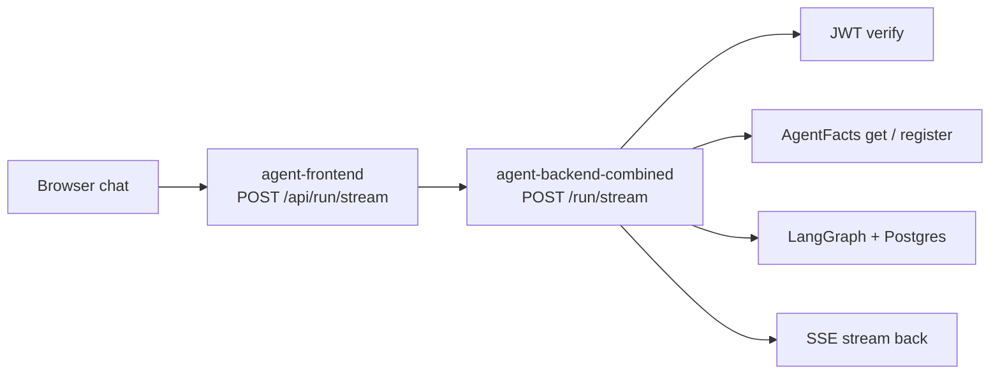

# GCP Log Pipeline Guide — End-to-End Flow Analysis

**Audience:** Operators debugging Tier A deploys on Cloud Run.
**Stack:** Browser → `agent-frontend` (BFF) → `agent-backend-combined` → Postgres / GCS / LLM.
**Prerequisites:** `gcloud` CLI, repo checkout, OpenTofu outputs or `terraform.tfvars` for project ID.

Use this guide after a deploy or when chat/auth fails in production. For metrics and alerts, see [07_observability.md](07_observability.md). For the full deploy walkthrough, see [LIVE_DEPLOYMENT.md](LIVE_DEPLOYMENT.md).

---

## Table of Contents

- [Request flow](LOG_PIPELINE_GUIDE.md#request-flow)
- [Step 0 — Prerequisites](LOG_PIPELINE_GUIDE.md#step-0-prerequisites)
- [Step 1 — Pin the live revision](LOG_PIPELINE_GUIDE.md#step-1-pin-the-live-revision)
- [Step 2 — Startup and health logs](LOG_PIPELINE_GUIDE.md#step-2-startup-and-health-logs)
- [Step 3 — Reproduce traffic, then pull timeline](LOG_PIPELINE_GUIDE.md#step-3-reproduce-traffic-then-pull-timeline)
- [Step 4 — Auth layer logs](LOG_PIPELINE_GUIDE.md#step-4-auth-layer-logs)
- [Step 5 — Auto-provision (first chat)](LOG_PIPELINE_GUIDE.md#step-5-auto-provision-first-chat)
- [Step 6 — Successful agent run](LOG_PIPELINE_GUIDE.md#step-6-successful-agent-run)
- [Step 7 — Error investigation](LOG_PIPELINE_GUIDE.md#step-7-error-investigation)
- [Step 8 — Frontend BFF logs](LOG_PIPELINE_GUIDE.md#step-8-frontend-bff-logs)
- [Step 9 — End-to-end debug checklist](LOG_PIPELINE_GUIDE.md#step-9-end-to-end-debug-checklist)
- [Step 10 — Output formats and live tail](LOG_PIPELINE_GUIDE.md#step-10-output-formats-and-live-tail)
- [Step 11 — Smoke script integration](LOG_PIPELINE_GUIDE.md#step-11-smoke-script-integration)
- [Step 12 — Langfuse trace verification](LOG_PIPELINE_GUIDE.md#step-12-langfuse-trace-verification)
- [Log marker reference](LOG_PIPELINE_GUIDE.md#log-marker-reference)
- [Common mistakes](LOG_PIPELINE_GUIDE.md#common-mistakes)
- [Quick reference aliases](LOG_PIPELINE_GUIDE.md#quick-reference-aliases)

---

<h2 id="request-flow">Request flow</h2>



| Layer | Cloud Run service | Key routes |
|-------|-------------------|------------|
| Frontend BFF | `agent-frontend` | `POST /api/run/stream` |
| Combined backend | `agent-backend-combined` | `GET /healthz`, `GET /health`, `POST /run/stream` |

---

<h2 id="step-0-prerequisites">Step 0 — Prerequisites</h2>

### Install and authenticate

```bash
gcloud version
gcloud auth login
gcloud auth application-default login   # optional; needed for tofu/API
```

### Set project (fixes empty-string errors)

```bash
# From terraform.tfvars (gitignored locally)
export PROJECT="$(grep gcp_project_id infra/gcp/terraform.tfvars | awk -F'"' '{print $2}')"

# Or set explicitly
export PROJECT=agent-prod-gcp-dev

gcloud config set project "$PROJECT"
gcloud config get-value project   # must NOT be empty
```

### Export env block

From repo root:

```bash
export REPO_ROOT="$(git rev-parse --show-toplevel)"
export INFRA="${REPO_ROOT}/infra/gcp"
export REGION="$(tofu -chdir="$INFRA" output -raw gcp_region 2>/dev/null || echo us-central1)"

export BACKEND_URL="$(tofu -chdir="$INFRA" output -raw backend_url)"
export FRONTEND_URL="$(tofu -chdir="$INFRA" output -raw frontend_url)"
```

Sanity check:

```bash
echo "PROJECT=$PROJECT BACKEND=$BACKEND_URL REGION=$REGION"
```

---

<h2 id="step-1-pin-the-live-revision">Step 1 — Pin the live revision</h2>

Every deploy creates a new revision. Filter by revision to avoid mixing old and new logs.

```bash
gcloud run services describe agent-backend-combined \
  --region="$REGION" --project="$PROJECT" \
  --format='table(status.url,status.latestReadyRevisionName,status.traffic)'
```

Pin the revision you care about:

```bash
export BACKEND_REVISION="$(gcloud run services describe agent-backend-combined \
  --region="$REGION" --project="$PROJECT" \
  --format='value(status.latestReadyRevisionName)')"

# Or pin explicitly after a known deploy:
# export BACKEND_REVISION=agent-backend-combined-00009-jps
```

**Reusable backend filter** (use in queries below):

```bash
export BACKEND_FILTER='resource.type=cloud_run_revision
  AND resource.labels.service_name=agent-backend-combined
  AND resource.labels.revision_name='"$BACKEND_REVISION"
```

---

<h2 id="step-2-startup-and-health-logs">Step 2 — Startup and health logs</h2>

### 2.1 Revision startup (Postgres + graph compile)

```bash
gcloud logging read \
  "$BACKEND_FILTER AND textPayload=~\"Production graph compiled|PostgresCheckpointer\"" \
  --project="$PROJECT" --limit=20 --freshness=7d \
  --format='table(timestamp,textPayload)'
```

**Expected:**

- `PostgresCheckpointer: connected and migrations applied`
- `Production graph compiled, runtime ready`

**Failure signals:**

| Log fragment | Likely cause |
|--------------|--------------|
| `connection refused`, `cloudsql`, `asyncpg` | `DATABASE_URL` or Cloud SQL IAM |
| `relation "checkpoints" does not exist` | Postgres saver migrations not applied (Recipe 4) |

### 2.2 Liveness probes (~every 30s)

```bash
gcloud logging read \
  "$BACKEND_FILTER AND textPayload=~\"GET /healthz\"" \
  --project="$PROJECT" --limit=10 --freshness=1h \
  --format='table(timestamp,textPayload)'
```

**Expected:** `"GET /healthz HTTP/1.1" 200 OK` from `169.254.169.126` (Cloud Run internal probe).

**Note:** External curl to `/healthz` may return 404 at Google's edge while internal probes succeed. Use `/health` for external checks; `scripts/smoke_gcp.sh` falls back automatically.

---

<h2 id="step-3-reproduce-traffic-then-pull-timeline">Step 3 — Reproduce traffic, then pull timeline</h2>

1. Open `$FRONTEND_URL` and sign in via WorkOS.
2. Send a chat message.
3. In DevTools → Network, confirm **`POST /api/run/stream`** on the frontend.

Pull recent backend activity:

```bash
gcloud logging read \
  "$BACKEND_FILTER" \
  --project="$PROJECT" --limit=100 --freshness=1h \
  --format='table(timestamp,severity,textPayload)'
```

gcloud returns newest entries first.

---

<h2 id="step-4-auth-layer-logs">Step 4 — Auth layer logs</h2>

### Successful auth

```bash
gcloud logging read \
  'resource.labels.service_name=agent-backend-combined
   AND textPayload=~"auth_ok subject="' \
  --project="$PROJECT" --limit=10 --freshness=1h \
  --format='value(textPayload)'
```

**Expected:**

```
auth_ok subject=user_01KQ0FRZDH6HQ4A3ZXC1YEWVSX org=None roles=[]
```

### Auth failures

```bash
gcloud logging read \
  'resource.labels.service_name=agent-backend-combined
   AND textPayload=~"auth_reject|jwt_verify_failed"' \
  --project="$PROJECT" --limit=10 --freshness=7d \
  --format='table(timestamp,resource.labels.revision_name,textPayload)'
```

| Log | Meaning | Action |
|-----|---------|--------|
| `auth_reject reason=invalid_token_use` | Wrong JWT type | Deploy AuthKit verifier fix (`token_use` optional) |
| `auth_reject reason=invalid_issuer` | Issuer mismatch | Align `WORKOS_ISSUER` / `client_id` env with token `iss` |
| `jwt_verify_failed … Not enough segments` | Malformed Bearer token | Bad curl/smoke token — not a user session issue |
| Other `jwt_verify_failed` | Expired or bad signature | Re-sign in |

See also [LIVE_DEPLOYMENT.md § Chat 401 Triage](LIVE_DEPLOYMENT.md#chat-401-triage).

---

<h2 id="step-5-auto-provision-first-chat">Step 5 — Auto-provision (first chat)</h2>

On first authenticated request for a new WorkOS user, the backend registers `AgentFacts` in GCS (`middleware/app_prod.py` KeyError path).

### Success markers

```bash
gcloud logging read \
  'resource.labels.service_name=agent-backend-combined
   AND textPayload=~"auto_provisioned_identity|Registered agent"' \
  --project="$PROJECT" --limit=10 --freshness=7d
```

**Expected pair (same timestamp):**

```
Registered agent user_01KQ0FRZDH6HQ4A3ZXC1YEWVSX by app_prod:auto_provision
auto_provisioned_identity subject=user_01KQ0FRZDH6HQ4A3ZXC1YEWVSX
```

After this, the same user should **not** auto-provision again — only `auth_ok` + `stream_ended`.

### Verify GCS object (optional)

```bash
export FACTS_BUCKET="$(tofu -chdir="$INFRA" output -raw agent_facts_bucket)"

gcloud storage ls "gs://${FACTS_BUCKET}/agent_facts/" --project="$PROJECT"
```

**IAM requirement:** runtime SA needs `roles/storage.objectCreator` on the agent-facts bucket (see `infra/gcp/data.tf`). Without it, auto-provision raises 403 and the UI shows HTTP 500.

---

<h2 id="step-6-successful-agent-run">Step 6 — Successful agent run</h2>

### Stream completion (primary success signal)

```bash
gcloud logging read \
  'resource.labels.service_name=agent-backend-combined
   AND textPayload=~"stream_ended"' \
  --project="$PROJECT" --limit=10 --freshness=1h \
  --format='value(textPayload)'
```

**Healthy line:**

```
stream_ended run_id=… thread=c10d74d3-… trace=5d87762b… duration_ms=3236 errored=False
```

| Field | Use |
|-------|-----|
| `thread=` | LangGraph checkpointer thread (multiturn) |
| `trace=` | Correlate with trust traces / explainability |
| `duration_ms=` | Latency (~15–20s cold; ~3s warm) |
| `errored=False` | SSE completed cleanly |

### HTTP 200 on `/run/stream`

```bash
gcloud logging read \
  'resource.labels.service_name=agent-backend-combined
   AND httpRequest.requestUrl=~"/run/stream"
   AND httpRequest.status=200' \
  --project="$PROJECT" --limit=10 --freshness=1h \
  --format='table(timestamp,httpRequest.latency,httpRequest.userAgent)'
```

`userAgent: node` = frontend BFF proxy (expected in production).

---

<h2 id="step-7-error-investigation">Step 7 — Error investigation</h2>

### All `/run/stream` 500s

```bash
gcloud logging read \
  'resource.labels.service_name=agent-backend-combined
   AND httpRequest.requestUrl=~"/run/stream"
   AND httpRequest.status=500' \
  --project="$PROJECT" --limit=20 --freshness=7d \
  --format='yaml(timestamp,resource.labels.revision_name,httpRequest.latency,trace)'
```

Common causes on this stack:

| Revision era | Typical cause |
|--------------|---------------|
| Pre-auto-provision | `KeyError` — AgentFacts missing in GCS |
| Post-auto-provision, pre-IAM fix | GCS 403 on `register()` — missing `objectCreator` |
| Post-IAM fix | Runtime errors in LangGraph / Postgres / LLM |

### Full stack trace by trace ID

Copy `trace` from a 500 request log:

```bash
export TRACE_ID=02aeafbc0562679ece58ba981c41f345   # example

gcloud logging read \
  "trace=\"projects/${PROJECT}/traces/${TRACE_ID}\"" \
  --project="$PROJECT" --limit=50 \
  --format='table(timestamp,severity,textPayload)'
```

### All ERROR severity (backend)

```bash
gcloud logging read \
  'resource.type=cloud_run_revision
   AND resource.labels.service_name=agent-backend-combined
   AND severity>=ERROR' \
  --project="$PROJECT" --limit=20 --freshness=24h \
  --format='table(timestamp,severity,textPayload)'
```

---

<h2 id="step-8-frontend-bff-logs">Step 8 — Frontend BFF logs</h2>

When chat fails in the UI but backend looks fine, check the frontend service.

```bash
export FRONTEND_FILTER='resource.type=cloud_run_revision
  AND resource.labels.service_name=agent-frontend'

gcloud logging read \
  "$FRONTEND_FILTER" \
  --project="$PROJECT" --limit=50 --freshness=1h \
  --format='table(timestamp,severity,textPayload)'

gcloud logging read \
  "$FRONTEND_FILTER AND httpRequest.requestUrl=~\"run/stream\"" \
  --project="$PROJECT" --limit=10 --freshness=1h \
  --format='table(timestamp,httpRequest.status,httpRequest.latency)'
```

| Frontend status | Backend status | Likely layer |
|-----------------|----------------|--------------|
| 401 | (none) | WorkOS session missing in BFF |
| 502/503/504 | (none) | Wrong `MIDDLEWARE_URL` or backend down |
| 200 | 401 | Token forwarding issue |
| 500 | 500 | Backend runtime — check backend logs |

---

<h2 id="step-9-end-to-end-debug-checklist">Step 9 — End-to-end debug checklist</h2>

Run after a failed chat:

```bash
export PROJECT=agent-prod-gcp-dev
export REGION=us-central1
export BACKEND_REVISION="$(gcloud run services describe agent-backend-combined \
  --region="$REGION" --project="$PROJECT" \
  --format='value(status.latestReadyRevisionName)')"

# 1. Is backend healthy?
curl -sf "$(tofu -chdir=infra/gcp output -raw backend_url)/health" | jq .

# 2. Recent 500s?
gcloud logging read \
  'resource.labels.service_name=agent-backend-combined AND httpRequest.status=500' \
  --project="$PROJECT" --limit=5 --freshness=1h \
  --format='table(timestamp,httpRequest.requestUrl,trace)'

# 3. Auth OK or reject?
gcloud logging read \
  'resource.labels.service_name=agent-backend-combined
   AND textPayload=~"auth_ok|auth_reject|jwt_verify_failed"' \
  --project="$PROJECT" --limit=5 --freshness=1h

# 4. Auto-provision happened?
gcloud logging read \
  'resource.labels.service_name=agent-backend-combined
   AND textPayload=~"auto_provisioned_identity|Registered agent"' \
  --project="$PROJECT" --limit=3 --freshness=1h

# 5. Stream succeeded?
gcloud logging read \
  'resource.labels.service_name=agent-backend-combined
   AND textPayload=~"stream_ended"' \
  --project="$PROJECT" --limit=3 --freshness=1h

# 6. Frontend proxy status
gcloud logging read \
  'resource.labels.service_name=agent-frontend
   AND httpRequest.requestUrl=~"run/stream"' \
  --project="$PROJECT" --limit=5 --freshness=1h \
  --format='table(timestamp,httpRequest.status,httpRequest.latency)'
```

**Healthy end-to-end result:**

1. `/health` → `{"status":"ok",…}`
2. No 500s in the last hour
3. `auth_ok subject=…`
4. `auto_provisioned_identity` (first chat only)
5. `stream_ended … errored=False`
6. Frontend `run/stream` → 200
7. No `langfuse client init failed` warnings (Step 12)

---

<h2 id="step-10-output-formats-and-live-tail">Step 10 — Output formats and live tail</h2>

```bash
# Compact table
--format='table(timestamp,severity,textPayload)'

# Message only
--format='value(textPayload)'

# JSON for scripting
--format='json'

# Time window
--freshness=1h    # or 30m, 7d

# Live tail (like tail -f)
gcloud logging tail \
  'resource.labels.service_name=agent-backend-combined' \
  --project="$PROJECT"
```

---

<h2 id="step-11-smoke-script-integration">Step 11 — Smoke script integration</h2>

`scripts/smoke_gcp.sh` runs health checks and warns on recent `auth_reject` entries:

```bash
export BACKEND_URL="$(tofu -chdir=infra/gcp output -raw backend_url)"
export FRONTEND_URL="$(tofu -chdir=infra/gcp output -raw frontend_url)"
export GCP_PROJECT="$PROJECT"

# Health-only
./scripts/smoke_gcp.sh

# Full SSE + auth log check (JWT from DevTools Authorization header on backend call)
export BEARER_TOKEN="<WorkOS access token>"
./scripts/smoke_gcp.sh
```

---

<h2 id="step-12-langfuse-trace-verification">Step 12 — Langfuse trace verification</h2>

After a successful agent run (Step 6), verify that the same `trace_id` visible in `stream_ended` logs also appears in Langfuse Cloud as a correlated trace with child spans.

### 12.1 Check for Langfuse init failures

```bash
gcloud logging read \
  'resource.labels.service_name=agent-backend-combined
   AND textPayload=~"langfuse client init failed"' \
  --project="$PROJECT" --limit=5 --freshness=7d \
  --format='table(timestamp,textPayload)'
```

**Healthy:** No results — the `LangfuseCloudExporter` initialised successfully.

**If results appear:** Check that `LANGFUSE_PUBLIC_KEY`, `LANGFUSE_SECRET_KEY`, and `LANGFUSE_HOST` are populated in Secret Manager and exposed to Cloud Run (Recipe 1/4). Set `LANGFUSE_ENABLED=false` to disable telemetry without blocking agent runs (O1 rule).

### 12.2 Correlate trace_id in Langfuse UI

1. Copy the `trace=<hex>` value from `stream_ended` (Step 6).
2. Open [Langfuse Cloud](https://cloud.langfuse.com) → Traces → search by the trace ID.
3. Verify the trace contains child spans: `run.started`, `tool.started`, `tool.finished`, `llm.started`, `llm.finished`, `run.finished`.

### 12.3 Verify GCS trust-trace correlation

The same `trace_id` should appear in the GCS trust-traces bucket:

```bash
export TRACES_BUCKET="$(tofu -chdir="$INFRA" output -raw trust_traces_bucket 2>/dev/null || echo '')"
if [[ -n "$TRACES_BUCKET" ]]; then
  gcloud storage ls "gs://${TRACES_BUCKET}/" --project="$PROJECT" | head -5
fi
```

| Signal | Where | Keyed by |
|--------|-------|----------|
| `stream_ended trace=<id>` | Cloud Logging | `trace_id` |
| Langfuse trace | Langfuse Cloud UI | `trace_id` (as Langfuse trace ID) |
| GCS trust trace | `gs://trust-traces-*` | `trace_id` |

**Quota note:** Langfuse Cloud Hobby tier allows 50K observation units/month. The telemetry bridge skips high-volume events (token emissions, state mutations) to stay within budget. See [07_observability.md](07_observability.md) for details.

---

<h2 id="log-marker-reference">Log marker reference</h2>

| Stage | Service | Log substring | Source |
|-------|---------|---------------|--------|
| App built | backend | `Combined production app built` | `middleware/app_prod.py` |
| Postgres ready | backend | `PostgresCheckpointer: connected` | `postgres_saver.py` |
| Graph ready | backend | `Production graph compiled` | `middleware/app_prod.py` |
| Auth OK | backend | `auth_ok subject=` | `workos_jwt_verifier.py` |
| Auth reject | backend | `auth_reject reason=` | `workos_jwt_verifier.py` |
| JWT parse fail | backend | `jwt_verify_failed` | `middleware/app_prod.py` |
| GCS register | backend | `Registered agent … by app_prod:auto_provision` | `agent_facts_gcs_registry.py` |
| Auto-provision | backend | `auto_provisioned_identity subject=` | `middleware/app_prod.py` |
| Stream done | backend | `stream_ended … errored=False` | `middleware/app_prod.py` |
| Langfuse init fail | backend | `langfuse client init failed` | `langfuse_cloud_exporter.py` |
| Langfuse export | backend | `langfuse export_event swallowed` | `langfuse_cloud_exporter.py` |
| Shutdown | backend | `PostgresCheckpointer: connection closed` | `postgres_saver.py` |

---

<h2 id="common-mistakes">Common mistakes</h2>

| Symptom | Fix |
|---------|-----|
| `project property is set to the empty string` | `export PROJECT=…` before every command |
| No logs for your deploy | Set `BACKEND_REVISION` to the revision you deployed |
| `/healthz` 404 externally but probes show 200 | Use `/health` externally; internal probes are fine |
| `jwt_verify_failed Not enough segments` | Manual test with bad token — ignore if UI chat works |
| Logs stop with shutdown lines | Normal scale-to-zero; send a chat to wake the instance |
| Mixing revisions in analysis | Always filter by `resource.labels.revision_name` |

---

<h2 id="quick-reference-aliases">Quick reference aliases</h2>

Add to your shell profile or a local ops note:

```bash
export PROJECT=agent-prod-gcp-dev
export REGION=us-central1

alias gcp-rev='gcloud run services describe agent-backend-combined \
  --region=$REGION --project=$PROJECT \
  --format="value(status.latestReadyRevisionName)"'

alias gcp-backend-logs='gcloud logging read \
  "resource.labels.service_name=agent-backend-combined" \
  --project=$PROJECT --limit=50 --freshness=1h \
  --format="table(timestamp,severity,textPayload)"'

alias gcp-stream-ok='gcloud logging read \
  "resource.labels.service_name=agent-backend-combined AND textPayload=~\"stream_ended\"" \
  --project=$PROJECT --limit=5 --freshness=1h'

alias gcp-stream-500='gcloud logging read \
  "resource.labels.service_name=agent-backend-combined AND httpRequest.status=500" \
  --project=$PROJECT --limit=5 --freshness=24h \
  --format="table(timestamp,httpRequest.requestUrl,trace)"'

alias gcp-auth='gcloud logging read \
  "resource.labels.service_name=agent-backend-combined AND textPayload=~\"auth_ok|auth_reject|jwt_verify_failed\"" \
  --project=$PROJECT --limit=10 --freshness=1h'
```

---

## Related docs

- [LIVE_DEPLOYMENT.md](LIVE_DEPLOYMENT.md) — §2.7 quick log queries, § Chat 401 Triage
- [07_observability.md](07_observability.md) — Monitoring dashboard and alert policies
- [04_backend_cloudrun.md](04_backend_cloudrun.md) — Human review gate log checks
- [scripts/smoke_gcp.sh](../../../scripts/smoke_gcp.sh) — post-deploy smoke test
