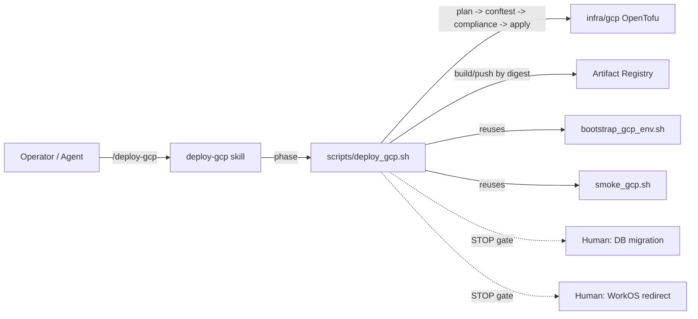

# Skill Deploy Guide — From Runbook to Autopilot

**Goal:** Use the project-scoped `deploy-gcp` Cursor skill and its orchestrator, [`scripts/deploy_gcp.sh`](../../../scripts/deploy_gcp.sh), to run the Tier A deployment one phase at a time — with the same policy gates and human stops the operator would otherwise type by hand from [LIVE_DEPLOYMENT.md](LIVE_DEPLOYMENT.md).

**Audience:** An operator (or an agent driving the skill) who has already completed [HUMAN_SETUP.md](HUMAN_SETUP.md) and wants a repeatable, gated deploy instead of copy-pasting Day-1 commands.

**Scope:** Deploy-only — `preflight -> foundations -> data -> secrets -> images -> backend -> frontend -> workos -> observability -> smoke`. Day-2 operations and teardown stay in [LIVE_DEPLOYMENT.md](LIVE_DEPLOYMENT.md) and [08_cleanup.md](08_cleanup.md).

---

## Before We Start: A Story

The first time you shipped Tier A, you flew the plane by hand. [LIVE_DEPLOYMENT.md](LIVE_DEPLOYMENT.md) was open on one monitor, a terminal on the other, and you walked the throttle forward one command at a time: `tofu plan`, squint at the diff, `conftest`, `terraform-compliance`, `tofu apply`. Build an image. Hunt for the digest. Paste it into `terraform.tfvars`. Apply again. Somewhere over the Pacific you forgot whether you had already updated `database-url`, and you spent ten minutes reading Cloud Run logs to find out.

It worked. But "it worked" is not the same as "it is repeatable." A runbook is a set of instructions a human follows carefully. The next person — or the same person at 2am — will skip a step, run an apply before the policy check, or pin a mutable tag instead of a digest.

So we built an autopilot. Not a magic "deploy everything" button (those crash planes), but a **phased autopilot** that flies the boring legs for you and *hands control back* at the two moments that genuinely need a human: the database migration and the WorkOS redirect. Every infra leg still runs the full pre-apply checklist in the right order, every time. You stay the pilot in command; the autopilot just refuses to let you skip the checklist.

That autopilot is the `deploy-gcp` skill plus [`scripts/deploy_gcp.sh`](../../../scripts/deploy_gcp.sh). This guide is its flight manual.



---

## Prerequisites

- [HUMAN_SETUP.md](HUMAN_SETUP.md) complete: billing-linked project, state bucket, `tofu-deployer` key in `GOOGLE_APPLICATION_CREDENTIALS`, and `infra/gcp/terraform.tfvars` populated.
- Dev toolchain installed: `pip install -e ".[dev]"` (provides `tofu`, `conftest`, `terraform-compliance`, `pytest`, plus `gcloud`/`docker` on PATH).
- The skill lives at `.cursor/skills/deploy-gcp/`. Invoke it explicitly with `/deploy-gcp` (it is `disable-model-invocation: true`, so it never auto-fires on a stray mention of "deploy").

---

## The Mental Model: One Command, Ten Legs

Everything runs through a single entrypoint:

```bash
./scripts/deploy_gcp.sh <phase>
```

The autopilot's golden rule is the **non-negotiable gate order** for every infrastructure leg. The orchestrator always runs these in sequence and never lets an apply jump the queue:

1. `tofu plan -out=tfplan -var-file=terraform.tfvars`
2. `tofu show -no-color tfplan > tfplan.txt`
3. `conftest test --policy policies/ --parser hcl2 --all-namespaces *.tf`
4. `tofu show -json tfplan > tfplan.json`
5. `terraform-compliance -p tfplan.json -f features/`
6. `tofu apply tfplan`

If a policy check fails, the apply never happens. That is the whole point.

### Flight controls (environment flags)

| Flag | Effect |
|------|--------|
| `DRY_RUN=1` | Prints every command, performs no apply or mutation. Your preflight rehearsal. |
| `AUTO_APPROVE=1` | Skips the `apply` confirmation prompt (use only in trusted automation). |
| `VERSION=vX` | Docker tag for the `images` phase. |
| `WRITE_TFVARS=1` | Writes digest-pinned `backend_image`/`frontend_image` into `terraform.tfvars` (with a `.bak` backup). |

Rehearse any leg before flying it for real:

```bash
DRY_RUN=1 ./scripts/deploy_gcp.sh foundations
```

---

## The Flight Plan (Phase Walkthrough)

Fly the legs in order. The autopilot halts itself (exit code `20`) at each STOP gate so you can do the human part, then you resume from the next phase.

### 1. `preflight` — clear the runway
Sources [`scripts/bootstrap_gcp_env.sh`](../../../scripts/bootstrap_gcp_env.sh). Treat any red `FAIL` as a hard blocker.

```bash
./scripts/deploy_gcp.sh preflight
```

### 2. `foundations` — pour the concrete (Recipe 1)
Runs `tofu init` against `${PROJECT}-tofu-state`, then the full gate. Creates APIs, Artifact Registry, runtime SA, and secret shells.

```bash
./scripts/deploy_gcp.sh foundations
```

### 3. `data` — the database, then a STOP gate (Recipe 2)
Applies Cloud SQL + buckets, then **hands control back**: it prints the exact `database-url` secret update and the `AsyncPostgresSaver.setup()` migration commands. These need your Cloud SQL password and a proxy, so the autopilot deliberately will not do them for you.

```bash
./scripts/deploy_gcp.sh data
# -> completes apply, prints DB commands, exits 20 (STOP GATE)
```

Run the printed commands, then continue.

### 4. `secrets` — confirm the envelopes are sealed (Recipe 1/3)
Verifies all 9 secrets have a non-placeholder latest version. Fails loudly if any still says `REPLACE_WITH...` or `placeholder`.

```bash
./scripts/deploy_gcp.sh secrets
```

### 5. `images` — pin by digest, never by tag (Recipe 3)
Builds and pushes `Dockerfile.backend` and `Dockerfile.frontend`, resolves the `@sha256` digests, and either writes them into `terraform.tfvars` (`WRITE_TFVARS=1`) or prints the lines to paste.

```bash
VERSION=v1 WRITE_TFVARS=1 ./scripts/deploy_gcp.sh images
```

### 6. `backend` — light up the engine (Recipe 4)
Gate + apply, then curls `${backend_url}/healthz` and asserts `status=ok`.

```bash
./scripts/deploy_gcp.sh backend
```

### 7. `frontend` — open the cabin (Recipe 5)
Gate + apply, then checks the frontend root returns `200/307/308`.

```bash
./scripts/deploy_gcp.sh frontend
```

### 8. `workos` — the second STOP gate (Recipe 5 / HUMAN_SETUP §6)
Prints `frontend_workos_redirect_uri` and stops. Add it in WorkOS Dashboard -> Authentication -> Redirects, then continue.

```bash
./scripts/deploy_gcp.sh workos
# -> prints redirect URI, exits 20 (STOP GATE)
```

### 9. `observability` — instruments online (Recipe 7)
Gate + apply for the monitoring dashboard and (if configured) the billing budget.

```bash
./scripts/deploy_gcp.sh observability
```

### 10. `smoke` — wheels-up confirmation
Delegates to [`scripts/smoke_gcp.sh`](../../../scripts/smoke_gcp.sh) (`/healthz`, frontend root, and authenticated SSE when `BEARER_TOKEN` is set).

```bash
./scripts/deploy_gcp.sh smoke
```

### `all` — fly the whole route with handoffs
Runs the sequence in order and halts at the first STOP gate it reaches. Complete the gate, then rerun from the next phase.

```bash
./scripts/deploy_gcp.sh all
```

---

## The Two Human Handoffs

The autopilot is honest about what it will not automate:

| Gate | After phase | Why a human flies it |
|------|-------------|----------------------|
| Database migration | `data` | Needs the Cloud SQL password and a local proxy; running `AsyncPostgresSaver.setup()` against the wrong DB is destructive. |
| WorkOS redirect URI | `frontend` (run `workos`) | Crosses an external auth boundary; the callback URL only exists after the frontend is live. |

Both are exit code `20`, which the `all` runner treats as "pause, not fail."

---

## Change Detection and Deploy Naming

### The `preview` phase

Before committing to any deploy phase, run:

```bash
./scripts/deploy_gcp.sh preview
```

This prints:
- The **base ref** being compared against (default `origin/main`, override with `BASE_REF`)
- Every **changed file** in the branch (three-dot merge-base diff)
- The **affected phases** in canonical order
- Which **images would rebuild** (backend, frontend, or both)
- The **deploy identity** (`DEPLOY_VERSION`, `SHORT_SHA`, `DEPLOY_ID`)

`preview` is advisory only — it never mutates state, never auto-skips phases, and is not included in `run_all`. The operator always makes the final call.

### Path → phase map

| Changed path | Affected phases | Image rebuild |
|---|---|---|
| `infra/gcp/foundations.tf`, `secret-manager.tf` | foundations, secrets + downstream | — |
| `infra/gcp/data.tf` | data | — |
| `infra/gcp/cloud-run-backend.tf` | backend | — |
| `infra/gcp/cloud-run-frontend.tf` | frontend | — |
| `infra/gcp/observability.tf`, `meta.tf` | observability | — |
| `infra/gcp/{variables,outputs,versions,backend}.tf`, `terraform.tfvars` | all infra phases (shared) | — |
| `Dockerfile.backend` + backend app code (`middleware/` included) | images, backend | backend |
| `Dockerfile.frontend` + `frontend/**` | images, frontend | frontend |

Forward-dependency expansion: if `foundations` is affected, downstream infra phases (`data`, `backend`, `frontend`, `observability`) are also marked.

### Single-root-module caveat

All `.tf` files in `infra/gcp/` share one OpenTofu state. The path→phase map is an orchestration-level labeling aid. `tofu plan` remains the source of truth for what actually changes at the infrastructure layer.

### Hybrid deploy naming

Every deploy now carries a three-layer identity:

| Layer | Value | Example |
|---|---|---|
| `DEPLOY_VERSION` | CalVer `YYYY.0M.0` (overridable) | `2026.05.0` |
| `SHORT_SHA` | `git rev-parse --short HEAD` | `abc1234` |
| `DEPLOY_ID` | `tierA-${ENV}-${DEPLOY_VERSION}-${SHORT_SHA}` | `tierA-prod-2026.05.0-abc1234` |

The `images` phase multi-tags each build (`:DEPLOY_VERSION` and `:sha-SHORT_SHA`), then pins the `@sha256` digest into `terraform.tfvars` as before. Backward compat: if `VERSION` is set explicitly, it still works; if unset, `VERSION` defaults to `DEPLOY_VERSION`.

### New environment flags

| Flag | Default | Effect |
|---|---|---|
| `BASE_REF` | `origin/main` | Base ref for change detection diff |
| `DEPLOY_VERSION` | CalVer `YYYY.0M.0` | CalVer version tag for images and deploy ID |
| `ENV` | `prod` | Environment name embedded in `DEPLOY_ID` |

For the full narrative — the *why* behind each design decision — see [Recipe 09: Change Detection](09_change_detection.md).

---

## Verify (no live GCP calls)

Rehearse the gated legs and confirm the script is healthy:

```bash
bash -n scripts/deploy_gcp.sh                      # syntax check
./scripts/deploy_gcp.sh preview                    # advisory diff + deploy identity (no mutations)
DRY_RUN=1 ./scripts/deploy_gcp.sh foundations      # prints the gate order, no apply
DRY_RUN=1 ./scripts/deploy_gcp.sh images           # shows multi-tag build + DEPLOY_ID, no push
DRY_RUN=1 ./scripts/deploy_gcp.sh data             # reaches the DB STOP gate (exit 20)
```

Expected: each infra leg prints `plan -> show -> conftest -> show -json -> terraform-compliance` in that order, then `WARN: DRY_RUN=1 set; skipping tofu apply`. The `preview` phase prints changed files, affected phases, and the deploy identity without touching any cloud resources.

---

## For a General Audience

Adapting this autopilot to another stack:

- Keep the **gate order** (`plan -> policy -> apply`) as the unskippable core; swap `conftest`/`terraform-compliance` for your policy tools.
- Keep **deploy-by-digest** in the image phase — mutable tags are how "it worked yesterday" stops being true.
- Keep the **STOP-gate-as-exit-20** convention so a full run can pause for humans without looking like a failure.
- Express the workflow as a **skill** (`SKILL.md` + `reference.md`) that *invokes a script* rather than restating the runbook — progressive disclosure keeps the agent's context lean.

---

## Rollback

The skill and orchestrator create no cloud resources by themselves — they invoke OpenTofu, which owns state. To undo a deploy, use the existing teardown path rather than this guide:

```bash
CONFIRM=1 MODE=partial ./scripts/teardown_gcp.sh   # keep AR + secrets
CONFIRM=1 MODE=full ./scripts/teardown_gcp.sh      # full stack destroy
```

To remove the skill itself: delete `.cursor/skills/deploy-gcp/` and `scripts/deploy_gcp.sh`. No infrastructure is affected.

---

## Cost Note

The skill and orchestrator add **$0.00**. They are local files. Costs come only from what OpenTofu provisions in the underlying recipes (Tier A total ~$12–15/mo, per [LIVE_DEPLOYMENT.md](LIVE_DEPLOYMENT.md) §1.12).

---

## What Comes Next

- For the narrative *why* behind each phase, read the matching recipe: [01_foundations.md](01_foundations.md) through [07_observability.md](07_observability.md), plus [09_change_detection.md](09_change_detection.md) for change detection and deploy naming.
- For Day-2 operations (rollback, scaling, secret rotation, SSE tuning) and the troubleshooting matrix, see [LIVE_DEPLOYMENT.md](LIVE_DEPLOYMENT.md).
- For log-level debugging of a failed request, see [LOG_PIPELINE_GUIDE.md](LOG_PIPELINE_GUIDE.md).
