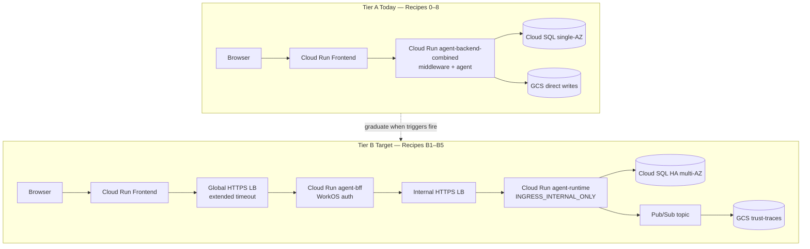
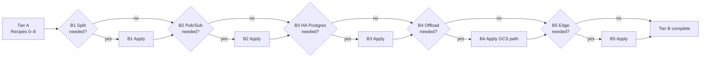

# Tier B Future Recipes — Decoupled GCP Production Topology

**Goal:** Document when and how to graduate from Tier A (~$12–15/mo dev) to Tier B small production (~$310/mo list-price). Recipes B1–B5 are **not implemented** in the initial pass — they are the planned upgrade path aligned with [`GCP_DEPLOYMENT_ARCHITECTURE.md`](../../Architectures/GCP_DEPLOYMENT_ARCHITECTURE.md) §3.1 and [`CLOUD_PROVIDER_COMPARISON.md`](../../Architectures/CLOUD_PROVIDER_COMPARISON.md) §3.2.

**Status:** Documentation only | Tier A Recipes 0–8 implement the baseline | Tier B adds ~$295/mo incremental list-price

---

## Before We Start: A Story

Tier A is a **workshop**: combined backend, scale-to-zero Cloud Run, direct GCS trace writes, single-AZ Postgres, and public `*.run.app` URLs. It proves the stack works and keeps cost near the Cloud SQL floor.

Tier B is a **production floor**: users expect sub-second SSE reconnects (no cold starts), security reviews want network isolation between rings, trace volume exceeds what synchronous GCS writes tolerate, and Postgres needs multi-AZ failover.

The code for Tier B is largely **already built** in Recipe 0 — `pubsub_sink.py`, split-ready composition roots, and Workload Identity mapping exist but are not wired in Tier A. What Tier B adds is **infrastructure and composition changes**, not greenfield adapter work.



---

## Decision Guide — When to Graduate

Use this table before starting any Tier B recipe. **Do not upgrade speculatively** — each recipe adds cost and operational surface.

| Trigger | Symptom | Start with | Est. incremental cost |
|---------|---------|------------|----------------------|
| Cold-start UX unacceptable | First SSE message > 3–5s after idle; users complain about "frozen" chat | **B1** (split + min-1) | +~$117/mo compute (2× min-1 services) |
| Security review requires ring isolation | Pen test flags `allUsers` backend invoker or combined blast radius | **B1** | +~$23/mo Global/Internal LB |
| Trace volume > ~10 GB/mo | GCS write latency spikes; checkpoint commits slow during trace bursts | **B2** | +~$2/mo Pub/Sub at 50 GB/mo |
| Production SLA on database | Need automatic failover; cannot tolerate single-AZ maintenance windows | **B3** | +~$138/mo (HA vs single-AZ ~$12) |
| Tool offload needs durable shared FS | Multiple backend replicas must share `cache/.agent_offload/` paths | **B4** | **Avoid Filestore** — prefer GCS object offload (~$0); Filestore Basic 1 TiB min ≈ **+$200/mo** |
| Custom domain + WAF required | Public internet exposure needs DDoS/WAF; `*.run.app` not acceptable | **B5** | +~$23/mo LB + Armor rules |

### Topology Options — Pros and Cons

| | **Option A — Combined backend (Tier A)** | **Option B — Split BFF + Backend (Tier B default)** |
|---|---|---|
| **Cost** | ~$12–15/mo | ~$310/mo (without Filestore) |
| **Deploy complexity** | 1 backend image, 1 Cloud Run service | 2 backend images, 2 services, 2 LBs |
| **Security** | App-layer auth only; `allUsers` invoker | Backend `INGRESS_TRAFFIC_INTERNAL_ONLY`; IAM OIDC between rings |
| **Scaling** | Single blast radius | Independent autoscaling per ring |
| **SSE** | Works on `*.run.app` with 3600s timeout | Requires LB extended timeout (3600s) on Global + Internal LBs |
| **Architecture fidelity** | Deviates from architecture doc §3.1 | Matches [`GCP_DEPLOYMENT_ARCHITECTURE.md`](../../Architectures/GCP_DEPLOYMENT_ARCHITECTURE.md) §3.1 |

**Recommendation:** Stay on Tier A until at least one trigger row fires. When upgrading, apply recipes **in order B1 → B2 → B3** as needed; B4 and B5 are independent add-ons.

---

## What Tier A Already Provides (Reuse, Don't Rebuild)

| Component | Tier A state | Tier B action |
|-----------|--------------|---------------|
| `postgres_saver.py` | Wired via Cloud SQL connector | Upgrade instance to HA (B3); same adapter |
| `gcs_sink.py` | Active trace sink | Swap to `pubsub_sink.py` in composition root (B2) |
| `pubsub_sink.py` | Implemented, **not wired** | Wire in B2; add Pub/Sub topic + GCS subscription in IaC |
| `agent_facts_gcs_registry.py` | Active | No change |
| `gcp_identity.py` | Active (Workload Identity) | Expand IAM for split SAs (B1) |
| `middleware/app_prod.py` | Combined entry point | Split into `middleware/server.py` only (BFF) + `agent_ui_adapter/server.py` (runtime) |
| `Dockerfile.backend` | Combined image | Add `Dockerfile.bff` + `Dockerfile.runtime` or reuse with different CMD (B1) |

---

## Tier B Cost Model (List-Price Reference)

From [`CLOUD_PROVIDER_COMPARISON.md`](../../Architectures/CLOUD_PROVIDER_COMPARISON.md) §4.2 — GCP with **GCS object offload instead of Filestore**:

| Line item | Tier A | Tier B incremental | Tier B total |
|-----------|--------|-------------------|--------------|
| Compute (backend) | ~$0 (scale-to-zero) | +~$117 (2× min-1, 1 vCPU / 2 GiB) | ~$117 |
| Frontend | ~$0 | +~$15 (min-0 or min-1) | ~$15 |
| Postgres | ~$12 (single-AZ 10 GB) | +~$138 (HA ~50 GB) | ~$150 |
| Object storage | ~$0 | +~$3–4 (200 GB + lifecycle) | ~$4 |
| Streaming sink | ~$0 (direct GCS) | +~$2 (Pub/Sub ~50 GB/mo) | ~$2 |
| Load balancer | ~$0 | +~$23 (Global + Internal HTTPS LB) | ~$23 |
| NFS / Filestore | ~$0 (ephemeral `/tmp`) | **$0 if GCS offload**; **+$200 if Filestore** | ~$0 |
| Logs + secrets | ~$0 | +~$0–3 | ~$3 |
| **Total** | **~$12–15/mo** | **~+$295/mo** | **~$310/mo** |

> **Filestore warning:** Filestore Basic has a **1 TiB minimum**. At Tier B workload (~10–50 GB NFS need), prefer **GCS object offload** for `AGENT_OFFLOAD_DIR` (Recipe 0 already sets ephemeral disk at Tier A). Only provision Filestore if tools require POSIX semantics that GCS cannot satisfy.

---

## Future Recipe B1 — Split BFF + Backend Services

**Trigger:** Cold-start UX unacceptable **or** security review requires network isolation between middleware and agent runtime.

**What it adds:**

- **`agent-bff`** Cloud Run service — `middleware/server.py` only (WorkOS auth, ACL, telemetry proxy)
- **`agent-runtime`** Cloud Run service — `agent_ui_adapter/server.py` only (LangGraph SSE, checkpoints, traces)
- **Global HTTPS LB** in front of BFF (extended backend timeout for SSE)
- **Internal HTTPS LB** between BFF and runtime
- Runtime ingress: `INGRESS_TRAFFIC_INTERNAL_ONLY`
- IAM: replace `allUsers` with service-account OIDC invoker bindings
- **`min_instance_count = 1`** on BFF + runtime (eliminates cold-start on SSE reconnect)

### Prerequisites

- Tier A Recipes 0–5 deployed and smoke-tested
- VPC subnet + Serverless VPC Access connector (for Internal LB + Cloud SQL private IP if adopted)
- Separate Artifact Registry tags: `agent-bff:v*`, `agent-runtime:v*`

### Agent Steps (outline — not yet implemented)

1. **Split Dockerfiles** — `Dockerfile.bff` (`uvicorn middleware.server:build_middleware_app --factory`) and `Dockerfile.runtime` (`uvicorn agent_ui_adapter.server:build_agent_app --factory`). Deprecate combined `app_prod.py` for Tier B deploys (keep for Tier A).
2. **Add `infra/gcp/cloud-run-split.tf`** — two Cloud Run v2 services, two invoker IAM bindings, LB resources.
3. **Wire frontend `MIDDLEWARE_URL`** to Global LB URL (not direct `*.run.app` backend URL).
4. **BFF → runtime calls** — configure Cloud Run service-to-service auth; BFF SA gets `roles/run.invoker` on runtime only.
5. **Extend Rego policies** — forbid `allUsers` on runtime; require `INGRESS_TRAFFIC_INTERNAL_ONLY` on runtime.
6. **Tests** — `tests/infra/gcp/test_cloud_run_split.py` (HCL contract tests mirroring Recipes 4–5).

### Human Review Gate

- [ ] Confirm Global LB backend timeout ≥ 3600s (SSE)
- [ ] Confirm runtime is **not** reachable from public internet (`curl` direct `*.run.app` URL should fail)
- [ ] Update WorkOS redirect URI if LB hostname changes
- [ ] Sign off on ~$140/mo incremental (compute + LB) before apply

### Verify

```bash
# Runtime not publicly invokable
curl -s -o /dev/null -w "%{http_code}" "$(tofu output -raw runtime_url)/healthz"  # expect 403

# End-to-end via frontend
./scripts/smoke_gcp.sh
```

### Rollback

Revert to combined `agent-backend-combined` (Tier A Recipe 4). Destroy LB resources first, then split services.

---

## Future Recipe B2 — Pub/Sub Trace Pipeline

**Trigger:** Trace volume > ~10 GB/mo **or** synchronous GCS writes cause checkpoint latency spikes.

**What it adds:**

- Pub/Sub topic `trust-traces`
- Cloud Storage subscription (micro-batch writes to `trust-traces` bucket)
- Runtime SA: `roles/pubsub.publisher` on topic
- Composition root switch: `PubSubTraceSink` instead of `GcsTraceSink`

### Prerequisites

- Recipe B1 or Tier A backend deployed (works on combined backend too)
- `services/trace_sinks/pubsub_sink.py` already exists (Recipe 0)

### Agent Steps (outline)

1. **Add `infra/gcp/pubsub.tf`** — topic, GCS subscription with matching bucket prefix, dead-letter topic optional.
2. **Env var `TRACE_SINK=pubsub`** (or auto-select when `PUBSUB_TRACES_TOPIC` set) in composition root.
3. **IAM** — runtime SA publisher binding; meta ring reader unchanged (reads GCS, not Pub/Sub).
4. **Tests** — extend `test_data.py` / new `test_pubsub.py` for topic + subscription HCL contracts.

### Human Review Gate

- [ ] Confirm subscription ack deadline handles slow GCS writes
- [ ] Validate meta ring (`meta/run_eval.py`) still reads from GCS bucket path (unchanged consumer)

### Cost Note

~$2/mo at 50 GB/mo ingest (Pub/Sub) + negligible GCS subscription cost. Replaces direct PutObject latency with async buffering.

---

## Future Recipe B3 — Cloud SQL HA (Multi-AZ)

**Trigger:** Production SLA requires automatic failover; maintenance windows on single-AZ are unacceptable.

**What it adds:**

- Cloud SQL **regional HA** instance (primary + standby in second zone)
- Storage upgrade to ~50 GB (Tier B workload profile)
- Connection string update in `DATABASE_URL` secret
- Optional: private IP + VPC peering (recommended with Internal LB from B1)

### Prerequisites

- Recipe 2 data tier deployed
- Maintenance window scheduled (failover test)

### Agent Steps (outline)

1. **Modify `infra/gcp/data.tf`** — set `availability_type = "REGIONAL"`, increase `disk_size`, `deletion_protection = true`.
2. **Run `AsyncPostgresSaver.setup()`** against new instance (migration is forward-compatible).
3. **Update monitoring** — Recipe 7 alerts: raise connection threshold if pool size increases.
4. **Rego** — require `availability_type = "REGIONAL"` when `var.tier = "b"`.

### Human Review Gate

- [ ] Test failover: `gcloud sql instances failover $INSTANCE`
- [ ] Confirm application reconnects within SLA (< 60s typical)
- [ ] Sign off on ~+$138/mo Postgres cost

### Cost Note

~$150/mo for HA `db-custom-2-7680` at 50 GB vs ~$12/mo Tier A shared-core.

---

## Future Recipe B4 — Durable Tool Offload (GCS Preferred)

**Trigger:** Tool offload files must survive container restarts **and** be visible across multiple runtime replicas.

**What it adds (preferred path — GCS object offload):**

- `AGENT_OFFLOAD_URI=gs://{project}-agent-offload/` env var
- New bucket or prefix with lifecycle (7-day delete for ephemeral offload)
- Runtime SA: `roles/storage.objectCreator` + `objectViewer` on offload bucket
- Code: extend tool file I/O adapter to read/write GCS URIs (small adapter change in `services/tools/`)

**What it adds (Filestore path — avoid unless POSIX required):**

- Filestore Basic instance (1 TiB minimum ≈ **$200/mo**)
- Serverless VPC Access + volume mount on Cloud Run
- `AGENT_OFFLOAD_DIR=/mnt/offload`

### Decision

| Need | Choose |
|------|--------|
| Ephemeral scratch across restarts, any replica | **GCS object offload** (~$0–1/mo) |
| True POSIX file locking, mmap, local path semantics | Filestore (cost warning) |
| Single replica, dev iteration | Tier A ephemeral `/tmp` (current) |

### Human Review Gate

- [ ] Confirm tool implementations support chosen storage backend
- [ ] If Filestore: acknowledge 1 TiB minimum on billing review

---

## Future Recipe B5 — Edge Hardening (Custom Domain + Cloud Armor)

**Trigger:** Custom domain required; WAF/DDoS protection mandated by security policy.

**What it adds:**

- Global HTTPS Load Balancer with managed SSL certificate
- Cloud Armor security policy (rate limiting, geo restrictions, OWASP rule set)
- Cloud Run domain mapping or LB serverless NEG backend
- DNS A/AAAA records at operator's registrar

### Prerequisites

- Recipe B1 (LB already exists) or standalone LB for Tier A frontend-only hardening
- Domain ownership verified in GCP

### Agent Steps (outline)

1. **Add `infra/gcp/edge.tf`** — managed cert, Armor policy, backend service timeout 3600s.
2. **Update WorkOS** — redirect URI to custom domain.
3. **Update frontend env** — `NEXT_PUBLIC_WORKOS_REDIRECT_URI=https://app.example.com/...`

### Human Review Gate

- [ ] DNS propagation verified
- [ ] Armor rules tested (legitimate SSE not blocked — watch for body inspection breaking streaming)
- [ ] SSL cert ACTIVE before cutover

### Cost Note

~$23/mo LB base + ~$5/mo Armor policy + $0.75/million requests evaluated.

---

## Recommended Upgrade Sequence



Apply recipes incrementally. Run `./scripts/smoke_gcp.sh` after each. Use `MODE=partial` teardown from Recipe 8 to roll back individual tiers without destroying secrets.

---

## Migration Checklist (Tier A → Tier B)

| Step | Action | Recipe |
|------|--------|--------|
| 1 | Measure cold-start p95 and trace write latency | — |
| 2 | Decide split vs stay combined | B1 decision guide |
| 3 | Snapshot GCS traces + export Cloud SQL if needed | 8 (backup) |
| 4 | Apply B1 split + min-1 + LBs | B1 |
| 5 | Switch trace sink to Pub/Sub if volume warrants | B2 |
| 6 | Upgrade Postgres to HA | B3 |
| 7 | Re-run smoke + browser E2E | 7 |
| 8 | Update observability thresholds for new service names | 7 |
| 9 | Optional: custom domain + Armor | B5 |

---

## For a General Audience

If you run a similar Next.js + FastAPI + LangGraph stack on GCP:

1. **Start combined, split later** — a single Cloud Run service with a factory-composed app is the cheapest proof point.
2. **Never provision Filestore for small workloads** — GCS object storage for offload saves ~$200/mo at Tier B.
3. **Pub/Sub decouples trace writes from request latency** — switch when volume or latency triggers fire, not at day one.
4. **Internal ingress + OIDC** is the GCP-native way to replace `allUsers` without exposing the agent runtime to browsers.
5. **Extended LB timeouts** are mandatory for SSE — default 30s backends will truncate streams.

---

## Related Documents

| Document | Role |
|----------|------|
| [`docs/plans/gcp_deployment_recipes.plan.md`](../../plans/gcp_deployment_recipes.plan.md) | Master plan; Tier A Recipes 0–8 |
| [`docs/Architectures/GCP_DEPLOYMENT_ARCHITECTURE.md`](../../Architectures/GCP_DEPLOYMENT_ARCHITECTURE.md) | Target production topology §3.1 |
| [`docs/Architectures/CLOUD_PROVIDER_COMPARISON.md`](../../Architectures/CLOUD_PROVIDER_COMPARISON.md) | Tier B cost model §4.2 |
| [`docs/recipes/gcp/HUMAN_SETUP.md`](HUMAN_SETUP.md) | Operator preflight (unchanged for Tier B) |
| [`docs/recipes/gcp/08_cleanup.md`](08_cleanup.md) | Partial teardown between upgrade iterations |

---

## Files to Create (When Implementing Tier B)

| Future file | Recipe | Purpose |
|-------------|--------|---------|
| `infra/gcp/cloud-run-split.tf` | B1 | Split BFF + runtime services + LBs |
| `infra/gcp/pubsub.tf` | B2 | Trace pipeline |
| `infra/gcp/edge.tf` | B5 | Custom domain + Armor |
| `Dockerfile.bff` / `Dockerfile.runtime` | B1 | Separate images |
| `tests/infra/gcp/test_cloud_run_split.py` | B1 | IaC contract tests |
| `tests/infra/gcp/test_pubsub.py` | B2 | IaC contract tests |
| `docs/recipes/gcp/B1_split_services.md` … | B1–B5 | Executable recipe docs (future) |
