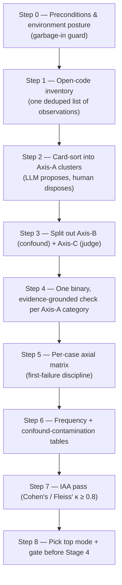

# Recipe 0 — The Detective Who Refused to Trust the Confession

**Goal:** Understand *why* you cannot read a pile of failed agent runs and simply count "the agent failed N times," and how a **grounded-theory failure taxonomy** turns messy trace evidence into a small set of named, counted, *testable* failure modes — then picks the one mode worth building a judge for.

**Status:** GoalJudge axial-coding series overview — documentation only, no code changes | Prerequisite for the single step-by-step recipe that follows.

**Prerequisite:** Familiarity with Python and basic ML. **No** prior qualitative-coding background assumed — every term is defined the first time it appears.

---

## Before We Start: A Story

A detective walks into a cold-case unit with a box of 22 case files. Each file is a *trace*: a transcript of an AI agent that was given a task and either finished it, fumbled it, or quietly pretended to finish it. The easy move — the move a junior makes — is to flip through the files, tally "guilty / not guilty," and announce *"the agent fails 70% of the time."*

The seasoned detective does four things the junior never thinks to do:

1. **Refuses to trust the confession.** When a suspect (the agent) writes *"I have completed all three subtasks successfully"* in its own final answer, that is a **statement, not a fact**. The detective only believes the *physical evidence* — the tool calls that actually ran, the files that actually changed. A confession that the forensics contradict is itself the crime: **corrupt success**.

2. **Separates the suspect's crimes from the crime scene's contamination.** Half the "failures" turn out to be the *building's* fault, not the suspect's: a locked door (a blocked shell command), a room that doesn't exist on the map (a missing workspace path), a guard who tackled the suspect before they could act (the orchestrator aborting on a tool error). A perfect agent could not have succeeded in that room. Counting those as the suspect's crimes would convict an innocent.

3. **Catches the unreliable witness.** Sometimes the *evaluator* — the automated judge that stamped "goal met: true" — is simply wrong. That is not the agent's failure; it is a defect in the verdict. A detective who can't tell a bad suspect from a bad witness builds a bad case.

4. **Builds the case the lab can actually test.** Every "failure mode" the detective names must come with a **yes/no test that any other investigator could run from the evidence alone** — not from the suspect's prose. A category you can't write a test for is a hunch, not a finding.

This recipe series is that detective's notebook. The method has a formal name — **grounded theory** (building categories *up from* the evidence rather than imposing them top-down) applied to **error analysis** of AI agents — but the discipline is exactly the four habits above.

---

## The Key Insight: the trace is the ground truth, the claim is a suspect

The single idea the whole method turns on:

> **Ground truth is the trace — the tool calls, state changes, and termination state — never the agent's narration.**

An agent that *says* "I ran the tests and they pass" but whose trace shows the test command was never executed has not passed the tests; it has produced a **corrupt success** ([arXiv 2603.03116](https://arxiv.org/abs/2603.03116)). Every category we name and every check we write is designed so an agent **cannot pass it by claiming to** — the *anti-gaming property* ([arXiv 2601.14691](https://arxiv.org/abs/2601.14691)). This is why the method is worth the effort: a naive accuracy count rewards the confident liar.

---

## The three orthogonal axes

The detective sorts every observation onto one of three independent axes. Keeping them separate is the analytical heart of the method.

| Axis | Question it answers | Example | Where it feeds |
|---|---|---|---|
| **A — agent behavior** | Did the *agent* deviate? | claimed 3/3 done, evidence shows 2/3 (`partial-counted-as-full`) | Stage-4 **agent rubric** |
| **B — harness / environment confound** | Could a *perfect* agent have failed here anyway? | required `echo` blocked by the shell allowlist | re-run on a corrected environment |
| **C — judge reliability** | Is the defect in the *verdict*, not the behavior? | `goal_met=true` while the agent's own evidence says false | Stage-6 **judge calibration** |

A **confound** (Axis B) is any environmental factor that blocks or distorts the agent so that the behavior you wanted to measure never actually got exercised. Folding confounds into Axis A is the cardinal sin: it counts "the sandbox blocked the agent" as "the agent failed," and poisons every downstream priority.

---

## The Step 0 → 8 pipeline

---

## What you will produce

| Output | The detective's analogue |
|---|---|
| A 3-axis taxonomy (A/B/C) with member codes | The case-file index, with crimes / crime-scene-contamination / bad-witness kept separate |
| One binary testable check per Axis-A category | A lab test any investigator can re-run from the evidence |
| A per-case axial matrix (GJ-001–GJ-022) | One coded row per case file, first-failure discipline applied |
| Provisional frequency + contamination tables | The honest tally that flags how much is the crime scene's fault |
| An inter-annotator agreement (IAA) number — κ | Proof a *second* investigator reaches the same verdicts |
| A **gated** top-mode pick | The one charge solid enough to take to trial — pending the open evidence gates |

**The end deliverable** is not a report; it is a *decision*: **which single failure mode the Stage-4 rubric should target first**, plus the explicit list of conditions that must clear before that rubric work is authorized. In this session the pick is **A2 · corrupt-success**, chosen on the "biggest *and* cleanest" rule and held behind a gate until the environment confounds are corrected and a human IAA pass clears κ ≥ 0.8.

---

## Audience & how to read the recipe

Target reader: **AI intern engineers and junior data scientists** who know Python and basic ML but have never done qualitative coding. The single companion recipe mirrors this series' house style:

1. **"Before We Start: A Story"** — the detective metaphor, carried throughout.
2. **Numbered lessons**, one per pipeline step (Lesson N ↔ Step N).
3. **"Checkpoint question"** after each lesson — the pedagogical hook.
4. **"Why not X?" sidebars** for the rejected alternatives (this is where the *judgment* lives).
5. **Mermaid diagrams** and **matrices** for flows and contracts.
6. **"Run It Yourself"** commands to inspect the real artifacts.

---

## What Comes Next

Continue to [`01_axial_coding_failure_taxonomy.md`](01_axial_coding_failure_taxonomy.md) — *Reading the Crime Scene, Not the Confession* — the single long recipe that walks all nine steps (0–8), grounded in the real GoalJudge session artifacts and the [manual walkthrough](../../walk-through/05_goaljudge_axial_coding_failure_taxonomy_walkthrough.md).
