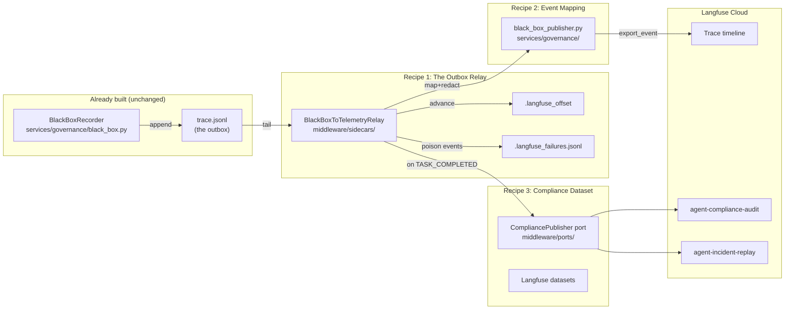

# Recipe 0 — The Black Box Hidden in Your Cache Folder

**Goal:** Understand why your agent framework already has a flight recorder, what it captures, and how the next three recipes connect it to Langfuse so the recordings become visible, searchable, and audit-ready.

**Status:** Complete | Series overview — no code changes | Prerequisite for Recipes 1–3

---

## Before We Start: A Story

On May 2, 1953, BOAC Flight 783 crashed shortly after takeoff from Calcutta, killing all 43 people aboard. The cause remained a mystery for months. Investigators had no cockpit recordings, no flight data — only scattered debris and conflicting eyewitness accounts. It took Australian researcher David Warren four more years to convince aviation regulators that a simple idea could prevent this opacity: **record everything, all the time, even when nothing is going wrong.**

By 1960, Australia mandated flight recorders on all commercial aircraft. Within a decade, accident investigations went from months of forensic guesswork to days of systematic data analysis. Today, aviation is the safest form of mass transportation — not because planes never fail, but because every failure teaches the entire industry a lesson.

Now look at your `cache/` folder:

```
cache/
└── black_box_recordings/
    ├── wf-a3f2b1c4/
    │   └── trace.jsonl      ← 47 events, SHA-256 chained
    ├── wf-e7d9c2a1/
    │   └── trace.jsonl      ← 12 events, chain intact
    └── wf-9b8a7c6d/
        └── trace.jsonl      ← 83 events, chain broken at event 61
```

Your agent has been recording everything. Every task started, every model selected, every guardrail checked, every tool called, every error that occurred — all appended to an immutable JSONL file with SHA-256 chaining so you can prove nothing was tampered with after the fact.

The `BlackBoxRecorder` in [`services/governance/black_box.py`](../../../services/governance/black_box.py) is the flight recorder. It writes 9 event types to disk:

| Event type | What it records |
|---|---|
| `TASK_STARTED` | A new workflow begins |
| `STEP_PLANNED` | The agent plans its next step |
| `STEP_EXECUTED` | A step completes (success or failure) |
| `TOOL_CALLED` | A tool invocation and its result |
| `MODEL_SELECTED` | Which LLM tier was chosen and why |
| `GUARDRAIL_CHECKED` | Input/output guardrail verdict |
| `PARAMETER_CHANGED` | A runtime parameter was modified |
| `ERROR_OCCURRED` | An error was caught and classified |
| `TASK_COMPLETED` | The workflow ends, with outcome |

Each event carries an `integrity_hash` — a SHA-256 digest chaining the current event's payload with the previous event's hash. Break any event in the chain and every subsequent hash diverges. This is the same principle that makes blockchain ledgers tamper-evident, applied to your agent's decision history.

But here is the problem: **if your flight recorder is invisible until you crash, did it ever really exist?**

Those JSONL files sit quietly in `cache/`. You can `cat` them after an incident. You can run `recorder.export(workflow_id)` and get a JSON bundle. But you cannot *see* the recordings while the agent is running. You cannot search across workflows. You cannot attach the audit trail to a Langfuse trace that your team is already watching. You cannot hand an auditor a URL and say "here is cryptographic proof of every decision this agent made last Tuesday."

That is what this recipe series fixes.

---

## What You Will Build



Three recipes, each building on the last:

1. **Recipe 1 — The Outbox Relay** teaches the transactional outbox pattern. You will learn why writing to both a file and an API in the same operation is a bug (the dual-write trap), how the JSONL file already functions as an outbox, and how a relay sidecar tails it with offset bookkeeping for at-least-once delivery.

2. **Recipe 2 — Event Mapping** teaches how nine different event types translate into Langfuse's observation model. You will learn the mapping table, why idempotency via `observation_id` matters for retries, and how PII/API-key redaction reuses the existing guardrail infrastructure.

3. **Recipe 3 — Compliance Dataset** teaches how to turn every completed workflow into an audit-grade Langfuse dataset item. You will learn why datasets (not trace metadata) are the right container for compliance payloads, how the integrity hash chain becomes a Langfuse score, and how failed workflows feed a regression testing dataset.

---

## Prerequisites

- Python 3.10+ with the repo installed: `pip install -e ".[dev]"`
- Familiarity with the four-layer architecture: `trust/` → `services/` → `components/` → `orchestration/`
- Read the BlackBoxRecorder tutorial: [`governanaceTriangle/02_black_box_recording_debugging.md`](../../../governanaceTriangle/02_black_box_recording_debugging.md) for the aviation analogy in full depth
- Optional: a Langfuse Cloud account (free tier is sufficient for all recipes)

---

## The Key Insight: `workflow_id` IS the Langfuse `trace_id`

Before we start the recipes, internalize this one fact — it simplifies everything:

The runtime adapter at [`agent_ui_adapter/adapters/runtime/langgraph_runtime.py`](../../../agent_ui_adapter/adapters/runtime/langgraph_runtime.py) mints a single UUID and seeds it as both the `trace_id` (on every domain event sent to Langfuse) and the `workflow_id` (into the LangGraph state that the BlackBoxRecorder uses). This means:

- BlackBox events keyed by `workflow_id` land under the **same Langfuse trace** as the existing `run.started`, `tool.started`, and `llm.started` domain events.
- No mapping table. No join query. No reconciliation job.
- One UUID, one timeline, one place to look.

This is design decision §2.2 from the [implementation plan](../../plans/blackbox_to_langfuse.plan.md), and it is the reason the entire relay can be built without modifying the BlackBoxRecorder.

---

## Layering — Where Each Piece Lives

Every file created in this series respects the four-layer architecture:

| Layer | File | Role | May import from |
|---|---|---|---|
| **Services** | `services/governance/black_box_publisher.py` | Pure mapping + redaction | `services/`, `trust/` only |
| **Middleware** | `middleware/sidecars/black_box_to_telemetry.py` | Relay sidecar | `middleware/ports/`, `services/` |
| **Middleware** | `middleware/ports/compliance_publisher.py` | Vendor-neutral protocol | stdlib + typing only |
| **Middleware** | `middleware/composition.py` | Wiring (extended) | Everything in middleware/ |

The BlackBoxRecorder itself (`services/governance/black_box.py`) is **unchanged**. It stays pure — no SDK imports, no awareness that Langfuse exists. The relay treats the JSONL file as a read-only data source.

---

## How to Read These Recipes

Each recipe follows the same structure, mirroring the [GCP adapter recipes](../gcp/00_adapters.md):

1. **"Before We Start: A Story"** — a narrative scenario that motivates the lesson.
2. **Numbered lessons** — each covering one concept with code snippets and file paths.
3. **"Checkpoint question"** after each lesson — test your understanding before moving on.
4. **"Why not X?" sidebars** — explain rejected alternatives and trade-offs.
5. **Mermaid diagrams** — visualize data flow and architecture.
6. **"Run it yourself"** section — commands to verify everything works.
7. **Status banner** — test count, cost estimate, links to the next recipe.

---

## What Comes Next

With this overview in mind, continue to the first recipe:

Continue to [`01_outbox_relay.md`](01_outbox_relay.md) — *The Dual-Write Bug That Could Have Stayed Hidden Forever*.
