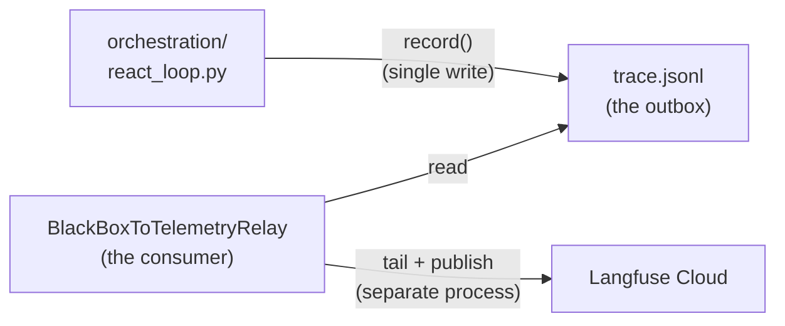
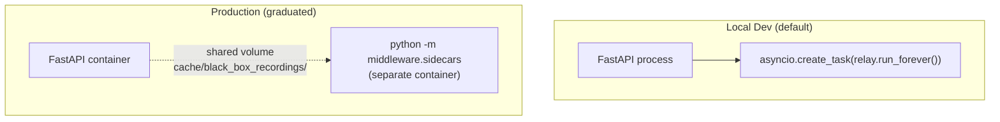

# Recipe 1 — The Dual-Write Bug That Could Have Stayed Hidden Forever

**Goal:** Build the relay that tails the BlackBox JSONL outbox and publishes events to Langfuse with at-least-once delivery, offset bookkeeping, and a dead-letter queue for poison events.

**Status:** Complete (Sprint C + D) | 44 contract tests passing | ~$0/mo Langfuse incremental at dev tier

---

## Before We Start: A Story

It is 2 AM. Your pager fires. A compliance auditor reviewed yesterday's agent runs and found a gap: Langfuse shows 847 events for workflow `wf-c9a2f1d3`, but the BlackBox JSONL file on disk has 851. Four events vanished. Not corrupted, not rejected — just absent. The Langfuse trace looks complete. The JSONL file *is* complete. You have no idea when the divergence started.

You open the code and find this:

```python
def record_and_publish(event):
    recorder.record(event)           # write to JSONL (succeeds)
    exporter.export_event(event)     # send to Langfuse (fails silently)
```

That is a **dual write**. Two side effects in one operation, with no atomicity guarantee between them. The disk write succeeds, the network call flakes, and you have silent divergence. The [AWS Prescriptive Guidance on dual writes](https://docs.aws.amazon.com/prescriptive-guidance/latest/cloud-design-patterns/transactional-outbox.html) calls this the number-one cause of data inconsistency in distributed systems. And the fix is older than microservices: the **transactional outbox pattern**.

This recipe teaches the outbox pattern as implemented in this codebase — not as an abstract design pattern, but as the specific relay that tails `trace.jsonl` and publishes to Langfuse.

---

## Prerequisites

- Recipe 0 overview: [`00_overview.md`](00_overview.md)
- Python 3.10+ with the repo installed: `pip install -e ".[dev]"`
- Familiarity with `BlackBoxRecorder` (see [`governanaceTriangle/02_black_box_recording_debugging.md`](../../../governanaceTriangle/02_black_box_recording_debugging.md))

---

## The Four Lessons

---

### Lesson 1 — The Dual-Write Trap

> "If you write to two systems in one operation, you will lose data. The only question is when."

A dual write occurs whenever a single code path performs two side effects — typically a local write and a remote API call — without a transaction spanning both. Consider:

```python
recorder.record(event)           # 1. append to trace.jsonl ✓
exporter.export_event(event)     # 2. POST to Langfuse API  ✗ (timeout)
```

If step 2 fails, the event exists on disk but not in Langfuse. If step 2 succeeds but step 1 fails (rare but possible with a full disk), the event exists in Langfuse but not on disk. Either way, your two systems disagree, and you have no mechanism to detect or resolve the divergence.

The transactional outbox pattern eliminates this by making exactly one system the source of truth:



The producer writes to **one** durable store. A separate relay reads from that store and publishes to the external system. If the relay fails, it retries from where it left off. If the relay crashes and restarts, it resumes from the last committed offset. The outbox file is the single source of truth.

> **Why not just wrap both writes in a database transaction?** Because there is no database. The BlackBox writes to a JSONL file. The Langfuse SDK sends HTTP requests. No transaction coordinator spans a local file and a remote HTTP API. The outbox pattern is the industry-standard solution when you cannot have a distributed transaction.

**Checkpoint question:** You add a `try/except` around the `export_event` call and log the failure. Does this fix the dual-write problem?

*Answer: No. Logging the failure helps you detect the divergence after the fact, but it does not prevent it. The event is still missing from Langfuse. The outbox pattern is structurally different: the relay retries from the file, so the event is eventually published regardless of transient failures.*

---

### Lesson 2 — The JSONL Is Already an Outbox

Look at [`services/governance/black_box.py`](../../../services/governance/black_box.py):

```python
# services/governance/black_box.py

class BlackBoxRecorder:
    def record(self, event: TraceEvent) -> None:
        wf_dir = self._storage_dir / event.workflow_id
        wf_dir.mkdir(parents=True, exist_ok=True)
        trace_file = wf_dir / "trace.jsonl"

        prev_hash = self._last_hash.get(event.workflow_id, "0" * 64)
        event_data = event.model_dump(mode="json")
        event_data.pop("integrity_hash", None)
        payload = json.dumps(event_data, sort_keys=True, default=str) + prev_hash
        integrity_hash = hashlib.sha256(payload.encode()).hexdigest()

        event_data["integrity_hash"] = integrity_hash
        self._last_hash[event.workflow_id] = integrity_hash

        with open(trace_file, "a") as f:
            f.write(json.dumps(event_data, default=str) + "\n")
```

This is a textbook transactional outbox:

| Outbox property | How `trace.jsonl` satisfies it |
|---|---|
| **Append-only** | `open(trace_file, "a")` — never overwritten |
| **Durable** | Persisted to disk immediately (no buffering) |
| **Ordered** | Events appended sequentially; line order = event order |
| **Integrity-verified** | SHA-256 chain means any tampering is detectable |
| **Producer-unaware** | `BlackBoxRecorder` does not know about Langfuse |

The recorder does not need modification. It already writes the perfect outbox. We just need a relay to tail it.

**Checkpoint question:** The `record()` method computes a SHA-256 hash chaining each event to its predecessor. Why does this matter for the outbox pattern?

*Answer: The hash chain lets the relay (and any auditor) verify that no events were inserted, deleted, or reordered after the fact. If the relay publishes event N and then event N+1 fails validation, it knows the outbox was tampered with — not just that Langfuse missed an event.*

---

### Lesson 3 — Offset Bookkeeping for At-Least-Once Delivery

The `BlackBoxToTelemetryRelay` class exposes two public methods: `run_once()` (scan all workflow directories and publish new events) and `run_forever()` (async loop wrapping `run_once` at a configurable interval). Internally, `run_once` calls `_process_workflow` for each directory, which tracks how far it has read into the JSONL file using a byte offset:

```python
# middleware/sidecars/black_box_to_telemetry.py

def _process_workflow(self, wf_dir: Path, trace_file: Path) -> int:
    wf_id = wf_dir.name

    current_mtime = trace_file.stat().st_mtime
    if wf_id in self._mtimes and self._mtimes[wf_id] == current_mtime:
        return 0  # file unchanged since last poll

    offset_file = wf_dir / ".langfuse_offset"
    file_size = trace_file.stat().st_size

    if not offset_file.exists():
        # Forward-only on startup: skip existing events
        offset_file.write_text(str(file_size))
        self._mtimes[wf_id] = current_mtime
        return 0

    offset = int(offset_file.read_text().strip())
    if offset >= file_size:
        self._mtimes[wf_id] = current_mtime
        return 0

    with open(trace_file, "rb") as fh:
        fh.seek(offset)
        new_bytes = fh.read()

    # ... process lines, advance offset ...
```

Three design decisions baked into this code:

1. **Forward-only on startup.** When the relay first encounters a workflow directory (no `.langfuse_offset` file), it seeks to the end of the file. Historical events are not backfilled. This prevents a flood of old events when you first enable the relay on a codebase with existing recordings.

2. **mtime-based change detection.** Before reading the file, the relay checks `st_mtime`. If the file has not been modified since the last poll, it skips the workflow entirely. At 1-second polling interval, this keeps CPU usage negligible even with hundreds of workflow directories.

3. **Partial-line safety.** If the recorder is mid-write when the relay reads, the last line may be incomplete (no trailing newline). The relay detects this and defers that partial line to the next poll:

```python
if new_text and not new_text.endswith("\n"):
    last_nl = new_text.rfind("\n")
    if last_nl == -1:
        return 0  # entire read was a partial line — wait
    new_text = new_text[:last_nl + 1]
```

When the relay successfully publishes a batch of lines, it advances the offset:

```python
offset_file.write_text(str(offset + bytes_consumed))
```

This gives at-least-once delivery. If the relay crashes after publishing but before advancing the offset, it re-publishes those events on restart. Duplicates are harmless because Langfuse uses the `event_id` as the observation ID (idempotent upsert — covered in Recipe 2).

> **Why not use a database for offset tracking?** A `.langfuse_offset` text file sitting next to the `trace.jsonl` is simpler, has no dependencies, and survives process restarts. For a single-instance relay processing local files, it is the right tool. If you graduate to a multi-instance relay reading from shared storage, you would swap this for a Postgres row or a Redis key — but the relay class interface stays the same.

**Checkpoint question:** The relay starts for the first time on a codebase with 200 existing workflow recordings. How many historical events does it publish to Langfuse?

*Answer: Zero. Forward-only startup means the relay writes `file_size` to `.langfuse_offset` for each workflow on first encounter, effectively seeking to the end. Only events appended after the relay starts will be published.*

---

### Lesson 4 — The Dead-Letter Queue and Retry Policy

Not every event can be published. Corrupt JSON, schema validation failures, or persistent Langfuse API errors will produce poison events. The relay handles these with jittered exponential backoff and a per-workflow DLQ:

```python
# middleware/sidecars/black_box_to_telemetry.py

def _process_line(self, wf_dir: Path, line: str) -> bool:
    last_exc: Exception | None = None
    for attempt in range(self._max_retries + 1):
        try:
            event_data = json.loads(line)
            event = TraceEvent.model_validate(event_data)
            kwargs = to_export_kwargs(event)

            attrs: dict[str, Any] = dict(kwargs["attributes"])
            attrs["__bb_observation_id"] = kwargs["observation_id"]
            attrs["__bb_observation_type"] = kwargs["observation_type"]
            attrs["__bb_level"] = kwargs["level"]

            self._exporter.export_event(
                name=kwargs["name"],
                trace_id=kwargs["trace_id"],
                attributes=attrs,
            )
            return True
        except Exception as exc:
            last_exc = exc
            if attempt < self._max_retries and self._base_delay_s > 0:
                delay = self._base_delay_s * (2**attempt)
                jitter = random.uniform(0, delay * 0.5)
                time.sleep(delay + jitter)

    self._write_dlq(wf_dir, line, str(last_exc))
    return False
```

The retry policy:

| Attempt | Base delay | Jitter range | Max total wait |
|---|---|---|---|
| 1 | 1 s | 0–0.5 s | 1.5 s |
| 2 | 2 s | 0–1.0 s | 3.0 s |
| 3 | 4 s | 0–2.0 s | 6.0 s |
| 4 | 8 s | 0–4.0 s | 12.0 s |
| 5 | 16 s | 0–8.0 s | 24.0 s |

After 5 failed attempts, the event is written to `.langfuse_failures.jsonl` (the DLQ) and the relay advances past it. The DLQ entry includes the original line, the error message, and a timestamp:

```json
{"line": "{\"event_id\": ...}", "error": "JSONDecodeError: ...", "timestamp": "2026-05-28T10:00:00Z"}
```

This ensures one poison event never blocks the relay from processing subsequent healthy events.

**Checkpoint question:** A Langfuse API outage lasts 3 minutes. The relay polls every 1 second. How many events could the relay lose during the outage?

*Answer: Zero. Each event is retried 5 times with exponential backoff (up to ~46.5 seconds total). If all retries fail, the event goes to the DLQ — but the JSONL file still has it. When the outage ends, new events publish normally. DLQ events can be replayed manually. The outbox guarantees no data is lost from the source.*

---

## In-Process vs Out-of-Process Drivers

The `BlackBoxToTelemetryRelay` class is a reusable building block. It has two driver shells:

### Default: in-process (local dev)

The relay runs as an `asyncio.create_task` inside the FastAPI lifespan in [`middleware/__main__.py`](../../../middleware/__main__.py):

```python
# middleware/__main__.py (lifespan excerpt)

relay = adapters.black_box_relay
if relay is not None:
    relay_task = asyncio.create_task(relay.run_forever())

# ... app runs ...

# On shutdown:
if relay is not None:
    relay.stop()
    relay_task.cancel()
```

Controlled by `BLACKBOX_RELAY_MODE` env var (defaults to `in_process`):

| Mode | Behavior | When to use |
|---|---|---|
| `in_process` | Relay runs as asyncio task in the FastAPI process | Local dev, low volume |
| `external` | Relay not started; expects a separate sidecar process | Production, strict isolation |
| `off` | No relay created | Testing, CI |

### Production: CLI sidecar

For production graduation, run the relay as a separate process:

```bash
python -m middleware.sidecars
```

This reuses `build_adapters()` from [`middleware/composition.py`](../../../middleware/composition.py), so all env-var-driven configuration applies identically. The CLI driver handles SIGINT/SIGTERM for graceful shutdown.



> **Why not start with the sidecar in production?** The in-process driver has zero operational overhead — no second container, no shared volume, no inter-process coordination. At dev-tier volume (<100 events/sec), the asyncio task adds negligible load. Graduate to the sidecar only when you measure the need — either for failure isolation or because Cloud Run's scale-to-zero lifecycle requires it.

---

## Run It Yourself

Verify the relay tests (Sprint C + D):

```bash
pytest tests/middleware/sidecars/test_black_box_to_telemetry.py \
       tests/middleware/test_composition_relay.py \
       tests/middleware/sidecars/test_sidecar_cli.py \
       -v
# Expected: 44 passed
```

Verify architecture layer boundaries:

```bash
pytest tests/architecture/test_middleware_layer.py -q
```

---

## Agent Steps (What Was Done)

| File created | Purpose | Sprint |
|---|---|---|
| [`middleware/sidecars/__init__.py`](../../../middleware/sidecars/__init__.py) | Package init | C |
| [`middleware/sidecars/black_box_to_telemetry.py`](../../../middleware/sidecars/black_box_to_telemetry.py) | Relay class with DLQ, offset, partial-line safety | C |
| [`middleware/sidecars/__main__.py`](../../../middleware/sidecars/__main__.py) | CLI entrypoint for out-of-process mode | D |

| File modified | Change | Sprint |
|---|---|---|
| [`middleware/composition.py`](../../../middleware/composition.py) | Added `black_box_relay` to `MiddlewareAdapters`; honors `BLACKBOX_RELAY_MODE` | D |
| [`middleware/__main__.py`](../../../middleware/__main__.py) | In-process relay lifecycle in lifespan | D |
| [`middleware/adapters/observability/langfuse_cloud_exporter.py`](../../../middleware/adapters/observability/langfuse_cloud_exporter.py) | Extract `__bb_observation_id/type/level` from attributes for idempotent upserts | C |

| Test file | Coverage |
|---|---|
| [`tests/middleware/sidecars/test_black_box_to_telemetry.py`](../../../tests/middleware/sidecars/test_black_box_to_telemetry.py) | 24 tests — DLQ, offset, forward-only, mtime, idempotent export, partial-line |
| [`tests/middleware/test_composition_relay.py`](../../../tests/middleware/test_composition_relay.py) | 14 tests — relay mode, composition integration, lifespan lifecycle |
| [`tests/middleware/sidecars/test_sidecar_cli.py`](../../../tests/middleware/sidecars/test_sidecar_cli.py) | 6 tests — CLI structure, env handling |

---

## What Comes Next

The relay can now tail JSONL and call `export_event`. But what does it *send*? How do nine different event types map to Langfuse's observation model? How does PII get stripped before it leaves the process?

Continue to [`02_event_mapping.md`](02_event_mapping.md) — *Translating Nine Languages Into One Timeline*.
