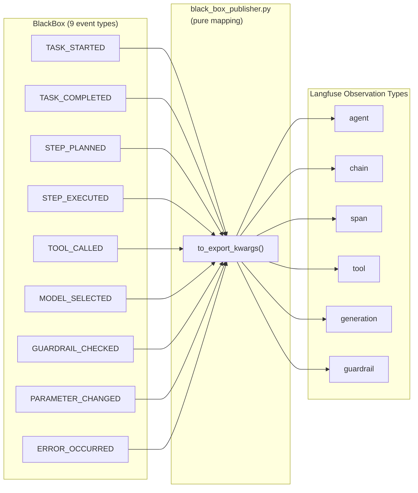
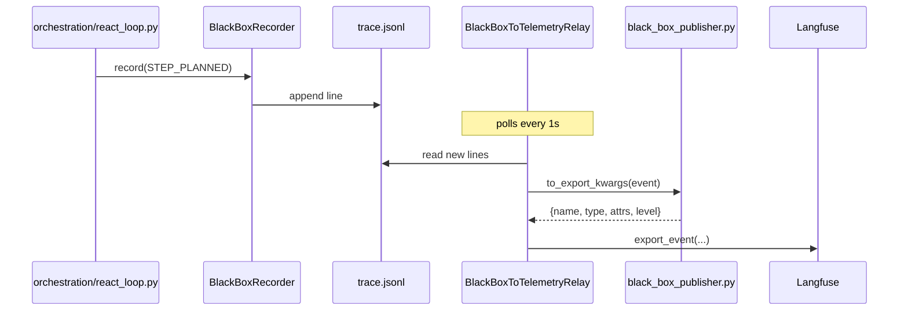

# Recipe 2 — Translating Nine Languages Into One Timeline

**Goal:** Map all 9 BlackBox event types to Langfuse observations with idempotent IDs and redacted details. Understand how PII and API keys are stripped before leaving the process.

**Status:** Complete (Sprint A + B) | 34 contract tests passing | ~$0/mo Langfuse incremental at dev tier

---

## Before We Start: A Story

You open Langfuse and click on trace `wf-a3f2b1c4`. You see a neat timeline: the LLM call that started the workflow, the tool invocations, the streamed response. But something is missing. You know the agent checked a guardrail before that tool call — the BlackBox JSONL says so. You know the router selected `gpt-4o-mini` instead of `gpt-4o` because the task was below the complexity threshold. The JSONL records all of it. Langfuse shows none of it.

The problem is not that the events are missing — they are being recorded. The problem is that each event "speaks a different language." Langfuse expects observations typed as `span`, `generation`, `tool`, or `agent`. The BlackBox uses its own vocabulary: `TASK_STARTED`, `GUARDRAIL_CHECKED`, `MODEL_SELECTED`. Someone needs to translate.

That translator is [`services/governance/black_box_publisher.py`](../../../services/governance/black_box_publisher.py) — a pure mapping module with zero SDK imports that sits in the services layer and converts every BlackBox event into Langfuse-ready keyword arguments.

---

## Prerequisites

- Recipe 1: [`01_outbox_relay.md`](01_outbox_relay.md) (the relay that calls this publisher)
- Familiarity with the 9 event types (see [Recipe 0](00_overview.md) event table)

---

## The Four Lessons

---

### Lesson 1 — The 9-to-9 Mapping

Every BlackBox event type maps to exactly one Langfuse observation type and name. The mapping is defined in a single dictionary at the top of [`services/governance/black_box_publisher.py`](../../../services/governance/black_box_publisher.py):

```python
# services/governance/black_box_publisher.py

_EVENT_TYPE_TO_OBSERVATION: dict[EventType, tuple[str, str]] = {
    EventType.TASK_STARTED:      ("agent",      "task.started"),
    EventType.TASK_COMPLETED:    ("agent",      "task.completed"),
    EventType.STEP_PLANNED:      ("chain",      "step.planned"),
    EventType.STEP_EXECUTED:     ("span",       "step.executed"),
    EventType.TOOL_CALLED:       ("tool",       "tool.called"),
    EventType.MODEL_SELECTED:    ("generation", "model.selected"),
    EventType.GUARDRAIL_CHECKED: ("guardrail",  "guardrail.checked"),
    EventType.PARAMETER_CHANGED: ("span",       "parameter.changed"),
    EventType.ERROR_OCCURRED:    ("span",       "error.occurred"),
}
```

Why these specific Langfuse types?

| BlackBox event | Langfuse type | Rationale |
|---|---|---|
| `TASK_STARTED` / `TASK_COMPLETED` | `agent` | These are the top-level lifecycle events; `agent` is Langfuse's root observation type |
| `STEP_PLANNED` | `chain` | A plan is a chain of reasoning steps |
| `STEP_EXECUTED` | `span` | Generic timed operation |
| `TOOL_CALLED` | `tool` | Direct match — Langfuse has a first-class tool type |
| `MODEL_SELECTED` | `generation` | Model selection is a generation-tier decision |
| `GUARDRAIL_CHECKED` | `guardrail` | Langfuse supports guardrail observations natively |
| `PARAMETER_CHANGED` | `span` | Configuration changes are timed operations |
| `ERROR_OCCURRED` | `span` + `level=ERROR` | Errors are spans with elevated severity |

The `to_export_kwargs` function converts a `TraceEvent` into everything the relay needs:

```python
# services/governance/black_box_publisher.py

def to_export_kwargs(event: TraceEvent) -> dict[str, Any]:
    obs_type, name = _EVENT_TYPE_TO_OBSERVATION[event.event_type]

    level = "ERROR" if event.event_type == EventType.ERROR_OCCURRED else "DEFAULT"

    attributes: dict[str, Any] = {
        "event_id": event.event_id,
        "workflow_id": event.workflow_id,
        "step": event.step,
        "timestamp": event.timestamp.isoformat(),
        "integrity_hash": event.integrity_hash,
        "details": redact_details(event.details),
    }

    return {
        "name": name,
        "observation_type": obs_type,
        "trace_id": event.workflow_id,
        "observation_id": event.event_id,
        "level": level,
        "attributes": attributes,
    }
```

Notice: `trace_id` equals `event.workflow_id` (design decision §2.2 from the [plan](../../plans/blackbox_to_langfuse.plan.md)). This is how BlackBox events land on the same Langfuse trace as the existing domain events.



**Checkpoint question:** A new event type `AGENT_DELEGATED` is added to the BlackBox in the future. What happens when the relay encounters it?

*Answer: `to_export_kwargs` does a dictionary lookup on `_EVENT_TYPE_TO_OBSERVATION[event.event_type]`. If the new event type is not in the dictionary, it raises a `KeyError`, which the relay catches, retries, and eventually sends to the DLQ. To support the new type, you add one line to the mapping dict and one test — nothing else changes.*

---

### Lesson 2 — Idempotency via `observation_id`

The relay delivers at-least-once. That means duplicate publishes are possible (crash after publish, before offset advance). Without idempotency, duplicates create duplicate observations in Langfuse — the timeline shows the same event twice.

The fix is simple: pass the `event_id` as the Langfuse observation `id`. Langfuse treats observations with the same `id` as upserts — the second publish overwrites the first with identical data, producing no visible duplicate.

```python
# From to_export_kwargs:
"observation_id": event.event_id,
```

The relay injects this into the exporter call via special attribute keys:

```python
# middleware/sidecars/black_box_to_telemetry.py

attrs["__bb_observation_id"] = kwargs["observation_id"]
attrs["__bb_observation_type"] = kwargs["observation_type"]
attrs["__bb_level"] = kwargs["level"]

self._exporter.export_event(
    name=kwargs["name"],
    trace_id=kwargs["trace_id"],
    attributes=attrs,
)
```

The `LangfuseCloudExporter` (in `middleware/adapters/observability/`) extracts these `__bb_*` keys from the attributes dict and passes them to the Langfuse SDK as `id`, `as_type`, and `level` parameters. The relay never imports the Langfuse SDK — it communicates through the `TelemetryExporter` port using the existing `attributes` dict as a hint channel.

> **Why pass observation hints through attributes instead of extending the port interface?** Extending `TelemetryExporter.export_event()` with `observation_id`, `observation_type`, and `level` parameters would have required modifying every implementation of the port (including mocks and test stubs). The attribute-hint approach is backward-compatible: exporters that do not understand `__bb_*` keys simply ignore them. The relay does not need to know which exporter implementation is behind the port.

**Checkpoint question:** The relay publishes event `evt-a1b2c3` successfully, then crashes before advancing the offset. On restart, it re-reads and re-publishes the same event. What happens in Langfuse?

*Answer: Nothing visible. Langfuse receives an observation with `id="evt-a1b2c3"` for the second time. Since the ID matches, it upserts — the existing observation is overwritten with identical data. The trace timeline shows exactly one event, not two.*

---

### Lesson 3 — Redaction: PII and API Keys Never Leave the Process

Before any event detail reaches Langfuse, it passes through `redact_details()`:

```python
# services/governance/black_box_publisher.py

_MAX_DETAIL_VALUE_LEN = 200

def redact_details(details: dict[str, Any]) -> dict[str, str]:
    result: dict[str, str] = {}
    for key, value in details.items():
        text = str(value)

        if len(text) > _MAX_DETAIL_VALUE_LEN:
            text = text[:_MAX_DETAIL_VALUE_LEN]

        for pattern, replacement in _REDACTION_PATTERNS:
            text = pattern.sub(replacement, text)

        result[key] = text
    return result
```

Processing order: **coerce → truncate → redact**. Truncation before redaction ensures that a long string ending with PII gets capped first (the PII may be cut off by truncation, which is acceptable — it is better to lose the tail than to leak secrets).

The redaction patterns are not hardcoded. They are compiled from the existing guardrail rule factories in `services/governance/guardrail_validator.py`:

```python
# services/governance/black_box_publisher.py

_REDACTION_PATTERNS: list[tuple[re.Pattern[str], str]] = []

for _rule in pii_rules() + api_key_rules():
    _REDACTION_PATTERNS.append(
        (re.compile(_rule.pattern, _rule.flags), _rule.match_redaction)
    )
```

This means:
- Email addresses → `[EMAIL_REDACTED]`
- US Social Security Numbers → `[SSN_REDACTED]`
- US phone numbers → `[PHONE_REDACTED]`
- OpenAI API keys (`sk-...`) → `[API_KEY_REDACTED]`
- AWS access keys (`AKIA...`) → `[API_KEY_REDACTED]`
- GitHub tokens (`ghp_...`, `gho_...`) → `[API_KEY_REDACTED]`

If a new PII pattern is added to the guardrail rules, the publisher inherits it automatically — no code change in the publisher needed.

> **Why reuse guardrail patterns instead of defining publisher-specific regexes?** Single source of truth. If the PII detection logic improves (or a new API key format is added), the improvement applies to both runtime guardrails and telemetry redaction. Defining separate patterns would create a maintenance burden and a risk of divergence — the exact dual-write problem, but for regex patterns.

**Checkpoint question:** An event detail contains `{"api_key": "sk-proj-abc123def456", "user_email": "alice@example.com", "query": "What is 2+2?"}`. What does `redact_details` return?

*Answer: `{"api_key": "[API_KEY_REDACTED]", "user_email": "[EMAIL_REDACTED]", "query": "What is 2+2?"}`. The API key and email are redacted using the guardrail patterns. The innocuous query string passes through unchanged. All values are coerced to strings and capped at 200 characters.*

---

### Lesson 4 — Wiring the Missing Event Producers

Sprint A built the publisher. Sprint B wired the 4 missing event emissions in [`orchestration/react_loop.py`](../../../orchestration/react_loop.py). Before Sprint B, only 5 of the 9 event types were actually emitted by the orchestration layer:

| Event type | Before Sprint B | After Sprint B |
|---|---|---|
| `TASK_STARTED` | Emitted | Emitted |
| `GUARDRAIL_CHECKED` | Emitted | Emitted |
| `MODEL_SELECTED` | Emitted | Emitted |
| `STEP_EXECUTED` | Emitted | Emitted |
| `TOOL_CALLED` | Emitted | Emitted |
| `STEP_PLANNED` | **Missing** | Emitted — plan/planning node |
| `PARAMETER_CHANGED` | **Missing** | Emitted — router rollback, model tier override |
| `ERROR_OCCURRED` | **Missing** | Emitted — tool exception handler, LLM error branch |
| `TASK_COMPLETED` | **Missing** | Emitted — terminal edge before END |

The emissions follow the existing pattern — the orchestration nodes call `recorder.record(event)` with a `TraceEvent` populated from the current state. The recorder appends to JSONL. The relay tails and publishes. No new wiring needed between layers.



**Checkpoint question:** `TASK_COMPLETED` is emitted at the terminal edge before `END`. Why is it important that this event includes the `outcome` (success/failure) in its `details`?

*Answer: The relay triggers compliance bundle publishing when it sees `TASK_COMPLETED` (Recipe 3). The outcome in `details` determines whether the bundle goes to the `agent-compliance-audit` dataset (success + valid chain) or the `agent-incident-replay` dataset (failure or broken chain). Without the outcome, the relay cannot route the bundle correctly.*

---

## Architecture Invariant: Zero SDK Imports in the Publisher

The publisher is in the `services/` layer. Per the four-layer architecture, services must not import framework SDKs. This is enforced by AST-based tests:

```python
# tests/services/governance/test_black_box_publisher.py (excerpt)

def test_no_langfuse_imports():
    tree = ast.parse(PUBLISHER_SOURCE)
    for node in ast.walk(tree):
        if isinstance(node, ast.ImportFrom) and node.module:
            assert not node.module.startswith("langfuse")

def test_no_langgraph_imports():
    tree = ast.parse(PUBLISHER_SOURCE)
    for node in ast.walk(tree):
        if isinstance(node, ast.ImportFrom) and node.module:
            assert not node.module.startswith("langgraph")
            assert not node.module.startswith("langchain")
```

The publisher imports only from `services.governance.black_box` (for `EventType` and `TraceEvent`) and `services.governance.guardrail_validator` (for redaction patterns). It has no knowledge of Langfuse, LangGraph, or any other framework.

---

## Run It Yourself

Verify the publisher tests (Sprint A):

```bash
pytest tests/services/governance/test_black_box_publisher.py -v
# Expected: 34 passed
```

Verify architecture layer boundaries:

```bash
pytest tests/architecture/ -q
```

---

## Agent Steps (What Was Done)

| File created | Purpose | Sprint |
|---|---|---|
| [`services/governance/black_box_publisher.py`](../../../services/governance/black_box_publisher.py) | Pure mapping + redaction, zero SDK imports | A |

| File modified | Change | Sprint |
|---|---|---|
| [`orchestration/react_loop.py`](../../../orchestration/react_loop.py) | Added 4 missing event emissions (STEP_PLANNED, PARAMETER_CHANGED, ERROR_OCCURRED, TASK_COMPLETED) | B |

| Test file | Coverage |
|---|---|
| [`tests/services/governance/test_black_box_publisher.py`](../../../tests/services/governance/test_black_box_publisher.py) | 34 tests — all 9 event types map correctly; PII/API key redaction; truncation; architecture invariants |

---

## What Comes Next

Events are now mapped, redacted, and published to Langfuse. But what about the *audit trail*? When a workflow completes, how do you bundle the entire recording into a single, integrity-verified dataset item that an auditor can review?

Continue to [`03_compliance_dataset.md`](03_compliance_dataset.md) — *Turning Every Failed Workflow Into a Lesson Plan*.
