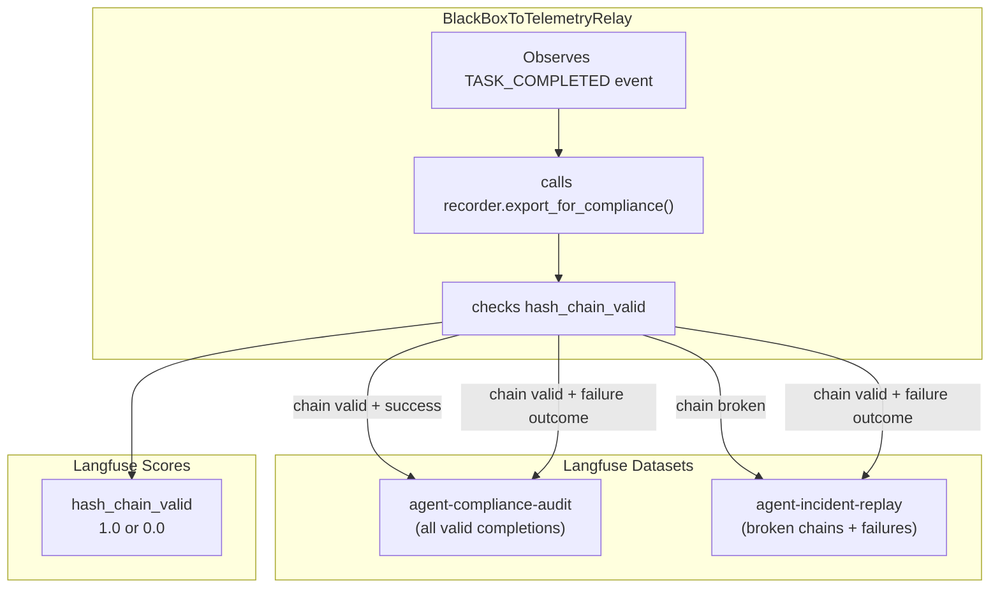

# Recipe 3 — Turning Every Failed Workflow Into a Lesson Plan

**Goal:** Publish the compliance bundle from every completed workflow as a Langfuse dataset item. Valid chains go to `agent-compliance-audit`; failures go to `agent-incident-replay`. Attach the integrity hash chain as a Langfuse score.

**Status:** Complete (Sprint E) | 18 contract tests passing | ~$0/mo Langfuse incremental at dev tier

---

## Before We Start: A Story

It is audit season. A compliance officer sends you a spreadsheet: "Please provide evidence of every decision made by the agent during the week of May 12th. We need: the full event timeline, proof of integrity (was the recording tampered with?), and the outcome of each workflow."

You have two options:

**Option A (before this recipe):** SSH into the server, navigate to `cache/black_box_recordings/`, find the workflow directories from that week, run `recorder.export(workflow_id)` for each one, verify each hash chain manually, collect the JSON bundles, zip them, and email the zip file. Time: 2 hours. Confidence: moderate (you might miss a workflow, and the auditor has to trust your manual process).

**Option B (after this recipe):** Send the auditor a Langfuse URL. Point them to the `agent-compliance-audit` dataset. Every completed workflow from that week is already there — uploaded automatically when the workflow ended, with the hash chain verified and the integrity score attached. Failed workflows are also in `agent-incident-replay`, pre-sorted for root cause analysis. Time: 30 seconds. Confidence: cryptographic.

This recipe builds Option B.

---

## Prerequisites

- Recipe 1: [`01_outbox_relay.md`](01_outbox_relay.md) (the relay that triggers compliance publishing)
- Recipe 2: [`02_event_mapping.md`](02_event_mapping.md) (the event mapping and redaction)
- Understanding of `export_for_compliance()` in [`services/governance/black_box.py`](../../../services/governance/black_box.py)

---

## The Three Lessons

---

### Lesson 1 — Why Langfuse Datasets (Not Trace Metadata)

Langfuse offers two ways to attach structured data to a trace: **metadata** (a JSON dict on the trace object) and **dataset items** (structured records in a named dataset, linked to traces). Why use datasets for compliance bundles?

| Concern | Trace metadata | Dataset item |
|---|---|---|
| **Size limit** | ~64 KB per trace | No practical limit per item |
| **Searchability** | Not indexed; requires full trace scan | Indexed by dataset name, filterable |
| **Auditability** | Attached to a trace that may be deleted by retention policy | Datasets have independent retention |
| **Replayability** | Cannot be used as eval inputs | Dataset items are first-class eval inputs |
| **Bulk export** | Manual per-trace extraction | `GET /datasets/{name}/items` API |

A compliance bundle from `export_for_compliance()` can be 50–200 KB depending on the event count. It contains the full event list, hash chain verification, identity cards, phase decisions, and audit trails. Trace metadata would truncate this. Dataset items preserve it intact.

More importantly, Langfuse dataset items can be used as **eval inputs**. When a workflow fails, the incident bundle in `agent-incident-replay` becomes a regression test case — you can replay it through updated agent code and verify the failure no longer occurs. Trace metadata cannot do this.



> **Why not write compliance bundles to GCS or S3 instead?** You could — and at enterprise scale you probably will. But Langfuse datasets integrate with the existing observability workflow: the auditor is already looking at Langfuse traces, the eval framework already reads from Langfuse datasets, and the integrity score is visible on the same trace timeline. A separate storage system adds a context-switch cost for every investigation.

**Checkpoint question:** A workflow completes with `outcome: "success"` and a valid hash chain. Which dataset(s) does the bundle land in?

*Answer: Only `agent-compliance-audit`. The `agent-incident-replay` dataset receives bundles where either the hash chain is broken OR the outcome is "failure". A successful workflow with a valid chain is audit evidence, not an incident.*

---

### Lesson 2 — The Integrity Chain as a Langfuse Score

Every compliance bundle includes a `hash_chain_valid` boolean from `export_for_compliance()`. The relay attaches this as a Langfuse **score** on the trace:

```python
# middleware/sidecars/black_box_to_telemetry.py

def _publish_compliance_bundle(self, workflow_id, task_details):
    # ... export bundle ...

    chain_valid = bundle.get("hash_chain_valid", False)

    self._compliance_publisher.score_trace(
        trace_id=workflow_id,
        name="hash_chain_valid",
        value=1.0 if chain_valid else 0.0,
        comment=None if chain_valid else "Integrity hash chain broken or invalid",
    )
```

Why a numeric score instead of a boolean metadata field?

1. **Langfuse scores are first-class citizens.** They appear in the trace detail view, can be filtered in the dashboard, and aggregate across traces in the analytics view. A metadata field is invisible unless you open the trace.

2. **Scores aggregate.** You can answer "what percentage of workflows last week had intact hash chains?" with a single Langfuse dashboard query. Metadata requires custom scripting.

3. **Scores trigger alerts.** Langfuse webhooks can fire when a score drops below a threshold. A sudden drop in `hash_chain_valid` across workflows signals a systemic integrity issue.

The score is attached via the `CompliancePublisher` port at [`middleware/ports/compliance_publisher.py`](../../../middleware/ports/compliance_publisher.py):

```python
# middleware/ports/compliance_publisher.py

@runtime_checkable
class CompliancePublisher(Protocol):
    def create_dataset_item(
        self,
        *,
        dataset_name: str,
        input_data: dict[str, Any],
        item_id: str | None = None,
        metadata: dict[str, Any] | None = None,
    ) -> None: ...

    def score_trace(
        self,
        *,
        trace_id: str,
        name: str,
        value: float,
        comment: str | None = None,
    ) -> None: ...
```

This is a **port** — a Python `Protocol` with zero SDK imports. The concrete implementation lives in `LangfuseCloudExporter` (middleware adapters layer), which calls the Langfuse SDK's `create_dataset_item` and `score` methods. The relay never touches the SDK directly.

**Checkpoint question:** A workflow's hash chain is broken at event 42 out of 83 events. The `score_trace` call attaches `hash_chain_valid: 0.0`. What additional information does the compliance bundle contain that helps locate the break?

*Answer: The bundle from `export_for_compliance()` includes `broken_at_event_id` (the event ID where the chain first broke), `broken_expected_hash` (the hash the chain expected), and `broken_actual_hash` (the hash that was found). The auditor can pinpoint exactly which event was tampered with without re-verifying the entire chain.*

---

### Lesson 3 — Replaying Failed Workflows for Evals

The `agent-incident-replay` dataset is not just an audit trail — it is a regression testing dataset. Every failed workflow becomes an eval input that you can replay through updated agent code:

```
agent-incident-replay dataset:
├── wf-c9a2f1d3  (failure: guardrail rejected output)
│   └── bundle: 47 events, chain valid, outcome="failure"
├── wf-7b4e9f2a  (failure: tool timeout after 3 retries)
│   └── bundle: 83 events, chain valid, outcome="failure"
└── wf-1d6c8a3e  (integrity: hash chain broken at event 12)
    └── bundle: 29 events, chain broken, outcome="success"
```

Each bundle contains the complete event sequence, including the original task input (in the `TASK_STARTED` event details), the model selections, the tool calls, and the error details. An eval pipeline can:

1. Extract the original task input from the `TASK_STARTED` event.
2. Replay the task through the current agent code.
3. Compare the new outcome against the original failure.
4. Score the improvement using Langfuse's eval framework.

This is the flight recorder analogy in action: aviation does not just investigate crashes — it uses the recorder data to train simulators that prevent future crashes. Your `agent-incident-replay` dataset is the training data for your agent's improvement loop.

The relay routes bundles to datasets using this logic:

```python
# middleware/sidecars/black_box_to_telemetry.py

DATASET_AUDIT = "agent-compliance-audit"
DATASET_INCIDENT = "agent-incident-replay"

# After exporting the compliance bundle:
self._compliance_publisher.create_dataset_item(
    dataset_name=self.DATASET_AUDIT if chain_valid else self.DATASET_INCIDENT,
    input_data=bundle,
    item_id=workflow_id,
    metadata={"workflow_id": workflow_id, "chain_valid": chain_valid},
)

# Failures with valid chains go to BOTH datasets
if chain_valid and outcome == "failure":
    self._compliance_publisher.create_dataset_item(
        dataset_name=self.DATASET_INCIDENT,
        input_data=bundle,
        item_id=f"{workflow_id}-incident",
        metadata={"workflow_id": workflow_id, "reason": "task_failure"},
    )
```

The routing matrix:

| Hash chain | Outcome | `agent-compliance-audit` | `agent-incident-replay` |
|---|---|---|---|
| Valid | Success | Yes | No |
| Valid | Failure | Yes | Yes |
| Broken | Success | No | Yes |
| Broken | Failure | No | Yes |

Idempotency is enforced per-session: the relay tracks which `workflow_id` values it has already published compliance bundles for, and skips duplicates. This prevents the same bundle from being published twice if the relay processes the `TASK_COMPLETED` event again after a restart.

```python
if workflow_id in self._published_compliance:
    return
self._published_compliance.add(workflow_id)
```

> **Why not publish the compliance bundle immediately when `export_for_compliance()` is called, instead of waiting for the relay?** Because `export_for_compliance()` lives in the `services/` layer, which must not import Langfuse. The relay is in the `middleware/` layer, which can use the `CompliancePublisher` port. Publishing from the services layer would violate the architecture's layering rules. The relay is the natural composition point — it already watches for `TASK_COMPLETED` events and has access to the exporter.

**Checkpoint question:** A workflow fails with `outcome: "failure"` but has a valid hash chain. How many dataset items does the relay create?

*Answer: Two. One in `agent-compliance-audit` (because the chain is valid — this is legitimate audit evidence of a failure) and one in `agent-incident-replay` (because the outcome is "failure" — this is a regression test candidate). The item IDs differ: `workflow_id` for the audit item and `workflow_id-incident` for the incident item.*

---

## Failure Resilience: Rule O1

All compliance publishing calls are wrapped in `try/except` blocks that swallow failures:

```python
try:
    self._compliance_publisher.score_trace(...)
except Exception as exc:
    logger.warning("Failed to score trace %s: %s", workflow_id, exc)

try:
    self._compliance_publisher.create_dataset_item(...)
except Exception as exc:
    logger.warning("Failed to publish compliance dataset item for %s: %s", ...)
```

This follows **Rule O1: telemetry never blocks.** A Langfuse API failure must never prevent the relay from processing subsequent events. The compliance bundle is a best-effort enhancement on top of the durable JSONL recording. The JSONL file on disk is always the authoritative record.

---

## Run It Yourself

Verify the compliance dataset tests (Sprint E):

```bash
pytest tests/middleware/sidecars/test_compliance_dataset.py -v
# Expected: 18 passed
```

Verify the full relay + compliance pipeline:

```bash
pytest tests/middleware/sidecars/test_black_box_to_telemetry.py \
       tests/middleware/sidecars/test_compliance_dataset.py \
       -v
# Expected: 42 passed
```

Verify architecture layer boundaries:

```bash
pytest tests/architecture/ -q
```

---

## Agent Steps (What Was Done)

| File created | Purpose | Sprint |
|---|---|---|
| [`middleware/ports/compliance_publisher.py`](../../../middleware/ports/compliance_publisher.py) | `CompliancePublisher` protocol with `create_dataset_item()` and `score_trace()` | E |

| File modified | Change | Sprint |
|---|---|---|
| [`middleware/adapters/observability/langfuse_cloud_exporter.py`](../../../middleware/adapters/observability/langfuse_cloud_exporter.py) | Implements `CompliancePublisher` protocol | E |
| [`middleware/sidecars/black_box_to_telemetry.py`](../../../middleware/sidecars/black_box_to_telemetry.py) | Added `_publish_compliance_bundle()` triggered on `TASK_COMPLETED` | E |
| [`middleware/composition.py`](../../../middleware/composition.py) | Passes `compliance_publisher` to relay via runtime `isinstance` check | E |

| Test file | Coverage |
|---|---|
| [`tests/middleware/sidecars/test_compliance_dataset.py`](../../../tests/middleware/sidecars/test_compliance_dataset.py) | 18 tests — routing matrix, score attachment, deduplication, failure resilience, architecture invariants |

---

## Series Summary

You have now seen the complete BlackBox → Langfuse pipeline:

1. **Recipe 1** — The outbox relay tails the JSONL file and publishes events with at-least-once delivery.
2. **Recipe 2** — The publisher maps 9 event types to Langfuse observations with idempotent IDs and redacted details.
3. **Recipe 3** — The compliance publisher turns every completed workflow into an audit-grade dataset item with integrity scoring.

The JSONL file on disk remains the single source of truth. Langfuse is a projection — a searchable, visual, auditable projection that makes the flight recorder visible to your team, your auditors, and your eval pipelines.

---

## Cost Note

All three recipes cost **$0.00** at the Langfuse free tier (50K observations/month, 1 GB dataset storage). At dev-tier volume (<100 workflows/day, ~10 events/workflow), you will use approximately 3% of the free tier. The relay adds negligible CPU overhead (one asyncio task polling at 1-second intervals).

---

## Further Reading

- [`docs/plans/blackbox_to_langfuse.plan.md`](../../plans/blackbox_to_langfuse.plan.md) — the full implementation plan with design decisions and trade-offs
- [`governanaceTriangle/02_black_box_recording_debugging.md`](../../../governanaceTriangle/02_black_box_recording_debugging.md) — the BlackBoxRecorder tutorial with the aviation analogy in full depth
- [`docs/recipes/gcp/07_observability.md`](../gcp/07_observability.md) — the GCP observability recipe (related telemetry patterns)
- [Langfuse Datasets documentation](https://langfuse.com/docs/datasets) — how to use dataset items for evals
- [AWS Transactional Outbox pattern](https://docs.aws.amazon.com/prescriptive-guidance/latest/cloud-design-patterns/transactional-outbox.html) — the pattern that underpins Recipe 1
