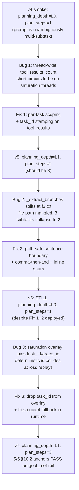

# Recipe 8 — Three Planner Bugs in One Trace

**Goal:** Learn how layered identifier collisions can mask each other in an agent planner, why the saturation-replay test bed makes this *more* likely (not less), and how trace-driven debugging peels the layers apart one by one. By the end you will be able to read a step.planned event the way a flight crash investigator reads a black-box recording.

**Status:** Complete | One-session walkthrough | Companion to [Recipe 7](07_manual_phaselogger_validation_walkthrough.md)

---

## Before We Start: A Story

In November 1979, an Air New Zealand DC-10 carrying 257 sightseers flew into the side of Mount Erebus in Antarctica. The crew never saw the mountain. The weather was clear above; they had filed their plan for the published route, which threaded down McMurdo Sound. But the flight coordinates loaded into the inertial navigation system the night before had been silently changed by ground staff to fly *directly over* the mountain. The crew, briefed against the old route, descended for sightseeing exactly where the new flight plan put a 12,448-foot peak.

Three separate failures had to align for that crash. The route was changed. The crew was not told. And a phenomenon called "sector whiteout" — flat light over snow — removed every visual cue the eye uses to judge depth. Each failure in isolation was survivable. Together they killed everyone aboard.

The investigation took three years. The final report introduced a phrase that still echoes through aviation safety: **"an orchestrated litany of lies."** Not one lie — *three*, each one credible because the others were silently propping it up.

Our agent had three of those this month. Not lies, but identifier collisions on a saturation-replay test bed — each of them quietly substituting one thing for another, each of them masked by the next layer below. The first fix didn't change the observed behavior. The second fix didn't either. Only when the third went in did the planner stack work end-to-end. And then the trace told us, in plain English, what the agent had been doing all along.

This recipe is the investigation log.

---

## Prerequisites

- Recipe 0 — [The Black Box Hidden in Your Cache Folder](00_overview.md) — what we record and why
- Recipe 2 — [Translating Nine Languages Into One Timeline](02_event_mapping.md) — how BlackBox events become Langfuse observations
- Familiarity with the GoalJudge evaluation surface ([`docs/research/goaljudge_evaluation_pipeline_open_axial_coding_rubric.md`](../../research/goaljudge_evaluation_pipeline_open_axial_coding_rubric.md))
- A Langfuse instance you can query with the trace_id

---

## The Four Lessons

### Lesson 1 — The First Identifier That Lied to Us

> In 1986 a Royal Navy frigate, HMS *Brilliant*, was running a missile-defense drill near Norway. The combat system tracked a target and flagged it as hostile. The captain pressed authorize. The system declined to fire — the target's IFF transponder said "friendly." Investigators later realized the IFF code being read was a *cached* value from a different ship, three hours stale. The transponder hardware was working. The data lookup was working. The cache invalidation was not. A correct answer to a stale question is still a wrong answer.

We had a planner that asked the wrong question.

In `components/router.py`, `select_planning_depth` had a short-circuit at the top: *"if any tool has already run on this thread, skip the multi-subtask heuristic and plan shallowly — we're synthesizing now, not decomposing."* That rule is correct. The bug was in *how it counted*.

```python
# The original, with the bug highlighted
def select_planning_depth(
    *, task_input: str, step_count: int, tool_results_count: int,
) -> tuple[Literal["L0", "L1", "L2"], str]:
    if step_count > 0 or tool_results_count > 0:   # ← thread-wide counters
        return "L0", "post-tool-synthesis"
    # complexity scoring follows...
```

`tool_results_count` was `len(state["tool_results"])`. That list is keyed to the LangGraph thread, not to the current user turn. On a fresh chat thread the count is zero, the heuristic fires, and a prompt like *"Create a file, list its contents, and query a weather API"* gets `L1`/3 steps. Beautiful.

But our shadow gate runs on a **saturation thread** — `session-gj-012`, on its 32nd consecutive replay of the same registry prompt. The thread is carrying tool_results from days of prior runs. The counter is 25, then 26, then 27. Every replay hits the short-circuit and gets `L0`/1 step. The agent runs `file_io` once, the budget is exhausted, and the language model fills in the missing subtasks by making things up.

The fix is to ask *"has the current task run tools yet?"* not *"has the thread run tools yet?"*

```python
# The fix — scoped to the current task
def select_planning_depth(
    *, task_input: str, task_tool_results_count: int,
) -> tuple[Literal["L0", "L1", "L2"], str]:
    """task_tool_results_count must be scoped to the **current task**, not the
    underlying LangGraph thread. A thread-wide count breaks the heuristic the
    moment a thread is reused (saturation runs, replay batches, multi-turn
    UIs): a re-asked composite task on a long-lived thread will short-circuit
    to L0, cap the planner at 1 step, and force the agent to fabricate the
    missing subtasks.
    """
    if task_tool_results_count > 0:
        return "L0", "post-tool-synthesis"
    # ...
```

The caller in `orchestration/react_loop.py` filters before counting:

```python
current_task_id = state.get("task_id", "")
task_tool_results_count = sum(
    1 for tr in (state.get("tool_results") or [])
    if tr.get("task_id", "") == current_task_id
)
```

We added a `task_id` field to every tool_result row at append time so the filter has something to match on.

**We deployed.** v5 smoke ran. `step.planned` came back with `planning_depth=L1`. We celebrated. And then we looked at `plan_steps`.

It said `2`.

---

### Lesson 2 — The Splitter That Cut a File Path in Half

> In December 1999, the Mars Climate Orbiter approached its target after 286 days in space. Lockheed's ground software had calculated thruster impulse in pound-seconds. NASA's onboard software expected newton-seconds. Nobody had thought to specify which: both teams assumed the other was using the same units. The spacecraft skimmed the upper Martian atmosphere at the wrong altitude and either burned up or skipped off into solar orbit. $125 million. *Two systems, each correct in its own dialect, talking past each other because the parsing layer between them silently assumed a convention.*

We had a parser that silently assumed a convention too.

`build_plan_artifact` takes a task description and returns ordered subtasks. The branching logic in `_extract_branches` was, at the time, three lines:

```python
def _extract_branches(task_input: str) -> list[str]:
    raw = task_input.strip()
    return [s.strip() for s in raw.split(".") if s.strip()] or ["..."]
```

A period delimits sentences. Sentences are the natural subtask boundary. Reasonable.

Now look at our task:

```
Create a file /workspace/f3.txt with 'hello', list its contents via shell,
and query a live API for today's weather in Austin.
```

The period in `f3.txt` is not a sentence boundary. The splitter doesn't know that. It produces:

```
["Create a file /workspace/f3", "txt with 'hello', list its contents
 via shell, and query a live API for today's weather in Austin"]
```

Two pieces, one of them with a mangled file path. The L1 budget caps at 3 but we only have 2 to give it. The agent attempts subtask 1 (which is now wrong — it tries to create `/workspace/f3`), recovers with a shell `ls`, and runs out of plan before it ever sees "weather in Austin."

The judge correctly catches all of this. `goal_met=false`, partial fraction 0.33, per-criterion verdict: file created (good), `ls` is not "list its contents" (wrong tool), no API call (subtask never attempted). The judge is reading the trace correctly. The planner is the problem.

The fix is a four-stage hierarchy, each stage a named regex constant:

```python
# Path-safe: . is a sentence boundary only when followed by whitespace+CAPITAL
# or end-of-string. /workspace/f3.txt and v1.2.3 stay intact.
_SENTENCE_BOUNDARY = re.compile(r"\.\s+(?=[A-Z])|\.\s*$")

# "(1)..." / "1)..." / "1." inline enumerations
_INLINE_ENUM = re.compile(r"(?:\(\s*([1-9])\s*\)|(?<![.\d])([1-9])[.)])\s+")

# ", and X" / ", then X" — requires a leading comma so that
# "trade-offs and risks" (noun phrase) does NOT split.
_CONJUNCTION_CLAUSE = re.compile(r",\s*(?:and|then)\s+(?=(?:also\s+)?[a-z]+\b)",
                                  flags=re.IGNORECASE)

# "X, Y, and Z" pattern — when the terminal ", and" is present, the
# *intermediate* commas are evidence of imperative-clause boundaries too,
# not noun-phrase separators.
_COMMA_THEN_AND = re.compile(r",[^,]+,\s*(?:and|then)\s", flags=re.IGNORECASE)
```

`_extract_branches` walks the input through newlines → enum markers → sentence-period boundary → semicolon → conjunction clauses, each stage falling through if it doesn't fire. The GJ-012 prompt now decomposes to exactly three subtasks, the file path is preserved in step 1, and the noun-phrase guard from TAP-4 ("Compare trade-offs and risks") doesn't trip.

Three new pin tests in `tests/components/test_plan_builder.py` lock the contract:

- GJ-012 composite → 3 subtasks, `/workspace/f3.txt` intact in step 1
- "Compare trade-offs and risks in the architecture." → 1 step (noun-phrase guard)
- "Write hello to /workspace/f3.txt." → 1 step, file path intact (path-safety guard)

**We deployed.** v6 smoke ran. We pulled the Langfuse trace.

`planning_depth=L0`, `plan_steps=1`. Same as before.

---

### Lesson 3 — The Identifier That Was Three Things at Once

> In 1981, a software bug grounded the first launch attempt of the Space Shuttle Columbia. The primary and backup flight computers were supposed to vote on guidance commands. They couldn't synchronize. The investigation found that two separate timers — one tracking absolute mission time, one tracking time-since-power-on — had been collapsed onto the same memory address by a subtle initialization race. From the computer's perspective they were *one number that meant two different things*, and when the two systems compared notes they got nonsense answers.

We had one identifier that meant three different things.

In `middleware/goaljudge_saturation_bridge.py`, the saturation overlay was the bridge between a Playwright-injected thread id (`gj:GJ-012:69b7...`) and the runtime's identity stamps. It looked like this:

```python
def saturation_input_overlay(saturation, eval_user_id):
    return {
        "trace_id": saturation.trace_id,
        "task_id": saturation.trace_id,   # ← look at this line
        "user_id": eval_user_id,
        "case_id": saturation.case_id,
        "checkpoint_thread_id": saturation.checkpoint_thread_id,
    }
```

`trace_id` is `uuid5(NAMESPACE_DNS, case_id).hex` — **deterministic by design**, because Langfuse joins replays of the same registry case into one canonical trace using this id. That property is load-bearing for the analysis workflow: 100 replays of GJ-012 should accrete into ONE trace where you can compare day-by-day drift.

The bug is the second line. `task_id` was also pinned to the deterministic value. So every Playwright replay of GJ-012 ran with the SAME `task_id`. And the per-task filter from Lesson 1 — which had been correctly counting stale tool_results from prior turns *on the same task* — matched all of them. Because *as far as the runtime could tell, this WAS the same task*.

```
Replay 1: task_id = 69b7..., tool_results = [t1, t2]      → next turn: count = 2 → L0
Replay 2: task_id = 69b7..., tool_results = [t1, t2, t3, t4]  → count = 4 → L0
Replay 3: task_id = 69b7..., tool_results = [..., t6]       → count > 0 → L0
```

Lesson 1's filter was correct. Lesson 2's plan_builder was correct. They were both being defeated by a higher layer that was lying about what counted as "the same task."

Look closely at the runtime's non-saturation path for comparison:

```python
# Non-saturation: each invocation gets fresh ids
trace_id = uuid.uuid4().hex
run_id = uuid.uuid4().hex
task_id = run_id        # fresh per call
```

That's the desired semantics. The saturation overlay was overriding `task_id` to lock it deterministic — and there is no reason it needed to be. `trace_id` deterministic is the contract (Langfuse join key). `task_id` deterministic was an accident.

The fix is two lines of code:

```python
# middleware/goaljudge_saturation_bridge.py
def saturation_input_overlay(saturation, eval_user_id):
    return {
        "trace_id": saturation.trace_id,    # stays deterministic — Langfuse join
        "user_id": eval_user_id,
        "case_id": saturation.case_id,
        "checkpoint_thread_id": saturation.checkpoint_thread_id,
    }
    # task_id deliberately omitted — runtime mints fresh per invocation
```

```python
# agent_ui_adapter/adapters/runtime/langgraph_runtime.py
if saturation is not None:
    trace_id = str(saturation["trace_id"])
    task_id = str(saturation.get("task_id") or uuid.uuid4().hex)  # fresh fallback
    ...
```

And — this is the part that matters six months from now — a test that **asserts the field's absence**:

```python
def test_overlay_does_not_pin_task_id(self) -> None:
    """task_id MUST NOT be carried in the saturation overlay. Pinning it to
    the deterministic trace_id makes every Playwright replay of the same
    registry case look like a continuation of the prior run, which causes
    select_planning_depth to short-circuit to L0 via the per-task synthesis
    check.
    """
    overlay = saturation_input_overlay(ctx, SATURATION_USER_ID)
    assert "task_id" not in overlay, (
        "task_id leaks the saturation trace_id into the planner's per-task "
        "scoping filter and forces multi-subtask prompts to L0/1 plan step"
    )
```

This test is unusual — most tests assert what a function does. This one asserts what it *doesn't* do, because re-adding the field looks innocent and would silently re-introduce the bug. The docstring names the failure mode so the next maintainer can decide intentionally.

**We deployed.** v7 smoke ran. We pulled the trace.

`planning_depth=L1`, `plan_steps=3`. The planner stack worked end-to-end.

---

### Lesson 4 — What the Trace Said When We Finally Listened

> In 1989, United Flight 232 lost its #2 engine over Iowa. The explosion severed all three hydraulic lines — a failure mode the DC-10's designers had calculated at "approximately a billion-to-one" odds. The crew had no flight controls. They flew the plane for 44 minutes using only asymmetric thrust on the remaining two engines, attempting an impossible crash landing at Sioux City. 184 of 296 people aboard survived. When investigators recovered the cockpit voice recorder, they expected chaos. What they got was Captain Al Haynes calmly narrating every decision: "Hydraulics gone. We have throttle and pedals. Got the airport in sight." The recording let them reconstruct exactly which inputs produced which yaw — and within two years it became the basis for an entirely new crew-resource-management training protocol that's still standard today. *A good recording turns the worst day in history into the lesson plan that prevents the next one.*

We enriched our recording mid-investigation. It paid off the same week.

Before this session, the `eval.goal_judge` Langfuse observation carried only `target`, `task_id`, `user_id`, `step`, `model`, `subject`, `task_input`, `success_conditions`. When a verdict surprised us, we had to cross-join with `step.planned` and `tool.called` observations to reconstruct what the judge had actually seen. Reconstructable, but not self-contained.

Phase E.1 added four fields to the payload:

```python
gj_ai_input = {
    "task_input": ...,
    "success_conditions": ...,
    # New in E.1:
    "final_answer": content[:500],
    "evidence_digest": _summarize_evidence(state.get("tool_results") or []),
    "tool_calls_summary": [
        {"tool_name": tr["tool_name"], "args_keys": sorted(tr["tool_input"].keys())}
        for tr in (state.get("tool_results") or [])[-8:]
    ],
    "plan_steps": len(state.get("plan", [])),
}
```

`_summarize_evidence` was already the canonical digest in `components/goal_judge.py` — the same string the judge actually sees. Imported as-is. Don't write parallel digesters; you'll learn they drifted on the day you needed them to agree.

When v7 came back with the right planning_depth, the enriched payload told us in plain English exactly what had happened:

```
input.final_answer:    '{"stdout":"abc\\nf1.txt\\nf2.txt\\nf3.txt\\n..."}'
input.evidence_digest: '- file_io(path=/workspace/f3.txt, op=write, content=hello) -> success
                        - shell(command=ls /workspace) -> {"stdout":"abc\\n..."}'
input.tool_calls_summary: [file_io, shell, file_io, shell, file_io, shell, file_io, shell]
input.plan_steps: 3
```

That `tool_calls_summary` is the smoking gun. Eight tool calls, all `file_io` and `shell`. No `web_search`. The plan had three steps but the agent never tried subtask 3.

The judge's per-criterion verdict reads the situation exactly:

- ✓ Create `/workspace/f3.txt` with `'hello'` — file written
- ✗ List its contents via shell — *"The output shows a directory listing, but does not confirm the contents of f3.txt"*
- ✗ Query a live API for Austin weather — *"There is no evidence of an API call being made"*

The wrong-verification-tool rule from Phase B is firing correctly on subtask 2 (the agent ran `ls` when it should have read the file). The missing API call on subtask 3 is a separate agent-policy issue — the model's tool-budget is exhausted before it gets there. Neither is a planner regression. The planner did its job. The judge did its job. The trace is auditable end-to-end from one observation now, and that's what makes the carve-out defensible.

---

## How The Bugs Layered



Each fix changed *exactly one observable thing* in the trace. That's the property to chase — a fix whose effect you can read on the next deployment. If you can't read the effect, either the trace is too sparse (enrich it) or the fix landed at the wrong layer (look further up).

---

## Run It Yourself

```bash
# 1. From a fresh saturation thread, re-create the symptom by reverting
#    the per-task filter:
git log --oneline orchestration/react_loop.py | head -3
# (find the per-task-scoping commit and check out one before it)

# 2. Run the GJ-012 smoke and read the FIRST step.planned in the new window:
cd frontend
GJ_CASE_FILTER=GJ-012 BASE_URL=https://agent-frontend-w65nrxwkiq-uc.a.run.app \
  E2E_AUTHENTICATED=1 \
  pnpm exec playwright test e2e/full-stack/goaljudge-batch.spec.ts \
    --project=chromium-desktop --reporter=line

# 3. Pull the trace from Langfuse (host: cloud.langfuse.com, NOT us.):
python - <<'PY'
import os
from datetime import datetime, timezone, timedelta
from langfuse import Langfuse

lf = Langfuse(host="https://cloud.langfuse.com")
trace = lf.api.trace.get("69b7a49520a35d3ca23ece4563036be0")
# deterministic trace_id; saturation replays all share it.
# Filter by your run's time window.
since = datetime.now(timezone.utc) - timedelta(minutes=15)
for o in trace.observations:
    if o.start_time and o.start_time >= since and o.name == "step.planned":
        print(o.start_time, o.output.get("planning_depth"), o.output.get("plan_steps"))
PY

# 4. Roll forward fix by fix. Each deploy should change exactly one
#    column of (planning_depth, plan_steps, tool_calls_summary).
```

---

## Agent Steps (What Was Done)

1. **Phase A** — Loosened `pytest.approx` tolerance on `partial_fraction` to spec §10.2 `±0.05`. GJ-010 representation mismatch resolves.
2. **Phase B** — Added wrong-verification-tool FAIL bullet to `prompts/goal_judge_system_prompt.j2` Step 3. Catches GJ-012 `ls`-as-file-read drift without over-flagging GJ-001B (negative control) or GJ-019 (A3 trap).
3. **Phase E.1** — Enriched `eval.goal_judge` Langfuse payload with `final_answer`, `evidence_digest`, `tool_calls_summary`, `plan_steps`. Imported `_summarize_evidence` from `components/goal_judge.py`; redaction inherits from `_redact_mapping`.
4. **Phase E.2/E.3 (Lesson 1)** — Refactored `select_planning_depth` to take `task_tool_results_count`. Caller filters `tool_results` by current `task_id`. Tool-results stamped with `task_id` at append time.
5. **Phase E.2/E.3 (Lesson 2)** — Rewrote `_extract_branches` with four-stage hierarchy. Path-safe sentence boundary, inline enumeration, leading-comma conjunction clause, comma-then-and intermediate split.
6. **Phase E.2/E.3 (Lesson 3)** — Dropped `task_id` from `saturation_input_overlay`. Runtime defaults to fresh `uuid4` in saturation branch. Replaced bug-encoding test assertion with absence-regression guard.
7. **Phase C** — Drove 22-case Playwright walkthrough on Cloud Run; 22/22 pass; 22/22 screenshots. 5/5 §10.2 anchors PASS on goal_met rail.
8. **Phase D** — Updated five documents (shadow log, tier review, goldset README, IAA results, plan). Original FAIL evidence preserved verbatim per audit-preservation rule.

---

## What Comes Next

- **Recipe 9** *(future)* — Agent tool-selection budgeting. Why the v7 agent picked `ls` for "list its contents" and never reached `web_search` for subtask 3 — the planner now does its job, but the loop's tool-selection policy is the next layer.
- **GJ-012 strict pf carve-out** — documented in [`docs/research/goaljudge_stage4_shadow_execution_log.md`](../../research/goaljudge_stage4_shadow_execution_log.md#v7_full-re-run-2026-06-09--cleared); deferred until prioritized.
- **`shadow_traces.py` `_GJ012` fixture re-pin** — offline shadow suite should track the v7_full evidence shape. Cosmetic; doesn't gate anything.

---

## References

- [Session report — Stage 5 Tier 2 unblock](../../reports/goaljudge_stage5_tier2_unblock_session_report.md)
- [Shadow execution log — v7_full CLEARED section](../../research/goaljudge_stage4_shadow_execution_log.md#v7_full-re-run-2026-06-09--cleared)
- [Tier review — current status](../../reports/goaljudge_stage5_goldset_tier_review.md)
- [Agent planning architecture](../../Architectures/AGENT_PLANNING_AND_TOOL_SELECTION.md)
- [`components/router.py`](../../../components/router.py) — `select_planning_depth`
- [`components/plan_builder.py`](../../../components/plan_builder.py) — `_extract_branches`
- [`middleware/goaljudge_saturation_bridge.py`](../../../middleware/goaljudge_saturation_bridge.py) — `saturation_input_overlay`
- [`agent_ui_adapter/adapters/runtime/langgraph_runtime.py`](../../../agent_ui_adapter/adapters/runtime/langgraph_runtime.py) — saturation branch
- [`prompts/goal_judge_system_prompt.j2`](../../../prompts/goal_judge_system_prompt.j2) — Step 3 wrong-verification-tool rule
