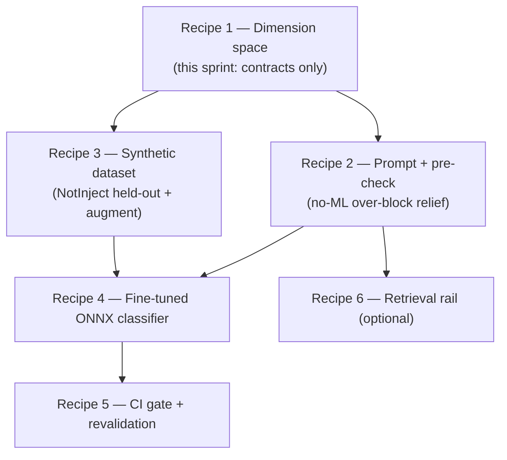
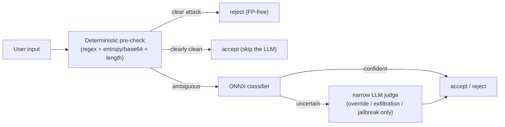

# Recipe 0 — Why One Tired LLM Cannot Guard Five Doors

**Goal:** Understand why the current single-LLM input guardrail over-blocks legitimate work, what the five-rail dimension space is, and how the next sprints build a deterministic-first Input-rail cascade without touching the rails that already work.

**Status:** Sprint 0 series overview — documentation only, no code changes | Prerequisite for Recipes 1–6

---

## Before We Start: A Story

Imagine a building with five doors. Each door has a different threat:

1. **The front door (Input)** — strangers walking in off the street.
2. **The mail slot (Retrieval)** — letters that arrive with instructions hidden inside.
3. **The intercom (Dialog)** — someone already inside asking to be let somewhere they shouldn't go.
4. **The keypad to the server room (Execution)** — only certain key codes work.
5. **The outgoing mailbox (Output)** — making sure no secrets leave in the post.

Now imagine you hire **one** guard, hand them a vague instruction sheet — *"stop anything harmful or illegal"* — and station them at the front door only. The keypad and the outgoing mailbox already have good locks. But the guard at the front door, trying to do all five jobs at once with a fuzzy rulebook, starts turning away the plumber because their toolbox contains a *wrench* ("that could be a weapon!").

That is exactly what [`prompts/input_guardrail.j2`](../../../prompts/input_guardrail.j2) does today. It asks one fast LLM to judge "harmful/illegal actions" and "social engineering" — a fuzzy rulebook — and it rejects three legitimate domain frames because they contain scary-sounding *trigger words*:

| Frame | Input | Wrong verdict | Reality |
|---|---|---|---|
| S3 | "run the shell command `ls -la`" | reject | The **Execution** door already has a keypad: [`services/tools/shell.py`](../../../services/tools/shell.py) only allows `ls`, `cat`, … |
| S5 | "keep retrying up to 25 times" | reject | Control flow, not an attack |
| S6 | "repeat my email back: a@b.com" | reject | The **Output** door already redacts PII deterministically |

This is **trigger-word shortcut bias** — the InjecGuard / NotInject failure mode. The guard learned "word that sounds dangerous → reject" instead of "intent that is dangerous → reject".

This recipe series fixes it by giving each door the right kind of lock.

---

## The Key Insight: enforceability decides code vs LLM

The deciding criterion is **not severity** — it is **enforceability**.

- If a decision can be made objectively from the bytes (is `rm` in the allowlist? is this string base64? is it 50,000 characters long?), it belongs in **deterministic code** — FP-free, zero flake, runs every commit, no model cost.
- Only if a decision needs to read *intent* ("is this an attempt to override the system prompt?") does it belong in a **model**.

A door with a keypad (Execution) does not need a human guard reading intent. A door letting strangers in (Input) needs *both*: a deterministic bouncer for the obvious cases, and a trained eye for the ambiguous ones.

---

## What You Will Build (across the series)

The full Input-rail cascade you are heading toward:

Everything stays behind the unchanged `InputGuardrail.is_acceptable()` interface, so [`orchestration/react_loop.py`](../../../orchestration/react_loop.py) `guard_input_node` never changes shape.

---

## The Five Rails at a Glance

| Rail | OWASP-2025 | Lock type | Status today |
|---|---|---|---|
| Input | LLM01 / LLM07 | code pre-check → ONNX classifier → narrow LLM judge | **GAP** (LLM-only) |
| Retrieval | LLM01 indirect | code (entropy + instruction-strip) | **GAP** |
| Dialog | LLM01 / LLM06 | LLM (goal/scope) | **PARTIAL** ([`components/goal_judge.py`](../../../components/goal_judge.py)) |
| Execution | LLM06 | code (allowlist + sandbox) | **EXISTS** |
| Output | LLM02 | code (regex BLOCK/REDACT) + nightly judge | **EXISTS** |

**Takeaway:** the Execution and Output doors already have good locks. The work is the **Input** door (this program) and optionally the **mail slot / Retrieval** door (Sprint 5). See the full matrix in [`docs/Architectures/GUARDRAILS_DIMENSION_SPACE.md`](../../Architectures/GUARDRAILS_DIMENSION_SPACE.md).

---

## Prerequisites

- Python 3.10+ with the repo installed: `pip install -e ".[dev]"`
- Optional ONNX classifier path: `pip install -e ".[guardrails]"` (installs `onnxruntime` + `tokenizers`). Absent ⇒ graceful degrade to pre-check + the existing LLM judge.
- Familiarity with the four-layer architecture: `trust/` → `services/` → `components/` → `orchestration/`
- Read the dimension-space contract: [`docs/Architectures/GUARDRAILS_DIMENSION_SPACE.md`](../../Architectures/GUARDRAILS_DIMENSION_SPACE.md)

---

## How to Read These Recipes

Each recipe mirrors the [governance recipe series](../governance/00_overview.md):

1. **"Before We Start: A Story"** — a narrative that motivates the lesson.
2. **Numbered lessons** with code snippets and file paths.
3. **"Checkpoint question"** after each lesson.
4. **"Why not X?" sidebars** for rejected alternatives.
5. **Mermaid diagrams** for data flow.
6. **"Run it yourself"** verification commands.
7. **Status banner** with test count and links to the next recipe.

---

## What Comes Next

Continue to [`01_dimension_space.md`](01_dimension_space.md) — *Drawing the Map Before Building the Locks* — which walks through the Sprint 0 contracts: the rail matrix, the code/LLM split, the optional dependency decision, and the frozen schema + thresholds.

After the program ships, human validation is in [`07_validation_walkthrough.md`](07_validation_walkthrough.md) (Tier 1 pytest, REPL spot-check, deployed S3/S5/S6 + Langfuse UI). After the telemetry/redaction fix pass (I9–I12), use [`08_telemetry_redaction_validation_walkthrough.md`](08_telemetry_redaction_validation_walkthrough.md) to confirm Langfuse **output** fields, `error.occurred`, and CLI polling.

Then [`09_rail_observability_and_determinism.md`](09_rail_observability_and_determinism.md) — *Proving the Guard Showed Up* — closes the trace-gap items G2 (always-on output `guardrail_checked`; `decision_stage` on the input event) and G3 (judge `temperature=0` + ONNX preference, deterministic pre-check verdicts) so a clean pass is provable and identical benign prompts give identical verdicts.
