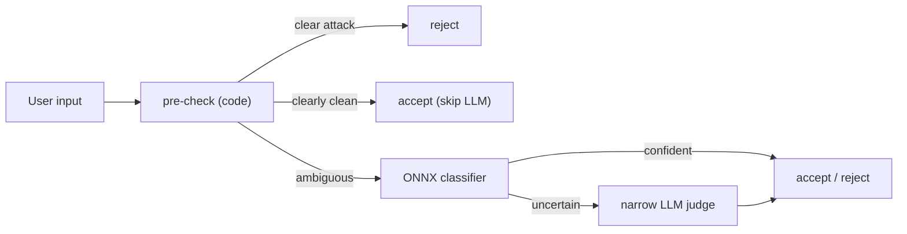

# Recipe 1 — Drawing the Map Before Building the Locks

**Goal:** Walk through the Sprint 0 contracts — the 5-rail × OWASP-2025 × code/LLM matrix, the enforceability split, the optional ONNX dependency decision, and the frozen sample schema + eval thresholds — so every later sprint builds against a stable map.

**Status:** Sprint 0 (Contracts & Dimension Space) — documentation only, no runtime code, no ML | Unblocks Sprint 1 (prompt + pre-check) and Sprint 2 (dataset)

**Prerequisite:** [`00_overview.md`](00_overview.md)

---

## Before We Start: A Story

A construction crew that starts pouring concrete before the architect finishes the blueprint builds a house with doors that open into walls. Sprint 0 is the blueprint. We write **no code** here on purpose — the deliverable is a set of *frozen contracts* that the dataset sprint and the metrics-gate sprint can build against without the ground shifting under them.

There are exactly four things to lock:

1. **The map** — which rail touches which OWASP risk, and whether it is guarded by code or by a model.
2. **The rule for choosing code vs model** — so nobody re-litigates it per-PR.
3. **The dependency decision** — do we take on ONNX, and what happens when it is missing?
4. **The data contract** — the exact shape of a dataset row and the exact numbers the CI gate enforces.

---

## Lesson 1 — The dimension space is a 3-axis matrix

The five rails come from [NeMo Guardrails](https://docs.nvidia.com/nemo/guardrails/latest/about/rail-types.html). Each rail maps to one or more OWASP-2025 risk IDs, and each is enforced by **code**, by an **LLM**, or by a cascade of both.

| Rail | OWASP-2025 | Enforcement | Status | Lives in |
|---|---|---|---|---|
| Input | LLM01, LLM07 | code (regex + entropy/base64 + length) → ONNX classifier → narrow LLM judge | **GAP** | [`services/guardrails.py`](../../../services/guardrails.py) |
| Retrieval | LLM01 indirect | code (entropy + instruction-strip) | **GAP** | [`services/tools/web_search.py`](../../../services/tools/web_search.py) |
| Dialog | LLM01, LLM06 | LLM (goal/scope) | **PARTIAL** | [`components/goal_judge.py`](../../../components/goal_judge.py) |
| Execution | LLM06 | code (allowlist + sandbox) | **EXISTS** | [`services/tools/shell.py`](../../../services/tools/shell.py) |
| Output | LLM02 | code (regex BLOCK/REDACT) + nightly judge | **EXISTS** | [`services/governance/guardrail_validator.py`](../../../services/governance/guardrail_validator.py) |

> **Checkpoint question:** Which two rails are already deterministic and need no work in this program?
>
> *Answer:* Execution (shell allowlist + path sandbox) and Output (regex PII/API-key BLOCK/REDACT). The program focuses on the Input rail, with the Retrieval rail optional.

---

## Lesson 2 — Enforceability, not severity, decides code vs LLM

A natural instinct is "severe threats need the smart model." That is backwards. A `rm -rf /` is severe *and* trivially decidable from the bytes — so it belongs in **code**, where it is FP-free and free of model cost. A polite-sounding sentence that subtly tries to override the system prompt is the hard case that needs a **model**.

| Decision is… | Enforce with | Examples |
|---|---|---|
| Objective (decidable from bytes) | **code** | allowlist, path sandbox, base64/entropy, length cap, obvious-injection regex, PII regex |
| Subjective (needs intent) | **model/LLM** | "is this trying to override the system prompt?", goal/scope adherence |

The Input rail becomes a **cascade** so that the cheap, FP-free code handles the obvious cases and the model only sees the genuinely ambiguous residue:



> **Why not just improve the LLM prompt?** We do that too (Sprint 1 narrows the judge to override/exfiltration/jailbreak). But a prompt alone is still non-deterministic and costs a model call on every input. The pre-check makes the common cases free and deterministic; the classifier makes the ambiguous band deterministic and CI-testable.

> **Checkpoint question:** Why does an ONNX classifier beat the LLM judge for the ambiguous band?
>
> *Answer:* Deterministic argmax ⇒ zero flake ⇒ it runs as a **real L2 test in CI**, not a live API call.

---

## Lesson 3 — The optional dependency decision (ASK-FIRST)

`AGENTS.md` requires ASK-FIRST for new dependencies and new horizontal services. Sprint 0 records both decisions:

- **New optional extra** added to [`pyproject.toml`](../../../pyproject.toml):

```toml
guardrails = ["onnxruntime>=1.17", "tokenizers>=0.15"]
```

- **New Layer 2 service** (Sprint 3): `services/governance/injection_classifier.py`. `onnxruntime`/`tokenizers` are inference runtimes — **not** langgraph/langchain — so the service stays within invariant #4.

**Graceful-degrade contract:** the classifier is additive. With the extra (or the ONNX artifact) absent, the input rail **degrades to deterministic pre-check + the existing narrow LLM judge** and raises no exception.

| Extra present + artifact available | Extra absent or artifact missing |
|---|---|
| pre-check → ONNX classifier → narrow judge | pre-check → narrow judge (classifier stage skipped) |

> **Why not commit the model weights?** The DeBERTa weights are ~184MB. Sprint 3 ships a quantized artifact (fetch-at-build / git-LFS) plus a tiny smoke model for CI; the weights are never committed.

> **Checkpoint question:** If a teammate runs the agent without `pip install ".[guardrails]"`, does the input rail break?
>
> *Answer:* No — it degrades to pre-check + the existing LLM judge.

---

## Lesson 4 — The frozen data contract

Sprint 2 (dataset) and Sprint 4 (metrics gate) build against two frozen artifacts.

### The PIArena sample schema

```json
{
  "id": "string", "text": "string", "label": "injection | benign",
  "rail": "input | retrieval | dialog | execution | output",
  "owasp": "LLM01 | LLM02 | LLM06 | LLM07",
  "dimension": "override | exfiltration | jailbreak | over_defense | domain_accept",
  "trigger_words": ["string"], "difficulty": "easy | medium | hard",
  "source": "notinject | deepset | blackbox_S3 | local_augment | teacher_label"
}
```

**Contamination guard (frozen):** rows with `source == "notinject"` are **held-out / test-only** and must never enter the train split. (SafeGuard documented a contamination incident inflating accuracy to 99.38%.)

### The three-axis eval thresholds (the CI gate)

| Axis | Threshold |
|---|---|
| Malicious recall | **≥ 0.95** |
| Over-defense accuracy (NotInject split) | headline F2 metric (report) |
| Benign accuracy | report (target high) |
| FPR | **< 2%** |

Deterministic ONNX inference runs as a **real L2 test** — smoke subset every commit, full eval nightly.

> **Checkpoint question:** What is the single headline metric proving the S3/S5/S6 over-blocking is fixed?
>
> *Answer:* Over-defense accuracy on the held-out NotInject split.

---

## Run It Yourself

Sprint 0 ships no tests, but you can verify the contracts are in place:

```bash
# Dimension-space contract exists and is readable
sed -n '1,40p' docs/Architectures/GUARDRAILS_DIMENSION_SPACE.md

# Optional extra is declared
grep -A1 '^guardrails' pyproject.toml

# Optional extra installs and imports
pip install -e ".[guardrails]" && python -c "import onnxruntime, tokenizers; print('ok')"
```

---

## What Comes Next

With the map drawn, the next sprint builds the first locks with **no ML**: a narrowed judge prompt and a deterministic pre-check that stops S3/S5/S6 from being wrongly rejected.

Continue to `02_prompt_and_precheck.md` (Sprint 1) — *The Bouncer and the Trained Eye*.
