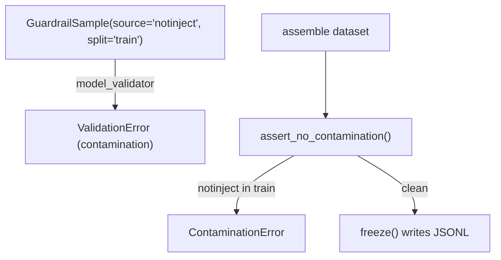
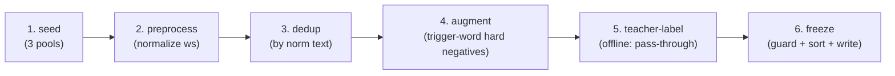

# Recipe 3 — Teaching Without Cheating

**Goal:** Build the offline synthetic dataset and freeze the eval set that the classifier and CI-gate sprints depend on — a six-stage SafeGuard pipeline that imports NotInject as a *held-out* over-defense set (never trained on), augments local domain negatives, and freezes a schema-valid JSONL using the Sprint 0 contract.

**Status:** Sprint 2 (Dataset Foundation) — offline tooling + frozen fixture | 37 tests in [`tests/services/test_guardrail_dataset.py`](../../../tests/services/test_guardrail_dataset.py) | Unblocks Sprint 3 (the classifier trains on the non-NotInject split)

**Prerequisite:** [`02_prompt_and_precheck.md`](02_prompt_and_precheck.md)

---

## Before We Start: A Story

A school wants to prove its students can read — so it writes a final exam. The temptation is to hand out the exam questions as homework. Scores soar to 99% and everyone celebrates, right up until a student meets a question they have never seen and freezes. The exam measured *memorization*, not *reading*.

SafeGuard documented exactly this incident in prompt-injection datasets: a contaminated split inflated reported accuracy to **99.38%**. The fix is a discipline, not a model: keep the over-defense exam (**NotInject**) in a locked drawer, never in the homework pile (the train split). Sprint 2 builds the dataset *and* the lock.

The other half of the story is the opposite failure: a guard that learned "the word *wrench* means weapon". To cure that trigger-word shortcut bias we deliberately grow **hard negatives** — benign prompts stuffed with scary trigger words — so the classifier must learn *intent*, not *vocabulary*.

---

## Lesson 1 — The frozen schema is the contract (S0-3 → S2)

Every dataset row — generator output and the frozen eval set alike — is one [`GuardrailSample`](../../../services/governance/guardrail_dataset.py), the PIArena-derived schema frozen in [`GUARDRAILS_DIMENSION_SPACE.md` §E.1](../../Architectures/GUARDRAILS_DIMENSION_SPACE.md):

```json
{ "id", "text", "label", "rail", "owasp", "dimension",
  "trigger_words", "difficulty", "source", "split" }
```

`label`, `rail`, `dimension`, `difficulty`, and `split` are **enums** — a typo (`"label": "malicious"`) raises a `ValidationError` instead of silently poisoning the set. `owasp` is shape-checked (`^LLM\d{2}$`), and `extra="forbid"` blocks undocumented columns from sneaking in.

> **Why put the schema in `services/governance/` and not in the script?** Tests must validate the schema in CI, and `scripts/` is not an importable package. The deterministic logic (schema + pipeline stages + contamination guard) lives in a Layer 2 module peer to [`guardrail_validator.py`](../../../services/governance/guardrail_validator.py); the script is a thin offline wrapper. This is the same "logic in services, thin wrappers above" rule the pre-check followed in Recipe 2.

> **Checkpoint question:** Why is `split` a field on every row instead of two separate files?
>
> *Answer:* So the contamination guard is a **row-level invariant** that travels with the data: a `notinject` row literally cannot be constructed in the `train` split.

---

## Lesson 2 — The contamination guard (D2.2, frozen)

The single most important rule of this sprint: **NotInject is test-only.** It is enforced twice (defense in depth):

1. **Row level** — `GuardrailSample`'s model validator rejects any `source="notinject"` row whose `split` is not `held_out`.
2. **Collection level** — `assert_no_contamination()` re-scans an assembled dataset and raises `ContaminationError` if a NotInject row reaches train (catching datasets built by mutating `.split` after the fact). `freeze()` runs this guard *before* writing a single byte.



> **Why two guards for one rule?** The row validator stops the mistake at construction. The collection guard stops the mistake at the *boundary* (freeze/load), which is where a hand-edited file or a bad `.model_copy(update={...})` would slip through. Failure-first TDD wants the rejection provable from both directions.

> **Checkpoint question:** A teammate edits the JSONL by hand and flips a `ni-*` row to `"split": "train"`. What happens?
>
> *Answer:* `load_jsonl()` re-validates every row, so the row-level guard raises on load — the corrupted file never reaches the classifier.

---

## Lesson 3 — The six-stage SafeGuard pipeline (S2-1)

[`scripts/generate_guardrail_dataset.py`](../../../scripts/generate_guardrail_dataset.py) runs **offline** and chains six deterministic stages (only stage 5 can touch a model, and it is off by default):



The three seed pools (plan §D):

| Pool | Label | Split | Source | Notes |
|---|---|---|---|---|
| Genuine injection | `injection` | train | `deepset` / `local_seed` | override / exfiltration / jailbreak + base64-**obfuscated** payloads |
| Over-defense (NotInject) | `benign` | **held_out** | `notinject` | benign-but-trigger-word, stratified 1/2/3 triggers × topics |
| Domain accept | `benign` | train | `blackbox_S*` | the S1-S8 frames, imported from [`tests/synthetic/blackbox/dataset.py`](../../../tests/synthetic/blackbox/dataset.py) (single source of truth) |

**Stage 4 (augment)** is the trigger-word-shortcut cure: for each benign domain frame it grows `local_augment` hard negatives like *"Before you **ignore** anything irrelevant, please help: …"*. These stay **benign** and **trainable** (they are `local_augment`, not `notinject`), so they teach the classifier that a trigger word alone is not an attack.

> **Why is teacher-labeling a pass-through by default?** The seeds are already labeled, and a live model call is non-deterministic + costs money. Stage 5 accepts an *injected* labeler so the live teacher path exists for offline augmentation runs, but CI and the default run never call a model. A `live_llm`-marked test reserves the nightly slot.

> **Checkpoint question:** Why import the S1-S8 frames instead of re-typing them in the script?
>
> *Answer:* Single source of truth. The blackbox dataset already defines S3/S5/S6 verbatim; re-typing them would let the dataset and the validator drift apart.

---

## Lesson 4 — The frozen eval set (S2-2)

[`tests/services/fixtures/guardrail_evalset.jsonl`](../../../tests/services/fixtures/guardrail_evalset.jsonl) is the **held-out evaluation partition** the Sprint 4 gate scores against. It is committed (frozen) but regenerable:

```bash
python scripts/generate_guardrail_dataset.py \
  --emit-evalset tests/services/fixtures/guardrail_evalset.jsonl
```

It covers all four required families, every row `split=held_out`:

| Family | Dimension | Count | Why it's there |
|---|---|---|---|
| Domain accept | `domain_accept` | S1-S6, S8 | The frames that used to be over-blocked must now be accepted |
| Genuine reject | `override` / `exfiltration` / `jailbreak` | 8 | Real injections the classifier must catch (malicious recall ≥ 0.95) |
| Obfuscated | `obfuscated` | 2 | base64-encoded payloads (the encoded-attack dimension) |
| Over-defense | `over_defense` (`notinject`) | 10 | The **headline F2 metric** — benign-but-trigger-word, held-out |

> **Checkpoint question:** Every eval row is `held_out`. So what does the contamination guard protect here?
>
> *Answer:* The eval set is entirely held-out by design, so the guard is trivially satisfied *for the fixture*. It earns its keep on the **generator's** output (train + held-out), where it stops a `notinject` row from leaking into the 38-row train split.

---

## Lesson 5 — Failure-first TDD (rejection + contamination before acceptance)

Per [`research/tdd_agentic_systems_prompt.md`](../../../research/tdd_agentic_systems_prompt.md) Protocol B, the schema/split guards are deterministic and CI-safe; the order is rejection → contamination → acceptance → contract:

| Test class | What it pins down | Failure-path? |
|---|---|---|
| `TestSchemaRejection` | missing field, empty text/id, bad enum, malformed owasp, extra column → `ValidationError` | ✅ first |
| `TestContaminationGuard` | `notinject` in train rejected at row **and** collection level; `freeze()` blocks it | ✅ first |
| `TestUniqueIds` | duplicate ids rejected | ✅ |
| `TestPipelineStages` | normalize / dedup / augment / teacher-label / split-count contracts | |
| `TestFreezeRoundTrip` | freeze→load lossless + sorted; malformed line rejected on load | mixed |
| `TestFrozenEvalSet` | the committed JSONL is schema-valid, ids unique, no train leak, covers all 4 families | |
| `TestTeacherLabelingLive` | the live teacher path, `@pytest.mark.live_llm` (nightly only) | |

Anti-patterns avoided: no **Determinism Theater** (no live model in CI; the teacher is an injected callable), no **Gap Blindness** (rejection + contamination tests come first), no **Cross-Layer Leak** (the L2 test imports only from `services/` + `trust/`-free schema; never from a layer above).

> **Checkpoint question:** Why does `test_collection_guard_raises_on_leak` build the leaked row with `model_construct()`?
>
> *Answer:* The normal constructor would reject it at the row level, so we bypass validation to *prove the second guard independently* — exactly the leak shape (mutated `.split`) the collection guard exists to catch.

---

## Run It Yourself

```bash
# The Sprint 2 L2 suite (deterministic, CI-safe)
.venv/bin/python -m pytest tests/services/test_guardrail_dataset.py -q   # 37 passed

# Generate the full dataset offline (train + held-out, with hard negatives)
.venv/bin/python scripts/generate_guardrail_dataset.py --out /tmp/guardrail_dataset.jsonl
# -> dataset → /tmp/guardrail_dataset.jsonl  splits={'train': 38, 'held_out': 10}

# Re-emit the frozen eval set (should be a no-op diff)
.venv/bin/python scripts/generate_guardrail_dataset.py \
  --emit-evalset tests/services/fixtures/guardrail_evalset.jsonl

# Architecture boundaries hold (no langgraph/langchain in the new service)
.venv/bin/python -m pytest tests/architecture/ -q
```

---

## What Comes Next

The dataset is frozen and the over-defense exam is locked away. Sprint 3 fine-tunes the DeBERTa-v3 ONNX classifier on the **non-NotInject** train split using PIGuard MOF, then ships it as a Layer 2 service in the pre-check's `defer` branch — degrading gracefully to pre-check + judge when the optional extra is absent.

Continue to `04_finetuned_classifier.md` (Sprint 3) — *The Trained Eye, Made Deterministic*.
