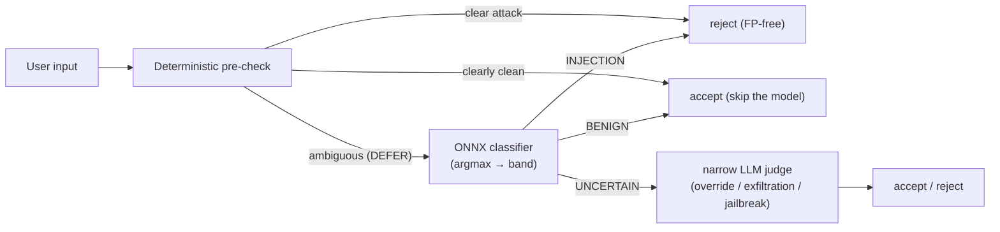
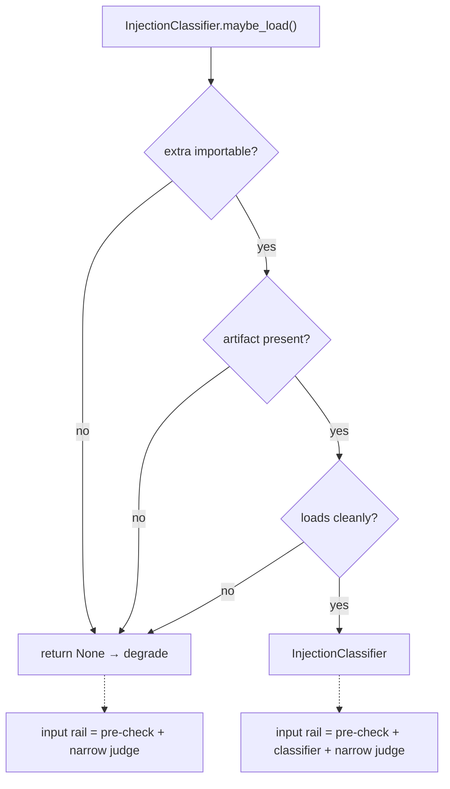

# Recipe 4 — The Trained Eye, Made Deterministic

**Goal:** Add the *model* stage of the Input-rail cascade — a fine-tuned DeBERTa-v3 injection classifier exported to a **quantized ONNX** artifact — and ship it as a Layer 2 service that runs **deterministic argmax inference** behind the unchanged `InputGuardrail.is_acceptable()` interface, degrading gracefully to pre-check + the narrow LLM judge when the optional extra or the artifact is absent.

**Status:** Sprint 3 (Fine-Tuned Classifier) — offline training + Layer 2 service | failure-first L2 tests in [`tests/services/test_injection_classifier.py`](../../../tests/services/test_injection_classifier.py) + [`tests/services/test_train_injection_classifier.py`](../../../tests/services/test_train_injection_classifier.py) | Unblocks Sprint 4 (the three-axis CI gate scores this classifier)

**Prerequisites:** [`02_prompt_and_precheck.md`](02_prompt_and_precheck.md) (the pre-check cascade slot) and [`03_synthetic_dataset.md`](03_synthetic_dataset.md) (the frozen train split)

---

## Before We Start: A Story

The deterministic bouncer from Recipe 2 is fast and never wrong about the *obvious* cases — a door-kicker is turned away, a polite visitor walks in. But the bouncer has no opinion about the ambiguous middle: the person muttering something that *might* be a threat. For that you want a **trained eye** — a guard who has studied thousands of real attempts and learned what *intent* looks like, not just which words sound scary.

The catch: the obvious choice for that trained eye, an LLM judge, has a different flaw — it answers *slightly differently every time you ask*. You cannot put a coin-flip in a CI gate. So Sprint 3 hires a trained eye that is also **perfectly repeatable**: a fine-tuned classifier frozen into an ONNX graph. Same input, same logits, same verdict, forever. That determinism is what lets it run as a *real* test on every commit instead of a flaky nightly API call.

And we train it with one rule from Recipe 3 burned in: it **never sees the NotInject exam**, and it is force-fed benign-but-scary hard negatives so it learns intent over vocabulary.

---

## Lesson 1 — Where the classifier sits (the DEFER branch)

The cascade has not changed shape since Recipe 2 — we are filling in the box the pre-check left open:



In code, the whole addition is one new branch inside the unchanged interface — [`services/guardrails.py`](../../../services/guardrails.py):

```297:314:services/guardrails.py
    async def _classify_then_judge(self, prompt: str) -> tuple[bool, str]:
        """Cascade stages 2-3 for the ambiguous (DEFER) band.

        Stage 2 — ONNX classifier (deterministic), when one is loaded: a
        confident verdict (INJECTION/BENIGN) decides without an LLM call; only
        the UNCERTAIN band falls through. Stage 3 — narrow LLM judge for the
        residual subjective band (or directly, when no classifier is present —
        the graceful-degrade path).
        """
        from services.governance.injection_classifier import ClassifierBand

        if self._classifier is not None:
            verdict = self._classifier.classify(prompt)
            if verdict.band is ClassifierBand.INJECTION:
                return False, "classifier:injection"
            if verdict.band is ClassifierBand.BENIGN:
                return True, "classifier:benign"
            # UNCERTAIN → defer to the narrow judge.
```

> **Checkpoint question:** Why does the classifier only run on the `DEFER` band and not on every input?
>
> *Answer:* The pre-check already decides the clear cases FP-free and *for free*. Running a model on a prompt the bouncer already accepted/rejected would add cost and risk re-introducing the trigger-word over-block we are trying to kill. The model earns its keep only on the ambiguous residue.

---

## Lesson 2 — Deterministic argmax beats a flaky judge

[`services/governance/injection_classifier.py`](../../../services/governance/injection_classifier.py) is a Layer 2 service peer to `guardrail_validator.py`. Inference is `tokenize → ONNX run → softmax → P(injection)`, then a **pure** three-way band decision:

```python
def decide_band(injection_probability, *, reject_threshold=0.80, accept_threshold=0.20):
    if injection_probability >= reject_threshold:
        return ClassifierBand.INJECTION   # confident → reject
    if injection_probability <= accept_threshold:
        return ClassifierBand.BENIGN      # confident → accept
    return ClassifierBand.UNCERTAIN       # → defer to the narrow judge
```

`decide_band` has no I/O and no ONNX on its path, so it is unit-tested on **every commit** regardless of whether the optional extra is installed. The ONNX run itself is a pure function of the input bytes (frozen weights, argmax), so the full inference path is a **real L2 test**, not a `live_llm` one — exactly the determinism win the [TDD methodology](../../../research/tdd_agentic_systems_prompt.md) Anti-Pattern 3 (*Determinism Theater*) and Anti-Pattern 5 (*Live LLM in CI*) call for.

> **Why a band, not a single threshold?** A single cut-point forces a binary accept/reject and throws away the judge. The band reserves the *uncertain middle* for the subjective judge — code decides what code can decide, the model decides intent (the §B enforceability split).

---

## Lesson 3 — Graceful degrade: the rail must work with no model

The classifier is **optional and additive**. The `guardrails` extra (`onnxruntime` + `tokenizers`) and the ~184MB ONNX artifact are both optional, so `maybe_load()` returns `None` — *never raises* — when either is missing ([`GUARDRAILS_DIMENSION_SPACE.md` §D](../../Architectures/GUARDRAILS_DIMENSION_SPACE.md)):



Orchestration wires it in with one defaulted argument, so [`orchestration/react_loop.py`](../../../orchestration/react_loop.py) `guard_input_node` keeps its shape — in the default checkout (no artifact) it transparently runs the Recipe 2 cascade:

```python
guardrail = InputGuardrail(
    ...,
    classifier=InjectionClassifier.maybe_load(),  # None in a default checkout → degrade
)
```

> **Checkpoint question:** A teammate runs the agent on a box without `onnxruntime`. What happens at the input rail?
>
> *Answer:* `maybe_load()` sees the extra is absent, logs an info line, and returns `None`. The guardrail falls back to *pre-check + narrow judge* — no exception, no behavior surprise. The classifier stage is simply skipped.

---

## Lesson 4 — Training without cheating (PIGuard MOF, NotInject held-out)

[`scripts/train_injection_classifier.py`](../../../scripts/train_injection_classifier.py) is **offline only** — the heavy stack (`torch` / `transformers` / `onnx`) is imported *lazily inside functions* so importing the module is CI-safe. It:

1. Loads the frozen dataset and calls `select_train_split()`, which runs the contamination guard and then **defensively drops every `notinject` row** — the trainer can never see the over-defense exam (D3.2).
2. Fine-tunes from `protectai/deberta-v3-base-prompt-injection-v2` with **PIGuard MOF** (*Mitigating Over-defense for Free*): an auxiliary loss that penalizes confident rejection of the benign-but-trigger-word `local_augment` hard negatives, curing trigger-word shortcut bias with no extra labeled attacks.
3. Exports a **quantized ONNX** artifact (`model.onnx` + `tokenizer.json` + `config.json`).

```84:97:scripts/train_injection_classifier.py
def select_train_split(samples: list[GuardrailSample]) -> list[GuardrailSample]:
    """Return the trainable rows: the ``train`` split with NotInject excluded.

    Enforces the frozen contamination guard (``GUARDRAILS_DIMENSION_SPACE.md``
    §E.1 / D3.2) two ways before returning:

    1. :func:`assert_no_contamination` fails loudly if any ``notinject`` row is
       already mislabeled into the train split.
    2. ``notinject``-sourced rows are then defensively dropped regardless of
       split, so the trainer can NEVER see the held-out over-defense set.
    """
```

> **Why never commit the weights?** The DeBERTa artifact is ~184MB. Per §C we ship it via git-LFS / fetch-at-build, and commit **no binary** to the repo. For CI we instead build a tiny **smoke model** on demand.

---

## Lesson 5 — The CI smoke model (real ONNX, no 184MB)

We must prove the *real* ONNX inference path works on every commit, but we cannot commit production weights and the CI venv has no `onnxruntime`. The answer is `build_smoke_artifact()`: a tiny, hand-weighted bag-of-tokens ONNX graph (`logits = Σ_t mask_t · E[id_t]`) plus a minimal WordLevel tokenizer. It is **not** the trained over-defense model — it exists to prove the *plumbing* (tokenize → ONNX run → softmax → band) is deterministic and correct.

The real-inference tests `pytest.importorskip` the extra, so they **self-skip in the default CI venv** (where the degrade path is what runs) and **pass for real** wherever `pip install -e ".[guardrails]"` has been run:

| Test class | What it pins down | Runs in default CI? |
|---|---|---|
| `TestDecideBand` | band thresholds; INJECTION (reject) asserted first | ✅ always |
| `TestGracefulDegrade` | `maybe_load` returns `None` (missing/absent/corrupt) — never raises | ✅ always |
| `TestClassifierCascade` | DEFER→classifier wiring; confident bands skip the judge; pre-check still short-circuits | ✅ always |
| `TestRealOnnxInference` | deterministic argmax; P∈[0,1]; attack>benign; banded verdict | ⏭️ skips without the extra |
| `TestTrainSplitContaminationGuard` | NotInject leak raises; held-out rows excluded (failure-first) | ✅ always |
| `TestLazyHeavyImports` | importing the trainer does not import `torch`/`transformers` | ✅ always |

Anti-patterns avoided: no **Determinism Theater** / **Live LLM in CI** (ONNX argmax is a real deterministic L2 test; the LLM judge is mocked), no **Mock Addiction** (the cascade tests use a tiny stub returning *real* `ClassifierVerdict` objects), no **Gap Blindness** (degrade + contamination rejection tests come first), no **Cross-Layer Leak** (the service imports only stdlib / Pydantic / `onnxruntime` / `tokenizers` / `numpy` — enforced by [`tests/architecture/test_injection_classifier_layer.py`](../../../tests/architecture/test_injection_classifier_layer.py)).

> **Checkpoint question:** The smoke model would *over-defend* on a NotInject prompt containing "ignore". Why is that acceptable here?
>
> *Answer:* The smoke model only proves the inference *plumbing* is deterministic. Over-defense **accuracy** is the headline metric of the *real* artifact, scored by the Sprint 4 three-axis gate — not something the CI smoke model is meant to satisfy.

---

## Run It Yourself

```bash
# Sprint 3 L2 suites — deterministic, CI-safe (ONNX paths self-skip without the extra)
.venv/bin/python -m pytest tests/services/test_injection_classifier.py \
  tests/services/test_train_injection_classifier.py -q

# Architecture boundary: injection_classifier.py stays a Layer 2 service
.venv/bin/python -m pytest tests/architecture/test_injection_classifier_layer.py -q

# With the optional extra installed, the REAL ONNX inference path runs for real:
pip install -e ".[guardrails]"
python scripts/train_injection_classifier.py smoke --out /tmp/smoke_clf
INJECTION_CLASSIFIER_DIR=/tmp/smoke_clf \
  .venv/bin/python -m pytest tests/services/test_injection_classifier.py::TestRealOnnxInference -q

# Offline training (heavy; never CI) — fine-tune + export quantized ONNX
python scripts/generate_guardrail_dataset.py --out /tmp/guardrail_dataset.jsonl
python scripts/train_injection_classifier.py train \
  --dataset /tmp/guardrail_dataset.jsonl --out models/injection_clf
```

---

## What Comes Next

The trained eye is in place and deterministic. Sprint 4 turns the frozen eval set into a **three-axis CI gate** (malicious recall ≥ 0.95, over-defense accuracy on the NotInject split, benign accuracy, FPR < 2%) and re-drives S3/S5/S6 end to end to prove the over-block is fixed.

Continue to `05_ci_gate_and_revalidation.md` (Sprint 4) — *Proving the Door Lets the Plumber In*.
