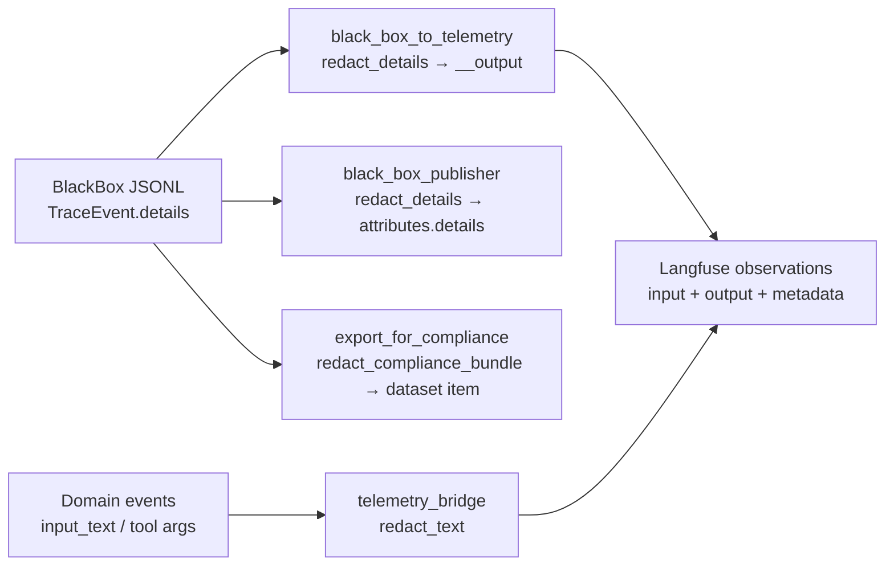

# Recipe 8 — Telemetry Redaction & BlackBox Relay Validation Walkthrough

**Goal:** Step-by-step validation that the **session telemetry fixes** (I9–I12) work end to end: Langfuse observation **`output`** and bridge **`input_text`** are redacted, the CLI **polls for `task.completed`** before asserting, **`error.occurred`** fires on failed tools, and the **`ni-4`** probe expectation matches the FP-free pre-check.

**Audience:** Human executor validating a deploy that includes the guardrails session findings fix pass (2026-06-01).

**Time budget:** ~2–3 hours (offline ~30 min; deployed S3 + S5 + S6 + Langfuse UI ~2 hours).

**Status:** Human validation guide | run **after** [Recipe 7](07_validation_walkthrough.md) input-rail sign-off, or as a focused re-validation when only telemetry/redaction code changed

**Prerequisites:**

- Recipe 7 Tier 1 green (or re-run §1.1–1.2 below)
- Repo installed: `pip install -e ".[dev]"`
- Deployed stack with BlackBox → Langfuse relay enabled (same as [governance Recipe 4](../governance/04_e2e_validation_runbook.md))
- Read issue register entries I9–I12: [`session_issues_register.plan.md`](../../plans/session_issues_register.plan.md)

**Extends (do not duplicate here):**

| Topic | Canonical doc |
| --- | --- |
| Input-rail S3/S5/S6 + `guardrail.checked` | [Recipe 7](07_validation_walkthrough.md) Part 3–4 |
| Langfuse navigation, base observation counts | [governance Recipe 5](../governance/05_manual_langfuse_validation_walkthrough.md) |
| Event mapping + `redact_details()` | [governance Recipe 2](../governance/02_event_mapping.md) |
| BlackBox CLI driver + cookie | [governance Recipe 4](../governance/04_e2e_validation_runbook.md) |
| Root-cause narrative (I9–I12) | [`session_issues_register.plan.md`](../../plans/session_issues_register.plan.md) |

**Tools introduced here:**

- Deployed driver: [`scripts/validate_blackbox_langfuse.py`](../../../scripts/validate_blackbox_langfuse.py) (polls for `task.completed`, then asserts including **output** fields)
- REPL sanity: [`scripts/probe_guardrail.py`](../../../scripts/probe_guardrail.py) (`ni-4` row only)
- Offline redaction chain: `tests/middleware/test_telemetry_redaction.py`

---

## Before We Start: What You Are Proving

Recipe 7 proved **input guardrails** accept legitimate S3/S5/S6 frames. This recipe proves **telemetry does not leak secrets** and **tool failures are visible** in Langfuse.

Two export paths must scrub PII/API keys before Langfuse sees them:



**Failure modes you are hunting:**

| ID | Symptom if broken | Where to look in Langfuse |
| --- | --- | --- |
| I9 | Raw email/key in **`output`** while `input` shows `[REDACTED]` | `task.started` observation |
| I9 | Raw secrets in **`llm.started`** body fields | `input_text` or nested output |
| I10 | CLI prints FAIL, UI trace looks fine | Re-run CLI; confirm `[2/4] Polling for 'task.completed'` |
| I11 | Tool failed but no **`error.occurred`** | S3 after `tool.called`; S5 during retries |
| I12 | `ni-4` pre-check FAIL in REPL | Local only — not a Langfuse check |

You are **not** re-proving the full guardrails program. Run Recipe 7 first unless you are doing a **telemetry-only** hotfix validation.

---

## Part 0 — One-Time Setup

Same environment as [Recipe 7 §0](07_validation_walkthrough.md#part-0--one-time-setup). Minimum for this recipe:

```bash
cd /path/to/agent
source .venv/bin/activate
pip install -e ".[dev]"

export FRONTEND_URL="https://your-app.vercel.app"
export WOS_SESSION_COOKIE="<wos-session cookie>"
export LANGFUSE_PUBLIC_KEY="pk-lf-..."
export LANGFUSE_SECRET_KEY="sk-lf-..."
export LANGFUSE_HOST="https://cloud.langfuse.com"
```

> **Capture:** confirm `FRONTEND_URL` and first 8 chars of each Langfuse key (redact the rest).

**Deploy requirement:** Backend/middleware image must include the fix pass (relay `__output` redaction, bridge `redact_text`, shell `ok=False` on non-zero exit, CLI polling). If you only validated locally, Part 3 will not prove production.

---

## Part 1 — Offline: Redaction & Tool-Error Contracts (~30 min)

Run from repo root. **All commands must end green** before Part 3.

### 1.1 Architecture (telemetry bridge import allowlist)

```bash
python -m pytest tests/architecture/test_middleware_layer.py::TestTelemetryBridgeImportAllowlist -q
```

> **Capture:** `1 passed` — bridge may import `services.governance.black_box_publisher` for shared `redact_text` only.

### 1.2 Publisher + relay redaction unit tests

```bash
python -m pytest tests/services/governance/test_black_box_publisher.py -q -k "Redact or redact_compliance"
python -m pytest tests/middleware/test_telemetry_redaction.py -q
python -m pytest tests/middleware/sidecars/test_e2e_blackbox_pipeline.py -q -k "pii_redacted or api_key_redacted"
```

> **Capture:** all selected tests passed; note counts.

### 1.3 Shell non-zero exit → `ok=False`

```bash
python -m pytest tests/services/test_tools.py::TestExecuteShell -q
```

> **Capture:** `test_nonzero_exit_marks_failure` passed.

### 1.4 `ERROR_OCCURRED` on failed tool result

```bash
python -m pytest tests/orchestration/test_react_loop.py::TestErrorOccurredEmission -q
```

> **Capture:** includes `test_error_occurred_on_failed_tool_result`.

### 1.5 Optional: full architecture + guardrails smoke

If you have not run Recipe 7 today:

```bash
python -m pytest tests/architecture/ tests/services/test_guardrails.py -q
```

### 1.6 Tier 1 sign-off (telemetry slice)

| Check | Command | Pass? |
| --- | --- | --- |
| Bridge allowlist | `TestTelemetryBridgeImportAllowlist` | ☐ |
| Relay/bridge redaction | `test_telemetry_redaction.py` | ☐ |
| Publisher redaction | `test_black_box_publisher.py -k Redact` | ☐ |
| Shell exit code | `TestExecuteShell` | ☐ |
| Error emission | `TestErrorOccurredEmission` | ☐ |

**Stop here if any row fails.**

---

## Part 2 — REPL Sanity: `ni-4` Pre-Check (~5 min)

Confirms I12 (probe/doc alignment). Does not hit Langfuse.

```bash
python scripts/probe_guardrail.py --example ni-4
```

**Expected:**

- `precheck.verdict = accept`
- `expect_precheck = accept → PASS`
- `expect_cascade = accept → PASS` (precheck-only path)

> **Capture:** full `ni-4` block shows both `PASS` lines.

| Check | Result | Pass? |
| --- | --- | --- |
| `ni-4` pre-check `accept` | | ☐ |
| `ni-4` cascade `accept` | | ☐ |

---

## Part 3 — Deployed E2E: S3, S5, S6 (~2 hours)

Same scenarios as Recipe 7, but the CLI now **polls up to ~30s** for `task.completed` before assertions (fixes I10 false FAILs).

### 3.1 Run the CLI driver

```bash
python scripts/validate_blackbox_langfuse.py \
  --frontend-url "$FRONTEND_URL" \
  --cookie-env WOS_SESSION_COOKIE \
  --scenario S3

python scripts/validate_blackbox_langfuse.py \
  --frontend-url "$FRONTEND_URL" \
  --cookie-env WOS_SESSION_COOKIE \
  --scenario S5

python scripts/validate_blackbox_langfuse.py \
  --frontend-url "$FRONTEND_URL" \
  --cookie-env WOS_SESSION_COOKIE \
  --scenario S6
```

**What to expect in the terminal:**

1. `[1/4]` — run completes; `trace_id` printed.
2. `[2/4] Polling for 'task.completed' (up to 15 attempts, 2.0s apart)...` — not a blind 5s sleep.
3. `[3/4]` — assertion lines; for **S6**, redaction lines must **PASS** (scans `input`, `metadata`, and **`output`**).
4. `[4/4]` — UI checklist text.

> **Capture:** three `trace_id` values and whether S6 redaction assertions printed `[PASS]`.

If `[2/4]` warns that `task.completed` was not seen, wait 20s and re-run `[3/4]` manually in Langfuse, or re-run the scenario — relay may be slow.

### 3.2 Automated assertion expectations

| Scenario | Must include (automated) | Telemetry-specific |
| --- | --- | --- |
| S3 | `tool.called`, `error.occurred` (ERROR), `task.completed` | `error.occurred` present (I11) |
| S5 | `error.occurred`, `task.completed` | At least one `error.occurred` (I11) |
| S6 | redaction strings absent from trace bodies | Uses `_serialize_observations_metadata` **with output** (I9) |

**Guardrail rows** (`guardrail.checked`, `accepted: true`) — still required; see [Recipe 7 §4](07_validation_walkthrough.md#part-4--langfuse-ui-checklists-guardrail-specific).

---

## Part 4 — Langfuse UI: Redaction & Error Deep-Dive

Open `https://cloud.langfuse.com` (or `LANGFUSE_HOST`) → **Traces** →  
`https://cloud.langfuse.com/trace/<trace_id>`.

Use **Ctrl+F / Cmd+F** on the **whole trace page** (not only one panel). Search for the **canonical test strings** from S6:

- `alice.smith@example.com`
- `sk-proj-abc123def456ghi789jkl012mno345pqrstu678vwx`

These must **never** appear raw anywhere on the trace after the fix pass.

---

### 4.1 All scenarios — `task.started` output field (I9)

This was the primary leak: `metadata`/`input` redacted but **`output`** showed raw `task_input`.

1. Open the trace (S6 is the strictest; repeat on S3/S5 if time permits).
2. Click observation **`task.started`** (type **agent**).
3. Expand **Input**, **Output**, and **Metadata** (labels vary slightly by Langfuse UI version).

| Check | What to verify | Pass? |
| --- | --- | --- |
| **R1.1** | **Output** (or `details` inside output) does **not** contain raw email or `sk-proj-abc123...` | ☐ |
| **R1.2** | **Output** shows `[REDACTED]` (or redacted substrings) where secrets were | ☐ |
| **R1.3** | **Input** / metadata `details` are also redacted (regression guard) | ☐ |
| **R1.4** | Page-wide Ctrl+F for `alice.smith@example.com` → **0 matches** | ☐ |
| **R1.5** | Page-wide Ctrl+F for full `sk-proj-abc123...` key → **0 matches** | ☐ |

**FAIL signal:** `[REDACTED]` in metadata but literal `alice.smith@example.com` in **Output** — classic I9.

---

### 4.2 S6 — generation / LLM bodies (I9 bridge path)

Domain-event bridge exports `llm.started` / `llm.finished` on some deployments. If present:

1. Find **`llm.started`** or **`step.executed`** / generation observations.
2. Inspect fields named **`input_text`**, **Input**, or nested **content** in **Output**.

| Check | Pass? |
| --- | --- |
| **R2.1** | No raw email/key in `input_text` (or equivalent) | ☐ |
| **R2.2** | Long system+user prompt tails do not expose secrets past 200 chars | ☐ |

**Note:** BlackBox-only paths still redact via `attributes.details`; bridge paths use `redact_text`. Both must pass on S6.

---

### 4.3 S3 — tool failure + `error.occurred` (I11)

**Input:** `Run the shell command cat /nonexistent_file_abc123.txt ...`

| Check | Pass? |
| --- | --- |
| **R3.1** | `tool.called` present (shell ran) | ☐ |
| **R3.2** | **`error.occurred`** present, level **ERROR** | ☐ |
| **R3.3** | Open `error.occurred` → metadata mentions tool failure (`exit code`, `tool_execution`, or similar) | ☐ |
| **R3.4** | `task.completed` present (recovery — not blocked at input) | ☐ |
| **R3.5** | Recipe 7 **G3.2** `guardrail.checked` accepted | ☐ |

Cross-check [governance S3 §3.3–3.4](../governance/05_manual_langfuse_validation_walkthrough.md#s3--tool-error--recovery).

**FAIL signal:** failure only visible inside LLM tool-result text, no `error.occurred` span.

---

### 4.4 S5 — repeated failures + `error.occurred` (I11)

**Input:** `Execute the shell command exit 1 repeatedly ...`

| Check | Pass? |
| --- | --- |
| **R4.1** | At least one **`error.occurred`**, level **ERROR** | ☐ |
| **R4.2** | Multiple `error.occurred` spans acceptable (retries) | ☐ |
| **R4.3** | `task.completed` present | ☐ |
| **R4.4** | Recipe 7 **G5.2** input accepted | ☐ |

**Known gap (I2, out of scope here):** `task.completed` may still show `outcome: success` even when the task did not succeed. Record in sign-off; do not fail this recipe for I2 alone.

Dataset expectation: **`agent-incident-replay`** — see Recipe 7 G5.6.

---

### 4.5 S6 — compliance dataset redaction (I9 dataset path)

1. **Datasets** → **`agent-compliance-audit`**.
2. Open the item linked to the S6 `trace_id` / `workflow_id`.

| Check | Pass? |
| --- | --- |
| **R5.1** | Item exists for S6 trace | ☐ |
| **R5.2** | Browse bundled `events` → `details` — no raw email/key | ☐ |
| **R5.3** | `hash_chain_valid` score on trace = **1.0** | ☐ |

---

### 4.6 Per-scenario telemetry sign-off

| Scenario | trace_id | R1 output redacted | R3/R4 error.occurred | Ctrl+F 0 raw secrets | Result |
| --- | --- | --- | --- | --- | --- |
| S3 | | ☐ | ☐ | n/a | |
| S5 | | ☐ | ☐ | n/a | |
| S6 | | ☐ | n/a | ☐ | |

---

## Part 5 — Final Sign-Off Table

| Section | Evidence | Result |
| --- | --- | --- |
| Part 1 offline | pytest summary (§1.6 all rows) | PASS / FAIL |
| Part 2 `ni-4` REPL | `expect_precheck → PASS` | PASS / FAIL |
| Deployed S3 | trace_id: | PASS / FAIL |
| Deployed S5 | trace_id: | PASS / FAIL |
| Deployed S6 | trace_id: | PASS / FAIL |
| Langfuse R1–R5 | §4 checklists | PASS / FAIL |
| CLI polling (I10) | Saw `[2/4] Polling for 'task.completed'` | PASS / FAIL |
| S6 automated redaction | CLI `[PASS]` redaction lines | PASS / FAIL |

**Overall PASS** when:

- Part 1 and Part 2 green,
- S6 has **zero** raw secret matches on Ctrl+F (input, metadata, **and output**),
- S3 and S5 show **`error.occurred`** at ERROR level,
- S6 CLI redaction assertions pass.

**Overall FAIL** if any raw PII/key appears on the trace page, or S3 lacks `error.occurred` after a failed shell tool.

---

## Troubleshooting

| Symptom | Likely cause | What to do |
| --- | --- | --- |
| Raw secret in `task.started` **Output** only | Deploy without I9 relay fix | Confirm image/git has `redact_details` on `__output`; re-deploy |
| Raw secret in `input_text` on `llm.started` | Bridge not deployed | Confirm `telemetry_bridge` uses `redact_text`; re-run Part 1.2 |
| CLI FAIL, UI trace OK | Polled too early (old CLI) or slow relay | Use fixed CLI (`poll_for_observation`); wait and re-run scenario |
| CLI PASS, UI shows raw secret | Assertion gap before fix | Upgrade to build that scans **output**; re-run S6 |
| No `error.occurred` on S3 | Shell still returns `ok=True` on exit 1 | Confirm `execute_shell` + `react_loop` I11 fix deployed |
| `ni-4` pre-check FAIL | Stale probe | Pull latest; `expect_precheck` must be `accept` |
| S6 input rejected | Input rail regression | See [Recipe 7 troubleshooting](07_validation_walkthrough.md#troubleshooting) |
| `401` from BFF | Expired cookie | Re-copy `wos-session` |

---

## References

- Parent validation: [Recipe 7 — Guardrails validation walkthrough](07_validation_walkthrough.md)
- Issue register I9–I12: [`session_issues_register.plan.md`](../../plans/session_issues_register.plan.md)
- Redaction implementation: [`services/governance/black_box_publisher.py`](../../../services/governance/black_box_publisher.py) (`redact_text`, `redact_details`, `redact_compliance_bundle`)
- Relay: [`middleware/sidecars/black_box_to_telemetry.py`](../../../middleware/sidecars/black_box_to_telemetry.py)
- Bridge: [`middleware/telemetry_bridge.py`](../../../middleware/telemetry_bridge.py)
- Assertions: [`tests/synthetic/blackbox/langfuse_assertions.py`](../../../tests/synthetic/blackbox/langfuse_assertions.py)
- Scenarios S3/S5/S6: [`tests/synthetic/blackbox/dataset.py`](../../../tests/synthetic/blackbox/dataset.py)
